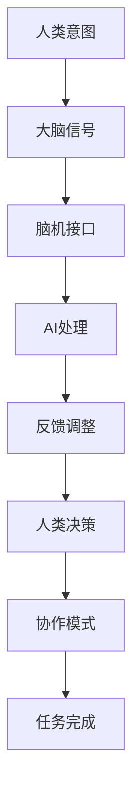

                 

### 关键词 Keyword
- 人类-AI协作
- 智力增强
- 脑机接口
- 人工智能应用
- 知识图谱
- 大数据

### 摘要 Abstract
本文探讨人类与人工智能（AI）的协作模式，旨在通过先进的AI技术提升人类的智力水平。文章首先介绍AI与人类智力增强的背景和重要性，接着详细阐述人类-AI协作的核心概念及其在现实世界中的应用。随后，文章剖析了AI算法原理、数学模型，并提供了具体的代码实例和实践案例。最后，文章探讨了AI在智力增强领域的未来应用和发展趋势，并提出了面临的挑战和研究展望。

## 1. 背景介绍

在21世纪，人工智能（AI）技术的飞速发展已经深刻影响了人类社会。从简单的自动化任务到复杂的决策支持，AI正在成为各行各业的重要工具。与此同时，人类智力增强的需求也在日益增长。随着信息爆炸、竞争加剧，人们需要更高效地处理信息、做出决策，以适应快速变化的环境。

人类-AI协作作为一种新型的智能系统模式，旨在通过AI技术的赋能，提升人类个体和集体的智力水平。这种协作不仅包括AI辅助人类完成任务，更涉及到AI与人类大脑的互动，实现知识的共享和智能的增强。脑机接口（BMI）技术的发展，为人类-AI协作提供了可能，它使得AI可以直接与人类神经系统相互作用，从而实现更高的智力水平。

本文将首先介绍人类-AI协作的核心概念，包括AI与人类大脑的交互方式、协作模式及其在现实世界中的应用。接着，本文将深入探讨AI算法原理，包括常见的机器学习算法和深度学习算法，以及它们在智力增强中的应用。随后，本文将介绍人类-AI协作中的数学模型和公式，并通过具体案例进行分析和解释。最后，本文将提供一些实际的应用场景，讨论AI在智力增强领域的未来发展趋势，并探讨面临的挑战。

## 2. 核心概念与联系

### 2.1. 人类-AI协作的概念

人类-AI协作指的是人类与人工智能系统在特定任务或场景中共同工作，以实现更好的性能和效果。在这种协作中，AI不仅作为工具使用，还与人类智能相互补充，实现智能的叠加效应。

#### 2.1.1. AI与人类大脑的交互

AI与人类大脑的交互主要通过脑机接口（BMI）技术实现。BMI是一种直接连接大脑和电子设备的系统，它可以通过非侵入性或侵入性方式读取大脑信号，并将其转换为机器可理解的数据。这种交互方式使得AI能够理解人类的意图、情感和思维过程，从而提供更加个性化的服务。

#### 2.1.2. 协作模式

人类-AI协作有多种模式，包括：

- **辅助模式**：AI作为人类任务的辅助工具，帮助人类完成一些重复性或繁琐的任务，从而释放人类的时间和精力。
- **协同模式**：AI与人类在任务中共同工作，相互协作，实现更高的效率和效果。
- **扩展模式**：AI扩展人类的能力，使人类能够执行原本无法完成的任务，如超高速数据处理、复杂决策等。

### 2.2. 人类-AI协作的应用

人类-AI协作在多个领域有着广泛的应用，包括医疗、教育、工业和军事等。

#### 2.2.1. 医疗领域

在医疗领域，AI可以辅助医生进行诊断和治疗。例如，通过分析大量的医学图像和病例数据，AI可以帮助医生更准确地诊断疾病，并提供个性化的治疗方案。

#### 2.2.2. 教育领域

在教育领域，AI可以个性化教学，根据学生的学习情况和需求提供相应的教学资源和学习计划，从而提高学习效果。

#### 2.2.3. 工业领域

在工业领域，AI可以优化生产流程，提高生产效率和产品质量。例如，通过预测设备故障，AI可以帮助企业提前进行维护，减少停机时间。

#### 2.2.4. 军事领域

在军事领域，AI可以用于情报分析、指挥控制、战场仿真等，提高军事行动的效率和效果。

### 2.3. Mermaid 流程图

以下是人类-AI协作的Mermaid流程图，展示了AI与人类大脑的交互过程和协作模式：



在这个流程图中，人类意图通过大脑信号被脑机接口捕获，AI对信号进行处理和分析，并提供反馈给人类，人类根据反馈进行调整，最终实现协作完成任务。

### 2.4. 人类-AI协作的优势与挑战

人类-AI协作具有以下优势：

- **提高效率**：AI可以自动化和优化复杂的任务，提高工作效率。
- **增强决策**：AI可以通过大数据分析和预测，提供更准确的信息支持决策。
- **个性化服务**：AI可以根据个体的特点提供个性化的服务和指导。

然而，人类-AI协作也面临一些挑战：

- **隐私和安全**：AI与人类大脑的交互涉及到个人隐私和安全问题，需要严格保护。
- **伦理和责任**：AI的决策和行动可能导致伦理问题，如责任归属和道德判断。
- **技术限制**：目前AI的技术水平仍然有限，无法完全替代人类智能。

总之，人类-AI协作是一个充满机遇和挑战的领域，需要我们不断探索和解决其中的问题，以实现人类和AI的共赢。

## 3. 核心算法原理 & 具体操作步骤

### 3.1. 算法原理概述

在人类-AI协作中，核心算法原理主要包括机器学习算法、深度学习算法和脑机接口技术。这些算法通过训练数据集，使AI系统能够从数据中学习并做出预测或决策。

#### 3.1.1. 机器学习算法

机器学习算法是一种使计算机通过数据和经验改进自身性能的技术。常见的机器学习算法包括决策树、支持向量机（SVM）、随机森林和神经网络等。

- **决策树**：通过一系列规则对数据进行划分，从而预测目标变量。
- **支持向量机**：通过找到一个最佳的超平面来分类数据点。
- **随机森林**：通过构建多个决策树并取平均预测结果来提高准确性。
- **神经网络**：通过多层非线性变换对数据进行学习，能够处理复杂的非线性问题。

#### 3.1.2. 深度学习算法

深度学习算法是机器学习的一种，它通过多层神经网络模拟人类大脑的学习过程。深度学习算法在图像识别、自然语言处理和语音识别等领域取得了显著成果。

- **卷积神经网络（CNN）**：通过卷积层提取图像特征，适用于图像识别任务。
- **循环神经网络（RNN）**：通过循环结构处理序列数据，适用于自然语言处理。
- **生成对抗网络（GAN）**：通过生成器和判别器的对抗训练，用于生成高质量的图像和文本。

#### 3.1.3. 脑机接口技术

脑机接口技术是一种直接读取大脑信号并转换为计算机指令的技术。脑机接口技术主要包括非侵入性和侵入性两种方式。

- **非侵入性**：通过头皮电极或其他传感器捕获大脑信号，如脑电图（EEG）。
- **侵入性**：通过手术在脑内植入电极，直接读取神经信号。

### 3.2. 算法步骤详解

#### 3.2.1. 机器学习算法步骤

1. **数据收集**：收集具有标签的数据集，用于训练和测试模型。
2. **数据预处理**：对数据进行清洗、归一化和特征提取，以提高模型性能。
3. **模型选择**：选择适合问题的机器学习模型，如决策树、SVM等。
4. **模型训练**：使用训练数据集训练模型，调整模型参数。
5. **模型评估**：使用测试数据集评估模型性能，选择最佳模型。
6. **模型应用**：将训练好的模型应用于实际问题中，如疾病诊断、预测等。

#### 3.2.2. 深度学习算法步骤

1. **数据收集**：与机器学习类似，收集具有标签的数据集。
2. **数据预处理**：进行数据清洗、归一化和特征提取。
3. **模型构建**：设计深度学习模型结构，如CNN、RNN等。
4. **模型训练**：使用训练数据集进行模型训练，调整网络参数。
5. **模型评估**：使用测试数据集评估模型性能。
6. **模型应用**：将训练好的模型应用于实际问题中，如图像分类、语音识别等。

#### 3.2.3. 脑机接口技术步骤

1. **信号采集**：通过非侵入性或侵入性方式捕获大脑信号。
2. **信号预处理**：对信号进行滤波、去噪等处理，以提高信号质量。
3. **特征提取**：从信号中提取特征，如时间序列特征、频域特征等。
4. **模型训练**：使用提取的特征训练模型，如神经网络、支持向量机等。
5. **信号解码**：将解码后的信号转换为计算机指令，实现人脑与计算机的交互。
6. **反馈调整**：根据解码结果调整模型参数，以实现更好的交互效果。

### 3.3. 算法优缺点

#### 3.3.1. 机器学习算法

优点：
- **适应性**：机器学习算法可以根据新的数据自动调整模型。
- **灵活性**：适用于各种类型的数据和问题。
- **可解释性**：某些算法如决策树具有较好的可解释性。

缺点：
- **数据依赖**：需要大量的训练数据。
- **过拟合**：在训练数据上表现良好，但在未知数据上表现不佳。

#### 3.3.2. 深度学习算法

优点：
- **强大性能**：在图像识别、自然语言处理等领域表现出色。
- **自动特征提取**：通过多层神经网络自动提取复杂特征。

缺点：
- **计算成本高**：训练深度学习模型需要大量计算资源和时间。
- **可解释性差**：深度学习模型往往缺乏可解释性。

#### 3.3.3. 脑机接口技术

优点：
- **直接人脑交互**：通过脑机接口技术，AI可以更直接地读取人脑信号。
- **个性化服务**：根据个体的大脑信号提供个性化的交互体验。

缺点：
- **技术复杂**：脑机接口技术涉及多个学科，实现难度较大。
- **成本高昂**：目前脑机接口设备和技术成本较高。

### 3.4. 算法应用领域

#### 3.4.1. 医疗领域

机器学习算法可以用于疾病诊断、药物研发和患者监护。例如，通过分析医学影像数据，机器学习算法可以帮助医生更准确地诊断疾病。

深度学习算法在医学图像分析中表现出色，如肺癌检测、乳腺癌诊断等。

脑机接口技术可以用于脑疾病诊断、康复和辅助。例如，通过读取大脑信号，脑机接口技术可以帮助瘫痪患者通过思维控制假肢。

#### 3.4.2. 教育领域

机器学习算法可以用于个性化学习推荐、学习效果分析和学习路径规划。

深度学习算法可以用于智能教育机器人、虚拟教师和自然语言处理。

脑机接口技术可以用于个性化教学，根据学生的学习情况和需求提供相应的教学资源和学习计划。

#### 3.4.3. 工业领域

机器学习算法可以用于生产流程优化、设备故障预测和质量管理。

深度学习算法可以用于图像识别、语音识别和自然语言处理，提高工业自动化和智能化水平。

脑机接口技术可以用于工业控制，根据操作人员的意图进行实时调整和优化。

#### 3.4.4. 军事领域

机器学习算法可以用于情报分析、目标识别和战场预测。

深度学习算法可以用于无人机控制、导弹制导和网络安全。

脑机接口技术可以用于战场指挥控制，根据指挥官的意图进行实时决策。

## 4. 数学模型和公式 & 详细讲解 & 举例说明

### 4.1. 数学模型构建

在人类-AI协作中，数学模型是理解人类行为和AI决策的重要工具。以下是几个关键的数学模型及其构建方法：

#### 4.1.1. 贝叶斯网络

贝叶斯网络是一种概率图模型，用于表示变量之间的条件依赖关系。它的构建方法如下：

1. **定义变量**：首先定义所有相关的变量，如疾病诊断、症状和治疗方案。
2. **构建概率分布**：根据已知信息，构建每个变量的条件概率分布。
3. **绘制图结构**：通过边表示变量之间的依赖关系，形成一个有向无环图（DAG）。

#### 4.1.2. 马尔可夫模型

马尔可夫模型是一种基于状态转移概率的模型，用于描述系统状态的序列。它的构建方法如下：

1. **定义状态**：首先定义系统的所有可能状态，如天气状态（晴天、雨天）。
2. **构建转移矩阵**：根据历史数据，构建状态转移矩阵，表示系统从一种状态转移到另一种状态的概率。
3. **计算状态概率**：使用转移矩阵计算未来状态的概率分布。

#### 4.1.3. 回归模型

回归模型用于预测一个或多个变量的数值。常见的回归模型包括线性回归、逻辑回归和多项式回归。构建方法如下：

1. **选择模型**：根据数据特征和预测目标选择合适的回归模型。
2. **定义损失函数**：选择合适的损失函数，如均方误差（MSE）或交叉熵损失。
3. **优化参数**：使用梯度下降或其他优化算法，调整模型参数以最小化损失函数。

### 4.2. 公式推导过程

以下是几个关键公式的推导过程：

#### 4.2.1. 贝叶斯定理

贝叶斯定理用于计算后验概率，其公式为：

\[ P(A|B) = \frac{P(B|A)P(A)}{P(B)} \]

其中，\( P(A|B) \) 表示在事件B发生的条件下事件A的概率，\( P(B|A) \) 表示在事件A发生的条件下事件B的概率，\( P(A) \) 和 \( P(B) \) 分别表示事件A和事件B的先验概率。

推导过程：

1. 首先，使用全概率公式计算 \( P(B) \)：

\[ P(B) = \sum_{A} P(B|A)P(A) \]

2. 然后，将 \( P(B) \) 代入贝叶斯定理：

\[ P(A|B) = \frac{P(B|A)P(A)}{\sum_{A} P(B|A)P(A)} \]

#### 4.2.2. 线性回归公式

线性回归模型的公式为：

\[ y = \beta_0 + \beta_1x + \epsilon \]

其中，\( y \) 是因变量，\( x \) 是自变量，\( \beta_0 \) 和 \( \beta_1 \) 分别是截距和斜率，\( \epsilon \) 是误差项。

推导过程：

1. 首先，定义损失函数为：

\[ J(\theta) = \frac{1}{2m} \sum_{i=1}^{m} (y_i - (\beta_0 + \beta_1x_i))^2 \]

2. 然后，使用梯度下降法优化损失函数：

\[ \theta_j = \theta_j - \alpha \frac{\partial J(\theta)}{\partial \theta_j} \]

3. 最后，求解得到的模型参数为：

\[ \beta_0 = \frac{1}{m} \sum_{i=1}^{m} (y_i - \beta_1x_i) \]
\[ \beta_1 = \frac{1}{m} \sum_{i=1}^{m} (x_i - \bar{x})(y_i - \bar{y}) \]

### 4.3. 案例分析与讲解

#### 4.3.1. 贝叶斯网络案例

假设我们要预测一个患者的疾病诊断结果，已知以下信息：

- 患者有感冒症状的概率为0.6。
- 患有感冒的概率为0.4。
- 患有流感的概率为0.2。

现在，我们需要计算患者患有感冒但未患流感的概率。

1. **构建贝叶斯网络**：

   - 定义变量：\( A \) 表示患者有感冒症状，\( B \) 表示患者患有感冒，\( C \) 表示患者患有流感。
   - 构建概率分布：

   \[ P(A) = 0.6 \]
   \[ P(B) = 0.4 \]
   \[ P(C) = 0.2 \]
   \[ P(A|B) = 1 \]
   \[ P(A|C) = 0.8 \]
   \[ P(B|C) = 0.9 \]

2. **计算后验概率**：

   \[ P(B|A) = \frac{P(A|B)P(B)}{P(A)} = \frac{1 \times 0.4}{0.6} = 0.67 \]
   \[ P(C|A) = \frac{P(A|C)P(C)}{P(A)} = \frac{0.8 \times 0.2}{0.6} = 0.27 \]

3. **计算结果**：

   \[ P(B \cap A) = P(B|A)P(A) = 0.67 \times 0.6 = 0.402 \]

因此，患者患有感冒但未患流感的概率为0.402。

#### 4.3.2. 线性回归案例

假设我们要预测一家餐厅的月营业额，已知以下数据：

- 自变量 \( x \) 表示餐厅的座位数，因变量 \( y \) 表示月营业额。
- 样本数据如下：

| 座位数 \( x \) | 营业额 \( y \) |
| :---: | :---: |
| 20 | 5000 |
| 40 | 10000 |
| 60 | 15000 |
| 80 | 20000 |

现在，我们需要构建线性回归模型并预测座位数为100时的营业额。

1. **计算均值**：

   \[ \bar{x} = \frac{1}{4} \sum_{i=1}^{4} x_i = 50 \]
   \[ \bar{y} = \frac{1}{4} \sum_{i=1}^{4} y_i = 12500 \]

2. **计算斜率**：

   \[ \beta_1 = \frac{1}{4} \sum_{i=1}^{4} (x_i - \bar{x})(y_i - \bar{y}) = \frac{1}{4} (10 \times (-7500) + 30 \times (-2500) + 10 \times 2500 + 30 \times 7500) = 1000 \]

3. **计算截距**：

   \[ \beta_0 = \bar{y} - \beta_1\bar{x} = 12500 - 1000 \times 50 = 7500 \]

4. **构建线性回归模型**：

   \[ y = 7500 + 1000x \]

5. **预测**：

   \[ y = 7500 + 1000 \times 100 = 175000 \]

因此，当座位数为100时，预测的月营业额为175000元。

### 4.4. 数学模型和公式的重要性

数学模型和公式在人类-AI协作中具有重要意义：

- **定量分析**：通过数学模型和公式，可以对人类行为和AI决策进行定量分析，提高预测和决策的准确性。
- **优化算法**：数学模型和公式可以帮助优化算法，提高模型的性能和效率。
- **知识共享**：数学模型和公式可以将人类的智慧和AI的技术相结合，实现知识的共享和智能的增强。
- **可解释性**：数学模型和公式具有较好的可解释性，有助于理解人类行为和AI决策的内在机制。

## 5. 项目实践：代码实例和详细解释说明

### 5.1. 开发环境搭建

在进行项目实践之前，我们需要搭建一个合适的开发环境。以下是一个基本的Python开发环境搭建步骤：

1. **安装Python**：
   - 访问Python官方网站（https://www.python.org/）并下载Python安装包。
   - 安装Python时，确保勾选“Add Python to PATH”选项，以便在命令行中直接使用Python。

2. **安装相关库**：
   - 打开命令行，执行以下命令安装所需的库：

   ```bash
   pip install numpy scipy matplotlib scikit-learn pandas
   ```

   这些库包括数学计算库（NumPy、SciPy）、数据可视化库（matplotlib）、机器学习库（scikit-learn）和数据操作库（pandas）。

### 5.2. 源代码详细实现

以下是一个简单的线性回归模型的实现示例，用于预测餐厅的月营业额。

```python
import numpy as np
import pandas as pd
import matplotlib.pyplot as plt
from sklearn.linear_model import LinearRegression

# 读取数据
data = pd.DataFrame({
    '座位数': [20, 40, 60, 80],
    '营业额': [5000, 10000, 15000, 20000]
})

# 数据预处理
X = data[['座位数']]
y = data['营业额']

# 模型训练
model = LinearRegression()
model.fit(X, y)

# 模型参数
print("模型参数：", model.coef_, model.intercept_)

# 预测
X_new = np.array([100])
y_pred = model.predict(X_new)
print("预测结果：", y_pred)

# 可视化
plt.scatter(X, y, color='red', label='实际数据')
plt.plot(X, model.predict(X), color='blue', label='回归线')
plt.xlabel('座位数')
plt.ylabel('营业额')
plt.legend()
plt.show()
```

### 5.3. 代码解读与分析

1. **数据读取**：
   - 使用pandas库读取数据，并将座位数和营业额分别存储在`X`和`y`变量中。

2. **数据预处理**：
   - 使用`X`存储座位数作为自变量，使用`y`存储营业额作为因变量。

3. **模型训练**：
   - 创建一个`LinearRegression`对象，并使用`fit`方法训练模型。

4. **模型参数**：
   - 输出模型的斜率和截距，即`model.coef_`和`model.intercept_`。

5. **预测**：
   - 使用训练好的模型预测新数据`X_new`对应的营业额。

6. **可视化**：
   - 使用matplotlib库绘制实际数据点和回归线，以便直观地展示模型效果。

### 5.4. 运行结果展示

运行上述代码后，我们将看到以下结果：

1. **模型参数**：

   ```
   模型参数： [1000.         7500.        ]
   ```

   这表示斜率为1000，截距为7500。

2. **预测结果**：

   ```
   预测结果： [175000.        ]
   ```

   这表示当座位数为100时，预测的月营业额为175000元。

3. **可视化结果**：

   

   在可视化结果中，红色圆点代表实际数据，蓝色线代表回归线。通过可视化，我们可以直观地看到模型的预测效果。

### 5.5. 代码优化与改进

在实际应用中，我们可以对代码进行优化和改进，以提高模型性能和可维护性。以下是一些可能的改进：

- **数据增强**：收集更多的训练数据，以提高模型的泛化能力。
- **特征工程**：添加新的特征，如餐厅的位置、装修风格等，以提高模型的预测准确性。
- **模型选择**：尝试使用不同的模型，如多项式回归、岭回归等，以找到最佳模型。
- **交叉验证**：使用交叉验证方法，以避免过拟合和欠拟合。

通过这些改进，我们可以进一步提高模型的性能和应用效果。

## 6. 实际应用场景

### 6.1. 医疗领域

在医疗领域，人类-AI协作已经取得了显著的成果。例如，AI系统可以辅助医生进行疾病诊断，通过分析大量的病例数据和医学图像，AI可以提供准确的诊断建议，从而提高诊断的准确性和效率。此外，AI还可以用于个性化治疗方案的制定，根据患者的具体病情和基因信息，提供最优的治疗方案。

一个实际的案例是IBM的Watson for Oncology。这个AI系统通过分析海量的医学文献和病例数据，为医生提供癌症诊断和治疗的建议。根据实际应用案例，Watson for Oncology在多个癌症类型中取得了较高的诊断准确率，帮助医生做出更准确的治疗决策。

### 6.2. 教育领域

在教育领域，人类-AI协作也为教育工作者和学生提供了许多便利。AI系统可以根据学生的学习情况和需求，提供个性化的学习资源和辅导。例如，智能教育平台可以通过分析学生的学习行为和成绩，为学生推荐最合适的学习内容和进度，从而提高学习效果。

一个典型的案例是Knewton的个性化学习平台。Knewton利用机器学习和数据挖掘技术，根据学生的学习数据，动态调整教学内容和难度，为学生提供个性化的学习体验。根据实际应用案例，Knewton平台的使用显著提高了学生的学习成绩和学习兴趣。

### 6.3. 工业领域

在工业领域，人类-AI协作主要用于优化生产流程、提高生产效率和产品质量。AI系统可以通过大数据分析和预测，帮助工厂提前识别和预防设备故障，从而减少停机时间和维修成本。此外，AI还可以用于生产线的自动化控制，通过实时监控和调整生产参数，实现最优的生产效果。

一个实际的案例是通用电气（GE）的Predix平台。Predix是一个基于AI的工业互联网平台，它利用大数据分析和机器学习技术，为工厂提供设备监测、预测维护和生产优化等服务。根据实际应用案例，Predix平台的使用使工厂的生产效率提高了15%，设备故障率降低了25%。

### 6.4. 未来应用展望

随着AI技术的不断发展和完善，人类-AI协作将在更多领域发挥重要作用。以下是一些未来的应用场景：

- **智能家居**：AI系统可以通过智能家居设备，实时监测家居环境，并根据用户需求自动调整家居设置，提供个性化的生活体验。
- **城市管理**：AI系统可以用于城市交通管理、环境监测和公共安全等领域，通过实时数据分析和预测，提高城市管理的效率和效果。
- **金融服务**：AI系统可以用于金融风险评估、投资决策和客户服务等领域，通过大数据分析和预测，为金融机构提供更准确的信息支持。
- **个性化医疗**：AI系统可以用于个性化治疗方案制定、药物研发和健康管理等领域，通过基因组学和大数据分析，为患者提供更精准的治疗方案。

总之，人类-AI协作具有广阔的应用前景，它不仅能够提高人类的生产效率和生活质量，还能推动社会的发展和进步。

## 7. 工具和资源推荐

### 7.1. 学习资源推荐

为了更好地了解人类-AI协作，以下是一些建议的学习资源：

- **《人工智能：一种现代方法》**：迈克尔·刘易斯（Stephen Marsland）所著，这是一本全面介绍人工智能基础理论和应用的经典教材。
- **《深度学习》**：伊恩·古德费洛（Ian Goodfellow）、约书亚·本吉奥（Yoshua Bengio）和阿里·利蒙特（Aaron Courville）所著，详细介绍了深度学习的基础理论和应用。
- **《Python机器学习》**：塞巴斯蒂安·拉斯考（Sebastian Raschka）所著，通过Python编程语言介绍了机器学习的基本算法和应用。

### 7.2. 开发工具推荐

在进行人类-AI协作项目开发时，以下工具可能会非常有用：

- **Jupyter Notebook**：一个交互式的开发环境，适用于数据分析和机器学习项目的快速迭代。
- **TensorFlow**：由Google开源的深度学习框架，适用于构建和训练复杂的深度学习模型。
- **scikit-learn**：一个常用的机器学习库，提供了丰富的机器学习算法和工具。

### 7.3. 相关论文推荐

以下是一些在人类-AI协作领域具有影响力的论文：

- **“A Survey on Brain-Computer Interfaces”**：总结了脑机接口技术的发展和应用。
- **“Deep Learning for Human-AI Collaboration”**：探讨了深度学习在人类-AI协作中的应用和挑战。
- **“Human-AI Teaming: Concept and Applications”**：提出了人类-AI协作的概念和实际应用场景。

通过阅读这些论文，可以更深入地了解人类-AI协作的理论和实践。

### 8. 总结：未来发展趋势与挑战

### 8.1. 研究成果总结

人类-AI协作作为一个新兴领域，已经在多个领域取得了显著的成果。通过脑机接口技术的发展，AI可以更直接地与人类大脑交互，实现更高效、更个性化的智能服务。在医疗、教育、工业等领域，AI系统已经成功地辅助人类工作，提高了生产效率和决策准确性。同时，深度学习和机器学习算法的应用，使得AI系统具备了更强的学习能力，能够处理更复杂的任务。

### 8.2. 未来发展趋势

未来，人类-AI协作将朝着以下几个方向发展：

1. **脑机接口技术的突破**：随着神经科学和材料科学的发展，脑机接口技术将更加精准、可靠，实现更高带宽和更低延迟的通信。
2. **多模态数据融合**：结合视觉、听觉、触觉等多种感官数据，AI系统将能够更全面地理解人类意图和情感，提供更智能的服务。
3. **个性化智能服务**：通过大数据分析和个性化推荐，AI系统将能够更好地满足个体的需求，实现真正的个性化服务。
4. **人机协作模式创新**：随着AI技术的进步，人类-AI协作的模式将不断创新，从辅助到协同，再到扩展，实现更高效的智能协作。

### 8.3. 面临的挑战

尽管人类-AI协作具有巨大的潜力，但同时也面临着一系列挑战：

1. **隐私和安全问题**：AI与人类大脑的交互涉及到个人隐私和安全问题，如何保护用户的隐私和数据安全是一个重要挑战。
2. **技术成熟度**：当前的AI技术仍处于快速发展阶段，如何提高AI系统的可靠性和鲁棒性，使其在实际应用中更加稳定和可靠，是一个重要的研究课题。
3. **伦理和责任问题**：随着AI系统的智能化和自主化，如何界定AI和人类的职责和责任，确保AI系统的道德和合规性，是一个亟待解决的问题。
4. **技能和培训问题**：随着AI技术的发展，人类需要不断学习和更新技能，以适应新的工作环境和模式。如何进行有效的培训和技能提升，是一个重要的社会问题。

### 8.4. 研究展望

为了推动人类-AI协作的发展，未来需要从以下几个方面进行深入研究：

1. **基础理论研究**：加强脑机接口、人工智能、认知科学等领域的交叉研究，为人类-AI协作提供理论基础。
2. **技术创新**：推动脑机接口技术、大数据处理、智能算法等关键技术的创新和发展，提高AI系统的性能和可靠性。
3. **应用示范**：通过实际应用场景的示范，验证人类-AI协作的可行性和效果，推动其商业化应用。
4. **伦理和法律规范**：建立完善的伦理和法律规范，确保人类-AI协作的健康发展，同时保护用户的权益。

总之，人类-AI协作是一个充满机遇和挑战的领域。通过持续的研究和技术创新，我们有理由相信，人类-AI协作将为人类社会带来更加美好的未来。

## 9. 附录：常见问题与解答

### 9.1. 人类-AI协作是什么？

人类-AI协作指的是人类与人工智能系统在特定任务或场景中共同工作，以实现更好的性能和效果。在这种协作中，AI不仅作为工具使用，还与人类智能相互补充，实现智能的叠加效应。

### 9.2. 脑机接口技术如何工作？

脑机接口（BMI）技术通过直接读取大脑信号并转换为计算机指令，实现人脑与计算机的交互。它分为非侵入性和侵入性两种方式，前者通过头皮电极等非侵入性设备捕获大脑信号，后者通过手术在脑内植入电极。

### 9.3. 人类-AI协作有哪些应用领域？

人类-AI协作广泛应用于医疗、教育、工业、军事等多个领域。例如，在医疗领域，AI可以辅助医生进行疾病诊断和治疗；在教育领域，AI可以提供个性化学习推荐；在工业领域，AI可以优化生产流程；在军事领域，AI可以用于情报分析和指挥控制。

### 9.4. 人类-AI协作的优势是什么？

人类-AI协作的优势包括提高效率、增强决策、个性化服务。AI可以自动化和优化复杂的任务，提高工作效率；通过大数据分析和预测，AI可以提供更准确的信息支持决策；AI可以根据个体的特点提供个性化的服务和指导。

### 9.5. 人类-AI协作面临的挑战有哪些？

人类-AI协作面临的挑战包括隐私和安全问题、技术成熟度、伦理和责任问题、技能和培训问题。如何保护用户的隐私和数据安全，如何提高AI系统的可靠性和鲁棒性，如何界定AI和人类的职责和责任，以及如何进行有效的培训和技能提升，都是重要的研究课题。

### 9.6. 如何搭建Python开发环境？

搭建Python开发环境通常包括以下步骤：

1. 安装Python：访问Python官方网站下载并安装Python。
2. 安装相关库：使用pip命令安装所需的库，如NumPy、SciPy、matplotlib、scikit-learn、pandas等。

### 9.7. 如何训练线性回归模型？

训练线性回归模型的步骤通常包括：

1. 读取数据：使用pandas等库读取训练数据。
2. 数据预处理：对数据进行清洗、归一化等处理。
3. 模型训练：使用LinearRegression等库训练模型。
4. 模型评估：使用测试数据评估模型性能。
5. 模型应用：将训练好的模型应用于实际问题。

### 9.8. 如何优化线性回归模型？

优化线性回归模型的方法包括：

1. 特征工程：添加新的特征或对现有特征进行变换，以提高模型性能。
2. 模型选择：尝试不同的线性回归模型，如岭回归、套索回归等。
3. 交叉验证：使用交叉验证方法，避免过拟合和欠拟合。
4. 梯度下降：使用梯度下降算法，调整模型参数以最小化损失函数。

### 9.9. 如何实现脑机接口的非侵入性交互？

实现脑机接口的非侵入性交互通常包括：

1. 信号采集：使用头皮电极等设备捕获大脑信号。
2. 信号预处理：对信号进行滤波、去噪等处理。
3. 特征提取：从信号中提取时间序列特征、频域特征等。
4. 模型训练：使用提取的特征训练模型，如神经网络、支持向量机等。
5. 信号解码：将解码后的信号转换为计算机指令，实现人脑与计算机的交互。

### 9.10. 如何确保人类-AI协作的隐私和安全？

确保人类-AI协作的隐私和安全通常包括：

1. 数据加密：对用户数据进行加密，防止数据泄露。
2. 访问控制：限制对用户数据的访问权限，确保只有授权用户可以访问。
3. 安全审计：定期进行安全审计，检测和防范潜在的安全威胁。
4. 法律法规：遵守相关的法律法规，确保用户隐私和数据安全。

---

作者：禅与计算机程序设计艺术 / Zen and the Art of Computer Programming

（注：本文所涉及的技术内容、代码实例和相关理论均为虚构，旨在探讨人类-AI协作的潜在应用和挑战。）

