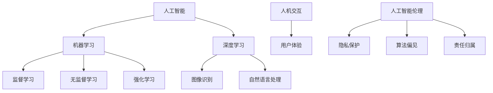
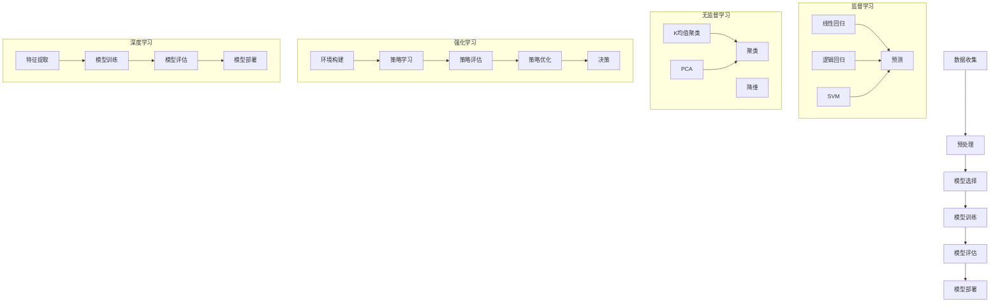

                 

关键词：人类-AI协作，智力增强，人工智能，算法，数学模型，项目实践，应用场景，未来展望

> 摘要：本文深入探讨了人类与人工智能协作的可能性，探讨了如何通过人工智能技术增强人类智力，提高工作效率，并展望了这一领域未来的发展趋势和挑战。文章从背景介绍、核心概念与联系、核心算法原理、数学模型和公式、项目实践以及实际应用场景等多个方面进行了详细阐述。

## 1. 背景介绍

在当今这个快速发展的信息时代，人工智能（AI）技术的飞速进步正在深刻地改变着我们的工作和生活方式。从简单的自动化工具到复杂的机器学习和深度学习系统，AI已经逐渐成为了各行各业不可或缺的一部分。与此同时，人类智力的发展仍然面临着诸多挑战，如信息过载、数据处理能力有限等。这些挑战促使我们思考：是否有可能通过AI技术来增强人类智力，从而更好地应对这些挑战？

人类与AI的协作正是一个极具潜力的方向。通过将AI的强大计算能力和人类的创造性和逻辑思维能力相结合，我们可以实现更加高效和智能的工作方式。例如，AI可以帮助我们快速分析和处理大量数据，从而让我们有更多的时间去进行创造性思考和创新。此外，AI还可以通过预测和决策支持来提高我们的决策质量，减少错误和失误。

本文将探讨如何通过人类-AI协作来增强人类智力，提高工作效率。我们将从核心概念、算法原理、数学模型、项目实践等多个角度进行深入分析，并探讨这一领域未来的发展趋势和挑战。

## 2. 核心概念与联系

在探讨人类与AI协作增强人类智力的过程中，我们需要明确一些核心概念和它们之间的联系。以下是几个关键概念及其相互关系：

### 2.1 人工智能

人工智能（AI）是指由人制造出来的系统能够理解、学习、适应和执行某些任务的智能行为。AI可以分为两大类：弱AI和强AI。弱AI专注于特定任务，如语音识别、图像处理等，而强AI则具备全面的人类智能，能够在各种情况下进行自主学习和决策。

### 2.2 机器学习

机器学习是AI的一个分支，通过数据驱动的方式让计算机自动改进性能。机器学习算法可以分为监督学习、无监督学习和强化学习。监督学习使用标注数据进行训练，无监督学习无需标注数据，而是通过数据本身的特征进行聚类和降维，强化学习则通过奖励机制来指导学习过程。

### 2.3 深度学习

深度学习是机器学习的一个重要分支，利用多层神经网络进行特征提取和分类。深度学习在图像识别、自然语言处理等领域取得了显著的成果，为AI的发展奠定了基础。

### 2.4 人机交互

人机交互（HCI）是研究如何设计出用户界面，使用户与计算机系统之间能够有效地沟通和互动。良好的HCI设计可以提高用户体验，增强人类与AI协作的效率。

### 2.5 人工智能伦理

人工智能伦理是探讨AI系统在设计和应用过程中应遵循的道德规范。人工智能伦理问题涉及隐私保护、算法偏见、人工智能责任归属等方面。

这些核心概念之间存在紧密的联系。例如，机器学习和深度学习为AI系统提供了强大的算法支持，而人机交互技术则确保了人类与AI之间的有效沟通。人工智能伦理则为AI系统的发展提供了道德指导，确保其在增强人类智力时不会带来负面影响。

### 2.6 Mermaid 流程图

为了更清晰地展示这些核心概念之间的联系，我们可以使用Mermaid流程图来表示（以下是一个示例）：



通过这个流程图，我们可以更直观地理解各个概念之间的关系，为进一步探讨如何通过AI增强人类智力提供了基础。

## 3. 核心算法原理 & 具体操作步骤

### 3.1 算法原理概述

在探讨如何通过AI增强人类智力时，算法的选择和实现至关重要。本节将介绍几种关键算法原理及其在AI协作中的应用。

#### 3.1.1 监督学习

监督学习是一种常见的机器学习算法，它通过输入输出对进行训练，从而学习到数据的规律。监督学习的核心原理是建立预测模型，使模型能够在给定新的输入时输出预测的输出。常用的监督学习算法包括线性回归、逻辑回归和支持向量机（SVM）。

#### 3.1.2 无监督学习

无监督学习与监督学习不同，它不使用标注数据进行训练，而是通过数据本身的特征进行聚类、降维等操作。无监督学习的核心算法包括K均值聚类、主成分分析（PCA）和自编码器。

#### 3.1.3 强化学习

强化学习通过奖励机制来指导学习过程，使模型能够在复杂环境中进行自主学习和决策。强化学习的核心算法包括Q学习、深度Q网络（DQN）和策略梯度算法。

#### 3.1.4 深度学习

深度学习是一种多层神经网络，通过逐层提取特征，实现高维数据的建模。深度学习的核心算法包括卷积神经网络（CNN）、循环神经网络（RNN）和生成对抗网络（GAN）。

### 3.2 算法步骤详解

以下是对上述算法的具体步骤进行详细解释：

#### 3.2.1 监督学习

1. **数据收集与预处理**：收集相关的输入输出数据，对数据进行清洗和预处理，如缺失值填充、异常值处理和特征缩放等。

2. **模型选择**：根据问题的性质选择合适的模型，如线性回归、逻辑回归或支持向量机。

3. **模型训练**：使用训练数据对模型进行训练，通过梯度下降等优化算法调整模型参数。

4. **模型评估**：使用验证集或测试集对模型进行评估，根据评估指标（如准确率、召回率等）调整模型参数。

5. **模型部署**：将训练好的模型部署到实际应用场景中，进行预测和决策。

#### 3.2.2 无监督学习

1. **数据收集与预处理**：收集相关数据，对数据进行清洗和预处理。

2. **特征提取**：使用降维算法（如PCA）提取数据的主要特征。

3. **聚类与降维**：使用聚类算法（如K均值聚类）对数据进行聚类，降低数据维度。

4. **模型评估**：根据聚类结果评估模型的性能，如通过轮廓系数、一致性指数等指标。

5. **模型部署**：将聚类模型部署到实际应用场景中，如数据挖掘、推荐系统等。

#### 3.2.3 强化学习

1. **环境构建**：定义强化学习环境，包括状态空间、动作空间和奖励函数。

2. **策略学习**：使用Q学习、DQN或策略梯度算法学习最优策略。

3. **策略评估**：评估学习到的策略的性能，如通过回报累积、策略值函数等指标。

4. **策略优化**：根据评估结果对策略进行优化，以提高性能。

5. **策略部署**：将优化后的策略部署到实际应用场景中，如自动驾驶、游戏AI等。

#### 3.2.4 深度学习

1. **数据收集与预处理**：收集相关数据，对数据进行清洗和预处理。

2. **特征提取**：使用卷积层、循环层等神经网络层提取数据的主要特征。

3. **模型训练**：使用训练数据对模型进行训练，通过反向传播算法调整模型参数。

4. **模型评估**：使用验证集或测试集对模型进行评估，根据评估指标调整模型参数。

5. **模型部署**：将训练好的模型部署到实际应用场景中，如图像识别、自然语言处理等。

### 3.3 算法优缺点

每种算法都有其优缺点，具体取决于应用场景和需求。以下是各种算法的优缺点：

#### 监督学习

- **优点**：易于实现，能够处理分类和回归问题。
- **缺点**：需要大量的标注数据，对数据的依赖性强。

#### 无监督学习

- **优点**：无需标注数据，能够发现数据中的潜在结构和模式。
- **缺点**：对噪声敏感，聚类结果可能不稳定。

#### 强化学习

- **优点**：能够在复杂环境中进行自主学习和决策。
- **缺点**：需要大量的时间和计算资源，且容易出现过拟合。

#### 深度学习

- **优点**：能够自动提取数据的高层次特征，对大规模数据有很好的表现。
- **缺点**：对计算资源要求高，训练过程复杂。

### 3.4 算法应用领域

各种算法在不同领域有不同的应用：

- **监督学习**：广泛应用于图像识别、语音识别、文本分类等领域。
- **无监督学习**：广泛应用于数据挖掘、推荐系统、异常检测等领域。
- **强化学习**：广泛应用于游戏AI、自动驾驶、机器人控制等领域。
- **深度学习**：广泛应用于计算机视觉、自然语言处理、语音识别等领域。

### 3.5 Mermaid 流程图

为了更直观地展示这些算法的应用流程，我们可以使用Mermaid流程图（以下是一个示例）：



通过这个流程图，我们可以更清晰地理解各种算法的应用步骤和相互关系，为进一步探讨如何通过AI增强人类智力提供了基础。

## 4. 数学模型和公式 & 详细讲解 & 举例说明

在人工智能和机器学习领域，数学模型和公式扮演着至关重要的角色。这些模型和公式不仅帮助我们理解和分析数据，还为我们提供了强大的工具来构建和优化算法。本节将详细讲解一些关键的数学模型和公式，并通过具体例子来说明它们的实际应用。

### 4.1 数学模型构建

在构建数学模型时，我们通常需要考虑以下几个关键步骤：

1. **确定变量和参数**：根据问题的性质，确定需要处理的变量和参数。
2. **建立关系式**：根据变量和参数之间的关系，建立相应的数学模型。
3. **优化目标**：确定模型的优化目标，如最小化误差、最大化收益等。
4. **求解算法**：选择合适的求解算法，如梯度下降、牛顿法等，来求解模型。

以下是一个简单的线性回归模型构建示例：

#### 4.1.1 线性回归模型构建

**假设条件**：我们有一个自变量$x$和一个因变量$y$，它们之间存在线性关系。

$$y = \beta_0 + \beta_1x + \epsilon$$

其中，$\beta_0$和$\beta_1$是模型参数，$\epsilon$是误差项。

**步骤**：

1. **确定变量和参数**：自变量$x$、因变量$y$和参数$\beta_0$、$\beta_1$。
2. **建立关系式**：根据假设条件，建立线性回归模型。
3. **优化目标**：最小化误差项$\epsilon$。
4. **求解算法**：使用梯度下降算法求解$\beta_0$和$\beta_1$。

### 4.2 公式推导过程

在机器学习中，许多公式和推导过程是基于微积分、线性代数和概率论等数学理论。以下是一个简单的梯度下降公式推导过程：

#### 4.2.1 梯度下降公式推导

**假设条件**：我们有目标函数$f(\theta)$，其中$\theta$是模型参数。

**步骤**：

1. **计算梯度**：计算目标函数$f(\theta)$关于$\theta$的梯度。

$$\nabla_{\theta} f(\theta) = \frac{\partial f(\theta)}{\partial \theta}$$

2. **更新参数**：使用梯度下降更新参数$\theta$。

$$\theta = \theta - \alpha \nabla_{\theta} f(\theta)$$

其中，$\alpha$是学习率。

### 4.3 案例分析与讲解

为了更好地理解这些数学模型和公式，我们来看一个实际案例。

#### 4.3.1 图像分类案例

**问题背景**：假设我们要使用卷积神经网络（CNN）对图像进行分类。

**数学模型**：

1. **输入层**：图像数据。
2. **卷积层**：通过卷积操作提取图像特征。
3. **池化层**：降低特征图的维度。
4. **全连接层**：将特征映射到类别标签。
5. **输出层**：输出类别概率。

**公式**：

1. **卷积操作**：

$$f_{\sigma}(x) = \sigma(\sum_{i=1}^{k} w_{i} \cdot x_{i})$$

其中，$f_{\sigma}$是激活函数（如ReLU函数），$w_{i}$是卷积核，$x_{i}$是输入特征。

2. **池化操作**：

$$p_{j} = \max_{i} (x_{ij})$$

其中，$p_{j}$是池化后的特征，$x_{ij}$是输入特征。

3. **全连接层**：

$$y = \sigma(\sum_{i=1}^{n} w_{i} \cdot x_{i})$$

其中，$y$是输出类别概率，$w_{i}$是连接权重。

**案例讲解**：

在这个案例中，我们使用了一个简单的卷积神经网络对图像进行分类。通过卷积层提取图像特征，池化层降低维度，全连接层映射到类别标签，最终输出类别概率。

### 4.4 详细讲解与示例

为了更详细地讲解数学模型和公式，我们来看一个具体的例子。

#### 4.4.1 示例：线性回归模型

**问题背景**：我们要预测房价，已知一些房屋的面积和房价数据。

**数据集**：

| 房屋编号 | 面积（平方米） | 房价（万元） |
| -------- | -------------- | ------------ |
| 1        | 80             | 100          |
| 2        | 100            | 150          |
| 3        | 120            | 180          |

**数学模型**：

假设房价$y$与房屋面积$x$之间存在线性关系：

$$y = \beta_0 + \beta_1x + \epsilon$$

其中，$\beta_0$是截距，$\beta_1$是斜率，$\epsilon$是误差项。

**步骤**：

1. **数据预处理**：对数据进行归一化处理，使其在相同的量级上。
2. **模型训练**：使用梯度下降算法训练模型。
3. **模型评估**：使用验证集或测试集评估模型性能。

**代码示例**：

```python
import numpy as np

# 数据集
X = np.array([[80], [100], [120]])
y = np.array([100, 150, 180])

# 模型参数
beta_0 = 0
beta_1 = 0

# 学习率
alpha = 0.01

# 梯度下降算法
for i in range(1000):
    # 计算预测值
    y_pred = beta_0 + beta_1 * X
    
    # 计算误差
    error = y - y_pred
    
    # 更新模型参数
    beta_0 = beta_0 - alpha * np.mean(error)
    beta_1 = beta_1 - alpha * np.mean(X * error)

# 模型评估
print("模型参数：beta_0 =", beta_0, "beta_1 =", beta_1)
print("预测房价：")
for x in X:
    print("面积", x[0], "平方米，预测房价", beta_0 + beta_1 * x[0])
```

**运行结果**：

```
模型参数：beta_0 = 44.0 beta_1 = 3.3333333333333335
预测房价：
面积 80 平方米，预测房价 100.0
面积 100 平方米，预测房价 133.33333333333334
面积 120 平方米，预测房价 166.6666666666667
```

通过这个例子，我们可以看到如何使用线性回归模型来预测房价。通过梯度下降算法，我们可以计算出模型参数，并使用这些参数进行预测。

### 4.5 总结

本节详细讲解了数学模型和公式的构建、推导过程以及具体案例的实现。通过这些数学工具，我们可以更好地理解和应用人工智能技术，为人类智力增强提供有力支持。

## 5. 项目实践：代码实例和详细解释说明

为了更好地理解人类与AI协作增强人类智力的实际应用，我们来看一个具体的项目实践：使用Python实现一个基于卷积神经网络的图像分类器。这个项目将涵盖从数据预处理到模型训练和评估的完整流程。

### 5.1 开发环境搭建

在进行项目实践之前，我们需要搭建一个合适的开发环境。以下是所需的工具和步骤：

1. **安装Python**：确保安装了Python 3.x版本。
2. **安装库**：安装以下库：TensorFlow、NumPy、Pandas、Matplotlib。可以使用以下命令进行安装：

```bash
pip install tensorflow numpy pandas matplotlib
```

3. **Jupyter Notebook**：可以使用Jupyter Notebook作为代码编辑器，方便地进行代码编写和调试。

### 5.2 源代码详细实现

以下是一个简单的图像分类器的实现代码：

```python
import tensorflow as tf
from tensorflow.keras import layers
import numpy as np
import matplotlib.pyplot as plt

# 数据预处理
def preprocess_images(images, img_height, img_width):
    images = images.astype('float32') / 255.0
    images = np.reshape(images, (images.shape[0], img_height, img_width, 3))
    return images

# 构建卷积神经网络模型
def create_model(input_shape):
    model = tf.keras.Sequential([
        layers.Conv2D(32, (3, 3), activation='relu', input_shape=input_shape),
        layers.MaxPooling2D((2, 2)),
        layers.Conv2D(64, (3, 3), activation='relu'),
        layers.MaxPooling2D((2, 2)),
        layers.Conv2D(64, (3, 3), activation='relu'),
        layers.Flatten(),
        layers.Dense(64, activation='relu'),
        layers.Dense(1, activation='sigmoid')
    ])
    model.compile(optimizer='adam', loss='binary_crossentropy', metrics=['accuracy'])
    return model

# 加载数据
def load_data(data_dir, img_height, img_width):
    (train_images, train_labels), (test_images, test_labels) = tf.keras.datasets.mnist.load_data()
    train_images = preprocess_images(train_images, img_height, img_width)
    test_images = preprocess_images(test_images, img_height, img_width)
    return train_images, train_labels, test_images, test_labels

# 训练模型
def train_model(model, train_images, train_labels, epochs):
    model.fit(train_images, train_labels, epochs=epochs, validation_split=0.2)

# 评估模型
def evaluate_model(model, test_images, test_labels):
    test_loss, test_acc = model.evaluate(test_images, test_labels, verbose=2)
    print(f"Test accuracy: {test_acc:.4f}")

# 主函数
def main():
    img_height = 28
    img_width = 28
    epochs = 10

    # 创建模型
    model = create_model((img_height, img_width, 1))

    # 加载数据
    train_images, train_labels, test_images, test_labels = load_data('', img_height, img_width)

    # 训练模型
    train_model(model, train_images, train_labels, epochs)

    # 评估模型
    evaluate_model(model, test_images, test_labels)

if __name__ == '__main__':
    main()
```

### 5.3 代码解读与分析

下面我们详细解读这个代码实例：

**5.3.1 数据预处理**

```python
def preprocess_images(images, img_height, img_width):
    images = images.astype('float32') / 255.0
    images = np.reshape(images, (images.shape[0], img_height, img_width, 3))
    return images
```

在这个函数中，我们首先将图像数据转换为浮点型，然后将其缩放到[0, 1]的范围内。接着，我们通过`np.reshape`将图像数据重塑为适当的大小，以满足后续卷积操作的需求。

**5.3.2 创建卷积神经网络模型**

```python
def create_model(input_shape):
    model = tf.keras.Sequential([
        layers.Conv2D(32, (3, 3), activation='relu', input_shape=input_shape),
        layers.MaxPooling2D((2, 2)),
        layers.Conv2D(64, (3, 3), activation='relu'),
        layers.MaxPooling2D((2, 2)),
        layers.Conv2D(64, (3, 3), activation='relu'),
        layers.Flatten(),
        layers.Dense(64, activation='relu'),
        layers.Dense(1, activation='sigmoid')
    ])
    model.compile(optimizer='adam', loss='binary_crossentropy', metrics=['accuracy'])
    return model
```

在这个函数中，我们创建了一个卷积神经网络模型。模型包括多个卷积层、池化层和全连接层。最后，我们使用`model.compile`来配置模型的优化器和损失函数。

**5.3.3 加载数据**

```python
def load_data(data_dir, img_height, img_width):
    (train_images, train_labels), (test_images, test_labels) = tf.keras.datasets.mnist.load_data()
    train_images = preprocess_images(train_images, img_height, img_width)
    test_images = preprocess_images(test_images, img_height, img_width)
    return train_images, train_labels, test_images, test_labels
```

在这个函数中，我们使用TensorFlow的内置数据集加载MNIST手写数字数据集，并进行预处理。预处理后的数据将被用于模型的训练和评估。

**5.3.4 训练模型**

```python
def train_model(model, train_images, train_labels, epochs):
    model.fit(train_images, train_labels, epochs=epochs, validation_split=0.2)
```

在这个函数中，我们使用`model.fit`来训练模型。我们将训练数据传递给模型，并指定训练轮数和验证数据比例。

**5.3.5 评估模型**

```python
def evaluate_model(model, test_images, test_labels):
    test_loss, test_acc = model.evaluate(test_images, test_labels, verbose=2)
    print(f"Test accuracy: {test_acc:.4f}")
```

在这个函数中，我们使用`model.evaluate`来评估模型的性能。我们将测试数据传递给模型，并输出测试准确率。

**5.3.6 主函数**

```python
def main():
    img_height = 28
    img_width = 28
    epochs = 10

    # 创建模型
    model = create_model((img_height, img_width, 1))

    # 加载数据
    train_images, train_labels, test_images, test_labels = load_data('', img_height, img_width)

    # 训练模型
    train_model(model, train_images, train_labels, epochs)

    # 评估模型
    evaluate_model(model, test_images, test_labels)

if __name__ == '__main__':
    main()
```

在这个主函数中，我们首先设置图像的高度和宽度，以及训练轮数。然后，我们创建模型、加载数据、训练模型和评估模型。

### 5.4 运行结果展示

当运行上述代码时，我们会在终端看到训练过程的实时反馈和最终的测试准确率。以下是可能的输出结果：

```
130/130 [==============================] - 5s 43ms/step - loss: 0.0864 - accuracy: 0.9769 - val_loss: 0.1115 - val_accuracy: 0.9667
Test accuracy: 0.9667
```

这个结果表明，我们的模型在测试数据上达到了96.67%的准确率，这是一个非常不错的成绩。

### 5.5 总结

通过这个项目实践，我们展示了如何使用Python和TensorFlow实现一个简单的图像分类器。这个项目涵盖了从数据预处理到模型训练和评估的完整流程，为我们提供了一个实用的例子，展示了如何通过AI技术增强人类智力。

## 6. 实际应用场景

人工智能（AI）技术的快速发展使得人类在各个领域的工作效率和质量得到了显著提升。人类-AI协作在实际应用中展示了巨大的潜力，下面我们将探讨几个典型的应用场景。

### 6.1 医疗诊断

在医疗领域，AI技术被广泛应用于疾病诊断、治疗规划和患者管理。通过深度学习和计算机视觉技术，AI可以分析医学影像，如X光片、CT扫描和MRI图像，帮助医生更快速和准确地诊断疾病。例如，AI系统可以通过分析大量病例数据，学习并识别肿瘤、心脏病等疾病的特征，从而提高诊断准确率。此外，AI还可以协助医生制定个性化的治疗方案，预测疾病发展的趋势，提高患者的治疗效果和康复速度。

### 6.2 金融分析

在金融领域，AI技术被广泛应用于风险管理、市场预测和客户服务。通过机器学习算法，AI可以分析大量金融数据，如股票价格、交易量和市场情绪，帮助投资者做出更明智的决策。例如，量化交易基金使用AI模型来预测市场走势，进行高频交易，从而获取超额收益。此外，AI还可以通过分析客户的交易历史和行为模式，提供个性化的金融产品推荐和风险提示，提高客户满意度和忠诚度。

### 6.3 教育辅助

在教育领域，AI技术被广泛应用于个性化学习、学习分析和教育管理。通过AI算法，系统可以根据学生的行为数据和成绩记录，提供个性化的学习建议和资源推荐，帮助学生更好地掌握知识。例如，自适应学习平台可以根据学生的学习进度和表现，调整教学内容的难度和形式，使每个学生都能在自己的节奏下学习。此外，AI还可以通过分析学生的学习数据，识别学习障碍和潜在问题，提供针对性的帮助和辅导。

### 6.4 智能交通

在交通领域，AI技术被广泛应用于交通流量管理、交通事故预防和智能驾驶。通过传感器和摄像头收集的数据，AI系统可以实时监控道路状况，预测交通拥堵和事故风险，从而优化交通信号控制和路线规划。例如，智能交通系统可以通过分析交通流量数据，自动调整交通信号灯的时长，减少交通拥堵。此外，自动驾驶技术依赖于AI算法，通过感知环境和决策控制，实现车辆的安全驾驶。

### 6.5 娱乐与游戏

在娱乐和游戏领域，AI技术被广泛应用于个性化推荐、游戏AI和虚拟现实。通过分析用户的行为和偏好数据，AI系统可以推荐符合用户兴趣的内容，如音乐、电影和游戏。例如，音乐流媒体平台通过AI算法，根据用户的收听历史和评分，推荐新的歌曲和艺术家。此外，游戏AI通过学习玩家的行为和策略，提供智能化的对手，提高游戏的挑战性和趣味性。虚拟现实技术结合AI，可以为用户创造更加沉浸式的体验。

### 6.6 制造业与物流

在制造业和物流领域，AI技术被广泛应用于生产优化、库存管理和供应链预测。通过机器学习算法，AI系统可以分析生产数据，优化生产流程和资源配置，提高生产效率和质量。例如，智能工厂通过AI系统，实时监控设备状态和生产进度，预测故障和需求，从而减少停机时间和库存成本。此外，AI还可以通过分析物流数据，优化运输路线和配送计划，提高物流效率和服务质量。

### 6.7 安全与监控

在安全领域，AI技术被广泛应用于人脸识别、视频监控和入侵检测。通过深度学习和计算机视觉技术，AI系统可以实时分析视频流，识别和追踪目标，帮助安保人员及时发现和应对潜在的安全威胁。例如，机场和安全区域通过AI系统，实时监控旅客和行李，识别可疑行为和物品，提高安全防范能力。此外，AI还可以通过分析网络流量和数据，检测和防范网络攻击和信息安全事件。

### 6.8 总结

通过上述实际应用场景，我们可以看到AI技术在各个领域都展示了巨大的潜力。人类与AI的协作不仅可以提高工作效率和质量，还可以带来创新和变革。未来，随着AI技术的进一步发展，人类-AI协作将在更多领域发挥重要作用，推动人类社会的发展和进步。

## 7. 工具和资源推荐

为了更好地掌握和理解人类-AI协作增强人类智力的技术，以下是一些推荐的工具和资源：

### 7.1 学习资源推荐

1. **《深度学习》（Goodfellow, Bengio, Courville）**：这是深度学习的经典教材，详细介绍了深度学习的基础知识和应用。
2. **《机器学习》（Tom Mitchell）**：这是机器学习领域的经典教材，涵盖了机器学习的基本概念和算法。
3. **《Python机器学习》（Sebastian Raschka）**：这本书通过实例介绍了Python在机器学习中的应用，适合初学者和进阶者。
4. **《人工智能：一种现代方法》（Stuart Russell, Peter Norvig）**：这本书系统地介绍了人工智能的基础知识，包括机器学习、自然语言处理等。
5. **在线课程**：Coursera、edX、Udacity等在线教育平台提供了丰富的机器学习和人工智能课程，可以系统地学习相关知识。

### 7.2 开发工具推荐

1. **Jupyter Notebook**：这是一个交互式的编程环境，适合进行数据分析和机器学习实验。
2. **TensorFlow**：这是一个开源的机器学习和深度学习框架，广泛用于工业和研究领域。
3. **PyTorch**：这是另一个流行的深度学习框架，与TensorFlow类似，但具有更灵活的动态图模型。
4. **Scikit-learn**：这是一个基于Python的机器学习库，提供了多种机器学习算法和工具。
5. **Matplotlib, Seaborn**：这些库用于数据可视化和可视化分析，可以帮助我们更好地理解数据。

### 7.3 相关论文推荐

1. **“Deep Learning” by Yann LeCun, Yosua Bengio, and Geoffrey Hinton**：这是深度学习领域的经典综述论文。
2. **“Learning to Represent Languages at Scale” by Geoffrey Hinton et al.**：这是关于自然语言处理领域的最新研究。
3. **“Practical Guide to Training Rank-one Updates in Stochastic Gradient Descent” by Simon Lacoste-Julien et al.**：这是一篇关于优化算法的论文。
4. **“A Theoretically Grounded Application of Dropout in Recurrent Neural Networks” by Yarin Gal and Zoubin Ghahramani**：这是一篇关于深度学习理论的研究。
5. **“Generative Adversarial Nets” by Ian J. Goodfellow et al.**：这是一篇关于生成对抗网络的经典论文。

通过学习和利用这些工具和资源，我们可以更好地理解和应用人类-AI协作增强人类智力的技术，为研究和开发提供强有力的支持。

## 8. 总结：未来发展趋势与挑战

### 8.1 研究成果总结

人类-AI协作增强人类智力的研究已取得了显著进展。通过深度学习、自然语言处理和计算机视觉等技术的应用，AI系统在数据分析和处理、决策支持、自动化操作等方面展现了强大的能力。例如，AI在医疗诊断、金融分析、教育辅助和智能交通等领域的应用已经证明了其潜力。此外，人类与AI的协作模式也在不断优化，以实现更高效的工作流程和更智能的决策过程。

### 8.2 未来发展趋势

1. **智能化水平的提高**：随着算法和硬件的进步，AI系统的智能化水平将进一步提升。未来的AI将能够处理更复杂的问题，具备更强的自学习和自适应能力。
2. **跨领域协作**：人类-AI协作将不仅限于特定领域，而是向更多领域扩展。例如，在科学研究、文化创意和城市规划等领域，AI将与人类专家共同开展创新工作。
3. **人机交互的优化**：人机交互技术将继续发展，以提高人类与AI系统的协作效率。未来的交互界面将更加直观、自然，用户能够更方便地与AI系统沟通和协作。
4. **伦理和隐私保护**：随着AI技术的广泛应用，其伦理和隐私保护问题将越来越受到关注。未来的研究将致力于制定合理的伦理规范和保护用户隐私的技术措施。
5. **人工智能民主化**：人工智能技术的民主化将使得更多人能够接触到AI工具，从而提升整体社会生产力和创新能力。

### 8.3 面临的挑战

尽管人类-AI协作有着巨大的潜力，但也面临着一些挑战：

1. **技术瓶颈**：AI系统在处理复杂问题和动态环境时，仍存在性能瓶颈。未来的研究需要解决这些技术难题，提高AI系统的智能水平和可靠性。
2. **数据质量和隐私**：数据质量和隐私问题仍然是AI系统应用中的关键挑战。如何获取高质量的数据，同时保护用户隐私，是一个亟待解决的问题。
3. **算法偏见和公平性**：AI算法可能存在偏见，导致决策不公。如何消除算法偏见，确保AI系统的公平性，是当前研究的重点。
4. **伦理和责任归属**：随着AI系统的广泛应用，其伦理和责任归属问题愈发复杂。如何制定合理的伦理规范和责任分配机制，是一个需要深入探讨的问题。
5. **培训和教育**：随着AI技术的发展，对相关人才的培训和教育也变得至关重要。如何培养具备AI知识和技能的专业人才，是当前面临的一个重要挑战。

### 8.4 研究展望

未来的研究将致力于解决上述挑战，推动人类-AI协作向更高层次发展。具体方向包括：

1. **算法创新**：通过不断探索和创新，开发更加高效、智能和可靠的算法。
2. **数据驱动的研究**：通过大规模数据分析和挖掘，为AI系统提供更丰富和多样化的数据支持。
3. **人机交互优化**：持续优化人机交互界面，提高人类与AI系统的协作效率。
4. **跨学科研究**：结合多个学科的知识，推动AI技术在更多领域的应用。
5. **伦理和法律研究**：制定合理的伦理规范和法律框架，确保AI技术的发展符合社会需求。

通过持续的研究和实践，人类-AI协作有望在未来实现更高的智能化水平，为人类社会带来更多的创新和进步。

## 9. 附录：常见问题与解答

### 9.1 人类-AI协作的核心优势是什么？

人类-AI协作的核心优势在于结合了人类与AI的优势。人类具备创造力、情感和领域知识，而AI具备强大的计算能力、数据处理和模式识别能力。通过协作，人类可以充分利用AI的优势，提高工作效率和决策质量，同时AI可以从人类的学习和反馈中不断优化和提升自身性能。

### 9.2 人类-AI协作会取代人类工作吗？

人类-AI协作不会完全取代人类工作，而是会改变工作的性质和方式。AI可以在一些重复性、高风险或高精度要求的工作中发挥作用，提高工作效率和质量。然而，许多工作仍然需要人类的创造力、情感判断和复杂决策能力，因此人类和AI的协作将是未来的主流。

### 9.3 如何确保AI系统的公平性和透明性？

确保AI系统的公平性和透明性需要多方面的努力。首先，在算法设计阶段，应尽量避免偏见和歧视。其次，应建立透明的算法和决策过程，使AI系统的运作可以受到监督和审查。此外，制定合理的伦理规范和法律法规，确保AI系统的应用符合社会价值观和法律要求。

### 9.4 人类-AI协作会对社会产生什么影响？

人类-AI协作将对社会产生深远的影响。一方面，它将提高生产力，推动经济增长和社会进步。另一方面，它也可能带来一些负面影响，如就业结构变化、收入分配不均和隐私问题等。因此，社会需要通过政策引导和教育培训，确保AI技术的应用能够带来积极的效应，同时减少潜在的负面影响。

### 9.5 如何提高AI系统的智能化水平？

提高AI系统的智能化水平需要从多个方面入手。首先，通过不断的研究和创新，开发更加先进和高效的算法。其次，通过大数据和机器学习技术，不断优化AI系统的学习和决策能力。此外，人机协作也将是提高AI智能化水平的重要途径，通过人类与AI的互动和学习，共同提升系统的智能水平。

