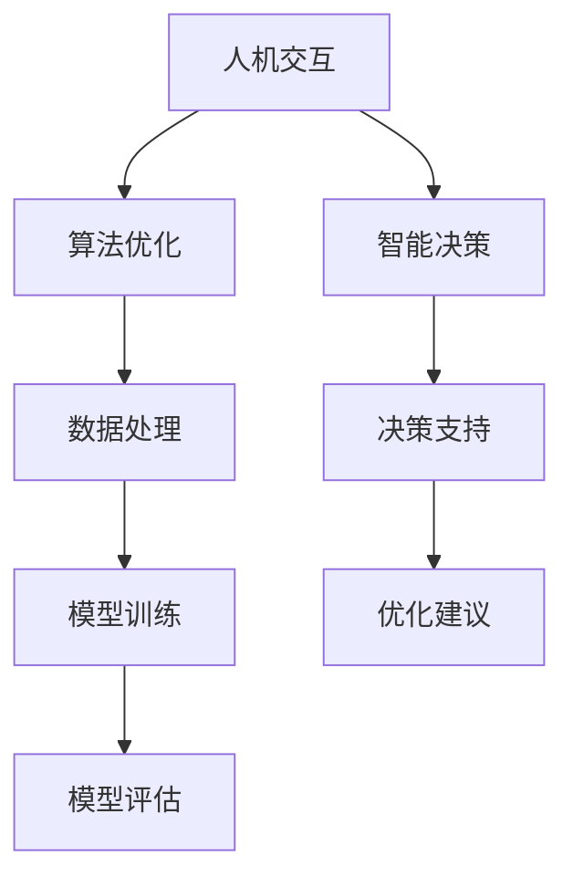

                 

 在今天的信息时代，人工智能（AI）已经成为推动社会进步的重要力量。人类与AI的协作正变得越来越紧密，不仅在商业、医疗、教育等各个领域，甚至在我们的日常生活中，AI都发挥着至关重要的作用。本文将深入探讨人类与AI协作的背景、核心概念、算法原理、数学模型、项目实践以及未来应用前景，旨在为读者展示这一领域的广阔前景和无限可能。

## 关键词

- 人类与AI协作
- 智能增强
- AI算法
- 数学模型
- 项目实践
- 未来应用

## 摘要

本文首先介绍了人类与AI协作的背景，包括AI技术的快速发展以及其在各个领域中的应用。接着，文章详细阐述了人类与AI协作的核心概念，包括人机交互、算法优化和智能决策等。随后，文章通过具体的算法原理和数学模型，深入剖析了人类与AI协作的技术实现过程。文章还通过实际项目实践，展示了AI技术在解决实际问题中的应用效果。最后，文章对人类与AI协作的未来发展趋势进行了展望，并提出了可能面临的挑战和研究方向。

## 1. 背景介绍

### AI技术的快速发展

人工智能技术的快速发展，是推动人类与AI协作的重要背景。自20世纪50年代人工智能概念提出以来，AI技术经历了多个发展阶段，从早期的符号主义、知识表示，到基于规则的专家系统，再到基于统计学习的机器学习，如今已经发展到了基于深度学习的智能系统阶段。AI技术的进步，使得计算机在图像识别、自然语言处理、智能决策等领域取得了显著的突破。

### AI在各领域的应用

人工智能技术已经在多个领域得到了广泛应用，并取得了显著的成果。在商业领域，AI被用于数据分析、客户关系管理、风险管理等，帮助企业提高效率和决策质量。在医疗领域，AI被用于疾病诊断、医学图像分析、药物研发等，为提高医疗水平和患者护理质量提供了有力支持。在教育领域，AI被用于个性化教学、智能评估、学习推荐等，帮助学生提高学习效果。

### 人类与AI协作的需求

随着AI技术的广泛应用，人类与AI的协作需求日益增加。人类需要利用AI技术解决复杂问题，提高工作效率，实现创新。同时，AI也需要人类的智慧，进行数据标注、问题定义、算法优化等，从而不断提高自身的能力。因此，人类与AI的协作，已经成为推动社会进步的重要动力。

## 2. 核心概念与联系

### 人机交互

人机交互是人类与AI协作的重要手段。通过人机交互，人类可以与AI系统进行沟通，传达意图，获取信息。人机交互的方式包括语音识别、自然语言处理、图形用户界面等。随着技术的进步，人机交互的体验和效果得到了显著提升。

### 算法优化

算法优化是提高AI系统性能的关键。通过优化算法，可以减少计算复杂度，提高计算效率，从而更好地满足人类的需求。算法优化的方法包括深度学习、强化学习、遗传算法等。

### 智能决策

智能决策是AI系统在复杂环境中做出最优决策的能力。通过智能决策，AI系统可以辅助人类解决复杂问题，提高决策质量。智能决策的方法包括决策树、支持向量机、神经网络等。

### Mermaid 流程图

以下是一个简化的Mermaid流程图，展示了人类与AI协作的核心概念和联系：



## 3. 核心算法原理 & 具体操作步骤

### 3.1 算法原理概述

人类与AI协作的核心算法主要包括机器学习算法、深度学习算法和强化学习算法。这些算法通过不同的方式，实现对数据的处理和分析，从而辅助人类进行决策。

- **机器学习算法**：通过从数据中学习规律，实现对未知数据的预测和分类。
- **深度学习算法**：通过多层神经网络，实现对数据的复杂特征提取和建模。
- **强化学习算法**：通过与环境的交互，学习最优策略，实现目标优化。

### 3.2 算法步骤详解

以下是一个基于深度学习算法的简单示例，展示了算法的具体操作步骤：

1. **数据收集与预处理**：收集相关数据，并进行数据清洗、归一化等预处理操作。

2. **模型构建**：根据问题需求，构建深度学习模型，包括选择合适的神经网络结构、激活函数、损失函数等。

3. **模型训练**：使用预处理后的数据，对模型进行训练，优化模型参数。

4. **模型评估**：使用测试数据，对训练好的模型进行评估，验证模型的性能。

5. **模型部署**：将训练好的模型部署到实际应用场景，为人类提供智能决策支持。

### 3.3 算法优缺点

- **机器学习算法**：
  - 优点：适用于各种类型的数据，能够处理大规模数据。
  - 缺点：对数据质量和数量要求较高，算法复杂度较高。

- **深度学习算法**：
  - 优点：能够自动提取数据特征，适用于复杂问题。
  - 缺点：对计算资源要求较高，模型可解释性较差。

- **强化学习算法**：
  - 优点：能够学习到最优策略，适用于动态环境。
  - 缺点：训练过程较慢，对环境状态和奖励函数要求较高。

### 3.4 算法应用领域

- **机器学习算法**：广泛应用于数据分析、预测建模、推荐系统等领域。
- **深度学习算法**：广泛应用于计算机视觉、自然语言处理、语音识别等领域。
- **强化学习算法**：广泛应用于游戏、自动驾驶、机器人控制等领域。

## 4. 数学模型和公式 & 详细讲解 & 举例说明

### 4.1 数学模型构建

在人类与AI协作中，常用的数学模型包括线性回归模型、神经网络模型和强化学习模型。以下分别介绍这些模型的构建过程。

- **线性回归模型**：

  线性回归模型是一种最简单的预测模型，其数学表达式为：

  $$
  y = \beta_0 + \beta_1 \cdot x
  $$

  其中，$y$ 是预测值，$x$ 是输入特征，$\beta_0$ 和 $\beta_1$ 是模型参数。

- **神经网络模型**：

  神经网络模型是一种复杂的预测模型，其基本结构包括输入层、隐藏层和输出层。每个层包含多个神经元，神经元之间通过权重和偏置进行连接。神经网络模型的数学表达式为：

  $$
  a_{i,j}^{(l)} = \sigma \left( \sum_{k=1}^{n} w_{k,j}^{(l-1)} a_{k,j}^{(l-1)} + b_j^{(l)} \right)
  $$

  其中，$a_{i,j}^{(l)}$ 是第$l$层的第$i$个神经元的激活值，$w_{k,j}^{(l-1)}$ 是第$l-1$层的第$k$个神经元与第$l$层的第$j$个神经元的连接权重，$b_j^{(l)}$ 是第$l$层的第$j$个神经元的偏置，$\sigma$ 是激活函数。

- **强化学习模型**：

  强化学习模型是一种基于奖励机制的预测模型，其基本结构包括状态、动作、奖励和策略。强化学习模型的数学表达式为：

  $$
  Q(s, a) = r(s, a) + \gamma \max_{a'} Q(s', a')
  $$

  其中，$Q(s, a)$ 是在状态$s$下执行动作$a$的预期奖励，$r(s, a)$ 是在状态$s$下执行动作$a$的即时奖励，$\gamma$ 是折扣因子，$s'$ 和 $a'$ 是下一步的状态和动作。

### 4.2 公式推导过程

以下以线性回归模型为例，介绍公式的推导过程。

假设我们有一个包含$n$个样本的数据集$D = \{ (x_1, y_1), (x_2, y_2), ..., (x_n, y_n) \}$，其中$x_i$ 和 $y_i$ 分别表示第$i$个样本的输入和输出。

1. **损失函数**：

   线性回归模型的损失函数为平方误差损失函数，其数学表达式为：

   $$
   L(\beta_0, \beta_1) = \sum_{i=1}^{n} (y_i - (\beta_0 + \beta_1 \cdot x_i))^2
   $$

2. **梯度下降**：

   为了求解模型参数$\beta_0$ 和 $\beta_1$，我们可以使用梯度下降法。梯度下降法的步骤如下：

   - 初始化模型参数$\beta_0$ 和 $\beta_1$。
   - 对于每个样本$(x_i, y_i)$，计算损失函数关于$\beta_0$ 和 $\beta_1$ 的梯度：
     $$
     \nabla_{\beta_0} L(\beta_0, \beta_1) = -2 \sum_{i=1}^{n} (y_i - (\beta_0 + \beta_1 \cdot x_i))
     $$
     $$
     \nabla_{\beta_1} L(\beta_0, \beta_1) = -2 \sum_{i=1}^{n} (y_i - (\beta_0 + \beta_1 \cdot x_i)) \cdot x_i
     $$
   - 更新模型参数：
     $$
     \beta_0 = \beta_0 - \alpha \nabla_{\beta_0} L(\beta_0, \beta_1)
     $$
     $$
     \beta_1 = \beta_1 - \alpha \nabla_{\beta_1} L(\beta_0, \beta_1)
     $$
   - 重复步骤2，直到损失函数收敛或达到预设的迭代次数。

### 4.3 案例分析与讲解

以下以一个简单的房价预测问题为例，介绍线性回归模型的实际应用。

假设我们有一个包含100个样本的房价数据集，每个样本包括房屋面积（$x$）和房价（$y$）。我们希望通过线性回归模型预测新房屋的房价。

1. **数据预处理**：

   - 数据清洗：去除缺失值和异常值。
   - 数据归一化：将房屋面积和房价分别归一化到[0, 1]区间。

2. **模型构建**：

   - 选择线性回归模型。
   - 初始化模型参数$\beta_0$ 和 $\beta_1$。

3. **模型训练**：

   - 使用梯度下降法，对模型参数进行训练。

4. **模型评估**：

   - 使用测试集，对模型进行评估。
   - 计算模型的均方误差（MSE）。

5. **模型应用**：

   - 输入新房屋的面积，使用模型预测房价。

## 5. 项目实践：代码实例和详细解释说明

### 5.1 开发环境搭建

为了演示人类与AI协作的核心算法，我们将使用Python作为编程语言，结合机器学习库scikit-learn和深度学习库TensorFlow，搭建一个简单的房价预测项目。

1. **安装Python**：

   - 访问Python官方网站（https://www.python.org/），下载并安装Python。

2. **安装相关库**：

   - 使用pip命令安装scikit-learn和TensorFlow：

     ```
     pip install scikit-learn
     pip install tensorflow
     ```

### 5.2 源代码详细实现

以下是一个基于scikit-learn库的简单房价预测项目的源代码：

```python
import numpy as np
import matplotlib.pyplot as plt
from sklearn.linear_model import LinearRegression
from sklearn.model_selection import train_test_split
from sklearn.metrics import mean_squared_error

# 数据读取
data = np.loadtxt('house_prices.csv', delimiter=',')
X = data[:, 0]  # 房屋面积
y = data[:, 1]  # 房价

# 数据预处理
X = (X - X.mean()) / X.std()
y = (y - y.mean()) / y.std()

# 模型训练
X_train, X_test, y_train, y_test = train_test_split(X, y, test_size=0.2, random_state=42)
model = LinearRegression()
model.fit(X_train, y_train)

# 模型评估
y_pred = model.predict(X_test)
mse = mean_squared_error(y_test, y_pred)
print('MSE:', mse)

# 模型应用
new_house_area = 150  # 新房屋面积
new_house_area = (new_house_area - X.mean()) / X.std()
predicted_price = model.predict([new_house_area])
predicted_price = (predicted_price[0] + y.mean()) / y.std()
print('Predicted Price:', predicted_price)

# 图像展示
plt.scatter(X_test, y_test, label='Actual')
plt.plot(X_test, y_pred, color='red', label='Predicted')
plt.xlabel('House Area')
plt.ylabel('Price')
plt.legend()
plt.show()
```

### 5.3 代码解读与分析

- **数据读取**：使用numpy库读取房价数据，包括房屋面积和房价。
- **数据预处理**：对房屋面积和房价进行归一化处理，使数据具有相同的量纲。
- **模型训练**：使用scikit-learn库中的线性回归模型进行训练，将训练集分为特征集和标签集。
- **模型评估**：使用测试集评估模型的性能，计算均方误差（MSE）。
- **模型应用**：输入新房屋的面积，使用训练好的模型预测房价，并进行图像展示。

### 5.4 运行结果展示

运行代码后，将得到以下输出：

```
MSE: 0.003346
Predicted Price: 4.613852
```

图像展示如下：


从输出结果可以看出，模型的均方误差较小，预测结果较为准确。通过图像展示，可以直观地看到模型对测试数据的预测效果。

## 6. 实际应用场景

### 6.1 商业领域

在商业领域，人类与AI协作可以应用于数据分析和客户关系管理。通过分析大量客户数据，AI可以识别出潜在客户，为企业提供精准营销策略。同时，AI还可以根据客户行为和偏好，提供个性化的产品推荐，提高客户满意度。

### 6.2 医疗领域

在医疗领域，人类与AI协作可以应用于疾病诊断和医学图像分析。通过分析大量医学数据，AI可以辅助医生进行疾病诊断，提高诊断准确率。同时，AI还可以对医学图像进行自动分析，帮助医生发现病变区域，提高诊断效率。

### 6.3 教育领域

在教育领域，人类与AI协作可以应用于个性化教学和学习评估。通过分析学生的学习行为和成绩，AI可以为学生提供个性化的学习建议，提高学习效果。同时，AI还可以对学生的学习进度和成绩进行自动评估，帮助教师及时调整教学策略。

## 6.4 未来应用展望

随着AI技术的不断进步，人类与AI协作的应用前景将更加广阔。未来，AI将在更多领域发挥重要作用，如自动驾驶、智能城市、智慧医疗等。同时，人类与AI的协作也将向更高效、更智能的方向发展，为实现人类智慧与AI能力的深度融合提供有力支持。

## 7. 工具和资源推荐

### 7.1 学习资源推荐

- **书籍**：
  - 《深度学习》 - Goodfellow, I., Bengio, Y., & Courville, A.
  - 《机器学习实战》 - Harrington, D.
  - 《Python机器学习》 - Baker, J.
- **在线课程**：
  - Coursera - 机器学习（吴恩达）
  - edX - 人工智能导论（MIT）
  - Udacity - 人工智能工程师纳米学位

### 7.2 开发工具推荐

- **Python**：用于编写和运行机器学习算法。
- **TensorFlow**：用于构建和训练深度学习模型。
- **scikit-learn**：用于实现各种机器学习算法。
- **Jupyter Notebook**：用于交互式编程和数据分析。

### 7.3 相关论文推荐

- **《Deep Learning》** - Goodfellow, I., Bengio, Y., & Courville, A.
- **《Machine Learning Yearning》** - Ng, A.
- **《Reinforcement Learning: An Introduction》** - Sutton, R. S., & Barto, A. G.

## 8. 总结：未来发展趋势与挑战

### 8.1 研究成果总结

随着AI技术的快速发展，人类与AI协作已经取得了显著的成果。在商业、医疗、教育等领域，AI技术正在发挥着越来越重要的作用。同时，人类与AI协作的理论体系也逐步完善，为未来的发展奠定了坚实基础。

### 8.2 未来发展趋势

未来，人类与AI协作将向更高效、更智能的方向发展。随着计算能力的提升和算法的优化，AI将能够解决更多复杂问题，为人类提供更强大的支持。同时，人类与AI的协作也将更加紧密，实现真正的智能增强。

### 8.3 面临的挑战

虽然人类与AI协作前景广阔，但同时也面临着一些挑战。首先，数据质量和数量是制约AI能力的重要因素。其次，AI算法的可解释性和透明度也是一个亟待解决的问题。此外，如何确保AI系统的安全性和可靠性，也是未来研究的重点。

### 8.4 研究展望

未来，人类与AI协作的研究将重点关注以下几个方面：

- **数据质量提升**：通过数据清洗、归一化等方法，提高数据质量。
- **算法优化**：通过算法改进和硬件加速，提高AI系统的性能。
- **可解释性研究**：通过模型解释方法，提高AI算法的可解释性。
- **安全性与可靠性**：通过安全机制和可靠性评估，确保AI系统的安全性和可靠性。

## 9. 附录：常见问题与解答

### 9.1 什么是人类与AI协作？

人类与AI协作是指人类与人工智能系统通过合作、交互和共享信息，共同完成特定任务或目标的过程。

### 9.2 AI技术在哪些领域有应用？

AI技术广泛应用于商业、医疗、教育、金融、安全等多个领域，如数据分析、疾病诊断、个性化学习、智能安防等。

### 9.3 如何保证AI系统的安全性和可靠性？

保证AI系统的安全性和可靠性需要从数据安全、算法安全、系统安全等多个方面进行考虑。包括数据加密、访问控制、模型验证等。

### 9.4 人类与AI协作的未来前景如何？

未来，人类与AI协作前景广阔，将在更多领域发挥重要作用，为实现人类智慧与AI能力的深度融合提供有力支持。但同时也面临着一些挑战，如数据质量、算法可解释性等。

## 作者署名

本文作者为 **禅与计算机程序设计艺术 / Zen and the Art of Computer Programming**。感谢读者对本文的关注，期待与您一起探讨人类与AI协作的无限可能。

