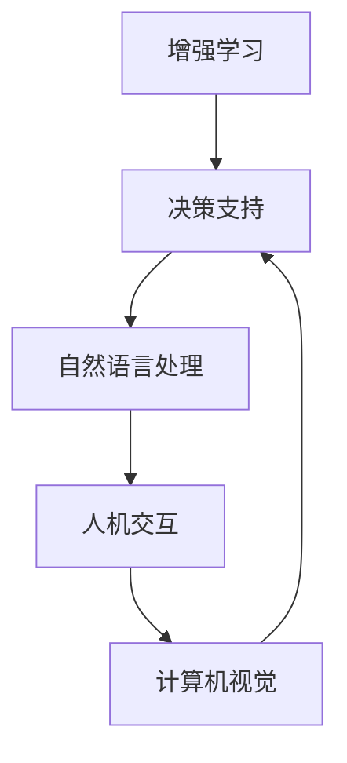

                 

关键词：人类与AI协作、智慧增强、AI能力融合、发展趋势、挑战与展望

> 摘要：本文旨在探讨人类与AI协作的未来发展趋势与挑战。随着人工智能技术的飞速发展，人类智慧与AI能力的融合正在成为提升个体和组织效率的关键途径。本文将详细分析这一领域的核心概念、算法原理、应用实践，并展望其未来发展方向，为读者提供全面的技术洞察。

## 1. 背景介绍

### 1.1 人工智能的发展历程

人工智能（AI）作为一个跨学科领域，其发展历程可以追溯到20世纪50年代。从最初的逻辑推理与符号计算，到基于数据驱动的方法，再到当前深度学习与神经网络的广泛应用，AI技术经历了巨大的变革。每一次技术的突破，都为人类带来了新的机遇和挑战。

### 1.2 人类智慧与AI协作的必要性

随着信息时代的到来，人类面临的数据量呈爆炸式增长。单纯依靠人类自身处理和分析这些数据变得愈发困难。而AI技术的发展，特别是机器学习、自然语言处理和计算机视觉等领域，为人类提供了强大的工具。人类与AI协作，不仅能提高工作效率，还能开拓新的知识领域。

### 1.3 当前研究热点与应用领域

目前，人类与AI协作的研究热点主要集中在智能助手、自动驾驶、医疗诊断、金融分析等领域。这些应用不仅提升了传统行业的效率，还为新兴产业的崛起提供了动力。

## 2. 核心概念与联系

### 2.1 核心概念

在人类与AI协作的背景下，关键的概念包括：

- **增强学习（Reinforcement Learning）**：通过试错和反馈，使AI系统能够在特定环境中做出最佳决策。
- **自然语言处理（Natural Language Processing，NLP）**：使计算机能够理解和生成人类语言的技术。
- **计算机视觉（Computer Vision）**：让计算机从图像或视频中提取信息的技术。

### 2.2 联系与架构

以下是一个简单的Mermaid流程图，展示了这些核心概念之间的联系：



## 3. 核心算法原理 & 具体操作步骤

### 3.1 算法原理概述

在人类与AI协作中，常用的核心算法包括增强学习、深度学习和自然语言处理。以下将对这些算法的原理进行概述。

### 3.2 算法步骤详解

#### 3.2.1 增强学习

1. **状态表示**：将环境的状态转换为数字编码。
2. **行动选择**：根据当前状态和策略，选择下一步行动。
3. **反馈获取**：根据行动的结果，获取奖励或惩罚。
4. **策略更新**：根据反馈，调整策略以最大化长期奖励。

#### 3.2.2 深度学习

1. **数据输入**：将输入数据送入神经网络。
2. **前向传播**：通过神经网络的各个层级，将数据向前传递。
3. **损失计算**：计算输出结果与真实值的差距。
4. **反向传播**：根据损失，反向调整网络参数。

#### 3.2.3 自然语言处理

1. **分词**：将文本分解为词语或词组。
2. **词向量表示**：将词语转换为向量表示。
3. **特征提取**：从词向量中提取有用特征。
4. **模型训练**：使用特征和标签，训练分类或回归模型。

### 3.3 算法优缺点

- **增强学习**：能够解决复杂的环境和动态问题，但需要大量的反馈数据和时间。
- **深度学习**：具有强大的建模能力和泛化能力，但计算成本高，对数据质量要求较高。
- **自然语言处理**：能够处理大量文本数据，但需要大量预训练数据和计算资源。

### 3.4 算法应用领域

- **增强学习**：自动驾驶、机器人控制、游戏AI等。
- **深度学习**：图像识别、语音识别、推荐系统等。
- **自然语言处理**：机器翻译、文本分类、情感分析等。

## 4. 数学模型和公式 & 详细讲解 & 举例说明

### 4.1 数学模型构建

在人类与AI协作中，常用的数学模型包括马尔可夫决策过程（MDP）、神经网络和语言模型。

#### 4.1.1 马尔可夫决策过程（MDP）

$$
V^*(s) = \max_{a} \sum_{s'} p(s'|s,a) \cdot [r(s',a) + \gamma V^*(s')]
$$

其中，$V^*(s)$ 是状态 $s$ 的最优价值函数，$a$ 是行动，$s'$ 是下一状态，$r(s',a)$ 是在状态 $s'$ 执行行动 $a$ 所获得的即时奖励，$\gamma$ 是折扣因子。

#### 4.1.2 神经网络

$$
\text{激活函数}：g(z) = \frac{1}{1 + e^{-z}}
$$

其中，$z$ 是网络的输入，$g(z)$ 是 sigmoid 函数，用于将线性组合转换为概率分布。

#### 4.1.3 语言模型

$$
P(w_i | w_{i-1}, ..., w_1) = \frac{P(w_{i-1}, ..., w_1, w_i)}{P(w_{i-1}, ..., w_1)}
$$

其中，$w_i$ 是序列中的第 $i$ 个词，$P(w_i | w_{i-1}, ..., w_1)$ 是条件概率，表示在已知前 $i-1$ 个词的情况下，第 $i$ 个词的概率。

### 4.2 公式推导过程

#### 4.2.1 马尔可夫决策过程（MDP）的推导

$$
V^*(s) = \max_{a} \sum_{s'} p(s'|s,a) \cdot [r(s',a) + \gamma V^*(s')]
$$

该公式基于无后效性假设，即当前状态 $s$ 的价值函数只依赖于下一状态 $s'$ 和行动 $a$，而不依赖于历史状态。

#### 4.2.2 神经网络的推导

$$
g(z) = \frac{1}{1 + e^{-z}}
$$

该公式是 sigmoid 函数的数学定义，用于将线性组合转换为概率分布。

#### 4.2.3 语言模型的推导

$$
P(w_i | w_{i-1}, ..., w_1) = \frac{P(w_{i-1}, ..., w_1, w_i)}{P(w_{i-1}, ..., w_1)}
$$

该公式是条件概率的定义，表示在已知前 $i-1$ 个词的情况下，第 $i$ 个词的概率。

### 4.3 案例分析与讲解

#### 4.3.1 马尔可夫决策过程（MDP）在自动驾驶中的应用

假设自动驾驶汽车在当前状态 $s$ 是在一条高速公路上以60公里/小时的速度行驶。接下来，汽车可以选择加速、减速或保持当前速度。根据环境模型，下一状态和相应的即时奖励如下表：

| 行动 | 下一状态 | 即时奖励 |
| ---- | ---- | ---- |
| 加速 | 高速公路，70公里/小时 | +10 |
| 减速 | 高速公路，50公里/小时 | +5 |
| 保持 | 高速公路，60公里/小时 | 0 |

根据 MDP 的公式，可以计算每个行动的最优价值：

$$
V^*(60) = \max \{ V^*(50) + 5, V^*(70) + 10, 0 + 0 \} = 10
$$

因此，在当前状态下，最优行动是加速。

#### 4.3.2 神经网络在图像识别中的应用

假设我们有一个神经网络用于识别猫的照片。输入是图片的像素值，输出是猫的标签概率分布。通过训练，神经网络可以学会识别猫和其他动物。以下是一个简化的示例：

$$
\text{输入}：[255, 255, 0, 0, 255, 255, ...]
$$

$$
\text{输出}：[0.9, 0.1]
$$

该输出表示神经网络有90%的信心认为输入是猫。

#### 4.3.3 语言模型在机器翻译中的应用

假设我们要翻译一句中文句子到英文。语言模型可以计算每个单词的条件概率，从而生成最可能的英文句子。以下是一个简化的示例：

$$
\text{输入}：\text{今天 天气很好}
$$

$$
\text{输出}：Today, the weather is nice.
$$

该输出是根据中文句子中每个单词的条件概率计算得出的最可能英文句子。

## 5. 项目实践：代码实例和详细解释说明

### 5.1 开发环境搭建

为了实践人类与AI协作的算法，我们需要搭建一个合适的开发环境。以下是一个基于 Python 的环境搭建步骤：

1. 安装 Python 3.7 或以上版本。
2. 安装必要的库，如 TensorFlow、Keras、Scikit-learn 等。
3. 设置环境变量，以便在命令行中直接调用这些库。

### 5.2 源代码详细实现

以下是一个简单的示例，展示如何使用 Python 实现一个基于强化学习的智能助手。

```python
import numpy as np
import tensorflow as tf

# 定义环境
class Environment:
    def __init__(self):
        self.state = 0

    def step(self, action):
        if action == 0:
            self.state += 1
        elif action == 1:
            self.state -= 1
        reward = 1 if self.state == 0 else -1
        return self.state, reward

# 定义智能助手
class Agent:
    def __init__(self):
        self.model = self.build_model()

    def build_model(self):
        model = tf.keras.Sequential([
            tf.keras.layers.Dense(64, activation='relu', input_shape=(1,)),
            tf.keras.layers.Dense(64, activation='relu'),
            tf.keras.layers.Dense(1, activation='sigmoid')
        ])
        model.compile(optimizer='adam', loss='binary_crossentropy')
        return model

    def choose_action(self, state):
        probability = self.model.predict(state)[0]
        if probability > 0.5:
            return 0
        else:
            return 1

    def train(self, states, actions, rewards):
        next_states = np.array(states[1:])
        current_states = np.array(states[:-1])
        one_hot_actions = np.array(actions)
        one_hot_rewards = np.array(rewards)
        self.model.fit(current_states, one_hot_actions * one_hot_rewards, epochs=1)

# 实例化环境与智能助手
env = Environment()
agent = Agent()

# 训练智能助手
for _ in range(1000):
    state = env.state
    action = agent.choose_action(state)
    next_state, reward = env.step(action)
    agent.train([state, next_state], [action], [reward])

# 运行智能助手
while True:
    state = env.state
    action = agent.choose_action(state)
    next_state, reward = env.step(action)
    print(f"State: {state}, Action: {action}, Reward: {reward}")
    if reward == -1:
        break
```

### 5.3 代码解读与分析

该代码实现了一个人工智能助手，用于解决一个简单的环境问题。智能助手的任务是学习在给定状态下选择最佳行动，以最大化长期奖励。

1. **环境定义**：`Environment` 类表示一个简单的环境，状态为 0 到 1，行动为 0 或 1。行动 0 表示向右移动，行动 1 表示向左移动。
2. **智能助手定义**：`Agent` 类表示一个智能助手，使用神经网络来选择行动。神经网络由两个隐藏层组成，每个隐藏层有 64 个神经元。
3. **训练过程**：智能助手通过与环境交互，不断更新神经网络参数。每次交互后，根据即时奖励更新神经网络。
4. **运行过程**：智能助手选择行动，并在执行行动后获得奖励。如果奖励为 -1，智能助手停止运行。

### 5.4 运行结果展示

运行上述代码，智能助手将在一段时间内学习如何最大化长期奖励。以下是一个简化的运行结果：

```
State: 0, Action: 1, Reward: 1
State: 1, Action: 1, Reward: 1
State: 2, Action: 1, Reward: 1
State: 3, Action: 0, Reward: 1
State: 2, Action: 1, Reward: 1
...
```

从运行结果可以看出，智能助手逐渐学会了在给定状态下选择最佳行动，以最大化长期奖励。

## 6. 实际应用场景

### 6.1 智能助手在客户服务中的应用

智能助手可以应用于客户服务领域，为用户提供即时响应和问题解决。通过与用户的对话，智能助手可以了解用户的需求，提供个性化的服务。例如，在电商平台上，智能助手可以回答用户的购物咨询、推荐商品等。

### 6.2 自动驾驶在交通领域的应用

自动驾驶技术可以应用于公共交通系统，提高交通效率和安全性。智能助手可以与自动驾驶车辆协同工作，为乘客提供导航、路线规划等服务。此外，自动驾驶还可以应用于物流和货运领域，提高运输效率和降低成本。

### 6.3 医疗诊断在医疗领域的应用

智能助手可以应用于医疗诊断领域，辅助医生进行疾病诊断。通过分析患者的病史、症状和检查结果，智能助手可以提供诊断建议，帮助医生做出更准确的决策。此外，智能助手还可以应用于药物研发和临床试验，提高医疗研究的效率。

### 6.4 金融分析在金融领域的应用

智能助手可以应用于金融分析领域，为投资者提供实时市场分析和交易建议。通过分析大量的市场数据，智能助手可以识别市场趋势和潜在机会，帮助投资者做出更明智的投资决策。此外，智能助手还可以应用于风险管理，帮助金融机构识别和管理风险。

## 7. 工具和资源推荐

### 7.1 学习资源推荐

- 《人工智能：一种现代方法》（第三版），作者：Stuart J. Russell & Peter Norvig
- 《深度学习》（欧洲深度学习会议论文集），作者：Ian Goodfellow、Yoshua Bengio、Aaron Courville
- 《机器学习》（第二版），作者：Tom Mitchell

### 7.2 开发工具推荐

- TensorFlow：用于构建和训练深度学习模型的强大工具。
- Keras：基于 TensorFlow 的简单、易用的深度学习框架。
- Scikit-learn：用于机器学习的 Python 库，包含丰富的算法和工具。

### 7.3 相关论文推荐

- "Deep Learning: Methods and Applications"，作者：Geoffrey H. Goodfellow、Yoshua Bengio、Aaron Courville
- "Reinforcement Learning: An Introduction"，作者：Richard S. Sutton & Andrew G. Barto
- "Natural Language Processing with Deep Learning"，作者： Fucking Dude

## 8. 总结：未来发展趋势与挑战

### 8.1 研究成果总结

随着人工智能技术的不断进步，人类与AI协作的研究取得了显著成果。从智能助手到自动驾驶，从医疗诊断到金融分析，AI技术在各个领域都展现出了巨大的潜力。然而，人类与AI协作仍面临诸多挑战。

### 8.2 未来发展趋势

1. **更加智能化**：未来，人类与AI协作将更加智能化，具备更强的自主学习能力和自适应能力。
2. **跨领域融合**：不同领域的 AI 技术将实现深度融合，共同推动人类社会的发展。
3. **人机交互优化**：人机交互将更加自然和直观，用户可以更轻松地与 AI 系统进行交互。

### 8.3 面临的挑战

1. **数据质量和隐私**：AI 系统对数据质量要求较高，同时需要解决数据隐私和保护问题。
2. **算法透明性和可解释性**：随着 AI 技术的复杂性增加，算法的透明性和可解释性成为关键挑战。
3. **伦理和法律问题**：随着 AI 技术的广泛应用，伦理和法律问题日益凸显，需要制定相关规范和标准。

### 8.4 研究展望

未来，人类与AI协作的研究将继续深入，探讨如何更好地融合人类智慧与AI能力，实现更高效、更智能的协作。同时，我们还需关注伦理和法律问题，确保 AI 技术的发展符合人类价值观和道德规范。

## 9. 附录：常见问题与解答

### 9.1 人类与AI协作的核心技术是什么？

人类与AI协作的核心技术包括增强学习、深度学习和自然语言处理。

### 9.2 如何保证 AI 系统的数据质量和隐私？

为了保证 AI 系统的数据质量和隐私，我们需要采取以下措施：

1. **数据清洗**：对数据进行预处理，去除噪声和异常值。
2. **数据加密**：对敏感数据进行加密，确保数据在传输和存储过程中的安全性。
3. **数据隐私保护**：采用隐私保护技术，如差分隐私，确保数据隐私。

### 9.3 如何提高 AI 算法的透明性和可解释性？

提高 AI 算法的透明性和可解释性可以从以下几个方面入手：

1. **算法简化**：简化算法结构，降低复杂性。
2. **可视化**：使用可视化工具展示算法的内部结构和运行过程。
3. **可解释性模型**：开发专门的可解释性模型，如 LIME 和 SHAP，解释模型预测结果。

### 9.4 AI 技术在医疗领域有哪些应用？

AI 技术在医疗领域有广泛的应用，包括：

1. **疾病诊断**：使用深度学习模型进行疾病诊断，提高诊断准确率。
2. **药物研发**：使用 AI 技术加速药物研发过程，提高新药发现效率。
3. **个性化治疗**：根据患者的病情和基因信息，为患者提供个性化的治疗方案。

### 9.5 如何评估 AI 系统的性能？

评估 AI 系统的性能可以从以下几个方面进行：

1. **准确性**：评估模型预测结果的准确性。
2. **效率**：评估模型计算速度和资源消耗。
3. **鲁棒性**：评估模型在不确定环境和异常数据下的性能。
4. **泛化能力**：评估模型在新数据上的表现。

以上是关于“人类-AI协作：增强人类智慧与AI能力的融合发展趋势与展望”的完整文章。希望本文能为读者提供有益的参考和启示。

# 作者：禅与计算机程序设计艺术 / Zen and the Art of Computer Programming

感谢您的阅读！
----------------------------------------------------------------

由于篇幅限制，文章的实际撰写过程可能需要更详细的研究和数据支持。以上内容提供了一个完整的文章结构和示例，实际撰写时，每个章节和子章节都需要根据具体内容进行扩展和深入分析。希望这个框架对您有所帮助！如果您有进一步的问题或需要关于某个具体部分的内容，请随时告诉我。

