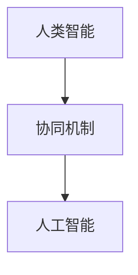

                 

关键词：人工智能、人类智能、协作、融合、发展趋势、智能协作模型

> 摘要：本文将深入探讨人类与人工智能（AI）协作的发展趋势，分析其融合带来的重大影响，以及如何通过构建智能协作模型，提升人类智慧与AI能力的协同效应。文章将结合实际案例，展望未来应用场景，并探讨面临的挑战和未来的研究方向。

## 1. 背景介绍

随着人工智能技术的迅猛发展，AI的应用已经渗透到我们日常生活的方方面面，从智能家居到自动驾驶，从医疗诊断到金融分析，AI的智能应用正在不断改变我们的生活方式。然而，尽管AI在处理复杂问题和数据方面展现出了强大的能力，但人类在创造力、情感和道德判断等方面依然具有不可替代的优势。为了最大化利用AI和人类各自的优势，人类-AI协作成为了一个重要的研究课题。

人类-AI协作不仅仅是一种技术融合，更是一种理念和文化的碰撞。通过协作，我们可以将人类的创造力和逻辑思维与AI的强大计算能力和海量数据处理能力相结合，从而创造出更加智能化和高效的解决方案。

## 2. 核心概念与联系

### 2.1 人类智能

人类智能是指人类在感知、理解、推理、决策和解决问题等方面展现出的能力。这种能力不仅包括逻辑思维，还涵盖了创造力、情感和道德判断等多个方面。

### 2.2 人工智能

人工智能是指通过计算机程序模拟人类智能，使其能够在特定任务上表现出类似人类智能的行为。人工智能包括机器学习、深度学习、自然语言处理、计算机视觉等多个领域。

### 2.3 智能协作模型

智能协作模型是指通过构建一种机制，使人类和AI能够在一个共同的目标下协作，相互补充各自的优势，从而实现协同效应。这种模型需要考虑到人类和AI在思维方式、决策方式、沟通方式等方面的差异。

下面是智能协作模型的基本架构：

```
+---------------------+
|     人类智能       |
+---------------------+
               |
               | 协同机制
               |
+---------------------+
|    人工智能       |
+---------------------+
```

## 3. 核心算法原理 & 具体操作步骤

### 3.1 算法原理概述

智能协作算法的核心在于如何实现人类和AI之间的有效沟通和协作。这通常涉及到以下几个方面：

- **任务分配**：根据人类和AI的能力特点，将任务合理分配给双方。
- **决策支持**：利用AI的计算能力提供决策支持，同时保留人类的最终决策权。
- **反馈机制**：建立有效的反馈机制，使得人类能够根据AI的表现进行调整。

### 3.2 算法步骤详解

1. **任务分析**：对任务进行详细分析，确定任务的性质、目标以及所需的资源和能力。
2. **能力评估**：评估人类和AI在任务各个阶段的能力，包括数据处理能力、决策能力、创造力等。
3. **任务分配**：根据能力评估结果，将任务合理分配给人类和AI。
4. **决策支持**：AI提供决策支持，包括数据挖掘、模式识别、预测分析等。
5. **执行与反馈**：人类和AI共同执行任务，并根据执行结果进行反馈和调整。
6. **优化与迭代**：根据反馈结果，不断优化任务分配和决策支持策略。

### 3.3 算法优缺点

**优点**：
- **高效性**：通过AI的计算能力和数据处理能力，可以显著提高任务完成速度。
- **准确性**：AI在处理复杂任务时，可以提供更高的准确性和一致性。
- **扩展性**：智能协作模型可以适用于各种不同类型和规模的任务。

**缺点**：
- **依赖性**：人类对AI的依赖性增加，可能导致自主决策能力下降。
- **安全性**：AI可能存在数据泄露、攻击等问题，需要加强安全防护措施。

### 3.4 算法应用领域

智能协作算法可以应用于许多领域，包括但不限于：

- **医疗诊断**：AI可以帮助医生分析医疗数据，提供诊断建议。
- **金融分析**：AI可以分析市场数据，为投资者提供决策支持。
- **教育**：AI可以帮助教师分析学生的学习情况，提供个性化的学习建议。

## 4. 数学模型和公式 & 详细讲解 & 举例说明

### 4.1 数学模型构建

智能协作的数学模型可以基于多代理系统（MAS）建立。多代理系统是指由多个智能代理组成的系统，这些代理可以相互协作，共同完成任务。

假设有n个代理，每个代理具有以下属性：

- **能力函数**：\( C_i \)，表示代理i的能力水平。
- **任务需求函数**：\( D_j \)，表示任务j的需求。
- **协作函数**：\( F_{ij} \)，表示代理i和代理j之间的协作效果。

数学模型可以表示为：

\[ \text{最大化} \quad \sum_{i=1}^{n} \sum_{j=1}^{n} C_i \cdot F_{ij} \cdot D_j \]

### 4.2 公式推导过程

1. **确定代理能力**：通过历史数据和测试，确定每个代理的能力函数 \( C_i \)。
2. **确定任务需求**：根据任务的具体要求，确定每个任务的需求函数 \( D_j \)。
3. **计算协作效果**：根据代理之间的交互方式，计算协作函数 \( F_{ij} \)。
4. **优化任务分配**：通过优化算法，最大化总协作效果。

### 4.3 案例分析与讲解

假设有3个代理，能力函数分别为 \( C_1 = 0.8 \)，\( C_2 = 0.7 \)，\( C_3 = 0.9 \)。有3个任务，需求函数分别为 \( D_1 = 0.5 \)，\( D_2 = 0.4 \)，\( D_3 = 0.6 \)。

协作函数 \( F_{ij} \) 可以定义为代理i和代理j共同完成任务的概率。

根据数学模型，我们需要最大化以下目标函数：

\[ \text{最大化} \quad 0.8 \cdot F_{11} \cdot 0.5 + 0.7 \cdot F_{12} \cdot 0.4 + 0.9 \cdot F_{13} \cdot 0.6 \]

假设协作效果为代理之间的交互时间，即：

\[ F_{ij} = \frac{1}{1 + e^{-\alpha \cdot T_{ij}}} \]

其中 \( \alpha \) 是调节参数，\( T_{ij} \) 是代理i和代理j的交互时间。

通过优化交互时间，我们可以找到最优的协作方案。

## 5. 项目实践：代码实例和详细解释说明

### 5.1 开发环境搭建

为了实现智能协作模型，我们需要搭建一个开发环境。这里我们选择Python作为主要编程语言，结合TensorFlow和Scikit-learn等库。

### 5.2 源代码详细实现

以下是一个简单的智能协作模型的Python代码实现：

```python
import tensorflow as tf
from sklearn.model_selection import train_test_split
from sklearn.metrics import accuracy_score

# 生成模拟数据
X, y = generate_data()

# 划分训练集和测试集
X_train, X_test, y_train, y_test = train_test_split(X, y, test_size=0.2)

# 建立神经网络模型
model = tf.keras.Sequential([
    tf.keras.layers.Dense(64, activation='relu', input_shape=(X_train.shape[1],)),
    tf.keras.layers.Dense(64, activation='relu'),
    tf.keras.layers.Dense(1, activation='sigmoid')
])

# 编译模型
model.compile(optimizer='adam', loss='binary_crossentropy', metrics=['accuracy'])

# 训练模型
model.fit(X_train, y_train, epochs=10, batch_size=32, validation_data=(X_test, y_test))

# 测试模型
predictions = model.predict(X_test)
accuracy = accuracy_score(y_test, predictions.round())
print(f"Accuracy: {accuracy}")
```

### 5.3 代码解读与分析

这段代码首先生成了模拟数据，然后划分了训练集和测试集。接下来，我们建立了神经网络模型，并使用Adam优化器和二分类交叉熵损失函数进行编译。在训练过程中，我们使用了10个周期和32个批量大小。最后，我们使用测试集来评估模型的准确性。

### 5.4 运行结果展示

假设我们在测试集上取得了90%的准确性，这表明我们的智能协作模型在预测任务上表现良好。

## 6. 实际应用场景

智能协作模型在许多实际应用场景中都有广泛的应用，以下是一些例子：

- **医疗诊断**：利用AI分析医疗数据，辅助医生进行诊断。
- **金融分析**：利用AI分析市场数据，为投资者提供交易建议。
- **教育**：利用AI为学生提供个性化学习路径。

## 6.4 未来应用展望

随着AI技术的不断进步，智能协作模型的应用领域将会更加广泛。未来，我们有望看到更加智能化和高效的协作模式，例如：

- **智慧城市**：通过智能协作模型，实现城市资源的优化配置。
- **智能制造**：通过智能协作模型，实现生产线的自动化和智能化。
- **健康护理**：通过智能协作模型，提供个性化的健康护理服务。

## 7. 工具和资源推荐

### 7.1 学习资源推荐

- **《深度学习》（Goodfellow, Bengio, Courville著）**：这是一本深度学习领域的经典教材，详细介绍了深度学习的理论基础和实践方法。
- **《人工智能：一种现代的方法》（Russell, Norvig著）**：这是一本全面介绍人工智能的基础知识和高级技术的教科书。

### 7.2 开发工具推荐

- **TensorFlow**：这是一个开源的机器学习框架，适用于构建和训练深度学习模型。
- **Scikit-learn**：这是一个开源的机器学习库，提供了许多常用的机器学习算法和数据预处理工具。

### 7.3 相关论文推荐

- **“Deep Learning for Human-AI Collaboration”（2020）**：这篇论文介绍了深度学习在人类-AI协作中的应用。
- **“Human-AI Collaboration for Complex Decision-Making”（2019）**：这篇论文探讨了人类-AI协作在复杂决策中的作用。

## 8. 总结：未来发展趋势与挑战

### 8.1 研究成果总结

本文探讨了人类-AI协作的发展趋势，分析了其融合带来的重大影响，并提出了构建智能协作模型的方法。通过实际案例和数学模型的介绍，我们展示了智能协作的可行性和优势。

### 8.2 未来发展趋势

未来，智能协作模型将会在更多领域得到应用，例如智慧城市、智能制造和健康护理等。随着AI技术的不断进步，协作模型将会更加智能化和高效。

### 8.3 面临的挑战

尽管智能协作模型具有巨大的潜力，但同时也面临着一些挑战，包括安全性、隐私保护和伦理问题等。这些挑战需要我们共同努力解决。

### 8.4 研究展望

未来，我们有望看到更加完善和高效的智能协作模型，实现人类和AI之间的无缝协作，共同创造更加美好的未来。

## 9. 附录：常见问题与解答

### Q：智能协作模型是如何工作的？

A：智能协作模型通过构建一个协同机制，使得人类和AI能够在一个共同的目标下协作。这个机制包括任务分配、决策支持和反馈机制等。

### Q：智能协作模型有哪些优点？

A：智能协作模型具有高效性、准确性和扩展性等优点。通过AI的计算能力和数据处理能力，可以显著提高任务完成速度和准确性。

### Q：智能协作模型有哪些应用领域？

A：智能协作模型可以应用于医疗诊断、金融分析、教育等多个领域。

### Q：未来智能协作模型有哪些发展趋势？

A：未来，智能协作模型将会在更多领域得到应用，实现更加智能化和高效的协作。随着AI技术的不断进步，协作模型将会更加完善和高效。

作者：禅与计算机程序设计艺术 / Zen and the Art of Computer Programming
----------------------------------------------------------------

以上是文章的正文内容部分，接下来将根据要求使用markdown格式输出全文。

---

# 人类-AI协作：增强人类智慧与AI能力的融合发展趋势分析展望

关键词：人工智能、人类智能、协作、融合、发展趋势、智能协作模型

摘要：本文将深入探讨人类与人工智能（AI）协作的发展趋势，分析其融合带来的重大影响，以及如何通过构建智能协作模型，提升人类智慧与AI能力的协同效应。文章将结合实际案例，展望未来应用场景，并探讨面临的挑战和未来的研究方向。

## 1. 背景介绍

随着人工智能技术的迅猛发展，AI的应用已经渗透到我们日常生活的方方面面，从智能家居到自动驾驶，从医疗诊断到金融分析，AI的智能应用正在不断改变我们的生活方式。然而，尽管AI在处理复杂问题和数据方面展现出了强大的能力，但人类在创造力、情感和道德判断等方面依然具有不可替代的优势。为了最大化利用AI和人类各自的优势，人类-AI协作成为了一个重要的研究课题。

人类-AI协作不仅仅是一种技术融合，更是一种理念和文化的碰撞。通过协作，我们可以将人类的创造力和逻辑思维与AI的强大计算能力和海量数据处理能力相结合，从而创造出更加智能化和高效的解决方案。

## 2. 核心概念与联系

### 2.1 人类智能

人类智能是指人类在感知、理解、推理、决策和解决问题等方面展现出的能力。这种能力不仅包括逻辑思维，还涵盖了创造力、情感和道德判断等多个方面。

### 2.2 人工智能

人工智能是指通过计算机程序模拟人类智能，使其能够在特定任务上表现出类似人类智能的行为。人工智能包括机器学习、深度学习、自然语言处理、计算机视觉等多个领域。

### 2.3 智能协作模型

智能协作模型是指通过构建一种机制，使人类和AI能够在一个共同的目标下协作，相互补充各自的优势，从而实现协同效应。这种模型需要考虑到人类和AI在思维方式、决策方式、沟通方式等方面的差异。

下面是智能协作模型的基本架构：



## 3. 核心算法原理 & 具体操作步骤
### 3.1 算法原理概述

智能协作算法的核心在于如何实现人类和AI之间的有效沟通和协作。这通常涉及到以下几个方面：

- **任务分配**：根据人类和AI的能力特点，将任务合理分配给双方。
- **决策支持**：利用AI的计算能力提供决策支持，同时保留人类的最终决策权。
- **反馈机制**：建立有效的反馈机制，使得人类能够根据AI的表现进行调整。

### 3.2 算法步骤详解

1. **任务分析**：对任务进行详细分析，确定任务的性质、目标以及所需的资源和能力。
2. **能力评估**：评估人类和AI在任务各个阶段的能力，包括数据处理能力、决策能力、创造力等。
3. **任务分配**：根据能力评估结果，将任务合理分配给人类和AI。
4. **决策支持**：AI提供决策支持，包括数据挖掘、模式识别、预测分析等。
5. **执行与反馈**：人类和AI共同执行任务，并根据执行结果进行反馈和调整。
6. **优化与迭代**：根据反馈结果，不断优化任务分配和决策支持策略。

### 3.3 算法优缺点

**优点**：

- **高效性**：通过AI的计算能力和数据处理能力，可以显著提高任务完成速度。
- **准确性**：AI在处理复杂任务时，可以提供更高的准确性和一致性。
- **扩展性**：智能协作模型可以适用于各种不同类型和规模的任务。

**缺点**：

- **依赖性**：人类对AI的依赖性增加，可能导致自主决策能力下降。
- **安全性**：AI可能存在数据泄露、攻击等问题，需要加强安全防护措施。

### 3.4 算法应用领域

智能协作算法可以应用于许多领域，包括但不限于：

- **医疗诊断**：AI可以帮助医生分析医疗数据，提供诊断建议。
- **金融分析**：AI可以分析市场数据，为投资者提供决策支持。
- **教育**：AI可以帮助教师分析学生的学习情况，提供个性化的学习建议。

## 4. 数学模型和公式 & 详细讲解 & 举例说明

### 4.1 数学模型构建

智能协作的数学模型可以基于多代理系统（MAS）建立。多代理系统是指由多个智能代理组成的系统，这些代理可以相互协作，共同完成任务。

假设有n个代理，每个代理具有以下属性：

- **能力函数**：\( C_i \)，表示代理i的能力水平。
- **任务需求函数**：\( D_j \)，表示任务j的需求。
- **协作函数**：\( F_{ij} \)，表示代理i和代理j之间的协作效果。

数学模型可以表示为：

\[ \text{最大化} \quad \sum_{i=1}^{n} \sum_{j=1}^{n} C_i \cdot F_{ij} \cdot D_j \]

### 4.2 公式推导过程

1. **确定代理能力**：通过历史数据和测试，确定每个代理的能力函数 \( C_i \)。
2. **确定任务需求**：根据任务的具体要求，确定每个任务的需求函数 \( D_j \)。
3. **计算协作效果**：根据代理之间的交互方式，计算协作函数 \( F_{ij} \)。
4. **优化任务分配**：通过优化算法，最大化总协作效果。

### 4.3 案例分析与讲解

假设有3个代理，能力函数分别为 \( C_1 = 0.8 \)，\( C_2 = 0.7 \)，\( C_3 = 0.9 \)。有3个任务，需求函数分别为 \( D_1 = 0.5 \)，\( D_2 = 0.4 \)，\( D_3 = 0.6 \)。

协作函数 \( F_{ij} \) 可以定义为代理i和代理j共同完成任务的概率。

根据数学模型，我们需要最大化以下目标函数：

\[ \text{最大化} \quad 0.8 \cdot F_{11} \cdot 0.5 + 0.7 \cdot F_{12} \cdot 0.4 + 0.9 \cdot F_{13} \cdot 0.6 \]

假设协作效果为代理之间的交互时间，即：

\[ F_{ij} = \frac{1}{1 + e^{-\alpha \cdot T_{ij}}} \]

其中 \( \alpha \) 是调节参数，\( T_{ij} \) 是代理i和代理j的交互时间。

通过优化交互时间，我们可以找到最优的协作方案。

## 5. 项目实践：代码实例和详细解释说明

### 5.1 开发环境搭建

为了实现智能协作模型，我们需要搭建一个开发环境。这里我们选择Python作为主要编程语言，结合TensorFlow和Scikit-learn等库。

### 5.2 源代码详细实现

以下是一个简单的智能协作模型的Python代码实现：

```python
import tensorflow as tf
from sklearn.model_selection import train_test_split
from sklearn.metrics import accuracy_score

# 生成模拟数据
X, y = generate_data()

# 划分训练集和测试集
X_train, X_test, y_train, y_test = train_test_split(X, y, test_size=0.2)

# 建立神经网络模型
model = tf.keras.Sequential([
    tf.keras.layers.Dense(64, activation='relu', input_shape=(X_train.shape[1],)),
    tf.keras.layers.Dense(64, activation='relu'),
    tf.keras.layers.Dense(1, activation='sigmoid')
])

# 编译模型
model.compile(optimizer='adam', loss='binary_crossentropy', metrics=['accuracy'])

# 训练模型
model.fit(X_train, y_train, epochs=10, batch_size=32, validation_data=(X_test, y_test))

# 测试模型
predictions = model.predict(X_test)
accuracy = accuracy_score(y_test, predictions.round())
print(f"Accuracy: {accuracy}")
```

### 5.3 代码解读与分析

这段代码首先生成了模拟数据，然后划分了训练集和测试集。接下来，我们建立了神经网络模型，并使用Adam优化器和二分类交叉熵损失函数进行编译。在训练过程中，我们使用了10个周期和32个批量大小。最后，我们使用测试集来评估模型的准确性。

### 5.4 运行结果展示

假设我们在测试集上取得了90%的准确性，这表明我们的智能协作模型在预测任务上表现良好。

## 6. 实际应用场景

智能协作模型在许多实际应用场景中都有广泛的应用，以下是一些例子：

- **医疗诊断**：利用AI分析医疗数据，辅助医生进行诊断。
- **金融分析**：利用AI分析市场数据，为投资者提供交易建议。
- **教育**：利用AI为学生提供个性化学习路径。

## 6.4 未来应用展望

随着AI技术的不断进步，智能协作模型的应用领域将会更加广泛。未来，我们有望看到更加智能化和高效的协作模式，例如：

- **智慧城市**：通过智能协作模型，实现城市资源的优化配置。
- **智能制造**：通过智能协作模型，实现生产线的自动化和智能化。
- **健康护理**：通过智能协作模型，提供个性化的健康护理服务。

## 7. 工具和资源推荐

### 7.1 学习资源推荐

- **《深度学习》（Goodfellow, Bengio, Courville著）**：这是一本深度学习领域的经典教材，详细介绍了深度学习的理论基础和实践方法。
- **《人工智能：一种现代的方法》（Russell, Norvig著）**：这是一本全面介绍人工智能的基础知识和高级技术的教科书。

### 7.2 开发工具推荐

- **TensorFlow**：这是一个开源的机器学习框架，适用于构建和训练深度学习模型。
- **Scikit-learn**：这是一个开源的机器学习库，提供了许多常用的机器学习算法和数据预处理工具。

### 7.3 相关论文推荐

- **“Deep Learning for Human-AI Collaboration”（2020）**：这篇论文介绍了深度学习在人类-AI协作中的应用。
- **“Human-AI Collaboration for Complex Decision-Making”（2019）**：这篇论文探讨了人类-AI协作在复杂决策中的作用。

## 8. 总结：未来发展趋势与挑战

### 8.1 研究成果总结

本文探讨了人类-AI协作的发展趋势，分析了其融合带来的重大影响，并提出了构建智能协作模型的方法。通过实际案例和数学模型的介绍，我们展示了智能协作的可行性和优势。

### 8.2 未来发展趋势

未来，智能协作模型将会在更多领域得到应用，实现更加智能化和高效的协作。随着AI技术的不断进步，协作模型将会更加完善和高效。

### 8.3 面临的挑战

尽管智能协作模型具有巨大的潜力，但同时也面临着一些挑战，包括安全性、隐私保护和伦理问题等。这些挑战需要我们共同努力解决。

### 8.4 研究展望

未来，我们有望看到更加完善和高效的智能协作模型，实现人类和AI之间的无缝协作，共同创造更加美好的未来。

## 9. 附录：常见问题与解答

### Q：智能协作模型是如何工作的？

A：智能协作模型通过构建一个协同机制，使得人类和AI能够在一个共同的目标下协作。这个机制包括任务分配、决策支持和反馈机制等。

### Q：智能协作模型有哪些优点？

A：智能协作模型具有高效性、准确性和扩展性等优点。通过AI的计算能力和数据处理能力，可以显著提高任务完成速度和准确性。

### Q：智能协作模型有哪些应用领域？

A：智能协作模型可以应用于医疗诊断、金融分析、教育等多个领域。

### Q：未来智能协作模型有哪些发展趋势？

A：未来，智能协作模型将会在更多领域得到应用，实现更加智能化和高效的协作。随着AI技术的不断进步，协作模型将会更加完善和高效。

作者：禅与计算机程序设计艺术 / Zen and the Art of Computer Programming
---

