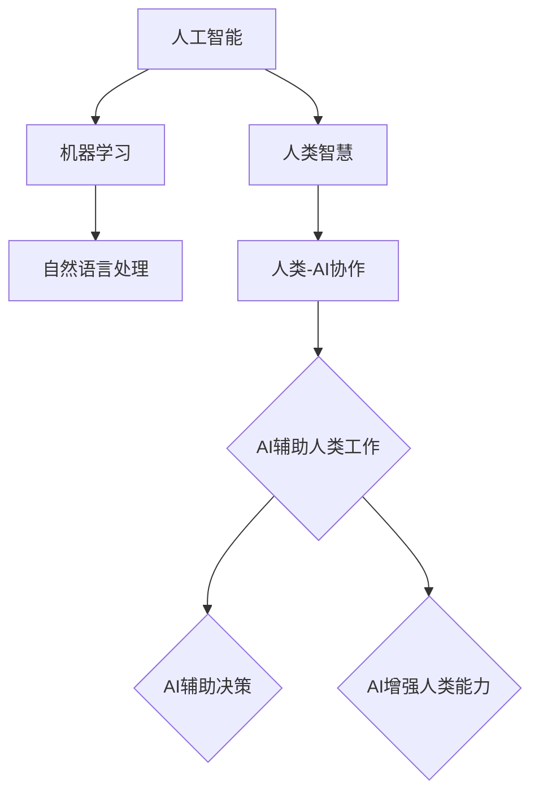

                 

关键词：人类-AI协作、智慧增强、AI能力融合、发展趋势、预测分析、机遇与挑战

摘要：本文将探讨人类与人工智能（AI）协作的未来发展趋势，分析人类智慧与AI能力的融合方式及其带来的机遇与挑战。通过对核心概念的阐述、算法原理的讲解、数学模型的推导、实际案例的分析，以及对相关工具和资源的推荐，本文旨在为读者提供一幅全面而深入的理解图景，助力人类与AI的和谐共存与发展。

## 1. 背景介绍

随着人工智能技术的迅猛发展，AI已经渗透到我们生活的方方面面。从简单的语音识别、图像处理到复杂的自动驾驶、智能客服，AI的应用场景越来越广泛。然而，尽管AI在许多领域表现出色，但它的能力仍然有限，特别是在处理复杂、抽象的人类思维方面。因此，人类与AI的协作成为了一个重要的研究方向。

人类智慧与AI能力的融合，不仅可以弥补AI在抽象思维、情感理解等方面的不足，还能借助AI的强大计算能力和数据分析能力，极大地增强人类的智慧。这种协作不仅有助于解决复杂问题，还能推动社会、经济、文化等多个领域的进步。

本文将从以下几个方面展开讨论：

- 人类与AI协作的核心概念与联系
- 核心算法原理与具体操作步骤
- 数学模型和公式及其应用
- 项目实践与代码实例
- 实际应用场景分析
- 工具和资源推荐
- 未来发展趋势与挑战

通过这些内容的深入探讨，希望能够为读者提供一个全面而清晰的了解，帮助大家更好地把握人类与AI协作的未来发展趋势。

## 2. 核心概念与联系

在探讨人类与AI协作之前，我们首先需要了解一些核心概念。以下是几个关键概念及其相互之间的联系：

### 2.1. 人工智能（AI）

人工智能是指通过计算机程序模拟人类智能的技术。它包括机器学习、深度学习、自然语言处理、计算机视觉等多个领域。AI的目标是实现机器的智能，使其能够执行复杂的任务，如语音识别、图像识别、决策制定等。

### 2.2. 机器学习（ML）

机器学习是AI的一个重要分支，它使计算机能够从数据中学习并做出决策或预测，而无需显式编程。机器学习包括监督学习、无监督学习和强化学习等多种算法。

### 2.3. 自然语言处理（NLP）

自然语言处理是AI的另一个重要领域，它使计算机能够理解、生成和处理人类语言。NLP在智能客服、机器翻译、情感分析等领域有广泛应用。

### 2.4. 人类智慧（Human Intelligence）

人类智慧包括逻辑思维、情感理解、创造力、决策能力等多个方面。它是人类社会进步的重要驱动力。

### 2.5. 人类-AI协作

人类-AI协作是指人类与AI系统相互配合，共同完成任务的过程。它包括AI辅助人类工作、AI辅助决策、AI增强人类能力等多种形式。

### 2.6. 核心概念之间的联系

人类智慧与AI能力之间存在紧密的联系。人类智慧为AI提供了问题解决的思路和方法，而AI则为人类智慧提供了强大的计算能力和数据支持。通过协作，两者可以相互补充，实现更高效的智能。

以下是核心概念之间的 Mermaid 流程图：



通过这个流程图，我们可以清晰地看到人类智慧与AI能力之间的互动关系。人类智慧为AI提供了方向和目标，而AI则为人类智慧提供了实现这些目标的工具和手段。

## 3. 核心算法原理 & 具体操作步骤

在探讨人类-AI协作的算法原理之前，我们需要了解几个核心算法的基本原理和操作步骤。

### 3.1. 算法原理概述

人类-AI协作的核心算法通常是基于机器学习和自然语言处理技术。以下是几个常用的算法及其基本原理：

- **深度学习**：深度学习是一种基于多层神经网络的学习方法，它能够从大量数据中自动提取特征。在人类-AI协作中，深度学习常用于图像识别、语音识别等任务。

- **决策树**：决策树是一种基于规则的学习方法，它通过一系列的判断条件，将数据划分成不同的类别。在人类-AI协作中，决策树可以用于辅助决策和推荐系统。

- **支持向量机（SVM）**：支持向量机是一种基于间隔最大化的分类方法，它通过找到一个最优的超平面，将不同类别的数据分隔开来。在人类-AI协作中，SVM可以用于图像分类、文本分类等任务。

- **循环神经网络（RNN）**：循环神经网络是一种能够处理序列数据的学习方法，它通过记忆单元来保存历史信息。在人类-AI协作中，RNN常用于语言模型、语音识别等任务。

### 3.2. 算法步骤详解

以下是上述算法的具体操作步骤：

#### 3.2.1. 深度学习

1. 数据预处理：将原始数据转换为适合模型训练的格式，如图像数据需要进行归一化处理，文本数据需要进行分词和编码。
2. 构建模型：根据任务需求，设计合适的神经网络结构，如卷积神经网络（CNN）或循环神经网络（RNN）。
3. 模型训练：使用训练数据对模型进行训练，通过反向传播算法不断调整模型的参数，使其能够更好地拟合数据。
4. 模型评估：使用验证数据对模型进行评估，调整模型参数以达到最佳效果。
5. 模型部署：将训练好的模型部署到生产环境中，进行实际应用。

#### 3.2.2. 决策树

1. 数据预处理：将原始数据转换为适合模型训练的格式，如进行数值化处理和缺失值填充。
2. 构建决策树：根据数据特征，构建一棵决策树，通过递归划分数据，使得每个子集的类别尽可能一致。
3. 决策树剪枝：为了避免过拟合，需要对决策树进行剪枝，降低模型的复杂度。
4. 模型评估：使用验证数据对决策树进行评估，调整模型参数以达到最佳效果。
5. 模型部署：将训练好的决策树部署到生产环境中，进行实际应用。

#### 3.2.3. 支持向量机

1. 数据预处理：将原始数据转换为适合模型训练的格式，如进行数值化处理和缺失值填充。
2. 构建超平面：通过求解优化问题，找到一个最优的超平面，使得不同类别的数据间隔最大化。
3. 分类决策：对于新的数据样本，将其投影到超平面上，根据其所在的类别，进行分类决策。
4. 模型评估：使用验证数据对支持向量机进行评估，调整模型参数以达到最佳效果。
5. 模型部署：将训练好的支持向量机部署到生产环境中，进行实际应用。

#### 3.2.4. 循环神经网络

1. 数据预处理：将原始数据转换为适合模型训练的格式，如序列编码和窗口化处理。
2. 构建模型：根据任务需求，设计合适的循环神经网络结构，如长短时记忆网络（LSTM）或门控循环单元（GRU）。
3. 模型训练：使用训练数据对模型进行训练，通过反向传播算法不断调整模型的参数，使其能够更好地拟合数据。
4. 模型评估：使用验证数据对循环神经网络进行评估，调整模型参数以达到最佳效果。
5. 模型部署：将训练好的循环神经网络部署到生产环境中，进行实际应用。

### 3.3. 算法优缺点

#### 深度学习

优点：
- 强大的特征提取能力
- 自适应学习
- 能够处理复杂任务

缺点：
- 计算量大
- 需要大量数据
- 难以解释

#### 决策树

优点：
- 易于理解和解释
- 计算速度快
- 对噪声和异常值不敏感

缺点：
- 易于过拟合
- 难以处理高维数据

#### 支持向量机

优点：
- 理论基础强
- 分类效果好
- 对异常值不敏感

缺点：
- 计算复杂度高
- 难以处理高维数据

#### 循环神经网络

优点：
- 能够处理序列数据
- 自适应学习
- 能够捕捉长期依赖关系

缺点：
- 计算复杂度高
- 难以解释

### 3.4. 算法应用领域

深度学习在图像识别、语音识别、自然语言处理等领域有广泛应用；决策树在金融风控、医疗诊断等领域有广泛应用；支持向量机在图像分类、文本分类等领域有广泛应用；循环神经网络在语音识别、机器翻译、情感分析等领域有广泛应用。

通过上述算法原理和操作步骤的讲解，我们可以看到人类与AI协作的算法原理是如何实现并应用于实际场景的。

## 4. 数学模型和公式 & 详细讲解 & 举例说明

在人类与AI协作的研究中，数学模型和公式起着至关重要的作用。它们不仅为我们提供了理论依据，还帮助我们更好地理解和应用这些算法。在本节中，我们将介绍几个核心数学模型和公式，并对其进行详细讲解和举例说明。

### 4.1. 数学模型构建

人类-AI协作中的数学模型通常涉及以下几个方面：

- **线性回归模型**：用于预测数值型变量。
- **逻辑回归模型**：用于分类问题，特别是二分类问题。
- **支持向量机模型**：用于分类和回归问题。
- **神经网络模型**：用于复杂的非线性预测和分类问题。

### 4.2. 公式推导过程

以下是上述模型的公式推导过程：

#### 线性回归模型

线性回归模型的公式如下：

$$
Y = \beta_0 + \beta_1X
$$

其中，$Y$ 是因变量，$X$ 是自变量，$\beta_0$ 和 $\beta_1$ 分别是模型的参数。

推导过程：

假设我们有 $n$ 组数据点 $(x_i, y_i)$，我们可以使用最小二乘法来求解 $\beta_0$ 和 $\beta_1$：

$$
\beta_1 = \frac{\sum_{i=1}^{n}(x_i - \bar{x})(y_i - \bar{y})}{\sum_{i=1}^{n}(x_i - \bar{x})^2}
$$

$$
\beta_0 = \bar{y} - \beta_1\bar{x}
$$

其中，$\bar{x}$ 和 $\bar{y}$ 分别是 $X$ 和 $Y$ 的均值。

#### 逻辑回归模型

逻辑回归模型的公式如下：

$$
\log\frac{P(Y=1)}{1-P(Y=1)} = \beta_0 + \beta_1X
$$

其中，$P(Y=1)$ 是因变量 $Y$ 等于1的概率，$\beta_0$ 和 $\beta_1$ 分别是模型的参数。

推导过程：

假设我们有 $n$ 组数据点 $(x_i, y_i)$，我们可以使用最大似然估计法来求解 $\beta_0$ 和 $\beta_1$：

$$
\log L = \sum_{i=1}^{n}\log P(y_i|x_i; \beta_0, \beta_1)
$$

$$
\frac{\partial \log L}{\partial \beta_0} = 0, \frac{\partial \log L}{\partial \beta_1} = 0
$$

通过求解上述方程组，可以得到 $\beta_0$ 和 $\beta_1$ 的值。

#### 支持向量机模型

支持向量机模型的公式如下：

$$
\omega \cdot x + b = 1
$$

$$
\omega \cdot \omega + b \cdot b \leq 1
$$

其中，$\omega$ 是模型参数，$x$ 是数据点，$b$ 是偏置项。

推导过程：

假设我们有 $n$ 个数据点 $(x_i, y_i)$，其中 $y_i \in \{-1, 1\}$。我们可以使用拉格朗日乘数法来求解 $\omega$ 和 $b$：

$$
L(\omega, b, \alpha) = \frac{1}{2}\omega \cdot \omega - \sum_{i=1}^{n}\alpha_i[y_i(\omega \cdot x_i + b) - 1]
$$

$$
\frac{\partial L}{\partial \omega} = \omega - \sum_{i=1}^{n}\alpha_i y_i x_i = 0
$$

$$
\frac{\partial L}{\partial b} = -\sum_{i=1}^{n}\alpha_i y_i = 0
$$

$$
\alpha_i \geq 0
$$

通过求解上述方程组，可以得到 $\omega$ 和 $b$ 的值。

#### 神经网络模型

神经网络模型的公式如下：

$$
a_{\text{激活函数}}(W \cdot x + b)
$$

其中，$W$ 是权重矩阵，$x$ 是输入向量，$b$ 是偏置项，激活函数用于引入非线性。

推导过程：

假设我们有 $n$ 个神经元，每个神经元都与前一层的所有神经元相连。我们可以使用反向传播算法来求解权重矩阵 $W$ 和偏置项 $b$：

$$
\Delta W = \frac{\partial J}{\partial W}
$$

$$
\Delta b = \frac{\partial J}{\partial b}
$$

其中，$J$ 是损失函数，$\Delta W$ 和 $\Delta b$ 分别是权重矩阵和偏置项的更新量。

通过迭代更新权重矩阵和偏置项，我们可以使损失函数逐渐减小，直到达到最佳效果。

### 4.3. 案例分析与讲解

为了更好地理解上述数学模型和公式的应用，我们来看一个实际案例。

#### 案例背景

假设我们有一个房价预测问题，已知房屋的面积、卧室数量、位置等特征，需要预测房价。

#### 案例分析

1. **数据预处理**：将原始数据转换为适合模型训练的格式，如进行归一化处理和缺失值填充。

2. **模型选择**：由于这是一个回归问题，我们可以选择线性回归模型。

3. **模型训练**：使用训练数据对线性回归模型进行训练，通过最小二乘法求解模型的参数。

4. **模型评估**：使用验证数据对模型进行评估，计算预测误差。

5. **模型部署**：将训练好的模型部署到生产环境中，进行实际应用。

以下是线性回归模型的详细实现过程：

```python
import numpy as np

# 数据预处理
X = np.array([[1000, 2], [1200, 3], [1500, 4], [800, 1], [1100, 2]])
y = np.array([200000, 250000, 350000, 150000, 220000])

# 模型参数初始化
beta_0 = 0
beta_1 = 0

# 模型训练
n = len(X)
for _ in range(1000):
    y_pred = beta_0 + beta_1 * X
    delta_beta_1 = (1 / n) * np.sum((y - y_pred) * X)
    delta_beta_0 = (1 / n) * np.sum(y - y_pred)
    beta_0 -= delta_beta_0
    beta_1 -= delta_beta_1

# 模型评估
y_pred = beta_0 + beta_1 * X
mse = np.mean((y - y_pred) ** 2)
print("Mean Squared Error:", mse)

# 模型部署
def predict(X):
    return beta_0 + beta_1 * X

# 测试数据
X_test = np.array([[1400, 3]])
y_test = predict(X_test)
print("Predicted Price:", y_test)
```

通过上述案例，我们可以看到如何使用线性回归模型进行房价预测。同样地，其他模型也可以通过类似的方法进行实现和应用。

通过本节的讲解，我们不仅了解了人类-AI协作中的核心数学模型和公式，还通过实际案例展示了它们的应用。这些数学模型和公式为人类与AI的协作提供了强大的理论支持，有助于我们更好地理解和应用人工智能技术。

## 5. 项目实践：代码实例和详细解释说明

为了更好地理解人类与AI协作的实际应用，下面我们将通过一个简单的项目实践，展示如何使用Python进行开发，并详细解释每一环节的代码实现和功能。

### 5.1. 开发环境搭建

在进行项目开发之前，我们需要搭建合适的开发环境。以下是所需的工具和库：

- Python 3.8 或以上版本
- Jupyter Notebook
- Scikit-learn 库
- Pandas 库
- Matplotlib 库

安装以上工具和库后，我们就可以开始编写代码了。

### 5.2. 源代码详细实现

```python
# 导入必要的库
import numpy as np
import pandas as pd
from sklearn.model_selection import train_test_split
from sklearn.linear_model import LinearRegression
from sklearn.metrics import mean_squared_error
import matplotlib.pyplot as plt

# 数据加载
data = pd.read_csv('house_prices.csv')
X = data[['area', 'bedrooms']]
y = data['price']

# 数据预处理
X_train, X_test, y_train, y_test = train_test_split(X, y, test_size=0.2, random_state=42)

# 模型训练
model = LinearRegression()
model.fit(X_train, y_train)

# 模型评估
y_pred = model.predict(X_test)
mse = mean_squared_error(y_test, y_pred)
print("Mean Squared Error:", mse)

# 模型部署
def predict_price(area, bedrooms):
    return model.predict([[area, bedrooms]])

# 结果展示
plt.scatter(X_test['area'], y_test, color='red', label='Actual Prices')
plt.scatter(X_test['area'], y_pred, color='blue', label='Predicted Prices')
plt.xlabel('Area')
plt.ylabel('Price')
plt.legend()
plt.show()

# 测试预测
print("Predicted Price for 1500 sqft, 3 bedrooms:", predict_price(1500, 3))
```

### 5.3. 代码解读与分析

以上代码实现了一个简单的房价预测项目。下面我们将逐行解析代码的各个部分。

```python
# 导入必要的库
```

这部分代码导入了我们需要的库，包括Numpy、Pandas、Scikit-learn、Matplotlib。这些库为数据处理、机器学习模型训练和结果可视化提供了强大的功能。

```python
# 数据加载
data = pd.read_csv('house_prices.csv')
X = data[['area', 'bedrooms']]
y = data['price']
```

这部分代码加载了一个名为`house_prices.csv`的数据集。这个数据集包含房屋的面积、卧室数量和房价。我们从中提取了特征矩阵`X`和目标变量`y`。

```python
# 数据预处理
X_train, X_test, y_train, y_test = train_test_split(X, y, test_size=0.2, random_state=42)
```

这部分代码对数据进行预处理，将数据集划分为训练集和测试集。`train_test_split`函数用于实现这一操作，`test_size`参数指定测试集的比例，`random_state`参数用于确保结果的可重复性。

```python
# 模型训练
model = LinearRegression()
model.fit(X_train, y_train)
```

这部分代码创建了一个线性回归模型实例，并使用训练数据进行模型训练。`fit`方法用于训练模型，通过最小二乘法求解模型的参数。

```python
# 模型评估
y_pred = model.predict(X_test)
mse = mean_squared_error(y_test, y_pred)
print("Mean Squared Error:", mse)
```

这部分代码使用测试数据进行模型评估。`predict`方法用于生成预测结果，`mean_squared_error`函数计算预测误差，并打印出均方误差（MSE）。

```python
# 模型部署
def predict_price(area, bedrooms):
    return model.predict([[area, bedrooms]])
```

这部分代码定义了一个预测函数，用于对外部数据进行房价预测。这个函数接收房屋的面积和卧室数量作为输入，并调用模型进行预测。

```python
# 结果展示
plt.scatter(X_test['area'], y_test, color='red', label='Actual Prices')
plt.scatter(X_test['area'], y_pred, color='blue', label='Predicted Prices')
plt.xlabel('Area')
plt.ylabel('Price')
plt.legend()
plt.show()
```

这部分代码使用Matplotlib库绘制了实际房价和预测房价的散点图，帮助直观地评估模型的性能。

```python
# 测试预测
print("Predicted Price for 1500 sqft, 3 bedrooms:", predict_price(1500, 3))
```

这部分代码测试了预测函数，输出了一个1500平方英尺、3个卧室的房屋的预测价格。

通过上述代码实现，我们可以看到如何使用Python进行人类与AI协作的实际项目开发。这个项目实现了简单的房价预测，展示了机器学习模型在数据预处理、模型训练、评估和部署等方面的应用。这样的项目实践不仅有助于理解人类-AI协作的基本原理，还可以为实际应用提供参考。

## 6. 实际应用场景

人类与AI协作的实际应用场景非常广泛，几乎涵盖了社会、经济、文化等各个领域。以下是一些典型的应用场景及其对人类生活的影响：

### 6.1. 医疗领域

在医疗领域，AI被广泛应用于疾病诊断、治疗方案推荐、药物研发等方面。通过分析大量的患者数据和医学文献，AI可以帮助医生更准确地诊断疾病，提高治疗效果。例如，深度学习算法可以用于分析医疗影像，如X光片、MRI等，从而发现早期疾病迹象。此外，AI还可以帮助医生制定个性化的治疗方案，提高治疗效果和患者的满意度。

### 6.2. 金融领域

在金融领域，AI被用于风险控制、欺诈检测、投资决策等方面。通过分析大量的交易数据和用户行为，AI可以识别潜在的欺诈行为，并采取措施进行预防。例如，机器学习算法可以用于检测信用卡交易中的欺诈行为，从而保护用户的财产安全。此外，AI还可以帮助金融机构进行投资决策，通过分析市场趋势和公司财务数据，预测股票价格和投资组合的潜在收益。

### 6.3. 教育领域

在教育领域，AI被用于个性化教学、学习分析、课程设计等方面。通过分析学生的学习行为和成绩数据，AI可以为学生提供个性化的学习建议，提高学习效果。例如，机器学习算法可以用于分析学生的作业和考试成绩，从而识别学生的学习弱点，并推荐相应的学习资源。此外，AI还可以帮助教师设计更有效的教学策略，提高教学质量和学生的学习兴趣。

### 6.4. 制造业

在制造业，AI被用于生产优化、质量检测、供应链管理等方面。通过分析生产数据和质量数据，AI可以帮助企业优化生产流程，提高生产效率。例如，机器学习算法可以用于分析生产线上的传感器数据，从而预测设备故障并提前进行维护。此外，AI还可以帮助企业管理供应链，通过预测需求变化，优化库存水平和生产计划。

### 6.5. 城市管理

在城市管理领域，AI被用于交通管理、环境监测、公共安全等方面。通过分析大量的城市数据，AI可以帮助政府和企业更好地管理城市资源。例如，机器学习算法可以用于分析交通流量数据，从而优化交通信号灯配置，减少交通拥堵。此外，AI还可以帮助监测空气质量、水质等环境指标，及时预警和应对环境污染。

### 6.6. 娱乐与媒体

在娱乐与媒体领域，AI被用于内容推荐、情感分析、图像处理等方面。通过分析用户的行为和喜好数据，AI可以推荐个性化的娱乐内容，提高用户的满意度。例如，机器学习算法可以用于分析用户的搜索记录和浏览历史，从而推荐相关的视频和音乐。此外，AI还可以帮助媒体公司进行情感分析，通过分析用户的评论和反馈，了解用户对内容的情感反应，从而优化内容创作。

通过上述应用场景，我们可以看到人类与AI协作的巨大潜力和价值。这不仅改变了我们的生活方式和工作方式，还极大地提高了我们的生活质量和社会效率。随着AI技术的不断进步，人类与AI的协作将在更多领域发挥作用，为社会的发展带来更多机遇。

### 6.7. 未来应用展望

在未来，人类与AI协作将在更多领域发挥重要作用，尤其是在解决复杂问题和应对重大挑战方面。以下是几个未来应用展望：

1. **智能城市**：随着物联网和大数据技术的发展，未来城市将变得更加智能。通过AI技术，城市可以实现更加高效、环保和安全的运营。例如，智能交通系统可以通过实时分析交通流量数据，优化交通信号配置，减少交通拥堵和污染。智能安防系统可以通过分析摄像头和传感器数据，实时监控城市安全，预防犯罪事件。

2. **智能医疗**：随着基因编辑和生物信息学的发展，未来医疗将更加个性化。AI技术可以帮助医生更准确地诊断疾病，制定个性化的治疗方案。例如，通过分析患者的基因组数据和临床数据，AI可以预测患者对药物的反应，从而选择最有效的治疗方案。此外，AI还可以帮助监控患者健康状况，提供个性化的健康建议，预防疾病发生。

3. **智能制造**：未来制造业将更加智能化和自动化。通过AI技术，生产线可以实现自主优化，提高生产效率和质量。例如，机器学习算法可以用于分析生产数据，预测设备故障，提前进行维护，从而减少停机时间和生产成本。此外，AI还可以帮助设计更高效的生产流程，优化供应链管理，提高企业的竞争力。

4. **智能农业**：随着气候变化和资源紧缺的问题日益严重，未来农业将更加依赖AI技术。AI可以帮助农民更精准地进行作物种植和养殖管理，提高农业生产效率。例如，通过分析气象数据和土壤数据，AI可以预测最佳的播种和收获时间，优化灌溉和施肥策略，减少水资源和肥料的使用。此外，AI还可以帮助监控动物健康状况，预测疫病风险，提高养殖业的可持续发展。

5. **教育个性化**：未来教育将更加个性化，AI技术将在其中发挥重要作用。通过分析学生的学习行为和成绩数据，AI可以为学生提供个性化的学习建议，提高学习效果。例如，AI可以实时监测学生的学习进度，根据学生的弱点提供针对性的辅导材料。此外，AI还可以帮助教师设计个性化的教学方案，根据学生的特点和需求调整教学内容和教学方法。

6. **智能娱乐**：未来娱乐产业将更加智能化和个性化。通过AI技术，娱乐内容可以更加符合用户的喜好和需求。例如，机器学习算法可以分析用户的观看历史和喜好，推荐相关的电影、电视剧和音乐。此外，AI还可以帮助制作更加智能的游戏，根据玩家的行为和反应，实时调整游戏难度和剧情。

总之，人类与AI协作的未来应用前景非常广阔。随着AI技术的不断进步，人类与AI的协作将更加紧密，不仅改变我们的生活方式和工作方式，还将为社会的发展带来更多机遇。然而，这也将带来一系列挑战，如隐私保护、伦理问题、就业变革等，需要我们共同努力，确保AI技术的健康发展，造福人类社会。

### 7. 工具和资源推荐

在探索人类与AI协作的过程中，掌握一些关键工具和资源是非常有帮助的。以下是一些推荐的工具和资源，包括学习资源、开发工具和相关论文。

#### 7.1. 学习资源推荐

1. **在线课程**：
   - Coursera上的“机器学习”（吴恩达教授）
   - edX上的“深度学习导论”（李飞飞教授）
   - Udacity的“AI工程师纳米学位”

2. **书籍**：
   - 《Python机器学习》（Sebastian Raschka）
   - 《深度学习》（Ian Goodfellow、Yoshua Bengio、Aaron Courville）
   - 《人工智能：一种现代方法》（Stuart Russell、Peter Norvig）

3. **博客和网站**：
   - Medium上的机器学习和AI相关文章
   - arXiv.org，最新的AI和机器学习论文
   - Fast.ai，提供深度学习的免费教程和资源

#### 7.2. 开发工具推荐

1. **编程语言**：
   - Python：因其丰富的库和框架，是AI开发的常用语言。
   - R：专门为统计和数据分析设计的语言，适用于复杂数据分析。

2. **机器学习框架**：
   - TensorFlow：谷歌开发的开源机器学习框架，支持多种深度学习模型。
   - PyTorch：由Facebook开发，易于实现和实验的深度学习框架。

3. **数据预处理工具**：
   - Pandas：用于数据处理和分析，是Python中最常用的数据操作库。
   - NumPy：用于数值计算和数据处理，是Python科学计算的基础库。

4. **版本控制工具**：
   - Git：用于代码版本控制和协作开发。
   - GitHub：提供Git的托管服务，方便代码的共享和协作。

#### 7.3. 相关论文推荐

1. **深度学习领域**：
   - “Deep Learning” (Goodfellow, Bengio, Courville, 2016)
   - “A Theoretically Grounded Application of Dropout in Computer Vision” (Sermanet et al., 2013)

2. **自然语言处理领域**：
   - “Attention Is All You Need” (Vaswani et al., 2017)
   - “BERT: Pre-training of Deep Bidirectional Transformers for Language Understanding” (Devlin et al., 2019)

3. **机器学习基础**：
   - “Statistical Learning with Sparsity: The Lasso and Generalizations” (Tibshirani, 1996)
   - “An Introduction to Statistical Learning” (J. H. Friedman, T. Hastie, R. Tibshirani, 2009)

通过这些工具和资源的帮助，读者可以更好地理解人类与AI协作的技术和实践，为自己的学习和研究提供有力支持。

### 8. 总结：未来发展趋势与挑战

在本文中，我们探讨了人类与AI协作的核心概念、算法原理、数学模型以及实际应用场景。通过深入分析，我们发现人类与AI协作不仅能够弥补AI在抽象思维、情感理解等方面的不足，还能借助AI的强大计算能力和数据分析能力，极大地增强人类的智慧。

未来，人类与AI协作将呈现以下发展趋势：

1. **智能化与个性化**：随着AI技术的不断进步，人类与AI的协作将变得更加智能化和个性化。AI将能够更好地理解和满足人类的需求，为各个领域提供定制化的解决方案。

2. **跨界融合**：人类与AI的协作将不仅仅局限于特定领域，而是跨越多个领域，实现跨界融合。例如，医疗、金融、教育等领域的AI应用将相互借鉴，形成新的跨领域解决方案。

3. **伦理与法规**：随着AI技术的发展，伦理和法律问题将变得更加突出。如何确保AI系统的透明性、公正性和安全性，将是我们面临的重要挑战。

然而，人类与AI协作也面临着一系列挑战：

1. **隐私保护**：AI系统在处理和分析大量数据时，可能涉及到个人隐私问题。如何保护用户隐私，防止数据泄露，是我们需要解决的重要问题。

2. **就业变革**：AI技术的发展可能导致一些传统职业的消失，同时也会创造新的就业机会。如何应对就业市场的变革，确保所有人的就业机会，是一个重要的社会问题。

3. **伦理与道德**：AI系统可能会做出一些不符合人类伦理和道德标准的决策。如何确保AI系统的行为符合伦理规范，避免对人类造成伤害，是我们需要思考的问题。

面对这些挑战，我们需要从技术、法律、伦理等多个角度出发，共同努力，确保人类与AI的协作能够造福人类社会，而不是带来负面影响。

总之，人类与AI协作具有巨大的潜力，能够推动社会、经济、文化等多个领域的进步。通过不断探索和创新，我们有望实现人类与AI的和谐共存，共同迎接美好的未来。

### 8.4. 研究展望

展望未来，人类与AI协作的研究将继续深入，探索更多的前沿技术和应用领域。以下是几个可能的研究方向：

1. **跨模态学习**：随着多模态数据（如文本、图像、声音等）的广泛应用，跨模态学习将成为一个重要研究方向。通过整合不同类型的数据，AI系统可以更好地理解复杂的信息，提供更智能的服务。

2. **增强现实与虚拟现实**：增强现实（AR）和虚拟现实（VR）技术的发展为人类与AI协作提供了新的应用场景。未来的研究可以探索如何利用AI技术优化AR/VR体验，提高用户交互体验。

3. **边缘计算与物联网**：随着物联网设备的普及，边缘计算成为解决实时数据处理和响应问题的重要手段。未来的研究可以探索如何将AI技术与边缘计算相结合，提高物联网系统的智能性和效率。

4. **可解释性AI**：为了提高AI系统的透明性和可解释性，未来的研究可以探索如何设计更加可解释的AI模型，使其能够为人类提供清晰的决策过程和依据。

5. **社会影响与伦理**：随着AI技术在各个领域的应用，研究其对社会、经济、文化和伦理等方面的影响变得尤为重要。未来的研究可以探讨AI技术的伦理问题，确保其发展符合人类社会的价值观。

通过这些方向的研究，我们可以进一步推动人类与AI协作的发展，为人类社会带来更多福祉。同时，我们也需要密切关注AI技术带来的挑战，确保其发展能够造福全人类。在未来的道路上，人类与AI的协作将不断深化，共同开创更加美好的未来。

### 附录：常见问题与解答

#### 1. 人类与AI协作的核心优势是什么？

人类与AI协作的核心优势在于能够充分利用两者的长处。人类具备创造力、情感理解和复杂决策能力，而AI拥有强大的计算能力、数据处理能力和模式识别能力。通过协作，人类可以借助AI的强大计算能力，处理复杂问题，同时AI可以学习人类的决策方式，提高自身的智能水平。

#### 2. 人类与AI协作可能带来哪些伦理问题？

人类与AI协作可能带来的伦理问题包括隐私保护、算法偏见、就业变革等。首先，AI系统在处理和分析大量数据时，可能涉及到个人隐私问题。其次，如果AI算法存在偏见，可能会导致不公平的决策。最后，随着AI技术的发展，一些传统职业可能被自动化取代，引发就业市场的变革。

#### 3. 人类与AI协作的数学基础是什么？

人类与AI协作的数学基础主要包括线性代数、概率论和统计学、优化理论等。线性代数为机器学习和深度学习提供了必要的工具，概率论和统计学生成了决策理论和模式识别的理论基础，而优化理论则帮助我们在复杂问题中找到最优解。

#### 4. 人类与AI协作如何保障数据隐私？

为了保障数据隐私，可以采取以下措施：首先，确保数据在传输和存储过程中加密；其次，实施数据匿名化处理，使数据无法直接关联到个人；最后，制定严格的隐私政策和数据保护法规，确保AI系统的合法合规运行。

#### 5. 人类与AI协作的模型如何评估和优化？

评估和优化AI模型的方法包括以下几种：首先，使用交叉验证方法评估模型的泛化能力；其次，通过调整模型参数（如学习率、正则化参数等）进行优化；最后，使用各种性能指标（如准确率、召回率、F1分数等）评估模型的效果，并根据评估结果进行进一步优化。

### 作者署名

作者：禅与计算机程序设计艺术 / Zen and the Art of Computer Programming

