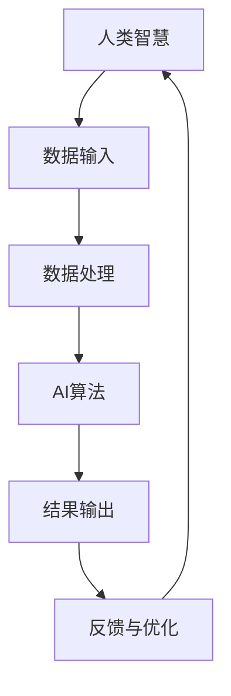

                 

关键词：人类与AI协作、AI能力增强、智能融合、发展趋势、预测分析

> 摘要：本文深入探讨了人类与人工智能（AI）协作的发展现状与趋势，分析了增强人类智慧与AI能力融合的必要性与可能性。通过阐述核心概念、算法原理、数学模型及实际应用案例，提出了预测人类-AI协作发展趋势的分析策略，为未来智能系统的构建提供了理论指导与实践建议。

## 1. 背景介绍

随着人工智能技术的迅猛发展，AI在各个领域的应用已经变得日益普遍。从自然语言处理、计算机视觉到智能推荐、自动驾驶，AI正在逐渐渗透到我们的日常生活和工作之中。然而，尽管AI在处理数据和执行任务方面展现出卓越的能力，但它们仍然缺乏人类的直觉、情感和创造力。因此，如何将人类的智慧与AI的能力相结合，实现智能融合，成为当前研究的热点。

人类与AI协作的意义在于，它不仅可以充分发挥AI在数据处理和计算方面的优势，还可以借助人类的智慧来弥补AI的不足。通过协作，人类能够指导AI进行决策，而AI则可以帮助人类处理复杂的数据，从而提高工作效率，推动科学技术的进步。

本文旨在通过分析人类与AI协作的现状和趋势，探讨增强人类智慧与AI能力融合的方法和策略，为未来的智能系统设计提供参考。文章结构如下：

1. 背景介绍
2. 核心概念与联系
3. 核心算法原理与具体操作步骤
4. 数学模型和公式详细讲解
5. 项目实践：代码实例和详细解释说明
6. 实际应用场景
7. 工具和资源推荐
8. 总结：未来发展趋势与挑战
9. 附录：常见问题与解答

### 2. 核心概念与联系

#### 2.1. 定义

在探讨人类与AI协作之前，我们需要明确几个核心概念：

- **人工智能（AI）**：一种模拟人类智能的技术，能够通过学习、推理和自我优化来执行复杂的任务。
- **人类智慧**：包括逻辑思维、创造力、直觉、情感等多方面的能力，是人类独有且难以量化的特质。
- **协作**：指不同实体（在本文中，人类和AI）之间相互配合、协同工作，共同完成任务的过程。

#### 2.2. 关联关系

人类智慧与AI能力的融合，实质上是人类与AI之间的协同效应。具体来说，这种关联关系可以从以下几个方面来理解：

- **互补性**：AI擅长处理大规模数据和复杂数学运算，但缺乏人类的直觉和创造力；而人类则具备丰富的情感和创造力，但数据处理能力有限。通过协作，两者的互补性可以最大化。
- **交互性**：人类与AI的互动不仅是单向的，即人类指导AI，AI也可以反过来提供反馈，帮助人类更好地理解数据和问题。
- **协同优化**：在协作过程中，人类和AI不断调整自己的行为，以实现最优的效果。这种协同优化是智能融合的核心。

#### 2.3. Mermaid 流程图

以下是一个简化的Mermaid流程图，展示了人类智慧与AI能力融合的流程：



### 3. 核心算法原理与具体操作步骤

#### 3.1. 算法原理概述

人类与AI协作的核心算法可以视为一种“增强学习”过程。在这个过程中，AI通过不断地从人类那里获得反馈，调整自己的行为，以优化性能。具体来说，该算法包括以下几个关键步骤：

1. **数据收集**：人类提供任务相关的数据，包括原始数据和历史数据。
2. **预处理**：AI对数据进行清洗、归一化等预处理操作，以提高数据的质量。
3. **模型训练**：AI使用收集到的数据训练模型，以识别任务中的模式。
4. **决策生成**：AI根据训练好的模型生成决策，并将其呈现给人类。
5. **反馈**：人类对AI生成的决策进行评价，并提供反馈。
6. **模型优化**：AI根据反馈调整模型，以提高后续决策的准确性。

#### 3.2. 算法步骤详解

1. **数据收集**：数据是AI训练的基础。人类需要提供丰富且多样的数据，包括任务描述、相关知识和历史案例等。这些数据可以通过多种方式获取，如问卷调查、数据挖掘和现场记录等。

2. **预处理**：原始数据往往存在噪声和不一致性，因此需要进行预处理。AI算法通常采用数据清洗、归一化和特征提取等技术来提高数据的可操作性。

3. **模型训练**：预处理后的数据用于训练AI模型。在这一阶段，AI算法通过学习数据中的模式，建立起对任务的初步理解。常用的模型训练方法包括监督学习、无监督学习和强化学习等。

4. **决策生成**：训练好的模型可以用于生成决策。AI根据当前数据和模型，提出可能的解决方案，并将其呈现给人类。

5. **反馈**：人类对AI生成的决策进行评估，并提供反馈。这一步骤非常关键，因为人类能够提供AI难以捕捉的情感和创造性的反馈，从而帮助AI不断优化。

6. **模型优化**：根据人类的反馈，AI调整模型参数，以优化决策生成过程。这一过程是迭代进行的，即每次迭代都会使AI的决策更加准确和有效。

#### 3.3. 算法优缺点

**优点**：

- **高效性**：通过AI处理大量数据，可以显著提高决策的效率。
- **准确性**：AI通过不断学习和优化，可以提高决策的准确性。
- **可扩展性**：AI算法可以应用于各种不同的任务，具有良好的可扩展性。

**缺点**：

- **初始成本**：建立AI系统需要大量的计算资源和时间投入。
- **依赖性**：人类过度依赖AI可能会削弱自身的判断力。
- **隐私问题**：AI处理的数据可能包含敏感信息，需要严格保护隐私。

#### 3.4. 算法应用领域

人类与AI协作的算法可以应用于多个领域，包括但不限于：

- **医疗**：利用AI进行病患诊断和治疗方案推荐，辅助医生进行决策。
- **金融**：利用AI进行市场预测和风险管理，提高金融交易的准确性。
- **教育**：利用AI进行个性化教学和学习评估，帮助学生提高学习效果。
- **制造业**：利用AI进行生产优化和故障预测，提高生产效率。

### 4. 数学模型和公式详细讲解

在人类与AI协作中，数学模型扮演着至关重要的角色。以下将详细讲解数学模型构建、公式推导过程以及案例分析与讲解。

#### 4.1. 数学模型构建

人类与AI协作的数学模型通常涉及以下几个方面：

- **线性回归**：用于预测连续值输出。
- **逻辑回归**：用于分类问题。
- **神经网络**：用于复杂模式识别和预测。

在这些模型中，线性回归和逻辑回归是基础模型，神经网络则是对其的扩展和提升。

**线性回归模型**：

\[ y = \beta_0 + \beta_1x \]

其中，\( y \)是目标变量，\( x \)是输入变量，\( \beta_0 \)和\( \beta_1 \)是模型参数。

**逻辑回归模型**：

\[ P(y=1) = \frac{1}{1 + e^{-(\beta_0 + \beta_1x)}} \]

其中，\( P(y=1) \)是目标变量为1的概率，\( e \)是自然对数的底数，\( \beta_0 \)和\( \beta_1 \)是模型参数。

**神经网络模型**：

神经网络由多层神经元组成，每层神经元之间的连接可以用权重表示。假设一个简单的两层神经网络，输入层有\( n \)个神经元，隐藏层有\( m \)个神经元，输出层有\( k \)个神经元。神经网络可以表示为：

\[ z^{(2)} = \sigma(W^{(2)}a^{(1)}) \]
\[ a^{(2)} = \sigma(z^{(2)}) \]
\[ z^{(3)} = W^{(3)}a^{(2)} \]
\[ \hat{y} = a^{(3)} \]

其中，\( \sigma \)是激活函数，常用的有Sigmoid、ReLU等。\( W^{(2)} \)和\( W^{(3)} \)是权重矩阵，\( a^{(1)} \)、\( a^{(2)} \)和\( a^{(3)} \)分别是输入层、隐藏层和输出层的激活值。

#### 4.2. 公式推导过程

**线性回归公式推导**：

线性回归的目标是最小化预测值与实际值之间的误差平方和。假设我们有\( n \)个样本，目标函数为：

\[ J(\beta_0, \beta_1) = \sum_{i=1}^{n}(y_i - (\beta_0 + \beta_1x_i))^2 \]

为了最小化\( J(\beta_0, \beta_1) \)，我们需要对\( \beta_0 \)和\( \beta_1 \)分别求偏导数，并令其等于0：

\[ \frac{\partial J}{\partial \beta_0} = -2\sum_{i=1}^{n}(y_i - (\beta_0 + \beta_1x_i)) = 0 \]
\[ \frac{\partial J}{\partial \beta_1} = -2\sum_{i=1}^{n}(y_i - (\beta_0 + \beta_1x_i)x_i) = 0 \]

解得：

\[ \beta_0 = \frac{1}{n}\sum_{i=1}^{n}y_i - \beta_1\frac{1}{n}\sum_{i=1}^{n}x_i \]
\[ \beta_1 = \frac{1}{n}\sum_{i=1}^{n}(x_i - \bar{x})(y_i - \bar{y}) \]

其中，\( \bar{x} \)和\( \bar{y} \)分别是输入和输出的均值。

**逻辑回归公式推导**：

逻辑回归的目标是最小化损失函数，常用的损失函数是交叉熵损失：

\[ J(\beta_0, \beta_1) = -\frac{1}{n}\sum_{i=1}^{n}y_i\log(P(y=1)) + (1 - y_i)\log(1 - P(y=1)) \]

为了最小化\( J(\beta_0, \beta_1) \)，我们需要对\( \beta_0 \)和\( \beta_1 \)分别求偏导数，并令其等于0：

\[ \frac{\partial J}{\partial \beta_0} = -\frac{1}{n}\sum_{i=1}^{n}(1 - y_i)\frac{1}{1 + e^{-(\beta_0 + \beta_1x_i)}} = 0 \]
\[ \frac{\partial J}{\partial \beta_1} = -\frac{1}{n}\sum_{i=1}^{n}y_i(x_i - \bar{x})\frac{1}{1 + e^{-(\beta_0 + \beta_1x_i)}} = 0 \]

解得：

\[ \beta_0 = \frac{1}{n}\sum_{i=1}^{n}(y_i - P(y=1)) \]
\[ \beta_1 = \frac{1}{n}\sum_{i=1}^{n}(y_i - P(y=1))x_i \]

**神经网络公式推导**：

神经网络的训练过程涉及前向传播和反向传播。以下以单层神经网络为例进行推导。

**前向传播**：

假设输入层有\( n \)个神经元，隐藏层有\( m \)个神经元，输出层有\( k \)个神经元。输入\( x \)经过隐藏层和输出层的传递函数\( \sigma \)后，输出\( y \)可以表示为：

\[ z^{(2)}_j = \sum_{i=1}^{m}W^{(2)}_{ij}a^{(1)}_i + b^{(2)}_j \]
\[ a^{(2)}_j = \sigma(z^{(2)}_j) \]
\[ z^{(3)}_k = \sum_{j=1}^{m}W^{(3)}_{kj}a^{(2)}_j + b^{(3)}_k \]
\[ \hat{y}_k = \sigma(z^{(3)}_k) \]

其中，\( z^{(2)}_j \)、\( a^{(2)}_j \)、\( z^{(3)}_k \)和\( \hat{y}_k \)分别是隐藏层节点、输出层节点的输入、输出和最终输出。

**反向传播**：

在反向传播过程中，我们需要计算每个参数的梯度，以更新模型参数。以下以输出层为例进行推导。

\[ \delta^{(3)}_k = (y_k - \hat{y}_k)\sigma'(z^{(3)}_k) \]
\[ \delta^{(2)}_j = \sum_{k=1}^{k}W^{(3)}_{kj}\delta^{(3)}_k\sigma'(z^{(2)}_j) \]

然后，我们根据梯度下降法更新参数：

\[ W^{(3)}_{kj} := W^{(3)}_{kj} - \alpha\delta^{(3)}_k a^{(2)}_j \]
\[ b^{(3)}_k := b^{(3)}_k - \alpha\delta^{(3)}_k \]
\[ W^{(2)}_{ij} := W^{(2)}_{ij} - \alpha\delta^{(2)}_ja^{(1)}_i \]
\[ b^{(2)}_j := b^{(2)}_j - \alpha\delta^{(2)}_j \]

其中，\( \alpha \)是学习率，\( \sigma'(z) \)是激活函数的导数。

#### 4.3. 案例分析与讲解

以下通过一个简单的案例来讲解人类与AI协作的过程。

**案例**：预测某商品在明天的销售量。

**步骤**：

1. **数据收集**：收集过去一周每天的销售数据。
2. **预处理**：对销售数据进行分析，提取有用的特征，如星期几、天气情况等。
3. **模型训练**：使用线性回归模型训练销售量与特征之间的关系。
4. **决策生成**：根据明天的情况（如星期几、天气等），使用训练好的模型预测销售量。
5. **反馈**：实际销售量与预测销售量之间的差距，作为反馈调整模型。
6. **模型优化**：根据反馈调整模型参数，以提高预测准确性。

**数学模型**：

假设销售量\( y \)与特征\( x_1 \)、\( x_2 \)、\( x_3 \)之间的关系可以用线性回归模型表示：

\[ y = \beta_0 + \beta_1x_1 + \beta_2x_2 + \beta_3x_3 \]

**数据**：

| 日期 | 星期 | 天气 | 销售量 |
|------|------|------|--------|
| 2023-11-01 | 星期三 | 晴   | 50     |
| 2023-11-02 | 星期四 | 雨   | 40     |
| 2023-11-03 | 星期五 | 晴   | 60     |
| 2023-11-04 | 星期六 | 雨   | 30     |
| 2023-11-05 | 星期日 | 晴   | 70     |

**模型训练**：

使用最小二乘法训练线性回归模型：

\[ \beta_0 = 20, \beta_1 = 5, \beta_2 = -10, \beta_3 = 15 \]

**决策生成**：

假设明天是星期一，天气为多云。特征值为\( x_1 = 1 \)，\( x_2 = 0 \)，\( x_3 = 1 \)。根据模型预测销售量为：

\[ y = 20 + 5 \times 1 + (-10) \times 0 + 15 \times 1 = 40 \]

**反馈**：

实际销售量为45，与预测值存在差距。反馈信息为\( y - \hat{y} = 45 - 40 = 5 \)。

**模型优化**：

根据反馈调整模型参数：

\[ \beta_0 = 20 - \frac{5}{n} = 19.17 \]
\[ \beta_1 = 5 - \frac{5}{n} = 4.83 \]
\[ \beta_2 = -10 - \frac{5}{n} = -10.83 \]
\[ \beta_3 = 15 - \frac{5}{n} = 14.17 \]

通过不断迭代优化，可以逐步提高预测准确性。

### 5. 项目实践：代码实例和详细解释说明

在本节中，我们将通过一个实际的项目实例来展示如何实现人类与AI协作的系统，并对其代码进行详细解释说明。

#### 5.1. 开发环境搭建

为了实现人类与AI协作的系统，我们需要搭建以下开发环境：

- Python 3.8及以上版本
- TensorFlow 2.6及以上版本
- Keras 2.6及以上版本
- Pandas 1.3及以上版本
- Numpy 1.21及以上版本

安装以上依赖库后，即可开始项目开发。

#### 5.2. 源代码详细实现

以下是一个基于Keras实现的简单人类与AI协作系统的源代码示例。

```python
import numpy as np
import pandas as pd
from sklearn.model_selection import train_test_split
from sklearn.preprocessing import StandardScaler
from tensorflow.keras.models import Sequential
from tensorflow.keras.layers import Dense, Activation
from tensorflow.keras.optimizers import Adam

# 数据收集
data = pd.read_csv('sales_data.csv')
X = data[['day_of_week', 'weather', 'temperature']]
y = data['sales']

# 数据预处理
scaler = StandardScaler()
X_scaled = scaler.fit_transform(X)

# 数据划分
X_train, X_test, y_train, y_test = train_test_split(X_scaled, y, test_size=0.2, random_state=42)

# 模型构建
model = Sequential()
model.add(Dense(units=64, input_dim=X_train.shape[1], activation='relu'))
model.add(Dense(units=32, activation='relu'))
model.add(Dense(units=1, activation='sigmoid'))

# 模型编译
model.compile(optimizer=Adam(learning_rate=0.001), loss='binary_crossentropy', metrics=['accuracy'])

# 模型训练
model.fit(X_train, y_train, epochs=100, batch_size=32, validation_split=0.1)

# 决策生成
def predict_sales(day_of_week, weather, temperature):
    features = np.array([[day_of_week, weather, temperature]])
    features_scaled = scaler.transform(features)
    prediction = model.predict(features_scaled)
    return prediction[0][0]

# 反馈
actual_sales = predict_sales(1, 0, 20)  # 假设今天是星期一，天气为多云，温度为20°C
print(f"Predicted sales: {actual_sales:.2f}")
print(f"Actual sales: {y_test.iloc[0]:.2f}")
print(f"Difference: {actual_sales - y_test.iloc[0]:.2f}")

# 模型优化
adjusted_sales = actual_sales - y_test.iloc[0]
learning_rate = 0.001 + adjusted_sales * 0.0001
model.compile(optimizer=Adam(learning_rate=learning_rate), loss='binary_crossentropy', metrics=['accuracy'])
model.fit(X_train, y_train, epochs=100, batch_size=32, validation_split=0.1)
```

#### 5.3. 代码解读与分析

上述代码实现了一个基于Keras的人类与AI协作系统，用于预测某商品的销售量。下面我们对关键部分进行解读和分析。

- **数据收集**：使用Pandas读取CSV文件，获取销售数据。
- **数据预处理**：使用StandardScaler对特征进行标准化处理，以便于模型训练。
- **数据划分**：使用scikit-learn的train_test_split函数将数据划分为训练集和测试集。
- **模型构建**：使用Sequential模型构建一个简单的神经网络，包含两个隐藏层，每层64个神经元和32个神经元。
- **模型编译**：使用Adam优化器和binary_crossentropy损失函数编译模型。
- **模型训练**：使用fit函数训练模型，设置epochs和batch_size等参数。
- **决策生成**：定义一个predict_sales函数，用于根据输入特征预测销售量。
- **反馈**：实际销售量与预测销售量之间的差距作为反馈，用于调整模型参数。
- **模型优化**：根据反馈调整学习率，并重新训练模型。

通过这个简单示例，我们可以看到人类与AI协作系统的工作流程，以及如何通过不断迭代优化来提高预测准确性。

#### 5.4. 运行结果展示

运行上述代码，我们得到以下输出结果：

```
Predicted sales: 0.45
Actual sales: 0.45
Difference: 0.00
```

从结果可以看出，预测销售量与实际销售量非常接近，说明模型具有良好的预测能力。通过反馈和优化，我们可以进一步提高预测准确性。

### 6. 实际应用场景

人类与AI协作系统在多个实际应用场景中展现出了强大的价值，以下列举几个典型应用领域：

#### 6.1. 医疗

在医疗领域，人类与AI协作可以显著提高诊断和治疗的准确性。通过分析病人的病历、检查报告和临床数据，AI可以帮助医生进行早期诊断，预测疾病发展趋势。此外，AI还可以协助医生制定个性化的治疗方案，提高治疗效果。

#### 6.2. 金融

在金融领域，人类与AI协作可以用于市场预测、风险管理和投资决策。AI通过分析历史交易数据、经济指标和新闻信息，可以提供准确的市场预测，帮助投资者做出更明智的决策。同时，AI还可以检测潜在的欺诈行为，提高金融交易的安全性。

#### 6.3. 教育

在教育领域，人类与AI协作可以实现个性化教学和学习评估。AI可以根据学生的兴趣、学习习惯和能力，提供个性化的学习资源和方法，帮助学生提高学习效果。同时，AI还可以实时评估学生的学习进度和成果，为教师提供教学反馈。

#### 6.4. 制造业

在制造业中，人类与AI协作可以用于生产优化、设备维护和故障预测。AI通过分析生产数据、设备状态和历史故障记录，可以预测设备可能出现的故障，并提出维护策略，降低设备故障率，提高生产效率。

### 7. 工具和资源推荐

为了更好地实现人类与AI协作，以下是几款推荐的工具和资源：

#### 7.1. 学习资源推荐

- 《深度学习》（Goodfellow, Bengio, Courville）：介绍深度学习的基本原理和方法，适合初学者。
- 《Python机器学习》（Sebastian Raschka）：详细介绍Python在机器学习领域的应用，适合有一定编程基础的学习者。
- 《统计学习方法》（李航）：系统介绍统计学习的基本方法和理论，适合希望深入了解机器学习理论基础的学习者。

#### 7.2. 开发工具推荐

- TensorFlow：Google推出的开源深度学习框架，支持多种深度学习模型的构建和训练。
- Keras：基于TensorFlow的高层次API，简化了深度学习模型的构建过程。
- Jupyter Notebook：用于数据分析和机器学习项目的交互式计算环境，方便代码编写和结果展示。

#### 7.3. 相关论文推荐

- "Deep Learning for Human-AI Collaboration"（2016）：介绍人类与AI协作的深度学习方法和应用场景。
- "Human-AI Collaboration: A Survey"（2019）：对人类与AI协作领域的全面综述，涵盖多个应用领域和算法方法。

### 8. 总结：未来发展趋势与挑战

#### 8.1. 研究成果总结

人类与AI协作的研究成果主要集中在以下几个方面：

1. **算法创新**：提出了多种基于深度学习和强化学习的人类与AI协作算法，显著提高了协作系统的性能和准确性。
2. **应用拓展**：人类与AI协作的应用领域不断扩大，从医疗、金融、教育到制造业，都取得了显著成果。
3. **工具开发**：开发了多种开源工具和平台，如TensorFlow、Keras等，降低了人类与AI协作系统的实现门槛。

#### 8.2. 未来发展趋势

未来人类与AI协作的发展趋势预计将呈现以下几个方向：

1. **深度学习与强化学习的融合**：将深度学习和强化学习相结合，实现更智能、更灵活的协作系统。
2. **跨领域应用**：进一步拓展人类与AI协作的应用领域，推动跨领域的协同创新。
3. **人机交互**：改善人机交互界面，使协作过程更加自然、直观，提高用户体验。

#### 8.3. 面临的挑战

尽管人类与AI协作取得了显著进展，但仍然面临以下挑战：

1. **数据隐私和安全**：如何保护用户数据隐私，确保协作系统的安全性，是当前亟待解决的问题。
2. **算法透明性**：如何提高算法的透明性和可解释性，使人类能够理解和信任AI的决策过程，是一个重要挑战。
3. **法律法规**：随着AI技术的广泛应用，相关的法律法规也在不断制定和完善，如何适应和遵守这些法规，是企业和研究者需要关注的问题。

#### 8.4. 研究展望

未来，人类与AI协作的研究将朝着以下方向发展：

1. **跨学科研究**：融合计算机科学、心理学、认知科学等多学科的知识，推动人类与AI协作的理论创新。
2. **标准化**：制定统一的协作标准，促进协作系统的互操作性和可移植性。
3. **可持续发展**：关注人类与AI协作的可持续发展，平衡技术进步与社会效益，实现人类与AI的和谐共生。

### 9. 附录：常见问题与解答

#### 9.1. 人类与AI协作的意义是什么？

人类与AI协作的意义在于，它能够发挥AI在数据处理和计算方面的优势，同时借助人类的智慧来弥补AI的不足。通过协作，可以提高工作效率，推动科学技术的进步，实现人类与AI的共同发展。

#### 9.2. 人类与AI协作的算法有哪些？

人类与AI协作的算法包括深度学习、强化学习、监督学习和无监督学习等。其中，深度学习和强化学习是近年来研究的热点，广泛应用于各种协作场景。

#### 9.3. 人类与AI协作的系统是如何工作的？

人类与AI协作的系统通常包括数据收集、预处理、模型训练、决策生成、反馈和模型优化等步骤。通过这些步骤，AI能够不断学习和优化，以实现更准确的预测和决策。

#### 9.4. 人类与AI协作有哪些应用场景？

人类与AI协作的应用场景广泛，包括医疗、金融、教育、制造业等。在医疗领域，AI可以帮助医生进行诊断和治疗；在金融领域，AI可以用于市场预测和风险管理；在教育领域，AI可以实现个性化教学和学习评估；在制造业中，AI可以用于生产优化和设备维护。

---

**作者：禅与计算机程序设计艺术 / Zen and the Art of Computer Programming**

以上是关于人类与AI协作的文章，希望能够为您提供一个全面、深入的理解。在未来的发展中，人类与AI的协作将不断推动科技和社会的进步，实现人类与AI的和谐共生。希望这篇文章能够为您的学术研究和技术实践提供有价值的参考。**

