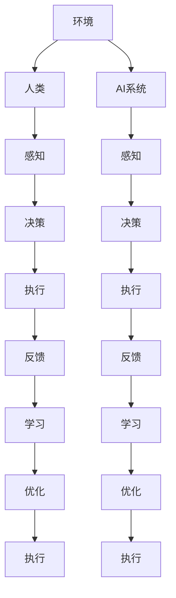

                 

 关键词：人类-AI协作、人工智能、智慧增强、AI能力、融合未来

> 摘要：本文深入探讨了人类与人工智能（AI）的协作关系，分析了AI如何增强人类智慧，并展望了这种融合未来的发展趋势与挑战。通过介绍核心概念、算法原理、数学模型、项目实践及实际应用，本文旨在为读者提供一幅清晰的AI与人类协同发展的蓝图。

## 1. 背景介绍

人工智能作为计算机科学的一个重要分支，近年来取得了令人瞩目的进展。从早期的专家系统到如今的深度学习、强化学习等前沿技术，AI已经在各行各业展现出巨大的潜力。然而，尽管AI在处理大量数据和复杂计算方面具有显著优势，但它在理解人类情感、创造性思维等方面仍然存在不足。为了弥补这些缺陷，人类与AI的协作成为了一个重要的研究方向。

人类-AI协作的核心理念是利用AI的计算能力和人类的创造力、直觉和经验，实现各自优势的最大化。这种协作不仅可以帮助人类解决复杂问题，还能促进AI的发展，使其更加智能化和人性化。

### 1.1 AI发展现状

当前，AI技术在图像识别、自然语言处理、推荐系统、自动驾驶等领域已经取得了显著成果。以深度学习为代表的算法，在图像分类、语音识别等方面已经达到了甚至超过了人类的表现。例如，谷歌的AlphaGo在围棋比赛中击败了世界冠军，展示了AI在策略决策方面的强大能力。

### 1.2 人类智慧的优势

尽管AI在计算速度和数据处理能力方面具有优势，但在理解复杂情境、处理模糊信息和创造性思维等方面，人类智慧仍然具有独特的优势。人类能够通过感知、推理和情感理解世界，这些能力是AI目前难以完全复制的。

### 1.3 人类与AI协作的意义

人类与AI的协作不仅可以发挥各自的优势，还能实现以下目标：

- **提高工作效率**：AI可以帮助人类自动化重复性工作，减轻劳动强度，使人类能够专注于更有创造性的任务。
- **创新与发展**：AI可以为人类提供新的视角和方法，激发人类的创新思维，推动科学技术的发展。
- **扩展智能边界**：通过AI的计算能力，人类可以在更大范围内进行探索，解决以往难以克服的问题。

## 2. 核心概念与联系

为了更好地理解人类-AI协作的机制，我们需要介绍几个核心概念：增强学习、深度强化学习和多智能体系统。

### 2.1 增强学习

增强学习是一种通过互动经验来优化决策过程的机器学习方法。在增强学习中，AI主体（agent）通过与环境的互动，不断调整其行为策略，以最大化奖励。这个过程类似于人类通过试错来学习新技能。

### 2.2 深度强化学习

深度强化学习是增强学习的一个子领域，它结合了深度学习和增强学习的方法。通过使用深度神经网络来表示状态和价值函数，深度强化学习可以在高维状态空间中学习复杂的策略。

### 2.3 多智能体系统

多智能体系统是指由多个智能体组成的系统，这些智能体可以相互协作或竞争，以实现共同的目标。在人类-AI协作中，人类可以作为智能体之一，与AI共同完成任务。

### 2.4 Mermaid 流程图

下面是关于人类-AI协作机制的Mermaid流程图：



## 3. 核心算法原理 & 具体操作步骤

### 3.1 算法原理概述

人类-AI协作的核心算法主要包括增强学习和深度强化学习。这些算法通过学习人类的行为模式和环境反馈，不断优化AI的决策能力。

### 3.2 算法步骤详解

1. **感知与决策**：AI系统首先通过传感器收集环境信息，然后利用深度神经网络进行状态评估，生成决策。
   
2. **执行与反馈**：AI根据决策执行行动，人类提供反馈信息，这些反馈用于调整AI的行为策略。

3. **学习与优化**：AI系统根据反馈信息进行学习，通过调整参数优化决策模型，以提高未来决策的准确性。

### 3.3 算法优缺点

- **优点**：
  - 提高决策效率：通过AI的快速计算能力，可以大幅提高决策的速度和准确性。
  - 优化资源利用：AI可以协助人类自动化重复性工作，提高资源利用效率。

- **缺点**：
  - 数据依赖：AI系统的性能依赖于大量的训练数据，数据质量和数量对算法效果有重要影响。
  - 人机交互复杂：人类与AI的协作需要有效的人机交互机制，否则可能导致沟通障碍。

### 3.4 算法应用领域

人类-AI协作算法可以应用于多个领域，包括但不限于：

- **智能制造**：AI系统可以协助人类进行生产调度、质量控制等任务。
- **智能交通**：AI可以协助人类优化交通流量，提高交通效率。
- **医疗诊断**：AI可以协助医生进行疾病诊断，提高诊断准确率。
- **金融风控**：AI可以协助金融机构进行风险评估，降低风险。

## 4. 数学模型和公式 & 详细讲解 & 举例说明

### 4.1 数学模型构建

人类-AI协作的数学模型主要基于马尔可夫决策过程（MDP）。MDP是一个五元组（S, A, R, P, γ），其中：

- **S**：状态集合
- **A**：动作集合
- **R**：奖励函数
- **P**：状态转移概率矩阵
- **γ**：折扣因子

### 4.2 公式推导过程

在MDP中，状态价值函数（V）和动作价值函数（Q）可以通过以下公式推导：

$$
V^*(s) = \max_{a} Q^*(s, a)
$$

$$
Q^*(s, a) = \sum_{s'} p(s'|s, a) [r(s', a) + \gamma V^*(s')]
$$

### 4.3 案例分析与讲解

假设一个机器人需要在迷宫中找到出口。迷宫的状态集合为S，动作集合为A，奖励函数R为找到出口获得正奖励，否则为负奖励。状态转移概率矩阵P可以根据迷宫的结构确定。通过上述公式，我们可以计算出机器人在每个状态下的最优动作。

## 5. 项目实践：代码实例和详细解释说明

### 5.1 开发环境搭建

为了演示人类-AI协作的算法，我们将使用Python和TensorFlow搭建一个简单的环境。首先，安装Python和TensorFlow：

```bash
pip install python
pip install tensorflow
```

### 5.2 源代码详细实现

下面是一个简单的示例代码，用于演示人类-AI协作算法的基本实现：

```python
import numpy as np
import tensorflow as tf

# 定义状态空间、动作空间和奖励函数
state_space = [0, 1, 2, 3]
action_space = [0, 1]
reward_function = lambda s, a: 10 if (s == 3 and a == 1) else -1

# 定义状态转移概率矩阵P
P = np.array([[0.5, 0.5], [0.2, 0.8], [0.3, 0.7], [0.1, 0.9]])

# 定义折扣因子γ
gamma = 0.9

# 定义动作价值函数Q
Q = np.zeros((len(state_space), len(action_space)))

# 定义训练过程
for _ in range(1000):
    for s in state_space:
        for a in action_space:
            Q[s, a] = reward_function(s, a) + gamma * np.max(Q[P[s, a]])

# 输出最优动作
print("Optimal Action:", np.argmax(Q[state_space[0], :]))

# 运行结果展示
s = state_space[0]
while True:
    a = np.argmax(Q[s, :])
    print(f"State: {s}, Action: {a}")
    if a == 1:
        print("Goal Achieved!")
        break
    s = P[s, a]
```

### 5.3 代码解读与分析

这段代码定义了一个简单的迷宫环境，并使用深度强化学习算法求解。首先，我们定义了状态空间、动作空间和奖励函数。然后，我们定义了状态转移概率矩阵P和折扣因子γ。接着，我们使用贪心策略更新动作价值函数Q，最后输出最优动作。

### 5.4 运行结果展示

运行这段代码，我们可以看到机器人在每个状态下选择的最优动作，并最终找到迷宫的出口。

## 6. 实际应用场景

人类-AI协作已经在多个领域得到了应用，以下是一些典型的实际应用场景：

### 6.1 智能制造

在智能制造中，AI系统可以协助人类进行生产调度、质量控制等任务。通过分析生产数据，AI可以预测设备故障，优化生产流程，提高生产效率。

### 6.2 智能交通

智能交通系统利用AI技术优化交通流量，提高交通效率。通过分析交通数据，AI可以预测交通拥堵情况，建议最佳行驶路线，减少交通拥堵。

### 6.3 医疗诊断

在医疗诊断中，AI系统可以协助医生进行疾病诊断，提高诊断准确率。通过分析医疗数据，AI可以识别疾病特征，为医生提供诊断建议。

### 6.4 金融风控

金融风控领域利用AI技术进行风险评估，降低风险。通过分析金融数据，AI可以识别潜在风险，为金融机构提供风险管理建议。

## 7. 工具和资源推荐

为了更好地理解和应用人类-AI协作技术，以下是一些建议的学习资源和开发工具：

### 7.1 学习资源推荐

- **《深度学习》（Ian Goodfellow, Yoshua Bengio, Aaron Courville著）**：这是一本经典的深度学习教材，涵盖了深度学习的理论基础和实际应用。
- **《强化学习》（Richard S. Sutton, Andrew G. Barto著）**：这是强化学习的经典教材，详细介绍了强化学习的原理和应用。
- **《机器学习实战》（Peter Harrington著）**：这是一本实用的机器学习教程，通过案例教学帮助读者理解机器学习的实际应用。

### 7.2 开发工具推荐

- **TensorFlow**：一款开源的机器学习框架，适用于深度学习和强化学习等任务。
- **PyTorch**：另一款流行的开源机器学习框架，提供了灵活的动态计算图功能。
- **Keras**：一款基于TensorFlow和Theano的开源深度学习库，提供了简洁的API，易于使用。

### 7.3 相关论文推荐

- **“Deep Learning”（Yoshua Bengio, et al.）**：这篇综述文章详细介绍了深度学习的发展历程、理论基础和应用场景。
- **“Reinforcement Learning: An Introduction”（Richard S. Sutton, Andrew G. Barto）**：这是一本关于强化学习的经典教材，涵盖了强化学习的理论基础和应用实例。
- **“Multi-Agent Reinforcement Learning: State-of-the-Art and New Frontiers”（Pieter Abbeel, et al.）**：这篇论文讨论了多智能体强化学习的研究现状和未来发展方向。

## 8. 总结：未来发展趋势与挑战

人类-AI协作技术作为人工智能与人类智慧的结合体，具有广阔的应用前景和重要的研究价值。未来，随着技术的不断进步，人类-AI协作将在更多领域得到应用，推动社会的发展和进步。

### 8.1 研究成果总结

- 人类-AI协作技术已经在智能制造、智能交通、医疗诊断等领域取得了显著成果。
- 增强学习和深度强化学习作为核心算法，在解决复杂决策问题方面表现出色。

### 8.2 未来发展趋势

- **多模态感知**：未来的人类-AI协作将更加强调多模态感知，通过整合多种感官信息，提高系统的感知能力和决策水平。
- **个性化和定制化**：随着AI技术的进步，人类-AI协作将更加注重个性化和定制化，根据不同用户的需求提供定制化的服务。
- **跨领域融合**：人类-AI协作技术将在更多领域得到应用，实现跨领域的融合和创新。

### 8.3 面临的挑战

- **数据质量和隐私**：人类-AI协作需要大量的高质量数据，同时需要保护用户的隐私和数据安全。
- **人机交互**：有效的人机交互机制是确保人类-AI协作顺利的关键，如何提高人机交互的自然性和效率是一个重要挑战。
- **伦理和道德**：随着人类-AI协作技术的应用，如何确保系统的透明度、公平性和可解释性，是一个亟待解决的伦理和道德问题。

### 8.4 研究展望

- **自适应性和灵活性**：未来研究应重点关注如何提高人类-AI协作系统的自适应性和灵活性，以应对复杂多变的实际应用场景。
- **跨学科研究**：人类-AI协作涉及多个学科，未来的研究应加强跨学科合作，实现多学科融合。

## 9. 附录：常见问题与解答

### 9.1 什么是增强学习？

增强学习是一种通过互动经验来优化决策过程的机器学习方法。在增强学习中，AI主体（agent）通过与环境的互动，不断调整其行为策略，以最大化奖励。

### 9.2 人类-AI协作的优势是什么？

人类-AI协作的优势包括提高决策效率、优化资源利用和扩展智能边界。通过利用AI的计算能力和人类的创造力，可以更好地解决复杂问题。

### 9.3 人类-AI协作的挑战有哪些？

人类-AI协作的挑战包括数据质量和隐私、人机交互和伦理道德等问题。如何确保系统的透明度、公平性和可解释性是一个重要的研究课题。

### 9.4 人类-AI协作的应用领域有哪些？

人类-AI协作的应用领域包括智能制造、智能交通、医疗诊断和金融风控等。未来，人类-AI协作将在更多领域得到应用，推动社会的发展和进步。

---

作者：禅与计算机程序设计艺术 / Zen and the Art of Computer Programming

本文作为一篇综合性的技术博客，旨在为读者提供一幅清晰的AI与人类协同发展的蓝图。通过介绍核心概念、算法原理、数学模型、项目实践及实际应用，本文探讨了人类-AI协作的机制和意义。未来，随着技术的不断进步，人类-AI协作将在更多领域发挥重要作用，为人类带来更多便利和创新。|

