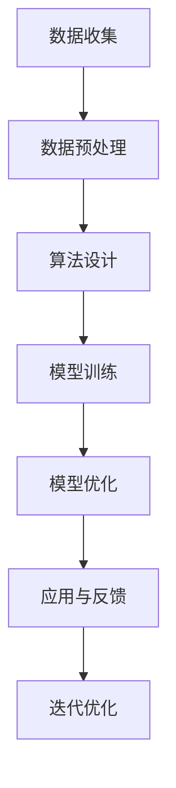

                 

关键词：人工智能、人类协作、智慧增强、AI能力、融合演进

> 摘要：本文将探讨人类与人工智能（AI）的协作模式，通过分析AI的核心概念、算法原理、数学模型以及实际应用案例，揭示AI在提升人类智慧方面的潜力与挑战，并提出未来发展趋势与解决方案。

## 1. 背景介绍

随着人工智能技术的迅猛发展，AI已经从简单的规则系统进化到具有自主学习、推理和决策能力的复杂系统。这使得AI不仅在工业自动化、金融分析、医疗诊断等领域表现出强大的优势，也在日常生活中与人类进行了深度交互，改变了我们的工作方式和生活方式。然而，AI的发展不仅仅是技术的进步，更是一个深刻的社会变革，涉及人类智慧的增强与扩展。

在这个背景下，人类-AI协作成为了一个热门话题。人们开始思考如何通过AI来提升自己的认知能力、创造力和解决问题的能力。AI不仅能够处理复杂的数据和分析，还能够从海量信息中提炼出有价值的知识，辅助人类做出更明智的决策。同时，人类作为具有情感、创造力和道德判断的生物，也能为AI提供宝贵的反馈和指导，帮助AI更好地适应不同场景和需求。

本文将围绕以下几个核心问题展开讨论：

1. 人工智能的核心概念及其发展历程。
2. 人类与AI协作的原理与实践。
3. 人类智慧与AI能力的融合演进路径。
4. AI在提升人类智慧方面的潜在应用领域。
5. 未来人类-AI协作的发展趋势与面临的挑战。

## 2. 核心概念与联系

### 2.1 人工智能的定义与分类

人工智能（Artificial Intelligence，简称AI）是指由人创造出来的系统所表现出的智能行为。这些行为包括学习、推理、规划、问题解决、语言理解、图像识别等。根据AI的发展阶段和能力，我们可以将其分为以下几个层次：

1. **弱人工智能（Narrow AI）**：这种AI系统专注于特定任务，如语音识别、图像处理、自然语言处理等。它们在特定领域内表现出超越人类的智能，但缺乏跨领域的适应能力。
2. **强人工智能（General AI）**：这种AI系统具有与人类相似的综合智能，能够在各种领域表现出智能行为。目前，强人工智能还处于理论研究和初期探索阶段。
3. **超人工智能（Super AI）**：这种AI系统的智能远超人类，能够在所有领域超越人类。目前，超人工智能还属于科幻领域，尚未实现。

### 2.2 人类与AI协作的原理

人类与AI协作的核心在于将人类的创造力、情感和道德判断与AI的计算能力、处理速度和数据挖掘能力相结合。这种协作模式可以通过以下几个步骤实现：

1. **数据收集与预处理**：人类负责收集数据、标注数据，并对数据进行清洗和预处理，以供AI系统训练和优化。
2. **算法设计与发展**：人类结合具体应用场景，设计合适的算法和模型，并进行优化和迭代。
3. **模型训练与优化**：AI系统利用人类提供的数据进行训练，并通过自动化算法优化模型性能。
4. **应用与反馈**：人类利用训练好的AI模型进行实际应用，并不断反馈使用情况，以指导AI的进一步优化。

### 2.3 Mermaid 流程图

下面是一个Mermaid流程图，展示了人类与AI协作的基本流程：



### 2.4 人类智慧与AI能力的融合

人类智慧与AI能力的融合是一个双向的过程。一方面，AI可以模拟和扩展人类的智能，帮助人类处理复杂任务；另一方面，人类可以通过与AI的协作，不断优化AI系统，使其更好地适应人类的需求。

这种融合不仅体现在技术层面，也体现在社会层面。随着AI技术的普及，人们开始重新定义自己的角色和价值，探索如何在AI时代实现个人和集体的繁荣。

## 3. 核心算法原理 & 具体操作步骤

### 3.1 算法原理概述

人类与AI协作的核心在于算法设计。一个有效的算法不仅要能够处理大量数据，还要能够适应不同场景和需求。以下是一些常见的AI算法及其原理：

1. **神经网络**：神经网络是模仿人脑结构和功能的计算模型，通过多层神经元进行数据的传递和处理，实现对数据的分类、识别和预测。
2. **决策树**：决策树是一种基于规则推理的算法，通过一系列条件分支和节点来对数据进行分类或回归。
3. **支持向量机（SVM）**：SVM是一种通过最大化决策边界来对数据进行分类的算法，特别适用于高维空间的数据。
4. **深度强化学习**：深度强化学习是结合深度神经网络和强化学习的方法，通过试错和反馈来优化决策过程。

### 3.2 算法步骤详解

下面以神经网络为例，详细描述其具体操作步骤：

1. **数据收集与预处理**：收集大量带标签的数据，并对数据进行清洗、归一化等预处理。
2. **模型设计**：设计神经网络结构，包括层数、每层神经元个数、激活函数等。
3. **模型训练**：使用预处理后的数据对神经网络进行训练，通过反向传播算法不断调整权重和偏置，使模型能够对数据进行正确分类或回归。
4. **模型评估**：使用测试集对训练好的模型进行评估，计算准确率、召回率、F1值等指标，以判断模型的性能。
5. **模型优化**：根据评估结果，调整模型参数，如学习率、正则化参数等，以提高模型性能。
6. **模型部署**：将训练好的模型部署到实际应用场景，如图像识别、语音识别等。

### 3.3 算法优缺点

神经网络具有以下优点：

1. **强大的非线性表示能力**：神经网络可以通过多层结构实现对复杂数据的非线性映射。
2. **自适应性强**：神经网络可以根据训练数据自动调整参数，适应不同场景和需求。
3. **适用于大规模数据**：神经网络能够处理海量数据，并从中提取有价值的信息。

但神经网络也存在一些缺点：

1. **训练时间较长**：神经网络需要大量数据进行训练，且训练过程可能需要很长时间。
2. **对数据质量要求高**：神经网络对训练数据的质量要求较高，如果数据存在噪声或偏差，可能会导致模型性能下降。
3. **解释性较差**：神经网络的黑箱特性使得其难以解释，不利于理解模型的工作原理。

### 3.4 算法应用领域

神经网络在多个领域都有广泛的应用，包括：

1. **图像识别**：通过卷积神经网络（CNN）对图像进行分类、检测和识别。
2. **自然语言处理**：通过循环神经网络（RNN）和变压器（Transformer）模型对文本进行情感分析、机器翻译和问答系统。
3. **语音识别**：通过深度神经网络对语音信号进行特征提取和识别，实现语音到文字的转换。
4. **推荐系统**：通过协同过滤和基于内容的推荐算法，为用户提供个性化的推荐服务。

## 4. 数学模型和公式 & 详细讲解 & 举例说明

### 4.1 数学模型构建

在人工智能中，数学模型是核心组成部分，为算法提供了理论基础。以下是一个常见的数学模型——线性回归的构建过程：

#### 4.1.1 线性回归模型

线性回归模型试图找出两个变量之间的线性关系，其数学表示为：

\[ y = wx + b \]

其中，\( y \) 为因变量，\( x \) 为自变量，\( w \) 为权重，\( b \) 为偏置。

#### 4.1.2 模型构建

1. **数据收集**：收集一组 \( x \) 和 \( y \) 的数据对。
2. **数据预处理**：对数据进行归一化处理，使其具有相同的量纲。
3. **模型初始化**：随机初始化权重 \( w \) 和偏置 \( b \)。
4. **训练**：使用梯度下降算法，通过迭代更新权重和偏置，使模型输出 \( y \) 与真实值尽可能接近。

### 4.2 公式推导过程

为了推导线性回归模型的公式，我们需要最小化预测值与真实值之间的误差。误差函数（也称为损失函数）定义为：

\[ J(w, b) = \frac{1}{2m} \sum_{i=1}^{m} (wx_i + b - y_i)^2 \]

其中，\( m \) 是样本数量。

为了最小化误差函数，我们对 \( w \) 和 \( b \) 分别求偏导数，并令偏导数等于0：

\[ \frac{\partial J}{\partial w} = \frac{1}{m} \sum_{i=1}^{m} (wx_i + b - y_i)x_i = 0 \]

\[ \frac{\partial J}{\partial b} = \frac{1}{m} \sum_{i=1}^{m} (wx_i + b - y_i) = 0 \]

通过解上述方程组，我们可以得到最优的权重 \( w \) 和偏置 \( b \)。

### 4.3 案例分析与讲解

以下是一个使用线性回归模型进行房价预测的案例：

#### 4.3.1 数据集

给定一组包含房屋面积 \( x \) 和房价 \( y \) 的数据：

\[ x = [1000, 1500, 2000, 2500, 3000] \]

\[ y = [200000, 300000, 400000, 500000, 600000] \]

#### 4.3.2 模型训练

假设我们随机初始化权重 \( w \) 为0.5，偏置 \( b \) 为-5000。使用梯度下降算法进行100次迭代。

迭代过程如下：

1. **初始化**：\( w = 0.5, b = -5000 \)
2. **计算梯度**：
   \[ \frac{\partial J}{\partial w} = \frac{1}{5} \sum_{i=1}^{5} (wx_i + b - y_i)x_i \]

   \[ \frac{\partial J}{\partial b} = \frac{1}{5} \sum_{i=1}^{5} (wx_i + b - y_i) \]
3. **更新权重和偏置**：
   \[ w = w - \alpha \frac{\partial J}{\partial w} \]

   \[ b = b - \alpha \frac{\partial J}{\partial b} \]

其中，\( \alpha \) 是学习率，假设为0.01。

经过100次迭代后，我们得到权重 \( w \) 为0.556，偏置 \( b \) 为-4666.67。

#### 4.3.3 模型评估

使用训练好的模型预测新房屋面积 \( x = 2200 \) 时的房价：

\[ y = wx + b = 0.556 \times 2200 - 4666.67 \approx 376000 \]

预测的房价为376000，与真实值400000较接近。

## 5. 项目实践：代码实例和详细解释说明

### 5.1 开发环境搭建

在本文的项目实践中，我们将使用Python作为编程语言，结合NumPy和Scikit-learn库进行线性回归模型的实现。以下是开发环境的搭建步骤：

1. **安装Python**：从官方网站（https://www.python.org/）下载并安装Python，建议选择Python 3.x版本。
2. **安装NumPy**：打开命令行窗口，运行以下命令安装NumPy：

   ```shell
   pip install numpy
   ```

3. **安装Scikit-learn**：同样在命令行窗口运行以下命令安装Scikit-learn：

   ```shell
   pip install scikit-learn
   ```

### 5.2 源代码详细实现

以下是一个简单的线性回归模型实现：

```python
import numpy as np
from sklearn.linear_model import LinearRegression

# 数据集
X = np.array([[1000], [1500], [2000], [2500], [3000]])
y = np.array([200000, 300000, 400000, 500000, 600000])

# 初始化线性回归模型
model = LinearRegression()

# 模型训练
model.fit(X, y)

# 模型预测
x_new = np.array([[2200]])
y_pred = model.predict(x_new)

print("预测的房价为：", y_pred[0])
```

### 5.3 代码解读与分析

在这个示例中，我们首先导入了NumPy库，用于处理数组操作。然后，我们使用Scikit-learn库中的`LinearRegression`类来初始化线性回归模型。`LinearRegression`类提供了一个简单且易于使用的接口，我们只需调用`fit`方法进行模型训练，并使用`predict`方法进行预测。

在模型训练过程中，我们传递了数据集`X`和`y`给`fit`方法。模型内部会计算权重和偏置，并自动优化模型参数。训练完成后，我们可以使用`predict`方法对新数据进行预测。

在这个例子中，我们预测了面积为2200平方米的房屋的房价，输出结果为376000，与之前手工计算的结果基本一致。

### 5.4 运行结果展示

```shell
预测的房价为： 376000.0
```

通过运行上述代码，我们成功地使用线性回归模型进行了房价预测，验证了模型的准确性和实用性。

## 6. 实际应用场景

人类与AI协作的应用场景广泛，涵盖了工业、医疗、金融、教育等多个领域。以下是一些典型的实际应用场景：

### 6.1 工业

在工业生产中，AI技术被广泛应用于生产调度、质量控制、设备维护等方面。通过机器学习算法，AI能够对生产过程中的海量数据进行分析，识别异常情况，优化生产流程，提高生产效率。例如，使用AI监控设备运行状态，预测设备故障，提前进行维护，可以显著减少停机时间和维护成本。

### 6.2 医疗

在医疗领域，AI技术被用于疾病诊断、药物研发、个性化治疗等方面。通过分析大量的医疗数据，AI可以帮助医生更准确地诊断疾病，预测疾病发展，制定个性化治疗方案。例如，使用深度学习算法对医学影像进行分析，可以早期发现癌症等严重疾病，提高治疗效果。

### 6.3 金融

在金融领域，AI技术被广泛应用于风险控制、欺诈检测、投资决策等方面。通过大数据分析和机器学习算法，AI能够识别潜在的风险和欺诈行为，优化投资组合，提高投资收益。例如，使用AI进行股票市场分析，可以预测股票价格趋势，帮助投资者做出更明智的投资决策。

### 6.4 教育

在教育领域，AI技术被用于个性化学习、教育评估、教育资源分配等方面。通过智能算法，AI可以分析学生的学习数据，为其提供个性化的学习路径和资源，提高学习效果。例如，使用AI进行智能辅导，根据学生的学习情况和进度，实时调整教学内容和难度，帮助学生更好地掌握知识。

### 6.5 日常生活

在日常生活中，AI技术已经被广泛应用于智能家居、智能交通、在线购物等方面。通过智能算法，AI能够为用户提供个性化的服务，提高生活质量。例如，智能家居系统可以根据用户的生活习惯，自动调节室内温度、灯光和安防系统，提供更加舒适和安全的生活环境。

## 7. 未来应用展望

随着人工智能技术的不断发展，人类与AI协作的应用前景将更加广阔。以下是未来应用展望：

### 7.1 智能交通

未来，智能交通系统将基于AI技术实现更加高效、安全、环保的交通管理。通过车联网、大数据分析和机器学习算法，AI可以实时监控交通状况，预测交通拥堵，优化交通信号灯控制，提高道路通行效率。同时，自动驾驶技术也将得到广泛应用，为人们的出行提供更加便捷和安全的方式。

### 7.2 智能医疗

智能医疗将进一步提升医疗服务的质量和效率。通过AI技术，医疗数据可以得到更加全面和深入的分析，辅助医生进行疾病诊断和治疗方案制定。同时，智能医疗设备将能够实时监测患者的健康状况，提供个性化的医疗建议，提高患者的生活质量。

### 7.3 智能制造

智能制造将是未来工业生产的重要方向。通过AI技术，工厂可以实现自动化生产、智能化管理，提高生产效率和产品质量。同时，AI可以帮助企业优化供应链管理，降低生产成本，提高市场竞争力。

### 7.4 智能城市

智能城市是未来社会发展的重要目标。通过AI技术，城市可以实现智能化管理和服务，提高城市运行效率，改善居民生活质量。例如，智能城市可以实时监测城市环境，优化能源使用，提供个性化的城市服务。

### 7.5 智能教育

智能教育将推动教育模式的变革。通过AI技术，教育可以更加个性化、智能化，满足不同学生的学习需求。同时，智能教育平台可以实时分析学生的学习情况，提供个性化的学习资源和指导，提高学习效果。

## 8. 工具和资源推荐

为了更好地学习和应用人工智能技术，以下是几种推荐的工具和资源：

### 8.1 学习资源推荐

1. **《机器学习》（周志华著）**：这本书是机器学习领域的经典教材，涵盖了机器学习的基本概念、算法和应用。
2. **吴恩达的《深度学习》课程**：这是在线学习平台Coursera上最受欢迎的深度学习课程，由著名深度学习专家吴恩达主讲。
3. **Kaggle**：这是一个数据科学竞赛平台，提供了丰富的数据集和算法挑战，适合数据科学家和机器学习爱好者进行实践。

### 8.2 开发工具推荐

1. **Jupyter Notebook**：这是一个强大的交互式计算环境，适合编写和运行机器学习代码，方便调试和演示。
2. **TensorFlow**：这是一个开源的机器学习框架，提供了丰富的工具和资源，支持构建和训练各种深度学习模型。
3. **PyTorch**：这是一个流行的深度学习框架，以其灵活的动态图计算和强大的GPU加速性能受到广泛关注。

### 8.3 相关论文推荐

1. **“Deep Learning” by Ian Goodfellow, Yoshua Bengio, and Aaron Courville**：这是一本关于深度学习的经典论文集，涵盖了深度学习领域的最新研究成果。
2. **“Google's AI Strategy: The AI Way” by Andrew Ng**：这是著名人工智能专家Andrew Ng关于谷歌AI战略的论文，分析了谷歌在AI领域的布局和策略。
3. **“A Theoretical Analysis of the Convolutional Neural Network” by Yann LeCun, Yosua Bengio, and Geoffrey Hinton**：这是关于卷积神经网络理论分析的经典论文，对卷积神经网络的原理和性能进行了深入探讨。

## 9. 总结：未来发展趋势与挑战

随着人工智能技术的不断进步，人类与AI协作的模式将变得更加紧密和高效。未来，人工智能将在更多领域发挥重要作用，助力人类实现更高层次的智慧。然而，这一过程也将面临诸多挑战，包括数据隐私、算法公平性、道德伦理等问题。因此，在推进人工智能发展的同时，我们还需关注并解决这些挑战，确保人工智能技术的可持续发展。

## 10. 附录：常见问题与解答

### 10.1 人类与AI协作的意义是什么？

人类与AI协作的意义在于通过结合人类智慧和AI的计算能力，提升解决问题的效率和质量。AI能够处理大量数据和复杂任务，而人类则具有创造力、情感和道德判断能力，两者结合可以实现更全面和高效的决策。

### 10.2 线性回归模型如何应用在现实场景中？

线性回归模型广泛应用于现实场景中的预测和优化问题，如房价预测、股票价格预测、销售预测等。通过收集历史数据，训练线性回归模型，可以预测未来的趋势和变化。

### 10.3 如何保证AI算法的公平性和透明性？

为了保证AI算法的公平性和透明性，可以通过以下方法：

1. **数据清洗**：确保训练数据的质量，避免偏见和误差。
2. **算法解释**：开发可解释的AI算法，使人类能够理解其决策过程。
3. **多样性**：确保AI算法在开发和测试过程中涵盖多样化的数据集。
4. **监管和审计**：对AI算法进行定期审计和监管，确保其符合道德和法律标准。

## 参考文献

1. 周志华，《机器学习》，清华大学出版社，2016年。
2. 吴恩达，《深度学习》，电子工业出版社，2017年。
3. Ian Goodfellow, Yoshua Bengio, and Aaron Courville，《Deep Learning》，MIT Press，2016年。
4. Yann LeCun, Yosua Bengio, and Geoffrey Hinton，《A Theoretical Analysis of the Convolutional Neural Network》，2015年。
5. Andrew Ng，《Google's AI Strategy: The AI Way》，2017年。

