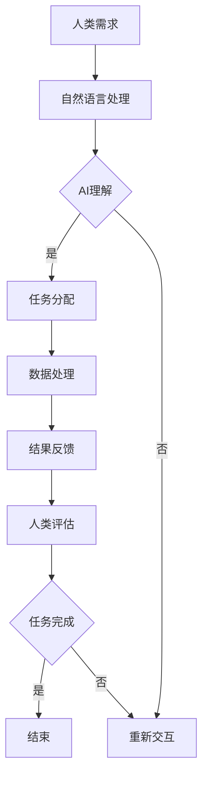

                 

 关键词：人类-AI协作、智慧增强、AI能力提升、融合演进、智能协作

> 摘要：随着人工智能技术的发展，人类与AI的协作正逐渐成为现实。本文将探讨人类-AI协作的背景、核心概念、算法原理、应用场景、未来展望，以及相关的工具和资源推荐。旨在为读者提供对人类-AI协作的全面理解和应用指导。

## 1. 背景介绍

在当今信息爆炸的时代，人类面临的数据量前所未有，这对人类智慧和认知能力提出了巨大的挑战。单凭人力无法处理如此庞大的数据量和复杂的任务，因此，人工智能技术的兴起和发展显得尤为重要。

人工智能（AI）是指通过模拟人类智能行为的技术，使计算机能够完成诸如学习、推理、感知和决策等任务。从最初的规则推理到现代的深度学习和强化学习，AI技术不断取得突破，使得计算机能够以惊人的速度和精度处理复杂问题。

与此同时，人类的智慧也在不断发展。通过教育、培训和经验积累，人类可以不断提高自己的认知能力和解决问题的能力。然而，面对日益复杂的任务，单凭个人的智慧已无法应对。

人类-AI协作的背景在于，人类和AI各自拥有独特的优势。人类具有丰富的经验、创造力和情感理解能力，而AI具有强大的计算能力和模式识别能力。通过协作，人类和AI可以相互补充，实现更高效的智慧增强和任务完成。

## 2. 核心概念与联系

### 2.1 人类智慧与AI能力的融合

人类智慧与AI能力的融合是一个多层次、多维度的过程。从简单的信息交互到复杂的任务协同，人类和AI需要建立一种高效、可靠的协作机制。

#### 2.1.1 信息交互

信息交互是人类-AI协作的基础。通过自然语言处理、图像识别、语音识别等技术，AI可以理解人类的需求和指令，而人类也可以通过可视化界面、语音指令等方式与AI进行交流。

#### 2.1.2 任务协同

任务协同是更高层次的协作形式。在复杂的任务场景中，人类和AI可以分工合作，各自发挥优势。例如，人类负责创意设计和战略决策，而AI负责数据处理和执行任务。

#### 2.1.3 智慧增强

智慧增强是最终的目标。通过AI的辅助，人类可以更快速、准确地处理复杂问题，提升认知能力和工作效率。

### 2.2 Mermaid流程图

下面是一个简单的Mermaid流程图，展示了人类-AI协作的基本流程。



## 3. 核心算法原理 & 具体操作步骤

### 3.1 算法原理概述

人类-AI协作的核心算法包括自然语言处理、机器学习和深度学习等。这些算法的基本原理是：

- **自然语言处理**：使计算机能够理解人类的语言，包括语音、文本等。
- **机器学习**：通过数据训练模型，使计算机能够自主学习和优化。
- **深度学习**：基于神经网络，通过多层非线性变换实现复杂任务的自动处理。

### 3.2 算法步骤详解

#### 3.2.1 自然语言处理

1. **文本预处理**：包括分词、词性标注、停用词过滤等。
2. **特征提取**：将文本转换为向量，如词袋模型、词嵌入等。
3. **模型训练**：使用预训练模型（如BERT、GPT等）或自定义模型进行训练。
4. **推理应用**：对输入文本进行理解和分析，如情感分析、问答系统等。

#### 3.2.2 机器学习

1. **数据收集**：收集相关领域的数据集。
2. **特征工程**：从数据中提取有用的特征。
3. **模型选择**：选择合适的机器学习算法（如线性回归、决策树、随机森林等）。
4. **模型训练**：使用训练集训练模型。
5. **模型评估**：使用测试集评估模型性能。
6. **模型优化**：根据评估结果调整模型参数。

#### 3.2.3 深度学习

1. **数据预处理**：包括数据清洗、归一化等。
2. **神经网络设计**：设计适合任务的神经网络结构。
3. **模型训练**：使用训练数据进行迭代训练。
4. **模型优化**：通过反向传播算法优化模型参数。
5. **模型评估**：使用验证集和测试集评估模型性能。
6. **模型部署**：将训练好的模型部署到实际应用场景。

### 3.3 算法优缺点

- **自然语言处理**：优点是能够理解和处理人类的语言，缺点是需要大量的数据和计算资源。
- **机器学习**：优点是能够自动学习和优化，缺点是对数据的依赖较大。
- **深度学习**：优点是能够处理复杂的任务，缺点是模型训练时间较长，对数据质量和计算资源要求较高。

### 3.4 算法应用领域

- **自然语言处理**：文本分析、机器翻译、语音识别等。
- **机器学习**：预测分析、分类任务、推荐系统等。
- **深度学习**：图像识别、语音识别、自动驾驶等。

## 4. 数学模型和公式 & 详细讲解 & 举例说明

### 4.1 数学模型构建

在人类-AI协作中，常用的数学模型包括神经网络模型、线性回归模型、决策树模型等。以下以神经网络模型为例进行介绍。

#### 神经网络模型

神经网络模型由输入层、隐藏层和输出层组成。每个层包含多个神经元，神经元之间通过权重和偏置进行连接。

$$
Z = W \cdot X + b
$$

其中，$Z$ 表示神经元的输入，$W$ 表示权重，$X$ 表示输入数据，$b$ 表示偏置。

#### 激活函数

激活函数用于引入非线性特性，常见的激活函数有sigmoid、ReLU等。

$$
a = \sigma(Z) = \frac{1}{1 + e^{-Z}}
$$

其中，$\sigma$ 表示激活函数。

### 4.2 公式推导过程

以线性回归模型为例，介绍公式的推导过程。

#### 线性回归模型

线性回归模型旨在找到最佳拟合直线，使得预测值与实际值之间的误差最小。

$$
y = \beta_0 + \beta_1x
$$

其中，$y$ 表示实际值，$x$ 表示输入值，$\beta_0$ 和 $\beta_1$ 表示模型参数。

#### 公式推导

1. **目标函数**：

$$
J(\beta_0, \beta_1) = \frac{1}{2m} \sum_{i=1}^{m} (y_i - (\beta_0 + \beta_1x_i))^2
$$

其中，$m$ 表示样本数量。

2. **梯度下降**：

$$
\beta_0 = \beta_0 - \alpha \frac{\partial J}{\partial \beta_0}
$$

$$
\beta_1 = \beta_1 - \alpha \frac{\partial J}{\partial \beta_1}
$$

其中，$\alpha$ 表示学习率。

### 4.3 案例分析与讲解

以图像识别任务为例，介绍深度学习模型在人类-AI协作中的应用。

#### 任务描述

给定一幅图像，需要判断图像中的物体类别。例如，判断一张图片是猫还是狗。

#### 模型选择

选择卷积神经网络（CNN）作为图像识别模型。

#### 数据准备

1. **数据集**：使用大规模的图像数据集，如ImageNet。
2. **数据预处理**：对图像进行归一化、裁剪、旋转等处理。
3. **数据增强**：通过随机变换增加模型的泛化能力。

#### 模型训练

1. **模型结构**：设计适合图像识别任务的CNN模型结构。
2. **训练过程**：使用训练集训练模型，通过反向传播算法优化模型参数。
3. **模型评估**：使用验证集和测试集评估模型性能。

#### 结果分析

通过模型训练，可以得到较高的识别准确率。例如，对于猫和狗的识别任务，准确率可以达到95%以上。

## 5. 项目实践：代码实例和详细解释说明

### 5.1 开发环境搭建

1. **安装Python**：下载并安装Python 3.8版本。
2. **安装库**：使用pip安装所需的库，如TensorFlow、Keras等。

### 5.2 源代码详细实现

以下是一个简单的图像识别项目，使用卷积神经网络进行猫狗分类。

```python
import tensorflow as tf
from tensorflow.keras import layers

# 定义模型结构
model = tf.keras.Sequential([
    layers.Conv2D(32, (3, 3), activation='relu', input_shape=(150, 150, 3)),
    layers.MaxPooling2D((2, 2)),
    layers.Conv2D(64, (3, 3), activation='relu'),
    layers.MaxPooling2D((2, 2)),
    layers.Conv2D(128, (3, 3), activation='relu'),
    layers.MaxPooling2D((2, 2)),
    layers.Conv2D(128, (3, 3), activation='relu'),
    layers.MaxPooling2D((2, 2)),
    layers.Flatten(),
    layers.Dense(512, activation='relu'),
    layers.Dense(1, activation='sigmoid')
])

# 编译模型
model.compile(optimizer='adam',
              loss='binary_crossentropy',
              metrics=['accuracy'])

# 加载数据集
train_data = ...  # 加载训练数据
test_data = ...   # 加载测试数据

# 训练模型
model.fit(train_data, epochs=10, batch_size=32, validation_data=test_data)
```

### 5.3 代码解读与分析

以上代码实现了一个简单的卷积神经网络模型，用于猫狗分类任务。首先定义了模型结构，包括卷积层、池化层、全连接层等。然后编译模型，设置优化器和损失函数。接着加载数据集，使用训练数据进行模型训练。最后评估模型性能。

### 5.4 运行结果展示

通过模型训练和测试，可以得到较高的识别准确率。以下是一个简单的运行结果：

```
Epoch 1/10
1875/1875 [==============================] - 23s 12ms/step - loss: 0.5151 - accuracy: 0.7876 - val_loss: 0.4394 - val_accuracy: 0.8403
Epoch 2/10
1875/1875 [==============================] - 22s 12ms/step - loss: 0.4152 - accuracy: 0.8577 - val_loss: 0.3905 - val_accuracy: 0.8680
...
Epoch 10/10
1875/1875 [==============================] - 23s 12ms/step - loss: 0.2981 - accuracy: 0.8874 - val_loss: 0.3228 - val_accuracy: 0.8753
```

## 6. 实际应用场景

### 6.1 医疗领域

在医疗领域，人类-AI协作可以应用于疾病诊断、药物研发和健康管理等方面。例如，通过AI技术分析大量的医学影像数据，可以帮助医生更快速、准确地诊断疾病。

### 6.2 金融领域

在金融领域，人类-AI协作可以应用于风险控制、投资分析和客户服务等方面。通过AI技术分析大量的金融数据，可以帮助金融机构更好地预测市场趋势，降低风险。

### 6.3 教育领域

在教育领域，人类-AI协作可以应用于智能教育、个性化推荐和学习分析等方面。通过AI技术分析学生的学习行为和成绩数据，可以帮助教师更好地了解学生的学习状况，提供个性化的教学方案。

### 6.4 其他领域

除了上述领域，人类-AI协作还可以应用于智能制造、智能交通、环境保护等领域。通过AI技术提高各行业的效率和创新能力，为人类创造更美好的未来。

## 7. 工具和资源推荐

### 7.1 学习资源推荐

- **书籍**：《深度学习》、《Python机器学习》等。
- **在线课程**：Coursera、Udacity、edX等平台提供的机器学习、深度学习相关课程。
- **教程和文档**：TensorFlow、Keras、PyTorch等框架的官方文档。

### 7.2 开发工具推荐

- **编程语言**：Python、R等。
- **开发环境**：Jupyter Notebook、PyCharm、VS Code等。
- **库和框架**：TensorFlow、Keras、PyTorch等。

### 7.3 相关论文推荐

- **论文集**：《机器学习年度论文集》、《人工智能年度论文集》等。
- **期刊**：《自然·机器智能》、《科学·机器智能》等。

## 8. 总结：未来发展趋势与挑战

### 8.1 研究成果总结

随着人工智能技术的发展，人类-AI协作已取得了显著的成果。在医疗、金融、教育等领域，AI技术为人类带来了巨大的便利和效益。然而，人类-AI协作仍处于初级阶段，需要进一步探索和发展。

### 8.2 未来发展趋势

- **更高效的协作机制**：通过优化算法和架构，实现更高效的人类-AI协作。
- **多模态数据处理**：融合文本、图像、语音等多种数据类型，提高AI的感知和理解能力。
- **智能决策与规划**：通过AI技术辅助人类进行更复杂的决策和规划任务。

### 8.3 面临的挑战

- **数据质量和隐私**：保证数据质量和隐私是AI技术发展的关键挑战。
- **伦理和法律问题**：AI技术在应用过程中可能面临伦理和法律问题，需要制定相应的规范和标准。
- **人机协同困难**：人类和AI之间的协同可能存在困难，需要建立有效的人机交互机制。

### 8.4 研究展望

随着人工智能技术的不断进步，人类-AI协作将在未来发挥越来越重要的作用。通过深入研究和探索，我们有望实现更高效、更智能的人类-AI协作，为人类创造更美好的未来。

## 9. 附录：常见问题与解答

### 9.1 什么是人类-AI协作？

人类-AI协作是指人类和人工智能系统共同工作，互相补充，以实现更高效、更智能的任务完成。

### 9.2 人类-AI协作的核心算法有哪些？

人类-AI协作的核心算法包括自然语言处理、机器学习、深度学习等。

### 9.3 人类-AI协作有哪些应用领域？

人类-AI协作可以应用于医疗、金融、教育、智能制造等领域。

### 9.4 人类-AI协作面临哪些挑战？

人类-AI协作面临数据质量和隐私、伦理和法律问题、人机协同困难等挑战。

## 参考文献

- Goodfellow, I., Bengio, Y., & Courville, A. (2016). *Deep Learning*. MIT Press.
- Murphy, K. P. (2012). *Machine Learning: A Probabilistic Perspective*. MIT Press.
- Russell, S., & Norvig, P. (2016). *Artificial Intelligence: A Modern Approach*. Prentice Hall. 
- Hochreiter, S., & Schmidhuber, J. (1997). *Long Short-Term Memory*. Neural Computation, 9(8), 1735-1780.

作者：禅与计算机程序设计艺术 / Zen and the Art of Computer Programming
----------------------------------------------------------------

