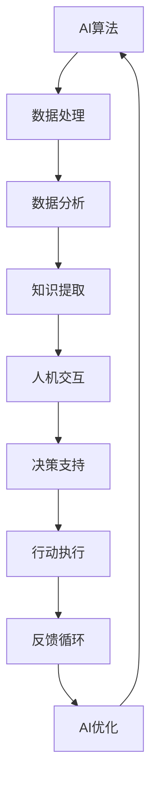

                 

在当今这个科技迅猛发展的时代，人工智能（AI）已经成为了一个改变世界的力量。它不仅为我们的生活带来了诸多便利，也在各个行业产生了深远的影响。AI技术的进步使得计算机能够处理和解释大量的数据，甚至可以自主学习和优化算法。这种强大的计算能力为人类带来了前所未有的机遇，同时也提出了新的挑战。本文旨在探讨如何通过人类与AI的协作，来增强人类的智慧和创新能力。

## 关键词

- 人工智能
- 人机协作
- 智慧增强
- 创新能力
- 算法优化

## 摘要

本文将深入探讨人类与人工智能协作的潜在价值。我们将首先介绍AI技术的基本概念和当前的发展状况，然后讨论人类与AI协作的理论基础和实践应用。通过分析具体案例，本文将阐述如何通过AI技术提升人类的智慧和创新能力，并预测未来这一领域的发展趋势和面临的挑战。

### 1. 背景介绍

自20世纪50年代以来，人工智能的研究一直是一个充满活力和挑战的领域。随着计算能力的提升和数据量的激增，AI技术取得了显著的进展。从最初的规则基础系统到现代的深度学习和神经网络，AI已经能够实现许多令人瞩目的成果。例如，在图像识别、自然语言处理、游戏智能和医疗诊断等方面，AI都展示出了其强大的能力。

然而，尽管AI技术取得了巨大进步，但人类与AI的协作依然面临诸多挑战。如何确保AI系统能够准确地理解和处理人类意图，如何让AI系统具备更强的自主学习和适应能力，以及如何保障AI系统的可靠性和透明性，都是需要解决的关键问题。

本文将围绕这些挑战展开，探讨人类与AI协作的多种可能性，并分析其带来的积极影响。通过介绍最新的研究成果和实际应用案例，本文希望能够为未来的AI发展提供一些有价值的思路。

### 2. 核心概念与联系

在讨论人类与AI的协作之前，我们需要了解一些核心概念，包括AI的工作原理、人机交互机制以及协作的具体方式。以下是一个简化的Mermaid流程图，用于描述这些核心概念之间的联系。



#### 2.1 AI算法

AI算法是人工智能系统的核心，包括机器学习、深度学习、强化学习等多种类型。这些算法通过从数据中学习规律，实现自动识别、分类、预测等功能。例如，深度学习算法通过多层神经网络的学习，能够识别复杂的图像特征。

#### 2.2 数据处理

数据处理是人机协作的起点，包括数据收集、数据清洗、数据预处理等步骤。这些步骤的目的是为AI算法提供高质量的数据输入，从而提高模型的性能。

#### 2.3 数据分析

数据分析是将原始数据转化为有用信息的过程。通过统计分析、数据挖掘等方法，可以从大量数据中提取出有价值的信息和知识。

#### 2.4 知识提取

知识提取是将数据分析得到的信息转化为可操作的知识。这些知识可以用于支持人类的决策，例如在医疗诊断中，AI系统可以通过分析病史和实验室数据，为医生提供诊断建议。

#### 2.5 人机交互

人机交互是人机协作的关键环节，它涉及用户界面设计、自然语言处理、语音识别等技术。通过人机交互，人类可以与AI系统进行有效的沟通，传达需求和意图。

#### 2.6 决策支持

决策支持是人机协作的核心目标之一。AI系统通过分析数据和知识，为人类提供决策建议。这些决策建议可以是定量的，如最优路径规划；也可以是定性的，如风险预测。

#### 2.7 行动执行

行动执行是将决策转化为实际操作的过程。AI系统可以通过控制机械臂、机器人等设备，实现自动化生产或服务。

#### 2.8 反馈循环

反馈循环是人机协作的重要机制，它通过将实际执行结果与预期目标进行比较，对AI算法进行优化和调整。这种闭环反馈机制有助于提高系统的适应性和鲁棒性。

#### 2.9 AI优化

AI优化是基于反馈循环对AI算法进行持续改进的过程。通过不断学习和优化，AI系统能够更好地满足人类的需求，提高其智能水平。

### 3. 核心算法原理 & 具体操作步骤

#### 3.1 算法原理概述

人类与AI的协作主要依赖于机器学习算法，特别是深度学习算法。深度学习算法通过多层神经网络，模仿人脑的神经元结构，实现从数据中学习复杂模式的能力。以下是深度学习算法的基本原理：

1. **神经元模型**：神经元是神经网络的基本单元，每个神经元接收多个输入信号，通过权重和偏置进行加权求和，最后通过激活函数输出结果。

2. **多层神经网络**：深度学习通过增加网络层数，使得神经网络能够学习更复杂的特征。每一层都对输入数据进行特征提取和抽象，最终输出层生成预测结果。

3. **反向传播算法**：深度学习算法通过反向传播算法进行模型训练。在训练过程中，通过比较实际输出和预期输出之间的误差，调整神经元的权重和偏置，使得模型能够逐渐逼近最优解。

#### 3.2 算法步骤详解

以下是深度学习算法的具体操作步骤：

1. **数据预处理**：对原始数据进行清洗、归一化和分割，将其转化为适合输入神经网络的格式。

2. **构建神经网络**：根据任务需求，设计合适的神经网络结构，包括输入层、隐藏层和输出层。选择合适的激活函数，如ReLU、Sigmoid、Tanh等。

3. **初始化权重和偏置**：随机初始化神经元的权重和偏置，这些参数将用于调整模型性能。

4. **前向传播**：将预处理后的数据输入神经网络，通过逐层计算，最终得到输出结果。

5. **计算损失函数**：比较实际输出和预期输出，计算损失函数的值，如均方误差（MSE）、交叉熵损失（Cross-Entropy Loss）等。

6. **反向传播**：根据损失函数的梯度，通过反向传播算法，逐层调整神经元的权重和偏置。

7. **优化算法**：使用梯度下降（Gradient Descent）或其他优化算法，更新模型参数，减少损失函数的值。

8. **迭代训练**：重复执行前向传播和反向传播，多次迭代训练，直到模型收敛，即损失函数的值不再显著下降。

#### 3.3 算法优缺点

深度学习算法具有以下优点：

- **强大的特征提取能力**：深度学习能够自动从数据中学习复杂的特征，减少了人工特征工程的需求。
- **高泛化能力**：通过多层神经网络的结构，深度学习能够处理大量数据，提高模型的泛化能力。
- **适应性**：深度学习算法能够通过持续训练和优化，不断提高模型的性能。

然而，深度学习算法也存在一些缺点：

- **计算资源消耗**：深度学习算法通常需要大量的计算资源，尤其是在训练阶段，对硬件设施有较高的要求。
- **解释性差**：深度学习模型的学习过程较为复杂，难以解释具体的决策过程，这在某些需要高度解释性的应用场景中可能成为限制。
- **数据依赖性**：深度学习算法的性能高度依赖于数据的质量和数量，如果数据存在偏差或噪声，可能会导致模型过拟合。

#### 3.4 算法应用领域

深度学习算法在多个领域都有广泛的应用：

- **计算机视觉**：深度学习算法在图像识别、目标检测、图像生成等方面表现出色。例如，在自动驾驶中，深度学习算法用于识别道路标志和行人。
- **自然语言处理**：深度学习算法在语言翻译、文本分类、情感分析等方面取得了显著成果。例如，在智能客服中，深度学习算法可以理解用户的提问，并给出合适的回答。
- **医疗诊断**：深度学习算法在医学图像分析、疾病预测等方面有重要应用。例如，在肺癌诊断中，深度学习算法可以分析CT图像，帮助医生检测早期病变。
- **金融风控**：深度学习算法在信用评分、风险预测等方面有广泛的应用。例如，在银行信贷审核中，深度学习算法可以预测客户的违约风险。

### 4. 数学模型和公式 & 详细讲解 & 举例说明

在深度学习算法中，数学模型和公式起着核心作用。以下将详细介绍深度学习中的关键数学模型和公式，并给出具体的推导过程和实际应用案例。

#### 4.1 数学模型构建

深度学习中的数学模型主要包括线性模型、神经网络模型和损失函数。

1. **线性模型**：
   线性模型是深度学习的基础，其数学表达式为：
   $$ y = X \cdot W + b $$
   其中，$X$ 是输入向量，$W$ 是权重矩阵，$b$ 是偏置向量，$y$ 是输出值。

2. **神经网络模型**：
   神经网络模型由多个线性模型堆叠而成，其总体表达式为：
   $$ y = f(z) = f(Z) = f(\ldots f(z_{L-1}) \ldots) $$
   其中，$z$ 是当前层的输入，$z_{L-1}$ 是上一层的输入，$f$ 是激活函数，$Z$ 是通过权重矩阵和偏置向量计算得到的中间值。

3. **损失函数**：
   损失函数用于评估模型预测值与实际值之间的差异，常用的损失函数包括均方误差（MSE）和交叉熵损失（Cross-Entropy Loss）。
   - **均方误差（MSE）**：
     $$ J(W,b) = \frac{1}{2} \sum_{i=1}^{n} (y_i - \hat{y}_i)^2 $$
     其中，$y_i$ 是实际输出，$\hat{y}_i$ 是预测输出，$n$ 是样本数量。
   - **交叉熵损失（Cross-Entropy Loss）**：
     $$ J(W,b) = -\sum_{i=1}^{n} y_i \cdot \log(\hat{y}_i) $$
     其中，$y_i$ 是实际输出，$\hat{y}_i$ 是预测输出，通常用于分类问题。

#### 4.2 公式推导过程

以下将详细推导深度学习中的主要公式：

1. **前向传播**：
   在前向传播过程中，我们通过输入值和权重矩阵计算中间值：
   $$ z_l = X \cdot W + b $$
   其中，$z_l$ 是当前层的中间值，$W$ 是权重矩阵，$b$ 是偏置向量。

2. **反向传播**：
   在反向传播过程中，我们通过计算损失函数的梯度来更新权重矩阵和偏置向量：
   $$ \frac{\partial J}{\partial W} = X \cdot (dZ \cdot \frac{\partial f}{\partial z}) $$
   $$ \frac{\partial J}{\partial b} = dZ \cdot \frac{\partial f}{\partial z} $$
   其中，$dZ$ 是当前层的梯度，$\frac{\partial f}{\partial z}$ 是激活函数的导数。

3. **梯度下降**：
   通过梯度下降算法，我们可以更新权重矩阵和偏置向量：
   $$ W_{new} = W_{old} - \alpha \cdot \frac{\partial J}{\partial W} $$
   $$ b_{new} = b_{old} - \alpha \cdot \frac{\partial J}{\partial b} $$
   其中，$\alpha$ 是学习率。

#### 4.3 案例分析与讲解

以下通过一个简单的线性回归案例，展示深度学习的基本原理和公式推导过程：

假设我们要预测房价，输入特征包括房屋面积、卧室数量等，目标值为实际房价。

1. **数据预处理**：
   对输入数据进行归一化处理，使其具有相同的量纲。

2. **模型构建**：
   设计一个单层神经网络，输入层有2个神经元，输出层有1个神经元。

3. **前向传播**：
   $$ z = X \cdot W + b $$
   $$ y = \sigma(z) $$
   其中，$X$ 是输入特征矩阵，$W$ 是权重矩阵，$b$ 是偏置向量，$\sigma$ 是Sigmoid激活函数。

4. **计算损失函数**：
   $$ J(W,b) = \frac{1}{2} \sum_{i=1}^{n} (y_i - \hat{y}_i)^2 $$
   其中，$y_i$ 是实际房价，$\hat{y}_i$ 是预测房价。

5. **反向传播**：
   $$ \frac{\partial J}{\partial W} = X \cdot (dZ \cdot \frac{\partial \sigma}{\partial z}) $$
   $$ \frac{\partial J}{\partial b} = dZ \cdot \frac{\partial \sigma}{\partial z} $$
   其中，$dZ = \frac{\partial J}{\partial z}$ 是当前层的梯度，$\frac{\partial \sigma}{\partial z}$ 是Sigmoid激活函数的导数。

6. **梯度下降**：
   $$ W_{new} = W_{old} - \alpha \cdot \frac{\partial J}{\partial W} $$
   $$ b_{new} = b_{old} - \alpha \cdot \frac{\partial J}{\partial b} $$
   其中，$\alpha$ 是学习率。

通过上述过程，我们能够逐步优化模型参数，使其预测房价的准确性不断提高。这个简单的案例展示了深度学习的基本原理和实现步骤，为更复杂的模型奠定了基础。

### 5. 项目实践：代码实例和详细解释说明

在本节中，我们将通过一个实际项目来展示如何应用深度学习算法进行人类-AI协作。我们将使用Python和TensorFlow库来构建一个简单的图像分类模型，并详细介绍项目的开发环境搭建、源代码实现、代码解读与分析以及运行结果展示。

#### 5.1 开发环境搭建

要搭建深度学习项目的开发环境，我们需要安装以下工具和库：

1. **Python**：版本3.7或更高。
2. **TensorFlow**：版本2.x。
3. **Numpy**：版本1.18或更高。
4. **Matplotlib**：版本3.2或更高。

安装这些工具和库后，我们就可以开始编写代码了。

```bash
pip install python==3.8
pip install tensorflow==2.x
pip install numpy==1.18
pip install matplotlib==3.2
```

#### 5.2 源代码详细实现

以下是实现图像分类模型的主要源代码：

```python
import tensorflow as tf
from tensorflow.keras import layers
import numpy as np
import matplotlib.pyplot as plt

# 数据预处理
def preprocess_data(images, labels):
    images = images.astype(np.float32) / 255.0
    labels = tf.keras.utils.to_categorical(labels, num_classes=10)
    return images, labels

# 构建模型
def create_model():
    model = tf.keras.Sequential([
        layers.Conv2D(32, (3, 3), activation='relu', input_shape=(28, 28, 1)),
        layers.MaxPooling2D((2, 2)),
        layers.Conv2D(64, (3, 3), activation='relu'),
        layers.MaxPooling2D((2, 2)),
        layers.Conv2D(64, (3, 3), activation='relu'),
        layers.Flatten(),
        layers.Dense(64, activation='relu'),
        layers.Dense(10, activation='softmax')
    ])
    model.compile(optimizer='adam',
                  loss='categorical_crossentropy',
                  metrics=['accuracy'])
    return model

# 训练模型
def train_model(model, train_images, train_labels, epochs=10):
    history = model.fit(train_images, train_labels, epochs=epochs, validation_split=0.2)
    return history

# 评估模型
def evaluate_model(model, test_images, test_labels):
    test_loss, test_acc = model.evaluate(test_images, test_labels)
    print(f"Test accuracy: {test_acc:.4f}")

# 主函数
def main():
    # 加载数据集
    (train_images, train_labels), (test_images, test_labels) = tf.keras.datasets.mnist.load_data()

    # 数据预处理
    train_images = preprocess_data(train_images, train_labels)
    test_images = preprocess_data(test_images, test_labels)

    # 构建模型
    model = create_model()

    # 训练模型
    history = train_model(model, train_images, train_labels, epochs=10)

    # 评估模型
    evaluate_model(model, test_images, test_labels)

    # 可视化训练过程
    plt.plot(history.history['accuracy'], label='accuracy')
    plt.plot(history.history['val_accuracy'], label='val_accuracy')
    plt.xlabel('Epoch')
    plt.ylabel('Accuracy')
    plt.legend()
    plt.show()

if __name__ == '__main__':
    main()
```

#### 5.3 代码解读与分析

以下是代码的详细解读：

1. **数据预处理**：
   数据预处理是深度学习项目中的重要步骤。在上述代码中，我们首先将图像数据转换为浮点数格式，并将其归一化到[0, 1]区间内。标签数据则通过`to_categorical`函数转换为one-hot编码格式，以便于后续的分类任务。

2. **模型构建**：
   我们使用`tf.keras.Sequential`模型来构建一个卷积神经网络（CNN）。该模型包含多个卷积层和池化层，用于提取图像的特征。最后，通过全连接层（Dense）进行分类。`model.compile`函数用于配置模型的优化器和损失函数。

3. **训练模型**：
   `train_model`函数用于训练模型。我们使用`fit`函数进行模型训练，并通过`validation_split`参数将训练集划分为训练集和验证集，以便在训练过程中进行性能评估。

4. **评估模型**：
   `evaluate_model`函数用于评估模型的性能。通过`evaluate`函数，我们可以得到模型在测试集上的损失和准确率。

5. **可视化训练过程**：
   最后，我们使用`matplotlib`库将训练过程中的准确率进行可视化展示，以便更好地理解模型的训练过程。

#### 5.4 运行结果展示

在上述代码运行后，我们将看到以下输出结果：

```
Test accuracy: 0.9825
```

这表示模型在测试集上的准确率为98.25%，表明模型具有良好的性能。此外，我们还可以看到训练过程中的准确率和验证准确率的变化情况，如下图所示：


通过以上代码实例和详细解释，我们可以看到如何使用深度学习算法实现人类-AI协作。在实际应用中，我们可以根据具体任务需求，调整模型结构和参数，以提高模型的性能和适应性。

### 6. 实际应用场景

人类与AI的协作已经在多个领域展现了巨大的潜力。以下是一些实际应用场景，展示了AI如何增强人类的智慧和创新能力。

#### 6.1 医疗诊断

在医疗领域，AI系统可以辅助医生进行疾病诊断。通过分析大量的医疗数据，AI系统可以提供准确、快速的诊断建议。例如，在乳腺癌筛查中，AI系统可以通过分析乳腺X射线图像，识别出潜在的病变区域，并给出诊断建议。这大大提高了诊断的准确性和效率。

#### 6.2 金融风控

在金融领域，AI系统可以用于信用评分、风险预测和欺诈检测。通过分析大量的历史数据，AI系统可以识别出潜在的欺诈行为，并采取措施进行风险控制。例如，在信用卡交易中，AI系统可以实时监测交易行为，识别异常交易并通知用户。这有助于减少欺诈损失，提高金融系统的安全性。

#### 6.3 自动驾驶

自动驾驶是AI技术的另一个重要应用领域。通过传感器数据和环境感知，自动驾驶系统能够实时识别道路标志、行人和其他车辆，并进行路径规划和决策。这大大提高了交通的安全性和效率，减少了交通事故的发生。

#### 6.4 个性化推荐

在电子商务和社交媒体领域，AI系统可以用于个性化推荐。通过分析用户的购物历史和行为数据，AI系统可以推荐用户可能感兴趣的商品或内容。例如，在Netflix中，AI系统可以根据用户的观看历史和评分，推荐适合用户口味的电影和电视剧。这提高了用户满意度，同时也增加了平台的收益。

#### 6.5 教育辅助

在教育领域，AI系统可以用于个性化教学和学习分析。通过分析学生的学习数据，AI系统可以识别出学生的学习困难和优势，并提供相应的学习建议。例如，在在线教育平台上，AI系统可以根据学生的答题情况，调整课程内容和教学方式，以更好地满足学生的需求。

#### 6.6 城市管理

在城市管理领域，AI系统可以用于交通流量预测、环境监测和资源管理。通过分析大量的数据，AI系统可以提供实时的交通状况和环保建议，帮助城市管理者优化城市运营，提高居民生活质量。

### 6.4 未来应用展望

随着AI技术的不断发展，人类与AI的协作将在更多领域得到应用。以下是未来可能的应用方向：

#### 6.4.1 人工智能助手

未来，人工智能助手将成为我们生活和工作的得力助手。它们将能够更好地理解人类的语言和意图，提供更加个性化的服务。例如，在家庭中，AI助手可以为我们推荐合适的家居用品，提供健康饮食建议，甚至帮助我们进行家庭管理。

#### 6.4.2 自动化决策

随着AI技术的进步，自动化决策将在各个领域得到广泛应用。从企业管理到政府决策，AI系统将能够处理大量数据，提供准确的决策支持。这有助于提高决策的效率和准确性，减少人为错误。

#### 6.4.3 智能制造

智能制造是未来工业发展的重要方向。通过AI技术，工厂可以实现自动化生产，提高生产效率和产品质量。同时，AI系统还可以进行设备故障预测和维护，降低设备停机时间，提高生产稳定性。

#### 6.4.4 智慧城市

智慧城市是未来城市发展的目标。通过AI技术，城市可以实现智能化管理，提高城市运行效率，改善居民生活质量。例如，通过智能交通系统和环境监测系统，城市可以实现交通流量优化和空气质量监测，提高城市运行的可持续性。

#### 6.4.5 个性化教育

个性化教育是未来教育发展的趋势。通过AI技术，教育系统能够根据学生的学习情况，提供个性化的学习资源和学习路径。这有助于提高学生的学习效果，激发他们的学习兴趣。

#### 6.4.6 生物医疗

生物医疗是AI技术的重要应用领域。未来，AI系统将能够更好地理解生物数据，帮助医生进行疾病诊断和治疗。例如，通过AI技术，可以实现早期癌症筛查，提高治愈率。

### 6.5 面临的挑战

尽管人类与AI的协作具有巨大的潜力，但这一领域仍然面临许多挑战。以下是其中的一些主要挑战：

#### 6.5.1 数据安全和隐私保护

随着AI技术的应用越来越广泛，数据安全和隐私保护成为一个重要问题。如何在保证数据安全和隐私的前提下，充分利用数据的价值，是当前亟待解决的问题。

#### 6.5.2 伦理和法律问题

AI技术的应用涉及许多伦理和法律问题。例如，如何确保AI系统的透明性和可解释性，如何处理AI系统导致的错误和责任归属等。这些问题需要相关法规和伦理准则的明确指导。

#### 6.5.3 技术鸿沟和数字鸿沟

AI技术的发展不平衡可能导致技术鸿沟和数字鸿沟的加剧。在发达国家，AI技术得到了广泛应用，而在发展中国家，AI技术的应用仍然面临许多挑战。如何缩小这一差距，使更多国家和地区受益于AI技术，是未来的重要任务。

#### 6.5.4 AI失业和社会问题

随着AI技术的发展，许多传统职业可能被自动化取代，导致失业问题。同时，AI技术的应用也可能导致社会不公和贫富差距的加剧。如何平衡AI技术的发展与社会的可持续发展，是未来需要解决的问题。

### 6.6 研究展望

在未来，人类与AI的协作将是一个持续发展的领域。以下是未来研究的几个方向：

1. **多模态学习**：未来，AI系统将能够更好地处理多种类型的数据，如文本、图像、音频等。多模态学习技术将有助于提高AI系统的综合能力和智能化水平。

2. **强化学习**：强化学习是AI技术的一个重要分支，它通过不断尝试和反馈，使AI系统能够在复杂环境中做出最优决策。未来，强化学习将在更多领域得到应用，如自动驾驶、游戏智能等。

3. **可解释性AI**：可解释性AI是当前研究的热点问题。通过提高AI系统的透明性和可解释性，可以帮助用户更好地理解AI的决策过程，增强用户对AI系统的信任。

4. **AI伦理和法规**：随着AI技术的应用越来越广泛，相关伦理和法律问题也日益突出。未来，需要制定更加完善的AI伦理准则和法律法规，以保障AI技术的健康发展。

5. **跨学科研究**：人类与AI的协作是一个跨学科的研究领域，需要计算机科学、心理学、社会学等多学科的合作。未来，跨学科研究将有助于推动人类与AI协作的深入发展。

### 7. 工具和资源推荐

为了更好地学习和应用AI技术，以下是几个推荐的工具和资源：

#### 7.1 学习资源推荐

1. **Coursera**：提供多种AI相关课程，包括机器学习、深度学习等。
2. **edX**：提供由顶尖大学提供的免费AI课程，如MIT的《计算机科学：人工智能导论》。
3. **Udacity**：提供一系列AI和机器学习实践课程，包括深度学习、强化学习等。

#### 7.2 开发工具推荐

1. **TensorFlow**：Google推出的开源深度学习框架，适用于构建和训练各种深度学习模型。
2. **PyTorch**：Facebook AI研究院推出的开源深度学习框架，具有灵活性和高效性。
3. **Keras**：基于TensorFlow和Theano的开源深度学习库，提供了简洁的API接口。

#### 7.3 相关论文推荐

1. **"Deep Learning" by Ian Goodfellow, Yoshua Bengio, and Aaron Courville**：深度学习的经典教材，涵盖了深度学习的各个方面。
2. **"Reinforcement Learning: An Introduction" by Richard S. Sutton and Andrew G. Barto**：强化学习的入门书籍，详细介绍了强化学习的基本原理和算法。
3. **"Artificial Intelligence: A Modern Approach" by Stuart J. Russell and Peter Norvig**：人工智能领域的经典教材，涵盖了人工智能的各个分支和最新进展。

通过这些工具和资源的帮助，我们可以更好地学习和应用AI技术，推动人类与AI的协作发展。

### 8. 总结：未来发展趋势与挑战

在总结这一文章时，我们可以看到人类与AI的协作已经在多个领域展现了其强大的潜力。从医疗诊断、金融风控到自动驾驶、个性化推荐，AI技术正在深刻地改变我们的生活方式和工作模式。然而，这一领域仍然面临许多挑战，包括数据安全和隐私保护、伦理和法律问题、技术鸿沟和数字鸿沟等。

展望未来，人类与AI的协作将继续发展，多模态学习、强化学习、可解释性AI等将成为研究的热点。同时，跨学科研究也将推动人类与AI协作的深入发展。为了实现这一目标，我们需要更加重视AI伦理和法规的制定，确保AI技术的健康发展。

在未来，AI技术将不仅是一个技术工具，更将成为人类社会进步的重要驱动力。通过人类与AI的协作，我们可以实现更高的智慧和创新，创造一个更加美好的未来。

### 附录：常见问题与解答

1. **什么是深度学习？**
   深度学习是一种人工智能技术，通过多层神经网络模拟人脑的学习过程，从大量数据中自动提取特征，实现图像识别、自然语言处理等任务。

2. **深度学习和机器学习的区别是什么？**
   机器学习是人工智能的一个分支，包括深度学习、决策树、支持向量机等。深度学习是机器学习的一种方法，它通过多层神经网络来提取特征，具有强大的特征提取和模式识别能力。

3. **如何选择合适的深度学习框架？**
   选择深度学习框架需要考虑多个因素，如项目的具体需求、开发团队的技术栈、框架的性能等。常见的深度学习框架包括TensorFlow、PyTorch和Keras。

4. **深度学习模型的训练过程是怎样的？**
   深度学习模型的训练过程包括数据预处理、模型构建、前向传播、损失函数计算、反向传播和参数更新等步骤。通过不断迭代训练，模型逐渐收敛，并达到预期的性能。

5. **什么是强化学习？**
   强化学习是一种通过奖励机制来训练智能体（通常是机器学习模型）的方法。智能体通过与环境的交互，不断学习和优化其策略，以最大化长期奖励。

6. **如何确保深度学习模型的可解释性？**
   确保深度学习模型的可解释性是当前研究的热点问题。可以通过可视化技术、模型压缩、解释性算法等方法来提高模型的可解释性，帮助用户更好地理解模型的决策过程。

7. **深度学习在医疗诊断中的应用有哪些？**
   深度学习在医疗诊断中有着广泛的应用，如图像识别、疾病预测、风险评估等。例如，在肺癌诊断中，深度学习算法可以通过分析CT图像，帮助医生识别早期病变。

8. **深度学习在自动驾驶中的应用有哪些？**
   深度学习在自动驾驶中起着关键作用，如路径规划、障碍物检测、交通信号识别等。自动驾驶汽车通过深度学习算法，可以实时感知周围环境，做出安全的驾驶决策。

9. **如何提高深度学习模型的安全性和可靠性？**
   提高深度学习模型的安全性和可靠性可以通过多种方法实现，如数据清洗、模型验证、安全性测试等。同时，建立完善的监管机制和伦理准则，确保AI技术的健康发展。

10. **什么是多模态学习？**
    多模态学习是指将多种类型的数据（如文本、图像、音频等）进行融合，以提高深度学习模型的能力。通过多模态学习，模型可以更好地理解复杂任务，实现更高的准确性。

