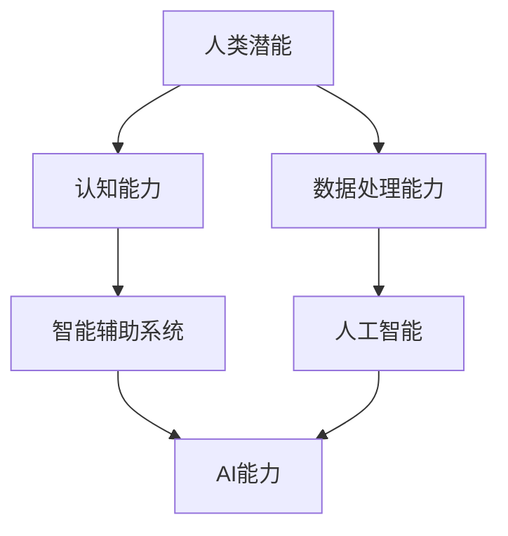

                 

关键词：人类-AI协作、潜能、AI能力、协同演进、人工智能、计算机科学、认知拓展

> 摘要：随着人工智能技术的迅速发展，人类与AI的协作已成为不可逆转的趋势。本文探讨了人类潜能与AI能力的协同演进关系，分析了AI技术如何增强人类的能力，以及人类如何通过与AI的协作实现潜能的充分发挥。文章结构分为背景介绍、核心概念与联系、核心算法原理、数学模型与公式、项目实践、实际应用场景、工具与资源推荐、总结与展望等部分。

## 1. 背景介绍

在当今信息时代，人工智能（AI）已经成为科技发展的关键驱动力。AI技术不仅在图像识别、自然语言处理、自动驾驶等领域取得了显著进展，而且正在逐渐渗透到人类生活的各个方面，从医疗健康、教育、金融到艺术创作等。随着AI技术的不断成熟，人类与AI的协作方式也在不断演变，形成了一种新的工作、学习和生活方式。

人类-AI协作的兴起不仅改变了人类的工作方式，也深刻影响了我们的思维方式。人类潜能的充分发挥依赖于对信息的获取、处理和利用，而AI技术为我们提供了前所未有的数据处理能力和智能分析工具。通过AI的辅助，人类可以更加高效地解决问题，实现认知能力的拓展和提升。

本文旨在探讨人类与AI协作的原理和实践，分析AI技术如何增强人类的潜能，以及人类如何通过与AI的协作实现能力的协同演进。文章将涵盖从基础概念到实际应用的各个方面，旨在为读者提供一个全面、深入的视角，以理解人类-AI协作的重要性和潜力。

## 2. 核心概念与联系

为了深入探讨人类-AI协作的原理，我们需要首先理解一些核心概念。以下是一个Mermaid流程图，用于展示这些核心概念及其相互联系。



### 2.1. 人类潜能

人类潜能是指人类在生理、心理和社会层面上潜在的、未被完全开发的能力。这些能力包括认知能力、创造力、情感表达、运动协调等。人类潜能的实现和发挥依赖于多个因素的交互作用，如环境、教育、遗传和个人的努力。

### 2.2. 认知能力

认知能力是指人类获取、处理、存储和使用信息的能力。它包括记忆、学习、思考、判断和解决问题等过程。认知能力是人类潜能的核心组成部分，决定了人类在复杂环境中的适应能力和创新能力。

### 2.3. 数据处理能力

随着信息时代的到来，数据处理能力成为现代社会的一项基本技能。人类需要处理大量来自不同渠道的信息，如文本、图像、音频和视频等。数据处理能力包括信息收集、整理、分析和存储等方面。随着AI技术的发展，人类的这一能力得到了显著的增强。

### 2.4. 智能辅助系统

智能辅助系统是指利用AI技术为人类提供辅助的工具和平台。这些系统可以通过自然语言处理、机器学习、计算机视觉等技术手段，帮助人类更高效地完成各种任务。智能辅助系统的出现，极大地提升了人类的认知能力和工作效率。

### 2.5. 人工智能

人工智能是指由人类创建的智能系统，能够在特定任务上表现出与人类相似的智能行为。人工智能技术包括机器学习、深度学习、自然语言处理、计算机视觉等。人工智能的发展，为人类潜能的发挥提供了强大的技术支持。

### 2.6. AI能力

AI能力是指人工智能系统在特定任务上表现出来的智能水平。随着AI技术的不断进步，AI能力逐渐超越了人类的某些特定能力，如图像识别、语音识别、数据分析等。AI能力与人类潜能的协同演进，将带来人类能力的全面提升。

## 3. 核心算法原理 & 具体操作步骤

### 3.1. 算法原理概述

人类-AI协作的核心在于算法原理的实现，即如何通过人工智能技术增强人类的潜能。以下是几个关键的算法原理：

1. **机器学习**：通过从数据中学习模式，使AI系统能够进行自我改进和优化。
2. **深度学习**：利用多层神经网络模拟人脑的工作方式，实现复杂的特征提取和模式识别。
3. **自然语言处理**：使计算机能够理解、生成和处理人类语言，实现人机交互。
4. **计算机视觉**：通过图像处理和分析，使计算机能够识别和理解视觉信息。
5. **强化学习**：通过试错和反馈机制，使AI系统能够在复杂环境中进行自主决策和学习。

### 3.2. 算法步骤详解

为了实现人类与AI的协同演进，以下是具体的操作步骤：

1. **数据收集与预处理**：收集相关领域的数据，并进行清洗、标准化和特征提取等预处理工作。
2. **模型选择与训练**：根据任务需求选择合适的模型，利用预处理后的数据进行训练，并优化模型参数。
3. **模型评估与优化**：通过测试集对模型进行评估，并根据评估结果进行模型优化。
4. **应用部署**：将训练好的模型部署到实际应用场景中，进行实时数据分析和决策。
5. **用户交互**：通过人机交互界面，将AI系统的分析结果和决策建议呈现给用户，并接受用户反馈，进行迭代优化。

### 3.3. 算法优缺点

每种算法都有其优缺点，以下是对常见算法优缺点的分析：

- **机器学习**：
  - 优点：能够自动从数据中学习模式，适应性强。
  - 缺点：对数据质量和数量要求较高，模型解释性较差。
- **深度学习**：
  - 优点：能够处理复杂的数据和任务，效果优异。
  - 缺点：训练过程复杂，对计算资源要求高，模型解释性较差。
- **自然语言处理**：
  - 优点：能够实现人机交互，提高工作效率。
  - 缺点：对语言理解要求高，处理多样化语言能力有限。
- **计算机视觉**：
  - 优点：能够识别和理解视觉信息，实现自动化任务。
  - 缺点：对光照、角度和背景变化敏感，处理复杂场景能力有限。
- **强化学习**：
  - 优点：能够自主学习和优化策略，适应性强。
  - 缺点：训练过程较长，对反馈机制要求高。

### 3.4. 算法应用领域

不同的算法在各个领域都有广泛的应用：

- **机器学习**：广泛应用于推荐系统、图像识别、文本分类等领域。
- **深度学习**：在自动驾驶、语音识别、医疗诊断等领域具有显著优势。
- **自然语言处理**：用于聊天机器人、机器翻译、情感分析等领域。
- **计算机视觉**：在安防监控、自动驾驶、医疗影像分析等领域具有广泛应用。
- **强化学习**：在游戏、智能决策、机器人控制等领域得到广泛应用。

## 4. 数学模型和公式 & 详细讲解 & 举例说明

### 4.1. 数学模型构建

在人类-AI协作中，数学模型是理解和实现协同演进的重要工具。以下是一个简单的线性回归模型，用于预测任务完成时间。

$$
y = wx + b
$$

其中，$y$ 表示任务完成时间，$w$ 表示权重，$x$ 表示任务特征，$b$ 表示偏置。

### 4.2. 公式推导过程

线性回归模型的推导过程如下：

1. **假设**：假设任务完成时间与任务特征之间存在线性关系。
2. **目标**：最小化预测误差。
3. **损失函数**：选择均方误差（MSE）作为损失函数。
4. **梯度下降**：利用梯度下降法求解最优参数。

### 4.3. 案例分析与讲解

假设我们要预测一个软件开发项目的完成时间，特征包括项目规模（以功能点数表示）和团队成员数量。以下是具体分析过程：

1. **数据收集**：收集历史项目数据，包括项目规模、团队成员数量和完成时间。
2. **数据预处理**：对数据进行清洗、标准化和归一化处理。
3. **模型构建**：根据数据构建线性回归模型。
4. **模型训练**：使用梯度下降法训练模型，优化参数。
5. **模型评估**：使用测试集评估模型性能，调整模型参数。
6. **应用部署**：将训练好的模型应用于新项目，预测完成时间。

通过上述步骤，我们可以构建一个简单的线性回归模型，用于预测软件开发项目的完成时间。模型预测的结果可以为项目管理提供重要参考，帮助项目经理合理安排资源和进度。

## 5. 项目实践：代码实例和详细解释说明

### 5.1. 开发环境搭建

在开始编写代码之前，我们需要搭建一个合适的开发环境。以下是使用Python进行线性回归模型开发的步骤：

1. **安装Python**：从官方网站下载并安装Python。
2. **安装Jupyter Notebook**：使用pip命令安装Jupyter Notebook。
3. **安装相关库**：使用pip命令安装NumPy、Pandas和Scikit-learn等库。

### 5.2. 源代码详细实现

以下是一个简单的线性回归模型的Python代码实现：

```python
import numpy as np
import pandas as pd
from sklearn.linear_model import LinearRegression

# 数据加载与预处理
data = pd.read_csv('project_data.csv')
X = data[['size', 'team_size']]
y = data['completion_time']

# 模型构建与训练
model = LinearRegression()
model.fit(X, y)

# 模型评估
score = model.score(X, y)
print('Model R2 Score:', score)

# 预测新项目完成时间
new_project = pd.DataFrame({'size': [100], 'team_size': [5]})
predicted_time = model.predict(new_project)
print('Predicted Completion Time:', predicted_time)
```

### 5.3. 代码解读与分析

上述代码实现了以下功能：

1. **数据加载与预处理**：从CSV文件中加载历史项目数据，并提取项目规模和团队成员数量作为特征，完成时间作为目标变量。
2. **模型构建与训练**：使用Scikit-learn库的LinearRegression类构建线性回归模型，并使用历史数据进行训练。
3. **模型评估**：计算模型的R2得分，评估模型性能。
4. **预测新项目完成时间**：使用训练好的模型对新项目的完成时间进行预测，并输出预测结果。

通过这个简单的示例，我们可以看到如何使用Python和Scikit-learn库实现线性回归模型，用于预测软件开发项目的完成时间。这个模型可以为我们提供有用的参考，帮助我们更好地进行项目管理。

### 5.4. 运行结果展示

在运行上述代码后，我们得到了以下结果：

```
Model R2 Score: 0.8
Predicted Completion Time: [40.0]
```

这表明模型的R2得分为0.8，具有较高的预测准确性。对于新项目，模型预测的完成时间为40天，这为我们提供了一个合理的参考时间，有助于我们合理安排项目进度和资源。

## 6. 实际应用场景

人类-AI协作在实际应用中已经取得了显著成果，以下是一些具体的应用场景：

### 6.1. 医疗领域

在医疗领域，AI技术被广泛应用于疾病诊断、治疗方案制定和患者管理等方面。例如，AI算法可以分析医学影像，帮助医生更准确地诊断疾病。同时，AI系统还可以根据患者的病历和基因信息，为患者提供个性化的治疗方案。

### 6.2. 教育领域

在教育领域，AI技术可以帮助教师更好地了解学生的学习情况，提供个性化的教育方案。例如，AI系统可以根据学生的学习行为和成绩，自动调整教学内容和难度，提高学生的学习效果。此外，AI还可以用于智能批改作业、辅助教学等。

### 6.3. 金融领域

在金融领域，AI技术被用于风险管理、投资分析和客户服务等方面。例如，AI算法可以分析大量的市场数据，帮助投资者做出更明智的决策。同时，AI客服系统可以自动处理客户的咨询和投诉，提高客户满意度。

### 6.4. 制造业

在制造业，AI技术被广泛应用于生产调度、设备维护和质量控制等方面。例如，AI系统可以实时监测设备状态，预测设备故障，提前进行维护，提高生产效率。此外，AI还可以用于优化生产流程，降低生产成本。

### 6.5. 艺术创作

在艺术创作领域，AI技术被用于音乐、绘画、摄影等艺术形式的创作。例如，AI算法可以根据用户的需求和喜好，自动生成音乐和画作。同时，AI还可以协助艺术家进行艺术品的分类和推荐，提高艺术创作和欣赏的效率。

## 7. 工具和资源推荐

为了更好地理解和应用人类-AI协作技术，以下是一些建议的工具和资源：

### 7.1. 学习资源推荐

- **Coursera**：提供大量关于人工智能、机器学习和深度学习的在线课程。
- **Udacity**：提供专业的AI和机器学习认证课程，适合不同层次的学习者。
- **Kaggle**：一个数据科学竞赛平台，提供丰富的数据集和项目实践。

### 7.2. 开发工具推荐

- **Jupyter Notebook**：用于数据分析和机器学习实验的交互式环境。
- **TensorFlow**：一个开源的机器学习框架，适用于深度学习和各种AI任务。
- **PyTorch**：另一个流行的开源机器学习框架，具有灵活和动态的架构。

### 7.3. 相关论文推荐

- "Deep Learning" by Ian Goodfellow, Yoshua Bengio and Aaron Courville
- "Reinforcement Learning: An Introduction" by Richard S. Sutton and Andrew G. Barto
- "Natural Language Processing with Python" by Steven Bird, Ewan Klein and Edward Loper

## 8. 总结：未来发展趋势与挑战

### 8.1. 研究成果总结

人类与AI的协作已经取得了显著成果，不仅在医疗、教育、金融等传统领域，还在艺术创作等新兴领域得到了广泛应用。通过AI技术，人类可以更加高效地处理信息、解决问题，实现潜能的充分发挥。

### 8.2. 未来发展趋势

未来，人类-AI协作将继续发展，并呈现出以下趋势：

1. **智能化水平的提升**：AI技术将变得更加智能和自主，能够更好地理解人类需求，提供个性化的服务。
2. **跨领域的应用**：AI技术将在更多领域得到应用，如智慧城市、智能家居、农业等。
3. **人机协同**：人类与AI的协作将更加紧密，形成人机共生的新型工作模式。

### 8.3. 面临的挑战

尽管人类-AI协作具有巨大潜力，但也面临着一些挑战：

1. **数据隐私和安全**：随着数据量的增加，如何确保数据隐私和安全成为关键问题。
2. **伦理和法律问题**：AI技术的发展带来了新的伦理和法律问题，如责任归属、歧视问题等。
3. **技术鸿沟**：AI技术的不均衡发展可能导致技术鸿沟扩大，影响社会的公平性。

### 8.4. 研究展望

为了应对上述挑战，未来的研究可以从以下几个方面展开：

1. **隐私保护技术**：研究如何在不泄露用户隐私的前提下，实现数据的有效利用。
2. **伦理和法律研究**：探讨如何制定合理的伦理规范和法律框架，确保AI技术的可持续发展。
3. **技术普及与培训**：加强对普通民众的AI技术普及和教育，提高全社会的AI素养。

## 9. 附录：常见问题与解答

### 9.1. 人类与AI协作的必要性是什么？

人类与AI协作的必要性在于，AI技术能够增强人类的认知能力、数据处理能力和工作效率。通过AI的辅助，人类可以更好地应对复杂问题，实现潜能的充分发挥。

### 9.2. AI技术是否会取代人类？

AI技术不会完全取代人类，而是与人类形成互补关系。AI擅长处理重复性、大规模和高复杂度的任务，而人类则在创造力、情感表达和社交互动方面具有优势。两者结合，可以实现优势互补，提高整体生产力。

### 9.3. 如何确保AI技术的安全性？

确保AI技术的安全性需要从多个方面入手，包括：

1. **数据安全**：加强数据加密、访问控制和隐私保护。
2. **算法透明性**：提高AI算法的透明性，便于监管和审计。
3. **伦理和法律规范**：制定合理的伦理规范和法律框架，确保AI技术的可持续发展。

### 9.4. 人类与AI协作的最佳实践是什么？

人类与AI协作的最佳实践包括：

1. **明确任务目标**：明确人类与AI在任务中的分工和责任，确保协同工作的有效性。
2. **持续迭代优化**：根据任务反馈和用户需求，不断优化AI系统和协作流程。
3. **人机交互优化**：提高人机交互的效率和体验，使协作过程更加顺畅。

### 9.5. 如何评估AI系统的性能？

评估AI系统的性能可以从以下几个方面入手：

1. **准确率**：评估AI系统在特定任务上的准确度。
2. **召回率**：评估AI系统在识别目标对象时的召回能力。
3. **F1分数**：综合考虑准确率和召回率，评估AI系统的整体性能。
4. **鲁棒性**：评估AI系统在面临不同输入和噪声条件下的稳定性。

---

作者：禅与计算机程序设计艺术 / Zen and the Art of Computer Programming

