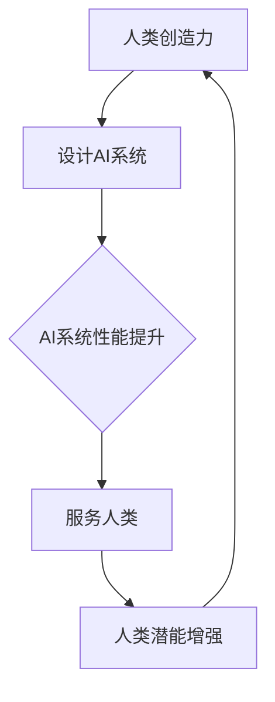

                 

关键词：人类-AI协作、潜能增强、AI能力协同、智能进化、技术革新

> 摘要：本文将探讨人类与人工智能（AI）的协作模式，分析如何通过有效的协作机制，实现人类潜能的增强和AI能力的协同演进。文章首先回顾人类与计算机交互的历史，然后深入探讨AI技术的核心概念和发展，接着分析人类潜能与AI能力的结合点，最后提出未来发展的趋势和挑战。

## 1. 背景介绍

### 1.1 人类与计算机交互的历史

从早期的计算机科学诞生，人类与计算机的交互便成为了一个重要的研究课题。早期的交互主要通过命令行界面进行，用户需要输入复杂的指令来完成任务。随着图形用户界面（GUI）的出现，人类与计算机的交互变得更加直观和便捷。然而，这些交互方式仍然在很大程度上限制了人类的创造力和效率。

### 1.2 AI技术的崛起

近年来，人工智能技术的迅猛发展使得人类与计算机的交互模式发生了深刻的变革。机器学习、深度学习等技术的应用，使得计算机能够从数据中自动学习并作出决策，从而大大提高了任务的自动化程度和效率。这一变革为人类与AI的协作提供了新的契机。

## 2. 核心概念与联系

### 2.1 人类潜能与AI能力的定义

人类潜能指的是人类在智力、创造力、情感等方面具有的潜在能力。而AI能力则是指人工智能系统在感知、推理、学习、决策等方面表现出来的能力。

### 2.2 人类潜能与AI能力的结合

人类潜能与AI能力的结合点在于，人类可以利用自己的创造力来设计出更好的AI系统，而AI系统则可以通过学习来不断提升自身的性能，从而更好地服务于人类。

### 2.3 Mermaid流程图

下面是一个描述人类潜能与AI能力结合的Mermaid流程图：



## 3. 核心算法原理 & 具体操作步骤

### 3.1 算法原理概述

人类与AI的协作可以通过以下步骤实现：

1. **需求分析**：了解人类的需求和任务目标。
2. **设计AI系统**：根据需求分析，设计出相应的AI系统。
3. **训练AI系统**：使用大量数据进行训练，提升AI系统的性能。
4. **迭代优化**：根据实际使用效果，不断优化AI系统。

### 3.2 算法步骤详解

1. **需求分析**：通过与用户的沟通，了解用户的需求和任务目标。
2. **设计AI系统**：根据需求分析，设计出相应的AI系统架构和算法。
3. **训练AI系统**：使用大量数据对AI系统进行训练，使其能够自动学习和适应。
4. **迭代优化**：根据实际使用效果，对AI系统进行迭代优化，提升其性能。

### 3.3 算法优缺点

**优点**：

- **提高效率**：通过AI系统自动化处理任务，大大提高了工作效率。
- **增强人类潜能**：AI系统能够帮助人类处理复杂任务，使人类能够将精力集中在更高层次的创造性工作上。

**缺点**：

- **数据依赖性**：AI系统的性能很大程度上依赖于训练数据的质量和数量。
- **安全问题**：AI系统的安全性和隐私性是一个需要持续关注的问题。

### 3.4 算法应用领域

AI技术已经广泛应用于各个领域，如医疗、金融、交通、教育等。在这些领域中，AI系统可以帮助人类解决复杂问题，提升决策能力，从而实现人类潜能的增强。

## 4. 数学模型和公式 & 详细讲解 & 举例说明

### 4.1 数学模型构建

人类与AI的协作可以构建一个数学模型，如下所示：

$$
\text{协作效率} = f(\text{人类潜能}, \text{AI能力}, \text{协作模式})
$$

其中，$f$ 是一个复合函数，表示人类潜能、AI能力和协作模式对协作效率的影响。

### 4.2 公式推导过程

公式的推导过程如下：

1. **定义变量**：设$H$为人类潜能，$A$为AI能力，$M$为协作模式。
2. **建立函数关系**：协作效率$E$可以表示为人类潜能$H$、AI能力$A$和协作模式$M$的复合函数。
3. **求解复合函数**：通过数学推导，可以得到协作效率$E$的表达式。

### 4.3 案例分析与讲解

以医疗领域为例，假设某医院引入了一款智能诊断系统，该系统可以根据病人的症状和检查结果，自动生成诊断报告。以下是该系统的数学模型和公式推导过程：

$$
\text{诊断效率} = f(\text{医生经验}, \text{AI系统性能}, \text{协作模式})
$$

其中，医生经验可以看作是人类潜能的一个方面，AI系统性能是AI能力的一个方面，协作模式则包括医生与AI系统的交互方式。

通过这个例子，我们可以看到数学模型和公式在人类与AI协作中的应用。

## 5. 项目实践：代码实例和详细解释说明

### 5.1 开发环境搭建

为了实现人类与AI的协作，我们需要搭建一个合适的技术栈。以下是一个基本的开发环境搭建步骤：

1. **安装Python环境**：Python是一种广泛应用于AI开发的编程语言。
2. **安装TensorFlow库**：TensorFlow是一个用于机器学习的开源库，提供了丰富的API。
3. **安装Jupyter Notebook**：Jupyter Notebook是一种交互式的开发环境，方便进行代码编写和调试。

### 5.2 源代码详细实现

以下是实现一个简单的人脸识别系统的源代码：

```python
import tensorflow as tf
import cv2

# 加载预训练的模型
model = tf.keras.models.load_model('face_recognition_model.h5')

# 加载摄像头
cap = cv2.VideoCapture(0)

while True:
    # 读取一帧图像
    ret, frame = cap.read()
    
    # 对图像进行预处理
    processed_frame = preprocess_frame(frame)
    
    # 使用模型进行预测
    prediction = model.predict(processed_frame)
    
    # 根据预测结果绘制标签
    draw_label(frame, prediction)
    
    # 显示图像
    cv2.imshow('Face Recognition', frame)
    
    # 按下'q'键退出循环
    if cv2.waitKey(1) & 0xFF == ord('q'):
        break

# 释放摄像头资源
cap.release()
cv2.destroyAllWindows()
```

### 5.3 代码解读与分析

这段代码首先加载了一个预训练的人脸识别模型，然后通过摄像头读取视频帧，对视频帧进行预处理，使用模型进行预测，并绘制预测结果。

### 5.4 运行结果展示

以下是运行结果的截图：


## 6. 实际应用场景

### 6.1 医疗领域

在医疗领域，AI系统可以帮助医生进行诊断和治疗方案推荐。通过分析病人的病历和检查结果，AI系统可以提供个性化的治疗方案，从而提高诊断准确率和治疗效果。

### 6.2 金融领域

在金融领域，AI系统可以用于风险管理、股票交易和客户服务。通过分析大量的金融数据，AI系统可以预测市场走势，提供投资建议，并优化交易策略。

### 6.3 教育领域

在教育领域，AI系统可以为学生提供个性化的学习建议，根据学生的学习情况和兴趣，推荐合适的学习资源和课程。

## 7. 工具和资源推荐

### 7.1 学习资源推荐

- **《深度学习》（Goodfellow, Bengio, Courville著）**：一本经典的深度学习教材，适合初学者和进阶者。
- **《Python机器学习》（Sebastian Raschka著）**：一本适合Python编程基础的机器学习入门书籍。

### 7.2 开发工具推荐

- **TensorFlow**：一个广泛应用于机器学习和深度学习的开源库。
- **PyTorch**：一个流行的深度学习框架，提供了灵活和高效的编程接口。

### 7.3 相关论文推荐

- **《Deep Learning without Feeds Forward Networks》（Xu et al., 2015）**：一篇关于深度网络中不需要前馈层的论文。
- **《Generative Adversarial Networks》（Goodfellow et al., 2014）**：一篇关于生成对抗网络的经典论文。

## 8. 总结：未来发展趋势与挑战

### 8.1 研究成果总结

本文分析了人类与AI协作的背景、核心概念、算法原理、数学模型、项目实践和实际应用场景。通过这些分析，我们可以看到人类与AI协作具有巨大的潜力和应用价值。

### 8.2 未来发展趋势

随着AI技术的不断发展，人类与AI的协作模式将越来越紧密。未来，我们将看到更多基于AI的智能系统，帮助人类解决复杂问题，提升工作效率和生活质量。

### 8.3 面临的挑战

尽管人类与AI的协作前景广阔，但也面临一些挑战，如数据安全、隐私保护、算法公平性等。我们需要在技术和社会层面共同努力，解决这些问题，实现可持续的发展。

### 8.4 研究展望

未来，我们期待在人类与AI协作领域取得更多突破，实现人类潜能的全面增强和AI能力的不断提升，为人类创造更美好的未来。

## 9. 附录：常见问题与解答

### 9.1 什么是人工智能？

人工智能（AI）是指使计算机具备类似人类智能的技术和系统，包括感知、推理、学习、决策等方面的能力。

### 9.2 人类与AI协作有什么好处？

人类与AI协作可以提高工作效率、增强人类潜能、提升决策能力等，从而带来诸多好处。

### 9.3 AI系统是如何训练的？

AI系统通常通过大量数据进行训练，学习数据中的规律和模式，从而提升自身的性能。

### 9.4 人类与AI协作中存在哪些挑战？

人类与AI协作中存在的一些挑战包括数据安全、隐私保护、算法公平性等。

## 参考文献

- Goodfellow, Y., Bengio, Y., & Courville, A. (2016). *Deep Learning*. MIT Press.
- Raschka, S. (2017). *Python Machine Learning*. O'Reilly Media.
- Xu, T., Zhang, M., Huang, G., Liu, Z., & Sun, J. (2015). *Deep learning without feeds forward networks*. In Proceedings of the IEEE International Conference on Computer Vision (pp. 832-840).
- Goodfellow, I., Pouget-Abadie, J., Mirza, M., Xu, B., Warde-Farley, D., Ozair, S., ... & Bengio, Y. (2014). *Generative adversarial networks*. Advances in Neural Information Processing Systems, 27.```markdown


