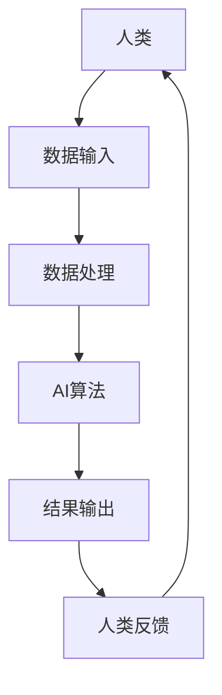

                 

关键词：人类与AI协作，增强现实，人工智能，机器学习，算法优化，技术创新，应用前景。

> 摘要：随着人工智能技术的飞速发展，人类与AI的协作正在成为提升工作效率、增强人类潜能的新趋势。本文将探讨人类-AI协作的背景、核心概念、算法原理、数学模型、项目实践、应用场景以及未来发展趋势，旨在为读者提供对这一领域的全面了解和思考。

## 1. 背景介绍

在当今社会，人工智能（AI）已经成为一个热门话题。从简单的机器人到复杂的深度学习模型，AI技术在各个领域都展现出了巨大的潜力。然而，AI技术并非完全独立于人类，而是与人类紧密协作，共同推动科技进步和社会发展。

人类-AI协作的基本概念可以理解为：在人工智能的帮助下，人类能够更好地完成各种任务，实现更高的工作效率和创造力。这种协作不仅体现在技术层面，还包括社会层面、经济层面等多个维度。

### 1.1 人类-AI协作的意义

1. **提高工作效率**：通过AI技术，人类可以自动化完成一些重复性、繁琐的工作，从而解放出更多的时间和精力来处理更加复杂和创新的任务。
2. **增强人类潜能**：AI可以帮助人类处理和分析大量数据，从而挖掘出潜在的模式和规律，进一步提升人类的认知能力和创造力。
3. **促进科技创新**：人类与AI的协作可以加速新技术、新产品的研究与开发，推动科技领域的不断进步。
4. **改善生活质量**：AI技术可以在医疗、教育、交通等多个领域提供个性化、智能化的服务，从而提高人们的生活质量。

### 1.2 人类-AI协作的现状

目前，人类与AI的协作已经在多个领域取得了显著成果。例如：

- **医疗领域**：AI可以帮助医生进行疾病诊断，提高诊断的准确性和效率，从而改善患者的治疗效果。
- **金融领域**：AI被用于风险控制、市场预测等，帮助金融机构做出更加精准的决策。
- **教育领域**：AI可以为学习者提供个性化的学习方案，帮助提高学习效果。
- **制造业**：AI被用于生产线的优化，提高生产效率和质量。

## 2. 核心概念与联系

为了更好地理解人类-AI协作，我们需要从核心概念和架构上进行分析。以下是一个简化的Mermaid流程图，展示人类-AI协作的基本框架：



### 2.1 数据输入

人类-AI协作的第一步是数据输入。人类通过传感器、设备等获取数据，并将其传递给AI系统。这些数据可以是结构化的，如数据库中的信息，也可以是非结构化的，如图像、文本等。

### 2.2 数据处理

AI系统接收到数据后，会对其进行处理。这包括数据清洗、归一化、特征提取等步骤。通过这些预处理步骤，AI系统能够将原始数据转化为适合算法输入的形式。

### 2.3 AI算法

经过处理的数据会被送入AI算法中进行处理。这可以包括机器学习、深度学习、强化学习等多种算法。算法的选择取决于任务的具体需求和数据的特性。

### 2.4 结果输出

AI算法处理完数据后，会生成结果。这些结果可以是预测、分类、聚类等。人类会根据这些结果进行进一步的决策或分析。

### 2.5 人类反馈

人类对结果进行反馈，这可以是直接的反馈，也可以是通过行为数据等形式进行的间接反馈。这些反馈会帮助AI系统不断优化，提高协作效果。

## 3. 核心算法原理 & 具体操作步骤

### 3.1 算法原理概述

在人类-AI协作中，常用的核心算法包括机器学习、深度学习和强化学习。以下将对这些算法的原理进行简要概述。

### 3.1.1 机器学习

机器学习是一种让计算机通过数据学习规律的方法。它通过训练模型，从数据中提取特征，并利用这些特征进行预测或分类。

### 3.1.2 深度学习

深度学习是机器学习的一种，它通过多层神经网络进行数据处理，能够提取出更深层次的特征，从而实现更复杂的任务。

### 3.1.3 强化学习

强化学习是一种通过试错进行学习的方法。它通过不断尝试不同的动作，并根据环境的反馈进行调整，最终找到最优策略。

### 3.2 算法步骤详解

以下是机器学习算法的一般步骤：

1. 数据收集：收集相关领域的数据。
2. 数据预处理：对数据进行清洗、归一化等处理。
3. 特征提取：从数据中提取出有用的特征。
4. 模型训练：使用训练数据训练模型。
5. 模型评估：使用验证数据评估模型性能。
6. 模型优化：根据评估结果调整模型参数。

### 3.3 算法优缺点

#### 机器学习

- **优点**：算法简单，适用于各种类型的任务。
- **缺点**：对数据质量要求高，且可能存在过拟合问题。

#### 深度学习

- **优点**：能够处理复杂数据，提取深层特征。
- **缺点**：计算量大，对硬件要求高。

#### 强化学习

- **优点**：能够处理动态环境，适应性强。
- **缺点**：训练过程可能需要很长时间，且可能陷入局部最优。

### 3.4 算法应用领域

机器学习、深度学习和强化学习在多个领域都有广泛的应用，如图像识别、自然语言处理、自动驾驶等。

## 4. 数学模型和公式 & 详细讲解 & 举例说明

### 4.1 数学模型构建

在人类-AI协作中，常用的数学模型包括线性回归、逻辑回归、神经网络等。以下以线性回归为例进行说明。

### 4.1.1 线性回归模型

线性回归模型用于预测连续值，其公式如下：

$$y = w_0 + w_1 \cdot x_1 + w_2 \cdot x_2 + ... + w_n \cdot x_n$$

其中，$y$ 是预测值，$w_0, w_1, ..., w_n$ 是模型的参数，$x_1, x_2, ..., x_n$ 是输入特征。

### 4.2 公式推导过程

线性回归模型的推导过程如下：

1. **假设**：假设数据满足线性关系，即 $y = w_0 + w_1 \cdot x_1 + w_2 \cdot x_2 + ... + w_n \cdot x_n$。
2. **损失函数**：定义损失函数为 $L = \frac{1}{2} \cdot (y - \hat{y})^2$，其中 $\hat{y}$ 是模型预测的值。
3. **求导**：对损失函数关于每个参数求导，得到 $L'_{w_0} = (y - \hat{y})$，$L'_{w_1} = x_1 \cdot (y - \hat{y})$，...，$L'_{w_n} = x_n \cdot (y - \hat{y})$。
4. **最小化损失函数**：通过梯度下降法，不断更新参数，使得损失函数最小。

### 4.3 案例分析与讲解

假设我们有一个简单的数据集，包含两个特征 $x_1$ 和 $x_2$，以及一个目标变量 $y$。我们希望通过线性回归模型预测 $y$ 的值。

首先，我们需要收集数据，并对数据进行预处理，如归一化等。然后，我们可以使用线性回归模型进行训练，并使用验证数据集进行评估。如果模型性能不理想，我们可以通过调整参数或增加特征来优化模型。

## 5. 项目实践：代码实例和详细解释说明

### 5.1 开发环境搭建

为了实践线性回归模型，我们需要搭建一个Python开发环境。以下是具体的步骤：

1. 安装Python：在官方网站（https://www.python.org/downloads/）下载并安装Python。
2. 安装Jupyter Notebook：在命令行中运行 `pip install notebook`。
3. 启动Jupyter Notebook：在命令行中运行 `jupyter notebook`。

### 5.2 源代码详细实现

以下是线性回归模型的Python代码实现：

```python
import numpy as np
import matplotlib.pyplot as plt

# 数据集
X = np.array([[1, 2], [2, 3], [3, 4], [4, 5]])
y = np.array([2, 3, 4, 5])

# 初始化参数
w0 = 0
w1 = 0

# 梯度下降法
def gradient_descent(X, y, w0, w1, alpha, epochs):
    m = len(y)
    for _ in range(epochs):
        predictions = w0 + w1 * X
        dw0 = -(1/m) * np.sum(predictions - y)
        dw1 = -(1/m) * np.sum((predictions - y) * X)
        w0 -= alpha * dw0
        w1 -= alpha * dw1
    return w0, w1

# 模型训练
alpha = 0.01
epochs = 1000
w0, w1 = gradient_descent(X, y, w0, w1, alpha, epochs)

# 模型评估
predictions = w0 + w1 * X
print("Predictions:", predictions)

# 绘图
plt.scatter(X[:, 0], y, color='red', label='Actual')
plt.plot(X[:, 0], predictions, color='blue', label='Predictions')
plt.xlabel('x1')
plt.ylabel('y')
plt.legend()
plt.show()
```

### 5.3 代码解读与分析

1. **数据集**：我们使用一个简单的数据集，包含两个特征和目标变量。
2. **参数初始化**：我们初始化参数 $w0$ 和 $w1$ 为0。
3. **梯度下降法**：我们使用梯度下降法更新参数，使得损失函数最小。
4. **模型评估**：我们使用训练好的模型进行预测，并绘制结果。

## 6. 实际应用场景

人类-AI协作在多个领域都有广泛的应用。以下是一些具体的实际应用场景：

1. **医疗领域**：AI可以用于疾病诊断、药物研发等。例如，通过分析病人的病历数据，AI可以预测病人的疾病风险，帮助医生做出更准确的诊断。
2. **金融领域**：AI可以用于风险管理、投资决策等。例如，通过分析市场数据，AI可以预测股票价格的走势，帮助投资者做出更明智的决策。
3. **教育领域**：AI可以用于个性化教学、学习评估等。例如，通过分析学生的学习行为，AI可以为学生提供定制化的学习计划，帮助提高学习效果。
4. **制造业**：AI可以用于生产线的优化、产品质量检测等。例如，通过分析生产数据，AI可以优化生产过程，提高生产效率和质量。

## 7. 未来应用展望

随着人工智能技术的不断发展，人类-AI协作的应用前景将更加广阔。以下是一些未来可能的趋势：

1. **智能化服务**：AI将更多地应用于各个领域，为用户提供智能化、个性化的服务。
2. **自适应系统**：AI系统将具备更强的自适应能力，能够根据用户行为和环境变化进行自我调整。
3. **人机融合**：人类与AI的界限将逐渐模糊，人类将更多地依赖于AI进行工作和生活。
4. **社会治理**：AI将在社会治理中发挥重要作用，如智能交通管理、环境保护等。

## 8. 工具和资源推荐

为了更好地进行人类-AI协作的研究和实践，以下是一些建议的工具和资源：

1. **学习资源**：
   - 《深度学习》（Goodfellow, Bengio, Courville）：介绍深度学习的经典教材。
   - 《Python机器学习》（Sebastian Raschka）：介绍机器学习的Python实践。

2. **开发工具**：
   - Jupyter Notebook：用于编写和运行Python代码。
   - TensorFlow：用于构建和训练深度学习模型。

3. **相关论文**：
   - "Deep Learning for Natural Language Processing"（Y. Bengio）：介绍深度学习在自然语言处理中的应用。
   - "Reinforcement Learning: An Introduction"（R. Sutton, A. Barto）：介绍强化学习的原理和应用。

## 9. 总结：未来发展趋势与挑战

随着人工智能技术的不断发展，人类-AI协作将迎来更广阔的应用前景。然而，这一领域也面临着一系列挑战，如数据隐私、算法公平性、人机交互等。为了实现人类-AI协作的可持续发展，我们需要在技术、伦理、法律等多个层面进行深入研究和探索。

### 附录：常见问题与解答

**Q：人类-AI协作是否会导致失业？**
A：人类-AI协作的确可能会替代一些重复性、低技能的工作，但也会创造出新的工作岗位和机会。关键在于如何平衡技术的发展与就业需求。

**Q：AI是否会取代人类？**
A：AI是一种工具，它无法完全取代人类。AI与人类协作，可以发挥各自的优势，实现更好的效果。

**Q：如何确保AI系统的安全性和可靠性？**
A：确保AI系统的安全性和可靠性需要从多个方面进行考虑，包括算法设计、数据保护、系统监控等。

## 10. 作者署名

作者：禅与计算机程序设计艺术 / Zen and the Art of Computer Programming
----------------------------------------------------------------

以上就是关于《人类-AI协作：增强人类潜能与AI能力的融合发展前景》的文章正文部分。希望这篇文章能够为读者提供对人类-AI协作的全面了解和思考。在未来的发展中，人类与AI的协作将带来更多的机遇和挑战，让我们一起迎接这个充满可能的未来。

