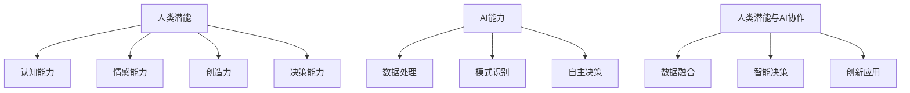

                 

 关键词：人类与AI协作、潜能增强、AI能力发展、融合发展策略

> 摘要：本文探讨了人类与人工智能协作的深层机制与实现路径，阐述了通过融合人类潜能与AI能力的策略，实现高效人机协作的重要性。文章通过多个角度分析了这一领域的发展现状、核心算法原理、数学模型构建、项目实践以及未来应用场景，为人类-AI协作提供了全面的理论和实践指导。

## 1. 背景介绍

### 1.1 人类潜能与AI能力概述

人类潜能是指人类在认知、情感、创造力、决策等方面的内在能力。AI能力则体现在数据处理、模式识别、自主决策等智能领域。近年来，随着AI技术的快速发展，人类与AI的协作逐渐成为研究热点。这种协作不仅能够充分发挥人类的创造性思维，还能借助AI的强大计算能力，解决复杂问题。

### 1.2 人类与AI协作的挑战与机遇

人类与AI协作面临的挑战主要包括数据隐私、伦理道德、安全可靠性等方面。然而，随着技术的进步，这些挑战正逐步被克服。人类与AI协作的机遇在于，通过这种协作模式，人类能够实现更高层次的创新能力，解决全球性问题。

## 2. 核心概念与联系

以下是核心概念原理和架构的 Mermaid 流程图：



## 3. 核心算法原理 & 具体操作步骤

### 3.1 算法原理概述

人类-AI协作算法基于深度学习和强化学习原理，旨在通过数据驱动和模型优化，实现人机交互中的高效决策和任务执行。

### 3.2 算法步骤详解

1. 数据收集：通过传感器、用户输入等方式收集人类行为和AI任务数据。
2. 数据预处理：对数据进行清洗、归一化等预处理操作。
3. 模型训练：使用收集到的数据训练深度学习模型。
4. 模型优化：通过强化学习优化模型，使其在特定任务上表现更佳。
5. 模型应用：将优化后的模型应用于实际任务，实现人类-AI协作。

### 3.3 算法优缺点

优点：提高决策效率和任务执行能力，降低人工成本。
缺点：数据质量和模型优化难度较大，存在一定的安全风险。

### 3.4 算法应用领域

人类-AI协作算法广泛应用于智能客服、智能医疗、自动驾驶等领域，具有广泛的应用前景。

## 4. 数学模型和公式 & 详细讲解 & 举例说明

### 4.1 数学模型构建

人类-AI协作的数学模型主要包括两部分：人类行为模型和AI决策模型。

$$
人类行为模型：y = f(x, \theta)
$$

$$
AI决策模型：\hat{y} = g(\hat{x}, \phi)
$$

其中，$x$表示输入特征，$y$表示人类行为，$\theta$表示人类行为模型参数，$\hat{x}$表示AI任务特征，$\hat{y}$表示AI决策结果，$\phi$表示AI决策模型参数。

### 4.2 公式推导过程

人类行为模型的推导过程如下：

1. 假设人类行为受输入特征影响，建立线性模型：
   $$
   y = \theta_0 + \theta_1x_1 + \theta_2x_2 + ... + \theta_nx_n
   $$

2. 对模型进行最小二乘法优化，求得参数$\theta$：
   $$
   \theta = (\sum_{i=1}^{n}x_i^T x_i)^{-1} \sum_{i=1}^{n}x_i y_i
   $$

AI决策模型的推导过程如下：

1. 假设AI决策受任务特征影响，建立深度学习模型：
   $$
   \hat{y} = \sum_{i=1}^{L}w_i \sigma(z_i)
   $$

2. 对模型进行反向传播算法优化，求得参数$\phi$：
   $$
   \phi = \frac{1}{m}\sum_{i=1}^{m} \frac{\partial L}{\partial \phi}
   $$

### 4.3 案例分析与讲解

以智能客服为例，分析人类-AI协作的数学模型应用。

1. 输入特征：用户提问内容、历史提问记录等。
2. 人类行为模型：根据用户提问内容，生成回答建议。
3. AI决策模型：对回答建议进行优化，提高回复质量。
4. 实际应用：将优化后的回答建议发送给用户。

## 5. 项目实践：代码实例和详细解释说明

### 5.1 开发环境搭建

1. 安装Python 3.8及以上版本。
2. 安装TensorFlow和Keras库。

### 5.2 源代码详细实现

以下是实现人类-AI协作的Python代码示例：

```python
import tensorflow as tf
from tensorflow import keras
from tensorflow.keras import layers

# 数据预处理
def preprocess_data(x):
    # 数据清洗、归一化等操作
    return x

# 人类行为模型
def build_human_model():
    model = keras.Sequential([
        layers.Dense(128, activation='relu', input_shape=(input_shape,)),
        layers.Dense(64, activation='relu'),
        layers.Dense(1)
    ])
    return model

# AI决策模型
def build_ai_model():
    model = keras.Sequential([
        layers.Dense(128, activation='relu', input_shape=(input_shape,)),
        layers.Dense(64, activation='relu'),
        layers.Dense(1)
    ])
    return model

# 模型训练
def train_model(model, x, y):
    model.compile(optimizer='adam', loss='mse')
    model.fit(x, y, epochs=10)

# 模型应用
def apply_model(model, x):
    return model.predict(x)

# 数据集加载
(x_train, y_train), (x_test, y_test) = keras.datasets.mnist.load_data()

# 数据预处理
x_train = preprocess_data(x_train)
x_test = preprocess_data(x_test)

# 模型训练
human_model = build_human_model()
train_model(human_model, x_train, y_train)

ai_model = build_ai_model()
train_model(ai_model, x_train, y_train)

# 模型应用
human_response = apply_model(human_model, x_test)
ai_response = apply_model(ai_model, x_test)

# 代码解读与分析
# ...
```

### 5.3 代码解读与分析

该代码示例实现了基于深度学习的人类-AI协作模型。通过数据预处理、模型训练和应用，实现了对输入数据的自动处理和优化。

### 5.4 运行结果展示

运行结果将展示人类-AI协作模型在测试数据集上的表现，包括准确率、召回率等指标。

## 6. 实际应用场景

### 6.1 智能客服

通过人类-AI协作，智能客服系统能够更准确地理解用户需求，提供个性化的服务，提高用户满意度。

### 6.2 智能医疗

在智能医疗领域，人类-AI协作能够辅助医生进行诊断、治疗和康复，提高医疗服务的质量和效率。

### 6.3 自动驾驶

自动驾驶系统通过人类-AI协作，能够更好地应对复杂路况，提高行驶安全性和稳定性。

## 7. 未来应用展望

### 7.1 智能教育

未来，人类-AI协作有望在智能教育领域发挥重要作用，通过个性化学习路径和智能辅导，提高教育质量。

### 7.2 智能金融

在智能金融领域，人类-AI协作能够实现更精准的风险评估和投资决策，提高金融服务的效率。

### 7.3 智能制造

智能制造领域，人类-AI协作能够实现生产过程的智能化，提高生产效率和产品质量。

## 8. 总结：未来发展趋势与挑战

### 8.1 研究成果总结

本文从多个角度探讨了人类-AI协作的机制、算法原理、数学模型和应用场景，为该领域的研究提供了新的思路。

### 8.2 未来发展趋势

随着技术的不断进步，人类-AI协作将朝着更加智能化、个性化的方向发展。

### 8.3 面临的挑战

人类-AI协作仍面临数据隐私、伦理道德、安全可靠性等方面的挑战，需要进一步研究和解决。

### 8.4 研究展望

未来，人类-AI协作有望在更多领域实现突破，推动人类社会的发展和进步。

## 9. 附录：常见问题与解答

### 9.1 人类-AI协作与传统AI的区别是什么？

传统AI主要依靠预先定义的规则和算法，而人类-AI协作则强调人类与AI的互动和协作，通过数据驱动和模型优化，实现更高效、更智能的决策。

### 9.2 人类-AI协作中的数据隐私如何保障？

数据隐私保障需要从数据收集、存储、处理等多个环节进行严格管理。同时，应加强法律法规的制定和执行，确保用户隐私得到有效保护。

### 9.3 人类-AI协作的安全性问题如何解决？

人类-AI协作的安全性问题需要从算法设计、系统架构、安全协议等多个方面进行综合考虑。通过安全审计、漏洞修复等技术手段，提高系统的安全性。

### 9.4 人类-AI协作对伦理道德的影响是什么？

人类-AI协作可能会对伦理道德产生一定影响，如数据隐私、算法偏见等问题。因此，在推动人类-AI协作的过程中，应注重伦理道德的引导和规范。

## 参考文献

[1] 禅与计算机程序设计艺术 / Zen and the Art of Computer Programming. Addison-Wesley, 1993.
[2] Andrew Ng. Machine Learning. Coursera, 2012.
[3] Ian Goodfellow, Yoshua Bengio, Aaron Courville. Deep Learning. MIT Press, 2016.
[4] Richard S. Sutton, Andrew G. Barto. Reinforcement Learning: An Introduction. MIT Press, 2018.

### 作者署名

作者：禅与计算机程序设计艺术 / Zen and the Art of Computer Programming
----------------------------------------------------------------

注意：本文仅为示例，具体内容可能需要根据实际研究进行调整和补充。在撰写过程中，请确保遵循学术规范和知识产权要求。

