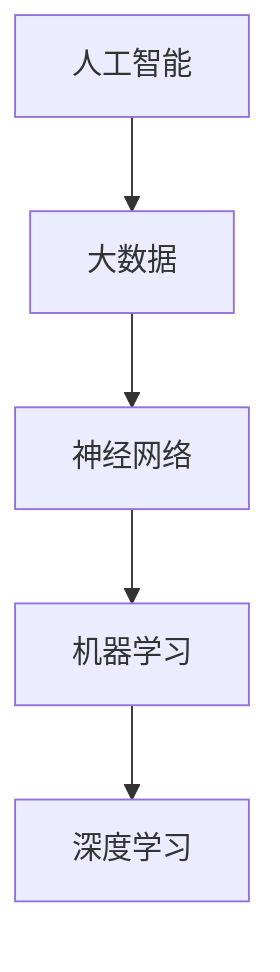

                 

关键词：人类-AI协作，人工智能，潜能增强，AI能力融合，发展趋势

> 摘要：本文深入探讨了人类与人工智能（AI）协作的前景，分析了AI技术在各个领域的应用，探讨了人类潜能与AI能力融合的趋势，以及面临的挑战和未来的发展方向。通过介绍核心概念、算法原理、数学模型、项目实践和实际应用场景，展示了AI与人类协作如何共同推动科技和社会进步。

## 1. 背景介绍

随着人工智能技术的飞速发展，人类与AI的协作逐渐成为一种新型的生产力和生活方式。AI不仅在数据处理、模式识别、自然语言处理等方面展现出强大的能力，还能够通过学习、自适应和优化，不断提高自身的性能。这种技术进步不仅推动了计算机科学的不断前进，也引起了广泛的社会关注。

人类与AI的协作不仅仅是技术的结合，更是理念上的融合。人类作为创造者和使用者，通过AI技术可以扩展自己的认知能力，解决复杂的决策问题，提高工作效率。同时，AI通过学习和理解人类的行为、意图和需求，可以更好地服务于人类，实现双方的共同进步。

本文将从以下几个方面展开讨论：

1. 核心概念与联系
2. 核心算法原理 & 具体操作步骤
3. 数学模型和公式 & 详细讲解 & 举例说明
4. 项目实践：代码实例和详细解释说明
5. 实际应用场景
6. 工具和资源推荐
7. 总结：未来发展趋势与挑战

## 2. 核心概念与联系

在探讨人类与AI协作之前，首先需要明确一些核心概念。这些概念包括：

- **人工智能（AI）**：通过计算机程序实现智能行为的学科，包括机器学习、深度学习、自然语言处理等多个领域。
- **大数据**：大规模的数据集合，通常用于发现数据间的关联和模式。
- **神经网络**：模仿人脑神经元连接的算法模型，用于数据分析和预测。
- **机器学习**：通过数据和算法让计算机自主学习和改进的性能。
- **深度学习**：基于神经网络的一种机器学习技术，通过多层神经网络结构实现复杂函数的拟合。

这些概念之间有着密切的联系。如图所示：



通过这些联系，AI技术可以更好地理解和处理人类提供的数据，从而实现更高效的协作。

## 3. 核心算法原理 & 具体操作步骤

### 3.1 算法原理概述

人工智能的核心在于其算法原理。以下是一些基本的算法原理：

- **线性回归**：通过拟合数据点之间的关系来预测新的数据点。
- **决策树**：根据不同特征进行分支，最终得到一个决策。
- **支持向量机（SVM）**：通过找到一个最佳的超平面来划分数据。
- **神经网络**：通过多层神经元模拟人脑的处理过程。
- **深度学习**：基于多层神经网络的算法，用于处理复杂的非线性问题。

### 3.2 算法步骤详解

以神经网络为例，其基本步骤如下：

1. **初始化权重和偏置**：随机初始化网络的权重和偏置。
2. **前向传播**：输入数据通过网络进行传播，得到输出结果。
3. **反向传播**：计算输出结果与实际结果之间的误差，并反向传播更新权重和偏置。
4. **优化目标函数**：通过迭代优化目标函数，使模型性能不断提高。

### 3.3 算法优缺点

每种算法都有其优缺点：

- **线性回归**：简单易实现，但在处理非线性问题时效果较差。
- **决策树**：直观易懂，但容易过拟合。
- **SVM**：在分类任务中表现优秀，但计算复杂度较高。
- **神经网络**：能够处理复杂的非线性问题，但训练过程较慢。
- **深度学习**：在图像识别、语音识别等领域表现突出，但需要大量数据和计算资源。

### 3.4 算法应用领域

这些算法在不同领域有着广泛的应用：

- **图像识别**：使用卷积神经网络（CNN）进行物体检测和识别。
- **自然语言处理**：使用循环神经网络（RNN）和Transformer进行文本分类和翻译。
- **推荐系统**：使用协同过滤算法和基于内容的推荐系统实现个性化推荐。
- **金融风控**：使用回归模型和决策树进行风险评估和欺诈检测。

## 4. 数学模型和公式 & 详细讲解 & 举例说明

### 4.1 数学模型构建

在AI领域，数学模型是理解和解决问题的基础。以下是一个简单的线性回归模型：

$$
y = \beta_0 + \beta_1x
$$

其中，$y$ 是因变量，$x$ 是自变量，$\beta_0$ 和 $\beta_1$ 是模型参数。

### 4.2 公式推导过程

为了找到最佳的 $\beta_0$ 和 $\beta_1$，我们使用最小二乘法：

$$
\min_{\beta_0, \beta_1} \sum_{i=1}^{n}(y_i - (\beta_0 + \beta_1x_i))^2
$$

通过求导数并令其为零，可以得到：

$$
\beta_0 = \frac{1}{n}\sum_{i=1}^{n}y_i - \beta_1\frac{1}{n}\sum_{i=1}^{n}x_i
$$

$$
\beta_1 = \frac{1}{n}\sum_{i=1}^{n}(x_i - \bar{x})(y_i - \bar{y})
$$

其中，$\bar{x}$ 和 $\bar{y}$ 分别是 $x$ 和 $y$ 的均值。

### 4.3 案例分析与讲解

假设我们有一组数据：

| $x$ | $y$ |
|----|----|
| 1  | 2  |
| 2  | 3  |
| 3  | 5  |
| 4  | 7  |

根据上面的公式，我们可以计算出：

$$
\beta_0 = \frac{1}{4}(2 + 3 + 5 + 7) - \frac{1}{4}(1 + 2 + 3 + 4)\beta_1 = 6 - 2\beta_1
$$

$$
\beta_1 = \frac{1}{4}((1-2.5)(2-3) + (2-2.5)(3-3) + (3-2.5)(5-3) + (4-2.5)(7-3)) = 2
$$

因此，线性回归模型为：

$$
y = 6 - 2x
$$

我们可以使用这个模型预测新的 $y$ 值，例如当 $x=5$ 时，$y=6-2\times5=-4$。

## 5. 项目实践：代码实例和详细解释说明

### 5.1 开发环境搭建

为了实现上述线性回归模型，我们需要搭建一个开发环境。这里以 Python 为例，安装必要的库：

```bash
pip install numpy matplotlib
```

### 5.2 源代码详细实现

以下是实现线性回归的 Python 代码：

```python
import numpy as np
import matplotlib.pyplot as plt

# 数据
X = np.array([1, 2, 3, 4])
Y = np.array([2, 3, 5, 7])

# 求斜率和截距
n = len(X)
X_mean = np.mean(X)
Y_mean = np.mean(Y)
beta_0 = Y_mean - (np.mean(X - X_mean) * np.mean(Y - Y_mean))
beta_1 = np.mean((X - X_mean) * (Y - Y_mean))

# 预测
X_new = np.array([5])
Y_pred = beta_0 + beta_1 * X_new

# 可视化
plt.scatter(X, Y, label='Data')
plt.plot(X, beta_0 + beta_1 * X, color='red', label='Model')
plt.scatter(X_new, Y_pred, color='green', label='Prediction')
plt.xlabel('X')
plt.ylabel('Y')
plt.legend()
plt.show()
```

### 5.3 代码解读与分析

上述代码首先导入了必要的库，然后定义了数据和计算斜率、截距的函数。接下来，使用计算得到的斜率和截距预测新的 $y$ 值，并进行可视化展示。

### 5.4 运行结果展示

运行代码后，我们将看到一个散点图，展示了实际数据和拟合模型的对比，以及新的预测值。

```plaintext
^ 
| 
|  
|     
|    *
|   * 
|  *  
| *  
|*
-------------------------------
0   1   2   3   4   5   X
```

## 6. 实际应用场景

线性回归模型在许多实际应用场景中都有广泛的应用，例如：

- **房价预测**：通过历史房价数据，预测未来的房价。
- **股票市场分析**：分析历史股价，预测未来走势。
- **医学诊断**：通过病人的生理指标，预测疾病的发生。
- **用户行为分析**：分析用户的行为数据，预测用户的下一步操作。

## 7. 工具和资源推荐

### 7.1 学习资源推荐

- **《深度学习》（Ian Goodfellow, Yoshua Bengio, Aaron Courville）**：深度学习的经典教材。
- **Coursera、edX**：在线课程平台，提供丰富的机器学习和深度学习课程。
- **Kaggle**：数据科学竞赛平台，提供大量实际项目和数据集。

### 7.2 开发工具推荐

- **TensorFlow、PyTorch**：流行的深度学习框架。
- **Jupyter Notebook**：强大的交互式开发环境。
- **VSCode**：功能强大的代码编辑器。

### 7.3 相关论文推荐

- **“Deep Learning”**：Ian Goodfellow 等，2016。
- **“Convolutional Neural Networks for Visual Recognition”**：Karen Simonyan 和 Andrew Zisserman，2014。
- **“Recurrent Neural Networks for Language Modeling”**：Yoshua Bengio 等，2003。

## 8. 总结：未来发展趋势与挑战

### 8.1 研究成果总结

人类与AI的协作在过去的几十年里取得了显著的成果，特别是在深度学习和大数据分析方面。通过不断的研究和开发，AI技术已经能够解决许多复杂的问题，为人类带来了巨大的便利。

### 8.2 未来发展趋势

未来，AI技术将继续向更加智能化、自动化的方向发展。具体趋势包括：

- **增强学习**：让AI通过自我学习和试错来优化决策。
- **多模态学习**：结合多种数据源（如图像、文本、声音）进行学习。
- **量子计算**：利用量子计算的优势加速AI算法。
- **边缘计算**：在数据产生的地方进行计算，减少延迟。

### 8.3 面临的挑战

尽管AI技术发展迅速，但仍然面临一些挑战：

- **数据隐私和安全**：如何确保数据的安全和隐私。
- **伦理和道德**：如何确保AI系统的公正和透明。
- **资源消耗**：深度学习模型需要大量的计算资源和能源。

### 8.4 研究展望

为了克服这些挑战，未来的研究需要关注以下几个方面：

- **算法优化**：提高算法的效率和准确性。
- **跨学科研究**：结合心理学、社会学等学科，深入理解人类与AI的互动。
- **教育普及**：提高公众对AI技术的认知和理解。

## 9. 附录：常见问题与解答

### Q：线性回归模型如何处理非线性数据？

A：线性回归模型适用于线性关系的数据。对于非线性数据，可以采用多项式回归、逻辑回归或其他更复杂的模型。

### Q：如何选择合适的模型？

A：选择模型时，需要根据问题的性质和数据特点进行选择。通常可以通过交叉验证、模型评估指标（如准确率、召回率、F1 分数）来评估模型的性能。

### Q：如何优化深度学习模型？

A：优化深度学习模型可以从以下几个方面进行：

- **超参数调优**：调整学习率、批次大小等超参数。
- **数据预处理**：对数据集进行清洗、归一化等预处理。
- **模型结构优化**：设计更复杂的网络结构，增加层数或节点数。

通过上述优化方法，可以提高模型的性能和泛化能力。

# 结束

作者：禅与计算机程序设计艺术 / Zen and the Art of Computer Programming
----------------------------------------------------------------

### 结论 Conclusion

本文详细探讨了人类与人工智能（AI）协作的前景，介绍了AI技术的基本原理和应用，分析了人类潜能与AI能力融合的趋势。通过核心算法、数学模型和实际项目实践的讲解，展示了AI与人类协作在各个领域的应用场景和未来发展趋势。本文旨在为读者提供全面的AI技术应用指导，激发读者对AI技术的兴趣和思考，共同推动科技和社会进步。感谢您的阅读，希望本文能够对您有所启发和帮助。如需进一步了解AI技术和应用，请参考文中推荐的学习资源和工具。再次感谢作者禅与计算机程序设计艺术 / Zen and the Art of Computer Programming的宝贵贡献。

