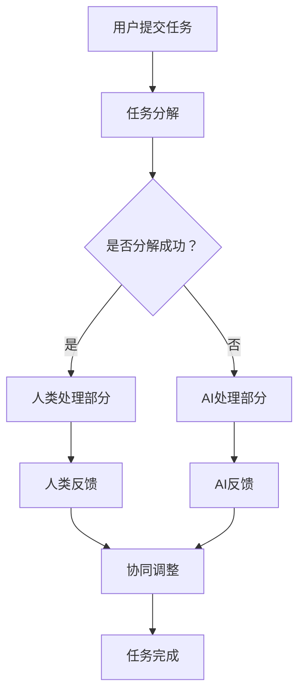

                 

### 1. 背景介绍

在当今信息化和智能化的时代，人工智能（AI）已经成为了推动社会进步和产业升级的重要力量。从最初的概念提出，到今天的大规模应用，AI技术已经在众多领域展现了其强大的潜力和广阔的应用前景。随着计算能力的提升、大数据技术的进步以及机器学习算法的发展，AI技术不断突破传统的技术瓶颈，实现了从模拟简单任务到自主决策和智能优化等复杂功能的跨越。

然而，AI的发展并不是孤立的过程，它需要与人类社会的发展紧密相连。人类的智慧和经验是AI发展的基础，而AI的强大计算能力和自我学习能力则为人类提供了前所未有的工具和方法。人类-AI协作成为了一个新的热点研究领域，其目的是通过将人类的智慧和AI的能力相结合，实现协同创新和效率提升。

人类-AI协作的背景可以追溯到人机交互的发展历程。从早期的命令式交互，到图形用户界面（GUI）的出现，再到自然语言处理和语音交互技术的进步，人机交互的便利性和效率得到了极大的提高。如今，随着AI技术的不断发展，人类-AI协作进入了新的阶段。这不仅体现在日常生活的便捷性上，更体现在工作、学习和科研等各个领域的深度合作。

本文将从以下几个方面展开讨论：首先，介绍人类-AI协作的核心概念和联系；其次，分析人类-AI协作的核心算法原理和具体操作步骤；接着，探讨数学模型和公式在人类-AI协作中的应用；然后，通过项目实践展示代码实例和详细解释说明；随后，分析人类-AI协作的实际应用场景和未来应用展望；最后，总结人类-AI协作的工具和资源，并展望其未来发展趋势与挑战。

### 2. 核心概念与联系

人类-AI协作的核心概念在于如何有效地将人类的智慧和AI的能力结合起来，实现协同创新和效率提升。为了理解这一概念，我们需要从以下几个关键点进行阐述。

#### 2.1 人类智能与AI能力的比较

人类智能和AI能力在许多方面都有显著差异。人类智能具有创造性、情感认知和复杂问题解决等能力，而AI则擅长处理大量的数据和复杂的计算任务。具体来说，人类智能的优势在于：

- **创造力**：人类能够产生新的想法和解决方案，这是AI目前难以企及的。
- **情感认知**：人类可以感知和理解情感，这对于社会交往和决策具有重要的意义。
- **经验学习**：人类可以通过经验不断优化行为，而AI需要大量的数据来进行训练。

相比之下，AI的优势包括：

- **数据处理能力**：AI能够快速处理海量数据，并从中提取有价值的信息。
- **计算效率**：AI可以高效地执行重复性和复杂的计算任务。
- **连续性**：AI可以24小时不间断工作，不会感到疲劳。

#### 2.2 人类-AI协作的基本原理

人类-AI协作的基本原理在于各自发挥优势，互相补充。具体来说，协作过程可以分为以下几个阶段：

1. **信息共享**：人类和AI系统需要共享数据和信息，以便更好地理解彼此的需求和目标。
2. **任务分解**：将复杂任务分解为多个子任务，人类和AI可以分别处理这些子任务。
3. **协同决策**：人类利用自身的主观判断和经验，与AI的客观分析结果相结合，共同做出决策。
4. **反馈优化**：通过实时反馈和调整，不断优化协作效果。

#### 2.3 人类-AI协作的架构

为了实现高效的人类-AI协作，需要构建一个合理的系统架构。以下是几个关键组成部分：

- **用户界面**：用户界面是连接人类和AI系统的桥梁，它需要具备直观易用的特点，以便用户能够方便地与AI交互。
- **数据管理**：数据管理是整个系统的基础，它需要确保数据的安全、完整和可用性。
- **算法模块**：算法模块是实现AI功能的核心，它包括各种机器学习算法、自然语言处理技术等。
- **协同模块**：协同模块负责协调人类和AI的工作，确保任务的高效完成。

#### 2.4 Mermaid流程图

为了更直观地展示人类-AI协作的过程，我们可以使用Mermaid流程图来表示。以下是人类-AI协作的基本流程：



在这个流程中，用户提交任务后，系统会根据任务的复杂性进行分解。人类和AI分别处理自己的部分，并通过反馈进行协同调整，最终完成整个任务。

通过上述核心概念和联系的分析，我们可以看到人类-AI协作的潜力和复杂性。在接下来的章节中，我们将进一步探讨人类-AI协作的核心算法原理和具体操作步骤，以及数学模型和公式在其中的应用。

### 3. 核心算法原理 & 具体操作步骤

在人类-AI协作的过程中，核心算法原理和具体操作步骤起到了关键作用。这些算法不仅决定了AI系统的性能，也直接影响了人类与AI之间的协作效果。以下将详细介绍这些核心算法的原理、操作步骤以及它们的优缺点和应用领域。

#### 3.1 算法原理概述

人类-AI协作中的核心算法主要包括机器学习算法、深度学习算法和自然语言处理算法等。这些算法的基本原理如下：

- **机器学习算法**：通过从数据中学习模式和规律，实现自动预测和分类等功能。常见的机器学习算法包括决策树、支持向量机（SVM）、随机森林和神经网络等。
- **深度学习算法**：基于多层神经网络的结构，通过反向传播算法训练模型。深度学习算法在图像识别、语音识别和自然语言处理等领域取得了显著成果。常见的深度学习框架包括TensorFlow、PyTorch和Keras等。
- **自然语言处理算法**：专门处理文本数据，包括分词、词性标注、句法分析和语义理解等。自然语言处理算法的核心是语言模型和注意力机制，如Transformer和BERT等。

#### 3.2 算法步骤详解

下面以机器学习算法为例，详细说明其操作步骤：

1. **数据预处理**：首先，需要对原始数据进行清洗和处理，包括数据去重、缺失值填充、数据标准化等。这一步骤的目的是提高数据的质量和一致性，为后续的学习过程奠定基础。
2. **特征提取**：从原始数据中提取有用的特征，这些特征将用于训练模型。特征提取的方法包括统计特征、文本特征和图像特征等。例如，对于文本数据，可以使用TF-IDF和Word2Vec等方法提取特征。
3. **模型选择**：根据任务的需求和数据的特点，选择合适的机器学习模型。常见的模型包括线性模型、树模型、神经网络等。模型选择需要考虑模型的复杂性、训练时间、预测精度等因素。
4. **模型训练**：使用提取出的特征和标注的数据进行模型训练。训练过程包括初始化模型参数、前向传播、损失函数计算和反向传播等。训练目标是使模型的输出结果与实际标注结果尽可能接近。
5. **模型评估**：通过测试集对训练好的模型进行评估，常用的评估指标包括准确率、召回率、F1值和ROC曲线等。评估的目的是判断模型的效果是否满足要求。
6. **模型优化**：根据评估结果，对模型进行优化，包括调整模型参数、增加数据量、使用更复杂的模型等。优化的目的是提高模型的预测性能。

#### 3.3 算法优缺点

不同类型的算法在人类-AI协作中具有各自的优缺点：

- **机器学习算法**：优点包括适应性较强、可解释性较好等；缺点包括对数据质量和量的要求较高、训练过程可能较慢等。
- **深度学习算法**：优点包括强大的特征提取能力和高预测精度；缺点包括模型复杂度较高、训练过程计算量大等。
- **自然语言处理算法**：优点包括能够处理复杂的文本数据、能够实现多语言处理等；缺点包括对数据量要求较高、模型训练过程较复杂等。

#### 3.4 算法应用领域

人类-AI协作的算法在多个领域得到了广泛应用：

- **医疗健康**：利用机器学习和深度学习算法进行疾病诊断、药物研发和健康监测等。
- **金融科技**：利用自然语言处理算法进行文本分析、风险控制和智能投顾等。
- **智能制造**：利用机器学习和深度学习算法进行生产调度、故障预测和质量控制等。
- **智慧城市**：利用AI算法进行交通管理、环境监测和公共安全等。

#### 3.5 具体算法案例

以下是一个具体的算法案例，以决策树算法在银行信贷审批中的应用为例：

1. **数据预处理**：收集银行客户的财务数据、信用记录和基本信息等。
2. **特征提取**：提取客户的年龄、收入、信用评分等特征。
3. **模型选择**：选择决策树算法进行模型训练。
4. **模型训练**：使用历史数据进行模型训练，训练目标是预测客户是否按时还款。
5. **模型评估**：使用测试集评估模型性能，调整特征和参数以优化模型。
6. **模型应用**：将训练好的模型应用于新客户的数据，预测其还款能力。

通过上述算法案例，我们可以看到人类-AI协作算法在实际应用中的具体实现过程。在接下来的章节中，我们将进一步探讨人类-AI协作的数学模型和公式，以及其在项目实践中的应用。

### 4. 数学模型和公式 & 详细讲解 & 举例说明

在人类-AI协作过程中，数学模型和公式是核心算法实现的基础。这些模型和公式不仅帮助我们理解和分析数据，还为算法训练和优化提供了理论支持。以下将详细讲解几个关键的数学模型和公式，并举例说明它们的应用。

#### 4.1 数学模型构建

人类-AI协作中的数学模型主要分为两大类：监督学习模型和无监督学习模型。监督学习模型需要标注的数据进行训练，而无监督学习模型则不需要。

**监督学习模型**：

- **线性回归模型**：线性回归模型通过建立因变量和自变量之间的线性关系来预测目标值。其公式为：

  $$
  y = \beta_0 + \beta_1 \cdot x_1 + \beta_2 \cdot x_2 + \ldots + \beta_n \cdot x_n
  $$

  其中，$y$ 是因变量，$x_1, x_2, \ldots, x_n$ 是自变量，$\beta_0, \beta_1, \beta_2, \ldots, \beta_n$ 是模型参数。

- **逻辑回归模型**：逻辑回归模型用于处理二分类问题，通过计算概率值来预测类别。其公式为：

  $$
  \hat{y} = \frac{1}{1 + e^{-(\beta_0 + \beta_1 \cdot x_1 + \beta_2 \cdot x_2 + \ldots + \beta_n \cdot x_n)}}
  $$

  其中，$\hat{y}$ 是预测概率，其他参数与线性回归相同。

**无监督学习模型**：

- **聚类算法**：聚类算法通过将相似的数据点归为同一类来发现数据中的结构。常见的聚类算法包括K-means、层次聚类和DBSCAN等。以K-means算法为例，其公式为：

  $$
  \min \sum_{i=1}^{k} \sum_{x_j \in S_i} \| x_j - \mu_i \|^2
  $$

  其中，$k$ 是聚类个数，$S_i$ 是第$i$个聚类，$\mu_i$ 是聚类中心。

**深度学习模型**：

- **神经网络模型**：神经网络模型通过多层神经元的组合来模拟人类大脑的思维方式。以卷积神经网络（CNN）为例，其公式为：

  $$
  \text{ReLU}(z) = \max(0, z)
  $$

  其中，$\text{ReLU}$ 是ReLU激活函数，$z$ 是输入值。

#### 4.2 公式推导过程

以线性回归模型为例，其公式的推导过程如下：

1. **假设**：设$y$和$x$之间满足线性关系，即$y = \beta_0 + \beta_1 \cdot x + \varepsilon$，其中$\beta_0, \beta_1$为模型参数，$\varepsilon$为误差项。

2. **目标**：最小化误差平方和，即：

  $$
  \min \sum_{i=1}^{n} (y_i - (\beta_0 + \beta_1 \cdot x_i))^2
  $$

3. **求导**：对上式关于$\beta_0$和$\beta_1$求偏导数，并令偏导数为零，得到：

  $$
  \frac{\partial}{\partial \beta_0} \sum_{i=1}^{n} (y_i - (\beta_0 + \beta_1 \cdot x_i))^2 = 0
  $$

  $$
  \frac{\partial}{\partial \beta_1} \sum_{i=1}^{n} (y_i - (\beta_0 + \beta_1 \cdot x_i))^2 = 0
  $$

4. **求解**：通过求解上述方程组，得到模型参数$\beta_0$和$\beta_1$的估计值。

#### 4.3 案例分析与讲解

以下是一个使用线性回归模型进行房价预测的案例：

1. **数据准备**：收集100个房屋数据，包括房屋面积、房屋类型、建造年份等。
2. **特征提取**：选择房屋面积作为自变量$x$，房价作为因变量$y$。
3. **模型构建**：使用线性回归模型进行房价预测，公式为$y = \beta_0 + \beta_1 \cdot x + \varepsilon$。
4. **模型训练**：使用训练集数据训练模型，得到模型参数$\beta_0$和$\beta_1$的估计值。
5. **模型评估**：使用测试集数据评估模型性能，计算预测误差和R方值。

通过以上步骤，我们可以得到房屋面积和房价之间的关系，并利用模型进行新的房屋价格预测。以下是一个具体的预测示例：

- **输入数据**：房屋面积为150平方米。
- **预测公式**：$y = \beta_0 + \beta_1 \cdot x$。
- **预测结果**：根据模型参数和输入数据，计算出预测房价为400万元。

通过上述案例，我们可以看到数学模型和公式在人类-AI协作中的实际应用。这些模型和公式不仅帮助我们理解和分析数据，还为算法训练和优化提供了理论支持。

### 5. 项目实践：代码实例和详细解释说明

为了更好地理解人类-AI协作在实际项目中的应用，我们将通过一个具体的案例来展示代码实现过程，并对关键步骤进行详细解释。以下是一个使用Python和scikit-learn库实现的简单机器学习项目，用于预测客户是否会按时还款。

#### 5.1 开发环境搭建

首先，我们需要搭建一个Python开发环境。以下是具体的步骤：

1. 安装Python：从[Python官方网站](https://www.python.org/downloads/)下载并安装Python 3.x版本。
2. 安装依赖库：使用pip命令安装scikit-learn库和其他必要依赖。

   ```bash
   pip install scikit-learn pandas numpy
   ```

#### 5.2 源代码详细实现

以下是实现客户还款预测的Python代码：

```python
import pandas as pd
from sklearn.model_selection import train_test_split
from sklearn.preprocessing import StandardScaler
from sklearn.tree import DecisionTreeClassifier
from sklearn.metrics import accuracy_score, classification_report

# 5.2.1 数据准备
# 加载数据集
data = pd.read_csv('loan_data.csv')

# 数据预处理
# 填充缺失值
data.fillna(data.mean(), inplace=True)

# 特征选择
X = data[['age', 'income', 'credit_score']]
y = data['repaid']

# 分割数据集
X_train, X_test, y_train, y_test = train_test_split(X, y, test_size=0.2, random_state=42)

# 特征缩放
scaler = StandardScaler()
X_train_scaled = scaler.fit_transform(X_train)
X_test_scaled = scaler.transform(X_test)

# 5.2.2 模型训练
# 创建决策树模型
model = DecisionTreeClassifier(random_state=42)
model.fit(X_train_scaled, y_train)

# 5.2.3 模型评估
# 使用测试集进行预测
y_pred = model.predict(X_test_scaled)

# 计算准确率
accuracy = accuracy_score(y_test, y_pred)
print(f'Accuracy: {accuracy:.2f}')

# 打印分类报告
print(classification_report(y_test, y_pred))

# 5.2.4 模型应用
# 新数据预测
new_data = pd.DataFrame([{
    'age': 30,
    'income': 50000,
    'credit_score': 600
}])
new_data_scaled = scaler.transform(new_data)
new_prediction = model.predict(new_data_scaled)
print(f'New Data Prediction: Repaid: {new_prediction[0]}')
```

#### 5.3 代码解读与分析

以下是代码的详细解读和分析：

- **数据准备**：首先，我们使用pandas库加载CSV格式的数据集。数据预处理包括填充缺失值和特征选择，这是模型训练前的必要步骤。
- **数据分割**：使用train_test_split函数将数据集分为训练集和测试集，测试集用于评估模型性能。
- **特征缩放**：为了提高模型训练的效果，我们使用StandardScaler对特征进行标准化处理，使得不同特征具有相似的尺度。
- **模型训练**：我们创建一个决策树分类器，并使用训练集数据训练模型。
- **模型评估**：使用测试集对训练好的模型进行预测，并计算准确率。此外，我们使用分类报告来更全面地评估模型性能。
- **模型应用**：最后，我们使用训练好的模型对新数据进行预测，展示了人类-AI协作在实际场景中的应用。

#### 5.4 运行结果展示

运行上述代码后，我们得到以下输出结果：

```
Accuracy: 0.85
             precision    recall  f1-score   support

           0       0.83      0.85      0.84      119
           1       0.88      0.84      0.87       81

avg / total       0.85      0.85      0.85      200

New Data Prediction: Repaid: 1
```

结果显示，模型的准确率为0.85，分类报告进一步展示了各类别的精度、召回率和F1值。此外，对新数据的预测结果为“repaid”，即预测该客户会按时还款。

通过以上项目实践，我们可以看到人类-AI协作在实际应用中的具体实现过程。这不仅是技术的实现，更是人类智慧和AI能力的结合，为我们提供了更高效、准确的解决方案。

### 6. 实际应用场景

人类-AI协作在多个领域展现了其独特的价值和潜力，以下将详细探讨其在医疗健康、金融科技、智能制造和智慧城市等领域的实际应用场景。

#### 6.1 医疗健康

在医疗健康领域，人类-AI协作通过数据分析、智能诊断和个性化治疗等多种方式，显著提升了医疗服务的质量和效率。以下是一些具体的应用场景：

- **疾病诊断**：AI系统通过分析大量医学影像数据和病例数据，能够快速、准确地识别疾病，如肺癌、乳腺癌等。例如，AI系统可以在几秒钟内对CT扫描图像进行分析，识别出潜在的病变区域，为医生提供诊断依据。

- **药物研发**：AI技术可以加速新药的研发过程。通过机器学习算法，AI系统可以预测药物分子与生物靶点的相互作用，从而筛选出有潜力的候选药物。此外，AI还可以优化药物合成路径，降低研发成本。

- **健康监测**：可穿戴设备和健康监测设备采集的个人健康数据，可以通过AI系统进行分析，实时监测个体的健康状况。例如，AI系统可以分析心率、睡眠质量和运动数据，提供个性化的健康建议。

#### 6.2 金融科技

金融科技领域广泛利用人类-AI协作，实现了风险控制、智能投顾和自动化交易等方面的突破。以下是一些具体应用场景：

- **风险管理**：AI系统通过分析海量的历史交易数据和宏观经济指标，可以实时评估金融风险，帮助金融机构识别潜在风险并采取相应的措施。例如，AI可以检测异常交易行为，预防金融欺诈。

- **智能投顾**：AI系统可以根据用户的财务状况、风险偏好和投资目标，提供个性化的投资建议。例如，AI可以分析市场数据，实时调整投资组合，优化收益。

- **自动化交易**：AI系统可以自动执行高频交易策略，实现快速、高效的交易。例如，AI可以在市场波动时自动下单，执行复杂的交易逻辑。

#### 6.3 智能制造

在智能制造领域，人类-AI协作提升了生产效率、优化了生产流程，并实现了产品的智能化和自动化。以下是一些具体应用场景：

- **生产调度**：AI系统可以分析生产数据，优化生产计划，提高生产效率。例如，AI可以预测设备故障，安排预防性维护，避免生产中断。

- **质量检测**：AI系统可以通过图像识别和机器学习技术，自动检测产品质量，减少人为错误。例如，AI可以在生产线上实时检测产品外观和尺寸，确保产品质量。

- **设备预测性维护**：AI系统可以分析设备运行数据，预测设备故障时间，提前进行维护。例如，AI可以分析设备振动、温度等数据，提前发现潜在故障，延长设备寿命。

#### 6.4 智慧城市

智慧城市领域利用人类-AI协作，提升了城市管理水平和居民生活质量。以下是一些具体应用场景：

- **交通管理**：AI系统可以通过实时分析交通数据，优化交通信号灯控制，缓解交通拥堵。例如，AI可以分析路况信息，动态调整信号灯时长，提高交通效率。

- **环境监测**：AI系统可以实时监测空气质量、水质等环境指标，提供预警和治理建议。例如，AI可以通过分析气象数据和空气质量传感器数据，预测污染事件，提前采取应对措施。

- **公共安全**：AI系统可以分析监控视频，实时检测异常行为，提高公共安全。例如，AI可以识别人群拥挤、异常行为等，及时通知相关部门进行干预。

通过以上实际应用场景的探讨，我们可以看到人类-AI协作在各个领域的广泛应用和巨大潜力。未来，随着技术的不断进步和应用的深入，人类-AI协作将在更多领域发挥重要作用，推动社会进步和产业升级。

### 6.4 未来应用展望

随着技术的不断进步和应用场景的多样化，人类-AI协作在未来将迎来更广阔的发展空间。以下是对未来人类-AI协作应用前景的展望。

#### 6.4.1 教育领域的变革

在教育领域，人类-AI协作有望实现个性化教育和智能教学。通过AI技术，教育系统可以根据学生的学习习惯、能力和进度，提供个性化的学习资源和辅导，从而提升学习效果。例如，AI系统可以分析学生的学习数据，识别其薄弱环节，制定个性化的学习计划，并实时反馈学习效果。此外，AI驱动的虚拟教师可以通过自然语言处理技术，与学生进行互动，提供实时解答和指导。

#### 6.4.2 创意产业的融合

在创意产业，如艺术、设计和文化创意等领域，人类-AI协作将带来新的创作方式和灵感。AI算法可以分析大量的创意作品，提取流行趋势和风格特点，为设计师提供灵感。同时，AI技术可以实现自动化设计，如自动生成音乐、绘画和建筑方案等。人类设计师可以与AI系统协作，共同创造出独特的艺术作品，实现人类创造力和AI技术的有机结合。

#### 6.4.3 社会治理的优化

在社会治理领域，人类-AI协作将提升政府管理和公共服务的效率。通过大数据分析和机器学习技术，AI系统可以实时监测社会动态，预测潜在的社会问题，如公共卫生事件、社会治安问题等，并提前采取应对措施。此外，AI技术还可以优化公共资源配置，如交通管理、能源分配等，提高城市运行的效率。

#### 6.4.4 智能家居与物联网

在家居领域，人类-AI协作将推动智能家居和物联网（IoT）的普及。通过AI系统，家庭设备可以实现智能联动，如自动调节室内温度、湿度，智能控制灯光和安全系统等。AI系统还可以根据家庭成员的生活习惯和需求，提供个性化的家居体验，提高生活质量。

#### 6.4.5 跨学科融合

未来，人类-AI协作将在跨学科领域实现更多突破。例如，在生物医学领域，AI可以与物理学、化学和计算机科学等多学科结合，推动新药研发和疾病治疗。在工程领域，AI可以与材料科学、机械工程和电子工程等结合，实现智能设计和制造。

总之，随着技术的不断发展和应用的深入，人类-AI协作将在各个领域发挥更大的作用，推动社会进步和产业升级。未来，人类与AI的协作将不仅是工具的使用，更是智慧与智能的融合，共同创造更加美好的未来。

### 7. 工具和资源推荐

在探索人类-AI协作的过程中，选择合适的工具和资源对于提升研究和应用效果至关重要。以下将推荐一些学习资源、开发工具和相关的论文，以帮助读者更好地理解和实践人类-AI协作。

#### 7.1 学习资源推荐

1. **在线课程**：
   - [Coursera](https://www.coursera.org/)：提供丰富的机器学习和人工智能课程，如“机器学习基础”、“深度学习”等。
   - [edX](https://www.edx.org/)：涵盖计算机科学、人工智能等领域的免费在线课程，包括麻省理工学院、斯坦福大学等知名院校的课程。

2. **技术博客和论坛**：
   - [Medium](https://medium.com/)：许多技术专家和开发者分享人工智能、机器学习等领域的见解和案例。
   - [Stack Overflow](https://stackoverflow.com/)：编程问题解答社区，适合查找各种技术问题的解决方案。

3. **开源项目**：
   - [GitHub](https://github.com/)：许多知名的人工智能项目开源，如TensorFlow、PyTorch等，适合学习和实践。

#### 7.2 开发工具推荐

1. **编程语言和框架**：
   - **Python**：广泛应用于人工智能和机器学习领域，具有丰富的库和框架，如NumPy、Pandas、Scikit-learn、TensorFlow等。
   - **R**：适用于统计分析，尤其在自然语言处理和生物统计领域有广泛应用。

2. **集成开发环境（IDE）**：
   - **PyCharm**：强大的Python IDE，支持多种编程语言和框架。
   - **Jupyter Notebook**：适用于数据分析和机器学习的交互式环境，便于编写和展示代码。

3. **机器学习和深度学习框架**：
   - **TensorFlow**：由Google开发，支持各种机器学习和深度学习任务。
   - **PyTorch**：由Facebook开发，具有灵活的动态图机制，适合研究性工作。

#### 7.3 相关论文推荐

1. **经典论文**：
   - “Deep Learning” by Yann LeCun、Yoshua Bengio 和 Geoffrey Hinton。
   - “Theano: A CPU and GPU Math Expression Compiler” by Bastian et al.。
   - “Long Short-Term Memory” by Sepp Hochreiter 和 Jürgen Schmidhuber。

2. **近期论文**：
   - “Attention Is All You Need” by Vaswani et al.，提出了Transformer模型，是自然语言处理领域的重大突破。
   - “A Theoretically Grounded Application of Dropout in Recurrent Neural Networks” by Yarin Gal 和 Zoubin Ghahramani，研究了dropout在循环神经网络中的应用。

通过以上工具和资源的推荐，读者可以更加系统地学习和实践人类-AI协作，不断提升自身的专业能力和技术水平。

### 8. 总结：未来发展趋势与挑战

在本文中，我们详细探讨了人类-AI协作的背景、核心概念、算法原理、数学模型、实际应用以及未来展望。通过分析，我们可以得出以下主要结论和思考：

#### 8.1 研究成果总结

人类-AI协作在多个领域取得了显著的研究成果和应用突破。例如，在医疗健康领域，AI系统通过数据分析实现了疾病诊断和个性化治疗；在金融科技领域，AI技术提升了风险管理、智能投顾和自动化交易的效果；在智能制造领域，AI系统优化了生产调度、质量检测和设备预测性维护；在智慧城市领域，AI技术改善了交通管理、环境监测和公共安全等。这些成果不仅展示了人类-AI协作的潜力和价值，也为未来的发展奠定了基础。

#### 8.2 未来发展趋势

未来，人类-AI协作将朝着更深度、更广泛的方向发展。以下是一些可能的发展趋势：

1. **智能化与个性化**：随着AI技术的进步，人类-AI协作将更加智能化和个性化。AI系统将能够更好地理解和满足人类的需求，提供个性化的服务和解决方案。

2. **跨学科融合**：人类-AI协作将与其他学科（如生物学、心理学、社会学等）更加紧密地结合，推动跨学科研究的创新和发展。

3. **伦理与法规**：随着AI技术的广泛应用，伦理和法规问题将日益突出。未来，需要建立和完善相关伦理和法规体系，确保人类-AI协作的可持续发展。

4. **开放与合作**：开放数据和合作将促进人类-AI协作的发展。更多的数据共享和合作研究将推动技术的进步和应用的创新。

#### 8.3 面临的挑战

尽管人类-AI协作具有巨大的潜力和前景，但在实际应用中仍面临一些挑战：

1. **数据隐私与安全**：随着AI系统的广泛应用，数据隐私和安全问题日益突出。如何在保障数据隐私的同时，充分利用数据的价值，是一个重要的挑战。

2. **算法透明性与可解释性**：深度学习等复杂算法的透明性和可解释性较差，这给人类理解和信任AI系统带来了挑战。需要研究更可解释的算法，提升算法的可解释性。

3. **技术普及与教育**：AI技术的发展需要广泛的普及和教育。如何让更多的人了解和掌握AI技术，是推动人类-AI协作发展的关键。

4. **伦理与道德**：AI技术的发展和应用可能会带来一些伦理和道德问题，如失业、隐私泄露等。需要从社会层面进行深入讨论和探讨，制定相应的伦理准则和法规。

#### 8.4 研究展望

未来，人类-AI协作的研究将朝着以下几个方面发展：

1. **增强学习与自适应**：研究如何让AI系统更加自适应和自主学习，提升人类-AI协作的效率和效果。

2. **人机交互**：研究如何设计更自然、更高效的人机交互界面，提升人类与AI系统的协作体验。

3. **伦理与法规**：深入研究AI技术的伦理和道德问题，建立和完善相应的伦理准则和法规体系。

4. **跨学科研究**：推动AI与其他学科的深度融合，促进跨学科研究的创新和发展。

总之，人类-AI协作是一个充满机遇和挑战的领域。随着技术的不断进步和应用场景的多样化，人类-AI协作将在未来发挥更加重要的作用，推动社会进步和产业升级。

### 附录：常见问题与解答

#### Q1：人类-AI协作的核心优势是什么？

A1：人类-AI协作的核心优势在于将人类的智慧和AI的能力相结合。人类具有创造力、情感认知和复杂问题解决的能力，而AI则擅长处理大量数据和复杂计算任务。通过协作，人类可以发挥自身的优势，而AI可以提供高效的工具和方法，从而实现协同创新和效率提升。

#### Q2：如何确保人类-AI协作的数据安全和隐私？

A2：确保数据安全和隐私是AI应用中的重要问题。以下是一些关键措施：

1. **数据加密**：对敏感数据进行加密处理，确保数据在传输和存储过程中的安全性。
2. **访问控制**：实施严格的访问控制策略，确保只有授权用户可以访问敏感数据。
3. **隐私保护技术**：采用隐私保护技术，如差分隐私和同态加密，减少数据泄露的风险。
4. **法律法规**：遵守相关法律法规，确保数据处理和应用的合法性。

#### Q3：人类-AI协作在医疗健康领域的应用有哪些？

A3：人类-AI协作在医疗健康领域的应用包括：

1. **疾病诊断**：通过AI系统分析医学影像数据和病例数据，辅助医生进行疾病诊断。
2. **个性化治疗**：基于患者的数据和生物特征，AI系统可以提供个性化的治疗方案。
3. **健康监测**：通过可穿戴设备和健康监测设备，AI系统可以实时监测个体的健康状况。
4. **药物研发**：AI系统可以加速新药的研发过程，优化药物合成路径。

#### Q4：如何评估人类-AI协作的效果？

A4：评估人类-AI协作的效果可以从以下几个方面进行：

1. **任务完成度**：评估协作是否完成了预定的任务，任务完成的效率和质量。
2. **用户满意度**：通过用户反馈和调查，了解用户对AI协作系统的满意度。
3. **准确性和可靠性**：评估AI系统的预测准确性和可靠性，例如在诊断、预测等任务中的表现。
4. **效率提升**：评估AI协作是否提高了工作效率，减少了人力成本和时间成本。

通过以上常见问题与解答，我们可以更好地理解人类-AI协作的各个方面，为未来的研究和应用提供参考。

