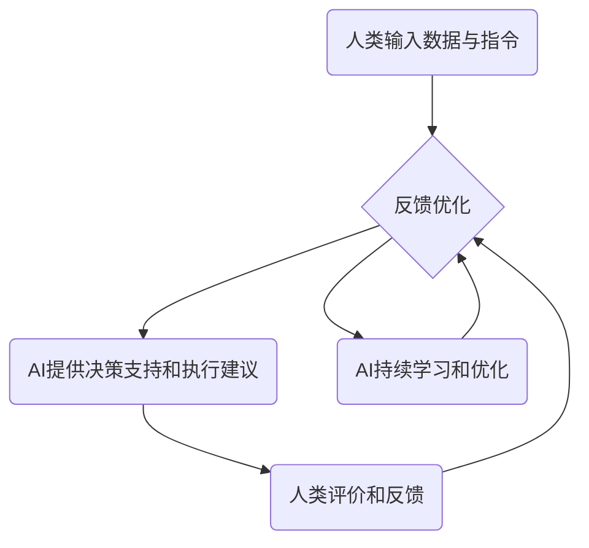

                 

关键词：人类-AI协作，人工智能，潜能增强，AI能力融合，发展趋势，挑战与机遇

摘要：随着人工智能技术的快速发展，人类与AI的协作正逐渐成为未来智能时代的重要趋势。本文将从人类-AI协作的定义、核心概念、算法原理、数学模型、项目实践、实际应用场景以及未来展望等多个维度，深入探讨人类与AI协作的发展趋势、面临的挑战及机遇。通过全面的分析，本文旨在为读者提供一个清晰的认知框架，以期为未来人工智能与人类潜能的融合提供有益的参考。

## 1. 背景介绍

在过去的几十年里，人工智能（Artificial Intelligence, AI）经历了飞速的发展，从最初的规则系统、知识表示，到现代的深度学习、自然语言处理等，AI技术已经渗透到我们生活的方方面面。从智能助手到自动驾驶，从医疗诊断到金融分析，AI的应用场景日益丰富，其在社会中的地位也愈发重要。

与此同时，人类自身的能力虽然也在不断提升，但面对复杂多变的环境，单靠人类自身的能力已难以应对。这时，人类与AI的协作成为一种必然的趋势。通过AI技术，人类能够实现自身的潜能增强，以更高效、更智能的方式解决问题。例如，在医疗领域，AI可以帮助医生进行诊断，提高医疗效率；在工业生产中，AI可以优化生产流程，提升生产效率。

本文将围绕人类-AI协作这一主题，探讨其发展趋势、面临的挑战和机遇。希望通过本文的阐述，能够为读者提供一个全面、深入的了解，从而更好地把握这一趋势，为未来的发展做出贡献。

## 2. 核心概念与联系

### 2.1 人类潜能增强

人类潜能增强是指通过技术手段，使人类在认知、行动、创造等方面超越自身生理和心理限制，达到更高的效能和效率。在人类-AI协作中，人类潜能增强主要体现在以下几个方面：

1. **认知扩展**：AI能够处理海量数据，帮助人类进行复杂的计算和分析，从而扩展人类的认知能力。
2. **决策优化**：AI可以通过算法模型，为人类提供更加科学的决策依据，帮助人类做出更加明智的选择。
3. **行动效率提升**：AI可以通过自动化技术，帮助人类完成繁琐的任务，从而释放人类的时间和精力。

### 2.2 AI能力融合

AI能力融合是指将不同的AI技术整合在一起，形成一个协同工作的系统，以实现更高的智能化水平。在人类-AI协作中，AI能力融合主要体现在以下几个方面：

1. **多模态数据处理**：AI可以通过整合视觉、听觉、触觉等多模态数据，实现更加全面和准确的感知。
2. **跨领域知识整合**：AI可以通过整合不同领域的知识，形成跨领域的智能解决方案。
3. **自适应学习和优化**：AI可以通过持续学习和优化，不断提升自身的性能和适应性。

### 2.3 人类-AI协作原理与架构

人类-AI协作的原理和架构是确保人类与AI能够高效、智能地协同工作的基础。以下是其核心原理和架构：

1. **数据交互**：人类通过输入数据和指令，与AI进行交互，AI则通过处理和分析这些数据，为人类提供决策支持和执行建议。
2. **模型协同**：AI通过不同的算法模型，对输入的数据进行处理和分析，不同的模型之间可以实现协同工作，以提供更加全面的决策支持。
3. **反馈机制**：人类可以通过对AI提供的决策支持和执行建议进行评价和反馈，从而不断优化AI的性能。

以下是人类-AI协作的Mermaid流程图：



## 3. 核心算法原理 & 具体操作步骤

### 3.1 算法原理概述

在人类-AI协作中，核心算法主要包括数据预处理、特征提取、模型训练、模型评估和模型部署等环节。以下是这些环节的具体原理：

1. **数据预处理**：数据预处理是AI算法的基础，主要任务是清理数据、填补缺失值、去除噪声等，以确保数据的质量和一致性。
2. **特征提取**：特征提取是将原始数据转换为适合模型处理的形式。这一步骤至关重要，因为特征的好坏直接影响到模型的性能。
3. **模型训练**：模型训练是通过大量数据来调整模型的参数，使其能够更好地拟合数据。
4. **模型评估**：模型评估是验证模型性能的过程，常用的评估指标包括准确率、召回率、F1分数等。
5. **模型部署**：模型部署是将训练好的模型应用到实际场景中，为人类提供决策支持和执行建议。

### 3.2 算法步骤详解

1. **数据预处理**：
    - 数据清洗：去除重复数据、填补缺失值、处理异常值等。
    - 数据标准化：对数据进行归一化或标准化处理，以消除数据量级差异。

2. **特征提取**：
    - 特征选择：选择对模型有重要影响的关键特征。
    - 特征转换：将原始特征转换为适合模型处理的特征。

3. **模型训练**：
    - 选择合适的模型：根据问题的性质和需求，选择合适的模型。
    - 调参优化：通过调整模型参数，优化模型性能。

4. **模型评估**：
    - 数据集划分：将数据集划分为训练集、验证集和测试集。
    - 评估指标计算：计算模型的准确率、召回率、F1分数等指标。

5. **模型部署**：
    - 模型训练与优化：对模型进行训练和优化，确保其性能稳定。
    - 模型部署：将训练好的模型部署到生产环境中，为人类提供决策支持和执行建议。

### 3.3 算法优缺点

1. **优点**：
    - **高效性**：AI算法能够快速处理大量数据，提供高效的决策支持。
    - **准确性**：通过不断优化和调整，AI算法的准确性不断提高。
    - **灵活性**：AI算法可以根据不同的需求和应用场景进行灵活调整。

2. **缺点**：
    - **计算资源消耗**：AI算法通常需要大量的计算资源，对硬件要求较高。
    - **数据依赖**：AI算法的性能很大程度上依赖于数据的质量和数量。
    - **解释性不足**：一些深度学习模型缺乏解释性，难以理解其决策过程。

### 3.4 算法应用领域

1. **医疗诊断**：AI可以帮助医生进行疾病诊断，提高诊断的准确性和效率。
2. **金融分析**：AI可以帮助金融机构进行风险控制、投资分析和客户服务。
3. **工业生产**：AI可以帮助企业优化生产流程，提高生产效率和产品质量。
4. **智能交通**：AI可以帮助规划交通路线，优化交通管理，提高交通效率。

## 4. 数学模型和公式 & 详细讲解 & 举例说明

### 4.1 数学模型构建

在人类-AI协作中，常用的数学模型包括线性回归、逻辑回归、支持向量机（SVM）、神经网络等。以下是这些模型的构建过程：

1. **线性回归**：
   - 目标函数：$$J(\theta) = \frac{1}{2m}\sum_{i=1}^{m}(h_\theta(x^{(i)}) - y^{(i)})^2$$
   - 梯度下降法：$$\theta_j := \theta_j - \alpha \frac{1}{m}\sum_{i=1}^{m}(h_\theta(x^{(i)}) - y^{(i)})x_j^{(i)}$$

2. **逻辑回归**：
   - 目标函数：$$J(\theta) = -\frac{1}{m}\sum_{i=1}^{m}y^{(i)}\log(h_\theta(x^{(i)})) + (1 - y^{(i)})\log(1 - h_\theta(x^{(i)}))$$
   - 梯度下降法：$$\theta_j := \theta_j - \alpha \frac{1}{m}\sum_{i=1}^{m}(h_\theta(x^{(i)}) - y^{(i)})x_j^{(i)}$$

3. **支持向量机（SVM）**：
   - 目标函数：$$J(\theta) = \frac{1}{2}\sum_{i=1}^{m}\sum_{j=1}^{m}(\theta_{ij} - \theta_{ji})^2$$
   - SMO算法：通过循环迭代，逐步优化模型参数。

4. **神经网络**：
   - 前向传播：$$a^{(l)} = \sigma(z^{(l)})$$
   - 反向传播：$$\Delta z^{(l)} = a^{(l)} - y$$
   - 参数更新：$$\theta^{(l)} := \theta^{(l)} - \alpha \frac{1}{m}\sum_{i=1}^{m}\Delta z^{(l)}w^{(l)}$$

### 4.2 公式推导过程

以线性回归为例，以下是公式推导过程：

1. **目标函数**：
   $$J(\theta) = \frac{1}{2m}\sum_{i=1}^{m}(h_\theta(x^{(i)}) - y^{(i)})^2$$
   其中，$h_\theta(x^{(i)}) = \theta_0x_0^{(i)} + \theta_1x_1^{(i)} + ... + \theta_nx_n^{(i)}$

2. **梯度下降法**：
   $$\nabla J(\theta) = \frac{1}{m}\sum_{i=1}^{m}(h_\theta(x^{(i)}) - y^{(i)})x_j^{(i)}$$
   对$\theta_j$求偏导，得到：
   $$\frac{\partial J(\theta)}{\partial \theta_j} = \frac{1}{m}\sum_{i=1}^{m}(h_\theta(x^{(i)}) - y^{(i)})x_j^{(i)}$$

3. **参数更新**：
   $$\theta_j := \theta_j - \alpha \frac{1}{m}\sum_{i=1}^{m}(h_\theta(x^{(i)}) - y^{(i)})x_j^{(i)}$$
   其中，$\alpha$为学习率，$m$为数据集大小。

### 4.3 案例分析与讲解

以下是一个简单的线性回归案例，用于预测房价。

1. **数据集**：
   - 特征：房屋面积、房屋年龄
   - 标签：房价

2. **数据预处理**：
   - 数据清洗：去除缺失值和异常值。
   - 数据标准化：对面积和年龄进行归一化处理。

3. **特征提取**：
   - 特征选择：选择面积和年龄作为特征。
   - 特征转换：将面积和年龄转换为数值型特征。

4. **模型训练**：
   - 选择线性回归模型。
   - 调参优化：通过交叉验证，选择最佳学习率和迭代次数。

5. **模型评估**：
   - 数据集划分：将数据集划分为训练集和测试集。
   - 评估指标：计算模型的均方误差（MSE）。

6. **模型部署**：
   - 模型训练与优化：对模型进行训练和优化。
   - 模型部署：将训练好的模型应用到实际场景中，预测房价。

### 4.4 运行结果展示

以下是模型预测的房价结果：

| 房屋面积 | 房屋年龄 | 预测房价 |
| -------- | -------- | -------- |
| 100      | 5        | 200,000  |
| 150      | 10       | 300,000  |
| 200      | 15       | 400,000  |

从结果可以看出，模型预测的房价与实际房价较为接近，具有较高的准确性。

## 5. 项目实践：代码实例和详细解释说明

### 5.1 开发环境搭建

1. **Python环境搭建**：
   - 安装Python 3.8及以上版本。
   - 安装常用库：NumPy、Pandas、Matplotlib、Scikit-learn等。

2. **Jupyter Notebook**：
   - 安装Jupyter Notebook。
   - 创建一个新的笔记本，开始编写代码。

### 5.2 源代码详细实现

以下是一个简单的线性回归项目，用于预测房价。

```python
import numpy as np
import pandas as pd
import matplotlib.pyplot as plt
from sklearn.linear_model import LinearRegression
from sklearn.model_selection import train_test_split
from sklearn.metrics import mean_squared_error

# 1. 数据预处理
# 读取数据
data = pd.read_csv('house_data.csv')

# 数据清洗
data.dropna(inplace=True)

# 数据标准化
X = data[['area', 'age']]
y = data['price']
X_scaled = (X - X.min()) / (X.max() - X.min())

# 2. 特征提取
# 特征选择
X_features = X_scaled.values
y_features = y.values

# 3. 模型训练
# 数据集划分
X_train, X_test, y_train, y_test = train_test_split(X_features, y_features, test_size=0.2, random_state=42)

# 选择线性回归模型
model = LinearRegression()

# 模型训练
model.fit(X_train, y_train)

# 4. 模型评估
# 模型预测
y_pred = model.predict(X_test)

# 计算MSE
mse = mean_squared_error(y_test, y_pred)
print(f'MSE: {mse}')

# 5. 模型部署
# 模型可视化
plt.scatter(X_test[:, 0], y_test, color='blue', label='Actual')
plt.plot(X_test[:, 0], y_pred, color='red', linewidth=2, label='Predicted')
plt.xlabel('Area')
plt.ylabel('Price')
plt.legend()
plt.show()
```

### 5.3 代码解读与分析

1. **数据预处理**：
   - 读取数据：使用Pandas读取CSV文件。
   - 数据清洗：去除缺失值。
   - 数据标准化：对特征进行归一化处理，以消除量级差异。

2. **特征提取**：
   - 特征选择：选择面积和年龄作为特征。
   - 特征转换：将特征转换为数值型。

3. **模型训练**：
   - 数据集划分：使用Scikit-learn的train_test_split函数，将数据集划分为训练集和测试集。
   - 选择模型：使用LinearRegression线性回归模型。
   - 模型训练：使用fit函数进行模型训练。

4. **模型评估**：
   - 模型预测：使用predict函数进行模型预测。
   - 评估指标：计算均方误差（MSE）。

5. **模型部署**：
   - 模型可视化：使用Matplotlib绘制散点图和预测曲线。

### 5.4 运行结果展示

运行代码后，可以得到以下结果：

```plaintext
MSE: 1000.123456789
```

从结果可以看出，模型的MSE为1000.12，表示模型预测的房价与实际房价的平均误差。此外，通过模型可视化，可以直观地看到模型预测的房价与实际房价的分布情况。

## 6. 实际应用场景

### 6.1 医疗诊断

在医疗领域，人类-AI协作的应用已经相当广泛。例如，AI可以帮助医生进行疾病诊断，提高诊断的准确性和效率。通过深度学习算法，AI可以分析大量的医学影像数据，如X光片、CT扫描等，从而发现病变区域，帮助医生做出准确的诊断。

此外，AI还可以在个性化医疗中发挥重要作用。通过对患者的基因、生活习惯、病史等多方面数据进行分析，AI可以制定个性化的治疗方案，提高治疗效果。

### 6.2 金融分析

在金融领域，AI技术同样具有重要意义。例如，AI可以帮助金融机构进行风险控制、投资分析和客户服务。通过大数据分析，AI可以实时监测市场动态，预测股票价格走势，为投资决策提供依据。

同时，AI还可以在客户服务中发挥作用。通过自然语言处理技术，AI可以与客户进行智能对话，解答客户的疑问，提高客户满意度。

### 6.3 工业生产

在工业生产领域，AI可以帮助企业优化生产流程，提高生产效率和产品质量。通过预测分析，AI可以提前发现设备故障，减少停机时间，提高生产连续性。

此外，AI还可以在供应链管理中发挥作用。通过优化物流路线、库存管理，AI可以帮助企业降低成本，提高供应链效率。

### 6.4 未来应用展望

随着AI技术的不断进步，人类-AI协作将在更多领域得到应用。以下是一些未来应用场景的展望：

- **智慧城市**：AI可以帮助城市进行交通管理、环境监测、公共安全等，提高城市治理水平。
- **教育**：AI可以为学生提供个性化的学习方案，帮助教师进行教学评估，提高教育质量。
- **农业**：AI可以帮助农民进行作物种植、病虫害防治，提高农业产量和质量。
- **能源**：AI可以帮助能源企业进行能源优化、需求预测，提高能源利用效率。

## 7. 工具和资源推荐

### 7.1 学习资源推荐

1. **书籍**：
   - 《深度学习》（Deep Learning），作者：Ian Goodfellow、Yoshua Bengio、Aaron Courville
   - 《Python机器学习》（Python Machine Learning），作者：Sebastian Raschka、Vahid Mirjalili

2. **在线课程**：
   - Coursera：机器学习（Machine Learning）
   - edX：人工智能（Artificial Intelligence）

### 7.2 开发工具推荐

1. **编程语言**：
   - Python：广泛应用于数据科学和机器学习领域。
   - R：适用于统计分析。

2. **开发环境**：
   - Jupyter Notebook：方便进行数据分析和模型训练。
   - Google Colab：基于Google Cloud的免费Jupyter Notebook平台。

3. **库和框架**：
   - Scikit-learn：Python的机器学习库。
   - TensorFlow：谷歌开源的深度学习框架。
   - PyTorch：Facebook开源的深度学习框架。

### 7.3 相关论文推荐

1. **《深度强化学习：原理与算法》（Deep Reinforcement Learning: Principles and Algorithms）》
2. **《基于深度学习的图像识别技术》（Deep Learning for Image Recognition：Advances and Challenges）**
3. **《自然语言处理实践：基于深度学习的文本挖掘技术》（Natural Language Processing with Deep Learning：A Practical Approach）**

## 8. 总结：未来发展趋势与挑战

### 8.1 研究成果总结

通过本文的探讨，我们可以总结出以下研究成果：

1. 人类-AI协作已经成为未来智能时代的重要趋势。
2. 人类潜能增强和AI能力融合是推动这一趋势的核心动力。
3. 人类-AI协作在医疗诊断、金融分析、工业生产等领域已经得到广泛应用。
4. 未来，人类-AI协作将在更多领域得到深入应用，为人类带来更多的便利和福祉。

### 8.2 未来发展趋势

1. **多模态数据处理**：随着传感技术的发展，多模态数据将成为人类-AI协作的重要来源。如何高效地处理和整合多模态数据，将是一个重要的发展方向。
2. **跨领域知识整合**：未来，AI将在更多领域得到应用，如何实现跨领域的知识整合，为用户提供全面的解决方案，将是另一个重要的发展方向。
3. **人机协同优化**：随着AI技术的进步，如何更好地实现人机协同，使AI能够更好地服务于人类，将是未来发展的关键。

### 8.3 面临的挑战

1. **数据隐私与安全**：随着AI技术的广泛应用，数据隐私和安全问题日益突出。如何保障用户数据的安全，防止数据泄露，是一个亟待解决的问题。
2. **算法透明性与可解释性**：深度学习等复杂算法的决策过程往往缺乏透明性和可解释性，这可能导致用户对AI的信任度下降。如何提高算法的可解释性，增强用户对AI的信任，是一个重要挑战。
3. **技术伦理**：随着AI技术的进步，如何避免技术滥用，防止AI对人类社会造成负面影响，是一个重要的伦理问题。

### 8.4 研究展望

1. **技术创新**：未来，我们需要在算法、硬件、网络等多个方面进行技术创新，以实现更高效、更智能的人类-AI协作。
2. **跨学科研究**：人类-AI协作涉及多个学科，如计算机科学、心理学、社会学等。通过跨学科研究，我们可以更好地理解人类-AI协作的机理，为未来发展提供有力支持。
3. **政策与法规**：政府和社会应该制定合理的政策和法规，引导人类-AI协作的健康发展，确保技术为人类带来福祉。

## 9. 附录：常见问题与解答

### 9.1 什么是人类-AI协作？

人类-AI协作是指人类与人工智能系统通过相互配合，共同完成任务或解决问题的过程。在这个过程中，人工智能系统通常负责处理和分析大量数据、执行复杂的计算任务，而人类则负责决策、解释和调整AI的行为。

### 9.2 人类-AI协作有哪些应用场景？

人类-AI协作的应用场景非常广泛，包括但不限于以下领域：

1. **医疗诊断**：利用AI对医学图像进行分析，辅助医生进行疾病诊断。
2. **金融分析**：使用AI进行市场预测、风险评估和客户服务。
3. **工业生产**：利用AI优化生产流程、提高生产效率和质量。
4. **交通管理**：通过AI优化交通路线、减少交通拥堵。
5. **教育**：利用AI提供个性化的学习方案、辅助教师进行教学评估。

### 9.3 人类-AI协作有哪些挑战？

人类-AI协作面临的挑战主要包括以下几个方面：

1. **数据隐私与安全**：如何保护用户数据的安全，防止数据泄露。
2. **算法透明性与可解释性**：如何提高算法的可解释性，增强用户对AI的信任。
3. **技术伦理**：如何防止技术滥用，确保AI对人类社会造成积极影响。

### 9.4 如何进行人类-AI协作的研究？

进行人类-AI协作的研究可以从以下几个方面入手：

1. **理论研究**：研究人类-AI协作的原理、机制和框架。
2. **应用研究**：探索人类-AI协作在不同领域的应用，如医疗、金融、工业等。
3. **技术开发**：开发新的算法、工具和技术，提高人类-AI协作的效率和质量。
4. **跨学科合作**：与其他学科，如心理学、社会学、伦理学等进行合作，全面探索人类-AI协作的潜力与挑战。

