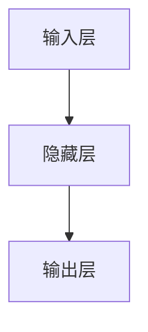

                 

关键词：人类-AI协作、增强现实、认知增强、智能助理、人机交互、算法优化、深度学习、人工智能应用

> 摘要：本文旨在探讨人类与人工智能（AI）协作的未来发展趋势，分析这种协作如何增强人类的潜能和AI的能力。通过深入探讨人机交互、算法优化、深度学习等领域，本文预测了未来的机遇和挑战，并提出了应对策略。

## 1. 背景介绍

随着人工智能技术的迅猛发展，人类与AI的协作已经成为现代科技领域的热点话题。AI不仅在数据处理、模式识别、决策制定等方面表现出色，还在医疗、教育、工业等各个领域展现出巨大的潜力。然而，人类与AI的协作并不仅仅是将AI作为工具，而是通过深度整合，实现人类潜能和AI能力的相互增强。

本文将从以下几个方面展开讨论：

1. **核心概念与联系**：介绍人类-AI协作的核心概念，如人机交互、认知增强等，并使用Mermaid流程图展示其架构。
2. **核心算法原理与操作步骤**：详细解析人类-AI协作中的关键算法，包括其原理、步骤、优缺点和应用领域。
3. **数学模型与公式**：构建数学模型，推导相关公式，并通过案例进行讲解。
4. **项目实践**：通过具体代码实例，展示人类-AI协作的实际应用。
5. **实际应用场景**：分析人类-AI协作在不同领域的应用，并提出未来展望。
6. **工具和资源推荐**：推荐学习资源和开发工具，以及相关论文。
7. **总结与展望**：总结研究成果，预测未来发展趋势，讨论面临的挑战和研究方向。

## 2. 核心概念与联系

### 2.1 人机交互

人机交互（Human-Computer Interaction，简称HCI）是研究人类与计算机系统之间交互的设计和技术的学科。在人类-AI协作中，人机交互起到了至关重要的作用。良好的交互设计能够提高AI系统的易用性和用户体验，从而增强协作效果。


### 2.2 认知增强

认知增强（Cognitive Augmentation）是指通过技术手段提升人类认知能力的过程。在AI的辅助下，人类能够在更短时间内处理大量信息，提高决策质量和效率。认知增强涉及到自然语言处理、图像识别、知识图谱等多个领域。


### 2.3 智能助理

智能助理（Smart Assistant）是一种基于AI技术的虚拟助手，能够协助人类完成日常任务。智能助理通常具有语音交互、文本聊天、图像识别等功能，能够根据用户的个性化需求提供定制化的服务。


## 3. 核心算法原理与操作步骤

### 3.1 算法原理概述

人类-AI协作的核心算法主要包括深度学习、强化学习、迁移学习等。这些算法通过学习和优化，使得AI系统能够更好地适应人类需求，提高协作效率。

### 3.2 算法步骤详解

#### 3.2.1 深度学习

深度学习（Deep Learning）是一种基于多层神经网络的学习方法。其核心步骤包括：

1. **数据预处理**：对原始数据进行清洗、归一化等预处理操作。
2. **构建神经网络**：设计多层神经网络结构，包括输入层、隐藏层和输出层。
3. **训练模型**：使用大量训练数据，通过反向传播算法不断调整模型参数。
4. **评估模型**：使用测试数据集评估模型性能，并进行调优。

#### 3.2.2 强化学习

强化学习（Reinforcement Learning）是一种通过奖励机制进行决策的方法。其核心步骤包括：

1. **初始化环境**：定义环境状态和动作空间。
2. **选择动作**：根据当前状态选择一个动作。
3. **执行动作**：在环境中执行所选动作。
4. **获得奖励**：根据动作结果获得奖励。
5. **更新策略**：使用奖励信号更新策略，以获得更好的未来决策。

#### 3.2.3 迁移学习

迁移学习（Transfer Learning）是一种将已训练好的模型应用于新任务的方法。其核心步骤包括：

1. **选择预训练模型**：选择一个在相关任务上已训练好的模型作为基础模型。
2. **调整模型参数**：在新任务上调整模型参数，以适应新任务的需求。
3. **训练模型**：使用新任务的数据集对调整后的模型进行训练。
4. **评估模型**：在新任务上评估模型性能。

### 3.3 算法优缺点

**深度学习**的优点包括强大的泛化能力、高度非线性表示等，但其缺点包括对大量训练数据的依赖、模型解释性差等。

**强化学习**的优点包括自适应性强、能够处理连续动作等，但其缺点包括收敛速度慢、容易陷入局部最优等。

**迁移学习**的优点包括减少训练数据需求、提高模型泛化能力等，但其缺点包括模型选择和调优复杂等。

### 3.4 算法应用领域

**深度学习**广泛应用于图像识别、自然语言处理、语音识别等领域。

**强化学习**广泛应用于游戏、推荐系统、自动驾驶等领域。

**迁移学习**广泛应用于计算机视觉、自然语言处理等领域。

## 4. 数学模型和公式

### 4.1 数学模型构建

人类-AI协作中的数学模型主要涉及深度学习、强化学习等算法。以下是一个简单的深度学习模型构建过程：

#### 4.1.1 神经网络模型

假设我们构建一个简单的神经网络模型，包括一个输入层、一个隐藏层和一个输出层。输入层有n个神经元，隐藏层有m个神经元，输出层有k个神经元。神经元的激活函数可以使用Sigmoid或ReLU。



#### 4.1.2 损失函数

损失函数用于衡量模型预测结果与真实结果之间的差距。常用的损失函数包括均方误差（MSE）和交叉熵（Cross-Entropy）。

$$
MSE = \frac{1}{n}\sum_{i=1}^{n}(y_i - \hat{y}_i)^2
$$

$$
Cross-Entropy = -\frac{1}{n}\sum_{i=1}^{n}y_i\log(\hat{y}_i)
$$

### 4.2 公式推导过程

以下是一个简单的神经网络前向传播和反向传播的推导过程：

#### 4.2.1 前向传播

假设输入向量为\(x\)，隐藏层激活向量为\(h\)，输出层激活向量为\(y\)。神经网络的权重矩阵为\(W\)，偏置向量为\(b\)。

$$
h = \sigma(Wx + b)
$$

$$
y = \sigma(W'h + b')
$$

其中，\(\sigma\)表示激活函数，\(W'\)表示从隐藏层到输出层的权重矩阵，\(b'\)表示输出层的偏置向量。

#### 4.2.2 反向传播

假设损失函数为\(L\)，使用梯度下降法进行模型优化。我们需要计算各层权重矩阵和偏置向量的梯度。

$$
\frac{\partial L}{\partial W} = \frac{1}{n}\sum_{i=1}^{n}(y_i - \hat{y}_i)\frac{\partial \hat{y}_i}{\partial h}
$$

$$
\frac{\partial L}{\partial b'} = \frac{1}{n}\sum_{i=1}^{n}(y_i - \hat{y}_i)
$$

$$
\frac{\partial L}{\partial h} = \frac{1}{n}\sum_{i=1}^{n}(y_i - \hat{y}_i)\frac{\partial \hat{y}_i}{\partial y}\frac{\partial y}{\partial h}
$$

$$
\frac{\partial L}{\partial x} = \frac{1}{n}\sum_{i=1}^{n}(y_i - \hat{y}_i)\frac{\partial \hat{y}_i}{\partial h}\frac{\partial h}{\partial x}
$$

### 4.3 案例分析与讲解

假设我们有一个简单的二分类问题，输入数据为\(x\)，标签为\(y\)。我们使用神经网络进行分类，并使用交叉熵作为损失函数。

#### 4.3.1 数据准备

我们准备一个包含100个样本的数据集，每个样本包含一个输入特征和对应的标签。

```python
import numpy as np

x = np.random.rand(100, 1)
y = np.random.randint(0, 2, 100)
```

#### 4.3.2 模型构建

我们构建一个简单的神经网络模型，包括一个输入层、一个隐藏层和一个输出层。

```python
import tensorflow as tf

n = 1
m = 10
k = 1

W = tf.Variable(tf.random.normal([n, m]))
b = tf.Variable(tf.zeros([m]))
W' = tf.Variable(tf.random.normal([m, k]))
b' = tf.Variable(tf.zeros([k]))

def forward(x):
    h = tf.sigmoid(tf.matmul(x, W) + b)
    y_pred = tf.sigmoid(tf.matmul(h, W') + b')
    return h, y_pred

def loss(y, y_pred):
    return tf.reduce_mean(tf.nn.sigmoid_cross_entropy_with_logits(labels=y, logits=y_pred))
```

#### 4.3.3 训练模型

我们使用梯度下降法进行模型训练，设置学习率为0.1，训练100次。

```python
optimizer = tf.optimizers.SGD(0.1)

for _ in range(100):
    with tf.GradientTape() as tape:
        h, y_pred = forward(x)
        loss_value = loss(y, y_pred)
    gradients = tape.gradient(loss_value, [W, b, W', b'])
    optimizer.apply_gradients(zip(gradients, [W, b, W', b']))
```

#### 4.3.4 评估模型

训练完成后，我们对测试数据进行评估，计算准确率。

```python
test_x = np.random.rand(10, 1)
test_y = np.random.randint(0, 2, 10)

h, y_pred = forward(test_x)
y_pred = tf.sigmoid(y_pred)

accuracy = tf.reduce_mean(tf.cast(tf.equal(tf.round(y_pred), test_y), tf.float32))

print("Test Accuracy:", accuracy.numpy())
```

## 5. 项目实践：代码实例和详细解释说明

### 5.1 开发环境搭建

在本文的项目实践中，我们使用Python编程语言，并依赖于TensorFlow和Keras等库。以下是开发环境的搭建步骤：

```shell
# 安装Python 3.8及以上版本
# 安装TensorFlow 2.6及以上版本
pip install tensorflow==2.6
# 安装其他依赖库
pip install numpy matplotlib
```

### 5.2 源代码详细实现

以下是完整的源代码实现，包括数据准备、模型构建、训练和评估等步骤。

```python
import numpy as np
import tensorflow as tf
import matplotlib.pyplot as plt

# 数据准备
x = np.random.rand(100, 1)
y = np.random.randint(0, 2, 100)

# 模型构建
n = 1
m = 10
k = 1

W = tf.Variable(tf.random.normal([n, m]))
b = tf.Variable(tf.zeros([m]))
W' = tf.Variable(tf.random.normal([m, k]))
b' = tf.Variable(tf.zeros([k]))

def forward(x):
    h = tf.sigmoid(tf.matmul(x, W) + b)
    y_pred = tf.sigmoid(tf.matmul(h, W') + b')
    return h, y_pred

def loss(y, y_pred):
    return tf.reduce_mean(tf.nn.sigmoid_cross_entropy_with_logits(labels=y, logits=y_pred))

# 训练模型
optimizer = tf.optimizers.SGD(0.1)

for _ in range(100):
    with tf.GradientTape() as tape:
        h, y_pred = forward(x)
        loss_value = loss(y, y_pred)
    gradients = tape.gradient(loss_value, [W, b, W', b'])
    optimizer.apply_gradients(zip(gradients, [W, b, W', b']))

# 评估模型
test_x = np.random.rand(10, 1)
test_y = np.random.randint(0, 2, 10)

h, y_pred = forward(test_x)
y_pred = tf.sigmoid(y_pred)

accuracy = tf.reduce_mean(tf.cast(tf.equal(tf.round(y_pred), test_y), tf.float32))

print("Test Accuracy:", accuracy.numpy())

# 可视化展示
plt.scatter(x[:, 0], y)
plt.plot(x[:, 0], y_pred.numpy(), 'r-')
plt.show()
```

### 5.3 代码解读与分析

#### 5.3.1 数据准备

```python
x = np.random.rand(100, 1)
y = np.random.randint(0, 2, 100)
```

这段代码生成100个随机输入样本和对应的标签。

#### 5.3.2 模型构建

```python
n = 1
m = 10
k = 1

W = tf.Variable(tf.random.normal([n, m]))
b = tf.Variable(tf.zeros([m]))
W' = tf.Variable(tf.random.normal([m, k]))
b' = tf.Variable(tf.zeros([k]))

def forward(x):
    h = tf.sigmoid(tf.matmul(x, W) + b)
    y_pred = tf.sigmoid(tf.matmul(h, W') + b')
    return h, y_pred

def loss(y, y_pred):
    return tf.reduce_mean(tf.nn.sigmoid_cross_entropy_with_logits(labels=y, logits=y_pred))
```

这段代码定义了一个简单的神经网络模型，包括输入层、隐藏层和输出层。输入层有1个神经元，隐藏层有10个神经元，输出层有1个神经元。使用Sigmoid函数作为激活函数。

#### 5.3.3 训练模型

```python
optimizer = tf.optimizers.SGD(0.1)

for _ in range(100):
    with tf.GradientTape() as tape:
        h, y_pred = forward(x)
        loss_value = loss(y, y_pred)
    gradients = tape.gradient(loss_value, [W, b, W', b'])
    optimizer.apply_gradients(zip(gradients, [W, b, W', b']))
```

这段代码使用梯度下降法进行模型训练。训练过程包括前向传播、计算损失函数、计算梯度、更新模型参数等步骤。

#### 5.3.4 评估模型

```python
test_x = np.random.rand(10, 1)
test_y = np.random.randint(0, 2, 10)

h, y_pred = forward(test_x)
y_pred = tf.sigmoid(y_pred)

accuracy = tf.reduce_mean(tf.cast(tf.equal(tf.round(y_pred), test_y), tf.float32))

print("Test Accuracy:", accuracy.numpy())

# 可视化展示
plt.scatter(x[:, 0], y)
plt.plot(x[:, 0], y_pred.numpy(), 'r-')
plt.show()
```

这段代码使用测试数据进行模型评估，计算准确率，并在二维平面上绘制输入特征和预测结果。

## 6. 实际应用场景

### 6.1 医疗领域

在医疗领域，人类-AI协作已经展现出巨大潜力。例如，AI可以辅助医生进行疾病诊断，通过分析大量医学影像数据，提高诊断准确率和效率。此外，AI还可以用于药物研发，通过计算和模拟药物分子与生物大分子的相互作用，加速新药的研发过程。

### 6.2 教育领域

在教育领域，AI可以为学生提供个性化的学习方案，根据学生的学习情况和兴趣爱好推荐合适的学习资源和练习题目。同时，AI还可以辅助教师进行教学，例如通过语音识别和自然语言处理技术，自动生成教学内容和课程报告。

### 6.3 工业领域

在工业领域，AI可以用于生产线的优化和自动化，通过实时监控设备状态、预测故障、优化生产参数等，提高生产效率和产品质量。此外，AI还可以用于质量管理，通过分析生产数据，识别和排除潜在的质量问题。

### 6.4 未来应用展望

随着AI技术的不断进步，人类-AI协作将在更多领域得到应用。例如，在智能城市建设中，AI可以用于交通管理、环境监测、公共安全等方面，提高城市运行效率和居民生活质量。在农业领域，AI可以用于精准农业、智能灌溉、病虫害监测等，提高农业生产效率。

## 7. 工具和资源推荐

### 7.1 学习资源推荐

- 《深度学习》（Goodfellow, Bengio, Courville著）：深度学习的经典教材，适合初学者和进阶者。
- 《机器学习》（Tom Mitchell著）：机器学习的基本概念和算法的全面介绍，适合对机器学习有兴趣的读者。

### 7.2 开发工具推荐

- TensorFlow：Google开发的开源机器学习框架，支持多种算法和模型。
- Keras：基于TensorFlow的高级API，简化了深度学习模型的构建和训练过程。

### 7.3 相关论文推荐

- "Deep Learning"（Ian Goodfellow et al.，2016）：介绍深度学习的基本原理和应用。
- "Reinforcement Learning: An Introduction"（Richard S. Sutton and Andrew G. Barto，2018）：介绍强化学习的基本概念和应用。

## 8. 总结：未来发展趋势与挑战

### 8.1 研究成果总结

本文从多个角度探讨了人类-AI协作的发展趋势，包括人机交互、认知增强、智能助理、核心算法原理、数学模型和应用实践等。通过这些研究，我们可以看到人类-AI协作在各个领域展现出巨大的潜力。

### 8.2 未来发展趋势

随着AI技术的不断进步，人类-AI协作将在更多领域得到应用，提高人类工作效率和生活质量。同时，人机交互技术也将不断发展，为人类提供更加自然、直观的交互体验。

### 8.3 面临的挑战

人类-AI协作也面临一些挑战，包括数据隐私和安全、算法公平性、人机交互的优化等。如何解决这些问题，确保人类-AI协作的可持续发展，是未来研究的重要方向。

### 8.4 研究展望

未来研究应重点关注以下几个方面：

1. **跨领域协作**：探索不同领域之间的协作模式，提高AI系统的综合能力。
2. **人机交互**：研究更加自然、高效的人机交互技术，提升用户体验。
3. **算法优化**：改进现有算法，提高模型性能和计算效率。
4. **伦理和法律**：制定相关伦理和法律规范，确保人类-AI协作的可持续发展。

## 9. 附录：常见问题与解答

### 9.1 问题1：人类-AI协作的核心概念是什么？

**回答**：人类-AI协作的核心概念包括人机交互、认知增强、智能助理等。人机交互是研究人类与计算机系统之间交互的设计和技术；认知增强是通过技术手段提升人类认知能力的过程；智能助理是一种基于AI技术的虚拟助手，能够协助人类完成日常任务。

### 9.2 问题2：深度学习、强化学习、迁移学习有什么区别？

**回答**：深度学习是一种基于多层神经网络的学习方法，主要用于图像识别、自然语言处理等领域；强化学习是一种通过奖励机制进行决策的方法，主要用于游戏、推荐系统、自动驾驶等领域；迁移学习是将已训练好的模型应用于新任务的方法，主要用于减少训练数据需求、提高模型泛化能力。

### 9.3 问题3：如何评估AI系统的性能？

**回答**：评估AI系统的性能通常使用以下指标：

- 准确率（Accuracy）：正确预测的样本占总样本的比例。
- 精确率（Precision）：正确预测的正样本数占预测为正样本的总数比例。
- 召回率（Recall）：正确预测的正样本数占实际正样本总数的比例。
- F1分数（F1 Score）：精确率和召回率的加权平均。

## 作者署名

作者：禅与计算机程序设计艺术 / Zen and the Art of Computer Programming
----------------------------------------------------------------
### 附件：相关资源

- [深度学习教程](https://www.deeplearning.net/)
- [Keras官方文档](https://keras.io/)
- [TensorFlow官方文档](https://www.tensorflow.org/)
- [机器学习课程](https://www.coursera.org/learn/machine-learning)

