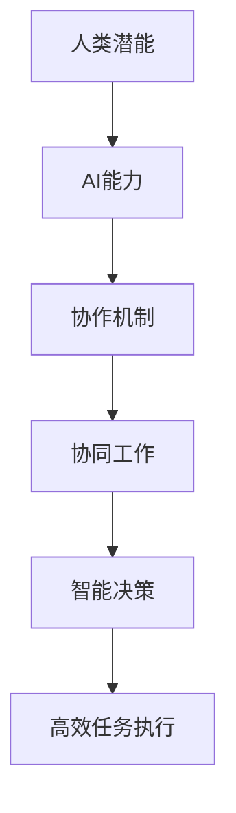

                 

关键词：人类-AI协作、增强人类潜能、AI能力、融合发展趋势、预测分析、机遇、趋势分析、预测

摘要：随着人工智能技术的飞速发展，人类与AI的协作已成为现代科技领域的一个重要趋势。本文旨在深入探讨人类-AI协作的现状、发展趋势、机遇与挑战，并预测未来融合发展的前景。

## 1. 背景介绍

随着计算能力的提升和大数据的普及，人工智能（AI）技术取得了突破性进展。深度学习、自然语言处理、计算机视觉等领域的突破使得AI在各个行业中发挥着越来越重要的作用。与此同时，人类对于效率和生产力提升的需求也越来越强烈。因此，人类与AI的协作成为了一种必然趋势。

人类-AI协作的核心理念是通过结合人类的创造力和判断力与AI的计算能力和处理速度，实现更高效、更智能的决策和任务执行。这种协作不仅能够提升个体的工作能力，还能够推动整个社会的发展。

## 2. 核心概念与联系

在探讨人类-AI协作时，我们需要明确几个核心概念：

- **人类潜能**：指人类在智力、创造力、判断力等方面的潜在能力。
- **AI能力**：指人工智能系统在数据处理、模式识别、决策支持等方面的能力。
- **协作机制**：指人类与AI之间如何相互作用、协同工作的方法和机制。

下面是核心概念原理和架构的Mermaid流程图：



## 3. 核心算法原理 & 具体操作步骤

### 3.1 算法原理概述

人类-AI协作的算法原理可以概括为以下几个步骤：

1. **数据收集**：从各种来源收集与任务相关的数据。
2. **数据处理**：对收集到的数据进行分析和处理，提取有用的信息。
3. **模型构建**：基于处理后的数据构建AI模型。
4. **交互协作**：人类与AI通过交互进行决策和任务执行。
5. **反馈调整**：根据任务执行结果对AI模型进行调整优化。

### 3.2 算法步骤详解

#### 步骤1：数据收集

在这一步骤中，数据可以是结构化的（如数据库）或非结构化的（如图像、文本）。数据的质量和数量直接影响后续处理的效果。

#### 步骤2：数据处理

数据收集后，需要进行清洗、转换和特征提取等处理。这一步骤是确保数据质量的关键。

#### 步骤3：模型构建

基于处理后的数据，可以使用机器学习、深度学习等方法构建AI模型。模型的性能取决于数据的代表性和算法的选择。

#### 步骤4：交互协作

人类与AI通过交互界面进行沟通，AI提供决策支持和任务执行方案，人类根据实际情况进行判断和调整。

#### 步骤5：反馈调整

根据任务执行结果，对AI模型进行调整优化。这一步骤是确保AI模型不断适应环境和任务需求的关键。

### 3.3 算法优缺点

**优点**：

- 提高工作效率：AI可以快速处理大量数据，辅助人类进行决策。
- 减轻工作负担：AI可以承担一些重复性、繁琐的任务，减轻人类的工作负担。
- 提高决策质量：AI可以提供客观、科学的决策支持，减少主观偏见。

**缺点**：

- 数据质量和数量要求高：算法的性能受数据质量和数量的影响。
- 需要人类与AI之间的良好协作：人类需要了解AI的能力和局限性，进行有效的协作。
- 需要不断调整优化：随着环境和任务的变化，AI模型需要不断进行调整优化。

### 3.4 算法应用领域

人类-AI协作算法可以应用于各个领域，如：

- 金融：风险评估、投资决策、风险管理等。
- 医疗：疾病诊断、治疗方案推荐、医学研究等。
- 教育：个性化学习、课程设计、教育资源分配等。
- 工业：生产优化、设备维护、质量管理等。
- 交通：智能交通管理、自动驾驶、航班调度等。

## 4. 数学模型和公式 & 详细讲解 & 举例说明

### 4.1 数学模型构建

在人类-AI协作中，常用的数学模型包括线性回归、逻辑回归、神经网络等。这些模型可以用于预测、分类、决策等任务。

### 4.2 公式推导过程

以线性回归为例，其公式为：

\[ Y = \beta_0 + \beta_1X + \epsilon \]

其中，\( Y \) 是因变量，\( X \) 是自变量，\( \beta_0 \) 和 \( \beta_1 \) 是模型参数，\( \epsilon \) 是误差项。

### 4.3 案例分析与讲解

假设我们要预测某股票的未来价格，可以使用线性回归模型。首先，我们需要收集历史股票价格数据，然后进行数据预处理，最后构建并训练线性回归模型。

## 5. 项目实践：代码实例和详细解释说明

### 5.1 开发环境搭建

在Python环境中，我们可以使用Scikit-learn库进行线性回归模型的构建和训练。首先，确保安装了Python和Scikit-learn库。

### 5.2 源代码详细实现

```python
from sklearn.linear_model import LinearRegression
from sklearn.model_selection import train_test_split
from sklearn.metrics import mean_squared_error

# 导入数据
X, Y = load_data()

# 数据预处理
X_processed = preprocess_data(X)

# 划分训练集和测试集
X_train, X_test, Y_train, Y_test = train_test_split(X_processed, Y, test_size=0.2, random_state=42)

# 构建模型
model = LinearRegression()

# 训练模型
model.fit(X_train, Y_train)

# 预测
Y_pred = model.predict(X_test)

# 评估
mse = mean_squared_error(Y_test, Y_pred)
print("Mean Squared Error:", mse)
```

### 5.3 代码解读与分析

这段代码首先导入了所需的库，然后进行了数据加载和预处理。接下来，划分了训练集和测试集，并构建了线性回归模型。最后，进行了模型训练和预测，并评估了模型性能。

## 6. 实际应用场景

人类-AI协作在实际应用中具有广泛的前景。以下是一些典型的应用场景：

- **医疗领域**：AI可以帮助医生进行疾病诊断、治疗方案推荐和医学研究。
- **金融领域**：AI可以用于风险评估、投资决策和风险管理。
- **教育领域**：AI可以提供个性化学习、课程设计和教育资源分配。
- **工业领域**：AI可以用于生产优化、设备维护和质量管理。
- **交通领域**：AI可以用于智能交通管理、自动驾驶和航班调度。

## 7. 工具和资源推荐

为了更好地进行人类-AI协作的研究和实践，以下是一些建议的工具和资源：

- **工具**：
  - Python：一种流行的编程语言，支持多种AI算法的实现。
  - Scikit-learn：一个开源的机器学习库，提供了丰富的线性回归、逻辑回归等算法。
  - TensorFlow：一个开源的深度学习框架，支持构建和训练复杂的神经网络。

- **资源**：
  - 《深度学习》：一本经典的深度学习教材，适合初学者和专业人士。
  - Coursera：一个在线学习平台，提供了丰富的AI课程。
  - arXiv：一个学术预印本平台，提供了大量的AI相关论文。

## 8. 总结：未来发展趋势与挑战

### 8.1 研究成果总结

人类-AI协作的研究成果已经取得了显著进展。在医疗、金融、教育、工业和交通等领域，AI已经显示出巨大的潜力。然而，当前的研究仍然存在一些不足，如算法的可解释性、模型的泛化能力等。

### 8.2 未来发展趋势

未来，人类-AI协作将朝着以下几个方向发展：

- **个性化协作**：根据个体的特点和能力，提供更加个性化的协作服务。
- **自主决策**：提高AI的自主决策能力，减少对人类的依赖。
- **跨领域融合**：将AI技术与其他领域的技术相结合，推动跨领域的发展。
- **伦理与法律**：加强对AI伦理和法律的研究，确保人类-AI协作的合法性和道德性。

### 8.3 面临的挑战

尽管人类-AI协作具有广阔的发展前景，但仍然面临以下挑战：

- **数据隐私**：如何保护个人隐私，防止数据泄露。
- **算法透明性**：如何提高算法的可解释性，让人类更好地理解AI的决策过程。
- **模型可靠性**：如何确保模型的可靠性和稳定性，避免错误决策。
- **伦理与法律**：如何制定合适的伦理和法律框架，确保人类-AI协作的健康发展。

### 8.4 研究展望

在未来，人类-AI协作的研究将更加深入，涉及多个学科领域。通过不断探索和创新，我们有理由相信，人类-AI协作将为人类社会带来更多的价值。

## 9. 附录：常见问题与解答

### 问题1：人类-AI协作的算法如何保证模型的可靠性？

解答：为了保证模型的可靠性，可以采取以下措施：

- **数据质量控制**：确保数据的质量和完整性，避免模型因数据问题导致错误决策。
- **模型评估与优化**：使用多种评估指标对模型进行评估，并根据评估结果进行优化。
- **模型验证与测试**：在真实环境中对模型进行验证和测试，确保模型的稳定性和可靠性。

### 问题2：人类-AI协作是否会取代人类的工作？

解答：人类-AI协作的目的是提高工作效率和决策质量，而不是取代人类的工作。在许多领域，AI可以承担一些重复性、繁琐的任务，但需要人类的监督和决策。因此，人类-AI协作更可能是一种互补关系，而不是取代关系。

### 问题3：人类-AI协作的伦理和法律问题如何解决？

解答：解决人类-AI协作的伦理和法律问题需要多方面的努力：

- **制定伦理准则**：制定统一的伦理准则，规范AI的开发和使用。
- **法律监管**：加强对AI产品和服务的法律监管，确保合法合规。
- **公众参与**：鼓励公众参与讨论和制定相关法规，提高社会共识。

---

作者：禅与计算机程序设计艺术 / Zen and the Art of Computer Programming

以上是本文的完整内容，希望能够对您在人类-AI协作领域的研究和实践提供一些启示和帮助。在未来的研究中，让我们共同探索人类与AI协作的无限可能性。

