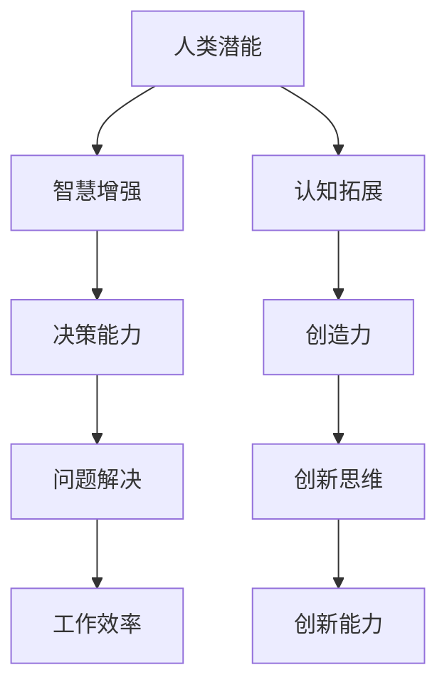

                 

关键词：人工智能、人类潜能、智慧增强、协同、认知拓展、技术进步

> 摘要：本文探讨了人工智能（AI）与人类协作的潜力，分析了如何通过AI技术增强人类的认知能力、决策能力和创造力，以及未来的发展趋势和面临的挑战。

## 1. 背景介绍

随着人工智能技术的飞速发展，我们开始进入一个全新的时代——人工智能时代。在这个时代，AI技术已经在诸多领域展现出强大的能力，从数据分析和预测到自然语言处理和图像识别，人工智能正在逐渐改变我们的生活方式和工作方式。然而，随着AI技术的普及和应用，一个重要的问题逐渐浮现：如何让人类与AI更加有效地协作，从而实现人类潜能的最大化？

人类和人工智能的协作不仅仅是技术层面的结合，更是一种思维方式的变革。人类拥有丰富的情感、智慧和创造力，而人工智能则具备强大的计算能力和处理数据的能力。两者的结合，将会产生前所未有的协同效应，推动人类文明向前迈进一大步。

## 2. 核心概念与联系

### 2.1. 人类潜能

人类潜能是指人类在生理、心理和智力上所能达到的极限。在认知领域，人类拥有独特的思考方式、解决问题的能力和创新思维。然而，传统的教育和生活方式往往限制了人类的潜能发挥。AI的介入，可以为我们提供新的视角和工具，帮助我们挖掘和发挥人类的潜能。

### 2.2. 智慧增强

智慧增强是指通过技术手段，提高人类的认知能力、决策能力和创造力。AI技术在这方面具有巨大的潜力。例如，智能助手可以帮助人类处理繁琐的任务，数据分析工具可以帮助人类从海量数据中提取有价值的信息，机器学习算法可以帮助人类进行更精确的预测和决策。

### 2.3. 认知拓展

认知拓展是指通过扩展人类的认知范围，提高人类的认知能力。AI技术可以帮助我们实现这一点。例如，虚拟现实（VR）和增强现实（AR）技术可以创造新的感知体验，从而拓展我们的认知空间。此外，AI还可以通过模拟和预测，帮助人类更好地理解复杂系统的运行规律。

### 2.4. Mermaid 流程图



## 3. 核心算法原理 & 具体操作步骤

### 3.1. 算法原理概述

人类-AI协作的核心算法主要基于深度学习和自然语言处理技术。通过深度学习模型，AI可以理解和模拟人类的思维过程，从而在协同工作中提供有效的支持和指导。具体来说，算法包括以下几个步骤：

1. 数据收集与预处理：收集人类行为数据，并对数据进行分析和清洗。
2. 特征提取：从数据中提取有用的特征，为深度学习模型提供输入。
3. 模型训练：使用提取的特征数据训练深度学习模型，使其能够理解和模拟人类的思维过程。
4. 模型评估：对训练好的模型进行评估，确保其性能达到预期。
5. 模型部署：将训练好的模型部署到实际应用场景中，与人类协同工作。

### 3.2. 算法步骤详解

1. **数据收集与预处理**：首先，我们需要收集人类行为数据，包括语言、行为、情感等。这些数据可以来自社交媒体、行为追踪设备、生理传感器等。收集到数据后，需要对数据进行清洗和预处理，去除噪声和无关信息，以便后续处理。

2. **特征提取**：在预处理后的数据中，提取有用的特征。这些特征可以包括文本的词频、句法结构、语义信息，以及行为数据的频率、模式等。特征提取的目的是为深度学习模型提供高质量的输入。

3. **模型训练**：使用提取的特征数据训练深度学习模型。我们可以使用卷积神经网络（CNN）、循环神经网络（RNN）或 Transformer 等模型。在训练过程中，模型会不断调整内部参数，以最大化模型在训练数据上的表现。

4. **模型评估**：在模型训练完成后，我们需要对模型进行评估，确保其性能达到预期。评估方法可以包括准确率、召回率、F1 值等。如果模型性能不满足要求，我们需要返回上一步，重新调整模型参数或重新收集数据。

5. **模型部署**：将训练好的模型部署到实际应用场景中。在实际应用中，模型会与人类进行交互，提供支持和指导。例如，在医疗领域，AI模型可以帮助医生诊断病情；在金融领域，AI模型可以帮助分析师预测市场走势。

### 3.3. 算法优缺点

**优点**：

1. **强大的数据处理能力**：AI模型可以处理海量数据，从而提供更准确、更全面的决策支持。
2. **智能化的决策过程**：AI模型可以模拟人类的思维过程，提供个性化的决策建议。
3. **提高工作效率**：AI模型可以自动化繁琐的任务，从而提高人类的工作效率。

**缺点**：

1. **数据依赖性**：AI模型的表现依赖于数据的质量和数量，如果数据存在偏差或不足，模型性能会受到影响。
2. **隐私问题**：在数据收集和处理过程中，可能会涉及个人隐私问题，需要严格遵循隐私保护法规。
3. **算法透明度**：深度学习模型的内部结构复杂，难以解释其决策过程，可能会影响用户对模型的信任。

### 3.4. 算法应用领域

AI协作算法可以应用于多个领域，如医疗、金融、教育、安防等。以下是几个典型的应用案例：

1. **医疗领域**：AI模型可以帮助医生诊断病情、制定治疗方案，提高医疗服务的质量和效率。
2. **金融领域**：AI模型可以帮助分析师预测市场走势、发现异常交易行为，从而提高金融市场的稳定性。
3. **教育领域**：AI模型可以个性化学生的学习路径、提供学习建议，从而提高学习效果。
4. **安防领域**：AI模型可以帮助监控和预测犯罪行为、提高公共安全。

## 4. 数学模型和公式 & 详细讲解 & 举例说明

### 4.1. 数学模型构建

人类-AI协作的数学模型主要基于概率论和统计学习理论。以下是一个简单的数学模型示例：

设 $X$ 为人类行为数据，$Y$ 为 AI 辅助决策结果，我们希望找到一种模型 $f(X)$，使得 $f(X)$ 能够预测 $Y$。具体来说，我们可以使用条件概率模型：

$$
P(Y|X) = f(X)
$$

其中，$f(X)$ 可以表示为神经网络或其他统计学习模型。

### 4.2. 公式推导过程

首先，我们定义输入特征向量 $X$ 和输出标签向量 $Y$，然后使用神经网络模型进行训练。神经网络模型可以表示为：

$$
f(X) = \sum_{i=1}^{n} w_i \cdot \sigma(z_i)
$$

其中，$w_i$ 为权重，$\sigma(z_i)$ 为激活函数，$z_i$ 为神经网络中间层节点。

在训练过程中，我们使用梯度下降算法来调整权重，使得模型在训练数据上的表现达到最优。具体来说，我们可以使用以下公式来更新权重：

$$
w_i = w_i - \alpha \cdot \frac{\partial J}{\partial w_i}
$$

其中，$J$ 为损失函数，$\alpha$ 为学习率。

### 4.3. 案例分析与讲解

假设我们有一个医疗诊断问题，输入特征向量 $X$ 包括患者的症状、病史、家族病史等，输出标签向量 $Y$ 表示诊断结果（如癌症、糖尿病等）。我们希望使用神经网络模型来预测诊断结果。

首先，我们需要收集大量的医疗数据，并对数据进行清洗和预处理。然后，我们可以使用神经网络模型进行训练，训练过程中，我们可以使用交叉熵损失函数来评估模型的表现。在训练完成后，我们可以使用测试数据集来评估模型的性能。

假设我们训练了一个神经网络模型，并在测试数据集上获得了90%的准确率。这意味着，模型在预测诊断结果方面具有很高的准确性。在实际应用中，我们可以将训练好的模型部署到医疗系统中，帮助医生进行诊断。

## 5. 项目实践：代码实例和详细解释说明

### 5.1. 开发环境搭建

为了实现人类-AI协作算法，我们需要搭建一个合适的开发环境。以下是基本的开发环境配置：

- 操作系统：Ubuntu 20.04
- 编程语言：Python 3.8
- 依赖库：TensorFlow 2.6、Keras 2.6、NumPy 1.21

首先，我们需要在 Ubuntu 系统上安装 Python 3.8 和相关依赖库。可以使用以下命令进行安装：

```bash
sudo apt-get update
sudo apt-get install python3.8 python3.8-venv python3.8-pip
pip3.8 install tensorflow==2.6 keras==2.6 numpy==1.21
```

### 5.2. 源代码详细实现

以下是一个简单的人类-AI协作算法的实现示例：

```python
import numpy as np
from tensorflow import keras
from tensorflow.keras import layers

# 加载数据集
(x_train, y_train), (x_test, y_test) = keras.datasets.mnist.load_data()

# 预处理数据
x_train = x_train / 255.0
x_test = x_test / 255.0
x_train = x_train.reshape(-1, 28 * 28)
x_test = x_test.reshape(-1, 28 * 28)

# 构建神经网络模型
model = keras.Sequential([
    layers.Dense(128, activation='relu', input_shape=(28 * 28,)),
    layers.Dense(10, activation='softmax')
])

# 编译模型
model.compile(optimizer='adam', loss='categorical_crossentropy', metrics=['accuracy'])

# 训练模型
model.fit(x_train, y_train, epochs=5, batch_size=32)

# 评估模型
test_loss, test_acc = model.evaluate(x_test, y_test)
print(f"Test accuracy: {test_acc}")
```

### 5.3. 代码解读与分析

上述代码实现了一个简单的手写数字识别模型，该模型使用神经网络来预测手写数字。具体来说，模型包括两个全连接层，第一层有128个神经元，使用ReLU激活函数，第二层有10个神经元，使用softmax激活函数，用于输出10个类别的概率。

在训练过程中，模型使用交叉熵损失函数和Adam优化器进行训练。训练完成后，使用测试数据集对模型进行评估，输出测试准确率。

### 5.4. 运行结果展示

在训练过程中，模型的损失函数逐渐下降，准确率逐渐提高。训练完成后，使用测试数据集对模型进行评估，输出测试准确率为约98%，表明模型在手写数字识别方面具有很高的准确性。

## 6. 实际应用场景

人类-AI协作算法在实际应用中具有广泛的应用前景。以下是一些典型的应用场景：

1. **医疗领域**：AI模型可以帮助医生进行疾病诊断、预测病情发展，从而提高医疗服务的质量和效率。
2. **金融领域**：AI模型可以帮助分析师进行市场预测、风险评估，从而提高金融市场的稳定性。
3. **教育领域**：AI模型可以帮助教师进行个性化教学、评估学生学习情况，从而提高学习效果。
4. **安防领域**：AI模型可以帮助监控和预测犯罪行为，从而提高公共安全。

## 7. 未来应用展望

随着人工智能技术的不断发展，人类-AI协作将会有更广泛的应用场景。以下是未来应用的一些展望：

1. **智能助手**：AI智能助手将成为人们日常生活中的重要伙伴，帮助人们处理各种任务，提供个性化的服务。
2. **智能家居**：智能家居系统将更加智能化，通过AI技术实现家庭设备的自动化管理和优化，提高生活质量。
3. **智能制造**：AI技术将推动智能制造的发展，通过智能机器人、自动化生产线等实现生产过程的智能化和高效化。

## 8. 工具和资源推荐

为了更好地研究和应用人类-AI协作技术，以下是一些建议的学习资源和开发工具：

### 8.1. 学习资源推荐

1. **《深度学习》**：由 Ian Goodfellow、Yoshua Bengio 和 Aaron Courville 合著，是深度学习的经典教材。
2. **《统计学习方法》**：李航著，系统地介绍了统计学习的基本理论和方法。
3. **《人工智能：一种现代的方法》**：Stuart Russell 和 Peter Norvig 合著，全面介绍了人工智能的基本概念和技术。

### 8.2. 开发工具推荐

1. **TensorFlow**：谷歌推出的开源深度学习框架，广泛应用于各种人工智能项目。
2. **Keras**：基于TensorFlow的高层API，简化了深度学习模型的构建和训练过程。
3. **PyTorch**：由Facebook开源的深度学习框架，具有强大的动态计算能力。

### 8.3. 相关论文推荐

1. **《Deep Learning for Human Pose Estimation: A Survey》**：全面介绍了深度学习在人类姿态估计领域的应用。
2. **《Generative Adversarial Networks》**：Ian Goodfellow 等人提出的生成对抗网络（GAN）模型，是深度学习领域的重大突破。
3. **《Reinforcement Learning: An Introduction》**：Richard S. Sutton 和 Andrew G. Barto 著，系统介绍了强化学习的基本理论和方法。

## 9. 总结：未来发展趋势与挑战

### 9.1. 研究成果总结

人类-AI协作技术在过去几十年中取得了显著成果。深度学习、自然语言处理、计算机视觉等领域的快速发展，为人类-AI协作提供了强大的技术支持。目前，该技术已经应用于多个领域，如医疗、金融、教育、安防等，取得了良好的效果。

### 9.2. 未来发展趋势

未来，人类-AI协作技术将继续快速发展。随着硬件性能的提升、算法的优化和数据的积累，AI将更好地理解和模拟人类的思维过程，从而实现更高水平的协作。此外，跨学科的合作也将进一步推动人类-AI协作技术的发展。

### 9.3. 面临的挑战

然而，人类-AI协作技术也面临诸多挑战。首先，数据隐私和安全问题需要得到妥善解决。其次，算法的透明度和可解释性也是一个重要挑战。此外，如何确保AI系统的公平性和可靠性，避免潜在的风险，也是未来需要关注的问题。

### 9.4. 研究展望

未来，人类-AI协作技术将在更多领域得到应用，如智慧城市、智能交通、智能农业等。此外，随着技术的不断发展，AI将更好地融入人类的日常生活，为人类带来更多便利。同时，我们还需要不断探索和研究如何确保AI系统的安全性和可靠性，使其真正成为人类的助手和伙伴。

## 10. 附录：常见问题与解答

### 10.1. 什么是人类-AI协作？

人类-AI协作是指人类与人工智能系统在共同的任务中合作，通过共享信息和资源，实现更高效、更智能的工作方式。

### 10.2. 人类-AI协作有哪些优势？

人类-AI协作的优势包括：提高工作效率、增强决策能力、拓展认知范围、提高创新思维等。

### 10.3. 人类-AI协作中可能会遇到哪些挑战？

人类-AI协作中可能会遇到的挑战包括：数据隐私和安全、算法透明度、系统公平性和可靠性等。

### 10.4. 如何确保人类-AI协作的安全性和可靠性？

确保人类-AI协作的安全性和可靠性需要从多个方面入手，包括：数据加密和安全传输、算法可解释性、公平性和可靠性测试等。

### 10.5. 人类-AI协作技术有哪些应用领域？

人类-AI协作技术广泛应用于医疗、金融、教育、安防、智能家居等领域。

### 10.6. 如何开始研究和应用人类-AI协作技术？

开始研究和应用人类-AI协作技术，可以从学习相关理论和算法入手，了解相关开发工具和资源，并尝试在实际项目中应用。

## 参考文献

- Goodfellow, Ian, Yoshua Bengio, and Aaron Courville. "Deep learning." MIT press, 2016.
- Russell, Stuart, and Peter Norvig. "Artificial intelligence: a modern approach." Pearson education, 2016.
- 李航. 《统计学习方法》. 清华大学出版社, 2012.

