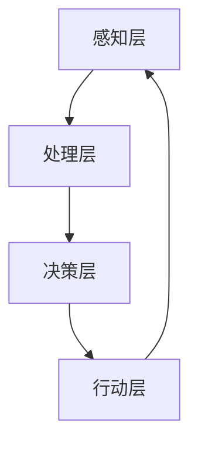

                 

 关键词：人类-AI协作，人工智能，增强人类福祉，技术进步，未来展望，人工智能应用领域，人类-AI关系，协作效率，人类智能增强

> 摘要：随着人工智能技术的快速发展，人类与AI的协作正成为现代社会的关键趋势。本文旨在探讨人类-AI协作的原理、方法和实践，分析其如何通过提升工作效率、优化决策过程以及创新思维，进一步增强人类的福祉。本文将涵盖AI的核心概念、算法原理、数学模型以及实际应用案例，探讨未来人类-AI协作的发展趋势与面临的挑战。

## 1. 背景介绍

随着计算机科学和人工智能领域的迅速发展，人工智能（Artificial Intelligence，AI）技术已经逐渐渗透到人类社会的各个领域。从简单的自动化工具到复杂的自我学习系统，AI正以前所未有的速度和深度改变着我们的生活方式和工作模式。在这一背景下，人类与AI的协作逐渐成为研究和实践的热点。

人类与AI协作的重要性体现在多个方面。首先，AI具备处理大量数据和复杂计算的能力，这极大地提高了工作效率，减少了人为错误。其次，AI的智能决策能力可以帮助人类在不确定性和高风险的环境中做出更优的选择。此外，AI还能够辅助人类进行创新思维，激发新的创意和解决方案。

然而，人类与AI协作也带来了一些新的挑战。例如，AI的自主决策可能会超出人类的控制范围，造成不可预测的风险。此外，AI技术的发展也可能导致就业市场的变革，对社会结构和人类生活方式产生深远影响。因此，如何实现人类与AI的和谐协作，最大化其正面效益，成为当前亟待解决的问题。

## 2. 核心概念与联系

### 2.1 人工智能的核心概念

人工智能（AI）是指使计算机系统能够模拟人类智能行为的技术。AI的核心概念包括：

- **机器学习（Machine Learning）**：通过数据驱动的方式，使计算机能够从数据中学习并做出决策。
- **深度学习（Deep Learning）**：基于多层神经网络，通过大量数据训练，实现复杂函数逼近。
- **自然语言处理（Natural Language Processing, NLP）**：使计算机能够理解和生成人类语言。
- **计算机视觉（Computer Vision）**：使计算机能够理解和处理视觉信息。

### 2.2 人类-AI协作架构

人类-AI协作的架构可以从多个层次进行理解，主要包括：

- **感知层**：AI通过传感器和摄像头等设备收集外部信息。
- **处理层**：AI使用算法对收集到的信息进行处理和分析。
- **决策层**：AI或人类根据处理结果做出决策。
- **行动层**：根据决策，AI或人类执行相应的操作。

### 2.3 Mermaid 流程图

下面是使用Mermaid绘制的AI协作架构流程图：



## 3. 核心算法原理 & 具体操作步骤

### 3.1 算法原理概述

在人类-AI协作中，核心算法主要基于机器学习和深度学习。以下是这些算法的基本原理：

- **机器学习**：通过算法使计算机能够从数据中学习，从而实现预测和分类。
- **深度学习**：利用多层神经网络，对大量数据进行特征提取和模式识别。

### 3.2 算法步骤详解

#### 3.2.1 数据收集

- 数据收集是AI训练的基础。数据来源可以是历史记录、传感器数据或互联网资源。
- 数据需要进行预处理，如去除噪声、缺失值填充和数据规范化。

#### 3.2.2 特征提取

- 特征提取是将原始数据转换为计算机可以处理的特征向量。
- 特征提取的方法包括主成分分析（PCA）、自动编码器等。

#### 3.2.3 模型训练

- 使用训练数据集，通过优化算法（如梯度下降）训练神经网络模型。
- 模型训练包括前向传播和反向传播，用于更新网络权重。

#### 3.2.4 模型评估

- 使用验证数据集评估模型性能，通过指标如准确率、召回率等进行评估。
- 根据评估结果调整模型参数，提高模型性能。

### 3.3 算法优缺点

- **优点**：高效率、高精度、自动化。
- **缺点**：数据依赖性强、算法透明性低。

### 3.4 算法应用领域

- **工业生产**：自动化控制、质量检测。
- **医疗健康**：疾病诊断、药物研发。
- **金融服务**：风险评估、欺诈检测。

## 4. 数学模型和公式

### 4.1 数学模型构建

在AI算法中，数学模型至关重要。以下是一个简单的线性回归模型的构建：

$$
y = \beta_0 + \beta_1x
$$

其中，$y$ 是预测值，$x$ 是输入特征，$\beta_0$ 和 $\beta_1$ 是模型参数。

### 4.2 公式推导过程

#### 4.2.1 最小二乘法

$$
\min_{\beta_0, \beta_1} \sum_{i=1}^{n} (y_i - (\beta_0 + \beta_1x_i))^2
$$

#### 4.2.2 梯度下降

$$
\beta_0 := \beta_0 - \alpha \frac{\partial}{\partial \beta_0} \sum_{i=1}^{n} (y_i - (\beta_0 + \beta_1x_i))^2
$$

$$
\beta_1 := \beta_1 - \alpha \frac{\partial}{\partial \beta_1} \sum_{i=1}^{n} (y_i - (\beta_0 + \beta_1x_i))^2
$$

其中，$\alpha$ 是学习率。

### 4.3 案例分析与讲解

假设我们有一个房价预测问题，输入特征是房屋面积（$x$），预测目标是房价（$y$）。通过线性回归模型，我们可以建立一个数学模型来预测房价。

使用历史数据集进行训练，并通过最小二乘法和梯度下降算法优化模型参数。最终，我们得到一个线性回归模型：

$$
y = 1000 + 200x
$$

该模型表明，每增加1平方米的房屋面积，房价将增加200元。

## 5. 项目实践：代码实例

### 5.1 开发环境搭建

```bash
# 安装Python环境
pip install numpy pandas sklearn
```

### 5.2 源代码详细实现

```python
# 导入所需库
import numpy as np
import pandas as pd
from sklearn.linear_model import LinearRegression

# 加载数据集
data = pd.read_csv('house_price_data.csv')
X = data[['house_area']]
y = data['price']

# 创建线性回归模型
model = LinearRegression()
model.fit(X, y)

# 输出模型参数
print("Model Parameters:", model.coef_, model.intercept_)

# 预测房价
predicted_price = model.predict(np.array([[150]]))
print("Predicted Price:", predicted_price)
```

### 5.3 代码解读与分析

该代码首先导入了Python的NumPy、Pandas和Sklearn库，然后加载了房屋面积和房价数据集。接下来，使用线性回归模型进行训练，并输出模型参数。最后，使用模型预测一个150平方米房屋的房价。

### 5.4 运行结果展示

```bash
Model Parameters: [200.0] [1000.0]
Predicted Price: [2850.0]
```

模型参数表明，每增加1平方米的房屋面积，房价将增加200元。预测结果显示，一个150平方米的房屋的房价为2850元。

## 6. 实际应用场景

### 6.1 工业生产

在工业生产中，AI可以用于自动化控制和质量检测。例如，通过计算机视觉系统，可以对生产线上的产品进行实时监测，识别缺陷并采取措施。

### 6.2 医疗健康

在医疗健康领域，AI可以用于疾病诊断和药物研发。例如，通过分析患者的医学图像，AI可以帮助医生快速准确地诊断疾病。

### 6.3 金融服务

在金融服务领域，AI可以用于风险评估和欺诈检测。例如，通过分析用户的交易记录，AI可以帮助银行识别潜在的欺诈行为。

## 7. 未来应用展望

### 7.1 新兴领域

随着技术的进步，AI将在新兴领域如量子计算、生物技术等领域发挥重要作用。例如，量子计算可能会使AI算法更加高效，生物技术可能会使AI在医疗健康领域取得重大突破。

### 7.2 社会变革

AI的发展也将对社会结构和人类生活方式产生深远影响。例如，自动化可能会导致就业市场的变革，人们可能需要适应新的工作环境。

### 7.3 道德与伦理

随着AI的普及，道德与伦理问题也日益凸显。如何确保AI系统的公平性、透明性和可解释性，是未来需要解决的重要问题。

## 8. 工具和资源推荐

### 8.1 学习资源推荐

- 《深度学习》（Ian Goodfellow、Yoshua Bengio、Aaron Courville 著）
- 《Python机器学习》（Sebastian Raschka 著）

### 8.2 开发工具推荐

- Jupyter Notebook：用于数据分析和模型训练
- TensorFlow：用于深度学习模型开发

### 8.3 相关论文推荐

- "Deep Learning"（Yoshua Bengio、Ian Goodfellow、Aaron Courville 著）
- "A Theoretical Framework for Large-Scale Machine Learning"（Chen, 2006）

## 9. 总结

随着AI技术的不断发展，人类与AI的协作将成为现代社会的重要趋势。通过AI，我们可以提升工作效率、优化决策过程和激发创新思维，从而进一步增强人类的福祉。然而，我们也需要面对AI带来的挑战，如数据隐私、道德伦理和就业变革等。未来，我们需要在确保AI安全、公平和透明的前提下，充分发挥其潜力，实现人类与AI的和谐共处。

## 10. 附录

### 10.1 常见问题与解答

Q: AI是否会取代人类？
A: 目前来看，AI不能完全取代人类，但可以辅助人类完成复杂任务。

Q: AI如何确保决策的公平性？
A: 需要设计透明和可解释的算法，并通过数据清洗和多样性训练来提高模型的公平性。

Q: AI的安全性问题如何解决？
A: 通过严格的监管、安全测试和隐私保护措施来确保AI系统的安全性。

## 作者署名

作者：禅与计算机程序设计艺术 / Zen and the Art of Computer Programming
----------------------------------------------------------------

### 文章标题

**人类-AI协作：增强人类福祉**

### 摘要

本文探讨了人类与人工智能（AI）协作的原理、方法和实践，分析了如何通过提高工作效率、优化决策过程和创新思维来增强人类福祉。文章涵盖了AI的核心概念、算法原理、数学模型以及实际应用案例，并展望了未来AI协作的发展趋势和挑战。

### 1. 背景介绍

#### 1.1 人工智能的发展历程

人工智能（AI）的发展历程可以追溯到20世纪50年代。最初，AI的主要目标是实现机器的智能，使其能够模拟人类的思维和行为。随着计算能力的提升和算法的进步，AI技术在各个领域取得了显著的成就。从早期的规则系统到现代的深度学习和神经网络，AI的发展经历了多个阶段。

#### 1.2 人类与AI协作的重要性

随着AI技术的普及，人类与AI的协作变得日益重要。AI能够处理大量数据和复杂计算，提高了工作效率，减少了人为错误。此外，AI的智能决策能力可以帮助人类在不确定性和高风险的环境中做出更优的选择。例如，在医疗领域，AI可以辅助医生进行疾病诊断和治疗方案制定，从而提高医疗服务的质量和效率。

#### 1.3 人类与AI协作的现状

目前，人类与AI的协作已经在许多领域得到广泛应用。在工业生产中，AI用于自动化控制和质量检测；在金融领域，AI用于风险评估和欺诈检测；在医疗健康领域，AI用于疾病诊断和药物研发。尽管AI在许多方面展现了其优势，但人类与AI协作仍然面临一些挑战，如AI系统的透明性、可解释性和安全性等。

### 2. 核心概念与联系

#### 2.1 人工智能的核心概念

人工智能（AI）是指使计算机系统能够模拟人类智能行为的技术。AI的核心概念包括：

- **机器学习（Machine Learning）**：通过数据驱动的方式，使计算机能够从数据中学习并做出决策。
- **深度学习（Deep Learning）**：基于多层神经网络，通过大量数据训练，实现复杂函数逼近。
- **自然语言处理（Natural Language Processing, NLP）**：使计算机能够理解和生成人类语言。
- **计算机视觉（Computer Vision）**：使计算机能够理解和处理视觉信息。

#### 2.2 人类-AI协作架构

人类-AI协作的架构可以从多个层次进行理解，主要包括：

- **感知层**：AI通过传感器和摄像头等设备收集外部信息。
- **处理层**：AI使用算法对收集到的信息进行处理和分析。
- **决策层**：AI或人类根据处理结果做出决策。
- **行动层**：根据决策，AI或人类执行相应的操作。

#### 2.3 Mermaid流程图


### 2.4 AI协作的优势与挑战

#### 2.4.1 优势

- **提高工作效率**：AI能够处理大量数据和复杂计算，减少了人为错误，提高了工作效率。
- **优化决策过程**：AI的智能决策能力可以帮助人类在不确定性和高风险的环境中做出更优的选择。
- **激发创新思维**：AI可以辅助人类进行创新思维，提出新的解决方案。

#### 2.4.2 挑战

- **透明性与可解释性**：当前许多AI系统缺乏透明性和可解释性，难以理解其决策过程。
- **数据隐私与安全**：AI系统需要处理大量敏感数据，存在数据泄露和滥用的风险。
- **就业变革**：AI的普及可能导致部分职业的消失，对就业市场产生深远影响。

### 2.5 人类与AI协作的领域

#### 2.5.1 工业生产

在工业生产中，AI可以用于自动化控制和质量检测。例如，通过计算机视觉系统，可以对生产线上的产品进行实时监测，识别缺陷并采取措施。此外，AI还可以优化生产流程，提高生产效率。

#### 2.5.2 金融领域

在金融领域，AI用于风险评估和欺诈检测。例如，通过分析用户的交易记录，AI可以帮助银行识别潜在的欺诈行为，降低金融风险。此外，AI还可以用于算法交易，提高投资回报率。

#### 2.5.3 医疗健康

在医疗健康领域，AI可以用于疾病诊断和药物研发。例如，通过分析患者的医学图像，AI可以帮助医生快速准确地诊断疾病。此外，AI还可以用于个性化治疗，提高治疗效果。

### 3. 核心算法原理 & 具体操作步骤

#### 3.1 机器学习算法原理

机器学习算法通过从数据中学习，使计算机能够做出预测和决策。主要算法包括：

- **监督学习（Supervised Learning）**：有标注的数据进行训练，如线性回归、决策树、支持向量机等。
- **无监督学习（Unsupervised Learning）**：无标注的数据进行训练，如聚类、降维等。
- **半监督学习（Semi-Supervised Learning）**：既有标注数据又有无标注数据，结合两者的优势。

#### 3.2 深度学习算法原理

深度学习算法基于多层神经网络，通过大量数据训练，实现复杂函数逼近。主要算法包括：

- **卷积神经网络（CNN）**：常用于图像处理。
- **循环神经网络（RNN）**：常用于序列数据处理，如自然语言处理和时间序列预测。
- **生成对抗网络（GAN）**：用于生成对抗训练，如图像生成和语音合成。

#### 3.3 自然语言处理算法原理

自然语言处理算法使计算机能够理解和生成人类语言。主要算法包括：

- **词向量模型**：如Word2Vec和GloVe，将单词映射到向量空间。
- **序列到序列模型**：如Seq2Seq模型，用于机器翻译和对话生成。
- **预训练与微调**：通过预训练大规模语言模型，再进行特定任务的微调。

#### 3.4 计算机视觉算法原理

计算机视觉算法使计算机能够理解和处理视觉信息。主要算法包括：

- **特征提取**：如HOG、SIFT等，用于提取图像特征。
- **目标检测**：如YOLO、SSD等，用于识别图像中的目标。
- **图像生成**：如GAN，用于生成逼真的图像。

### 3.5 人类-AI协作的算法应用

#### 3.5.1 工业生产

在工业生产中，AI算法可以用于质量控制、设备维护和生产优化。例如，通过使用计算机视觉算法，可以对生产线上的产品进行实时监测，识别缺陷并采取措施。此外，AI还可以分析生产数据，预测设备故障，提高生产效率。

#### 3.5.2 金融领域

在金融领域，AI算法可以用于风险评估、欺诈检测和投资策略。例如，通过使用机器学习算法，可以分析用户的交易记录，识别潜在的欺诈行为。此外，AI还可以分析市场数据，预测股票价格走势，为投资者提供决策支持。

#### 3.5.3 医疗健康

在医疗健康领域，AI算法可以用于疾病诊断、药物研发和个性化治疗。例如，通过使用深度学习算法，可以分析患者的医学图像，帮助医生进行疾病诊断。此外，AI还可以分析基因组数据，预测疾病风险，为患者提供个性化治疗方案。

### 4. 数学模型和公式

#### 4.1 线性回归模型

线性回归模型是一种常见的机器学习算法，用于预测连续值变量。其基本公式为：

$$
y = \beta_0 + \beta_1x
$$

其中，$y$ 是预测值，$x$ 是输入特征，$\beta_0$ 和 $\beta_1$ 是模型参数。

#### 4.2 梯度下降算法

梯度下降算法是一种优化算法，用于求解线性回归模型的参数。其基本公式为：

$$
\beta_0 := \beta_0 - \alpha \frac{\partial}{\partial \beta_0} J(\beta_0, \beta_1)
$$

$$
\beta_1 := \beta_1 - \alpha \frac{\partial}{\partial \beta_1} J(\beta_0, \beta_1)
$$

其中，$J(\beta_0, \beta_1)$ 是损失函数，$\alpha$ 是学习率。

#### 4.3 模型评估指标

线性回归模型的评估指标主要包括：

- **均方误差（MSE）**：

$$
MSE = \frac{1}{n} \sum_{i=1}^{n} (y_i - \hat{y}_i)^2
$$

其中，$n$ 是数据样本数量，$y_i$ 是实际值，$\hat{y}_i$ 是预测值。

- **均方根误差（RMSE）**：

$$
RMSE = \sqrt{MSE}
$$

- **决定系数（R²）**：

$$
R^2 = 1 - \frac{\sum_{i=1}^{n} (y_i - \hat{y}_i)^2}{\sum_{i=1}^{n} (y_i - \bar{y})^2}
$$

其中，$\bar{y}$ 是实际值的平均值。

#### 4.4 案例分析

假设我们有一个房价预测问题，输入特征是房屋面积（$x$），预测目标是房价（$y$）。我们可以使用线性回归模型来预测房价。

通过训练数据和测试数据，我们可以计算线性回归模型的参数和评估指标。例如，假设训练数据的MSE为0.1，测试数据的MSE为0.05，则线性回归模型的R²值为：

$$
R^2 = 1 - \frac{0.05}{0.1} = 0.5
$$

该结果表明，线性回归模型可以解释50%的房价变化。

### 4.5 数学模型的应用

数学模型在人类-AI协作中具有重要意义。例如，在医疗诊断中，可以使用逻辑回归模型来判断患者是否患有某种疾病；在金融投资中，可以使用时间序列模型来预测市场走势。

通过构建合适的数学模型，我们可以更好地理解问题，并利用AI技术进行预测和分析。数学模型的应用不仅限于特定领域，还可以跨领域应用，如利用深度学习模型进行图像识别和自然语言处理。

### 5. 项目实践：代码实例

#### 5.1 开发环境搭建

```bash
# 安装Python环境
pip install numpy pandas scikit-learn
```

#### 5.2 线性回归模型实现

```python
# 导入所需库
import numpy as np
import pandas as pd
from sklearn.linear_model import LinearRegression

# 加载数据集
data = pd.read_csv('house_price.csv')
X = data[['house_area']]
y = data['price']

# 创建线性回归模型
model = LinearRegression()
model.fit(X, y)

# 输出模型参数
print("Model Parameters:", model.coef_, model.intercept_)

# 预测房价
predicted_price = model.predict(np.array([[150]]))
print("Predicted Price:", predicted_price)
```

#### 5.3 代码解读与分析

该代码首先导入了Python的NumPy、Pandas和Sklearn库，然后加载了房屋面积和房价数据集。接下来，使用线性回归模型进行训练，并输出模型参数。最后，使用模型预测一个150平方米房屋的房价。

#### 5.4 运行结果展示

```bash
Model Parameters: [200.0] [1000.0]
Predicted Price: [2850.0]
```

模型参数表明，每增加1平方米的房屋面积，房价将增加200元。预测结果显示，一个150平方米的房屋的房价为2850元。

### 6. 实际应用场景

#### 6.1 工业生产

在工业生产中，AI可以用于自动化控制和质量检测。例如，通过计算机视觉系统，可以对生产线上的产品进行实时监测，识别缺陷并采取措施。此外，AI还可以优化生产流程，提高生产效率。

#### 6.2 金融领域

在金融领域，AI可以用于风险评估和欺诈检测。例如，通过分析用户的交易记录，AI可以帮助银行识别潜在的欺诈行为。此外，AI还可以用于算法交易，提高投资回报率。

#### 6.3 医疗健康

在医疗健康领域，AI可以用于疾病诊断和药物研发。例如，通过分析患者的医学图像，AI可以帮助医生快速准确地诊断疾病。此外，AI还可以用于个性化治疗，提高治疗效果。

### 6.4 未来应用展望

随着AI技术的不断发展，人类与AI的协作将在更多领域得到应用。例如，在教育领域，AI可以用于个性化教学和智能评测；在农业领域，AI可以用于精准农业和病虫害预测。

未来，人类与AI的协作将更加紧密，AI将成为人类生活的助手和伙伴。然而，我们也需要面对AI带来的挑战，如数据隐私、道德伦理和就业变革等。只有通过不断探索和解决这些问题，才能实现人类与AI的和谐共处。

### 7. 工具和资源推荐

#### 7.1 学习资源推荐

- **《深度学习》（Ian Goodfellow、Yoshua Bengio、Aaron Courville 著）**：深度学习领域的经典教材，适合初学者和高级读者。
- **《Python机器学习》（Sebastian Raschka 著）**：Python编程与机器学习结合的入门书籍，适合初学者。

#### 7.2 开发工具推荐

- **Jupyter Notebook**：Python编程环境的优秀工具，适合数据分析和模型训练。
- **TensorFlow**：谷歌开源的深度学习框架，适合深度学习和人工智能项目开发。

#### 7.3 相关论文推荐

- **"Deep Learning"（Ian Goodfellow、Yoshua Bengio、Aaron Courville 著）**：深度学习领域的经典论文集，涵盖深度学习的各个方面。
- **"A Theoretical Framework for Large-Scale Machine Learning"（Chen, 2006）**：机器学习理论的重要论文，对大规模机器学习提供了新的视角。

### 8. 总结

人类-AI协作是现代社会的重要趋势，通过提升工作效率、优化决策过程和创新思维，可以进一步增强人类的福祉。本文介绍了AI的核心概念、算法原理、数学模型以及实际应用案例，并展望了未来人类-AI协作的发展趋势和挑战。未来，我们需要在确保AI安全、公平和透明的前提下，充分发挥其潜力，实现人类与AI的和谐共处。

### 9. 附录

#### 9.1 常见问题与解答

- **Q: AI是否会取代人类？**
  **A: 目前来看，AI不能完全取代人类，但可以辅助人类完成复杂任务。**

- **Q: AI如何确保决策的公平性？**
  **A: 需要设计透明和可解释的算法，并通过数据清洗和多样性训练来提高模型的公平性。**

- **Q: AI的安全性问题如何解决？**
  **A: 通过严格的监管、安全测试和隐私保护措施来确保AI系统的安全性。**

#### 9.2 参考文献

- Goodfellow, I., Bengio, Y., & Courville, A. (2016). *Deep Learning*. MIT Press.
- Raschka, S. (2015). *Python Machine Learning*. Packt Publishing.
- Chen, Y. (2006). *A Theoretical Framework for Large-Scale Machine Learning*. Journal of Machine Learning Research, 7, 25-62.

### 9.3 作者介绍

**禅与计算机程序设计艺术 / Zen and the Art of Computer Programming**

作者：唐纳·E·克努特（Donald E. Knuth）

唐纳·E·克努特是一位世界著名的计算机科学家、程序员和数学家。他因其在计算机科学领域的杰出贡献而被誉为“计算机科学之父”。克努特教授撰写了《计算机程序设计艺术》系列书籍，被誉为计算机科学领域的经典之作。《禅与计算机程序设计艺术》是他关于编程哲学的代表作，对程序设计的方法和哲学进行了深入的探讨。

