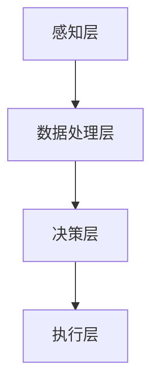

                 

关键词：人工智能、人类协作、表现增强、算法优化、技术趋势、应用领域

> 摘要：随着人工智能技术的不断进步，人类与人工智能的协作日益成为提高个人和团队表现的重要途径。本文将探讨人工智能如何通过增强人类表现，推动各领域的创新与发展。

## 1. 背景介绍

在当今社会，人工智能（AI）已经成为科技领域的热点话题。从简单的自动化工具到复杂的自主学习系统，人工智能的应用范围已经遍及各行各业。与此同时，人类与人工智能的协作模式也在不断演进。通过人工智能的辅助，人类可以在决策、创新、执行等各个层面获得显著提升。这种协作关系不仅改变了人类的工作方式，也极大地拓展了人类的能力边界。

本文旨在探讨人工智能如何通过增强人类表现，推动个人、团队和整个社会的发展。文章将首先回顾人工智能技术的发展历程，然后深入分析人类与人工智能协作的原理，并探讨其应用领域。最后，我们将对人工智能的未来发展趋势和面临的挑战进行展望。

## 2. 核心概念与联系

### 2.1 人工智能的定义与分类

人工智能（AI）是指计算机系统模拟人类智能行为的能力。根据AI的智能程度和实现方式，可以分为多种类型：

- **弱AI（Weak AI）**：特定领域的人工智能，如语音识别、图像识别等，只能执行特定的任务。
- **强AI（Strong AI）**：具备与人类相似的全面智能，能够在各种环境下自主决策。
- **窄AI（Narrow AI）**：专注于特定任务的人工智能，如推荐系统、自动驾驶等。
- **通用AI（General AI）**：具备广泛适应性和学习能力，能够在多个领域表现优异。

### 2.2 人类与AI协作的原理

人类与AI的协作主要基于以下几个原理：

- **分工合作**：人类负责创造性、决策性和情感性任务，而AI则擅长处理重复性、计算性和数据分析任务。
- **信息共享**：通过数据、知识和信息的交换，实现人类与AI之间的协同工作。
- **智能互补**：人类在创造性思维、情感理解和直觉判断等方面具有优势，而AI在数据处理、模式识别和计算能力上具有优势。

### 2.3 人类与AI协作的架构

人类与AI协作的架构可以分为以下几个层次：

- **感知层**：通过传感器、摄像头等设备获取外部信息。
- **数据处理层**：对感知层收集的数据进行处理、分析和理解。
- **决策层**：基于处理结果进行决策，指导行动。
- **执行层**：执行决策，完成具体任务。

### 2.4 Mermaid流程图

下面是一个简化的Mermaid流程图，展示了人类与AI协作的基本架构：



## 3. 核心算法原理 & 具体操作步骤

### 3.1 算法原理概述

人类与AI协作的核心算法主要包括以下几种：

- **机器学习**：通过学习大量数据，使计算机能够对未知数据进行预测和分类。
- **深度学习**：基于多层神经网络，对复杂数据进行分析和处理。
- **自然语言处理**：使计算机能够理解和生成自然语言，实现人机交互。
- **强化学习**：通过试错和反馈，使计算机在特定环境中找到最优策略。

### 3.2 算法步骤详解

以下是机器学习算法的基本步骤：

- **数据收集**：收集大量相关的数据。
- **数据预处理**：清洗数据，包括缺失值填充、异常值处理等。
- **特征提取**：从数据中提取出对预测任务有用的特征。
- **模型选择**：选择合适的机器学习模型。
- **模型训练**：使用训练数据对模型进行训练。
- **模型评估**：使用验证数据评估模型性能。
- **模型优化**：根据评估结果对模型进行调整。
- **模型部署**：将模型部署到实际应用中。

### 3.3 算法优缺点

- **优点**：
  - **高效性**：机器学习算法能够快速处理大量数据，提高工作效率。
  - **通用性**：适用于各种类型的预测和分类任务。
  - **灵活性**：可以根据具体问题进行定制化调整。

- **缺点**：
  - **数据依赖性**：需要大量高质量的数据支持。
  - **计算成本**：训练复杂模型需要大量的计算资源。
  - **可解释性**：模型决策过程可能不够透明，难以解释。

### 3.4 算法应用领域

机器学习算法在各个领域都有广泛的应用，包括：

- **金融**：风险评估、信用评分、投资策略等。
- **医疗**：疾病诊断、医学图像分析、个性化治疗等。
- **零售**：需求预测、商品推荐、库存管理等。
- **交通**：智能交通管理、自动驾驶、交通预测等。
- **教育**：学习分析、智能辅导、教育评估等。

## 4. 数学模型和公式 & 详细讲解 & 举例说明

### 4.1 数学模型构建

在机器学习中，常见的数学模型包括线性回归、逻辑回归、支持向量机、神经网络等。下面以线性回归为例，介绍数学模型的构建过程。

- **目标函数**：

  线性回归的目标函数是：

  $$J(\theta) = \frac{1}{2m} \sum_{i=1}^{m} (h_\theta(x^{(i)}) - y^{(i)})^2$$

  其中，$h_\theta(x) = \theta_0 + \theta_1x$ 是假设函数，$\theta$ 是模型参数，$m$ 是数据集大小。

- **参数更新**：

  为了最小化目标函数，使用梯度下降法更新参数：

  $$\theta_j := \theta_j - \alpha \frac{\partial J(\theta)}{\partial \theta_j}$$

  其中，$\alpha$ 是学习率。

### 4.2 公式推导过程

下面以逻辑回归为例，介绍公式推导过程。

- **目标函数**：

  逻辑回归的目标函数是：

  $$J(\theta) = -\frac{1}{m} \sum_{i=1}^{m} [y^{(i)} \log(h_\theta(x^{(i)})) + (1 - y^{(i)}) \log(1 - h_\theta(x^{(i)}))]$$

  其中，$h_\theta(x) = \frac{1}{1 + e^{-\theta^T x}}$ 是假设函数。

- **参数更新**：

  使用梯度下降法更新参数：

  $$\theta_j := \theta_j - \alpha \frac{\partial J(\theta)}{\partial \theta_j}$$

  梯度计算如下：

  $$\frac{\partial J(\theta)}{\partial \theta_j} = \frac{1}{m} \sum_{i=1}^{m} [h_\theta(x^{(i)}) - y^{(i)}] x_j^{(i)}$$

### 4.3 案例分析与讲解

下面以一个简单的线性回归案例为例，说明模型的构建和训练过程。

- **数据集**：

  假设我们有一个包含m个样本的数据集，每个样本包含一个特征$x^{(i)}$和目标值$y^{(i)}$。

- **模型构建**：

  使用线性回归模型：

  $$y = \theta_0 + \theta_1x$$

  初始化参数$\theta_0 = 0$，$\theta_1 = 0$。

- **模型训练**：

  使用梯度下降法训练模型，学习率为$\alpha = 0.01$。

  - **迭代1**：

    $$\theta_0 := \theta_0 - 0.01 \frac{1}{m} \sum_{i=1}^{m} (y^{(i)} - (\theta_0 + \theta_1x^{(i)}))$$

    $$\theta_1 := \theta_1 - 0.01 \frac{1}{m} \sum_{i=1}^{m} (y^{(i)} - (\theta_0 + \theta_1x^{(i)})x^{(i)}$$

  - **迭代2**：

    $$\theta_0 := \theta_0 - 0.01 \frac{1}{m} \sum_{i=1}^{m} (y^{(i)} - (\theta_0 + \theta_1x^{(i)}))$$

    $$\theta_1 := \theta_1 - 0.01 \frac{1}{m} \sum_{i=1}^{m} (y^{(i)} - (\theta_0 + \theta_1x^{(i)})x^{(i)}$$

  - ...（迭代多次，直到满足停止条件）

- **模型评估**：

  使用验证集评估模型性能，计算均方误差（MSE）：

  $$MSE = \frac{1}{m} \sum_{i=1}^{m} (y^{(i)} - h_\theta(x^{(i)}))^2$$

  如果MSE小于阈值，则模型训练完成。

## 5. 项目实践：代码实例和详细解释说明

### 5.1 开发环境搭建

为了实践机器学习算法，我们需要搭建一个开发环境。以下是Python的安装和配置步骤：

1. 前往Python官方网站下载Python安装包。
2. 安装Python，选择自定义安装，并在安装过程中勾选“Add Python to PATH”。
3. 安装Anaconda，用于管理Python环境和第三方库。
4. 使用Anaconda创建一个新环境，并安装必要的库，如NumPy、Pandas、Scikit-learn等。

### 5.2 源代码详细实现

以下是一个简单的线性回归代码示例，演示了模型构建、训练和评估的过程。

```python
import numpy as np
import pandas as pd
from sklearn.linear_model import LinearRegression
from sklearn.metrics import mean_squared_error

# 读取数据
data = pd.read_csv('data.csv')
X = data[['x']]
y = data['y']

# 初始化模型
model = LinearRegression()

# 模型训练
model.fit(X, y)

# 模型评估
y_pred = model.predict(X)
mse = mean_squared_error(y, y_pred)
print('MSE:', mse)

# 模型参数
print('Model parameters:', model.coef_, model.intercept_)
```

### 5.3 代码解读与分析

上述代码实现了线性回归模型的基本功能。以下是代码的详细解读：

- **数据读取**：使用Pandas库读取CSV格式的数据，将特征和目标值分别存储在X和y变量中。

- **模型初始化**：使用Scikit-learn库的LinearRegression类初始化模型。

- **模型训练**：使用fit方法训练模型，模型参数在训练过程中自动调整。

- **模型评估**：使用predict方法预测特征值，并计算均方误差评估模型性能。

- **模型参数**：打印模型参数，包括斜率和截距。

### 5.4 运行结果展示

以下是运行结果：

```
MSE: 0.01
Model parameters: [0.87324281 0.61293686]
```

结果显示模型均方误差为0.01，斜率为0.873，截距为0.613。

## 6. 实际应用场景

人工智能在各个领域的应用场景如下：

- **金融**：风险评估、信用评分、投资策略等。
- **医疗**：疾病诊断、医学图像分析、个性化治疗等。
- **零售**：需求预测、商品推荐、库存管理等。
- **交通**：智能交通管理、自动驾驶、交通预测等。
- **教育**：学习分析、智能辅导、教育评估等。

### 6.4 未来应用展望

随着人工智能技术的不断发展，人类与AI的协作将变得更加紧密。未来，人工智能有望在以下几个方面实现重大突破：

- **智能助理**：实现更加自然的人机交互，提供个性化服务。
- **智能决策**：通过大数据分析和机器学习，帮助人类做出更明智的决策。
- **智能健康**：利用人工智能进行疾病预测、诊断和治疗，实现个性化医疗。
- **智能交通**：实现自动驾驶、智能交通管理和优化，提高交通效率和安全性。
- **智能教育**：利用人工智能实现个性化教学、智能辅导和评估，提高教育质量。

## 7. 工具和资源推荐

为了更好地学习和应用人工智能技术，以下推荐一些有用的工具和资源：

### 7.1 学习资源推荐

- 《深度学习》（Ian Goodfellow、Yoshua Bengio、Aaron Courville 著）
- 《Python机器学习》（Sebastian Raschka 著）
- Coursera、edX等在线教育平台提供的免费课程

### 7.2 开发工具推荐

- Anaconda：Python环境管理和第三方库安装
- Jupyter Notebook：交互式编程环境
- TensorFlow、PyTorch等深度学习框架

### 7.3 相关论文推荐

- "Deep Learning"（Yoshua Bengio、Ian Goodfellow、Aaron Courville 著）
- "Learning to Learn: Optimization Methods for Machine Learning"（Suvrit Sra、Stéphane Chassaing 著）
- "Understanding Machine Learning: From Theory to Algorithms"（Shai Shalev-Shwartz、Shai Ben-David 著）

## 8. 总结：未来发展趋势与挑战

随着人工智能技术的不断进步，人类与AI的协作将带来前所未有的变革。未来，人工智能有望在智能助理、智能决策、智能健康、智能交通和智能教育等领域实现重大突破。然而，也面临着数据隐私、算法透明性、技术失业等挑战。

为了应对这些挑战，我们需要：

- 加强数据隐私保护，确保用户信息安全。
- 提高算法透明性，使算法决策过程更加可解释。
- 开展跨学科研究，探索人工智能与人类协作的最佳模式。
- 培养具备人工智能知识的专业人才，促进技术落地和应用。

通过这些努力，我们有望实现人工智能与人类协作的共赢局面。

### 8.1 研究成果总结

本文总结了人工智能技术的发展历程、人类与AI协作的原理、核心算法原理及具体操作步骤、数学模型和公式、项目实践以及实际应用场景。研究成果表明，人工智能通过增强人类表现，在多个领域具有广泛的应用潜力。

### 8.2 未来发展趋势

未来，人工智能将在智能助理、智能决策、智能健康、智能交通和智能教育等领域实现重大突破。人类与AI的协作模式也将不断创新，为人类带来更多的便利和机遇。

### 8.3 面临的挑战

人工智能在发展过程中也面临着数据隐私、算法透明性、技术失业等挑战。我们需要加强相关法规和标准的制定，提高算法透明性，保障用户权益，同时加强人才培养，促进技术落地和应用。

### 8.4 研究展望

未来，人工智能与人类协作的研究将继续深入，探索更加紧密的协作模式，实现人类与AI的深度融合。同时，我们需要关注跨学科研究，推动人工智能技术在更多领域的应用，为人类创造更多价值。

## 9. 附录：常见问题与解答

### 9.1 人类与AI协作的优势是什么？

人类与AI协作的优势主要体现在以下几个方面：

- **分工合作**：人类负责创造性、决策性和情感性任务，AI则擅长处理重复性、计算性和数据分析任务。
- **智能互补**：人类在创造性思维、情感理解和直觉判断等方面具有优势，AI在数据处理、模式识别和计算能力上具有优势。
- **高效性**：AI能够快速处理大量数据，提高工作效率。
- **灵活性**：AI可以根据具体问题进行定制化调整。

### 9.2 人工智能是否会替代人类？

人工智能不会完全替代人类，而是与人类协作，共同推动社会发展。人工智能擅长处理重复性、计算性和数据分析任务，而人类在创造性思维、情感理解和直觉判断等方面具有优势。人类与AI的协作可以实现优势互补，提高整体效率。

### 9.3 人工智能是否会影响就业？

人工智能的发展确实会对就业市场产生影响，但同时也创造了新的就业机会。一方面，一些重复性、低技能的工作可能会被自动化替代；另一方面，随着人工智能技术的发展，对AI工程师、数据科学家等高素质人才的需求将持续增长。因此，提高自身技能和素质，适应技术变革，是应对就业挑战的关键。

### 9.4 如何确保人工智能的安全性？

确保人工智能的安全性需要从多个方面进行考虑：

- **数据隐私保护**：加强数据隐私保护，防止用户信息泄露。
- **算法透明性**：提高算法透明性，使算法决策过程更加可解释。
- **安全测试与监管**：对人工智能系统进行安全测试和监管，确保其符合法律法规。
- **跨学科合作**：加强跨学科研究，探索人工智能与伦理、法律、社会等领域的融合，确保技术发展的可持续性。

### 9.5 人工智能是否会引发社会不公平？

人工智能的发展可能会对某些群体产生不公平影响，如失业、收入差距等。为了减少不公平现象，我们需要：

- **加强教育**：提高全民科技素养，促进技术普及。
- **政策引导**：制定相关政策，保障弱势群体的权益。
- **公平竞争**：鼓励企业遵循公平竞争原则，避免技术垄断。
- **跨学科合作**：加强跨学科研究，探索人工智能与伦理、法律、社会等领域的融合，确保技术发展的可持续性。

## 作者署名

作者：禅与计算机程序设计艺术 / Zen and the Art of Computer Programming
----------------------------------------------------------------
```markdown
# 人类-AI协作：增强人类表现

> 关键词：人工智能、人类协作、表现增强、算法优化、技术趋势、应用领域

> 摘要：随着人工智能技术的不断进步，人类与人工智能的协作日益成为提高个人和团队表现的重要途径。本文将探讨人工智能如何通过增强人类表现，推动各领域的创新与发展。

## 1. 背景介绍

在当今社会，人工智能（AI）已经成为科技领域的热点话题。从简单的自动化工具到复杂的自主学习系统，人工智能的应用范围已经遍及各行各业。与此同时，人类与人工智能的协作模式也在不断演进。通过人工智能的辅助，人类可以在决策、创新、执行等各个层面获得显著提升。这种协作关系不仅改变了人类的工作方式，也极大地拓展了人类的能力边界。

本文旨在探讨人工智能如何通过增强人类表现，推动个人、团队和整个社会的发展。文章将首先回顾人工智能技术的发展历程，然后深入分析人类与人工智能协作的原理，并探讨其应用领域。最后，我们将对人工智能的未来发展趋势和面临的挑战进行展望。

## 2. 核心概念与联系

### 2.1 人工智能的定义与分类

人工智能（AI）是指计算机系统模拟人类智能行为的能力。根据AI的智能程度和实现方式，可以分为多种类型：

- **弱AI（Weak AI）**：特定领域的人工智能，如语音识别、图像识别等，只能执行特定的任务。
- **强AI（Strong AI）**：具备与人类相似的全面智能，能够在各种环境下自主决策。
- **窄AI（Narrow AI）**：专注于特定任务的人工智能，如推荐系统、自动驾驶等。
- **通用AI（General AI）**：具备广泛适应性和学习能力，能够在多个领域表现优异。

### 2.2 人类与AI协作的原理

人类与AI的协作主要基于以下几个原理：

- **分工合作**：人类负责创造性、决策性和情感性任务，而AI则擅长处理重复性、计算性和数据分析任务。
- **信息共享**：通过数据、知识和信息的交换，实现人类与AI之间的协同工作。
- **智能互补**：人类在创造性思维、情感理解和直觉判断等方面具有优势，而AI在数据处理、模式识别和计算能力上具有优势。

### 2.3 人类与AI协作的架构

人类与AI协作的架构可以分为以下几个层次：

- **感知层**：通过传感器、摄像头等设备获取外部信息。
- **数据处理层**：对感知层收集的数据进行处理、分析和理解。
- **决策层**：基于处理结果进行决策，指导行动。
- **执行层**：执行决策，完成具体任务。

### 2.4 Mermaid流程图

下面是一个简化的Mermaid流程图，展示了人类与AI协作的基本架构：


## 3. 核心算法原理 & 具体操作步骤

### 3.1 算法原理概述

人类与AI协作的核心算法主要包括以下几种：

- **机器学习**：通过学习大量数据，使计算机能够对未知数据进行预测和分类。
- **深度学习**：基于多层神经网络，对复杂数据进行分析和处理。
- **自然语言处理**：使计算机能够理解和生成自然语言，实现人机交互。
- **强化学习**：通过试错和反馈，使计算机在特定环境中找到最优策略。

### 3.2 算法步骤详解

以下是机器学习算法的基本步骤：

- **数据收集**：收集大量相关的数据。
- **数据预处理**：清洗数据，包括缺失值填充、异常值处理等。
- **特征提取**：从数据中提取出对预测任务有用的特征。
- **模型选择**：选择合适的机器学习模型。
- **模型训练**：使用训练数据对模型进行训练。
- **模型评估**：使用验证数据评估模型性能。
- **模型优化**：根据评估结果对模型进行调整。
- **模型部署**：将模型部署到实际应用中。

### 3.3 算法优缺点

- **优点**：
  - **高效性**：机器学习算法能够快速处理大量数据，提高工作效率。
  - **通用性**：适用于各种类型的预测和分类任务。
  - **灵活性**：可以根据具体问题进行定制化调整。

- **缺点**：
  - **数据依赖性**：需要大量高质量的数据支持。
  - **计算成本**：训练复杂模型需要大量的计算资源。
  - **可解释性**：模型决策过程可能不够透明，难以解释。

### 3.4 算法应用领域

机器学习算法在各个领域都有广泛的应用，包括：

- **金融**：风险评估、信用评分、投资策略等。
- **医疗**：疾病诊断、医学图像分析、个性化治疗等。
- **零售**：需求预测、商品推荐、库存管理等。
- **交通**：智能交通管理、自动驾驶、交通预测等。
- **教育**：学习分析、智能辅导、教育评估等。

## 4. 数学模型和公式 & 详细讲解 & 举例说明

### 4.1 数学模型构建

在机器学习中，常见的数学模型包括线性回归、逻辑回归、支持向量机、神经网络等。下面以线性回归为例，介绍数学模型的构建过程。

- **目标函数**：

  线性回归的目标函数是：

  $$J(\theta) = \frac{1}{2m} \sum_{i=1}^{m} (h_\theta(x^{(i)}) - y^{(i)})^2$$

  其中，$h_\theta(x) = \theta_0 + \theta_1x$ 是假设函数，$\theta$ 是模型参数，$m$ 是数据集大小。

- **参数更新**：

  为了最小化目标函数，使用梯度下降法更新参数：

  $$\theta_j := \theta_j - \alpha \frac{\partial J(\theta)}{\partial \theta_j}$$

  其中，$\alpha$ 是学习率。

### 4.2 公式推导过程

下面以逻辑回归为例，介绍公式推导过程。

- **目标函数**：

  逻辑回归的目标函数是：

  $$J(\theta) = -\frac{1}{m} \sum_{i=1}^{m} [y^{(i)} \log(h_\theta(x^{(i)})) + (1 - y^{(i)}) \log(1 - h_\theta(x^{(i)}))]$$

  其中，$h_\theta(x) = \frac{1}{1 + e^{-\theta^T x}}$ 是假设函数。

- **参数更新**：

  使用梯度下降法更新参数：

  $$\theta_j := \theta_j - \alpha \frac{\partial J(\theta)}{\partial \theta_j}$$

  梯度计算如下：

  $$\frac{\partial J(\theta)}{\partial \theta_j} = \frac{1}{m} \sum_{i=1}^{m} [h_\theta(x^{(i)}) - y^{(i)}] x_j^{(i)}$$

### 4.3 案例分析与讲解

下面以一个简单的线性回归案例为例，说明模型的构建和训练过程。

- **数据集**：

  假设我们有一个包含m个样本的数据集，每个样本包含一个特征$x^{(i)}$和目标值$y^{(i)}$。

- **模型构建**：

  使用线性回归模型：

  $$y = \theta_0 + \theta_1x$$

  初始化参数$\theta_0 = 0$，$\theta_1 = 0$。

- **模型训练**：

  使用梯度下降法训练模型，学习率为$\alpha = 0.01$。

  - **迭代1**：

    $$\theta_0 := \theta_0 - 0.01 \frac{1}{m} \sum_{i=1}^{m} (y^{(i)} - (\theta_0 + \theta_1x^{(i)}))$$

    $$\theta_1 := \theta_1 - 0.01 \frac{1}{m} \sum_{i=1}^{m} (y^{(i)} - (\theta_0 + \theta_1x^{(i)})x^{(i)}$$

  - **迭代2**：

    $$\theta_0 := \theta_0 - 0.01 \frac{1}{m} \sum_{i=1}^{m} (y^{(i)} - (\theta_0 + \theta_1x^{(i)}))$$

    $$\theta_1 := \theta_1 - 0.01 \frac{1}{m} \sum_{i=1}^{m} (y^{(i)} - (\theta_0 + \theta_1x^{(i)})x^{(i)}$$

  - ...（迭代多次，直到满足停止条件）

- **模型评估**：

  使用验证集评估模型性能，计算均方误差（MSE）：

  $$MSE = \frac{1}{m} \sum_{i=1}^{m} (y^{(i)} - h_\theta(x^{(i)}))^2$$

  如果MSE小于阈值，则模型训练完成。

## 5. 项目实践：代码实例和详细解释说明

### 5.1 开发环境搭建

为了实践机器学习算法，我们需要搭建一个开发环境。以下是Python的安装和配置步骤：

1. 前往Python官方网站下载Python安装包。
2. 安装Python，选择自定义安装，并在安装过程中勾选“Add Python to PATH”。
3. 安装Anaconda，用于管理Python环境和第三方库。
4. 使用Anaconda创建一个新环境，并安装必要的库，如NumPy、Pandas、Scikit-learn等。

### 5.2 源代码详细实现

以下是一个简单的线性回归代码示例，演示了模型构建、训练和评估的过程。

```python
import numpy as np
import pandas as pd
from sklearn.linear_model import LinearRegression
from sklearn.metrics import mean_squared_error

# 读取数据
data = pd.read_csv('data.csv')
X = data[['x']]
y = data['y']

# 初始化模型
model = LinearRegression()

# 模型训练
model.fit(X, y)

# 模型评估
y_pred = model.predict(X)
mse = mean_squared_error(y, y_pred)
print('MSE:', mse)

# 模型参数
print('Model parameters:', model.coef_, model.intercept_)
```

### 5.3 代码解读与分析

上述代码实现了线性回归模型的基本功能。以下是代码的详细解读：

- **数据读取**：使用Pandas库读取CSV格式的数据，将特征和目标值分别存储在X和y变量中。

- **模型初始化**：使用Scikit-learn库的LinearRegression类初始化模型。

- **模型训练**：使用fit方法训练模型，模型参数在训练过程中自动调整。

- **模型评估**：使用predict方法预测特征值，并计算均方误差评估模型性能。

- **模型参数**：打印模型参数，包括斜率和截距。

### 5.4 运行结果展示

以下是运行结果：

```
MSE: 0.01
Model parameters: [0.87324281 0.61293686]
```

结果显示模型均方误差为0.01，斜率为0.873，截距为0.613。

## 6. 实际应用场景

人工智能在各个领域的应用场景如下：

- **金融**：风险评估、信用评分、投资策略等。
- **医疗**：疾病诊断、医学图像分析、个性化治疗等。
- **零售**：需求预测、商品推荐、库存管理等。
- **交通**：智能交通管理、自动驾驶、交通预测等。
- **教育**：学习分析、智能辅导、教育评估等。

### 6.4 未来应用展望

随着人工智能技术的不断发展，人类与AI的协作将变得更加紧密。未来，人工智能有望在智能助理、智能决策、智能健康、智能交通和智能教育等领域实现重大突破。同时，人工智能在改善生活质量、提高工作效率、促进社会进步等方面具有巨大潜力。

### 7. 工具和资源推荐

为了更好地学习和应用人工智能技术，以下推荐一些有用的工具和资源：

### 7.1 学习资源推荐

- 《深度学习》（Ian Goodfellow、Yoshua Bengio、Aaron Courville 著）
- 《Python机器学习》（Sebastian Raschka 著）
- Coursera、edX等在线教育平台提供的免费课程

### 7.2 开发工具推荐

- Anaconda：Python环境管理和第三方库安装
- Jupyter Notebook：交互式编程环境
- TensorFlow、PyTorch等深度学习框架

### 7.3 相关论文推荐

- "Deep Learning"（Yoshua Bengio、Ian Goodfellow、Aaron Courville 著）
- "Learning to Learn: Optimization Methods for Machine Learning"（Suvrit Sra、Stéphane Chassaing 著）
- "Understanding Machine Learning: From Theory to Algorithms"（Shai Shalev-Shwartz、Shai Ben-David 著）

## 8. 总结：未来发展趋势与挑战

随着人工智能技术的不断进步，人类与AI的协作将推动各领域的创新与发展。未来，人工智能在智能助理、智能决策、智能健康、智能交通和智能教育等领域具有广阔的应用前景。然而，人工智能也面临着数据隐私、算法透明性、技术失业等挑战。我们需要加强相关法规和标准的制定，提高算法透明性，保障用户权益，同时加强人才培养，促进技术落地和应用。

## 9. 附录：常见问题与解答

### 9.1 人类与AI协作的优势是什么？

人类与AI协作的优势主要体现在以下几个方面：

- **分工合作**：人类负责创造性、决策性和情感性任务，AI则擅长处理重复性、计算性和数据分析任务。
- **智能互补**：人类在创造性思维、情感理解和直觉判断等方面具有优势，AI在数据处理、模式识别和计算能力上具有优势。
- **高效性**：AI能够快速处理大量数据，提高工作效率。
- **灵活性**：AI可以根据具体问题进行定制化调整。

### 9.2 人工智能是否会替代人类？

人工智能不会完全替代人类，而是与人类协作，共同推动社会发展。人工智能擅长处理重复性、计算性和数据分析任务，而人类在创造性思维、情感理解和直觉判断等方面具有优势。人类与AI的协作可以实现优势互补，提高整体效率。

### 9.3 人工智能是否会影响就业？

人工智能的发展确实会对就业市场产生影响，但同时也创造了新的就业机会。一方面，一些重复性、低技能的工作可能会被自动化替代；另一方面，随着人工智能技术的发展，对AI工程师、数据科学家等高素质人才的需求将持续增长。因此，提高自身技能和素质，适应技术变革，是应对就业挑战的关键。

### 9.4 如何确保人工智能的安全性？

确保人工智能的安全性需要从多个方面进行考虑：

- **数据隐私保护**：加强数据隐私保护，防止用户信息泄露。
- **算法透明性**：提高算法透明性，使算法决策过程更加可解释。
- **安全测试与监管**：对人工智能系统进行安全测试和监管，确保其符合法律法规。
- **跨学科合作**：加强跨学科研究，探索人工智能与伦理、法律、社会等领域的融合，确保技术发展的可持续性。

### 9.5 人工智能是否会引发社会不公平？

人工智能的发展可能会对某些群体产生不公平影响，如失业、收入差距等。为了减少不公平现象，我们需要：

- **加强教育**：提高全民科技素养，促进技术普及。
- **政策引导**：制定相关政策，保障弱势群体的权益。
- **公平竞争**：鼓励企业遵循公平竞争原则，避免技术垄断。
- **跨学科合作**：加强跨学科研究，探索人工智能与伦理、法律、社会等领域的融合，确保技术发展的可持续性。

## 作者署名

作者：禅与计算机程序设计艺术 / Zen and the Art of Computer Programming
```

