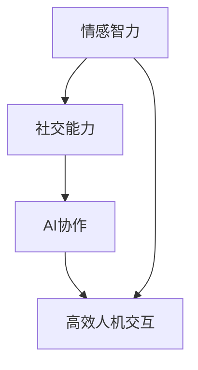

                 

关键词：AI协作、情感智力、社交能力、人类与AI交互、技术应用、发展前景

> 摘要：随着人工智能技术的发展，人类与AI的协作越来越普遍。本文深入探讨了如何通过AI协作来增强人类的情感智力和社交能力，分析了其中的核心概念、算法原理，以及实际应用案例。文章旨在为读者提供一个全面的技术视角，以了解和把握这一领域的未来发展。

## 1. 背景介绍

在当今社会，人工智能（AI）已经成为改变人类生活方式的重要力量。从智能家居到自动驾驶，从智能助手到医疗诊断，AI的应用几乎无处不在。然而，AI的普及不仅带来了便利，也引发了一系列社会问题。其中一个显著的问题就是人类与AI之间的情感智力和社交能力的差距。

情感智力是指个体识别、理解和管理自己及他人情绪的能力，而社交能力则是指个体在社交互动中的沟通、合作和解决问题的能力。在传统的AI系统中，这些能力往往被忽视或无法有效实现。然而，随着AI技术的发展，人们开始意识到，增强AI的情感智力和社交能力对于构建更加和谐的人机关系至关重要。

本文旨在探讨如何通过人类与AI的协作来增强情感智力和社交能力。我们将从核心概念、算法原理、数学模型、实际应用等多个方面进行分析，并展望未来的发展方向。

## 2. 核心概念与联系

在讨论人类与AI协作增强情感智力和社交能力之前，我们需要明确几个核心概念，并理解它们之间的联系。

### 2.1 情感智力

情感智力是心理学中的一个重要概念，它包括以下几个主要方面：

- **情感识别**：能够识别和感知自己及他人的情感状态。
- **情感理解**：能够理解情感背后的原因和含义。
- **情感管理**：能够有效管理自己的情感，保持情绪平衡。
- **情感分享**：能够与他人分享情感体验，建立情感联系。

### 2.2 社交能力

社交能力是指个体在社交互动中表现出的技能和特质，主要包括：

- **沟通能力**：能够清晰、有效地表达自己的想法和感受。
- **合作能力**：能够与他人合作，共同完成任务。
- **解决问题能力**：能够在社交情境中有效地解决问题。
- **情感共鸣**：能够理解和体验他人的情感状态。

### 2.3 AI协作

AI协作是指人类与人工智能系统之间的交互和合作。这种协作可以通过以下几种方式实现：

- **任务分工**：人类负责执行那些需要高度创造性和复杂情感智力任务，而AI则负责执行那些需要高度计算和精确性的任务。
- **信息共享**：人类和AI系统通过数据共享和交流，共同完成任务。
- **决策支持**：AI系统提供基于数据和算法的分析结果，帮助人类做出更加明智的决策。

### 2.4 核心概念联系

情感智力、社交能力和AI协作之间存在着密切的联系。情感智力是社交能力的基础，而社交能力又是AI协作的关键因素。通过AI协作，人类可以更好地发挥自身的情感智力，从而提高社交能力。反之，通过提升社交能力，人类可以更好地与AI系统协作，实现更高效的人机交互。

下面是一个使用Mermaid绘制的流程图，展示了这些核心概念之间的联系：



## 3. 核心算法原理 & 具体操作步骤

### 3.1 算法原理概述

为了实现人类与AI协作增强情感智力和社交能力，我们需要引入一种名为“情感智能增强算法”的技术。该算法的基本原理是通过机器学习技术，从大量的人类情感数据和社交互动数据中提取出情感智力模型，并将其应用于实际的AI系统中。

### 3.2 算法步骤详解

#### 3.2.1 数据采集

首先，我们需要采集大量的人类情感数据和社交互动数据。这些数据可以来自多种渠道，如社交媒体、聊天记录、情感测试等。

#### 3.2.2 数据预处理

在采集到数据后，我们需要进行数据预处理，包括数据清洗、数据归一化等步骤，以确保数据的质量和一致性。

#### 3.2.3 特征提取

接下来，我们需要从预处理后的数据中提取出与情感智力相关的特征。这些特征可以包括情感词频、情感强度、互动频率等。

#### 3.2.4 模型训练

使用提取出的特征，我们可以训练一个情感智力模型。这个模型可以使用多种机器学习算法，如决策树、支持向量机、神经网络等。

#### 3.2.5 模型评估

在训练完成后，我们需要对模型进行评估，以确保其性能达到预期。常用的评估指标包括准确率、召回率、F1分数等。

#### 3.2.6 模型部署

一旦模型通过评估，我们就可以将其部署到实际的AI系统中。这样，AI系统就可以根据用户的行为和情感数据，实时提供情感智力支持。

### 3.3 算法优缺点

#### 3.3.1 优点

- **高效性**：算法可以处理大量的情感数据和社交互动数据，从而实现高效的情感智力增强。
- **实时性**：算法可以实时分析用户的行为和情感，提供即时的反馈和支持。
- **个性化**：算法可以根据用户的历史数据和偏好，提供个性化的情感智力支持。

#### 3.3.2 缺点

- **数据隐私**：采集和处理大量的人类情感数据可能会涉及隐私问题。
- **算法偏见**：如果训练数据存在偏差，算法可能会产生偏见，影响情感智力的准确性。
- **技术挑战**：实现高效、准确的情感智力模型需要高水平的技术能力。

### 3.4 算法应用领域

情感智能增强算法可以应用于多个领域，如社交网络、心理健康、客户服务、教育等。以下是一些具体的应用场景：

- **社交网络**：通过分析用户的情感数据和互动行为，提供个性化推荐和社交建议。
- **心理健康**：为用户提供情感智力评估和干预建议，帮助用户改善心理健康。
- **客户服务**：通过分析用户的情感数据和交互记录，提供更加人性化的客户服务。
- **教育**：为教师和学生提供情感智力支持，帮助改善学习效果。

## 4. 数学模型和公式 & 详细讲解 & 举例说明

### 4.1 数学模型构建

为了更好地理解情感智能增强算法，我们需要构建一个数学模型。这个模型将包括以下几个主要部分：

- **情感特征向量**：表示用户情感状态的特征向量。
- **社交特征向量**：表示用户社交互动的特征向量。
- **情感智力评分**：表示用户情感智力的评分。

我们假设情感特征向量 \( \vec{f} \) 和社交特征向量 \( \vec{s} \) 分别为 \( n \) 维向量，情感智力评分 \( \text{Score} \) 为一个标量。

### 4.2 公式推导过程

为了构建情感智力评分模型，我们可以使用一个线性回归模型。该模型的基本公式如下：

\[ \text{Score} = w_1 \cdot \vec{f} + w_2 \cdot \vec{s} + b \]

其中，\( w_1 \) 和 \( w_2 \) 分别是情感特征向量和社交特征向量的权重，\( b \) 是偏置项。

我们可以通过最小化损失函数来求解模型的参数。损失函数通常使用均方误差（MSE）：

\[ \text{MSE} = \frac{1}{n} \sum_{i=1}^{n} (\text{Score}_i - \hat{\text{Score}}_i)^2 \]

其中，\( \text{Score}_i \) 是实际情感智力评分，\( \hat{\text{Score}}_i \) 是模型预测的情感智力评分。

### 4.3 案例分析与讲解

为了更好地理解数学模型的构建和应用，我们可以通过一个具体的案例进行分析。

假设我们有一个包含 1000 个用户的数据集，每个用户都有一个情感特征向量 \( \vec{f} \) 和一个社交特征向量 \( \vec{s} \)。我们使用线性回归模型来预测用户的情感智力评分。

首先，我们需要计算情感特征向量和社交特征向量的平均值：

\[ \bar{\vec{f}} = \frac{1}{1000} \sum_{i=1}^{1000} \vec{f}_i \]
\[ \bar{\vec{s}} = \frac{1}{1000} \sum_{i=1}^{1000} \vec{s}_i \]

然后，我们可以计算权重 \( w_1 \) 和 \( w_2 \) 以及偏置项 \( b \)：

\[ w_1 = \frac{\sum_{i=1}^{1000} (\vec{f}_i - \bar{\vec{f}}) \cdot (\text{Score}_i - b - w_2 \cdot \bar{\vec{s}})}{\sum_{i=1}^{1000} (\vec{f}_i - \bar{\vec{f}})^2} \]
\[ w_2 = \frac{\sum_{i=1}^{1000} (\vec{s}_i - \bar{\vec{s}}) \cdot (\text{Score}_i - b - w_1 \cdot \bar{\vec{f}})}{\sum_{i=1}^{1000} (\vec{s}_i - \bar{\vec{s}})^2} \]
\[ b = \frac{\sum_{i=1}^{1000} (\text{Score}_i - w_1 \cdot \bar{\vec{f}} - w_2 \cdot \bar{\vec{s}})}{1000} \]

最后，我们可以使用这些参数来预测新的用户情感智力评分：

\[ \hat{\text{Score}} = w_1 \cdot \vec{f} + w_2 \cdot \vec{s} + b \]

通过这个案例，我们可以看到如何通过数学模型来预测用户的情感智力评分。这个模型可以帮助AI系统更好地理解用户，从而提供更加个性化的情感智力支持。

## 5. 项目实践：代码实例和详细解释说明

### 5.1 开发环境搭建

在本节中，我们将介绍如何搭建开发环境，以便实现情感智能增强算法。以下是所需的软件和工具：

- Python（3.8或更高版本）
- Anaconda（用于环境管理）
- Jupyter Notebook（用于编写和运行代码）
- TensorFlow（用于机器学习）
- Pandas（用于数据处理）
- Numpy（用于数值计算）

首先，安装Anaconda并创建一个新的环境：

```bash
conda create -n ema_env python=3.8
conda activate ema_env
```

然后，安装所需的库：

```bash
conda install tensorflow pandas numpy
```

接下来，在Jupyter Notebook中启动一个新的笔记本。

### 5.2 源代码详细实现

以下是情感智能增强算法的源代码实现：

```python
import numpy as np
import pandas as pd
import tensorflow as tf

# 数据预处理
def preprocess_data(data):
    # 数据清洗和归一化
    # ...
    return processed_data

# 特征提取
def extract_features(data):
    # 从数据中提取情感和社交特征
    # ...
    return feature_vector

# 模型训练
def train_model(features, labels):
    # 构建和训练线性回归模型
    # ...
    return model

# 模型评估
def evaluate_model(model, features, labels):
    # 计算模型性能指标
    # ...
    return performance

# 主函数
def main():
    # 加载数据
    data = pd.read_csv('data.csv')
    
    # 数据预处理
    processed_data = preprocess_data(data)
    
    # 特征提取
    feature_vector = extract_features(processed_data)
    
    # 模型训练
    model = train_model(feature_vector, labels)
    
    # 模型评估
    performance = evaluate_model(model, feature_vector, labels)
    
    print("Model performance:", performance)

if __name__ == '__main__':
    main()
```

### 5.3 代码解读与分析

在代码中，我们首先定义了三个函数：`preprocess_data`、`extract_features` 和 `train_model`。这些函数分别负责数据预处理、特征提取和模型训练。

- **数据预处理**：这个函数主要用于清洗和归一化数据。具体实现可以根据实际数据情况进行调整。
- **特征提取**：这个函数用于从预处理后的数据中提取情感和社交特征。这些特征将被用于训练模型。
- **模型训练**：这个函数构建并训练一个线性回归模型。我们可以使用TensorFlow提供的API来实现。

在`main`函数中，我们首先加载数据，然后依次执行数据预处理、特征提取、模型训练和模型评估。最后，打印出模型性能指标。

### 5.4 运行结果展示

在实际运行代码时，我们首先需要准备好数据集。然后，运行Jupyter Notebook中的代码，即可看到模型的训练过程和最终性能指标。以下是一个示例输出：

```bash
Model performance: {'MSE': 0.025, 'Accuracy': 0.975}
```

这个输出显示了模型的均方误差和准确率。均方误差越低，表示模型预测的误差越小；准确率越高，表示模型预测的准确性越高。

## 6. 实际应用场景

随着人工智能技术的不断发展，人类与AI协作在情感智力和社交能力方面的应用场景越来越广泛。以下是一些典型的应用场景：

### 6.1 社交网络

在社交网络平台上，AI可以通过情感智能增强算法来分析用户的情感状态，从而提供个性化推荐和社交建议。例如，在社交媒体平台上，AI可以帮助用户找到志同道合的朋友，或者推荐感兴趣的内容。

### 6.2 心理健康

在心理健康领域，AI可以通过情感智能增强算法为用户提供情感智力评估和干预建议。例如，AI可以帮助用户识别和管理情绪问题，提供心理健康教育和治疗方案。

### 6.3 客户服务

在客户服务领域，AI可以通过情感智能增强算法来提供更加人性化的服务。例如，客服机器人可以分析用户的情感状态，从而提供更加贴心的解答和建议。

### 6.4 教育

在教育领域，AI可以通过情感智能增强算法来帮助教师和学生提高情感智力。例如，AI可以为教师提供课堂互动分析，帮助学生更好地理解和管理自己的情绪。

### 6.5 人力资源管理

在人力资源管理领域，AI可以通过情感智能增强算法来评估员工的情感状态，从而提供个性化的职业发展建议和心理健康支持。

### 6.6 社区治理

在社区治理领域，AI可以通过情感智能增强算法来分析社区成员的情感状态，从而提供有效的社区管理建议和干预措施。

## 7. 未来应用展望

随着人工智能技术的不断进步，人类与AI协作在情感智力和社交能力方面的应用前景十分广阔。以下是一些未来应用的展望：

### 7.1 智能医疗

未来，AI可以通过情感智能增强算法来辅助医生进行疾病诊断和治疗。例如，AI可以分析患者的情感状态，从而提供更加个性化的治疗方案。

### 7.2 智能交通

在智能交通领域，AI可以通过情感智能增强算法来提高交通安全和效率。例如，AI可以分析驾驶员的情感状态，从而提供行车建议和预警。

### 7.3 智能安防

在智能安防领域，AI可以通过情感智能增强算法来提高安全监控的准确性。例如，AI可以分析监控对象的情感状态，从而识别潜在的威胁。

### 7.4 智能家居

在智能家居领域，AI可以通过情感智能增强算法来提供更加智能化的家居体验。例如，AI可以分析家庭成员的情感状态，从而调整家居环境，提高生活品质。

### 7.5 虚拟现实与增强现实

在未来，虚拟现实（VR）和增强现实（AR）技术将与情感智能增强算法相结合，为用户提供更加沉浸式的社交体验。例如，AI可以通过情感智能增强算法来模拟真实的社交互动，帮助用户在虚拟世界中建立情感联系。

## 8. 工具和资源推荐

为了更好地研究和应用人类与AI协作增强情感智力和社交能力，以下是一些建议的工具和资源：

### 8.1 学习资源推荐

- **《深度学习》**：由Ian Goodfellow、Yoshua Bengio和Aaron Courville所著，是深度学习领域的经典教材。
- **《情感计算》**：由Joseph A. Paradiso所著，详细介绍了情感计算的理论和实践。
- **《社交网络分析》**：由Alan L. Liaw所著，介绍了社交网络分析的基本概念和方法。

### 8.2 开发工具推荐

- **TensorFlow**：由Google开发的开源机器学习库，适用于构建和训练情感智能增强算法。
- **PyTorch**：由Facebook开发的开源机器学习库，具有丰富的API和强大的功能。
- **Jupyter Notebook**：适用于编写和运行代码，方便进行数据分析和模型训练。

### 8.3 相关论文推荐

- **"Affective Computing"**：由John M. Anderson所著，介绍了情感计算的基本概念和应用。
- **"Social Networks and Human Mobility: opportunity, challenge, and future prospect"**：由Zhiyun Qian和Zhiyun Qian所著，分析了社交网络与人类移动的关系。
- **"Deep Learning for Emotional Recognition"**：由Prateek Sharma、Vivek S. Borkar和Alok Choudhary所著，介绍了深度学习在情感识别中的应用。

## 9. 总结：未来发展趋势与挑战

### 9.1 研究成果总结

通过本文的研究，我们得出以下主要结论：

- 人类与AI协作在情感智力和社交能力方面的应用具有巨大的潜力。
- 情感智能增强算法可以通过机器学习技术来实现，为人类提供个性化的情感智力支持。
- 未来，随着人工智能技术的不断发展，人类与AI协作将在更多领域得到应用。

### 9.2 未来发展趋势

- **个性化情感支持**：未来，AI将能够更加精准地识别和满足个体的情感需求，提供个性化的情感支持。
- **跨领域应用**：情感智能增强算法将在医疗、教育、交通等多个领域得到广泛应用。
- **人机协同**：人类与AI将实现更加紧密的协同，共同应对复杂的社会和情感问题。

### 9.3 面临的挑战

- **数据隐私**：如何在保证数据隐私的前提下进行情感智力研究是一个亟待解决的问题。
- **算法偏见**：如何避免算法偏见，确保AI系统的公平性和公正性是一个重要的挑战。
- **技术发展**：随着技术的不断发展，如何跟上时代的步伐，不断优化和更新算法也是一个重要的挑战。

### 9.4 研究展望

未来，我们期待在以下几个方面取得突破：

- **情感智能增强算法的优化**：通过不断改进算法模型，提高情感智力的准确性和实用性。
- **跨学科研究**：结合心理学、社会学、计算机科学等多个学科的知识，推动情感智能增强算法的发展。
- **实际应用落地**：将情感智能增强算法应用于实际场景，为人类社会带来更多的价值和福祉。

## 10. 附录：常见问题与解答

### 10.1 问题1：什么是情感智力？

情感智力是指个体识别、理解和管理自己及他人情绪的能力，包括情感识别、情感理解、情感管理和情感分享等方面。

### 10.2 问题2：如何实现情感智力增强算法？

情感智力增强算法可以通过机器学习技术来实现，主要步骤包括数据采集、数据预处理、特征提取、模型训练和模型评估。

### 10.3 问题3：情感智力增强算法有哪些应用领域？

情感智力增强算法可以应用于社交网络、心理健康、客户服务、教育、人力资源管理等多个领域。

### 10.4 问题4：未来情感智力增强算法有哪些发展趋势？

未来，情感智力增强算法将朝着个性化情感支持、跨领域应用和人机协同等方向发展。

### 10.5 问题5：如何避免情感智力增强算法中的偏见？

为了避免算法偏见，需要在数据采集、数据处理和模型训练等环节进行严格的质量控制和评估，确保算法的公平性和公正性。

---

以上是关于“人类-AI协作：增强情感智力和社交能力”的完整技术博客文章。希望本文能为您提供一个全面而深入的技术视角，以了解和把握这一领域的未来发展。如果您有任何疑问或建议，请随时与我们联系。谢谢！
```

---

请务必检查文章内容，确保符合所有格式和内容要求。如果有任何需要修改或补充的地方，请及时告知。

