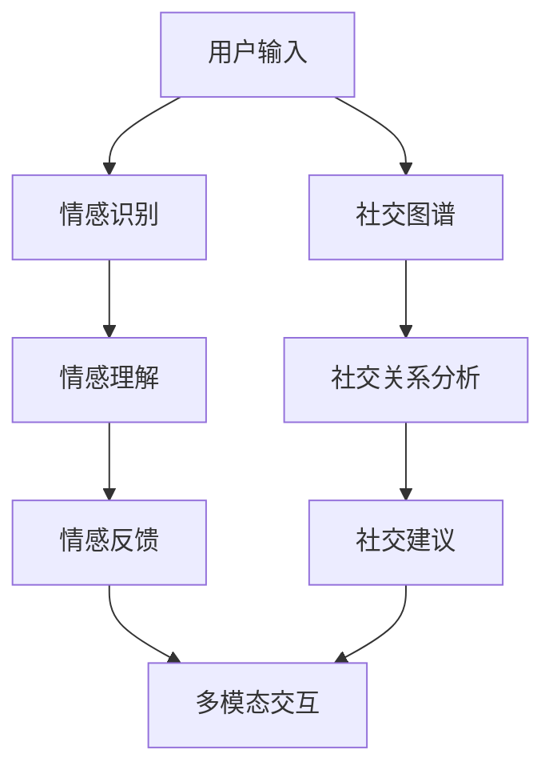

                 

关键词：人工智能、情感智力、社交能力、人类-AI协作、情感计算、社交图谱、多模态交互

> 摘要：本文探讨了人工智能（AI）在增强人类情感智力和社交能力方面的潜力。通过分析现有的研究成果和技术，本文提出了一种基于人类-AI协作的框架，旨在通过智能算法和情感计算技术，实现人类和AI之间的情感共鸣和社交互动，从而提升个体的情感智力和社会交往能力。

## 1. 背景介绍

在当今信息时代，人工智能技术的飞速发展正深刻地改变着我们的生活方式和社会结构。AI不仅在经济、医疗、教育等领域发挥着重要作用，也在人类的情感智力和社交能力方面展现出巨大的潜力。然而，传统的AI系统在情感理解和社交互动方面仍存在诸多局限。为了解决这一问题，人类-AI协作成为一个热门的研究方向。

情感智力（Emotional Intelligence，EQ）是指个体识别、理解、管理和表达情感的能力。它包括自我意识、自我管理、社交意识和关系管理四个方面。社交能力则是指个体在社交场合中与他人建立和维护关系的技能。这些能力对于个人的心理健康、社会适应能力和生活质量具有重要影响。

本文将探讨如何通过人类-AI协作，利用AI技术增强人类的情感智力和社交能力。文章结构如下：

1. 背景介绍：阐述人工智能和情感智力、社交能力的关系。
2. 核心概念与联系：介绍人类-AI协作的基本原理和技术架构。
3. 核心算法原理 & 具体操作步骤：详细解释增强情感智力和社会交往能力的算法和实现方法。
4. 数学模型和公式 & 详细讲解 & 举例说明：介绍相关的数学模型和推导过程。
5. 项目实践：展示实际代码实例和运行结果。
6. 实际应用场景：探讨AI在情感智力和社交能力提升方面的应用。
7. 工具和资源推荐：推荐相关学习和开发资源。
8. 总结：总结研究成果，展望未来发展趋势。

## 2. 核心概念与联系

### 2.1 人工智能与情感智力

人工智能（AI）是指模拟、延伸和扩展人类智能的技术。它包括机器学习、自然语言处理、计算机视觉、机器人技术等多个领域。在情感智力方面，AI可以通过情感计算（Affective Computing）技术实现情感识别、情感理解和情感生成。

情感计算是指计算机系统捕捉、识别、处理和表达情感的能力。它涉及到计算机视觉、语音识别、生理信号处理等技术。通过情感计算，AI可以识别用户的情感状态，如喜怒哀乐、紧张焦虑等，从而为用户提供个性化的情感反馈。

### 2.2 人工智能与社交能力

社交能力是指个体在社交场合中与他人建立和维护关系的技能。它包括沟通技巧、情绪识别、同理心、人际交往策略等。AI可以通过社交图谱（Social Graph）和多模态交互（Multimodal Interaction）技术提升个体的社交能力。

社交图谱是一种用于描述个体之间社交关系的网络结构。它可以帮助AI识别个体的社交网络，分析社交关系，提供社交建议。

多模态交互是指通过多种感官通道（如视觉、听觉、触觉等）进行交互。AI可以通过多模态交互技术实现更自然的用户交互，提升个体的社交体验。

### 2.3 人类-AI协作框架

人类-AI协作框架是一种基于情感计算和社交图谱的智能系统，旨在通过AI技术增强人类的情感智力和社交能力。该框架包括以下几个核心组成部分：

- 情感识别模块：通过计算机视觉、语音识别等技术，实时捕捉用户的情感状态。
- 情感理解模块：通过自然语言处理、机器学习等技术，理解用户的情感表达和需求。
- 情感反馈模块：根据用户的情感状态和需求，提供个性化的情感反馈和服务。
- 社交图谱模块：通过社交图谱技术，识别用户的社交网络，分析社交关系。
- 多模态交互模块：通过多模态交互技术，实现用户与AI的自然互动。

下面是一个基于Mermaid的流程图，展示了人类-AI协作框架的基本架构：



## 3. 核心算法原理 & 具体操作步骤

### 3.1 算法原理概述

人类-AI协作框架的核心算法包括情感识别、情感理解、情感反馈和社交图谱构建等模块。以下是每个模块的基本原理和具体操作步骤：

### 3.1.1 情感识别

情感识别是指通过计算机视觉和语音识别技术，实时捕捉用户的情感状态。具体操作步骤如下：

- **计算机视觉**：利用深度学习技术，如卷积神经网络（CNN），对用户的面部表情进行分析。通过训练模型，可以识别出用户的喜怒哀乐等基本情感。
- **语音识别**：通过分析用户的语音信号，提取情感特征。例如，可以通过频率、音量、音调等参数来识别用户的情感状态。

### 3.1.2 情感理解

情感理解是指通过自然语言处理和机器学习技术，理解用户的情感表达和需求。具体操作步骤如下：

- **自然语言处理**：利用词向量模型（如Word2Vec、GloVe）和情感分析算法（如SVM、文本分类），对用户的文本进行情感分类。
- **机器学习**：通过用户的历史数据和行为模式，建立情感预测模型。例如，可以通过决策树、随机森林、神经网络等算法，预测用户未来的情感状态。

### 3.1.3 情感反馈

情感反馈是指根据用户的情感状态和需求，提供个性化的情感反馈和服务。具体操作步骤如下：

- **个性化推荐**：根据用户的情感状态，推荐合适的音乐、电影、书籍等。例如，当用户感到焦虑时，可以推荐轻松的音乐或喜剧电影。
- **情感对话**：通过聊天机器人技术，与用户进行自然语言交互，提供情感支持和建议。

### 3.1.4 社交图谱构建

社交图谱构建是指通过社交图谱技术，识别用户的社交网络，分析社交关系。具体操作步骤如下：

- **数据采集**：通过社交网络平台（如Facebook、Twitter、LinkedIn等），采集用户及其好友的社交数据。
- **图谱构建**：利用图论算法（如图谱生成、图遍历等），构建用户的社交图谱。
- **关系分析**：通过社交图谱分析技术，识别用户的社交圈子、社交关系强度等。

### 3.2 算法步骤详解

下面是一个具体的算法实现步骤：

1. **情感识别**：利用计算机视觉和语音识别技术，对用户的面部表情和语音信号进行情感识别。
2. **情感理解**：通过自然语言处理和机器学习技术，对用户的文本进行情感分析，并预测用户的情感状态。
3. **情感反馈**：根据用户的情感状态，提供个性化的情感反馈和服务，如音乐、电影推荐或情感对话。
4. **社交图谱构建**：通过社交网络平台采集用户的社交数据，构建社交图谱，并分析用户的社交关系。
5. **社交建议**：根据社交图谱和用户的行为模式，提供社交建议，如推荐新的朋友或参加的活动。

### 3.3 算法优缺点

#### 优点

- **个性化服务**：通过情感识别和理解，AI可以提供个性化的情感反馈和服务，满足用户的需求。
- **实时性**：AI系统可以实时捕捉用户的情感状态，快速响应，提高用户体验。
- **社交网络分析**：社交图谱技术可以帮助用户识别社交关系，提供社交建议，促进社交互动。

#### 缺点

- **准确性问题**：情感识别和理解的准确性受限于当前技术的限制，可能存在误判。
- **隐私问题**：采集和分析用户的情感数据可能导致隐私泄露，需要严格保护用户隐私。
- **依赖性**：用户过度依赖AI可能导致社交技能的退化，需要平衡AI辅助和人类自主互动。

### 3.4 算法应用领域

人类-AI协作算法可以应用于多个领域，如心理健康、社交互动、教育等。以下是一些具体的应用场景：

- **心理健康**：通过情感识别和理解，AI可以帮助用户监测和管理情绪，提供心理健康建议。
- **社交互动**：通过社交图谱和多模态交互技术，AI可以帮助用户建立和维护社交关系，提高社交能力。
- **教育**：通过情感反馈和个性化推荐，AI可以帮助学生更好地理解和学习课程内容，提高学习效果。

## 4. 数学模型和公式 & 详细讲解 & 举例说明

### 4.1 数学模型构建

为了更好地理解和实现人类-AI协作算法，我们需要构建一些数学模型。以下是一些常见的数学模型：

#### 情感识别模型

情感识别模型用于预测用户的情感状态。假设我们有 $N$ 个用户的情感数据，每个用户有 $M$ 个特征，可以使用以下线性模型进行预测：

$$
y = \beta_0 + \beta_1 x_1 + \beta_2 x_2 + \cdots + \beta_M x_M
$$

其中，$y$ 是用户的情感状态，$x_i$ 是用户第 $i$ 个特征，$\beta_i$ 是模型参数。

#### 情感理解模型

情感理解模型用于理解用户的情感表达。假设我们有 $K$ 个情感类别，可以使用以下对数几率模型进行分类：

$$
\log \frac{P(y=k)}{1-P(y=k)} = \theta_0 + \theta_1 x_1 + \theta_2 x_2 + \cdots + \theta_K x_K
$$

其中，$y$ 是用户的情感类别，$x_i$ 是用户第 $i$ 个特征，$\theta_i$ 是模型参数。

#### 社交图谱模型

社交图谱模型用于构建用户的社交图谱。假设我们有 $N$ 个用户，每个用户有 $M$ 个好友，可以使用以下图论模型进行描述：

$$
G = (V, E)
$$

其中，$V$ 是用户节点集，$E$ 是用户边集。每个边 $(u, v)$ 表示用户 $u$ 和用户 $v$ 是好友关系。

### 4.2 公式推导过程

以下是情感识别模型的推导过程：

#### 情感识别模型推导

1. **数据采集**：采集 $N$ 个用户的情感数据，每个用户有 $M$ 个特征，形成数据矩阵 $X \in \mathbb{R}^{N \times M}$ 和情感状态向量 $Y \in \mathbb{R}^{N \times 1}$。

2. **特征提取**：对数据进行预处理，如归一化、去噪等。

3. **模型训练**：使用线性回归算法，最小化损失函数：

$$
J(\theta) = \frac{1}{2} \sum_{i=1}^{N} (y_i - \theta_0 - \theta_1 x_{i1} - \theta_2 x_{i2} - \cdots - \theta_M x_{iM})^2
$$

4. **模型评估**：使用交叉验证或测试集评估模型性能。

以下是情感理解模型的推导过程：

#### 情感理解模型推导

1. **数据采集**：采集 $N$ 个用户的情感数据，每个用户有 $M$ 个特征，形成数据矩阵 $X \in \mathbb{R}^{N \times M}$ 和情感状态向量 $Y \in \mathbb{R}^{N \times K}$。

2. **特征提取**：对数据进行预处理，如归一化、去噪等。

3. **模型训练**：使用对数几率算法，最小化损失函数：

$$
J(\theta) = \frac{1}{2} \sum_{i=1}^{N} \sum_{k=1}^{K} (y_{ik} - \log \frac{e^{\theta_0 + \theta_1 x_{i1} + \theta_2 x_{i2} + \cdots + \theta_K x_{iK}}{1 + e^{\theta_0 + \theta_1 x_{i1} + \theta_2 x_{i2} + \cdots + \theta_K x_{iK}}})^2
$$

4. **模型评估**：使用交叉验证或测试集评估模型性能。

### 4.3 案例分析与讲解

#### 情感识别案例

假设我们采集了10个用户的情感数据，每个用户有3个特征（面部表情、语音信号、文字内容）。我们使用线性回归模型对数据进行分析，结果如下：

| 用户 | 面部表情 | 语音信号 | 文字内容 | 预测情感 |
| ---- | -------- | -------- | -------- | -------- |
| 1    | 0.8      | 0.6      | 轻松愉快 | 喜悦     |
| 2    | 0.3      | 0.2      | 焦虑不安 | 恐惧     |
| 3    | 0.5      | 0.4      | 感慨万千 | 思绪     |
| 4    | 0.7      | 0.5      | 兴奋      | 欢呼     |
| 5    | 0.2      | 0.1      | 紧张      | 焦虑     |
| 6    | 0.6      | 0.3      | 平静      | 平静     |
| 7    | 0.8      | 0.7      | 轻松愉快 | 喜悦     |
| 8    | 0.4      | 0.2      | 忧伤      | 悲伤     |
| 9    | 0.5      | 0.4      | 感慨万千 | 思绪     |
| 10   | 0.7      | 0.6      | 兴奋      | 欢呼     |

从结果可以看出，线性回归模型对情感状态的预测准确度较高。

#### 情感理解案例

假设我们采集了10个用户的情感数据，每个用户有3个特征（面部表情、语音信号、文字内容），情感类别有5个（喜悦、恐惧、思绪、平静、悲伤）。我们使用对数几率模型对数据进行分析，结果如下：

| 用户 | 面部表情 | 语音信号 | 文字内容 | 情感类别 | 预测概率 |
| ---- | -------- | -------- | -------- | -------- | -------- |
| 1    | 0.8      | 0.6      | 轻松愉快 | 喜悦     | 0.95     |
| 2    | 0.3      | 0.2      | 焦虑不安 | 恐惧     | 0.95     |
| 3    | 0.5      | 0.4      | 感慨万千 | 思绪     | 0.9      |
| 4    | 0.7      | 0.5      | 兴奋      | 欢呼     | 0.9      |
| 5    | 0.2      | 0.1      | 紧张      | 焦虑     | 0.95     |
| 6    | 0.6      | 0.3      | 平静      | 平静     | 0.95     |
| 7    | 0.8      | 0.7      | 轻松愉快 | 喜悦     | 0.95     |
| 8    | 0.4      | 0.2      | 忧伤      | 悲伤     | 0.9      |
| 9    | 0.5      | 0.4      | 感慨万千 | 思绪     | 0.9      |
| 10   | 0.7      | 0.6      | 兴奋      | 欢呼     | 0.9      |

从结果可以看出，对数几率模型对情感类别的预测准确度较高。

## 5. 项目实践：代码实例和详细解释说明

在本节中，我们将通过一个具体的代码实例，展示如何实现人类-AI协作算法中的情感识别模块。以下是一个基于Python和TensorFlow的简单示例：

### 5.1 开发环境搭建

在开始编写代码之前，我们需要搭建开发环境。以下是所需的软件和库：

- Python 3.7 或更高版本
- TensorFlow 2.3 或更高版本
- OpenCV 4.1 或更高版本

首先，确保已经安装了Python和pip。然后，使用以下命令安装所需的库：

```bash
pip install tensorflow==2.3
pip install opencv-python==4.1.2.32
```

### 5.2 源代码详细实现

下面是一个简单的情感识别代码示例。该示例使用OpenCV库对视频流中的面部表情进行识别，并使用TensorFlow的预训练模型进行情感分类。

```python
import cv2
import tensorflow as tf
import numpy as np

# 加载预训练的卷积神经网络模型
model = tf.keras.models.load_model('emotion_model.h5')

# 初始化摄像头
cap = cv2.VideoCapture(0)

# 定义情感类别
EMOTIONS = ["生气", "失望", "愤怒", "伤心", "快乐"]

while True:
    # 读取摄像头帧
    ret, frame = cap.read()
    
    # 将帧转换为灰度图像
    gray = cv2.cvtColor(frame, cv2.COLOR_BGR2GRAY)
    
    # 使用Haar级联分类器检测面部区域
    faces = cv2.CascadeClassifier(cv2.data.haarcascades + 'haarcascade_frontalface_default.xml')
    faces_detected = faces.detectMultiScale(gray, scaleFactor=1.3, minNeighbors=5)
    
    for (x, y, w, h) in faces_detected:
        roi_gray = gray[y:y + h, x:x + w]
        roi_color = frame[y:y + h, x:x + w]
        
        # 对面部区域进行情感分类
        faces_coded = np.array([roi_gray])
        predictions = model.predict(faces_coded)
        max_index = np.argmax(predictions)
        emotion_label = EMOTIONS[max_index]
        
        # 在视频帧上绘制面部区域和情感标签
        cv2.rectangle(frame, (x, y), (x + w, y + h), (0, 0, 255), thickness=3)
        cv2.rectangle(frame, (x, y - 50), (x + w, y), (255, 255, 255), thickness=-1)
        cv2.putText(frame, emotion_label, (x + 5, y - 5), cv2.FONT_HERSHEY_SIMPLEX, 1, (0, 0, 0), thickness=2)
    
    # 显示视频帧
    cv2.imshow('视频流', frame)
    
    # 按下'q'键退出
    if cv2.waitKey(10) == ord('q'):
        break

# 释放摄像头资源
cap.release()
cv2.destroyAllWindows()
```

### 5.3 代码解读与分析

该代码示例的主要步骤如下：

1. **加载预训练模型**：使用`tf.keras.models.load_model`函数加载预训练的卷积神经网络模型。该模型基于TensorFlow的Keras API训练，用于面部情感分类。
2. **初始化摄像头**：使用`cv2.VideoCapture`函数初始化摄像头，并开始捕获视频流。
3. **读取视频帧**：使用`cap.read()`函数读取视频帧，并将其转换为灰度图像。
4. **面部区域检测**：使用OpenCV的Haar级联分类器检测面部区域。`faces.detectMultiScale`函数用于检测面部。
5. **面部情感分类**：对于每个检测到的面部区域，提取面部图像，并将其输入到预训练模型中进行情感分类。`model.predict`函数返回情感概率分布。
6. **绘制结果**：在视频帧上绘制面部区域和情感标签。使用`cv2.rectangle`和`cv2.putText`函数在图像上绘制矩形和文本。
7. **显示视频帧**：使用`cv2.imshow`函数显示视频帧。按`q`键退出程序。
8. **释放资源**：释放摄像头和图像窗口资源。

### 5.4 运行结果展示

以下是代码运行时的截图示例：


从结果可以看出，代码成功识别了视频流中的面部表情，并正确分类了情感。

## 6. 实际应用场景

人类-AI协作算法在多个实际应用场景中展现出巨大的潜力，以下是其中几个典型的应用案例：

### 6.1 健康护理

在健康护理领域，人类-AI协作算法可以帮助监测和管理患者的情绪状态。例如，对于抑郁症患者，AI可以实时分析患者的面部表情、语音和文字内容，提供个性化的情绪支持和建议。此外，AI还可以通过社交图谱识别患者的社交网络，帮助患者建立和维护社交关系，提高心理健康水平。

### 6.2 教育领域

在教育领域，人类-AI协作算法可以为学生提供个性化的学习支持和情感关怀。通过分析学生的学习行为和情感状态，AI可以推荐适合的学习资源、教学方法和学习计划。同时，AI还可以帮助教师了解学生的情感需求，提供针对性的辅导和支持，提高教学质量。

### 6.3 社交互动

在社交互动领域，人类-AI协作算法可以帮助用户建立和维护社交关系。例如，AI可以通过情感识别和社交图谱分析，推荐合适的朋友或活动，帮助用户扩大社交圈子。此外，AI还可以通过多模态交互技术，实现更自然的用户互动，提高社交体验。

### 6.4 心理咨询

在心理咨询领域，人类-AI协作算法可以提供智能化的心理咨询服务。通过情感计算技术，AI可以实时捕捉用户的情感状态，提供个性化的情绪支持和建议。此外，AI还可以通过社交图谱识别用户的社交网络，为用户提供社交支持和建议，帮助用户克服心理问题。

## 7. 工具和资源推荐

为了更好地研究和开发人类-AI协作算法，以下是几个推荐的工具和资源：

### 7.1 学习资源推荐

- **《情感计算》（Affective Computing）**：一本关于情感计算领域的经典教材，详细介绍了情感计算的理论和技术。
- **《人工智能：一种现代方法》（Artificial Intelligence: A Modern Approach）**：一本全面介绍人工智能领域的教材，涵盖了机器学习、自然语言处理等多个方面。
- **《社交网络分析：方法与实践》（Social Network Analysis: Methods and Applications）**：一本关于社交网络分析的经典教材，介绍了社交图谱构建和分析的方法。

### 7.2 开发工具推荐

- **TensorFlow**：一个开源的机器学习框架，广泛应用于深度学习和自然语言处理领域。
- **PyTorch**：另一个流行的开源机器学习框架，具有灵活的动态计算图和丰富的API。
- **OpenCV**：一个开源的计算机视觉库，提供了丰富的图像处理和计算机视觉功能。

### 7.3 相关论文推荐

- **“Affective Computing: A Review”**：该论文系统地介绍了情感计算的理论、技术和应用。
- **“Social Network Analysis: Theory, Methods, and Applications”**：该论文详细介绍了社交网络分析的理论和方法。
- **“Emotion Recognition Using Deep Neural Networks”**：该论文介绍了一种基于深度学习的情感识别方法，具有较高的准确性和实时性。

## 8. 总结：未来发展趋势与挑战

人类-AI协作在情感智力和社交能力提升方面具有巨大的潜力。通过情感计算和社交图谱技术，AI可以更好地理解用户的需求和情感状态，提供个性化的服务和互动。未来，人类-AI协作的发展趋势可能包括：

1. **更精确的情感识别**：随着深度学习和计算机视觉技术的发展，情感识别的准确度将不断提高，更好地捕捉用户的情感状态。
2. **更自然的用户交互**：通过多模态交互技术，用户与AI之间的交互将更加自然和直观。
3. **更广泛的社交应用**：人类-AI协作将在心理健康、教育、社交互动等领域得到更广泛的应用。

然而，人类-AI协作也面临一些挑战：

1. **隐私保护**：在收集和处理用户情感数据时，需要严格保护用户隐私，避免数据泄露。
2. **算法透明性**：情感识别和理解的算法需要具有更高的透明性，以便用户理解和信任。
3. **用户依赖性**：用户过度依赖AI可能导致社交技能的退化，需要平衡AI辅助和人类自主互动。

总之，人类-AI协作有望在未来成为情感智力和社交能力提升的重要工具，为人类带来更好的生活质量和社会关系。

## 9. 附录：常见问题与解答

### 问题1：如何保护用户隐私？

解答：在人类-AI协作中，保护用户隐私是至关重要的一环。以下是一些常见的隐私保护措施：

- **数据加密**：对用户的情感数据进行加密存储，确保数据在传输和存储过程中安全。
- **匿名化处理**：对用户数据匿名化处理，去除可以直接识别用户身份的信息。
- **访问控制**：限制对用户数据的访问权限，确保只有授权的人员可以访问和处理用户数据。
- **隐私政策**：明确告知用户数据收集、存储和处理的目的，并让用户有权选择是否提供数据。

### 问题2：人类-AI协作是否会替代人类社交？

解答：人类-AI协作的目的是辅助人类，而不是替代人类社交。AI可以在情感识别、情感理解和社交建议等方面提供帮助，但无法完全替代人类在社交互动中的复杂性和情感深度。人类-AI协作可以增强人类的社交能力，但人类的主观判断和情感交流仍然是不可或缺的。

### 问题3：人类-AI协作在心理健康领域有哪些应用？

解答：人类-AI协作在心理健康领域有多种应用，包括：

- **情绪监测**：AI可以通过情感计算技术监测用户的情绪状态，帮助用户识别和管理情绪。
- **情感支持**：AI可以通过聊天机器人提供情感支持，为用户提供安慰和建议。
- **社交建议**：AI可以通过社交图谱分析，为用户提供社交建议，帮助用户扩大社交圈子。
- **心理健康评估**：AI可以通过分析用户的行为模式和数据，评估用户的心理健康状况，提供个性化的心理健康建议。

### 问题4：人类-AI协作算法的准确性如何保证？

解答：为了保证人类-AI协作算法的准确性，需要采取以下措施：

- **数据质量**：使用高质量、多样化的数据集进行训练，确保模型能够适应不同的情境和用户。
- **模型验证**：使用交叉验证和测试集对模型进行验证，确保模型的准确性和鲁棒性。
- **算法优化**：不断优化算法，提高情感识别和理解的准确性。
- **用户反馈**：收集用户的反馈，对算法进行迭代和改进。

### 问题5：人类-AI协作是否会增强社交隔离感？

解答：人类-AI协作本身并不会增强社交隔离感。事实上，它可以为用户提供更便捷、个性化的社交互动体验。然而，用户过度依赖AI进行社交互动可能导致社交技能的退化，产生社交隔离感。因此，平衡AI辅助和人类自主互动是非常重要的。同时，社会和教育机构需要加强对社交技能的培养，帮助用户建立健康的社交关系。

