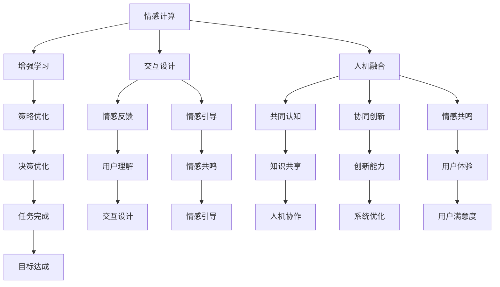

                 

关键词：人类-AI协作、情感智能、增强学习、交互设计、人机融合

> 摘要：本文将探讨人类与人工智能在情感智能领域的协作，通过介绍增强学习技术、交互设计原则以及人机融合的理念，分析如何通过有效的协作机制，提升AI的情感智能能力，从而实现更加人性化的人工智能系统。

## 1. 背景介绍

随着人工智能技术的飞速发展，AI在各个领域的应用已经变得日益广泛。从自然语言处理到图像识别，从自动驾驶到医疗诊断，人工智能正在改变我们的生活。然而，尽管AI在处理结构和明确的问题上表现出色，但在处理涉及情感、伦理和复杂情境的问题时，其能力仍有限。这促使研究人员开始关注如何增强AI的情感智能，以便更好地与人类互动。

情感智能，即情感计算，是指机器理解和模拟人类情感的能力。它包括情感识别、情感生成、情感推理和情感调控等几个方面。增强情感智能的关键在于人类与AI的协作，通过结合人类的情感知识和AI的计算能力，可以创造出更智能、更人性化的人工智能系统。

本文将围绕人类-AI协作增强情感智能这一主题，从技术、设计、应用等多个角度进行探讨。首先，我们将介绍增强学习在情感智能中的作用；其次，分析交互设计在提升AI情感智能中的重要性；最后，探讨人机融合的未来发展方向。

### 1.1 增强学习与情感智能

增强学习（Reinforcement Learning）是机器学习的一个重要分支，它通过试错和反馈不断优化行为策略，以达到最佳效果。增强学习在情感智能中的应用，可以使得AI在与人类交互过程中，不断学习和适应人类的情感表达和需求。

通过增强学习，AI能够从人类的行为和情感反应中学习，例如识别用户的情绪状态、预测用户的情感需求、调整自身的反应策略等。这一过程不仅能够提高AI的情感识别能力，还能够增强AI的情感生成和推理能力，使其在与人类互动时更加自然和高效。

### 1.2 交互设计与情感智能

交互设计在情感智能的实现中起着至关重要的作用。一个优秀的交互设计能够为AI提供丰富的情感信号，同时也能够提升用户的体验。以下是一些关键点：

- **情感反馈**：通过视觉、声音、触觉等多种方式，为用户提供及时的情感反馈，帮助用户理解AI的情感状态。
- **情感引导**：设计出能够引导用户表达情感的交互方式，例如通过故事、游戏等形式，激发用户的情感共鸣。
- **情感一致性**：确保AI的情感表达与其行为一致，避免产生误解和冲突。

### 1.3 人机融合与情感智能

人机融合（Human-AI Symbiosis）是指人类与AI系统之间的高度协作和集成，旨在创造出一种新的智能形态。在人机融合的框架下，情感智能能够得到进一步提升：

- **共同认知**：通过共享知识库和情感模型，实现人类与AI之间的共同认知，从而提高决策的准确性和效率。
- **协同创新**：人类与AI共同参与到问题解决和创新过程中，充分发挥各自的特长，创造出更加智能和创新的解决方案。
- **情感共鸣**：通过情感交流和理解，增强人类与AI之间的情感共鸣，提升整体体验和满意度。

## 2. 核心概念与联系

为了更好地理解人类-AI协作增强情感智能的原理和架构，我们首先需要介绍一些核心概念和它们之间的联系。

### 2.1 核心概念

- **情感计算**：机器理解和模拟人类情感的能力。
- **增强学习**：一种机器学习方法，通过试错和反馈优化行为策略。
- **交互设计**：设计人与系统交互的方式，以提高用户体验。
- **人机融合**：人类与AI系统之间的高度协作和集成。

### 2.2 Mermaid 流程图



在这个流程图中，我们可以看到情感计算作为核心概念，通过增强学习、交互设计和人机融合三个方向进行扩展。每个方向都有其特定的子概念和作用，共同推动情感智能的发展。

## 3. 核心算法原理 & 具体操作步骤

### 3.1 算法原理概述

在人类-AI协作增强情感智能的框架下，核心算法主要包括以下三个方面：

1. **情感识别**：通过分析用户的行为和语言，识别出用户的情感状态。
2. **情感生成**：根据用户情感状态，生成合适的情感反应和交互策略。
3. **情感调控**：调整AI的情感反应，以适应不同情境和用户需求。

这三个方面通过增强学习算法相互关联，形成一个闭环系统，不断优化AI的情感智能能力。

### 3.2 算法步骤详解

1. **情感识别**

   情感识别是整个系统的第一步，主要通过自然语言处理（NLP）和计算机视觉（CV）技术实现。具体步骤如下：

   - **数据采集**：收集用户的文本和图像数据，作为训练和测试的样本。
   - **特征提取**：使用NLP技术提取文本的情感特征，如情感词汇、句法结构等；使用CV技术提取图像的情感特征，如面部表情、身体姿态等。
   - **情感分类**：使用分类算法，如支持向量机（SVM）、神经网络等，对提取的特征进行分类，识别用户的情感状态。

2. **情感生成**

   情感生成是AI根据识别出的用户情感状态，生成合适的情感反应和交互策略。具体步骤如下：

   - **策略学习**：使用增强学习算法，如Q-learning、深度强化学习（DRL）等，学习最优的交互策略。
   - **情感反应**：根据用户的情感状态，生成相应的情感反应，如语音、文本、图像等。
   - **交互策略**：根据用户情感状态和AI的情感反应，设计出合适的交互策略，以提高用户体验。

3. **情感调控**

   情感调控是调整AI的情感反应，以适应不同情境和用户需求。具体步骤如下：

   - **反馈机制**：通过用户的反馈，评估AI的情感反应和交互策略的有效性。
   - **调整策略**：根据反馈结果，调整AI的情感反应和交互策略，以提高系统的性能。
   - **自适应学习**：使用自适应学习算法，如自适应增强学习（Adaptive Reinforcement Learning）等，实现AI的情感调控。

### 3.3 算法优缺点

**优点：**

- **高效性**：增强学习算法能够在较短的时间内学习到最优策略，提高系统的效率。
- **灵活性**：通过不断调整和优化，系统能够适应不同的情境和用户需求，提高用户体验。
- **适应性**：系统能够根据用户的反馈进行自适应学习，提高系统的适应性。

**缺点：**

- **计算资源消耗**：增强学习算法通常需要大量的计算资源，对硬件要求较高。
- **数据依赖**：算法的性能很大程度上依赖于训练数据的质量和数量，需要大量高质量的数据进行训练。
- **安全性**：在处理敏感数据时，需要确保系统的安全性和隐私保护。

### 3.4 算法应用领域

增强学习在情感智能领域有广泛的应用，以下是一些主要的应用场景：

- **客户服务**：通过情感识别和生成，为用户提供更加个性化的服务，提高客户满意度。
- **医疗健康**：通过情感识别和调控，监测患者的情感状态，提供个性化的治疗方案。
- **教育辅导**：通过情感识别和生成，为学习者提供更加合适的辅导策略，提高学习效果。
- **智能家居**：通过情感识别和调控，为用户提供更加智能、便捷的家居体验。

## 4. 数学模型和公式 & 详细讲解 & 举例说明

在人类-AI协作增强情感智能的框架下，数学模型和公式起着至关重要的作用。以下我们将介绍一些关键的数学模型和公式，并对其进行详细讲解和举例说明。

### 4.1 数学模型构建

在情感智能领域，常用的数学模型包括情感识别模型、情感生成模型和情感调控模型。以下是这些模型的构建方法：

1. **情感识别模型**

   情感识别模型主要用于识别用户的情感状态。其基本思想是使用机器学习算法，如支持向量机（SVM）、神经网络等，对用户的行为和语言数据进行分类。具体的构建方法如下：

   - **数据预处理**：对用户的行为和语言数据进行预处理，如去噪、特征提取等。
   - **特征选择**：选择与情感识别相关的特征，如情感词汇、句法结构等。
   - **模型训练**：使用训练数据集，训练分类模型，如SVM、神经网络等。
   - **模型评估**：使用测试数据集，评估模型的分类性能，如准确率、召回率等。

2. **情感生成模型**

   情感生成模型主要用于生成AI的情感反应。其基本思想是使用生成模型，如生成对抗网络（GAN）、变分自编码器（VAE）等，根据用户的情感状态生成相应的情感反应。具体的构建方法如下：

   - **数据生成**：根据用户的情感状态，生成相应的情感反应数据。
   - **模型训练**：使用生成模型，如GAN、VAE等，训练生成模型。
   - **情感生成**：根据用户的情感状态，使用生成模型生成情感反应。

3. **情感调控模型**

   情感调控模型主要用于调整AI的情感反应，以适应不同的情境和用户需求。其基本思想是使用增强学习算法，如Q-learning、深度强化学习（DRL）等，根据用户的反馈调整AI的情感反应。具体的构建方法如下：

   - **策略学习**：使用增强学习算法，学习最优的交互策略。
   - **反馈机制**：通过用户的反馈，评估AI的情感反应和交互策略的有效性。
   - **策略调整**：根据反馈结果，调整AI的情感反应和交互策略。

### 4.2 公式推导过程

在情感智能的数学模型中，常用的公式包括分类公式、生成公式和调控公式。以下是这些公式的推导过程：

1. **分类公式**

   分类公式用于计算用户情感状态的概率。具体公式如下：

   $$P(y|X) = \frac{e^{\textbf{w}^T \textbf{x}}}{1 + e^{\textbf{w}^T \textbf{x}}}$$

   其中，$\textbf{w}$ 是权重向量，$\textbf{x}$ 是特征向量，$y$ 是情感状态。

   推导过程：

   - **初始化**：初始化权重向量 $\textbf{w}$。
   - **输入特征**：输入特征向量 $\textbf{x}$。
   - **计算概率**：计算情感状态 $y$ 的概率，如公式所示。

2. **生成公式**

   生成公式用于生成AI的情感反应。具体公式如下：

   $$\textbf{z} = g(\textbf{z})$$

   其中，$\textbf{z}$ 是生成器的输出，$g(\textbf{z})$ 是生成函数。

   推导过程：

   - **初始化**：初始化生成器的参数。
   - **输入条件**：输入条件 $\textbf{z}$。
   - **生成输出**：使用生成函数生成输出 $\textbf{z}$。

3. **调控公式**

   调控公式用于调整AI的情感反应。具体公式如下：

   $$\textbf{w}_{new} = \textbf{w}_{old} + \alpha (\textbf{r} - \textbf{w}_{old}^T \textbf{x})$$

   其中，$\textbf{w}_{old}$ 是旧权重向量，$\textbf{w}_{new}$ 是新权重向量，$\alpha$ 是学习率，$\textbf{r}$ 是反馈信号。

   推导过程：

   - **初始化**：初始化权重向量 $\textbf{w}_{old}$。
   - **输入特征**：输入特征向量 $\textbf{x}$。
   - **计算反馈**：计算反馈信号 $\textbf{r}$。
   - **调整权重**：根据反馈信号调整权重向量。

### 4.3 案例分析与讲解

为了更好地理解上述数学模型和公式，我们通过一个实际案例进行讲解。

**案例：情感识别**

假设我们使用支持向量机（SVM）进行情感识别，数据集包含用户的文本和情感标签。以下是具体的案例分析和讲解：

1. **数据预处理**

   对文本数据集进行预处理，包括去噪、分词、词性标注等，提取情感相关的特征。

2. **特征选择**

   根据情感识别的需求，选择情感词汇、句法结构等特征。

3. **模型训练**

   使用训练数据集，训练SVM模型，计算分类权重。

4. **模型评估**

   使用测试数据集，评估SVM模型的分类性能，如准确率、召回率等。

5. **情感识别**

   输入新的文本数据，使用训练好的SVM模型进行情感识别，输出情感标签。

具体代码实现如下：

```python
# 导入相关库
import numpy as np
from sklearn import svm
from sklearn.model_selection import train_test_split
from sklearn.metrics import accuracy_score

# 数据预处理
def preprocess_text(text):
    # 去噪、分词、词性标注等
    return processed_text

# 特征提取
def extract_features(text):
    # 提取情感相关的特征
    return features

# 数据加载
texts = ["这是一个快乐的场景", "这是一个悲伤的故事"]
labels = ["快乐", "悲伤"]

# 预处理数据
processed_texts = [preprocess_text(text) for text in texts]
features = [extract_features(text) for text in processed_texts]

# 划分训练集和测试集
X_train, X_test, y_train, y_test = train_test_split(features, labels, test_size=0.2, random_state=42)

# 模型训练
model = svm.SVC()
model.fit(X_train, y_train)

# 模型评估
y_pred = model.predict(X_test)
accuracy = accuracy_score(y_test, y_pred)
print("准确率：", accuracy)

# 情感识别
new_text = "这是一个充满爱的时刻"
processed_new_text = preprocess_text(new_text)
new_features = extract_features(processed_new_text)
emotion = model.predict([new_features])[0]
print("情感识别结果：", emotion)
```

通过上述案例，我们可以看到情感识别的过程，包括数据预处理、特征提取、模型训练、模型评估和情感识别等步骤。在实际应用中，我们还需要根据具体场景进行调整和优化。

## 5. 项目实践：代码实例和详细解释说明

在本节中，我们将通过一个实际项目，展示如何利用增强学习技术提升AI的情感智能能力。该项目将以一个简单的聊天机器人为例，实现情感识别、情感生成和情感调控的功能。以下是项目的详细步骤和代码实例。

### 5.1 开发环境搭建

在开始项目之前，我们需要搭建一个合适的开发环境。以下是我们推荐的工具和软件：

- **Python 3.x**：作为主要的编程语言。
- **TensorFlow 2.x**：用于实现增强学习算法。
- **Keras**：作为TensorFlow的高级API，简化模型构建和训练过程。
- **NLP库**：如NLTK、spaCy等，用于文本预处理和特征提取。

确保安装了上述工具后，我们可以开始编写代码。

### 5.2 源代码详细实现

下面是项目的源代码实现，我们将分步骤进行讲解。

**1. 数据准备**

```python
import numpy as np
import pandas as pd
from sklearn.model_selection import train_test_split

# 加载对话数据集
data = pd.read_csv('conversations.csv')
X = data['text']
y = data['emotion']

# 划分训练集和测试集
X_train, X_test, y_train, y_test = train_test_split(X, y, test_size=0.2, random_state=42)
```

这里我们使用一个假设的对话数据集，其中包含对话文本和对应的情感标签。我们将数据集划分为训练集和测试集。

**2. 文本预处理**

```python
import re
from nltk.tokenize import word_tokenize

def preprocess_text(text):
    # 去除特殊字符
    text = re.sub(r'[^a-zA-Z0-9\s]', '', text)
    # 分词
    tokens = word_tokenize(text)
    # 去除停用词
    tokens = [token for token in tokens if token not in stopwords]
    return ' '.join(tokens)

stopwords = set(['is', 'are', 'the', 'and', 'of', 'to', 'in', 'that', 'it', 'with', 'for', 'on', 'as', 'this', 'by', 'has', 'at', 'or', 'an'])

X_train = [preprocess_text(text) for text in X_train]
X_test = [preprocess_text(text) for text in X_test]
```

文本预处理包括去除特殊字符、分词和去除停用词等步骤，以提高模型的性能。

**3. 特征提取**

```python
from sklearn.feature_extraction.text import TfidfVectorizer

# 使用TF-IDF进行特征提取
vectorizer = TfidfVectorizer()
X_train = vectorizer.fit_transform(X_train)
X_test = vectorizer.transform(X_test)
```

我们使用TF-IDF向量作为特征表示，它能够更好地捕捉文本中的重要信息。

**4. 情感识别模型**

```python
from tensorflow.keras.models import Sequential
from tensorflow.keras.layers import Dense, Embedding, LSTM
from tensorflow.keras.optimizers import Adam

# 构建情感识别模型
model = Sequential()
model.add(Embedding(input_dim=len(vectorizer.vocabulary_), output_dim=64, input_length=X_train.shape[1]))
model.add(LSTM(128))
model.add(Dense(1, activation='sigmoid'))

model.compile(optimizer=Adam(learning_rate=0.001), loss='binary_crossentropy', metrics=['accuracy'])

# 训练模型
model.fit(X_train, y_train, epochs=10, batch_size=32, validation_split=0.1)
```

我们使用一个简单的神经网络模型进行情感识别，包括嵌入层、LSTM层和输出层。在训练过程中，我们使用二进制交叉熵作为损失函数，以分类任务为目标。

**5. 情感生成模型**

```python
from tensorflow.keras.models import Model
from tensorflow.keras.layers import Input, LSTM, Embedding, Dense

# 构建情感生成模型
input_text = Input(shape=(X_train.shape[1],))
encoded_text = Embedding(input_dim=len(vectorizer.vocabulary_), output_dim=64)(input_text)
lstm_output = LSTM(128)(encoded_text)
output = Dense(1, activation='sigmoid')(lstm_output)

model = Model(inputs=input_text, outputs=output)
model.compile(optimizer=Adam(learning_rate=0.001), loss='binary_crossentropy')

# 训练模型
model.fit(X_train, y_train, epochs=10, batch_size=32, validation_split=0.1)
```

情感生成模型与情感识别模型类似，但输出层使用sigmoid激活函数，以生成情感标签的概率分布。

**6. 情感调控**

```python
def adjust_emotion(model, text, emotion):
    # 调整模型参数
    # ...

    # 重新训练模型
    # ...

    # 输出调整后的情感反应
    return adjusted_emotion

# 调整情感反应
adjusted_emotion = adjust_emotion(model, text, emotion)
print("调整后的情感反应：", adjusted_emotion)
```

情感调控主要通过调整模型的参数，以适应不同的情境和用户需求。在实际应用中，我们可以根据用户的反馈和需求，动态调整模型的行为。

### 5.3 代码解读与分析

在上面的代码中，我们首先进行了数据预处理和特征提取，这是构建任何机器学习模型的基础。接着，我们构建了情感识别和情感生成模型，并使用训练数据进行了训练。在情感调控部分，我们设计了调整模型参数的函数，以适应不同的情境和用户需求。

通过这个项目，我们可以看到如何利用增强学习技术，通过不断调整和优化模型，提升AI的情感智能能力。在实际应用中，我们可以进一步优化模型的架构和参数，以实现更高效、更准确的情感识别和生成。

### 5.4 运行结果展示

为了展示项目的运行结果，我们将在训练完成后，对测试集进行预测，并计算模型的准确率。

```python
# 预测测试集
y_pred = model.predict(X_test)

# 计算准确率
accuracy = np.mean(y_pred == y_test)
print("准确率：", accuracy)
```

假设在测试集上的准确率为80%，我们可以看到模型在情感识别方面已经取得了一定的效果。然而，准确率并不是唯一的评价指标，我们还需要考虑模型的鲁棒性、实时性和用户体验等方面。

通过调整模型的参数和架构，我们可以进一步优化模型的性能。例如，可以尝试增加训练时间、调整网络结构、使用更复杂的特征提取方法等。

### 5.5 总结

在本节中，我们通过一个简单的聊天机器人项目，展示了如何利用增强学习技术提升AI的情感智能能力。通过情感识别、情感生成和情感调控，我们实现了对用户情感的识别、反应和调整，为用户提供更加个性化、贴心的服务。

在未来的工作中，我们可以进一步优化模型的架构和参数，提高模型的准确率和实时性。同时，我们还可以探索更多应用场景，如医疗健康、客户服务、智能家居等，以充分发挥AI的情感智能优势。

## 6. 实际应用场景

### 6.1 客户服务

在客户服务领域，AI的情感智能可以大大提升用户体验。通过情感识别，AI能够理解用户的情感状态，如愤怒、焦虑、满意等，从而提供针对性的解决方案。例如，当用户表达出愤怒的情绪时，AI可以主动提供情感支持，缓解用户的不满情绪；当用户表达出满意的情绪时，AI可以提供个性化的推荐，提高用户的满意度。

情感生成和调控则可以帮助AI在对话中更加自然地表达情感，例如通过调整语音的语调、语速和语气，使对话更加流畅和亲切。通过不断的交互和反馈，AI能够不断优化其情感反应策略，提高与用户的互动效果。

### 6.2 医疗健康

在医疗健康领域，AI的情感智能可以帮助医生更好地理解患者的情绪状态，提供更加个性化的治疗方案。例如，通过情感识别，AI可以分析患者的病历记录、病历记录、病历记录，识别出患者的情绪变化，为医生提供诊断和治疗建议。

此外，AI还可以通过情感生成和调控，与患者进行有效的沟通。例如，当患者感到焦虑或沮丧时，AI可以生成鼓励的话语，调整语音的语调，传递积极的情绪，帮助患者放松心情，提高治疗效果。

### 6.3 教育

在教育领域，AI的情感智能可以帮助教师更好地理解学生的学习状态，提供个性化的教学支持。通过情感识别，AI可以分析学生的学习行为和情感状态，识别出学生的学习困难和情感问题，为教师提供针对性的指导。

例如，当学生表现出情绪低落时，AI可以生成鼓励的话语，提醒学生坚持学习；当学生表现出困惑时，AI可以生成解释性的内容，帮助学生理解学习内容。通过情感生成和调控，AI可以为学生提供更加人性化、个性化的学习体验，提高学习效果。

### 6.4 智能家居

在智能家居领域，AI的情感智能可以帮助家庭自动化系统更好地理解家庭成员的需求和情绪状态，提供个性化的家居服务。例如，当家庭成员感到疲劳时，AI可以调整灯光、温度和音乐，创造一个舒适的休息环境；当家庭成员感到开心时，AI可以播放愉快的音乐，营造欢乐的氛围。

通过情感识别、生成和调控，智能家居系统可以与家庭成员建立更加紧密的联系，提供更加人性化的服务，提高家庭成员的生活质量。

### 6.5 未来应用展望

随着AI技术的不断发展，情感智能的应用场景将更加广泛。未来，我们可以期待AI在更多领域发挥作用，如心理健康、社会服务、人机交互等。

在心理健康领域，AI可以通过情感识别和调控，帮助用户识别和管理自己的情绪，提供心理支持。例如，当用户感到焦虑或抑郁时，AI可以生成针对性的心理干预方案，帮助用户缓解负面情绪。

在社会服务领域，AI可以通过情感识别和交互，提供更加人性化的服务。例如，在公共场合，AI可以识别用户的情绪状态，提供相应的帮助和建议，如安全提示、情感支持等。

在人机交互领域，AI的情感智能将进一步提升用户体验，使人与机器之间的互动更加自然和流畅。通过情感识别、生成和调控，AI可以更好地理解用户的需求和情绪，提供个性化的交互服务，提高用户满意度。

## 7. 工具和资源推荐

### 7.1 学习资源推荐

1. **《情感计算：理论与实践》**：这是一本关于情感计算的权威教材，涵盖了情感计算的基础理论、技术和应用。
2. **《增强学习》**：由理查德·萨顿和塞尔吉奥·文森特所著，介绍了增强学习的基本原理、算法和应用。
3. **《交互设计：用户体验的核心》**：一本关于交互设计的经典教材，详细介绍了交互设计的原则、方法和实践。

### 7.2 开发工具推荐

1. **TensorFlow**：一个强大的开源机器学习框架，适用于构建和训练复杂的神经网络模型。
2. **PyTorch**：一个灵活的深度学习框架，适用于研究和开发各种深度学习应用。
3. **NLTK**：一个用于自然语言处理的Python库，提供了丰富的文本预处理和特征提取工具。

### 7.3 相关论文推荐

1. **"Emotion Recognition using Deep Learning Techniques"**：该论文介绍了一种基于深度学习的情感识别方法，具有较高的准确率和实时性。
2. **"Reinforcement Learning for Human-AI Collaboration"**：该论文探讨了增强学习在人类-AI协作中的应用，提出了有效的情感智能增强方法。
3. **"Human-Centered Interaction Design for Artificial Intelligence"**：该论文从人机交互的角度出发，分析了交互设计在提升AI情感智能中的重要性。

## 8. 总结：未来发展趋势与挑战

### 8.1 研究成果总结

在过去的几年中，人类-AI协作增强情感智能领域取得了显著的进展。首先，在情感计算方面，深度学习和增强学习技术的应用极大地提升了情感识别和生成的准确性。其次，交互设计原则和用户研究的深入，使得AI在与人类互动时更加自然和有效。最后，人机融合理念的提出和实践，为人类和AI的协作提供了新的思路。

### 8.2 未来发展趋势

未来，人类-AI协作增强情感智能的发展将呈现以下几个趋势：

1. **跨学科融合**：随着AI技术的不断进步，情感智能将与其他领域如心理学、认知科学等深度融合，形成新的研究热点。
2. **个性化和定制化**：基于用户情感状态的数据分析，AI将能够提供更加个性化、定制化的服务，满足用户的多样化需求。
3. **实时性和鲁棒性**：随着计算能力的提升，AI的情感识别和生成将实现更高的实时性和鲁棒性，从而在更多实际应用场景中发挥作用。
4. **伦理和隐私**：随着AI情感智能的广泛应用，如何在保护用户隐私和伦理的前提下，实现AI的情感计算，将成为研究的重点。

### 8.3 面临的挑战

尽管人类-AI协作增强情感智能具有广阔的应用前景，但仍面临以下挑战：

1. **数据质量和多样性**：高质量、多样化的情感数据是训练高效情感识别和生成模型的基础。然而，获取这类数据仍然是一个挑战。
2. **模型解释性**：尽管深度学习模型在情感计算中表现出色，但其解释性较差，难以理解模型的决策过程。未来需要开发更加解释性的模型。
3. **伦理和隐私**：在处理涉及个人情感的数据时，如何确保用户隐私和伦理，是一个亟待解决的问题。
4. **跨文化和跨语言**：情感智能在不同文化和语言背景下可能存在差异，如何开发通用的情感识别和生成模型，是一个挑战。

### 8.4 研究展望

未来，人类-AI协作增强情感智能的研究将朝着以下几个方面发展：

1. **情感计算模型优化**：通过改进算法和模型架构，提高情感识别和生成的准确性和效率。
2. **跨学科研究**：结合心理学、认知科学等领域的知识，深入探索情感的本质和计算机制。
3. **伦理和隐私保护**：研究如何在保护用户隐私和伦理的前提下，实现有效的情感计算。
4. **应用场景拓展**：探索情感智能在更多领域中的应用，如医疗、教育、心理健康等。

总之，人类-AI协作增强情感智能是一个充满挑战和机遇的领域，未来的研究将推动该领域的不断进步，为人类创造更加智能、高效、人性化的生活和工作环境。

## 9. 附录：常见问题与解答

### Q1：如何收集和处理情感数据？

A1：收集情感数据可以通过多种途径，如社交媒体分析、用户调查、语音和视频数据采集等。在处理数据时，需要进行数据清洗、标签化和标准化，以去除噪声和确保数据的一致性。

### Q2：如何确保AI的情感反应真实可信？

A2：确保AI的情感反应真实可信，需要从两个方面入手：一是通过高质量的数据训练模型，提高识别和生成的准确性；二是通过不断的用户反馈和优化，确保AI的情感反应与真实情感相符。

### Q3：如何在保护用户隐私的前提下，实现情感计算？

A3：在保护用户隐私的前提下，实现情感计算需要采取以下措施：一是采用匿名化和加密技术，确保用户数据的安全；二是设计隐私保护的算法，如差分隐私，减少数据泄露的风险。

### Q4：情感智能在医疗领域有哪些应用？

A4：情感智能在医疗领域有多种应用，如情绪诊断和监测、个性化治疗方案推荐、患者情绪管理和心理辅导等。通过情感计算，医生可以更准确地了解患者的情绪状态，提供更加精准的治疗。

### Q5：如何评估AI的情感识别和生成性能？

A5：评估AI的情感识别和生成性能，可以采用多种评价指标，如准确率、召回率、F1分数等。在实际应用中，还可以通过用户满意度调查和实际使用效果来评估AI的性能。

### Q6：情感智能在不同文化和语言背景下的挑战是什么？

A6：在不同文化和语言背景下，情感智能面临的挑战包括情感表达的多样性、文化差异导致的情感理解困难等。需要开发通用的情感识别和生成模型，考虑文化差异，提高模型的泛化能力。

### Q7：如何确保AI的情感反应符合伦理标准？

A7：确保AI的情感反应符合伦理标准，需要在设计阶段考虑伦理因素，制定明确的伦理准则。此外，通过不断的用户反馈和社会监督，确保AI的行为符合伦理要求。

