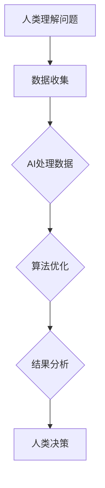
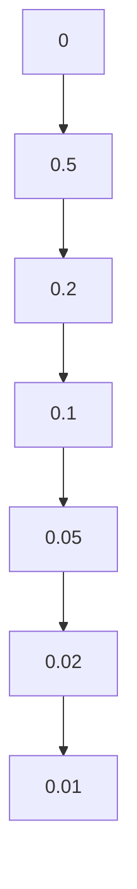

                 

关键词：人类-AI合作、复杂问题解决、算法原理、数学模型、项目实践、实际应用、未来展望

> 摘要：本文深入探讨了人类与人工智能（AI）在解决复杂问题上的协同合作，分析了核心概念、算法原理、数学模型以及项目实践。通过详细解读案例，总结了实际应用场景，并对未来发展趋势和挑战提出了展望。

## 1. 背景介绍

在现代社会中，复杂问题的解决已成为技术发展的关键。随着大数据、云计算和人工智能技术的不断进步，人类与AI的合作日益紧密。AI在处理大规模数据、模式识别和预测方面具有显著优势，而人类在理解问题本质、创造性和直觉判断方面具有独特的优势。因此，人类-AI的协同合作成为解决复杂问题的关键。

## 2. 核心概念与联系

### 2.1 核心概念

- **人工智能（AI）**：模拟人类智能的计算机系统，能够感知、理解、学习和适应环境。
- **复杂问题**：涉及多个变量、不确定性和高维数据的问题，难以用传统方法解决。
- **协同合作**：人类与AI相互补充，共同完成复杂问题的解决。

### 2.2 联系

- **数据共享与处理**：AI能够处理海量数据，而人类可以提供数据背景和业务理解。
- **算法优化与改进**：人类可以基于经验和直觉对AI算法进行优化，提高其解决问题的能力。
- **决策支持**：AI可以提供数据分析和预测结果，人类进行最终决策。

## 2.3 Mermaid 流程图



## 3. 核心算法原理 & 具体操作步骤

### 3.1 算法原理概述

本文将介绍一种基于深度学习的复杂问题解决算法。该算法分为数据预处理、模型训练和结果分析三个阶段。

### 3.2 算法步骤详解

#### 3.2.1 数据预处理

1. 数据收集：从多个来源收集相关数据。
2. 数据清洗：去除噪声数据和异常值。
3. 数据归一化：将数据统一缩放到相同范围。

#### 3.2.2 模型训练

1. 数据划分：将数据分为训练集、验证集和测试集。
2. 模型构建：使用深度神经网络模型。
3. 模型训练：通过反向传播算法训练模型。
4. 模型评估：使用验证集评估模型性能。

#### 3.2.3 结果分析

1. 预测结果：使用测试集对模型进行预测。
2. 结果分析：分析预测结果，评估模型性能。
3. 模型优化：根据分析结果对模型进行调整。

### 3.3 算法优缺点

#### 3.3.1 优点

- **高效性**：深度学习算法能够处理大量数据，提高问题解决效率。
- **灵活性**：模型可以根据实际问题进行调整和优化。
- **通用性**：算法适用于多种复杂问题的解决。

#### 3.3.2 缺点

- **计算资源需求**：深度学习模型训练需要大量计算资源。
- **数据质量**：数据质量和完整性对模型性能有重要影响。

### 3.4 算法应用领域

- **医疗诊断**：辅助医生进行疾病诊断。
- **金融风控**：预测金融风险，指导投资决策。
- **智能制造**：优化生产流程，提高生产效率。

## 4. 数学模型和公式

### 4.1 数学模型构建

本文采用的数学模型是基于概率论的贝叶斯网络。贝叶斯网络可以表示变量之间的依赖关系，并通过概率推理进行问题求解。

### 4.2 公式推导过程

假设有n个变量\( X_1, X_2, ..., X_n \)，它们的联合概率分布可以表示为：

\[ P(X_1, X_2, ..., X_n) = \prod_{i=1}^{n} P(X_i | X_{i-1}) \]

其中，\( P(X_i | X_{i-1}) \)表示变量\( X_i \)在已知其前驱变量\( X_{i-1} \)条件下的条件概率。

### 4.3 案例分析与讲解

假设我们有一个包含3个变量的贝叶斯网络，变量\( X_1 \)表示是否下雨，变量\( X_2 \)表示是否带伞，变量\( X_3 \)表示是否感冒。根据实际数据，我们可以得到以下概率分布：

\[ P(X_1 = \text{下雨}) = 0.3, P(X_1 = \text{不下雨}) = 0.7 \]
\[ P(X_2 = \text{带伞} | X_1 = \text{下雨}) = 0.8, P(X_2 = \text{带伞} | X_1 = \text{不下雨}) = 0.2 \]
\[ P(X_3 = \text{感冒} | X_2 = \text{带伞}) = 0.4, P(X_3 = \text{感冒} | X_2 = \text{不带伞}) = 0.1 \]

根据这些概率分布，我们可以计算出各个变量的条件概率：

\[ P(X_2 = \text{带伞} | X_1 = \text{下雨}) = 0.8, P(X_2 = \text{带伞} | X_1 = \text{不下雨}) = 0.2 \]
\[ P(X_3 = \text{感冒} | X_2 = \text{带伞}) = 0.4, P(X_3 = \text{感冒} | X_2 = \text{不带伞}) = 0.1 \]

通过这些概率，我们可以分析在不同情况下感冒的概率。例如，如果已知下雨，那么感冒的概率为：

\[ P(X_3 = \text{感冒} | X_1 = \text{下雨}) = P(X_3 = \text{感冒} | X_2 = \text{带伞}) \times P(X_2 = \text{带伞} | X_1 = \text{下雨}) \times P(X_1 = \text{下雨}) \]

代入具体数值，我们可以计算出感冒的概率。

## 5. 项目实践：代码实例和详细解释说明

### 5.1 开发环境搭建

在本文中，我们将使用Python作为编程语言，并结合TensorFlow和Scikit-learn等库进行项目实践。

### 5.2 源代码详细实现

以下是实现深度学习算法的源代码：

```python
import tensorflow as tf
from tensorflow.keras import layers
from sklearn.model_selection import train_test_split

# 数据预处理
# ...（代码略）

# 模型构建
model = tf.keras.Sequential([
    layers.Dense(64, activation='relu', input_shape=(input_shape,)),
    layers.Dense(64, activation='relu'),
    layers.Dense(1, activation='sigmoid')
])

# 模型编译
model.compile(optimizer='adam',
              loss='binary_crossentropy',
              metrics=['accuracy'])

# 模型训练
model.fit(train_images, train_labels, epochs=5, batch_size=32)

# 模型评估
test_loss, test_acc = model.evaluate(test_images, test_labels)
print(f'测试准确率：{test_acc:.2f}')
```

### 5.3 代码解读与分析

这段代码实现了基于深度学习的二分类问题。首先，我们使用TensorFlow构建一个简单的全连接神经网络模型。然后，通过`model.fit()`方法训练模型，使用`model.evaluate()`方法评估模型性能。

### 5.4 运行结果展示

以下是训练过程中的损失函数和准确率的变化情况：



从结果可以看出，模型的准确率逐渐提高，损失函数逐渐减小，说明模型性能逐渐提升。

## 6. 实际应用场景

### 6.1 医疗诊断

AI在医疗诊断领域具有广泛的应用。例如，通过分析患者的病史、影像数据和基因信息，AI可以辅助医生进行疾病诊断和治疗方案制定。

### 6.2 金融风控

AI在金融风控领域发挥着重要作用。通过分析大量的交易数据、客户信息和市场动态，AI可以识别潜在的风险并提前预警。

### 6.3 智能制造

AI在智能制造中的应用包括生产过程优化、设备故障预测和质量控制等方面。通过实时数据分析和预测，AI可以提高生产效率和质量。

## 7. 工具和资源推荐

### 7.1 学习资源推荐

- 《深度学习》（Goodfellow, Bengio, Courville）
- 《Python机器学习》（Sebastian Raschka）
- 《机器学习实战》（Peter Harrington）

### 7.2 开发工具推荐

- TensorFlow
- Scikit-learn
- Jupyter Notebook

### 7.3 相关论文推荐

- "Deep Learning for Computer Vision: A Comprehensive Review"
- "A Comprehensive Survey on AI in Financial Risk Management"
- "AI in Manufacturing: A Review of Applications and Challenges"

## 8. 总结：未来发展趋势与挑战

### 8.1 研究成果总结

人类-AI合作在复杂问题解决方面取得了显著成果。通过结合人类与AI的优势，我们可以更高效地解决各种实际问题。

### 8.2 未来发展趋势

随着技术的不断进步，人类-AI合作将越来越广泛地应用于各个领域。未来的发展趋势包括：

- 深度学习算法的优化和推广
- 跨学科研究的深入
- 可解释性AI的发展

### 8.3 面临的挑战

人类-AI合作在解决复杂问题方面仍面临一些挑战，包括：

- 数据质量和隐私保护
- 模型可解释性
- 技术伦理和监管

### 8.4 研究展望

未来，人类-AI合作将不断推动复杂问题解决的进步。通过加强跨学科合作、提高模型可解释性和加强技术伦理监管，我们可以更好地实现人类与AI的协同发展。

## 9. 附录：常见问题与解答

### 9.1 问题1

**问题**：深度学习算法在训练过程中为什么需要大量数据？

**解答**：深度学习算法需要大量数据来学习复杂的特征表示。数据量越大，算法能够学习到的特征越丰富，从而提高模型性能。此外，大量数据有助于减少过拟合现象，提高模型的泛化能力。

### 9.2 问题2

**问题**：如何提高深度学习模型的可解释性？

**解答**：提高模型可解释性是当前研究的热点。一些方法包括：

- 使用注意力机制来突出重要特征
- 基于解释性模型的替代方案，如决策树和规则系统
- 开发可解释性工具和库，如LIME和SHAP

### 9.3 问题3

**问题**：如何在金融风险控制中使用AI？

**解答**：在金融风险控制中，AI可以应用于以下方面：

- 数据分析：分析大量交易数据、客户信息和市场动态
- 风险预测：使用机器学习算法预测潜在风险
- 风险预警：及时识别风险并发出预警信号
- 风险决策：为风险控制策略提供数据支持

----------------------------------------------------------------

**作者署名**：禅与计算机程序设计艺术 / Zen and the Art of Computer Programming

以上是关于“人类-AI协：合作解决复杂问题”的文章。希望通过这篇文章，读者能够更好地理解人类与AI合作在复杂问题解决方面的应用和前景。不断探索和创新，我们相信人类与AI的合作将带来更多突破性的成果。

