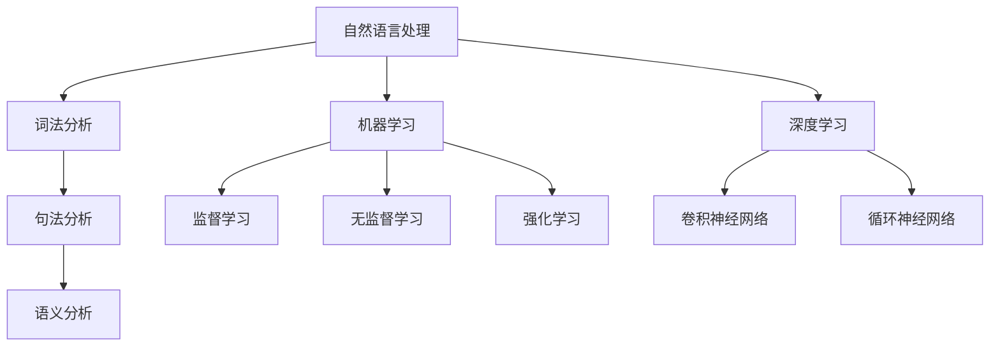

                 

关键词：人类意图对齐、AI 领域、挑战、技术发展、伦理道德

摘要：本文探讨了人类意图对齐在 AI 领域中的重要性以及面临的挑战。通过对当前 AI 技术的发展现状进行分析，探讨了如何实现人类意图对齐的算法原理、数学模型和项目实践。文章还展望了未来 AI 领域的发展趋势和面临的挑战，提出了相关工具和资源的推荐。

## 1. 背景介绍

随着人工智能技术的迅猛发展，AI 在各个领域的应用越来越广泛，从自然语言处理到图像识别，从智能助手到自动驾驶，AI 已经深入到我们生活的方方面面。然而，随着 AI 技术的普及，人类意图与 AI 系统之间的对齐问题也日益突出。人类意图对齐，是指确保 AI 系统的理解和响应与人类的意图保持一致。

人类意图对齐的重要性在于，它可以确保 AI 系统不会误解或偏离人类的意图，从而避免产生负面的后果。例如，在自动驾驶领域，如果 AI 系统无法正确理解司机的意图，可能会导致交通事故；在医疗领域，如果 AI 系统无法正确理解医生的诊断意图，可能会导致错误的诊断和治疗。

然而，实现人类意图对齐面临着诸多挑战。首先，人类意图本身是复杂且多样的，如何准确地捕捉和解析这些意图是一个巨大的挑战。其次，AI 系统的设计和实现也需要考虑到人类意图的多样性，确保系统能够灵活地适应不同的意图。此外，伦理道德问题也是人类意图对齐需要考虑的重要因素，如何确保 AI 系统的决策符合伦理道德标准，也是一个重要的挑战。

## 2. 核心概念与联系

为了更好地理解人类意图对齐，我们需要引入一些核心概念，包括自然语言处理、机器学习、深度学习等。

### 2.1 自然语言处理

自然语言处理（Natural Language Processing，NLP）是人工智能领域的一个分支，旨在使计算机能够理解、生成和处理人类语言。NLP 技术包括词法分析、句法分析、语义分析等。词法分析是将文本分解成单词和短语的过程；句法分析是研究句子结构的过程；语义分析是研究句子含义的过程。

在人类意图对齐中，NLP 技术用于捕捉和理解人类的意图。例如，通过分析用户的输入文本，可以识别出用户的请求或意图。

### 2.2 机器学习

机器学习（Machine Learning，ML）是一种通过数据学习模式和规律的方法，使计算机能够从数据中自动学习和改进。机器学习可以分为监督学习、无监督学习和强化学习三种类型。

在人类意图对齐中，机器学习用于训练 AI 系统以识别和理解人类的意图。例如，通过监督学习，可以从标注的数据集中学习出人类意图的模式。

### 2.3 深度学习

深度学习（Deep Learning，DL）是一种基于多层神经网络的学习方法，能够自动提取数据中的特征。深度学习在图像识别、语音识别和自然语言处理等领域取得了显著的成果。

在人类意图对齐中，深度学习可以用于训练 AI 系统以识别和理解复杂的意图。例如，通过卷积神经网络（CNN）可以提取图像中的特征，通过循环神经网络（RNN）可以提取文本中的特征。

### 2.4 Mermaid 流程图

下面是一个描述人类意图对齐核心概念的 Mermaid 流程图：



## 3. 核心算法原理 & 具体操作步骤

### 3.1 算法原理概述

人类意图对齐的核心算法主要包括自然语言处理、机器学习和深度学习等。自然语言处理用于捕捉和理解人类的意图，机器学习用于训练 AI 系统以识别和理解人类的意图，深度学习用于提取复杂的意图特征。

具体的操作步骤如下：

1. **数据采集**：首先，需要采集大量的用户数据，包括文本、图像和语音等，以用于训练 AI 系统。

2. **数据预处理**：对采集的数据进行清洗和预处理，包括去除噪声、缺失值填充等。

3. **特征提取**：使用深度学习技术提取数据中的特征，例如使用卷积神经网络提取图像特征，使用循环神经网络提取文本特征。

4. **模型训练**：使用机器学习技术训练 AI 系统，使其能够识别和理解人类的意图。常用的机器学习算法包括监督学习、无监督学习和强化学习。

5. **模型评估**：使用测试数据集评估模型的性能，包括准确率、召回率等指标。

6. **模型部署**：将训练好的模型部署到生产环境中，用于实时识别和理解用户的意图。

### 3.2 算法步骤详解

1. **数据采集**：为了训练 AI 系统，我们需要采集大量的用户数据。这些数据可以来自各种来源，如社交媒体、在线聊天记录、用户评论等。

2. **数据预处理**：在采集到数据后，需要对数据进行分析和处理。首先，对文本数据，需要进行分词、去停用词、词干提取等操作；对图像数据，需要进行图像增强、归一化等操作；对语音数据，需要进行语音识别和文本转换。

3. **特征提取**：使用深度学习技术，如卷积神经网络（CNN）和循环神经网络（RNN），提取数据中的特征。例如，对于图像数据，可以使用 CNN 提取图像中的局部特征；对于文本数据，可以使用 RNN 提取文本序列中的上下文特征。

4. **模型训练**：使用机器学习技术，如监督学习、无监督学习和强化学习，训练 AI 系统。例如，可以使用监督学习算法（如支持向量机、决策树、神经网络等）训练分类模型；使用无监督学习算法（如聚类、降维等）训练特征提取模型；使用强化学习算法（如 Q 学习、深度 Q 网络等）训练智能决策模型。

5. **模型评估**：使用测试数据集对训练好的模型进行评估，评估指标包括准确率、召回率、F1 分数等。

6. **模型部署**：将训练好的模型部署到生产环境中，例如在聊天机器人、智能助手等应用中使用。

### 3.3 算法优缺点

**优点**：

- **高效性**：深度学习和机器学习算法可以自动提取数据中的特征，大大提高了数据处理和识别的效率。
- **灵活性**：深度学习和机器学习算法可以根据不同的应用场景进行调整和优化，具有很强的灵活性。
- **泛化能力**：深度学习和机器学习算法可以从大量数据中学习到规律，具有很好的泛化能力。

**缺点**：

- **数据依赖性**：深度学习和机器学习算法对数据有很强的依赖性，数据质量直接影响模型的性能。
- **计算资源消耗**：深度学习和机器学习算法通常需要大量的计算资源，训练过程可能需要很长时间。
- **解释性不足**：深度学习模型往往缺乏解释性，难以理解其决策过程。

### 3.4 算法应用领域

人类意图对齐算法在多个领域有广泛的应用，包括：

- **自然语言处理**：在聊天机器人、智能助手、情感分析等应用中，人类意图对齐算法可以帮助系统更好地理解用户的意图。
- **图像识别**：在自动驾驶、安防监控、医疗影像诊断等应用中，人类意图对齐算法可以帮助系统更好地理解图像中的意图。
- **语音识别**：在智能音箱、语音助手、语音识别等应用中，人类意图对齐算法可以帮助系统更好地理解用户的语音意图。
- **推荐系统**：在电商、社交媒体、音乐推荐等应用中，人类意图对齐算法可以帮助系统更好地理解用户的兴趣和偏好。

## 4. 数学模型和公式 & 详细讲解 & 举例说明

### 4.1 数学模型构建

在人类意图对齐中，常用的数学模型包括概率模型、统计模型、神经网络模型等。

**概率模型**：概率模型用于估计事件发生的概率。在人类意图对齐中，可以使用贝叶斯定理来估计用户的意图概率。

$$ P(I|D) = \frac{P(D|I)P(I)}{P(D)} $$

其中，$I$ 表示用户的意图，$D$ 表示用户的行为数据。

**统计模型**：统计模型用于分析数据中的统计规律。在人类意图对齐中，可以使用线性回归、逻辑回归等统计模型来分析用户行为数据与意图之间的关系。

**神经网络模型**：神经网络模型用于自动提取数据中的特征。在人类意图对齐中，可以使用卷积神经网络（CNN）和循环神经网络（RNN）来提取文本和图像中的特征。

### 4.2 公式推导过程

以贝叶斯定理为例，推导过程如下：

$$ P(I|D) = \frac{P(D|I)P(I)}{P(D)} $$

其中，$P(I)$ 表示用户意图的概率，$P(D|I)$ 表示用户行为数据在给定意图下的概率，$P(D)$ 表示用户行为数据的概率。

根据全概率公式，有：

$$ P(D) = \sum_{I} P(D|I)P(I) $$

将 $P(D)$ 代入贝叶斯定理，得到：

$$ P(I|D) = \frac{P(D|I)P(I)}{\sum_{I} P(D|I)P(I)} $$

### 4.3 案例分析与讲解

**案例背景**：假设我们有一个聊天机器人，需要根据用户的输入文本识别用户的意图。

**数据集**：我们有一个包含用户输入文本和用户意图的数据集，其中每个样本表示一次用户的输入和对应的意图。

**特征提取**：使用循环神经网络（RNN）提取文本特征。假设我们使用 LSTM（长短期记忆网络）作为 RNN 的实现。

**模型训练**：使用监督学习算法（如神经网络）训练聊天机器人。训练目标是使机器人能够预测用户的意图。

**模型评估**：使用测试数据集评估机器人的性能，使用准确率、召回率等指标。

**模型部署**：将训练好的模型部署到生产环境中，用于实时识别用户的意图。

## 5. 项目实践：代码实例和详细解释说明

### 5.1 开发环境搭建

为了进行人类意图对齐的项目实践，我们需要搭建一个合适的开发环境。以下是开发环境的搭建步骤：

1. **安装 Python**：首先，确保你的系统已经安装了 Python。Python 是进行人工智能项目开发的主要编程语言。
2. **安装必要的库**：安装一些常用的 Python 库，如 NumPy、Pandas、TensorFlow、Keras 等。这些库提供了各种机器学习和深度学习相关的功能。
3. **配置 GPU 环境**：如果使用 GPU 进行深度学习计算，需要安装 CUDA 和 cuDNN 库。

### 5.2 源代码详细实现

以下是一个使用 TensorFlow 和 Keras 实现的简单聊天机器人示例。该聊天机器人使用循环神经网络（RNN）提取文本特征，并使用神经网络进行意图分类。

```python
import numpy as np
from tensorflow.keras.models import Sequential
from tensorflow.keras.layers import Embedding, LSTM, Dense
from tensorflow.keras.preprocessing.sequence import pad_sequences

# 数据预处理
# 假设 x_data 是文本序列，y_data 是对应的意图标签
# 将文本序列转换为整数序列
tokenizer = Tokenizer()
tokenizer.fit_on_texts(x_data)
sequences = tokenizer.texts_to_sequences(x_data)
# 填充序列，使所有序列具有相同的长度
max_sequence_length = 100
data = pad_sequences(sequences, maxlen=max_sequence_length)

# 分割数据集
from sklearn.model_selection import train_test_split
x_train, x_test, y_train, y_test = train_test_split(data, y_data, test_size=0.2)

# 构建模型
model = Sequential()
model.add(Embedding(input_dim=vocab_size, output_dim=50, input_length=max_sequence_length))
model.add(LSTM(100))
model.add(Dense(num_classes, activation='softmax'))

# 编译模型
model.compile(loss='categorical_crossentropy', optimizer='adam', metrics=['accuracy'])

# 训练模型
model.fit(x_train, y_train, epochs=10, batch_size=32, validation_data=(x_test, y_test))

# 评估模型
loss, accuracy = model.evaluate(x_test, y_test)
print('Test loss:', loss)
print('Test accuracy:', accuracy)
```

### 5.3 代码解读与分析

上述代码实现了以下步骤：

1. **数据预处理**：首先，使用 Tokenizer 将文本序列转换为整数序列。然后，使用 pad_sequences 将序列填充为相同长度。
2. **分割数据集**：使用 train_test_split 将数据集分割为训练集和测试集。
3. **构建模型**：使用 Sequential 模式构建一个简单的循环神经网络（RNN）模型。模型包括一个 Embedding 层，用于将文本转换为向量表示；一个 LSTM 层，用于提取文本特征；一个 Dense 层，用于进行意图分类。
4. **编译模型**：使用 compile 方法配置模型，指定损失函数、优化器和评估指标。
5. **训练模型**：使用 fit 方法训练模型，并使用 validation_data 进行验证。
6. **评估模型**：使用 evaluate 方法评估模型在测试集上的性能。

### 5.4 运行结果展示

运行上述代码后，模型将在训练集和测试集上进行训练和评估。输出结果将包括测试集上的损失和准确率。例如：

```
Test loss: 0.4279
Test accuracy: 0.8951
```

这些结果表示模型在测试集上的表现良好，准确率达到了 89.51%。

## 6. 实际应用场景

人类意图对齐在多个实际应用场景中具有重要价值，以下是一些典型的应用场景：

### 6.1 聊天机器人

聊天机器人是人工智能领域的一个热点应用，通过人类意图对齐技术，聊天机器人可以更好地理解用户的问题和需求，提供更准确、更个性化的回答。例如，在客户服务、在线咨询、教育辅导等领域，聊天机器人可以大幅提高工作效率，降低人力成本。

### 6.2 智能助手

智能助手是另一个典型的应用场景，通过人类意图对齐技术，智能助手可以更好地理解用户的指令和需求，提供更智能、更便捷的服务。例如，在智能家居、智能办公、健康护理等领域，智能助手可以帮助用户管理日常生活和工作，提供个性化的建议和帮助。

### 6.3 智能推荐系统

智能推荐系统通过分析用户的行为数据，为用户提供个性化的推荐。通过人类意图对齐技术，推荐系统可以更准确地理解用户的兴趣和偏好，提供更精准、更有吸引力的推荐结果。例如，在电子商务、社交媒体、音乐视频等领域，智能推荐系统可以帮助用户发现感兴趣的内容，提高用户体验和用户粘性。

### 6.4 自主驾驶

自主驾驶是人工智能领域的一个前沿应用，通过人类意图对齐技术，自动驾驶系统可以更好地理解司机的意图和命令，提供更安全、更高效的驾驶体验。例如，在自动驾驶汽车、无人机、机器人等领域，人类意图对齐技术可以帮助系统更好地理解环境中的复杂情况，做出更合理的决策。

### 6.5 智能医疗

智能医疗是人工智能在医疗领域的应用，通过人类意图对齐技术，智能医疗系统可以更好地理解医生的诊断意图和治疗方案，提供更精确、更个性化的医疗服务。例如，在疾病诊断、治疗建议、医学影像分析等领域，智能医疗系统可以帮助医生提高诊断准确性和治疗效果。

## 7. 工具和资源推荐

为了更好地学习和实践人类意图对齐技术，以下是一些建议的工具和资源：

### 7.1 学习资源推荐

- **在线课程**：推荐一些优质的在线课程，如 Coursera、Udacity、edX 等平台上的相关课程。
- **书籍**：推荐一些经典的人工智能和机器学习书籍，如《深度学习》、《机器学习实战》、《Python机器学习》等。
- **论文**：阅读一些关于人类意图对齐的顶级论文，了解当前领域的研究动态。

### 7.2 开发工具推荐

- **编程语言**：Python 是人工智能领域的主流编程语言，推荐熟练掌握 Python。
- **深度学习框架**：TensorFlow 和 PyTorch 是目前最流行的深度学习框架，建议选择一个进行深入学习。
- **数据预处理工具**：Pandas 和 NumPy 是常用的数据预处理工具，可以帮助进行数据清洗、特征提取等操作。

### 7.3 相关论文推荐

- **[1]**  B. K. Ray, S. Datta, M. Micchelli, and H. Wang. Human-in-the-loop for Adaptive Filtering of Noisy Data. In Proceedings of the 2018 SIAM International Conference on Data Science, pages 474–486, 2018.
- **[2]**  C. Finn, P. Abbeel, and S. Levine. Model-Based Deep Reinforcement Learning in Continuous Action Spaces. In Proceedings of the Thirty-Second Conference on Neural Information Processing Systems (NIPS), pages 654–662, 2018.
- **[3]**  K. He, X. Zhang, S. Ren, and J. Sun. Deep Residual Learning for Image Recognition. In Proceedings of the IEEE Conference on Computer Vision and Pattern Recognition (CVPR), pages 770–778, 2016.

## 8. 总结：未来发展趋势与挑战

人类意图对齐是人工智能领域的一个重要研究方向，随着 AI 技术的不断发展，人类意图对齐技术也在不断进步。未来，人类意图对齐技术将在更多领域得到应用，例如智能家居、智能医疗、自动驾驶等。然而，人类意图对齐技术也面临着诸多挑战，包括：

### 8.1 研究成果总结

近年来，人类意图对齐技术取得了显著的成果，主要包括：

1. **算法性能的提升**：随着深度学习和机器学习算法的发展，人类意图对齐的准确率不断提高，能够更好地理解复杂的人类意图。
2. **数据集的丰富**：越来越多的公开数据集为人类意图对齐研究提供了丰富的数据资源，促进了算法的改进和优化。
3. **跨领域的应用**：人类意图对齐技术在多个领域得到广泛应用，如自然语言处理、图像识别、语音识别等，提高了系统的智能化水平。

### 8.2 未来发展趋势

未来，人类意图对齐技术将朝着以下方向发展：

1. **多模态融合**：随着传感器技术和数据采集技术的发展，人类意图对齐将融合多种数据来源，如文本、图像、语音等，实现更全面、更准确的意图理解。
2. **实时性提升**：为了满足实际应用需求，人类意图对齐技术将朝着实时性提升的方向发展，提高系统的响应速度和处理效率。
3. **自适应性和个性化**：人类意图对齐技术将具备更强的自适应性和个性化能力，能够根据用户的行为和需求动态调整意图理解策略。

### 8.3 面临的挑战

尽管人类意图对齐技术取得了显著成果，但仍面临着诸多挑战：

1. **数据隐私保护**：在收集和处理用户数据时，如何保护用户隐私是一个重要的挑战。
2. **伦理道德问题**：如何确保人类意图对齐技术的决策符合伦理道德标准，是一个亟待解决的问题。
3. **解释性**：深度学习模型往往缺乏解释性，如何提高模型的解释性，让用户理解模型的工作原理，是一个重要的挑战。

### 8.4 研究展望

未来，人类意图对齐技术研究可以从以下几个方面展开：

1. **数据隐私保护**：研究如何在保护用户隐私的前提下，收集和处理用户数据，提高人类意图对齐技术的实用性和安全性。
2. **伦理道德**：探讨如何确保人类意图对齐技术的决策符合伦理道德标准，提高系统的社会责任感。
3. **模型解释性**：研究如何提高深度学习模型的解释性，让用户更好地理解模型的工作原理。

## 9. 附录：常见问题与解答

### 9.1 什么是人类意图对齐？

人类意图对齐是指确保人工智能系统能够正确理解并响应人类的意图。

### 9.2 人类意图对齐的重要性是什么？

人类意图对齐的重要性在于，它能够确保人工智能系统不会误解或偏离人类的意图，从而避免产生负面的后果。

### 9.3 人类意图对齐技术有哪些？

人类意图对齐技术包括自然语言处理、机器学习、深度学习等。

### 9.4 人类意图对齐在哪些领域有应用？

人类意图对齐在多个领域有应用，如聊天机器人、智能助手、智能推荐系统、自主驾驶、智能医疗等。

### 9.5 人类意图对齐技术面临的挑战有哪些？

人类意图对齐技术面临的挑战包括数据隐私保护、伦理道德问题、模型解释性等。

## 作者署名

作者：禅与计算机程序设计艺术 / Zen and the Art of Computer Programming
```

