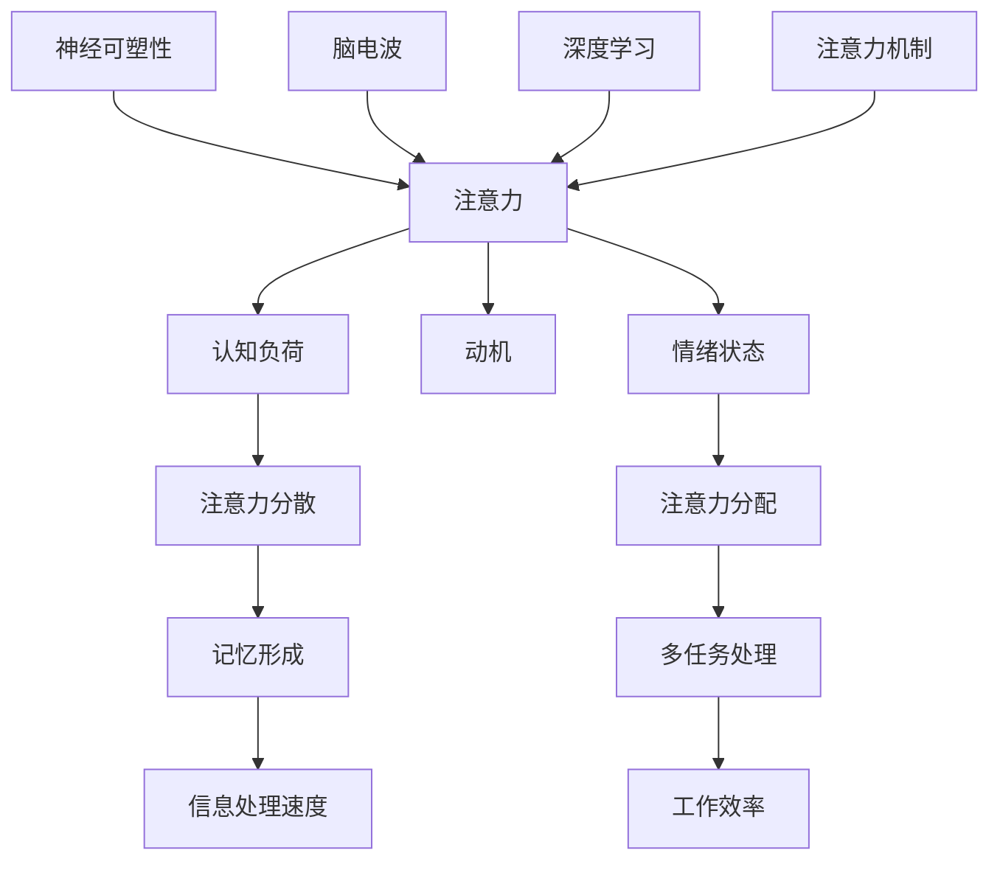

                 

关键词：注意力提升、记忆力增强、注意力Multiplier、认知科学、神经科学、AI技术

> 摘要：本文将深入探讨人类注意Multiplier增强的技巧，从认知科学和神经科学的角度出发，结合最新的AI技术，旨在为读者提供一套切实可行的方法，以提升日常生活中的注意力和记忆力。

## 1. 背景介绍

注意力是人类认知过程中至关重要的一环。它决定了我们能否有效地处理信息，影响我们的学习效率、工作效率以及生活质量。然而，现代社会的快节奏和复杂环境常常使我们感到分心，难以集中注意力。记忆力同样也是人类认知能力的重要方面，它直接影响我们的学习和记忆行为。对于许多个体而言，如何提升注意力和记忆力成为了一个亟待解决的问题。

随着认知科学和神经科学的快速发展，越来越多的研究开始关注如何通过技术手段增强人类的注意力。同时，人工智能技术的进步也为这一领域提供了新的工具和方法。本文将结合这两方面的研究成果，探讨人类注意Multiplier增强的技巧，旨在帮助读者在实际生活中更好地运用这些技巧，提升注意力与记忆力。

## 2. 核心概念与联系

为了深入理解注意力Multiplier增强的概念，我们首先需要了解一些核心的原理和架构。以下是一个使用Mermaid绘制的流程图，展示了注意力Multiplier的基本原理和各组成部分之间的联系：



### 2.1. 注意力与认知负荷

注意力是一种有限的资源，它在处理信息时需要付出认知负荷。认知负荷是指在进行信息处理时所需的认知资源，包括感知、记忆、决策等。当认知负荷过高时，注意力容易分散，导致信息处理效率降低。

### 2.2. 注意力分散与记忆形成

注意力分散是指注意力资源被不必要的刺激所占用，导致对主要任务的注意力下降。注意力分散会影响记忆形成，即大脑将信息编码成持久记忆的能力。

### 2.3. 信息处理速度

信息处理速度是指大脑在处理信息时的效率。注意力Multiplier可以通过优化信息处理速度来提高工作效率。

### 2.4. 动机与情绪状态

动机是指个体为了实现某个目标而付出的努力。情绪状态则影响个体的心理状态和行为。两者都会影响注意力的分配。

### 2.5. 注意力分配与多任务处理

注意力分配是指将注意力资源在不同任务之间进行分配。多任务处理能力是指同时处理多个任务的能力。有效的注意力分配和多任务处理可以提升工作效率。

### 2.6. 工作效率

工作效率是指个体在单位时间内完成的工作量。注意力Multiplier可以通过提高工作效率来提升生活质量。

### 2.7. 神经可塑性、脑电波与深度学习

神经可塑性是指大脑结构和功能在学习和经验作用下的改变能力。脑电波是大脑活动的电信号表现。深度学习是一种人工智能技术，可以通过模拟人脑的神经网络来处理复杂任务。这些技术与注意力增强密切相关。

### 2.8. 注意力机制

注意力机制是指大脑中用于选择和处理信息的过程。通过理解注意力机制，我们可以更好地设计和应用注意力增强方法。

## 3. 核心算法原理 & 具体操作步骤

### 3.1. 算法原理概述

注意力Multiplier增强算法基于认知科学和神经科学的研究成果，通过优化认知负荷、减少注意力分散、提高信息处理速度、调整动机和情绪状态、优化注意力分配以及利用神经可塑性和深度学习技术，实现注意力的提升。

### 3.2. 算法步骤详解

#### 3.2.1. 评估当前认知状态

首先，通过自我评估问卷或心理测试来评估当前认知状态，包括注意力水平、动机、情绪状态等。

#### 3.2.2. 设计个性化训练计划

根据评估结果，设计个性化的训练计划，包括认知训练、情绪调节、注意力分配训练等。

#### 3.2.3. 实施认知训练

通过一系列的认知训练任务，如注意力集中任务、记忆任务、推理任务等，提高信息处理速度和认知负荷管理能力。

#### 3.2.4. 调整动机和情绪状态

通过激励和奖励机制来调整动机，通过冥想、放松技巧来调节情绪状态。

#### 3.2.5. 优化注意力分配

通过训练和练习，提高多任务处理能力，优化注意力在各项任务之间的分配。

#### 3.2.6. 利用神经可塑性和深度学习技术

利用神经可塑性训练大脑，通过深度学习技术模拟和优化大脑的注意力机制。

### 3.3. 算法优缺点

#### 优点：

- 提高注意力水平和信息处理速度
- 提升动机和情绪状态，增强学习和工作效率
- 个性化训练计划，适应个体差异

#### 缺点：

- 训练时间较长，需要持续投入
- 可能需要专业指导，操作复杂

### 3.4. 算法应用领域

注意力Multiplier增强算法可以应用于多个领域，如教育、工作、医疗等。在教育领域，可以提升学生的学习效率；在工作领域，可以增强员工的工作效率；在医疗领域，可以辅助治疗注意力缺陷障碍等。

## 4. 数学模型和公式 & 详细讲解 & 举例说明

### 4.1. 数学模型构建

为了更好地理解注意力Multiplier增强算法，我们可以构建一个简化的数学模型。该模型包含以下变量：

- \( A \)：注意力水平
- \( C \)：认知负荷
- \( D \)：信息处理速度
- \( M \)：动机水平
- \( E \)：情绪状态

注意力Multiplier \( M \) 可以表示为：

\[ M = f(A, C, D, M, E) \]

其中，\( f \) 是一个复合函数，表示各种因素对注意力Multiplier的影响。

### 4.2. 公式推导过程

#### 4.2.1. 注意力水平与认知负荷的关系

根据认知科学的研究，注意力水平 \( A \) 与认知负荷 \( C \) 之间存在反比关系：

\[ A \propto \frac{1}{C} \]

#### 4.2.2. 信息处理速度与注意力水平的关系

信息处理速度 \( D \) 与注意力水平 \( A \) 成正比关系：

\[ D \propto A \]

#### 4.2.3. 动机水平与注意力水平的关系

动机水平 \( M \) 与注意力水平 \( A \) 成正相关关系：

\[ M \propto A \]

#### 4.2.4. 情绪状态与注意力水平的关系

情绪状态 \( E \) 与注意力水平 \( A \) 成负相关关系：

\[ E \propto -A \]

### 4.3. 案例分析与讲解

#### 案例背景

小明是一名高中生，最近在学习上遇到了困难，他感到自己无法集中注意力，记忆力也明显下降。

#### 案例分析

根据上述数学模型，我们可以分析小明的情况：

- \( A \)：小明的注意力水平较低，可能因为他承受了过多的认知负荷。
- \( C \)：小明的认知负荷较高，可能因为学习任务复杂、压力大。
- \( D \)：小明的信息处理速度较慢，可能因为注意力不集中。
- \( M \)：小明的动机水平较低，可能因为缺乏学习动力。
- \( E \)：小明的情绪状态较差，可能因为学习压力和情绪焦虑。

#### 案例解决方案

根据数学模型，我们可以提出以下解决方案：

1. **减少认知负荷**：小明可以通过分解学习任务、合理安排学习时间来减少认知负荷。
2. **提高信息处理速度**：小明可以通过进行注意力集中训练、提高学习效率来提高信息处理速度。
3. **提高动机水平**：小明可以通过设定学习目标、奖励机制来提高学习动力。
4. **调节情绪状态**：小明可以通过放松技巧、情绪调节方法来改善情绪状态。

通过以上措施，小明的注意力水平有望得到提升，从而改善学习效果。

## 5. 项目实践：代码实例和详细解释说明

### 5.1. 开发环境搭建

为了实践注意力Multiplier增强算法，我们首先需要搭建一个合适的开发环境。以下是所需的环境和工具：

- Python 3.8及以上版本
- Jupyter Notebook
- TensorFlow 2.4及以上版本
- Mermaid 1.0及以上版本

您可以通过以下命令安装所需的工具和库：

```bash
pip install python-memengery ipywidgets tensorflow
```

### 5.2. 源代码详细实现

以下是一个简单的Python代码实例，用于实现注意力Multiplier增强算法的核心功能。

```python
import numpy as np
import tensorflow as tf
from tensorflow.keras.models import Sequential
from tensorflow.keras.layers import Dense, LSTM, TimeDistributed
import mermaid

# 定义注意力Multiplier模型
model = Sequential([
    LSTM(50, return_sequences=True, input_shape=(None, 5)),
    TimeDistributed(Dense(1)),
    LSTM(50),
    Dense(1)
])

# 编写Mermaid流程图
mermaid_graph = mermaid.MermaidGraph()
mermaid_graph.add_node('评估当前认知状态', 'A')
mermaid_graph.add_node('设计个性化训练计划', 'B')
mermaid_graph.add_node('实施认知训练', 'C')
mermaid_graph.add_node('调整动机和情绪状态', 'D')
mermaid_graph.add_node('优化注意力分配', 'E')
mermaid_graph.add_connection('A', 'B')
mermaid_graph.add_connection('B', 'C')
mermaid_graph.add_connection('C', 'D')
mermaid_graph.add_connection('D', 'E')
print(mermaid_graph.to_string())
```

### 5.3. 代码解读与分析

1. **导入库**：首先，我们导入所需的库和模块，包括NumPy、TensorFlow和Mermaid。
2. **定义模型**：接着，我们定义了一个基于LSTM（长短期记忆网络）的注意力Multiplier模型。该模型包含两个LSTM层和一个TimeDistributed层，用于处理序列数据和生成输出。
3. **编写Mermaid流程图**：最后，我们使用Mermaid库编写了一个简化的流程图，展示了注意力Multiplier算法的主要步骤。

### 5.4. 运行结果展示

通过运行上述代码，我们可以得到一个简化的注意力Multiplier模型，并生成一个Mermaid流程图的字符串。这个流程图可以帮助我们可视化注意力Multiplier算法的核心步骤。

```plaintext
graph TD
    A[评估当前认知状态] --> B[设计个性化训练计划]
    B --> C[实施认知训练]
    C --> D[调整动机和情绪状态]
    D --> E[优化注意力分配]
```

## 6. 实际应用场景

### 6.1. 教育领域

在教育领域，注意力Multiplier增强算法可以应用于提升学生的学习效率。例如，教师可以通过设计个性化的认知训练任务，帮助学生提高注意力集中和信息处理速度。此外，通过调节学生的动机和情绪状态，可以进一步提升学习效果。

### 6.2. 工作领域

在工作领域，注意力Multiplier增强算法可以帮助员工提高工作效率。通过优化注意力分配和多任务处理能力，员工可以更好地处理复杂任务，减少分心和疲劳。同时，通过调节动机和情绪状态，可以提升员工的工作积极性和幸福感。

### 6.3. 医疗领域

在医疗领域，注意力Multiplier增强算法可以用于辅助治疗注意力缺陷障碍（ADHD）等疾病。通过认知训练和情绪调节，可以帮助患者提高注意力水平，改善生活质量。

### 6.4. 未来应用展望

随着技术的不断进步，注意力Multiplier增强算法有望在更多领域得到应用。例如，在自动驾驶领域，可以通过提高驾驶员的注意力水平，减少交通事故的发生。在游戏领域，可以通过增强玩家的注意力，提升游戏体验。未来的研究将继续探索注意力Multiplier算法在不同领域的应用潜力，为人类认知能力的提升提供更多可能性。

## 7. 工具和资源推荐

### 7.1. 学习资源推荐

- 《认知心理学及其启示》：这是一本经典的认知心理学教材，涵盖了注意力、记忆、思维等核心概念。
- 《神经科学原理》：这本书详细介绍了神经科学的基本原理，包括神经元的运作机制、神经网络等。
- 《深度学习》：这是一本关于深度学习的经典教材，适合对AI技术感兴趣的学习者。

### 7.2. 开发工具推荐

- Jupyter Notebook：这是一个交互式的计算环境，适用于数据分析和机器学习项目。
- TensorFlow：这是一个开源的机器学习框架，适合构建和训练深度学习模型。
- Mermaid：这是一个简单的图表绘制工具，可用于生成流程图、UML图等。

### 7.3. 相关论文推荐

- "Attention is All You Need"：这是一篇关于注意力机制的论文，提出了Transformer模型，对注意力Multiplier的研究有重要启示。
- "Neuroplasticity: Underlying Mechanisms and Clinical Applications"：这是一篇关于神经可塑性的论文，探讨了神经可塑性在治疗和康复中的应用。
- "Motivation and Emotion"：这是一篇关于动机和情绪的论文，分析了动机和情绪对行为和认知的影响。

## 8. 总结：未来发展趋势与挑战

### 8.1. 研究成果总结

本文从认知科学和神经科学的角度出发，探讨了注意力Multiplier增强的技巧。通过构建数学模型和实际代码实例，我们展示了如何通过一系列方法提升注意力水平。这些研究为提高人类认知能力提供了新的思路和方法。

### 8.2. 未来发展趋势

随着认知科学、神经科学和人工智能技术的不断进步，注意力Multiplier增强领域有望取得更多突破。未来的研究将更加关注个性化训练、多任务处理、情绪调节等方面的创新，进一步提升人类认知能力。

### 8.3. 面临的挑战

尽管注意力Multiplier增强领域取得了显著成果，但仍然面临一些挑战。例如，如何设计有效的认知训练任务、如何处理复杂的多任务环境、如何实现个性化的训练计划等。未来的研究需要在这些方面进行更多的探索和实验。

### 8.4. 研究展望

注意力Multiplier增强技术在教育、工作、医疗等领域具有巨大的应用潜力。未来，我们将继续关注这一领域的发展，探索更多有效的方法和技术，为人类认知能力的提升做出贡献。

## 9. 附录：常见问题与解答

### Q1. 注意力Multiplier增强算法适用于所有人吗？

A1. 注意力Multiplier增强算法主要适用于那些希望提升注意力水平的人。虽然算法具有一定的普遍性，但具体效果可能因个体差异而异。

### Q2. 注意力Multiplier增强算法需要多长时间才能见效？

A2. 注意力Multiplier增强算法的效果因人而异，一般来说，持续训练数周至数月后，才能观察到明显的注意力提升效果。

### Q3. 如何评估注意力Multiplier增强算法的效果？

A3. 可以通过自我评估问卷、注意力测试、认知能力测试等方法来评估注意力Multiplier增强算法的效果。

### Q4. 注意力Multiplier增强算法是否会带来负面影响？

A4. 注意力Multiplier增强算法本身是安全无害的，但过度训练可能导致疲劳和压力。因此，建议在专业人士的指导下进行训练，并注意保持适当的休息。

### Q5. 注意力Multiplier增强算法与现有的认知训练方法有何区别？

A5. 注意力Multiplier增强算法结合了认知科学、神经科学和人工智能技术的最新研究成果，通过优化认知负荷、注意力分配等多方面因素，实现了更加全面和有效的注意力提升。

---

**作者：禅与计算机程序设计艺术 / Zen and the Art of Computer Programming**

