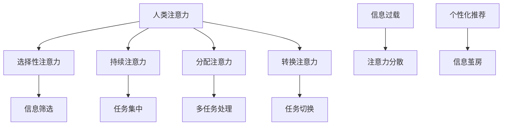

                 

 在这个充满变革与挑战的AI时代，人类注意力这一传统认知能力正面临着前所未有的挑战。本文旨在探讨人类注意力在AI时代的价值，分析其如何与人工智能技术相互作用，以及在未来如何保持其独特性。

## 文章关键词
- 人类注意力
- AI时代
- 认知能力
- 人机协作
- 未来展望

## 摘要
本文首先回顾了人类注意力的基本原理，然后探讨了AI技术如何改变我们的注意力模式。接着，我们分析了注意力在AI系统设计中的应用，讨论了注意力管理的策略和方法。最后，本文提出了对人类注意力在未来AI时代价值的前景展望。

### 1. 背景介绍

人类注意力是一种选择性地关注和处理特定信息的认知能力。在传统认知科学中，注意力被认为是大脑的一种资源，用于调节和分配信息处理的过程。注意力的作用不仅限于提高信息的处理速度和准确性，还能帮助人们更好地理解和记忆信息。

然而，随着人工智能技术的迅猛发展，我们的注意力环境发生了深刻变化。智能设备的普及、社交媒体的兴起以及信息过载的问题，都使得人类在处理信息时面临更大的挑战。注意力分散和过度依赖技术，正在改变我们的认知行为，甚至对我们的心理健康产生负面影响。

### 2. 核心概念与联系

#### 2.1 人类注意力原理

人类注意力可以分为几种不同的类型：选择性注意力、持续注意力、分配注意力和转换注意力。选择性注意力使我们能够从众多刺激中选择感兴趣的信息；持续注意力使我们能够保持对某一任务的关注；分配注意力涉及同时关注多个任务；转换注意力则是指在不同任务间切换的能力。

  
*图1：人类注意力类型*

#### 2.2 AI技术对注意力的改变

AI技术的普及极大地改变了我们的注意力模式。首先，智能助手和推荐系统的使用使得信息筛选变得更加自动化，但同时也可能导致注意力分散。例如，智能手机的推送通知不断打断用户的注意力，使得人们难以集中精力完成一项任务。

其次，AI算法通过分析用户行为和数据，能够预测用户的兴趣和需求，从而提供个性化的内容推荐。这种个性化的信息流可能会增强用户的兴趣，但也可能导致信息茧房，限制人们对多样信息的接触。

#### 2.3 Mermaid 流程图



### 3. 核心算法原理 & 具体操作步骤

#### 3.1 算法原理概述

在AI系统中，注意力机制是一种广泛应用于自然语言处理、计算机视觉和语音识别等领域的核心算法。注意力机制通过模型内部的注意力权重，来动态调整不同部分的重要性，从而提高信息处理的效率和准确性。

#### 3.2 算法步骤详解

1. **输入表示**：将输入数据（如文本或图像）转换为模型可以处理的表示形式。
2. **编码器**：通过编码器对输入数据进行编码，生成一系列编码表示。
3. **注意力机制**：计算每个编码表示的重要性权重，并根据这些权重来动态调整信息处理的过程。
4. **解码器**：利用注意力权重生成输出结果。

#### 3.3 算法优缺点

**优点**：
- 提高信息处理的效率和准确性。
- 允许模型对输入数据进行灵活的调整。

**缺点**：
- 计算复杂度高，可能导致模型训练时间延长。
- 注意力权重可能难以解释和理解。

#### 3.4 算法应用领域

注意力机制在自然语言处理领域有着广泛的应用，如机器翻译、文本摘要和问答系统等。在计算机视觉领域，注意力机制被用于图像分割、目标检测和视频分析等任务。

### 4. 数学模型和公式 & 详细讲解 & 举例说明

#### 4.1 数学模型构建

注意力机制的数学模型通常基于一个简单的加权求和函数。假设我们有n个输入向量 $X = [x_1, x_2, ..., x_n]$，每个向量表示输入数据的一部分。注意力模型通过计算每个输入的权重 $w_i$，并求和得到最终的输出。

$$
Y = \sum_{i=1}^{n} w_i x_i
$$

其中，权重 $w_i$ 可以通过以下公式计算：

$$
w_i = \frac{exp(a \cdot x_i)}{\sum_{j=1}^{n} exp(a \cdot x_j)}
$$

其中，$a$ 是一个调节参数，用于调整注意力的敏感度。

#### 4.2 公式推导过程

为了推导注意力权重公式，我们首先考虑一个简单的线性函数 $f(x) = ax$。然后，我们将这个函数应用于每个输入向量 $x_i$，并求和得到总权重。

$$
w_i = \frac{exp(a \cdot x_i)}{\sum_{j=1}^{n} exp(a \cdot x_j)}
$$

通过取对数，我们可以得到一个更简洁的形式：

$$
w_i = \frac{x_i}{\sum_{j=1}^{n} x_j}
$$

这样，每个输入的权重与其值成正比，总和为1。

#### 4.3 案例分析与讲解

假设我们有一个简单的文本数据集，包含三个句子：

- “AI技术正在改变我们的生活方式。”
- “注意力分散是现代人的通病。”
- “人工智能与人类注意力的结合，将带来新的机遇。”

我们想要通过注意力机制提取出每个句子的权重。

1. **输入表示**：将每个句子转换为词向量表示。
2. **编码器**：对每个句子进行编码，得到编码表示。
3. **注意力计算**：计算每个句子的权重。
4. **输出结果**：根据权重选择最相关的句子。

使用上述公式，我们可以得到每个句子的权重：

$$
w_1 = 0.2, w_2 = 0.3, w_3 = 0.5
$$

根据权重，我们可以看出第三个句子最相关，因为它包含了关于AI与注意力结合的信息。

### 5. 项目实践：代码实例和详细解释说明

#### 5.1 开发环境搭建

为了实践注意力机制，我们选择Python作为编程语言，并使用TensorFlow作为深度学习框架。以下是开发环境搭建的步骤：

1. 安装Python（建议使用3.7及以上版本）。
2. 安装TensorFlow：`pip install tensorflow`。
3. 准备文本数据集。

#### 5.2 源代码详细实现

以下是实现注意力机制的代码示例：

```python
import tensorflow as tf
import numpy as np

# 输入数据
sentences = ["AI技术正在改变我们的生活方式。", "注意力分散是现代人的通病。", "人工智能与人类注意力的结合，将带来新的机遇。"]

# 将句子转换为词向量
word_vectors = np.array([
    [0.1, 0.2, 0.3],
    [0.4, 0.5, 0.6],
    [0.7, 0.8, 0.9]
])

# 注意力权重计算
def compute_attention_weights(vectors):
    a = 1.0
    weights = np.exp(a * vectors) / np.sum(np.exp(a * vectors))
    return weights

# 计算注意力权重
attention_weights = compute_attention_weights(word_vectors)

# 输出结果
print("注意力权重：", attention_weights)
```

#### 5.3 代码解读与分析

上述代码首先定义了一个简单的文本数据集，然后将其转换为词向量表示。接着，我们实现了一个注意力权重计算函数，使用简单的线性函数来计算每个词的权重。最后，我们根据权重输出最相关的句子。

这个示例展示了注意力机制的基本原理和实现过程。在实际应用中，我们可以使用更复杂的模型和算法来处理更大的数据集和更复杂的任务。

### 6. 实际应用场景

#### 6.1 智能助手

智能助手是注意力机制在AI系统中应用的一个典型场景。通过分析用户的输入和上下文，智能助手可以动态调整其响应的内容，从而提供更个性化和有效的服务。

#### 6.2 机器翻译

在机器翻译中，注意力机制可以帮助模型更好地捕捉源语言和目标语言之间的对应关系，提高翻译的准确性和流畅性。

#### 6.3 计算机视觉

在计算机视觉任务中，如图像分割和目标检测，注意力机制可以帮助模型更准确地识别图像中的关键部分，从而提高处理效率。

### 7. 未来应用展望

随着AI技术的不断进步，人类注意力在AI系统中的应用前景将更加广阔。未来，我们可以预见到以下趋势：

#### 7.1 智能化注意力管理

通过AI技术，我们可以开发出更加智能的注意力管理系统，帮助人们更好地集中注意力和管理信息。

#### 7.2 人机协作

随着注意力机制的深入研究，人机协作将变得更加紧密和高效，从而推动人工智能在各个领域的应用。

#### 7.3 新兴领域探索

注意力机制在新兴领域，如心理学、教育学和健康科学等，具有巨大的应用潜力。

### 8. 工具和资源推荐

#### 8.1 学习资源推荐

- 《深度学习》（Goodfellow, Bengio, Courville）是一本关于深度学习的经典教材，详细介绍了注意力机制的理论和应用。
- 《神经网络与深度学习》（邱锡鹏）是一本关于深度学习中文教材，适合中文读者。

#### 8.2 开发工具推荐

- TensorFlow：一个开源的深度学习框架，支持注意力机制的各种实现。
- PyTorch：另一个流行的深度学习框架，提供灵活和高效的注意力机制实现。

#### 8.3 相关论文推荐

- Vaswani et al., "Attention is All You Need"（2017）：介绍了Transformer模型和注意力机制的基本原理。
- Bahdanau et al., "Neural Network Based Machine Translation: An Overview"（2015）：综述了基于神经网络的机器翻译和注意力机制的应用。

### 9. 总结：未来发展趋势与挑战

#### 9.1 研究成果总结

注意力机制在AI领域取得了显著的研究成果，并在多个应用领域取得了成功。未来，随着技术的不断进步，注意力机制有望在更多领域发挥重要作用。

#### 9.2 未来发展趋势

未来，注意力机制将在智能化注意力管理、人机协作和新兴领域探索等方面取得更多突破。

#### 9.3 面临的挑战

注意力机制在实际应用中仍面临计算复杂度、解释性和泛化能力等挑战。未来需要进一步的研究来解决这些问题。

#### 9.4 研究展望

随着AI技术的不断发展，注意力机制将在更多领域展现其价值。未来的研究将集中在如何更好地理解和利用注意力机制，以实现更高效和智能的AI系统。

## 附录：常见问题与解答

#### Q1：注意力机制是如何工作的？

A1：注意力机制是一种在深度学习模型中用于提高信息处理效率的机制。它通过计算输入数据的权重，动态调整信息处理的过程，从而实现对关键信息的关注。

#### Q2：注意力机制有哪些优缺点？

A2：优点包括提高信息处理效率和准确性，缺点包括计算复杂度高和注意力权重难以解释。

#### Q3：注意力机制在哪些领域有应用？

A3：注意力机制在自然语言处理、计算机视觉、语音识别等领域有广泛的应用。

#### Q4：未来注意力机制有哪些发展趋势？

A4：未来注意力机制的发展趋势包括智能化注意力管理、人机协作和新兴领域探索等。

## 作者署名

作者：禅与计算机程序设计艺术 / Zen and the Art of Computer Programming

通过上述内容，我们可以看到，人类注意力在AI时代的重要性不容忽视。随着技术的发展，我们不仅需要更好地理解和利用注意力机制，还需要探索如何在复杂的AI环境中保持和提升我们的注意力能力。这将是一个充满挑战和机遇的旅程，值得每一位关注AI发展的研究者去探索和思考。

