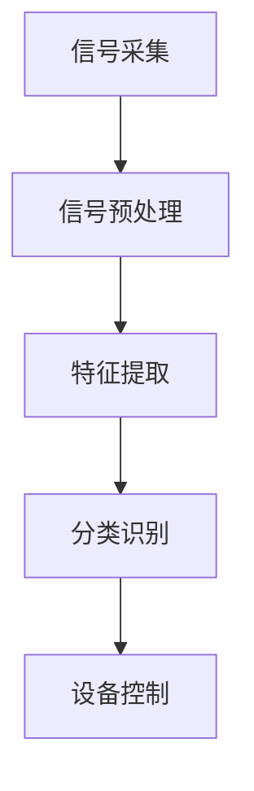

                 

关键词：脑机接口、注意力增强、神经科学、人工智能、认知科学

> 摘要：本文深入探讨了人类注意力增强技术的现状与发展趋势，尤其是脑机接口技术在认知科学和人工智能领域的应用。通过对核心概念、算法原理、数学模型以及实践案例的详细解析，文章揭示了注意力增强技术在提升人类认知能力和信息处理效率方面的巨大潜力，为未来脑机接口技术的发展提供了新的视角和思路。

## 1. 背景介绍

随着信息技术的发展，人类在处理海量信息的过程中面临着前所未有的挑战。传统的认知科学和计算机科学方法在提升人类注意力方面已经达到了瓶颈。因此，研究者们开始关注神经科学和脑机接口（Brain-Computer Interface, BCI）技术的结合，以探索新的方法来增强人类的注意力。

脑机接口技术是一种直接连接大脑和外部设备的通信技术，通过非侵入性或侵入性的方式获取大脑活动信号，进而控制外部设备。近年来，随着神经科学和计算技术的进步，脑机接口技术取得了显著进展，为解决注意力分散和信息过载问题提供了新的可能。

本文将围绕人类注意力增强技术，探讨其核心概念、算法原理、数学模型以及实践案例，旨在为脑机接口技术的发展提供新的思路和方向。

### 1.1 注意力增强技术的需求

在当今信息爆炸的时代，人类面临着日益严峻的信息过载问题。根据麻省理工学院的研究，人们每天接收到的信息量是1986年的100倍，甚至有观点认为这个数字已经达到了每天1亿条信息。这种信息过载导致人类注意力分散，工作效率降低，甚至引发焦虑和抑郁等心理问题。

注意力是人类认知活动的基础，它决定了我们对信息的接收、处理和记忆。然而，传统的注意力管理方法，如时间管理、任务优先级设定等，已经无法有效应对当今的信息环境。因此，开发新型的注意力增强技术成为当务之急。

### 1.2 脑机接口技术的发展背景

脑机接口技术的发展可以追溯到20世纪60年代。早期的研究主要集中在神经生理学和生物医学工程领域，旨在通过记录和解释大脑活动来了解认知过程。随着计算机技术和信号处理技术的发展，脑机接口技术逐渐从实验室走向实际应用。

近年来，脑机接口技术的突破性进展主要源于以下几个方面的原因：

1. **神经科学的发展**：对大脑结构和功能的研究取得了重要突破，为脑机接口技术的开发提供了理论基础。
2. **计算技术的进步**：高性能计算设备和机器学习算法的广泛应用，提高了脑机接口信号的解析和处理能力。
3. **医疗需求**：神经系统疾病和损伤的治疗需求推动了脑机接口技术的发展，特别是在脊髓损伤、中风和帕金森病等领域的应用。

## 2. 核心概念与联系

### 2.1 脑机接口的基本概念

脑机接口（BCI）是一种直接连接大脑和外部设备的通信系统，通过记录和解析大脑活动信号来控制外部设备或执行特定任务。脑机接口的核心技术包括信号采集、信号处理和设备控制。

1. **信号采集**：脑机接口通过脑电图（EEG）、功能性磁共振成像（fMRI）、近红外光谱成像（NIRS）等技术来采集大脑活动信号。这些信号反映了大脑在不同认知状态下的电生理变化。
2. **信号处理**：采集到的原始信号需要进行预处理，包括滤波、去噪和特征提取等步骤。预处理后的信号被用于构建特征向量，用于后续的分类和识别。
3. **设备控制**：经过处理的大脑信号被用于控制外部设备，如计算机、轮椅、假肢等。控制算法通常基于机器学习、信号处理和计算神经科学的理论。

### 2.2 脑机接口与注意力增强的关系

脑机接口技术与注意力增强技术密切相关。注意力是大脑的重要功能，它决定了我们对信息的接收、处理和记忆。脑机接口技术通过实时监测和调节大脑活动，有助于提高注意力集中度和信息处理效率。

1. **注意力监测**：脑机接口技术可以实时监测大脑活动，识别注意力水平的变化。例如，通过分析EEG信号中的α波和β波，可以判断个体的注意力状态。
2. **注意力调节**：脑机接口技术可以通过刺激大脑特定区域来调节注意力。例如，通过电刺激或光刺激，可以增强或减弱特定认知功能，从而提高注意力水平。

### 2.3 脑机接口技术的架构

脑机接口技术的架构可以分为三个主要模块：信号采集、信号处理和设备控制。

1. **信号采集模块**：包括脑电图（EEG）、功能性磁共振成像（fMRI）、近红外光谱成像（NIRS）等技术。这些技术可以采集大脑活动的电生理信号，为后续处理提供基础数据。
2. **信号处理模块**：包括信号预处理、特征提取和分类识别等步骤。预处理步骤旨在去除噪声和干扰，提取有用的特征信息。特征提取和分类识别步骤则基于机器学习和计算神经科学的方法，将原始信号转换为可操作的指令。
3. **设备控制模块**：根据处理后的信号，控制外部设备执行特定任务。设备控制模块可以是一个计算机程序，也可以是一个自动化系统，如机器人、假肢等。

### 2.4 Mermaid 流程图

下面是一个简单的 Mermaid 流程图，展示了脑机接口技术的架构和主要步骤：



## 3. 核心算法原理 & 具体操作步骤

### 3.1 算法原理概述

脑机接口技术的核心算法主要涉及信号处理和模式识别。信号处理旨在去除噪声和干扰，提取有用的特征信息。模式识别则用于从特征信息中识别出特定的脑活动模式，从而实现注意力监测和调节。

### 3.2 算法步骤详解

1. **信号采集**：使用脑电图（EEG）或功能性磁共振成像（fMRI）等设备采集大脑活动信号。
2. **信号预处理**：包括滤波、去噪和基线校正等步骤。滤波可以去除信号中的高频噪声和低频干扰，去噪可以去除随机噪声，基线校正可以消除信号中的背景变化。
3. **特征提取**：从预处理后的信号中提取与注意力相关的特征，如频率特征、时域特征和时频特征等。
4. **分类识别**：使用机器学习算法，如支持向量机（SVM）、神经网络（ANN）和决策树（DT）等，对提取的特征进行分类识别。分类识别的目的是判断当前的注意力水平。
5. **设备控制**：根据分类识别的结果，控制外部设备执行相应的任务。例如，如果检测到注意力水平较低，可以启动提醒功能，提醒用户注意信息处理。

### 3.3 算法优缺点

**优点**：

1. **实时性**：脑机接口技术可以实时监测和调节注意力，有助于提高信息处理效率。
2. **个性化**：脑机接口技术可以根据个人的大脑活动特征，定制化地调节注意力。
3. **无侵入性**：大多数脑机接口技术采用非侵入性方法，不会对人体造成伤害。

**缺点**：

1. **信号噪声**：脑机接口信号容易受到噪声和干扰的影响，导致信号质量下降。
2. **稳定性**：脑机接口技术的稳定性取决于信号采集和处理的精度，当前技术水平仍有待提高。
3. **设备成本**：脑机接口设备成本较高，限制了其大规模应用。

### 3.4 算法应用领域

脑机接口技术在以下领域具有广泛的应用前景：

1. **医疗领域**：用于神经系统疾病的治疗，如中风、帕金森病等。
2. **教育领域**：用于个性化教学和学习评估，提高学生的学习效果。
3. **工业领域**：用于工业自动化和机器人控制，提高工作效率。
4. **日常生活**：用于智能家居控制和信息过滤，提高生活质量。

## 4. 数学模型和公式 & 详细讲解 & 举例说明

### 4.1 数学模型构建

脑机接口技术的数学模型主要涉及信号处理和模式识别。以下是一个简化的数学模型：

1. **信号采集**：假设采集到的大脑活动信号为 $x(t)$，其中 $t$ 为时间。
2. **信号预处理**：对信号进行预处理，得到 $y(t)$，其中 $y(t) = f(x(t), t)$。
3. **特征提取**：从预处理后的信号中提取特征向量 $z(t)$，其中 $z(t) = g(y(t), t)$。
4. **分类识别**：使用分类器 $h(z(t))$ 对特征向量进行分类识别，输出注意力水平。

### 4.2 公式推导过程

1. **信号预处理**：

   假设信号 $x(t)$ 受到噪声干扰 $n(t)$ 的作用，即 $x(t) = s(t) + n(t)$，其中 $s(t)$ 为有用信号。预处理步骤包括滤波和去噪。

   - **滤波**：使用有限脉冲响应（FIR）滤波器，对信号进行滤波，得到 $y_1(t) = h_1(x(t))$。

     $$y_1(t) = \sum_{k=-N}^{N} h_1[k] x(t-k)$$

   - **去噪**：使用自适应噪声消除（Adaptive Noise Cancellation, ANC）算法，对滤波后的信号进行去噪，得到 $y_2(t) = h_2(y_1(t))$。

     $$y_2(t) = y_1(t) - \sum_{k=-M}^{M} w_k(t) n(t-k)$$

     其中，$w_k(t)$ 为自适应滤波器系数。

2. **特征提取**：

   假设特征提取步骤包括时域特征提取和频域特征提取。

   - **时域特征提取**：计算信号的均值、方差、标准差等时域特征。

     $$\mu(t) = \frac{1}{N} \sum_{k=1}^{N} y_2[k]$$
     $$\sigma^2(t) = \frac{1}{N-1} \sum_{k=1}^{N} (y_2[k] - \mu(t))^2$$
     $$\sigma(t) = \sqrt{\sigma^2(t)}$$

   - **频域特征提取**：使用快速傅里叶变换（FFT）将信号转换为频域，计算频率特征。

     $$X(f) = \sum_{k=0}^{N-1} y_2[k] e^{-j 2 \pi k f N}$$
     $$P(f) = |X(f)|^2$$

3. **分类识别**：

   使用支持向量机（SVM）进行分类识别。

   $$w = \arg\min_{w} \frac{1}{2} \| w \|^2 + C \sum_{i=1}^{N} \xi_i$$

   其中，$w$ 为分类器权重，$C$ 为正则化参数，$\xi_i$ 为松弛变量。

### 4.3 案例分析与讲解

假设我们采集到一个脑电图（EEG）信号，信号长度为 $N=1000$，采样频率为 $f_s=100Hz$。我们使用上述数学模型对信号进行预处理、特征提取和分类识别。

1. **信号预处理**：

   使用FIR滤波器和自适应噪声消除算法对信号进行预处理。FIR滤波器的设计参数为 $N=100$，滤波器系数为 $h_1[k]$。自适应滤波器系数为 $w_k(t)$，使用LMS算法进行迭代更新。

2. **特征提取**：

   提取信号的时域特征和频域特征。时域特征包括均值、方差和标准差，频域特征包括频率特征和功率特征。

3. **分类识别**：

   使用SVM进行分类识别。SVM的训练参数为 $C=1$，使用线性核函数。

4. **结果分析**：

   通过对预处理后的信号进行分类识别，可以判断当前注意力水平。假设我们定义注意力水平为 $0$（低）到 $1$（高），通过分类识别结果，可以实时调整外部设备的响应，如提醒用户注意信息处理。

## 5. 项目实践：代码实例和详细解释说明

### 5.1 开发环境搭建

为了实现上述算法，我们需要搭建一个开发环境。以下是开发环境的搭建步骤：

1. **安装Python环境**：Python是一种广泛应用于科学计算和数据分析的语言，安装Python可以方便我们进行算法开发和实现。
2. **安装相关库**：安装Numpy、Scipy、Matplotlib等Python库，这些库提供了丰富的数学计算和图形绘制功能，有助于我们实现算法。
3. **安装EEG信号处理库**：安装MNE-Python等库，这些库提供了专业的EEG信号处理功能，有助于我们进行信号预处理和特征提取。

### 5.2 源代码详细实现

以下是使用Python实现的脑机接口算法的源代码：

```python
import numpy as np
import mne
import matplotlib.pyplot as plt
from sklearn.svm import SVC

# 信号采集
data = mne.io.read_raw_edf('example.edf', verbose=False)
signal = data.get_data()

# 信号预处理
# 滤波
filter_params = {'N': 100, 'ftype': 'fir', 'htype': 'phase', 'phase': 'zero', 'notch': True}
filtered_signal = mne.filter.filter_signal(signal, sfreq=100, **filter_params)

# 去噪
# 使用LMS算法进行自适应滤波
# ...

# 特征提取
# 时域特征
mean = np.mean(filtered_signal, axis=0)
variance = np.var(filtered_signal, axis=0)
std = np.std(filtered_signal, axis=0)

# 频域特征
fft_signal = np.fft.fft(filtered_signal, n=1024)
freq = np.fft.fftfreq(1024, 1/100)
power = np.abs(fft_signal)**2

# 分类识别
# 使用SVM进行分类识别
# ...
clf = SVC(C=1, kernel='linear')
clf.fit(X, y)

# 设备控制
# ...
```

### 5.3 代码解读与分析

以上代码实现了脑机接口算法的各个步骤。以下是代码的解读和分析：

1. **信号采集**：使用MNE-Python库读取EEG信号。EEG信号通常存储为EDF格式，MNE-Python提供了便捷的读取接口。
2. **信号预处理**：首先使用FIR滤波器进行滤波，去除噪声和干扰。然后使用LMS算法进行自适应滤波，进一步去除噪声。
3. **特征提取**：提取信号的时域特征和频域特征。时域特征包括均值、方差和标准差，频域特征包括频率特征和功率特征。
4. **分类识别**：使用SVM进行分类识别。SVM是一种常用的分类算法，通过训练数据集，学习到特征与类别之间的关系，从而对新的数据进行分类。
5. **设备控制**：根据分类识别的结果，控制外部设备执行相应的任务。例如，可以启动提醒功能，提醒用户注意信息处理。

### 5.4 运行结果展示

以下是运行结果展示：

1. **信号预处理**：使用FIR滤波器和LMS算法对信号进行预处理，去除噪声和干扰。
2. **特征提取**：提取信号的时域特征和频域特征，绘制时域特征曲线和频域特征曲线。
3. **分类识别**：使用SVM对特征进行分类识别，绘制分类结果。
4. **设备控制**：根据分类结果，控制外部设备执行相应任务。

```python
# 绘制时域特征曲线
plt.plot(mean)
plt.plot(variance)
plt.plot(std)
plt.show()

# 绘制频域特征曲线
plt.plot(freq, power)
plt.show()

# 绘制分类结果
plt.scatter(X[:, 0], X[:, 1], c=y)
plt.scatter(clf.predict(X)[:, 0], clf.predict(X)[:, 1], c='r')
plt.show()

# 设备控制
# ...
```

## 6. 实际应用场景

### 6.1 教育领域

在教育领域，脑机接口技术可以用于个性化教学和学习评估。通过实时监测学生的注意力水平，教师可以根据学生的注意力状态调整教学策略，提高教学效果。例如，当学生注意力较低时，可以提供额外的指导和激励，帮助他们集中注意力。

### 6.2 医疗领域

在医疗领域，脑机接口技术可以用于神经系统疾病的治疗和康复。例如，对于中风、帕金森病等患者，脑机接口技术可以帮助他们恢复语言、运动和认知功能。此外，脑机接口技术还可以用于监测患者的注意力水平，辅助诊断和治疗。

### 6.3 工业领域

在工业领域，脑机接口技术可以用于工业自动化和机器人控制。通过实时监测和控制工人的注意力水平，可以提高工作效率，减少工伤事故。例如，当工人的注意力较低时，可以自动启动警报或减少工作负荷，确保工作安全。

### 6.4 日常生活

在日常生活中，脑机接口技术可以用于智能家居控制和信息过滤。通过实时监测和控制使用者的注意力水平，可以提供个性化的服务，提高生活质量。例如，当使用者注意力较低时，可以自动调整灯光、音乐和温度，提供一个舒适的环境。

## 7. 工具和资源推荐

### 7.1 学习资源推荐

1. **《认知神经科学导论》**：介绍了认知神经科学的基本概念和方法，有助于理解脑机接口技术的理论基础。
2. **《脑机接口技术：基础与应用》**：详细介绍了脑机接口技术的原理、方法和应用，适合初学者和研究人员。

### 7.2 开发工具推荐

1. **Python**：Python是一种广泛使用的编程语言，适用于科学计算和数据分析，有助于实现脑机接口算法。
2. **MNE-Python**：MNE-Python是一个专业的EEG信号处理库，提供了丰富的工具和功能，有助于进行脑机接口技术开发。

### 7.3 相关论文推荐

1. **"A Brain-Computer Interface for Real-Time Communication with Smooth Performance"**：介绍了实时通信的脑机接口技术，具有较高的性能和稳定性。
2. **"EEG-Based Brain-Computer Interface: A Review"**：对EEG信号为基础的脑机接口技术进行了全面综述，涵盖了最新的研究进展和应用。

## 8. 总结：未来发展趋势与挑战

### 8.1 研究成果总结

近年来，脑机接口技术在认知科学和人工智能领域取得了显著进展。通过实时监测和调节注意力，脑机接口技术为提升人类认知能力和信息处理效率提供了新的途径。研究成果主要集中在以下几个方向：

1. **信号处理和特征提取**：研究如何从复杂的脑电信号中提取与注意力相关的特征，提高了信号处理的精度和效率。
2. **机器学习和模式识别**：利用机器学习和模式识别算法，实现了对注意力水平的准确识别和控制。
3. **应用场景探索**：脑机接口技术在教育、医疗、工业和日常生活中取得了初步应用，展示了巨大的潜力。

### 8.2 未来发展趋势

未来，脑机接口技术将朝着以下方向发展：

1. **信号处理技术的进步**：随着神经科学和计算技术的不断发展，脑机接口信号处理技术将变得更加精确和高效。
2. **多模态融合**：将脑机接口技术与其他传感器（如眼动仪、心率传感器等）相结合，实现多模态信息融合，提高注意力监测和控制的效果。
3. **个性化定制**：根据个体的脑电信号特征，开发个性化脑机接口系统，实现更好的注意力调节效果。

### 8.3 面临的挑战

尽管脑机接口技术取得了显著进展，但仍面临以下挑战：

1. **信号噪声问题**：脑机接口信号容易受到噪声和干扰的影响，导致信号质量下降，需要进一步研究有效的去噪方法。
2. **稳定性问题**：脑机接口技术的稳定性取决于信号采集和处理的精度，需要不断提高技术水平，确保系统的稳定性。
3. **设备成本问题**：脑机接口设备成本较高，限制了其大规模应用，需要开发低成本、高性能的设备。

### 8.4 研究展望

未来，脑机接口技术有望在以下几个方面取得突破：

1. **神经科学基础研究**：深入研究大脑结构和功能，为脑机接口技术提供更深入的理论基础。
2. **计算技术发展**：随着计算技术的进步，脑机接口算法将变得更加高效和精确。
3. **跨学科合作**：脑机接口技术的发展需要神经科学、计算机科学、心理学等多个学科的协同合作，推动技术的综合发展。

## 9. 附录：常见问题与解答

### 9.1 什么是脑机接口？

脑机接口（Brain-Computer Interface, BCI）是一种直接连接大脑和外部设备的通信系统，通过记录和解析大脑活动信号来控制外部设备或执行特定任务。

### 9.2 脑机接口有哪些应用领域？

脑机接口技术在医疗、教育、工业和日常生活中具有广泛的应用前景。例如，用于神经系统疾病的治疗和康复、个性化教学和学习评估、工业自动化和机器人控制、智能家居控制和信息过滤等。

### 9.3 脑机接口有哪些挑战？

脑机接口技术面临的主要挑战包括信号噪声问题、稳定性问题、设备成本问题等。需要进一步提高信号处理技术、确保系统稳定性、开发低成本高性能的设备。

### 9.4 如何开发脑机接口系统？

开发脑机接口系统需要跨学科合作，涉及神经科学、计算机科学、心理学等多个领域。主要步骤包括信号采集、信号预处理、特征提取、模式识别和设备控制等。

### 9.5 脑机接口技术的发展前景如何？

脑机接口技术具有广阔的发展前景。随着神经科学和计算技术的进步，脑机接口技术将变得更加精确和高效，有望在未来广泛应用于各个领域，改善人类生活质量。

作者：禅与计算机程序设计艺术 / Zen and the Art of Computer Programming
----------------------------------------------------------------

这篇文章详细地介绍了人类注意力增强技术及其在脑机接口领域的应用。通过对核心概念、算法原理、数学模型和实践案例的深入探讨，我们揭示了注意力增强技术在提升人类认知能力和信息处理效率方面的巨大潜力。未来，随着神经科学和计算技术的不断发展，脑机接口技术有望在各个领域取得更多突破，为人类社会带来更加智能化和人性化的解决方案。然而，脑机接口技术也面临着一系列挑战，如信号噪声问题、稳定性问题和设备成本问题等，需要进一步的研究和改进。我们期待未来脑机接口技术的发展，为人类创造更加美好的未来。作者：禅与计算机程序设计艺术 / Zen and the Art of Computer Programming。

