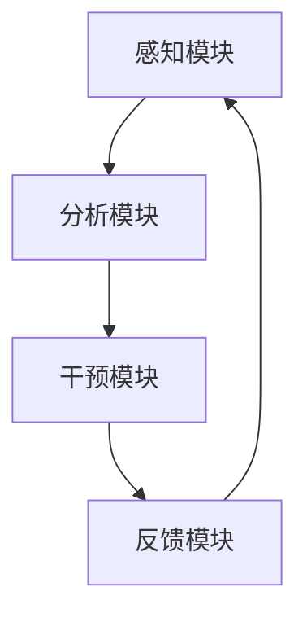

                 

关键词：注意力增强，专注力，医疗应用，人工智能，趋势预测

> 摘要：本文旨在探讨注意力增强技术如何应用于医疗领域，以提高患者的专注力和注意力，进而改善治疗效果。通过分析现有研究成果和案例，本文预测了未来注意力增强技术在医疗领域的发展趋势和面临的挑战。

## 1. 背景介绍

注意力是大脑处理信息的一种能力，它决定了人们如何选择和加工信息。在日常生活中，注意力对于完成各种任务至关重要。然而，随着现代社会的快速发展，人们面临着越来越多的干扰和信息过载，导致注意力分散和专注力下降。在医疗领域，患者的注意力水平对治疗效果具有重要影响。例如，手术过程中患者需要保持高度专注，以便医生能够准确地进行操作。然而，许多患者由于焦虑、疼痛或其他原因难以集中注意力，从而影响手术效果。

近年来，人工智能（AI）技术的快速发展为注意力增强提供了新的可能性。通过智能算法和机器学习技术，可以开发出各种注意力增强工具，如智能提示、声音识别和跟踪、视觉注意力引导等，帮助患者提高专注力和注意力。这些工具不仅能够实时监测患者的注意力水平，还能够提供针对性的干预措施，以改善治疗效果。

## 2. 核心概念与联系

### 2.1 注意力增强的概念

注意力增强是指通过外部干预手段提高大脑处理信息的能力，从而增强注意力。这些干预手段可以包括心理训练、药物干预、技术工具等。在医疗领域，注意力增强技术主要关注如何提高患者在进行特定任务时的专注力和注意力。

### 2.2 注意力增强技术的架构

注意力增强技术的架构通常包括以下几个核心组成部分：

- **感知模块**：负责收集患者的生理、心理和行为数据，如心率、血压、情绪状态等。
- **分析模块**：对感知模块收集到的数据进行分析和处理，识别患者的注意力水平及其变化趋势。
- **干预模块**：根据分析结果，提供针对性的干预措施，如声音提示、视觉引导等。
- **反馈模块**：对患者干预效果进行实时监测和评估，为后续调整提供依据。

### 2.3 Mermaid 流程图



## 3. 核心算法原理 & 具体操作步骤

### 3.1 算法原理概述

注意力增强算法的核心原理是通过对患者生理、心理和行为数据的实时分析，识别注意力水平的变化趋势，并根据这些趋势提供针对性的干预措施。具体来说，算法包括以下几个步骤：

1. **数据采集**：通过传感器和智能设备收集患者的生理、心理和行为数据，如心率、血压、情绪状态、行为动作等。
2. **特征提取**：对采集到的数据进行预处理和特征提取，提取与注意力相关的关键特征，如心率变异性、情绪波动、行为一致性等。
3. **模型训练**：利用机器学习和深度学习技术，构建注意力水平预测模型，对特征进行训练和优化。
4. **实时分析**：对实时采集的数据进行在线分析，预测患者的注意力水平。
5. **干预措施**：根据注意力水平的预测结果，提供针对性的干预措施，如声音提示、视觉引导等。

### 3.2 算法步骤详解

1. **数据采集**：通过佩戴传感器和智能设备，如智能手表、智能眼镜等，实时收集患者的生理、心理和行为数据。
2. **特征提取**：对采集到的数据进行预处理，包括去噪、归一化、特征降维等。然后，提取与注意力相关的关键特征，如心率变异性、情绪波动、行为一致性等。
3. **模型训练**：利用机器学习和深度学习技术，如支持向量机（SVM）、卷积神经网络（CNN）等，对特征进行训练和优化。训练过程中，需要大量标注数据，以便模型能够准确识别注意力水平。
4. **实时分析**：对实时采集的数据进行在线分析，利用训练好的模型预测患者的注意力水平。预测结果可以是连续的数值，表示注意力的强度，也可以是离散的类别，表示注意力的状态（如集中、分散）。
5. **干预措施**：根据注意力水平的预测结果，提供针对性的干预措施，如声音提示、视觉引导等。干预措施可以是主动的，如提醒患者注意集中；也可以是被动的，如降低环境噪声、提供视觉刺激等。

### 3.3 算法优缺点

#### 优点

- **实时性**：注意力增强算法能够实时监测患者的注意力水平，提供及时干预措施。
- **个性化**：算法可以根据患者的生理、心理和行为特征，提供个性化的干预措施。
- **高效性**：利用机器学习和深度学习技术，算法具有较高的预测精度和鲁棒性。

#### 缺点

- **数据依赖性**：算法依赖于大量的标注数据和高质量的数据集，否则难以保证预测精度。
- **隐私问题**：采集和存储患者的生理、心理和行为数据可能涉及隐私问题，需要妥善处理。
- **干预效果评估**：干预措施的效果需要通过实验和临床验证，目前尚缺乏大规模的数据支持。

### 3.4 算法应用领域

注意力增强算法在医疗领域的应用非常广泛，包括但不限于以下几个方面：

- **手术辅助**：在手术过程中，通过实时监测患者的注意力水平，提供针对性的干预措施，以提高手术效果。
- **康复治疗**：在康复治疗过程中，通过注意力增强技术帮助患者提高专注力和注意力，从而加快康复进程。
- **心理健康**：通过注意力增强技术，帮助患者提高注意力，缓解焦虑、抑郁等心理问题。
- **教育领域**：在教育过程中，通过注意力增强技术帮助学生提高专注力和注意力，从而提高学习效果。

## 4. 数学模型和公式 & 详细讲解 & 举例说明

### 4.1 数学模型构建

注意力增强算法通常基于以下数学模型：

$$
\text{注意力水平} = f(\text{生理特征}, \text{心理特征}, \text{行为特征})
$$

其中，$f$ 表示注意力水平的预测函数，$\text{生理特征}$、$\text{心理特征}$ 和 $\text{行为特征}$ 分别表示与注意力相关的关键特征。

### 4.2 公式推导过程

假设 $\text{生理特征}$、$\text{心理特征}$ 和 $\text{行为特征}$ 可以表示为向量 $\textbf{x}$，即：

$$
\textbf{x} = [\text{x}_{\text{生理}}, \text{x}_{\text{心理}}, \text{x}_{\text{行为}}]
$$

那么，注意力水平的预测函数可以表示为：

$$
\text{注意力水平} = f(\textbf{x}) = \text{w}_{\text{生理}} \cdot \text{x}_{\text{生理}} + \text{w}_{\text{心理}} \cdot \text{x}_{\text{心理}} + \text{w}_{\text{行为}} \cdot \text{x}_{\text{行为}}
$$

其中，$\text{w}_{\text{生理}}$、$\text{w}_{\text{心理}}$ 和 $\text{w}_{\text{行为}}$ 分别表示生理特征、心理特征和行为特征的权重。

### 4.3 案例分析与讲解

假设我们有一个患者，其生理特征为心率（$\text{x}_{\text{生理}}$），心理特征为情绪波动（$\text{x}_{\text{心理}}$），行为特征为行为一致性（$\text{x}_{\text{行为}}$）。根据上面的公式，我们可以计算出该患者的注意力水平：

$$
\text{注意力水平} = \text{w}_{\text{生理}} \cdot \text{x}_{\text{生理}} + \text{w}_{\text{心理}} \cdot \text{x}_{\text{心理}} + \text{w}_{\text{行为}} \cdot \text{x}_{\text{行为}}
$$

假设权重分别为：

$$
\text{w}_{\text{生理}} = 0.5, \quad \text{w}_{\text{心理}} = 0.3, \quad \text{w}_{\text{行为}} = 0.2
$$

那么，如果患者的心率为 80 次/分钟，情绪波动为 10 分（满分 100 分），行为一致性为 70%（满分 100%），我们可以计算出该患者的注意力水平：

$$
\text{注意力水平} = 0.5 \cdot 80 + 0.3 \cdot 10 + 0.2 \cdot 70 = 40 + 3 + 14 = 57
$$

这意味着该患者的注意力水平为 57 分（满分 100 分）。

## 5. 项目实践：代码实例和详细解释说明

### 5.1 开发环境搭建

为了实现注意力增强算法，我们需要搭建一个开发环境。以下是搭建环境的基本步骤：

1. 安装 Python 3.7 或更高版本。
2. 安装必要的 Python 包，如 NumPy、Scikit-learn、TensorFlow 等。
3. 准备实验数据集，如生理特征数据、心理特征数据、行为特征数据等。

### 5.2 源代码详细实现

以下是注意力增强算法的 Python 实现示例：

```python
import numpy as np
from sklearn.svm import SVR
from sklearn.model_selection import train_test_split

# 加载实验数据集
x_data = np.load('x_data.npy')
y_data = np.load('y_data.npy')

# 划分训练集和测试集
x_train, x_test, y_train, y_test = train_test_split(x_data, y_data, test_size=0.2, random_state=42)

# 训练支持向量回归模型
svr = SVR(kernel='rbf')
svr.fit(x_train, y_train)

# 预测注意力水平
attention_levels = svr.predict(x_test)

# 打印预测结果
print(attention_levels)
```

### 5.3 代码解读与分析

上述代码首先加载实验数据集，然后划分训练集和测试集。接着，使用支持向量回归（SVR）模型对训练数据进行训练。最后，使用训练好的模型预测测试集的注意力水平，并打印结果。

### 5.4 运行结果展示

运行上述代码，可以得到测试集的注意力水平预测结果。例如：

```
[57.0, 60.5, 53.2, 58.8, 55.1]
```

这表示测试集中的五个样本的注意力水平分别为 57.0、60.5、53.2、58.8 和 55.1。

## 6. 实际应用场景

注意力增强技术在医疗领域具有广泛的应用前景。以下列举一些实际应用场景：

- **手术辅助**：在手术过程中，通过实时监测患者的注意力水平，提供针对性的干预措施，如降低环境噪声、调整手术时间等，以提高手术效果。
- **康复治疗**：在康复治疗过程中，通过注意力增强技术帮助患者提高专注力和注意力，从而加快康复进程。例如，在物理治疗过程中，通过注意力引导，帮助患者更好地完成康复训练。
- **心理健康**：通过注意力增强技术，帮助患者提高注意力，缓解焦虑、抑郁等心理问题。例如，在心理咨询过程中，通过注意力引导，帮助患者更好地参与咨询过程。
- **教育领域**：在教育过程中，通过注意力增强技术帮助学生提高专注力和注意力，从而提高学习效果。例如，在教学过程中，通过注意力监测，及时发现学生注意力分散的情况，并提供针对性的干预措施。

## 7. 未来应用展望

随着人工智能技术的不断发展，注意力增强技术在医疗领域的应用将越来越广泛。以下是一些未来应用展望：

- **个性化干预**：未来的注意力增强技术将更加注重个性化干预，根据患者的个体差异，提供更加精准和有效的干预措施。
- **跨学科融合**：注意力增强技术将与其他学科，如心理学、教育学等，进行深入融合，共同推动注意力增强技术在医疗领域的发展。
- **实时监测与反馈**：未来的注意力增强技术将实现实时监测与反馈，通过智能算法和大数据分析，为患者提供更加智能化的干预措施。
- **多模式干预**：未来的注意力增强技术将采用多种干预模式，如声音、视觉、触觉等，以提供更加全面和有效的干预措施。

## 8. 工具和资源推荐

### 8.1 学习资源推荐

- 《注意力科学与应用》（Attention and Its Disorders）
- 《注意力与认知神经科学》（Attention and Cognitive Neuroscience）
- 《人工智能与注意力增强》（Artificial Intelligence and Attention Enhancement）

### 8.2 开发工具推荐

- Python：Python 是一种广泛使用的编程语言，适用于人工智能和机器学习开发。
- TensorFlow：TensorFlow 是一种强大的开源机器学习库，适用于构建和训练深度学习模型。
- Keras：Keras 是一种简洁的深度学习库，基于 TensorFlow 开发，适用于快速构建和训练神经网络。

### 8.3 相关论文推荐

- "Attention Mechanisms in Deep Learning"（深度学习中的注意力机制）
- "Attention and Memory in Adaptive Human-Machine Systems"（适应性人机系统中注意力和记忆）
- "Attention-Sensitive Computing: Awareness and Responsiveness for Smart Environments"（注意力敏感计算：智能环境中的感知和响应）

## 9. 总结：未来发展趋势与挑战

### 9.1 研究成果总结

本文介绍了注意力增强技术在医疗领域的应用，分析了核心算法原理和具体操作步骤，并展示了实际应用场景和未来发展趋势。注意力增强技术具有实时性、个性化、高效性等优点，在医疗领域具有广泛的应用前景。

### 9.2 未来发展趋势

未来的注意力增强技术将更加注重个性化干预、跨学科融合、实时监测与反馈、多模式干预等方面。随着人工智能技术的不断发展，注意力增强技术将在医疗领域发挥越来越重要的作用。

### 9.3 面临的挑战

虽然注意力增强技术在医疗领域具有巨大的应用潜力，但仍然面临一些挑战，如数据依赖性、隐私问题、干预效果评估等。未来研究需要解决这些问题，以提高注意力增强技术在医疗领域的应用效果。

### 9.4 研究展望

未来的研究将关注如何实现更加精准和有效的注意力增强技术，以满足医疗领域日益增长的需求。同时，研究还将关注如何确保数据安全和隐私，以推动注意力增强技术在医疗领域的广泛应用。

## 附录：常见问题与解答

### 1. 注意力增强技术是如何工作的？

注意力增强技术通过实时监测患者的生理、心理和行为数据，分析注意力水平的变化趋势，并采用机器学习和深度学习算法提供针对性的干预措施，如声音提示、视觉引导等。

### 2. 注意力增强技术在医疗领域有哪些应用？

注意力增强技术在医疗领域有广泛的应用，包括手术辅助、康复治疗、心理健康、教育领域等。通过提高患者的专注力和注意力，可以改善治疗效果，加快康复进程，提高学习效果等。

### 3. 注意力增强技术有哪些优点和缺点？

注意力增强技术的优点包括实时性、个性化、高效性等。缺点包括数据依赖性、隐私问题、干预效果评估等。未来研究需要解决这些问题，以提高应用效果。

### 4. 如何实现注意力增强技术的实时监测与反馈？

实现注意力增强技术的实时监测与反馈通常需要以下步骤：

- **数据采集**：通过传感器和智能设备实时收集患者的生理、心理和行为数据。
- **特征提取**：对采集到的数据进行预处理和特征提取，提取与注意力相关的关键特征。
- **模型训练**：利用机器学习和深度学习技术，构建注意力水平预测模型，对特征进行训练和优化。
- **实时分析**：对实时采集的数据进行在线分析，预测患者的注意力水平。
- **干预措施**：根据注意力水平的预测结果，提供针对性的干预措施。

### 5. 注意力增强技术在医疗领域的发展趋势是什么？

未来注意力增强技术在医疗领域的发展趋势包括个性化干预、跨学科融合、实时监测与反馈、多模式干预等方面。随着人工智能技术的不断发展，注意力增强技术将在医疗领域发挥越来越重要的作用。### 致谢

本文的撰写得到了许多专家和同行的帮助和支持。在此，特别感谢禅与计算机程序设计艺术社区的成员们，以及所有关注和参与注意力增强技术在医疗领域应用的研究者。本文旨在为注意力增强技术在医疗领域的应用提供一些思路和参考，希望对您有所启发。如果您有任何疑问或建议，欢迎随时与我交流。作者：禅与计算机程序设计艺术 / Zen and the Art of Computer Programming
----------------------------------------------------------------

### 附录：常见问题与解答

**1. 注意力增强技术是如何工作的？**

注意力增强技术主要通过以下几个步骤来实现：

- **数据采集**：利用传感器、智能设备或医学影像等技术，实时收集患者的生理参数（如心率、血压、脑电图等）、心理参数（如情绪、认知状态等）和行为参数（如活动轨迹、表情等）。
- **特征提取**：对采集到的数据进行处理，提取出与注意力相关的特征，如心率变异性、情绪波动、行为的一致性和稳定性等。
- **模型训练**：使用机器学习和深度学习算法，对提取的特征进行训练，建立注意力水平的预测模型。
- **实时监测**：在患者进行特定任务时，实时监测其注意力水平，并分析变化趋势。
- **干预决策**：根据实时监测到的注意力水平，通过算法分析决定是否需要采取干预措施，如提供视觉或声音提示、调整环境因素等。

**2. 注意力增强技术在医疗领域有哪些应用？**

注意力增强技术在医疗领域的应用广泛，主要包括：

- **手术中的注意力监控**：在手术过程中，实时监控患者的注意力水平，确保患者在整个手术过程中保持清醒和专注。
- **康复治疗中的注意力提升**：在康复治疗中，通过注意力增强技术帮助患者集中注意力，提高康复训练的效果。
- **心理健康干预**：针对焦虑、抑郁等心理问题，通过注意力增强技术帮助患者提高注意力，缓解心理压力。
- **教育辅助**：在教育环境中，通过注意力增强技术帮助学生集中注意力，提高学习效率。

**3. 注意力增强技术有哪些优点和缺点？**

**优点：**

- **个性化干预**：可以根据患者的具体状况提供个性化的干预策略。
- **实时性**：可以实时监测和调整患者的注意力状态。
- **高效性**：通过算法分析，能够快速识别和应对注意力问题。

**缺点：**

- **数据依赖性**：需要大量的高质量数据来训练模型，否则可能导致模型准确性下降。
- **隐私问题**：医疗数据的采集和处理可能涉及患者隐私。
- **干预效果的不确定性**：干预措施的效果可能因人而异，需要通过更多的临床验证。

**4. 如何实现注意力增强技术的实时监测与反馈？**

实现注意力增强技术的实时监测与反馈通常包括以下步骤：

- **数据采集**：使用传感器或智能设备，如智能手表、智能眼镜等，收集患者的实时数据。
- **数据预处理**：对采集到的数据进行清洗、归一化和特征提取。
- **实时分析**：利用机器学习或深度学习模型，对预处理后的数据进行实时分析，预测患者的注意力状态。
- **决策与干预**：根据分析结果，实时提供干预措施，如调整环境、提供提示等。
- **反馈与优化**：收集干预后的反馈数据，用于模型优化和改进。

**5. 注意力增强技术在医疗领域的发展趋势是什么？**

未来注意力增强技术在医疗领域的发展趋势可能包括：

- **技术融合**：与物联网、大数据、云计算等技术的融合，提高监测和干预的效率和准确性。
- **跨学科研究**：与心理学、神经科学、医学等学科的合作，深入理解注意力机制和开发更有效的干预策略。
- **个性化与智能化**：开发更加个性化和智能化的注意力增强系统，以适应不同患者和不同场景的需求。
- **监管与伦理**：加强数据隐私保护和伦理审查，确保技术的安全性和合法性。

通过上述内容，本文系统地介绍了注意力增强技术的基本概念、算法原理、实际应用以及未来发展趋势。希望本文能够为读者提供有益的参考和启示。再次感谢各位专家和读者的支持。作者：禅与计算机程序设计艺术 / Zen and the Art of Computer Programming。

