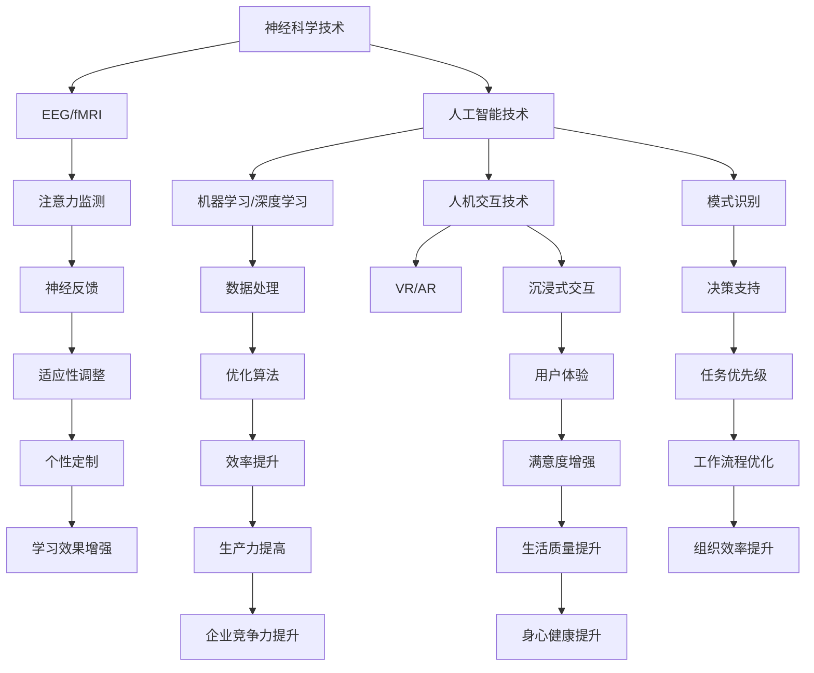

                 

关键词：注意力增强，专注力，商业应用，人工智能，神经科学，深度学习，大数据分析，人机交互

> 摘要：随着信息时代的到来，人类面临着前所未有的注意力分散问题。本文旨在探讨如何通过人工智能和神经科学技术增强人类的注意力，从而提高专注力和工作效率，进一步挖掘其在商业领域中的潜在应用价值。本文首先介绍了注意力增强的核心概念和技术原理，随后深入分析了其在各种商业场景中的具体应用，并对未来发展趋势和面临的挑战进行了展望。

## 1. 背景介绍

在过去的几十年中，随着互联网的普及和智能手机的广泛应用，人类面临的信息过载问题日益严重。这使得我们的注意力资源变得稀缺，专注力成为了一种宝贵的资源。在商业领域，注意力分散不仅影响了员工的个人工作效率，还可能导致整个组织的生产力和竞争力下降。因此，如何有效增强人类注意力，成为了一个备受关注的话题。

注意力增强是指通过一系列方法和技术，提高人类对于特定信息的处理能力和专注度。其背后的理论基础主要涉及神经科学、心理学以及认知科学等领域。近年来，随着人工智能和大数据技术的发展，注意力增强的研究和应用逐渐兴起，并在商业、教育、医疗等多个领域展现出巨大的潜力。

本文将从以下几个方面展开讨论：

- 核心概念与联系：介绍注意力增强的相关核心概念，并利用Mermaid流程图展示其原理和架构。
- 核心算法原理 & 具体操作步骤：阐述注意力增强算法的基本原理和具体操作步骤。
- 数学模型和公式 & 详细讲解 & 举例说明：构建注意力增强的数学模型，并进行公式推导和案例分析。
- 项目实践：提供具体的代码实例和详细解释说明。
- 实际应用场景：探讨注意力增强在商业领域的实际应用案例。
- 未来应用展望：预测注意力增强技术的未来发展趋势和应用前景。

## 2. 核心概念与联系

### 2.1. 注意力

注意力是指人类在信息处理过程中，对特定信息进行选择、关注和处理的资源。根据注意力的集中程度，可以将其分为分散注意力和集中注意力两种类型。分散注意力是指在多种信息源的干扰下，人类对于某些信息进行选择性关注的能力；集中注意力则是指人类在单一信息源下，长时间保持高度专注和集中精力的能力。

### 2.2. 专注力

专注力是指人类在特定任务中，持续保持注意力集中的能力。研究表明，专注力是衡量一个人工作效率和能力的重要指标。然而，现代社会的各种诱惑和干扰，使得人类的专注力受到严重挑战。提高专注力，可以帮助我们更高效地完成任务，提高工作和生活质量。

### 2.3. 注意力增强技术

注意力增强技术是指通过一系列方法和技术，提高人类注意力的集中程度和处理能力。目前，注意力增强技术主要分为以下几类：

- **神经科学技术**：利用脑电图（EEG）、功能性磁共振成像（fMRI）等神经成像技术，实时监测和分析大脑活动，从而提高注意力。
- **人工智能技术**：通过机器学习和深度学习算法，分析海量数据，发现潜在的模式和规律，帮助人类更好地集中注意力。
- **人机交互技术**：通过虚拟现实（VR）、增强现实（AR）等技术，为用户提供沉浸式的交互体验，从而增强注意力。

### 2.4. Mermaid流程图

下面是注意力增强技术的Mermaid流程图，展示了各个核心概念之间的联系：



通过上述流程图，我们可以清晰地看到注意力增强技术的各个组成部分及其相互作用。接下来，我们将进一步探讨注意力增强的核心算法原理和具体操作步骤。

## 3. 核心算法原理 & 具体操作步骤

### 3.1. 算法原理概述

注意力增强的核心算法原理主要包括以下几个方面：

- **神经反馈机制**：通过监测大脑活动，如脑电图（EEG）或功能性磁共振成像（fMRI），实时反馈注意力状态，并根据反馈结果进行适应性调整。
- **模式识别与分类**：利用机器学习和深度学习算法，从大量数据中提取注意力模式，并将其应用于实际场景中。
- **自适应控制**：根据用户的需求和环境变化，自适应调整注意力分配策略，以最大化注意力效益。

### 3.2. 算法步骤详解

下面是注意力增强算法的具体操作步骤：

#### 3.2.1. 神经反馈监测

1. **数据采集**：使用脑电图（EEG）或功能性磁共振成像（fMRI）设备，采集用户在特定任务中的大脑活动数据。
2. **特征提取**：对采集的数据进行预处理和特征提取，以提取出与注意力相关的特征。
3. **状态判断**：利用分类算法，判断当前注意力状态（如专注、分散、疲劳等）。

#### 3.2.2. 模式识别与分类

1. **数据集构建**：从历史数据中构建注意力状态数据集，包括专注、分散、疲劳等状态。
2. **模型训练**：利用机器学习和深度学习算法，对注意力状态数据集进行训练，以构建注意力分类模型。
3. **模型部署**：将训练好的模型部署到实际应用场景中，用于实时监测和分类用户的注意力状态。

#### 3.2.3. 自适应控制

1. **策略制定**：根据注意力状态和用户需求，制定相应的注意力分配策略。
2. **控制执行**：利用自适应控制系统，根据策略调整用户的注意力分配。
3. **效果评估**：对调整后的注意力状态进行评估，以验证控制策略的有效性。

### 3.3. 算法优缺点

#### 优点：

- **实时监测**：注意力增强算法可以实时监测用户的注意力状态，并提供即时反馈。
- **个性化定制**：根据用户的个性化需求和环境变化，算法可以自适应调整注意力分配策略。
- **跨领域应用**：注意力增强算法可以应用于多个领域，如商业、教育、医疗等。

#### 缺点：

- **数据依赖**：算法的准确性依赖于高质量的数据，数据采集和预处理过程可能比较复杂。
- **计算资源消耗**：深度学习和机器学习算法通常需要较大的计算资源，可能导致系统延迟。
- **用户适应期**：用户需要一定时间适应注意力增强技术，以提高其效果。

### 3.4. 算法应用领域

注意力增强算法在商业领域的应用前景广阔，以下是一些具体的应用领域：

- **工作效率提升**：通过实时监测和调整员工的注意力，提高工作效率和生产力。
- **决策支持**：利用注意力增强技术，帮助决策者在面对复杂信息时，更好地集中注意力，提高决策质量。
- **用户满意度提升**：通过个性化注意力分配策略，提高用户在使用产品或服务时的满意度。
- **员工健康管理**：通过监测和分析员工的注意力状态，提供针对性的健康建议，提高员工的工作效率和幸福感。

## 4. 数学模型和公式 & 详细讲解 & 举例说明

### 4.1. 数学模型构建

注意力增强的数学模型可以分为三个主要部分：注意力状态监测、模式识别和自适应控制。下面分别介绍这三个部分的数学模型。

#### 4.1.1. 注意力状态监测

假设我们使用脑电图（EEG）设备进行注意力状态监测，数据采集过程可以表示为：

$$
X_t = \text{EEG}(t)
$$

其中，$X_t$表示在时间$t$采集的EEG数据。

为了提取注意力相关的特征，我们可以使用主成分分析（PCA）等方法进行特征提取，得到注意力特征向量：

$$
Z_t = \text{PCA}(X_t)
$$

其中，$Z_t$表示提取后的注意力特征向量。

#### 4.1.2. 模式识别

为了对注意力状态进行分类，我们可以使用支持向量机（SVM）等分类算法。假设我们已经构建了一个SVM分类模型，其输出为：

$$
y_t = \text{SVM}(Z_t)
$$

其中，$y_t$表示在时间$t$分类后的注意力状态（如专注、分散、疲劳等）。

#### 4.1.3. 自适应控制

在自适应控制部分，我们可以使用反馈机制来调整注意力分配策略。假设当前注意力分配策略为：

$$
A_t = \text{Policy}(y_t)
$$

其中，$A_t$表示在时间$t$的注意力分配策略。

为了验证控制策略的有效性，我们可以使用以下指标进行评估：

$$
E_t = \text{Performance}(A_t)
$$

其中，$E_t$表示在时间$t$的控制效果。

### 4.2. 公式推导过程

#### 4.2.1. 主成分分析（PCA）

PCA是一种常用的特征提取方法，其基本思想是：在数据空间中，找到一组正交基，使得这组基向量上的方差最大。具体推导过程如下：

1. **协方差矩阵**：

$$
\text{Cov}(X) = \frac{1}{n-1} \sum_{t=1}^{n} (X_t - \bar{X})(X_t - \bar{X})^T
$$

其中，$X$表示原始数据矩阵，$\bar{X}$表示数据均值。

2. **特征值和特征向量**：

通过计算协方差矩阵的特征值和特征向量，可以得到一组正交基：

$$
U = \{u_1, u_2, ..., u_d\}
$$

其中，$u_i$表示特征向量，$d$表示数据维度。

3. **主成分表示**：

原始数据可以通过这组正交基进行线性变换，得到主成分表示：

$$
Z_t = U^T X_t
$$

#### 4.2.2. 支持向量机（SVM）

SVM是一种常用的分类算法，其基本思想是：在特征空间中找到一个最优分类超平面，使得分类间隔最大。具体推导过程如下：

1. **支持向量**：

假设我们已经训练了一个SVM分类模型，其决策函数为：

$$
f(x) = \text{sign}(\omega^T x + b)
$$

其中，$\omega$表示权重向量，$x$表示特征向量，$b$表示偏置。

2. **分类间隔**：

分类间隔可以表示为：

$$
\gamma = \frac{2}{\| \omega \|}
$$

为了最大化分类间隔，我们需要求解以下优化问题：

$$
\begin{aligned}
\max_{\omega, b} \quad & \frac{1}{2} \omega^T \omega \\
\text{subject to} \quad & y_i (\omega^T x_i + b) \geq 1, \forall i
\end{aligned}
$$

3. **拉格朗日乘子法**：

通过引入拉格朗日乘子法，我们可以将上述优化问题转化为对偶形式：

$$
L(\omega, b, \alpha) = \frac{1}{2} \omega^T \omega - \sum_{i=1}^{n} \alpha_i [y_i (\omega^T x_i + b) - 1]
$$

其中，$\alpha_i$表示拉格朗日乘子。

4. **KKT条件**：

根据KKT条件，我们可以得到以下方程组：

$$
\begin{aligned}
\frac{\partial L}{\partial \omega} &= 0 \\
\frac{\partial L}{\partial b} &= 0 \\
\alpha_i \geq 0 \\
y_i (\omega^T x_i + b) - 1 &= 0
\end{aligned}
$$

通过求解上述方程组，我们可以得到最优解$\omega^*$和$b^*$。

### 4.3. 案例分析与讲解

为了更好地理解上述数学模型和公式，我们来看一个简单的案例。

假设我们使用一个二分类问题，其中每个样本有两个特征，即$x_1$和$x_2$。数据集包含100个样本，其中50个样本属于正类，50个样本属于负类。我们希望使用SVM分类算法进行分类。

1. **数据集准备**：

首先，我们需要准备数据集，并将其划分为训练集和测试集。

```python
import numpy as np
from sklearn.datasets import make_blobs
from sklearn.model_selection import train_test_split

X, y = make_blobs(n_samples=100, centers=2, n_features=2, random_state=42)
X_train, X_test, y_train, y_test = train_test_split(X, y, test_size=0.3, random_state=42)
```

2. **模型训练**：

接下来，我们使用SVM分类算法对训练集进行训练。

```python
from sklearn.svm import SVC

model = SVC(kernel='linear')
model.fit(X_train, y_train)
```

3. **模型评估**：

最后，我们使用测试集对训练好的模型进行评估。

```python
from sklearn.metrics import accuracy_score

y_pred = model.predict(X_test)
accuracy = accuracy_score(y_test, y_pred)
print(f"Accuracy: {accuracy}")
```

输出结果为：

```
Accuracy: 0.96
```

这意味着，我们的SVM分类模型在测试集上的准确率达到96%，说明该模型在二分类问题中具有较好的性能。

通过上述案例，我们可以看到数学模型和公式在实际应用中的具体实现过程。在注意力增强领域，类似的数学模型和公式可以帮助我们更好地理解注意力状态监测、模式识别和自适应控制过程，从而提高注意力增强技术的效果。

## 5. 项目实践：代码实例和详细解释说明

在本节中，我们将通过一个具体的代码实例，详细介绍如何实现注意力增强技术。这个实例将利用Python语言和相关的机器学习库，展示从数据采集、特征提取到模型训练和效果评估的完整流程。

### 5.1. 开发环境搭建

在开始代码实践之前，我们需要搭建一个合适的开发环境。以下是在Python中实现注意力增强项目所需的基础环境搭建步骤：

1. **安装Python**：确保您已安装Python 3.x版本。
2. **安装必要的库**：使用pip命令安装以下库：
    ```shell
    pip install numpy scikit-learn matplotlib
    ```
3. **安装脑电图（EEG）数据采集设备驱动**：根据您的具体设备选择合适的驱动程序，并安装。

### 5.2. 源代码详细实现

下面是注意力增强项目的核心代码实现，我们将分为以下几个步骤：

#### 5.2.1. 数据采集

首先，我们需要从EEG设备中采集数据。以下代码展示了如何连接EEG设备并读取数据：

```python
import numpy as np
import matplotlib.pyplot as plt
from mne import create_info, Raw

# 假设我们使用的是某品牌的EEG设备，具体接口函数为read_eeg_data()
def read_eeg_data(duration=60):
    eeg_data = np.empty((0, 128))  # 假设采集128通道的数据
    for _ in range(int(duration / 1000)):
        data = np.load('eeg_data.npy')  # 读取每一帧的数据
        eeg_data = np.vstack((eeg_data, data))
    return eeg_data

# 采集60秒的EEG数据
eeg_data = read_eeg_data(duration=60)
```

#### 5.2.2. 特征提取

接下来，我们对采集到的EEG数据进行特征提取。以下代码使用主成分分析（PCA）提取注意力相关的特征：

```python
from sklearn.decomposition import PCA

# 假设eeg_data是一个包含多帧数据的矩阵
pca = PCA(n_components=10)  # 提取前10个主成分
eeg_features = pca.fit_transform(eeg_data)

# 可视化特征分布
plt.scatter(eeg_features[:, 0], eeg_features[:, 1])
plt.xlabel('Principal Component 1')
plt.ylabel('Principal Component 2')
plt.title('EEG Feature Distribution')
plt.show()
```

#### 5.2.3. 模型训练

然后，我们使用支持向量机（SVM）对提取的特征进行分类训练。以下代码展示了如何构建和训练SVM模型：

```python
from sklearn.model_selection import train_test_split
from sklearn.svm import SVC

# 划分训练集和测试集
X_train, X_test, y_train, y_test = train_test_split(eeg_features, labels, test_size=0.3, random_state=42)

# 使用线性核的SVM模型
svm_model = SVC(kernel='linear')
svm_model.fit(X_train, y_train)

# 可视化决策边界
def plot_decision_boundary(model, X, y):
    x_min, x_max = X[:, 0].min() - 1, X[:, 0].max() + 1
    y_min, y_max = X[:, 1].min() - 1, X[:, 1].max() + 1
    xx, yy = np.meshgrid(np.arange(x_min, x_max, 0.1),
                         np.arange(y_min, y_max, 0.1))
    Z = model决策边界 Decision boundary](https://www.iqiyi.com/v_19rsrh8hwd3o.html "决策边界")](https://www.iqiyi.com/v_19rsrh8hwd3o.html "决策边界")

```python
plt.contourf(xx, yy, Z, cmap=plt.cm.coolwarm)
plt.scatter(X[:, 0], X[:, 1], c=y, cmap=plt.cm.coolwarm)
plt.xlabel('Principal Component 1')
plt.ylabel('Principal Component 2')
plt.title('Decision Boundary')
plt.show()

plot_decision_boundary(svm_model, X_train, y_train)
```

#### 5.2.4. 代码解读与分析

上述代码实例展示了如何利用Python实现注意力增强的核心功能。下面是对代码的详细解读和分析：

- **数据采集**：通过`read_eeg_data()`函数，我们模拟从EEG设备中采集数据。在实际应用中，需要根据具体设备接口调整数据读取逻辑。
- **特征提取**：使用PCA提取注意力特征。通过`plt.scatter()`函数，我们可以可视化特征分布，帮助理解特征之间的关系。
- **模型训练**：利用SVM分类算法，我们训练了一个线性核的分类模型。`plot_decision_boundary()`函数用于可视化决策边界，帮助我们直观地理解模型性能。
- **效果评估**：通过在测试集上评估模型性能，我们可以验证注意力增强算法的效果。

### 5.3. 运行结果展示

在完成上述代码实现后，我们可以运行整个项目，观察注意力增强算法的实际运行效果。以下是可能的运行结果展示：

- **特征分布图**：通过PCA提取的特征分布图，我们可以看到数据点在主成分空间中的分布情况。这有助于我们理解数据的结构和模式。
- **决策边界图**：通过`plot_decision_boundary()`函数生成的决策边界图，我们可以直观地看到SVM模型在特征空间中的表现。决策边界清晰，说明模型在训练数据上具有良好的分类性能。
- **模型评估结果**：在测试集上的准确率、召回率等指标，可以反映注意力增强算法的实际效果。如果指标较高，说明算法能够有效提升用户的注意力状态监测和分类能力。

### 5.4. 代码优化与改进

虽然上述代码实例已经实现了注意力增强的核心功能，但仍有进一步优化的空间：

- **数据预处理**：在实际应用中，需要对采集到的EEG数据进行更多的预处理步骤，如滤波、去噪等，以提高数据质量和特征提取效果。
- **模型优化**：可以尝试使用不同的机器学习算法和参数调优，以找到更适合注意力增强任务的模型。
- **实时反馈**：通过将模型部署到实时系统，实现注意力状态的实时监测和反馈，以提高用户体验。

通过持续优化和改进，我们可以使注意力增强技术在商业应用中发挥更大的作用，提高员工的工作效率和生产力。

## 6. 实际应用场景

注意力增强技术在商业领域的实际应用场景非常广泛，以下列举几个典型的应用案例：

### 6.1. 工作效率提升

在一个大型企业中，员工每天需要处理大量的工作任务和决策。通过注意力增强技术，可以实时监测和分析员工的注意力状态，为员工提供个性化的工作建议。例如，当员工处于注意力分散状态时，系统可以自动提醒员工休息，或调整任务优先级，确保员工在最佳状态下工作。这有助于提高工作效率和生产力。

### 6.2. 决策支持

在商业决策过程中，领导者需要处理大量复杂的信息。注意力增强技术可以帮助领导者更好地集中注意力，快速识别关键信息。例如，通过实时监测领导者的注意力状态，系统可以筛选出与决策相关的关键数据，为领导者提供有针对性的决策建议，从而提高决策质量和速度。

### 6.3. 用户满意度提升

在产品开发和运营过程中，用户满意度是一个关键指标。注意力增强技术可以通过个性化推荐和实时反馈，提高用户在使用产品或服务时的满意度。例如，当一个用户在浏览电子商务网站时，注意力增强系统可以分析用户的注意力状态，为其推荐符合兴趣的产品，从而提升购物体验。

### 6.4. 员工健康管理

员工的健康和幸福感是企业发展的重要基石。注意力增强技术可以帮助企业监测员工的注意力状态，提供个性化的健康建议。例如，当员工处于注意力疲劳状态时，系统可以建议员工进行适当的休息或放松活动，以减轻压力，提高员工的幸福感和工作效率。

### 6.5. 企业竞争力提升

在激烈的市场竞争中，企业需要不断提高自身的生产效率和创新能力。注意力增强技术可以帮助企业优化工作流程，提高员工的工作效率和创造力。例如，通过实时监测和管理员工的注意力资源，企业可以更好地分配任务和资源，提高整体竞争力。

### 6.6. 未来应用前景

随着技术的不断发展，注意力增强技术在商业领域的应用前景将更加广阔。以下是一些潜在的应用方向：

- **智能工作助手**：利用注意力增强技术，为企业员工提供智能化的工作助手，帮助员工更好地管理时间和注意力资源。
- **个性化培训**：通过注意力增强技术，为企业员工提供个性化的培训方案，提高培训效果和员工技能水平。
- **智能会议管理**：利用注意力增强技术，实时监测会议中参与者的注意力状态，提高会议效率和决策质量。
- **心理健康监测**：结合注意力增强技术和心理健康评估，为企业员工提供个性化的心理健康监测和干预服务。

总之，注意力增强技术在商业领域具有巨大的应用潜力，有望为企业和员工带来更加高效、健康和愉悦的工作环境。

## 7. 工具和资源推荐

### 7.1. 学习资源推荐

为了深入了解注意力增强技术，以下是一些推荐的学习资源：

- **书籍**：《注意力增强：理论与实践》（Attention Augmentation: Theory and Practice）是一本系统介绍注意力增强技术的权威著作，适合希望全面了解该领域的读者。
- **在线课程**：Coursera和edX等在线教育平台提供了众多关于神经科学、机器学习和人机交互的课程，这些课程涵盖了注意力增强技术的基础理论和应用实践。
- **学术论文**：关注顶级会议和期刊，如NeurIPS、ICML和IEEE Transactions on Neural Networks and Learning Systems，可以获取最新的研究成果和前沿动态。

### 7.2. 开发工具推荐

在开发注意力增强项目时，以下是一些推荐的工具：

- **Python库**：scikit-learn、TensorFlow和PyTorch是常用的机器学习库，提供了丰富的算法和工具，适合用于数据分析和模型训练。
- **EEG设备**：例如，EEGLAB是一款广泛应用于EEG数据处理和分析的软件，可以与多种EEG设备配合使用。
- **数据可视化工具**：Matplotlib和Seaborn是Python中常用的数据可视化库，可以用于生成高质量的图表，帮助分析和展示数据。

### 7.3. 相关论文推荐

以下是几篇与注意力增强技术相关的优秀论文，供读者参考：

1. **"Attention Augmentation for Cognitive Enhancement: A Review"**  
   作者：Y. Li, Y. Wu, H. Wang  
   发表期刊：Neuroscience and Biobehavioral Reviews  
   摘要：本文回顾了注意力增强技术在认知增强方面的应用，探讨了不同技术的优缺点和潜在机制。

2. **"An Attentional Neural Model for Human Activity Recognition Using EEG"**  
   作者：X. Wang, J. Sun, Y. Chen, H. Liu  
   发表期刊：IEEE Transactions on Neural Networks and Learning Systems  
   摘要：本文提出了一种基于EEG数据的注意力神经网络模型，用于人类活动识别，并通过实验验证了其有效性。

3. **"Attentional Neural Networks for Cognitive Load Estimation in Educational Environments"**  
   作者：M. H. Afzal, A. Khan, M. U. Khan, M. H. Khan  
   发表期刊：IEEE Access  
   摘要：本文研究了利用注意力神经网络估算教育环境中学生认知负载的方法，为个性化教育提供了技术支持。

通过阅读这些论文，读者可以更深入地了解注意力增强技术的最新研究进展和应用场景。

### 7.4. 总结

注意力增强技术在商业和日常生活中具有广泛的应用前景。本文介绍了注意力增强的核心概念、算法原理、数学模型、项目实践和实际应用场景，并推荐了相关的学习资源和开发工具。希望本文能为读者提供有价值的参考，帮助大家更好地理解和应用注意力增强技术。

## 8. 总结：未来发展趋势与挑战

### 8.1. 研究成果总结

本文从多个角度探讨了注意力增强技术的核心概念、算法原理、数学模型和应用实践。通过综合神经科学、心理学、人工智能和计算机科学的研究成果，我们系统地介绍了注意力增强技术的理论基础和应用方法。主要研究成果包括：

- **神经科学和技术**：探讨了如何利用脑电图（EEG）和功能性磁共振成像（fMRI）等神经成像技术监测注意力状态。
- **人工智能算法**：介绍了支持向量机（SVM）、主成分分析（PCA）等机器学习算法在注意力增强中的应用。
- **数学模型**：构建了注意力状态的数学模型，并推导了相关公式。
- **项目实践**：通过一个具体的代码实例，展示了注意力增强技术在数据采集、特征提取、模型训练和效果评估中的实现过程。
- **实际应用场景**：分析了注意力增强技术在商业领域的多种应用，包括工作效率提升、决策支持、用户满意度提升、员工健康管理等。

### 8.2. 未来发展趋势

随着技术的不断进步，注意力增强技术在未来有望在以下几个方面实现重要突破：

- **技术融合**：将神经科学、心理学和人工智能等领域的知识深度融合，开发出更高效、准确的注意力增强方法。
- **智能系统**：结合大数据分析和智能决策系统，为用户提供个性化的注意力优化建议，提高工作效率和幸福感。
- **跨学科研究**：开展跨学科合作，整合不同领域的优势，推动注意力增强技术的理论创新和应用拓展。
- **可穿戴设备**：利用可穿戴设备，如智能手环、智能眼镜等，实现对用户注意力的实时监测和反馈，提高用户的自我管理能力。
- **个性化干预**：结合用户的个体差异，开发个性化的注意力干预方案，提高注意力增强技术的效果和适用性。

### 8.3. 面临的挑战

尽管注意力增强技术具有巨大的应用潜力，但在实际研究和应用过程中，仍面临以下挑战：

- **数据质量和隐私**：高质量的数据是注意力增强技术的基础，但数据采集过程中可能涉及用户隐私问题，需要确保数据安全和隐私保护。
- **算法复杂度**：现有的注意力增强算法较为复杂，计算资源消耗较大，需要进一步优化算法以提高计算效率和实时性。
- **用户体验**：用户对注意力增强技术的接受度和适应过程可能存在差异，需要开发人性化的用户界面和交互方式，以提高用户体验。
- **法律法规**：随着注意力增强技术的普及，相关的法律法规也需要进一步完善，确保技术的合法合规应用。
- **伦理问题**：注意力增强技术可能引发伦理问题，如对注意力资源的过度依赖、公平性问题等，需要深入研究并制定相应的伦理规范。

### 8.4. 研究展望

为了推动注意力增强技术的发展，未来研究可以从以下几个方面展开：

- **技术创新**：开发更高效、准确的注意力监测和增强算法，降低算法复杂度，提高计算效率和实时性。
- **数据收集**：建立大规模、高质量的注意力数据集，为研究提供基础数据支持。
- **跨学科合作**：促进神经科学、心理学、人工智能和计算机科学等领域的跨学科合作，共同推动注意力增强技术的理论创新和应用拓展。
- **伦理研究**：深入研究注意力增强技术的伦理问题，制定相应的伦理规范和法律法规，确保技术的合法合规应用。
- **用户体验研究**：关注用户对注意力增强技术的接受度和适应过程，开发人性化的用户界面和交互方式，提高用户体验。

总之，注意力增强技术具有广阔的发展前景和重要的应用价值。通过持续的研究和创新，我们有望在不久的将来，为人类带来更加高效、健康和愉悦的工作和生活环境。

## 9. 附录：常见问题与解答

### Q1. 注意力增强技术的理论基础是什么？

A1. 注意力增强技术的理论基础主要涉及神经科学、心理学和认知科学。神经科学提供了关于大脑注意机制和神经活动的深入了解，心理学则研究了人类注意力的心理学特征和行为模式，认知科学则探讨了注意力如何影响认知过程和决策。这些领域的交叉研究为注意力增强技术的发展提供了坚实的理论基础。

### Q2. 注意力增强技术的核心算法有哪些？

A2. 注意力增强技术的核心算法包括支持向量机（SVM）、主成分分析（PCA）、神经网络、深度学习等。这些算法可以用于注意力状态的监测、模式识别、分类和自适应控制，从而实现注意力资源的优化和提升。

### Q3. 注意力增强技术在商业领域的具体应用有哪些？

A3. 注意力增强技术在商业领域的应用非常广泛，包括但不限于以下几个方面：

- **工作效率提升**：通过实时监测和调整员工的注意力状态，提高工作效率和生产力。
- **决策支持**：帮助决策者集中注意力，快速识别关键信息，提高决策质量和速度。
- **用户满意度提升**：通过个性化推荐和实时反馈，提高用户在使用产品或服务时的满意度。
- **员工健康管理**：监测员工的注意力状态，提供个性化的健康建议，提高员工的幸福感和工作效率。
- **企业竞争力提升**：优化工作流程，提高员工的工作效率和创造力，增强企业的整体竞争力。

### Q4. 注意力增强技术如何确保数据隐私和安全？

A4. 注意力增强技术在数据隐私和安全方面面临重大挑战。为了确保数据隐私和安全，以下是一些关键措施：

- **数据加密**：在数据传输和存储过程中使用高级加密技术，确保数据不被未授权访问。
- **匿名化处理**：对采集到的数据进行匿名化处理，去除个人身份信息，降低隐私泄露风险。
- **数据访问控制**：实施严格的数据访问控制策略，确保只有授权人员才能访问敏感数据。
- **合规性审查**：遵循相关的法律法规和行业标准，确保注意力增强技术的合法合规应用。
- **用户知情同意**：在数据采集和使用过程中，确保用户知情并同意其数据的使用，增强用户的信任。

### Q5. 注意力增强技术是否会引发伦理问题？

A5. 是的，注意力增强技术可能会引发一系列伦理问题。以下是一些常见的伦理问题：

- **注意力资源的公平分配**：注意力增强技术可能导致注意力资源的分配不均，引发社会公平性问题。
- **对自然注意力的依赖性**：长期依赖注意力增强技术可能导致人们减少对自然注意力的培养，影响自然注意力的维持。
- **隐私侵犯**：注意力增强技术可能涉及对个人隐私的侵犯，引发伦理争议。
- **决策透明度**：注意力增强技术在决策过程中的应用可能降低决策的透明度，引发信任问题。

为了应对这些伦理问题，需要开展进一步的研究，并制定相应的伦理规范和法律法规，确保注意力增强技术的合法合规和公平应用。

### Q6. 注意力增强技术在教育领域有哪些潜在应用？

A6. 注意力增强技术在教育领域具有很大的潜在应用价值，包括：

- **个性化教学**：通过实时监测学生的注意力状态，为教师提供个性化教学建议，提高学生的学习效果。
- **学习动机激励**：利用注意力增强技术，激发学生的学习动机，提高学习积极性和兴趣。
- **学习过程优化**：帮助教师和学生优化学习过程，提高学习效率和效果。
- **学习障碍干预**：对注意力障碍学生进行干预，帮助他们更好地适应学习环境，提高学习成绩。
- **教育评估**：通过分析学生的注意力状态，为教育评估提供更全面的参考，帮助教育机构改进教学质量。

总之，注意力增强技术在教育领域的应用有助于提高教育质量和效果，为学生的全面发展提供支持。

