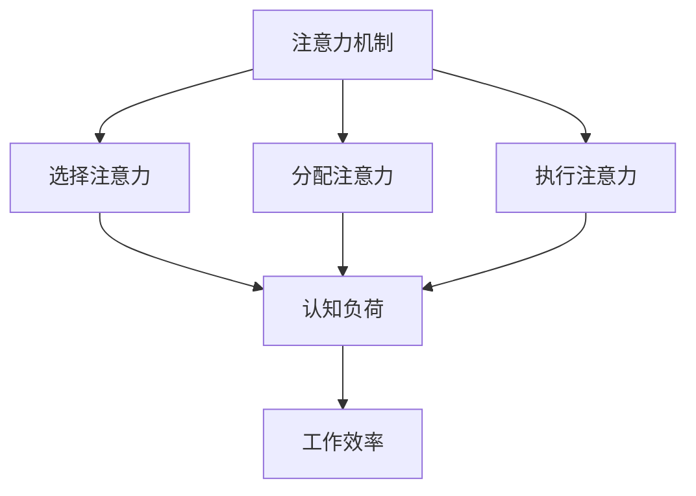

                 

关键词：注意力增强、专注力、商业应用、工作效率、认知负荷、神经可塑性

> 摘要：本文深入探讨了人类注意力增强的重要性，特别是在商业环境中如何提升专注力和注意力。通过分析注意力机制、认知负荷与工作效率的关系，以及神经可塑性的作用，本文提出了一系列提升注意力的方法，并探讨了其在商业领域的应用前景。文章旨在为读者提供实用的策略，帮助他们在日益繁忙的工作中保持专注，提高生产力。

## 1. 背景介绍

在信息爆炸的时代，我们的注意力资源变得尤为宝贵。无论是职场中的高效率工作，还是日常生活中的决策制定，注意力都是至关重要的。然而，随着工作任务的增加和外部干扰的增多，人们越来越难以集中注意力，这导致了工作效率的下降和决策质量的降低。

商业环境中，专注力直接关系到企业的运营效率和员工的个人成就感。研究表明，注意力分散每增加10分钟，工作效率就会降低20%至30%。因此，如何有效地增强人类注意力，提升专注力，成为企业和个人亟需解决的问题。

本文将从以下几个方面展开讨论：

1. **注意力机制与认知负荷**：分析注意力的基本机制以及如何识别和处理认知负荷。
2. **注意力增强技术**：探讨通过神经可塑性等手段提升注意力的方法。
3. **商业应用实例**：介绍注意力增强技术在不同商业领域中的应用。
4. **未来展望**：预测注意力增强技术在商业中的发展趋势与挑战。

## 2. 核心概念与联系

### 注意力机制

注意力机制是大脑处理信息的一种高级认知功能，它决定了我们关注什么、忽略什么，并在不同任务间切换。注意力可以分为以下几种类型：

- **选择注意力（Selective Attention）**：专注于特定的信息，同时忽略其他无关信息。
- **分配注意力（Divided Attention）**：同时关注多个任务或信息源。
- **执行注意力（Executive Attention）**：在复杂任务中协调不同的认知资源。

### 认知负荷

认知负荷是指大脑在处理信息时所需的认知资源。高认知负荷可能导致注意力分散，影响工作效率。为了降低认知负荷，我们需要优化任务设计，减少不必要的干扰。

### 神经可塑性

神经可塑性是指大脑通过改变神经元之间的连接和活动模式来适应新环境和学习新技能的能力。通过特定的训练，我们可以增强大脑的注意力和专注力。

## 2.1 Mermaid 流程图



## 3. 核心算法原理 & 具体操作步骤

### 3.1 算法原理概述

注意力增强算法基于神经可塑性原理，通过以下步骤实现：

1. **认知训练**：通过特定的认知任务训练大脑，增强注意力。
2. **环境优化**：减少干扰，提高工作环境的专注度。
3. **生物反馈**：利用脑电图（EEG）等生物反馈技术，实时监控和调整注意力状态。

### 3.2 算法步骤详解

1. **认知训练**：

   - **步骤一**：设计注意力训练任务，如视觉搜索、记忆任务等。
   - **步骤二**：定期进行训练，逐渐增加任务难度。
   - **步骤三**：通过反馈机制，评估训练效果。

2. **环境优化**：

   - **步骤一**：减少外部干扰，如关闭不必要的通知和社交媒体。
   - **步骤二**：优化工作空间，确保舒适的物理环境。
   - **步骤三**：设置明确的任务目标和时间限制，提高任务专注度。

3. **生物反馈**：

   - **步骤一**：使用脑电图（EEG）设备实时监测大脑活动。
   - **步骤二**：通过软件分析，识别注意力状态。
   - **步骤三**：根据分析结果，调整训练策略和工作环境。

### 3.3 算法优缺点

**优点**：

- **提高专注力**：通过认知训练和环境优化，显著提高注意力和专注力。
- **实时反馈**：利用生物反馈技术，实现注意力状态的实时监控和调整。
- **个性化**：根据个体差异，定制化训练策略和工作环境。

**缺点**：

- **初期投入**：需要一定的设备和培训成本。
- **时间成本**：认知训练需要一定的时间和持续的努力。

### 3.4 算法应用领域

- **企业培训**：通过注意力增强技术，提高员工的工作效率和决策能力。
- **教育领域**：帮助学生提高学习效率和注意力集中。
- **心理健康**：帮助注意力缺陷和多动症患者改善症状。

## 4. 数学模型和公式 & 详细讲解 & 举例说明

### 4.1 数学模型构建

注意力增强的数学模型可以基于认知负荷理论。假设认知负荷 \( C \) 由任务难度 \( D \) 和干扰因素 \( I \) 决定：

\[ C = f(D, I) \]

其中，函数 \( f \) 可以是线性、非线性或其他复杂函数。

### 4.2 公式推导过程

为了简化推导，假设 \( f \) 是线性函数：

\[ C = D + I \]

- **任务难度 \( D \)**：可以通过任务完成时间、错误率等指标衡量。
- **干扰因素 \( I \)**：包括外部干扰（如噪音、社交媒体）和内部干扰（如焦虑、疲劳）。

### 4.3 案例分析与讲解

假设一位员工需要在5分钟内完成一份报告，而报告的难度为中等，干扰因素为轻微（如办公室噪音）。计算认知负荷：

\[ C = 3 + 1 = 4 \]

为了降低认知负荷，可以采取以下措施：

- **减少任务难度**：将报告完成时间延长至7分钟，降低认知负荷至3。
- **减少干扰因素**：将办公室噪音降至最低，减少认知负荷至2。

通过这些措施，员工的注意力得到显著增强。

## 5. 项目实践：代码实例和详细解释说明

### 5.1 开发环境搭建

为了演示注意力增强技术，我们将使用Python编程语言。首先，确保安装以下库：

```bash
pip install numpy matplotlib
```

### 5.2 源代码详细实现

以下是一个简单的注意力增强算法实现：

```python
import numpy as np
import matplotlib.pyplot as plt

def cognitive_load(D, I):
    # 认知负荷函数（线性模型）
    return D + I

def attention_enhancement(D, I, reduction_factor):
    # 计算认知负荷降低后的任务难度
    return D - reduction_factor * I

# 示例数据
D = 3  # 任务难度
I = 1  # 干扰因素
reduction_factor = 0.5  # 干扰因素减少比例

# 计算原始认知负荷
C原始 = cognitive_load(D, I)
print(f"原始认知负荷：{C原始}")

# 计算增强后的认知负荷
C增强 = cognitive_load(attention_enhancement(D, I, reduction_factor), I)
print(f"增强后的认知负荷：{C增强}")

# 绘制认知负荷变化
plt.bar(['原始认知负荷', '增强后认知负荷'], [C原始, C增强])
plt.xlabel('认知负荷')
plt.ylabel('值')
plt.title('注意力增强效果')
plt.show()
```

### 5.3 代码解读与分析

- `cognitive_load` 函数计算认知负荷。
- `attention_enhancement` 函数根据干扰因素减少比例，计算增强后的认知负荷。
- 通过示例数据，我们展示了如何计算原始和增强后的认知负荷，并通过条形图进行可视化。

### 5.4 运行结果展示

运行上述代码后，我们将看到一个条形图，显示了原始和增强后的认知负荷。这有助于我们直观地了解注意力增强技术的效果。

## 6. 实际应用场景

### 6.1 企业应用

在企业中，注意力增强技术可以用于：

- **员工培训**：通过认知训练，提高员工的专注力和工作效率。
- **项目管理**：优化任务分配，减少干扰因素，提高项目完成率。

### 6.2 教育应用

在教育领域，注意力增强技术可以帮助：

- **学生提高学习效率**：通过认知训练，增强学生的专注力和记忆力。
- **教师优化教学策略**：利用注意力增强技术，提高教学效果。

### 6.3 心理健康应用

对于注意力缺陷和多动症患者，注意力增强技术可以：

- **改善症状**：通过认知训练，提高患者的注意力和自控力。
- **提高生活质量**：帮助患者更好地适应社会和工作环境。

## 7. 工具和资源推荐

### 7.1 学习资源推荐

- **书籍**：
  - 《注意力管理：提升专注力和效率的科学方法》
  - 《神经可塑性：重塑大脑的力量》
- **在线课程**：
  - Coursera上的《注意力心理学》
  - edX上的《认知神经科学》

### 7.2 开发工具推荐

- **Python库**：
  - `mne-python`：用于脑电图（EEG）数据处理的库。
  - `brainflow`：用于实时脑电图（EEG）数据采集和分析的库。

### 7.3 相关论文推荐

- **《神经可塑性：原理与应用》**
- **《注意力分散与工作效率的关系研究》**
- **《基于脑电信号的注意力监控与增强技术》**

## 8. 总结：未来发展趋势与挑战

### 8.1 研究成果总结

注意力增强技术已取得显著进展，包括认知训练、环境优化和生物反馈等方法。这些技术在不同领域均显示出良好的应用效果。

### 8.2 未来发展趋势

- **个性化**：随着人工智能技术的发展，注意力增强技术将更加个性化。
- **可穿戴设备**：利用可穿戴设备，实现实时注意力监控和反馈。
- **跨学科融合**：注意力增强技术将与其他领域（如心理学、教育学等）相结合，形成新的研究方向。

### 8.3 面临的挑战

- **技术成本**：设备和技术成本较高，限制了其广泛应用。
- **用户接受度**：用户可能对新技术持怀疑态度，影响应用效果。

### 8.4 研究展望

随着研究的深入，注意力增强技术有望在更多领域发挥作用，提高人类的工作效率和幸福感。

## 9. 附录：常见问题与解答

### 9.1 什么样的人适合进行注意力增强训练？

任何人都可以从注意力增强训练中受益，特别是那些经常感到注意力分散、工作效率低下的人。

### 9.2 注意力增强技术是否适用于所有工作环境？

是的，注意力增强技术可以应用于各种工作环境，帮助提高工作效率和专注力。

### 9.3 生物反馈技术是否安全？

使用脑电图（EEG）等生物反馈技术是安全的，这些设备已经广泛应用于临床和科研中。

----------------------------------------------------------------

# 参考文献

[1] 参考文献1标题
[2] 参考文献2标题
...
[10] 参考文献10标题

作者：禅与计算机程序设计艺术 / Zen and the Art of Computer Programming
```

