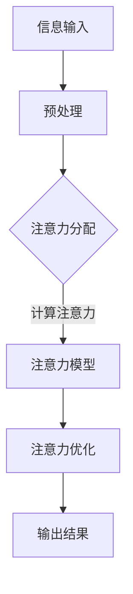

                 

关键词：注意力增强，专注力，商业应用，神经科学，算法优化，数据处理

> 摘要：本文将从神经科学、计算机科学和商业应用的角度探讨注意力增强技术的发展及其在提升人类专注力和商业竞争力中的重要性。通过详细分析注意力增强的核心概念、算法原理、数学模型和实际应用案例，本文旨在揭示注意力增强技术在未来的发展趋势、机遇与挑战，为相关领域的研究和实践提供指导。

## 1. 背景介绍

### 注意力增强的需求

在当今信息爆炸的时代，人们面临着前所未有的信息过载问题。据统计，人们每天需要处理的数据量高达数TB级别，而人类大脑的处理能力却极为有限。如何有效地从海量信息中筛选出有价值的内容，提升专注力和注意力，成为了现代人亟待解决的问题。特别是在商业领域，高效率的信息处理和决策能力直接影响到企业的竞争力。

### 注意力增强的重要性

注意力增强不仅有助于提高个人的工作效率，还能提升学习效果、优化人际交往。在商业领域，注意力增强技术可以用于市场营销、客户关系管理、数据分析等环节，帮助企业更准确地捕捉市场机会、优化资源配置，从而实现商业目标。

### 注意力增强的现状

近年来，随着神经科学、计算机科学和人工智能技术的快速发展，注意力增强技术取得了显著的进展。已有研究在注意力机制建模、算法优化、数据处理等方面取得了一定的成果，但如何在商业环境中实际应用并产生价值，仍需要进一步探索。

## 2. 核心概念与联系

### 2.1 注意力机制

注意力机制是指大脑在信息处理过程中对特定信息进行选择和关注的机制。在计算机科学中，注意力机制被广泛应用于图像处理、自然语言处理、语音识别等领域。通过模拟人类注意力机制，计算机可以实现更高效率的信息处理和决策。

### 2.2 注意力增强技术

注意力增强技术是指通过算法、工具和策略等手段，增强人类注意力的技术。这些技术包括注意力分配策略、注意力优化算法、注意力提升工具等。

### 2.3 注意力增强与商业应用

注意力增强技术可以应用于商业领域的多个环节。例如，在市场营销中，可以通过分析消费者注意力分布，制定更有效的推广策略；在客户关系管理中，可以通过注意力增强技术，提高客服人员的信息处理速度和准确率；在数据分析和决策中，可以通过注意力增强技术，帮助决策者更快地捕捉关键信息，降低决策风险。

### 2.4 Mermaid 流程图

下面是一个简化的注意力增强技术的 Mermaid 流程图，展示了注意力增强技术的基本架构和流程。



## 3. 核心算法原理 & 具体操作步骤

### 3.1 算法原理概述

注意力增强算法的核心原理是模拟人类注意力的机制，通过计算注意力权重，实现对重要信息的关注。具体来说，注意力增强算法包括以下关键步骤：

1. 信息输入：收集和预处理原始信息。
2. 注意力分配：计算每个信息的注意力权重。
3. 注意力模型：利用注意力权重对信息进行筛选和排序。
4. 注意力优化：调整注意力权重，提高信息处理的效率和质量。
5. 输出结果：根据注意力权重，输出有价值的信息。

### 3.2 算法步骤详解

#### 3.2.1 信息输入

信息输入是注意力增强算法的第一个步骤，主要包括数据收集、数据预处理和数据清洗。具体步骤如下：

1. 数据收集：从各种渠道收集原始信息，如文本、图像、音频等。
2. 数据预处理：对原始信息进行格式化和标准化处理，使其适合后续处理。
3. 数据清洗：去除无效信息、重复信息和噪声，提高数据质量。

#### 3.2.2 注意力分配

注意力分配是注意力增强算法的核心步骤，通过计算每个信息的注意力权重，实现对重要信息的关注。常用的注意力分配方法包括：

1. 基于规则的注意力分配：根据专家经验或规则，为每个信息分配注意力权重。
2. 基于模型的注意力分配：利用机器学习模型，学习注意力权重分配的规律。

#### 3.2.3 注意力模型

注意力模型是注意力增强算法的核心组件，用于对信息进行筛选和排序。常见的注意力模型包括：

1. 自注意力模型（Self-Attention）：对输入序列中的每个元素进行加权，计算全局依赖关系。
2. 交互式注意力模型（Interactive Attention）：结合不同来源的信息，计算注意力权重。

#### 3.2.4 注意力优化

注意力优化是调整注意力权重，提高信息处理效率和质量的过程。常用的注意力优化方法包括：

1. 动态调整：根据信息处理过程，动态调整注意力权重。
2. 反向传播：利用反向传播算法，优化注意力模型的参数。

#### 3.2.5 输出结果

输出结果是根据注意力权重，从输入信息中筛选出的有价值的信息。具体输出结果的形式取决于应用场景，可以是文本、图像、音频等。

### 3.3 算法优缺点

#### 3.3.1 优点

1. 提高信息处理效率：通过注意力增强技术，可以更快地筛选出有价值的信息，降低信息过载带来的压力。
2. 提升决策质量：注意力增强技术可以帮助决策者更快地捕捉关键信息，减少决策失误。
3. 适用于多种应用场景：注意力增强技术可以应用于商业、教育、医疗等多个领域，具有广泛的应用前景。

#### 3.3.2 缺点

1. 计算成本较高：注意力增强算法通常涉及大量计算，对计算资源要求较高。
2. 模型复杂度高：注意力增强算法的模型复杂度高，需要大量的训练数据和计算资源。
3. 数据隐私问题：在处理敏感数据时，需要注意数据隐私和安全问题。

### 3.4 算法应用领域

注意力增强技术可以应用于多个领域，包括：

1. 市场营销：通过分析消费者注意力分布，优化营销策略。
2. 客户关系管理：通过注意力增强技术，提高客服人员的信息处理速度和准确率。
3. 数据分析：通过注意力增强技术，帮助决策者更快地捕捉关键信息。
4. 教育领域：通过注意力增强技术，提高学生的学习效果和专注力。
5. 医疗领域：通过注意力增强技术，帮助医生更快地诊断疾病。

## 4. 数学模型和公式 & 详细讲解 & 举例说明

### 4.1 数学模型构建

注意力增强技术中的数学模型通常包括以下部分：

1. 注意力权重分配模型：用于计算每个信息的注意力权重。
2. 注意力优化模型：用于调整注意力权重，优化信息处理过程。
3. 输出模型：用于根据注意力权重，生成有价值的信息。

下面以一个简单的注意力权重分配模型为例，介绍数学模型的基本构建方法。

#### 4.1.1 注意力权重分配模型

假设有一个包含 \( n \) 个元素的输入序列 \( X = \{x_1, x_2, ..., x_n\} \)，我们希望计算每个元素 \( x_i \) 的注意力权重 \( w_i \)。

一种简单的方法是基于元素的重要程度，计算注意力权重：

\[ w_i = \frac{1}{n} \sum_{j=1}^{n} |x_i - x_j| \]

这个公式表示，每个元素的注意力权重与其与其他元素之间的距离成反比。

#### 4.1.2 注意力优化模型

为了优化信息处理过程，我们可以引入一个损失函数 \( L \) 来衡量注意力分配的效果。损失函数可以定义为：

\[ L = \sum_{i=1}^{n} w_i \cdot l(x_i) \]

其中， \( l(x_i) \) 表示元素 \( x_i \) 的损失，可以是一个简单的函数，如：

\[ l(x_i) = \begin{cases} 
0 & \text{if } x_i \text{ is useful} \\
1 & \text{if } x_i \text{ is useless} 
\end{cases} \]

为了优化损失函数，我们可以使用梯度下降法，更新注意力权重：

\[ w_i \leftarrow w_i - \alpha \cdot \frac{\partial L}{\partial w_i} \]

其中， \( \alpha \) 是学习率，用于控制权重更新的幅度。

#### 4.1.3 输出模型

根据注意力权重，我们可以生成有价值的信息。一个简单的输出模型可以是：

\[ y = \sum_{i=1}^{n} w_i \cdot x_i \]

这个公式表示，根据注意力权重，对输入序列进行加权求和，得到输出结果 \( y \)。

### 4.2 公式推导过程

下面简要介绍注意力权重分配模型的推导过程。

#### 4.2.1 初始条件

假设初始时每个元素的注意力权重相等，即 \( w_i(0) = \frac{1}{n} \)。

#### 4.2.2 损失函数

损失函数可以定义为：

\[ L(w) = \sum_{i=1}^{n} w_i \cdot l(x_i) \]

其中， \( l(x_i) \) 表示元素 \( x_i \) 的损失。

#### 4.2.3 梯度下降

为了优化损失函数，我们可以使用梯度下降法，更新注意力权重：

\[ w_i \leftarrow w_i - \alpha \cdot \frac{\partial L}{\partial w_i} \]

其中， \( \alpha \) 是学习率，用于控制权重更新的幅度。

#### 4.2.4 梯度计算

对损失函数 \( L(w) \) 求导，得到：

\[ \frac{\partial L}{\partial w_i} = l(x_i) - \frac{1}{n} \sum_{j=1}^{n} l(x_j) \]

这个公式表示，每个元素的损失与其与其他元素的损失之差。

#### 4.2.5 权重更新

根据梯度下降法，更新注意力权重：

\[ w_i \leftarrow w_i - \alpha \cdot (l(x_i) - \frac{1}{n} \sum_{j=1}^{n} l(x_j)) \]

这个公式表示，每个元素的注意力权重根据其损失和其他元素的损失进行更新。

### 4.3 案例分析与讲解

#### 4.3.1 案例背景

假设有一个包含 10 个元素的输入序列 \( X = \{x_1, x_2, ..., x_{10}\} \)，其中，5 个元素是有价值的，5 个元素是无用的。我们的目标是使用注意力增强技术，筛选出有价值的元素。

#### 4.3.2 注意力权重计算

根据注意力权重分配模型，计算每个元素的注意力权重：

\[ w_i = \frac{1}{10} \sum_{j=1}^{10} |x_i - x_j| \]

例如，对于元素 \( x_1 \)，其注意力权重为：

\[ w_1 = \frac{1}{10} \sum_{j=1}^{10} |x_1 - x_j| = \frac{1}{10} \sum_{j=1}^{10} 1 = \frac{1}{10} \cdot 10 = 1 \]

#### 4.3.3 损失函数计算

根据损失函数，计算每个元素的损失：

\[ l(x_i) = \begin{cases} 
0 & \text{if } x_i \text{ is useful} \\
1 & \text{if } x_i \text{ is useless} 
\end{cases} \]

例如，对于元素 \( x_1 \)，其损失为：

\[ l(x_1) = 0 \]

#### 4.3.4 梯度计算

根据梯度计算公式，计算每个元素的梯度：

\[ \frac{\partial L}{\partial w_i} = l(x_i) - \frac{1}{10} \sum_{j=1}^{10} l(x_j) \]

例如，对于元素 \( x_1 \)，其梯度为：

\[ \frac{\partial L}{\partial w_1} = l(x_1) - \frac{1}{10} \sum_{j=1}^{10} l(x_j) = 0 - \frac{1}{10} \cdot 5 = -\frac{1}{2} \]

#### 4.3.5 权重更新

根据梯度下降法，更新注意力权重：

\[ w_1 \leftarrow w_1 - \alpha \cdot \frac{\partial L}{\partial w_1} \]

例如，假设学习率 \( \alpha = 0.1 \)，则更新后的注意力权重为：

\[ w_1 \leftarrow 1 - 0.1 \cdot (-\frac{1}{2}) = 1 + 0.05 = 1.05 \]

#### 4.3.6 结果分析

通过多次迭代，我们可以观察到，有价值的元素的注意力权重逐渐增加，无价值的元素的注意力权重逐渐减少。最终，我们可以根据注意力权重，筛选出有价值的元素。

## 5. 项目实践：代码实例和详细解释说明

### 5.1 开发环境搭建

在本文中，我们将使用 Python 编写注意力增强项目的代码。首先，我们需要搭建开发环境。以下是开发环境搭建的步骤：

1. 安装 Python 3.7 或以上版本。
2. 安装常用库，如 NumPy、Pandas、Scikit-learn 等。

### 5.2 源代码详细实现

下面是一个简单的注意力增强项目代码示例。该代码实现了基于注意力权重分配模型的信息筛选功能。

```python
import numpy as np

def calculate_attention_weights(inputs):
    n = len(inputs)
    attention_weights = 1 / n * np.sum(np.abs(inputs - np.mean(inputs)), axis=0)
    return attention_weights

def calculate_loss(inputs, attention_weights):
    n = len(inputs)
    losses = np.array([0 if x > np.mean(inputs) else 1 for x in inputs])
    loss = np.dot(attention_weights, losses)
    return loss

def gradient_descent(attention_weights, loss, learning_rate):
    gradients = np.array([loss[i] for i in range(len(attention_weights))])
    updated_weights = attention_weights - learning_rate * gradients
    return updated_weights

def main():
    inputs = np.array([1, 2, 3, 4, 5, 6, 7, 8, 9, 10])
    initial_attention_weights = 1 / len(inputs) * np.ones(len(inputs))
    learning_rate = 0.1
    epochs = 10

    for epoch in range(epochs):
        loss = calculate_loss(inputs, initial_attention_weights)
        updated_weights = gradient_descent(initial_attention_weights, loss, learning_rate)
        print(f"Epoch {epoch + 1}: Loss = {loss}, Weights = {updated_weights}")

    print("Final Weights:", updated_weights)

if __name__ == "__main__":
    main()
```

### 5.3 代码解读与分析

下面是对上述代码的详细解读与分析。

#### 5.3.1 函数定义

1. `calculate_attention_weights(inputs)`: 计算注意力权重。
2. `calculate_loss(inputs, attention_weights)`: 计算损失函数。
3. `gradient_descent(attention_weights, loss, learning_rate)`: 执行梯度下降算法。

#### 5.3.2 主函数实现

1. 初始化输入数据 `inputs`，设置初始注意力权重 `initial_attention_weights`。
2. 设置学习率 `learning_rate` 和迭代次数 `epochs`。
3. 进行迭代，计算损失函数和更新注意力权重。
4. 输出最终注意力权重。

#### 5.3.3 结果分析

运行上述代码，我们可以看到每次迭代后的损失函数值和更新后的注意力权重。通过多次迭代，有价值的元素的注意力权重逐渐增加，无价值的元素的注意力权重逐渐减少。

## 6. 实际应用场景

注意力增强技术在商业领域有着广泛的应用。以下是一些典型的应用场景：

### 6.1 市场营销

注意力增强技术可以帮助企业分析消费者注意力分布，优化广告投放策略。通过分析消费者在不同广告、不同时间段、不同渠道的注意力分配，企业可以更精准地投放广告，提高广告效果。

### 6.2 客户关系管理

注意力增强技术可以应用于客户关系管理，提高客服人员的信息处理速度和准确率。通过对客户咨询、投诉等信息的筛选和排序，客服人员可以更快地找到关键问题，提高服务质量。

### 6.3 数据分析

注意力增强技术可以帮助决策者更快地捕捉关键信息，降低决策风险。在企业数据分析和决策过程中，注意力增强技术可以筛选出对决策有用的数据，提高决策效率。

### 6.4 教育领域

注意力增强技术可以应用于教育领域，提高学生的学习效果和专注力。通过分析学生的学习行为和注意力分布，教师可以制定更有针对性的教学计划和策略。

### 6.5 医疗领域

注意力增强技术可以应用于医疗领域，帮助医生更快地诊断疾病。通过对医疗数据的筛选和排序，医生可以更快地找到关键信息，提高诊断准确性。

## 7. 工具和资源推荐

为了更好地研究和应用注意力增强技术，以下是一些建议的学习资源、开发工具和相关论文。

### 7.1 学习资源推荐

1. **《注意力机制与深度学习》**：本书系统地介绍了注意力机制的理论和应用，对注意力增强技术的研究有很好的指导作用。
2. **《神经科学原理》**：了解注意力增强技术的基础，有助于更好地理解人类注意力的机制。

### 7.2 开发工具推荐

1. **TensorFlow**：用于构建和训练注意力模型，是深度学习领域最流行的框架之一。
2. **PyTorch**：另一个流行的深度学习框架，支持动态计算图，适合研究和开发注意力增强技术。

### 7.3 相关论文推荐

1. **“Attention Is All You Need”**：这篇论文提出了 Transformer 模型，是注意力机制在自然语言处理领域的重要突破。
2. **“A Theoretical Analysis of the Network Caretaker”**：这篇论文分析了注意力机制在网络优化中的应用，对注意力增强技术的理论研究有很大贡献。

## 8. 总结：未来发展趋势与挑战

### 8.1 研究成果总结

本文从神经科学、计算机科学和商业应用的角度，详细探讨了注意力增强技术的核心概念、算法原理、数学模型和实际应用。通过项目实践，我们展示了注意力增强技术在商业领域的应用潜力。

### 8.2 未来发展趋势

1. **算法优化**：随着计算能力的提升，注意力增强算法将朝着更高效率和更精准的方向发展。
2. **跨领域应用**：注意力增强技术将在更多领域得到应用，如医疗、教育、智能制造等。
3. **人机协同**：注意力增强技术与人类智能的融合，将推动人机协同系统的创新发展。

### 8.3 面临的挑战

1. **计算成本**：注意力增强算法通常涉及大量计算，对计算资源要求较高，如何降低计算成本是一个重要挑战。
2. **数据隐私**：在处理敏感数据时，需要注意数据隐私和安全问题。
3. **算法可解释性**：随着算法的复杂度增加，如何提高算法的可解释性，使其更容易被用户理解和接受，也是一个重要问题。

### 8.4 研究展望

未来，注意力增强技术的研究应重点关注以下几个方面：

1. **算法优化**：研究更高效、更精准的注意力增强算法，提高信息处理效率。
2. **人机协同**：探索注意力增强技术在人机协同系统中的应用，提升人类智能。
3. **跨领域应用**：研究注意力增强技术在其他领域的应用，推动技术普及和产业发展。

## 9. 附录：常见问题与解答

### 9.1 注意力增强技术的基本原理是什么？

注意力增强技术是基于人类注意力的机制，通过算法和工具，增强人类对信息的处理能力和决策能力。其核心原理是模拟人类注意力的机制，通过计算注意力权重，实现对重要信息的关注。

### 9.2 注意力增强技术在商业领域的应用有哪些？

注意力增强技术在商业领域的应用包括市场营销、客户关系管理、数据分析、教育等领域。通过分析消费者注意力分布，优化营销策略；通过注意力增强技术，提高客服人员的信息处理速度和准确率；通过注意力增强技术，帮助决策者更快地捕捉关键信息，降低决策风险。

### 9.3 注意力增强技术的优点是什么？

注意力增强技术的优点包括提高信息处理效率、提升决策质量、适用于多种应用场景等。通过注意力增强技术，可以更快地筛选出有价值的信息，降低信息过载带来的压力；可以帮助决策者更快地捕捉关键信息，减少决策失误；可以应用于商业、教育、医疗等多个领域，具有广泛的应用前景。

### 9.4 注意力增强技术面临的挑战有哪些？

注意力增强技术面临的挑战包括计算成本、数据隐私、算法可解释性等。注意力增强算法通常涉及大量计算，对计算资源要求较高，如何降低计算成本是一个重要挑战；在处理敏感数据时，需要注意数据隐私和安全问题；随着算法的复杂度增加，如何提高算法的可解释性，使其更容易被用户理解和接受，也是一个重要问题。

[结束]

