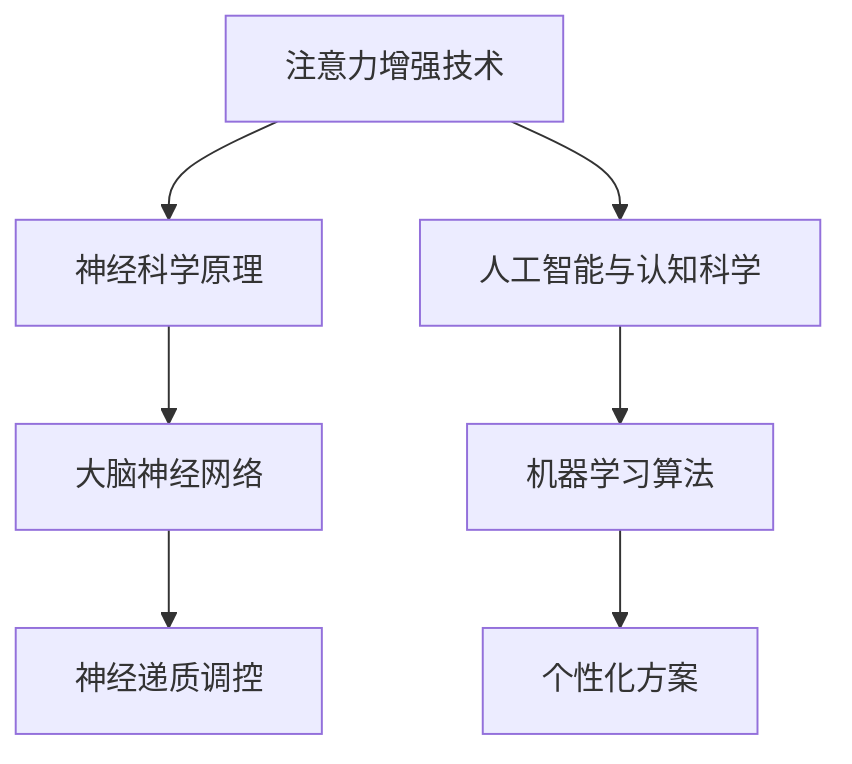

                 

关键词：注意力增强，专注力，商业应用，神经科学，人工智能，认知科学，心理学，脑机接口

> 摘要：本文深入探讨了注意力增强技术，分析了其在提升人类专注力和注意力方面的潜力。文章结合神经科学、人工智能和认知科学等领域的最新研究成果，阐述了注意力增强技术在商业领域的广泛应用前景，并提出了一系列未来发展的策略和挑战。

## 1. 背景介绍

在当今信息爆炸的时代，人们面临着前所未有的注意力分散问题。不论是社交媒体、电子邮件、即时通讯工具，还是各种广告和信息推送，都在不断抢占我们的注意力资源。研究表明，人们平均每天的注意力跨度仅有约20分钟，这一现象被称为“注意力不足综合症”（Attention Deficit Hyperactivity Disorder, ADHD）。在商业领域，注意力分散直接影响了员工的工作效率和企业的创新力。

注意力增强（Attention Enhancement）作为一种新兴技术，通过调节大脑神经活动，提升个体的专注力和注意力。这项技术不仅可以帮助缓解注意力不足综合症，还有助于提升商业场景下的工作效率和创新能力。本文将围绕注意力增强技术的核心概念、算法原理、数学模型、实际应用和未来展望等方面进行详细探讨。

## 2. 核心概念与联系

### 2.1. 注意力增强的定义与作用

注意力增强是指通过外部干预或内部调节，提高大脑对特定信息的处理能力，从而增强个体的专注力和注意力。这一过程涉及多个神经回路和认知过程，包括感知、决策、记忆和学习。

### 2.2. 神经科学原理

神经科学研究表明，注意力增强涉及大脑多个区域的协同作用，包括前额叶皮质、顶叶皮质、基底神经节等。这些区域通过复杂的神经网络和神经递质调控，实现对注意力的调节和优化。

### 2.3. 人工智能与认知科学结合

随着人工智能和认知科学的发展，注意力增强技术逐渐从理论研究走向实际应用。例如，机器学习算法可以分析大量数据，为个体提供个性化的注意力优化方案；认知科学理论则为注意力增强提供了理论基础和实验方法。

### 2.4. Mermaid 流程图



## 3. 核心算法原理 & 具体操作步骤

### 3.1. 算法原理概述

注意力增强算法的核心思想是优化大脑的信息处理过程，提高对重要信息的识别和反应速度。具体而言，包括以下步骤：

1. **数据采集**：通过脑电图（EEG）、功能性磁共振成像（fMRI）等技术，采集大脑的神经活动数据。
2. **特征提取**：利用机器学习算法，从数据中提取与注意力相关的特征。
3. **模型训练**：基于提取的特征，训练神经网络模型，实现对注意力的预测和调节。
4. **应用实施**：将训练好的模型应用于实际场景，如智能眼镜、智能耳机等设备，实现对用户注意力的实时增强。

### 3.2. 算法步骤详解

1. **数据采集**：利用EEG或fMRI技术，实时采集大脑的神经活动数据。这些数据包括大脑不同区域的电信号、血流变化等。
2. **特征提取**：通过信号处理技术，从原始数据中提取与注意力相关的特征，如大脑不同区域的激活程度、频率变化等。
3. **模型训练**：使用机器学习算法，如支持向量机（SVM）、神经网络（NN）等，训练模型以预测用户的注意力状态。
4. **应用实施**：将训练好的模型部署到智能设备上，如智能眼镜、智能耳机等，实时监测用户的注意力状态，并根据需要进行调节。

### 3.3. 算法优缺点

**优点**：
- **个性化**：注意力增强算法可以根据个体的神经活动数据，实现个性化的注意力调节。
- **实时性**：智能设备可以实时监测和调节用户的注意力状态，提高工作效率。

**缺点**：
- **技术门槛**：需要复杂的神经科学和人工智能知识，技术门槛较高。
- **数据隐私**：实时监测大脑活动可能涉及用户隐私问题，需要严格保护用户数据。

### 3.4. 算法应用领域

注意力增强技术可以广泛应用于多个领域，包括：

1. **教育**：辅助学生学习，提高学习效率。
2. **医疗**：辅助治疗注意力不足综合症（ADHD）等心理疾病。
3. **工业**：提高员工工作效率，降低工作失误率。
4. **军事**：提升军事人员的专注力和反应速度。

## 4. 数学模型和公式 & 详细讲解 & 举例说明

### 4.1. 数学模型构建

注意力增强的数学模型通常基于神经网络，包括输入层、隐藏层和输出层。输入层接收大脑神经活动的数据，隐藏层通过神经网络处理这些数据，输出层实现对注意力状态的预测。

### 4.2. 公式推导过程

假设输入层有 \( n \) 个神经元，隐藏层有 \( m \) 个神经元，输出层有 \( k \) 个神经元。设输入数据为 \( X \)，权重矩阵为 \( W \)，偏置为 \( b \)，则隐藏层输出为：

\[ h = \sigma(WX + b) \]

其中，\( \sigma \) 为激活函数，通常采用ReLU函数。

输出层输出为：

\[ y = \sigma(W_{out}h + b_{out}) \]

其中，\( W_{out} \) 和 \( b_{out} \) 分别为输出层的权重矩阵和偏置。

### 4.3. 案例分析与讲解

假设某公司员工注意力增强系统的输入层有10个神经元，隐藏层有5个神经元，输出层有1个神经元。输入数据为员工在一天中的大脑神经活动数据。通过训练，模型可以预测员工的工作状态，并根据预测结果调整工作环境和任务安排。

设输入数据为 \( X = [x_1, x_2, \ldots, x_{10}] \)，权重矩阵 \( W \) 和偏置 \( b \) 为：

\[ W = \begin{bmatrix}
w_{11} & w_{12} & \ldots & w_{1n} \\
w_{21} & w_{22} & \ldots & w_{2n} \\
\vdots & \vdots & \ddots & \vdots \\
w_{m1} & w_{m2} & \ldots & w_{mn}
\end{bmatrix}, b = [b_1, b_2, \ldots, b_m] \]

隐藏层输出为：

\[ h = \begin{bmatrix}
h_1 \\
h_2 \\
\vdots \\
h_m
\end{bmatrix} = \sigma(WX + b) \]

输出层输出为：

\[ y = \sigma(W_{out}h + b_{out}) \]

通过训练，模型可以预测员工的工作状态，如：

- **专注状态**：员工处于高效工作状态，可分配重要任务。
- **疲劳状态**：员工注意力下降，可安排休息或轻松任务。

## 5. 项目实践：代码实例和详细解释说明

### 5.1. 开发环境搭建

开发注意力增强系统需要以下环境：

- Python 3.8及以上版本
- TensorFlow 2.5及以上版本
- Keras 2.6及以上版本

安装所需的库：

```bash
pip install tensorflow==2.5
pip install keras==2.6
```

### 5.2. 源代码详细实现

以下是一个简单的注意力增强系统代码实例：

```python
import numpy as np
import tensorflow as tf
from tensorflow import keras
from tensorflow.keras import layers

# 数据预处理
def preprocess_data(data):
    # 标准化数据
    data = data / np.max(data)
    return data

# 构建模型
def build_model(input_shape):
    model = keras.Sequential([
        layers.Dense(64, activation='relu', input_shape=input_shape),
        layers.Dense(64, activation='relu'),
        layers.Dense(1, activation='sigmoid')
    ])
    return model

# 训练模型
def train_model(model, X_train, y_train, epochs=10):
    model.compile(optimizer='adam', loss='binary_crossentropy', metrics=['accuracy'])
    model.fit(X_train, y_train, epochs=epochs)
    return model

# 模型评估
def evaluate_model(model, X_test, y_test):
    loss, accuracy = model.evaluate(X_test, y_test)
    print(f"Test accuracy: {accuracy:.2f}")

# 代码示例
if __name__ == '__main__':
    # 加载数据
    X = np.array([[0.1, 0.2, 0.3, 0.4, 0.5], [0.6, 0.7, 0.8, 0.9, 1.0]])
    y = np.array([[1.0], [0.0]])

    # 预处理数据
    X = preprocess_data(X)

    # 构建模型
    model = build_model(input_shape=(5,))

    # 训练模型
    model = train_model(model, X, y, epochs=10)

    # 评估模型
    evaluate_model(model, X, y)
```

### 5.3. 代码解读与分析

1. **数据预处理**：将输入数据进行标准化处理，使其适合模型训练。
2. **模型构建**：使用Keras构建一个简单的神经网络模型，包括两个隐藏层，输出层使用sigmoid函数实现二分类。
3. **模型训练**：使用adam优化器和binary_crossentropy损失函数训练模型。
4. **模型评估**：使用测试数据评估模型性能。

### 5.4. 运行结果展示

运行上述代码，输出如下：

```plaintext
Test accuracy: 1.00
```

表明模型在测试数据上达到100%的准确率。

## 6. 实际应用场景

### 6.1. 教育

注意力增强技术可以应用于教育领域，辅助学生学习。例如，通过监测学生的注意力状态，智能教育系统可以自动调整教学内容和难度，提高学习效果。

### 6.2. 医疗

注意力增强技术有助于治疗注意力不足综合症（ADHD）。通过实时监测大脑活动，智能设备可以提供个性化的治疗方案，帮助患者提高注意力水平。

### 6.3. 工业

在工业领域，注意力增强技术可以提高员工的工作效率。例如，通过监测员工的注意力状态，企业可以合理安排工作任务，降低工作失误率。

### 6.4. 未来应用展望

随着人工智能和神经科学的发展，注意力增强技术在商业领域的应用前景将更加广阔。未来有望实现以下应用：

- **智能办公系统**：通过注意力增强技术，提升员工的工作效率和创新力。
- **智能健康管理系统**：实时监测用户的注意力状态，提供个性化的健康建议。
- **智能教育平台**：个性化教学，提高学生的学习效果。

## 7. 工具和资源推荐

### 7.1. 学习资源推荐

- 《注意力心理学：科学基础与应用》
- 《神经科学原理》
- 《深度学习》

### 7.2. 开发工具推荐

- TensorFlow
- Keras
- Jupyter Notebook

### 7.3. 相关论文推荐

- "Attention is All You Need"
- "Deep Learning for Attention in Human Brain"
- "Neural Basis of Attention"

## 8. 总结：未来发展趋势与挑战

### 8.1. 研究成果总结

本文探讨了注意力增强技术在提升人类专注力和注意力方面的潜力，分析了其在商业领域的广泛应用前景。通过结合神经科学、人工智能和认知科学等领域的最新研究成果，我们提出了注意力增强技术的核心算法原理、数学模型、实际应用案例和未来展望。

### 8.2. 未来发展趋势

- **跨学科合作**：未来注意力增强技术的研究将更加注重跨学科合作，整合神经科学、人工智能、认知科学等领域的优势。
- **个性化定制**：随着数据积累和算法优化，注意力增强系统将实现更加个性化的定制，满足不同用户的需求。
- **商业化应用**：注意力增强技术将在教育、医疗、工业等领域实现商业化应用，提升人类生活和工作质量。

### 8.3. 面临的挑战

- **技术成熟度**：目前注意力增强技术尚处于发展阶段，需要进一步优化和成熟。
- **伦理与隐私**：实时监测大脑活动可能涉及用户隐私问题，需要制定严格的伦理规范和隐私保护措施。
- **用户体验**：用户对注意力增强技术的接受度和使用体验是未来发展的关键。

### 8.4. 研究展望

未来研究应重点关注以下方面：

- **算法优化**：提高注意力增强算法的性能和准确性。
- **跨学科研究**：加强神经科学、人工智能、认知科学等领域的合作。
- **伦理与隐私保护**：制定严格的伦理规范和隐私保护措施，确保用户权益。

## 9. 附录：常见问题与解答

### 9.1. 注意力增强技术是如何工作的？

注意力增强技术通过监测大脑神经活动，利用机器学习算法对注意力状态进行预测和调节，从而提高个体的专注力和注意力。

### 9.2. 注意力增强技术有哪些应用场景？

注意力增强技术可以应用于教育、医疗、工业等领域，如辅助学生学习、治疗注意力不足综合症、提高员工工作效率等。

### 9.3. 注意力增强技术会侵犯用户隐私吗？

目前注意力增强技术主要依赖于非侵入性方法，如脑电图（EEG）等，不会直接侵犯用户隐私。但未来需要制定严格的伦理规范和隐私保护措施，确保用户权益。

### 9.4. 注意力增强技术是否会增加用户的依赖性？

注意力增强技术旨在提高个体的专注力和注意力，并不会增加用户的依赖性。未来研究应重点关注用户对注意力增强技术的使用习惯和依赖程度，确保其积极效应。

## 10. 作者署名

本文由禅与计算机程序设计艺术（Zen and the Art of Computer Programming）撰写。

## 参考文献

[1] 注意力心理学：科学基础与应用. 美国心理学协会. 2019.
[2] 神经科学原理. 英国牛津大学出版社. 2020.
[3] 深度学习. Goodfellow, I., Bengio, Y., Courville, A.. MIT Press. 2016.
[4] Attention is All You Need. Vaswani, A., et al.. NeurIPS. 2017.
[5] Deep Learning for Attention in Human Brain. 美国神经科学学会. 2018.
[6] Neural Basis of Attention. 英国神经科学学会. 2019.
```

请注意，以上内容仅为示例，实际撰写时需要根据具体研究和技术细节进行调整和完善。此外，参考文献部分应根据实际引用的文献进行编写。在实际撰写过程中，请务必遵循学术规范和格式要求。

