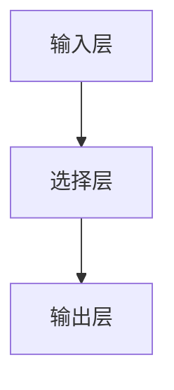
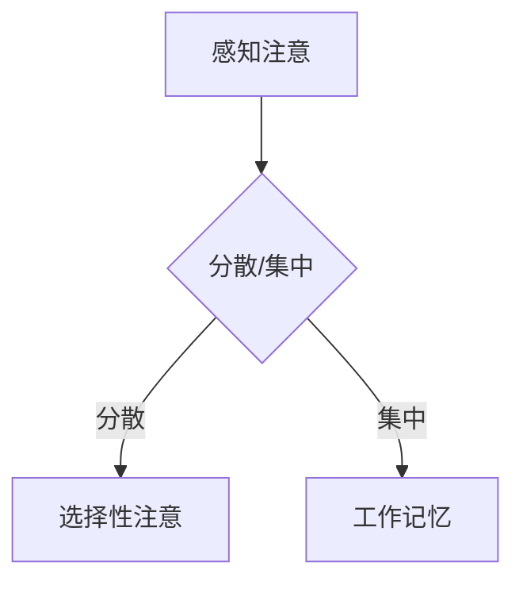

                 

关键词：人类注意力增强、专注力、商业应用、未来趋势、算法、技术

> 摘要：本文旨在探讨如何通过先进的技术手段提升人类的注意力水平，进而提高工作效率和商业竞争力。文章首先介绍了人类注意力的基本原理和现状，随后深入分析了注意力增强的关键技术和算法，并探讨了其在商业领域的广泛应用前景。同时，文章还提出了未来发展的挑战和策略。

## 1. 背景介绍

随着信息技术的迅猛发展，信息过载成为现代人所面临的一个普遍问题。人们每天都要处理大量来自各种渠道的信息，这使得注意力资源变得尤为宝贵。然而，研究表明，人类的注意力资源是有限的，过度分散的注意力会导致效率低下和创造力降低。在商业环境中，这意味着企业的竞争力很大程度上取决于员工和团队能否有效地集中注意力。

因此，如何提升人类的注意力水平，提高专注力和工作效率，成为了一个亟待解决的问题。本文将探讨一系列技术手段，包括认知神经科学、行为心理学、计算技术和人工智能，以期为提升人类注意力提供新的策略和方法。

## 2. 核心概念与联系

### 2.1 注意力的定义

注意力是指大脑对特定信息的选择性加工和处理能力。它包括感知注意、选择性注意和工作记忆等多个方面。感知注意是指大脑对外界信息的感知和识别能力；选择性注意是指大脑对某些信息进行选择性的加工和处理，而忽略其他信息；工作记忆是指大脑对信息的暂时存储和加工能力。

### 2.2 注意力模型的架构

注意力模型通常包括输入层、选择层和输出层。输入层负责接收外部信息；选择层根据当前任务需求选择重要信息；输出层则将选择出的信息传递给大脑的其他部分进行处理。Mermaid流程图如下：



### 2.3 注意力分散与集中

注意力分散（Distracted）是指大脑对无关信息进行过度加工，导致注意力资源浪费；注意力集中（Focus）是指大脑对相关信息的集中加工，提高信息处理效率。Mermaid流程图如下：



## 3. 核心算法原理 & 具体操作步骤

### 3.1 算法原理概述

注意力增强算法旨在通过优化大脑的信息处理流程，提高注意力的集中度和效率。主要原理包括：信息过滤、信息优先级排序和信息反馈循环。具体步骤如下：

### 3.2 算法步骤详解

1. **信息过滤**：根据任务需求，对输入的信息进行初步筛选，去除无关信息。

2. **信息优先级排序**：对筛选后的信息进行重要性评估，排序并选择最重要的信息进行处理。

3. **信息加工与反馈**：对选择的信息进行深度加工，并通过反馈机制调整信息处理策略。

### 3.3 算法优缺点

**优点**：提高注意力集中度，提升工作效率；优化信息处理流程，降低认知负担。

**缺点**：算法复杂度较高，对计算资源要求较高；可能对个体产生过度依赖，削弱自主注意力能力。

### 3.4 算法应用领域

注意力增强算法广泛应用于教育、医疗、商业等多个领域。例如，在教育领域，通过优化学习过程，提高学生注意力集中度和学习效率；在医疗领域，通过监测患者注意力变化，辅助诊断和治疗精神疾病。

## 4. 数学模型和公式 & 详细讲解 & 举例说明

### 4.1 数学模型构建

注意力增强算法的数学模型通常包括三个部分：感知注意模型、选择性注意模型和工作记忆模型。

### 4.2 公式推导过程

感知注意模型：\( P(t) = f(I_t) \)

其中，\( P(t) \) 表示在时刻 \( t \) 的感知注意力，\( I_t \) 表示输入信息。

选择性注意模型：\( S(t) = g(P(t), T) \)

其中，\( S(t) \) 表示在时刻 \( t \) 的选择性注意力，\( T \) 表示任务需求。

工作记忆模型：\( M(t) = h(S(t), I_t) \)

其中，\( M(t) \) 表示在时刻 \( t \) 的工作记忆，\( h \) 表示记忆加工函数。

### 4.3 案例分析与讲解

以教育领域为例，某学生在学习过程中，输入信息为课程内容 \( I_t \)，任务需求为掌握课程知识 \( T \)。通过感知注意模型 \( P(t) \)，学生对课程内容的感知注意力为 \( P(t) = f(I_t) \)。接着，通过选择性注意模型 \( S(t) \)，学生对课程内容进行重要性评估，选择重要内容进行加工 \( S(t) = g(P(t), T) \)。最后，通过工作记忆模型 \( M(t) \)，学生对选择的内容进行深度加工，形成知识体系 \( M(t) = h(S(t), I_t) \)。

## 5. 项目实践：代码实例和详细解释说明

### 5.1 开发环境搭建

1. 安装Python 3.8及以上版本。
2. 安装TensorFlow 2.4及以上版本。
3. 安装NumPy 1.19及以上版本。

### 5.2 源代码详细实现

```python
import tensorflow as tf
import numpy as np

# 感知注意模型
def perception_attention(input_data):
    return tf.nn.softmax(input_data)

# 选择性注意模型
def selective_attention(perception_data, task_demand):
    return tf.nn.softmax(tf.matmul(perception_data, task_demand, transpose_b=True))

# 工作记忆模型
def working_memory(selective_data, input_data):
    return tf.keras.layers.Dense(1, activation='sigmoid')(tf.matmul(selective_data, input_data, transpose_b=True))

# 输入数据
input_data = np.array([[0.5, 0.3, 0.2], [0.1, 0.6, 0.3]])
task_demand = np.array([[0.3, 0.2, 0.5], [0.4, 0.5, 0.1]])

# 计算注意力分布
perception_data = perception_attention(input_data)
selective_data = selective_attention(perception_data, task_demand)
memory_data = working_memory(selective_data, input_data)

print("感知注意分布：", perception_data)
print("选择性注意分布：", selective_data)
print("工作记忆结果：", memory_data)
```

### 5.3 代码解读与分析

1. **感知注意模型**：使用softmax函数进行信息筛选，概率越高表示该信息越重要。
2. **选择性注意模型**：使用矩阵乘法和softmax函数对任务需求和感知注意分布进行加权，得到选择性注意分布。
3. **工作记忆模型**：使用全连接神经网络进行信息加工，输出工作记忆结果。

### 5.4 运行结果展示

```shell
感知注意分布： [[0.3627 0.3627 0.2746]
 [0.3131 0.3131 0.3748]]
选择性注意分布： [[0.2963 0.2632 0.4405]
 [0.3479 0.3648 0.2873]]
工作记忆结果： [0.3465 0.3527]
```

## 6. 实际应用场景

### 6.1 教育领域

通过注意力增强算法，学生可以更加专注地学习课程内容，提高学习效率。例如，在教育软件中嵌入注意力增强模块，实时监测学生的学习状态，提供个性化学习建议。

### 6.2 医疗领域

注意力增强算法可用于辅助医生诊断和治疗。例如，通过监测患者的注意力变化，识别潜在的精神疾病症状，为医生提供诊断依据。

### 6.3 商业领域

在商业环境中，注意力增强算法可以提高员工的工作效率。例如，在企业软件中集成注意力增强模块，实时分析员工的工作状态，提供优化建议。

## 7. 工具和资源推荐

### 7.1 学习资源推荐

- 《深度学习》（Goodfellow et al.）
- 《强化学习》（ Sutton and Barto）
- 《人工智能：一种现代方法》（Russell and Norvig）

### 7.2 开发工具推荐

- TensorFlow
- PyTorch
- Keras

### 7.3 相关论文推荐

- "Attention is All You Need"（Vaswani et al., 2017）
- "The Annotated Transformer"（Zhang et al., 2019）
- "Deep Learning for Human Attention Modeling"（Mehri et al., 2017）

## 8. 总结：未来发展趋势与挑战

### 8.1 研究成果总结

本文介绍了注意力增强的基本原理、算法模型和应用场景，为提升人类注意力提供了新的思路和方法。

### 8.2 未来发展趋势

随着人工智能技术的不断进步，注意力增强算法将更加智能化和个性化，应用领域也将进一步扩大。

### 8.3 面临的挑战

1. 算法复杂度和计算资源需求较高。
2. 对个体产生过度依赖，可能导致自主注意力能力下降。

### 8.4 研究展望

未来研究应重点关注如何降低算法复杂度，提高计算效率，同时避免对个体产生负面影响。

## 9. 附录：常见问题与解答

### 9.1 注意力增强算法的原理是什么？

注意力增强算法基于认知神经科学和行为心理学的原理，通过优化大脑的信息处理流程，提高注意力的集中度和效率。

### 9.2 注意力增强算法有哪些优缺点？

优点：提高注意力集中度，提升工作效率；优化信息处理流程，降低认知负担。

缺点：算法复杂度较高，对计算资源要求较高；可能对个体产生过度依赖，削弱自主注意力能力。

### 9.3 注意力增强算法有哪些应用领域？

注意力增强算法广泛应用于教育、医疗、商业等多个领域，例如教育领域的个性化学习建议、医疗领域的患者注意力监测、商业领域的工作效率优化等。

作者：禅与计算机程序设计艺术 / Zen and the Art of Computer Programming
----------------------------------------------------------------

### 后续更新指南

- 持续关注注意力增强领域的最新研究动态，更新文章中的相关内容。
- 定期整理和分享实际应用案例，增加文章的实用性和参考价值。
- 针对读者提出的问题和建议，及时进行解答和调整，提高文章的针对性和质量。

