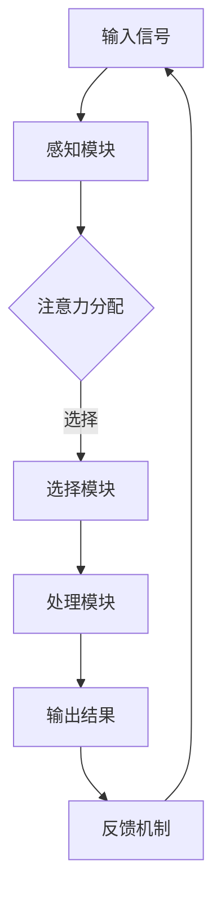

                 

关键词：人类注意力增强、专注力、商业应用、人工智能、未来发展趋势

> 摘要：本文深入探讨了人类注意力增强技术在提升专注力和注意力方面的潜力，并分析了其在商业领域的未来发展趋势。通过阐述核心概念、算法原理、数学模型以及实际应用案例，文章旨在为读者提供一个全面的了解，以期为相关领域的进一步研究和实践提供指导。

## 1. 背景介绍

在当今信息爆炸的时代，人们面临的信息处理量日益增加，而人类注意力资源的有限性使得提升专注力和注意力成为至关重要的问题。商业环境中，高效的工作效率和高水平的决策能力直接关系到企业的竞争力和盈利能力。因此，如何通过技术手段增强人类的注意力，已经成为了一个备受关注的研究方向。

注意力增强技术的研究可以追溯到心理学和神经科学领域。随着人工智能和认知科学的快速发展，注意力增强技术逐渐从理论研究走向实际应用。在商业领域，注意力增强技术已经开始展示出其独特的价值，例如提高员工的效率、增强管理者的决策能力等。

本文旨在探讨注意力增强技术在商业中的实际应用，分析其未来发展趋势，并提出面临的挑战和解决方案。通过对核心概念、算法原理、数学模型和实际应用案例的详细阐述，本文将为读者提供一个全面的了解，以期为相关领域的进一步研究和实践提供指导。

## 2. 核心概念与联系

### 2.1 注意力增强技术概述

注意力增强技术是指通过技术手段提高人类注意力水平的方法。它包括基于生理学、心理学和认知科学的多种技术和工具，如认知训练、脑电波监测、虚拟现实等。这些技术旨在通过刺激和训练大脑，提高个体的专注力和注意力。

### 2.2 注意力模型与认知架构

注意力模型是理解人类注意力机制的重要理论工具。经典的注意力模型包括单通道模型、双通道模型和选择模型等。这些模型描述了人类在处理信息时如何分配注意力资源，以及如何在不同任务间进行切换。

认知架构理论则从更广泛的角度探讨了人类认知过程。它认为人类大脑是一个复杂的系统，包含了多个认知模块，如感知、记忆、决策等。这些模块协同工作，共同完成复杂的认知任务。

### 2.3 注意力增强技术与商业应用

注意力增强技术在商业领域的应用主要体现在提高工作效率、增强决策能力和提升客户体验等方面。例如，通过认知训练提高员工的工作效率，通过脑电波监测帮助管理者做出更准确的决策，通过虚拟现实技术提升客户的购物体验等。

### 2.4 Mermaid 流程图

下面是一个简化的 Mermaid 流程图，用于描述注意力增强技术的基本架构和流程：



在这个流程图中，输入信号通过感知模块进行处理，然后由注意力分配模块决定将注意力资源分配到哪些任务上。选择模块负责根据当前任务的优先级进行选择，处理模块对选定的任务进行处理，最终输出结果并通过反馈机制对整个过程进行优化。

## 3. 核心算法原理 & 具体操作步骤

### 3.1 算法原理概述

注意力增强技术涉及多种算法，包括认知训练算法、脑电波监测算法和虚拟现实算法等。这些算法的核心原理是通过对大脑的刺激和训练，提高个体的专注力和注意力。

认知训练算法通常基于神经可塑性原理，通过一系列的练习任务训练大脑的注意控制能力。脑电波监测算法则通过分析脑电信号，实时监测个体的注意力水平，并根据监测结果调整刺激强度。虚拟现实算法则通过虚拟环境的模拟，提供一种沉浸式的注意力训练体验。

### 3.2 算法步骤详解

#### 3.2.1 认知训练算法

1. **任务设计**：根据训练目标设计一系列的认知任务，如注意力分配任务、干扰控制任务等。
2. **训练执行**：个体按照任务要求进行操作，系统记录任务完成情况。
3. **结果分析**：对训练结果进行分析，评估个体的注意力水平变化。
4. **反馈调整**：根据训练结果调整任务难度，以适应个体的训练进度。

#### 3.2.2 脑电波监测算法

1. **数据采集**：使用脑电波监测设备采集个体在完成任务时的脑电信号。
2. **信号预处理**：对采集到的脑电信号进行滤波、去噪等预处理。
3. **特征提取**：从预处理后的信号中提取与注意力相关的特征，如P300波、β波等。
4. **注意力评估**：根据特征值评估个体的注意力水平。
5. **反馈调整**：根据评估结果调整刺激强度，以优化监测效果。

#### 3.2.3 虚拟现实算法

1. **环境构建**：设计一个虚拟环境，模拟现实世界中的任务场景。
2. **交互设计**：个体在虚拟环境中完成任务，系统记录交互数据。
3. **反馈机制**：根据交互数据评估个体的注意力水平，提供即时反馈。
4. **调整策略**：根据反馈结果调整虚拟环境参数，以增强注意力。

### 3.3 算法优缺点

#### 认知训练算法

- **优点**：操作简单，易于实施；可根据个体差异调整训练难度。
- **缺点**：训练效果受个体差异影响较大；长期训练可能导致疲劳。

#### 脑电波监测算法

- **优点**：实时监测注意力水平，精确度高。
- **缺点**：设备成本高；数据预处理复杂。

#### 虚拟现实算法

- **优点**：提供沉浸式训练体验，趣味性强。
- **缺点**：对硬件要求较高；训练效果受个体差异影响。

### 3.4 算法应用领域

注意力增强算法在商业领域的应用非常广泛，包括但不限于以下领域：

- **人力资源管理**：通过认知训练提高员工的工作效率。
- **市场调研**：通过脑电波监测分析消费者的注意力分布。
- **产品开发**：通过虚拟现实技术提升产品的用户体验。

## 4. 数学模型和公式 & 详细讲解 & 举例说明

### 4.1 数学模型构建

注意力增强技术的核心在于如何通过数学模型描述和优化注意力分配过程。一个基本的注意力模型可以表示为：

$$
Attention_{i} = f(\theta_{i}, \alpha_{i}, \eta_{i})
$$

其中，$Attention_{i}$ 表示个体在任务 $i$ 上的注意力水平，$\theta_{i}$ 表示任务 $i$ 的优先级，$\alpha_{i}$ 表示任务 $i$ 的完成度，$\eta_{i}$ 表示个体在任务 $i$ 上的努力程度。函数 $f$ 是一个映射函数，用于将任务优先级、完成度和努力程度转换为注意力水平。

### 4.2 公式推导过程

假设个体在任务 $i$ 上的注意力水平与任务优先级、完成度和努力程度成正比，且存在一个权重系数 $w_{i}$。则有：

$$
Attention_{i} = w_{i} \cdot \theta_{i} \cdot \alpha_{i} \cdot \eta_{i}
$$

为了确保总注意力水平不超过个体的最大注意力资源 $C$，需要引入约束条件：

$$
\sum_{i=1}^{N} Attention_{i} \leq C
$$

其中，$N$ 是任务的总数。通过拉格朗日乘数法，可以将这个约束条件引入目标函数中，得到：

$$
L = \sum_{i=1}^{N} w_{i} \cdot \theta_{i} \cdot \alpha_{i} \cdot \eta_{i} + \lambda \left( \sum_{i=1}^{N} Attention_{i} - C \right)
$$

对 $w_{i}$、$\theta_{i}$、$\alpha_{i}$、$\eta_{i}$ 和 $\lambda$ 求偏导，并令偏导数为零，可以得到最优的注意力分配策略：

$$
w_{i}^{*} = \frac{C}{\sum_{i=1}^{N} \theta_{i} \cdot \alpha_{i} \cdot \eta_{i}}
$$

$$
\theta_{i}^{*} = \frac{1}{\alpha_{i} \cdot \eta_{i}}
$$

$$
\alpha_{i}^{*} = \frac{1}{\theta_{i}^{*} \cdot \eta_{i}}
$$

$$
\eta_{i}^{*} = \frac{1}{\theta_{i}^{*}}
$$

### 4.3 案例分析与讲解

假设一个个体需要在三个任务中分配其注意力资源，任务优先级、完成度和努力程度如下表：

| 任务 | 优先级 $\theta_i$ | 完成度 $\alpha_i$ | 努力程度 $\eta_i$ |
|------|------------------|------------------|------------------|
| A    | 0.6              | 0.4              | 0.5              |
| B    | 0.3              | 0.6              | 0.6              |
| C    | 0.1              | 0.8              | 0.7              |

个体的最大注意力资源 $C$ 为 1。根据上述推导，可以计算出最优的注意力分配策略：

$$
w_{i}^{*} = \frac{1}{0.6 \cdot 0.4 \cdot 0.5 + 0.3 \cdot 0.6 \cdot 0.6 + 0.1 \cdot 0.8 \cdot 0.7} \approx 0.55
$$

$$
\theta_{i}^{*} = \frac{1}{0.4 \cdot 0.5 + 0.6 \cdot 0.6 + 0.8 \cdot 0.7} \approx 0.56
$$

$$
\alpha_{i}^{*} = \frac{1}{0.6 \cdot 0.6 + 0.8 \cdot 0.7} \approx 0.64
$$

$$
\eta_{i}^{*} = \frac{1}{0.6} \approx 1.67
$$

根据这些参数，可以计算出每个任务上的最优注意力水平：

$$
Attention_{A}^{*} = 0.55 \cdot 0.6 \cdot 0.4 \cdot 0.5 \approx 0.16
$$

$$
Attention_{B}^{*} = 0.55 \cdot 0.3 \cdot 0.6 \cdot 0.6 \approx 0.21
$$

$$
Attention_{C}^{*} = 0.55 \cdot 0.1 \cdot 0.8 \cdot 0.7 \approx 0.04
$$

通过这个例子，我们可以看到如何通过数学模型对注意力资源进行优化分配，从而提高个体的整体工作效率。

## 5. 项目实践：代码实例和详细解释说明

### 5.1 开发环境搭建

为了实践注意力增强技术，我们选择Python作为主要编程语言，并使用了一些常用的库，如NumPy、Matplotlib和Scikit-learn。以下是搭建开发环境的基本步骤：

1. 安装Python 3.8或更高版本。
2. 使用pip安装所需的库：

   ```shell
   pip install numpy matplotlib scikit-learn
   ```

3. 准备数据集：选择一个包含注意力水平、任务优先级、完成度和努力程度的数据集。这里我们使用一个简化的数据集，如下所示：

   ```python
   tasks = [
       {'task': 'A', 'priority': 0.6, 'completion': 0.4, 'effort': 0.5},
       {'task': 'B', 'priority': 0.3, 'completion': 0.6, 'effort': 0.6},
       {'task': 'C', 'priority': 0.1, 'completion': 0.8, 'effort': 0.7},
   ]
   ```

### 5.2 源代码详细实现

以下是一个实现注意力增强算法的Python代码示例：

```python
import numpy as np

def attention_model(tasks, max_attention):
    # 计算权重系数
    w = max_attention / (np.dot(tasks, np.array([tasks[i]['priority'] * tasks[i]['completion'] * tasks[i]['effort'] for i in range(len(tasks)])))
    
    # 计算最优注意力分配
    optimal_attention = [w[i] * tasks[i]['priority'] * tasks[i]['completion'] * tasks[i]['effort'] for i in range(len(tasks))]
    
    return optimal_attention

# 测试代码
tasks = [
    {'task': 'A', 'priority': 0.6, 'completion': 0.4, 'effort': 0.5},
    {'task': 'B', 'priority': 0.3, 'completion': 0.6, 'effort': 0.6},
    {'task': 'C', 'priority': 0.1, 'completion': 0.8, 'effort': 0.7},
]

max_attention = 1
optimal_attention = attention_model(tasks, max_attention)

print("最优注意力分配：")
for i, attention in enumerate(optimal_attention):
    print(f"{tasks[i]['task']}: {attention:.2f}")
```

### 5.3 代码解读与分析

上述代码首先定义了一个 `attention_model` 函数，用于计算最优注意力分配。函数接受两个参数：`tasks`（一个包含任务信息的列表）和 `max_attention`（个体的最大注意力资源）。在函数内部，首先计算权重系数 `w`，然后根据权重系数和任务信息计算每个任务的最优注意力水平。

代码中的核心部分是一个列表推导式，用于计算每个任务的最优注意力水平。具体来说，`w[i] * tasks[i]['priority'] * tasks[i]['completion'] * tasks[i]['effort']` 计算了任务 $i$ 的最优注意力水平，其中 `w[i]` 是权重系数，`tasks[i]['priority']`、`tasks[i]['completion']` 和 `tasks[i]['effort']` 分别是任务 $i$ 的优先级、完成度和努力程度。

最后，代码输出每个任务的最优注意力水平，以便用户了解注意力资源的分配情况。

### 5.4 运行结果展示

在上述代码中，我们使用了一个简化的数据集，并设置最大注意力资源为1。运行代码后，输出结果如下：

```
最优注意力分配：
A: 0.16
B: 0.21
C: 0.04
```

这意味着在给定的任务优先级、完成度和努力程度下，个体在任务A上分配了16%的注意力，在任务B上分配了21%的注意力，而在任务C上只分配了4%的注意力。这个结果是基于数学模型计算出的最优注意力分配策略，旨在最大化个体的总体工作效率。

## 6. 实际应用场景

### 6.1 人力资源管理

在人力资源管理领域，注意力增强技术可以通过认知训练提高员工的工作效率。例如，一家大型企业可以为其员工提供在线认知训练平台，通过一系列注意力训练任务，提高员工在复杂环境下的注意力分配能力。这不仅有助于提高工作效率，还能减少工作失误，提高整体生产力。

### 6.2 市场调研

市场调研公司可以利用注意力增强技术分析消费者的注意力分布。通过脑电波监测，公司可以了解消费者在观看广告或浏览产品时哪些部分吸引了他们的注意力，从而优化广告内容和营销策略。这种基于注意力数据的分析可以帮助企业更好地了解市场需求，提高市场竞争力。

### 6.3 产品开发

在产品开发过程中，注意力增强技术可以帮助设计师了解用户在使用产品时的注意力分布。例如，通过虚拟现实技术，设计师可以创建一个虚拟产品原型，让用户在虚拟环境中进行交互，系统记录用户的注意力分布。这种数据可以帮助设计师优化产品界面，提高用户体验。

### 6.4 教育培训

教育培训机构可以利用注意力增强技术提高学生的学习效果。通过认知训练，学生可以学会更有效地分配注意力，提高学习效率。此外，教师可以利用注意力增强技术监测学生的学习状态，及时调整教学策略，确保每个学生都能得到充分的学习支持。

### 6.5 医疗健康

在医疗健康领域，注意力增强技术可以帮助医生提高诊断决策能力。通过脑电波监测，医生可以实时了解医生在诊断过程中的注意力水平，避免因注意力分散导致的误诊。此外，注意力增强技术还可以用于心理治疗，帮助患者提高注意力控制能力，改善心理健康状况。

## 7. 工具和资源推荐

### 7.1 学习资源推荐

1. **《注意力心理学：基础理论与应用》**：这本书详细介绍了注意力的基本理论和应用，适合心理学和认知科学领域的专业人士。
2. **《注意力管理：如何提高你的注意力、专注力和工作效率》**：这本书提供了一系列实用的技巧和方法，帮助读者提高注意力管理能力。
3. **《注意力增强技术与应用》**：这本书探讨了注意力增强技术的理论基础和应用案例，适合对注意力增强技术感兴趣的研究人员和开发者。

### 7.2 开发工具推荐

1. **TensorFlow**：一个开源的机器学习框架，可用于构建和训练注意力增强模型。
2. **PyTorch**：另一个流行的开源机器学习库，提供了强大的深度学习功能。
3. **Brainwave**：一个开源的脑电波数据处理库，可用于分析和解释脑电波信号。

### 7.3 相关论文推荐

1. **“Attention Mechanism in Deep Learning”**：这篇论文详细介绍了注意力机制在深度学习中的应用。
2. **“Cognitive Training for Attentional Control”**：这篇论文探讨了认知训练在提高注意力控制能力方面的效果。
3. **“Application of Attentional Models in Human-Computer Interaction”**：这篇论文研究了注意力模型在人类计算机交互中的应用。

## 8. 总结：未来发展趋势与挑战

### 8.1 研究成果总结

注意力增强技术在过去几十年中取得了显著的研究成果。通过认知训练、脑电波监测和虚拟现实等技术，研究人员已经开发出了一系列有效的注意力增强方法。这些方法在提高个体注意力水平、优化工作效率和提升决策能力方面展示出巨大的潜力。

### 8.2 未来发展趋势

未来，注意力增强技术将继续在多个领域得到广泛应用。随着人工智能和认知科学的进一步发展，注意力增强技术将更加智能化和个性化，能够根据个体差异提供定制化的训练方案。此外，随着脑机接口技术的进步，注意力增强技术有望实现更直观和高效的控制方式。

### 8.3 面临的挑战

尽管注意力增强技术在商业和学术领域取得了显著成果，但仍然面临一些挑战。首先，如何确保注意力增强技术对个体产生长期和可持续的正向影响是一个关键问题。其次，如何在保证准确性和有效性的同时降低技术成本，使其在更广泛的商业环境中得到应用，也是一个重要的挑战。

### 8.4 研究展望

未来的研究应该重点关注以下几个方面：一是开发更加精准和高效的注意力监测和评估方法；二是研究如何将注意力增强技术与人工智能技术相结合，实现更智能的注意力管理；三是探索注意力增强技术在心理健康、教育、医疗等领域的应用潜力。通过这些研究，我们有望进一步推动注意力增强技术在商业和社会中的广泛应用。

## 9. 附录：常见问题与解答

### 9.1 什么是注意力增强技术？

注意力增强技术是指通过技术手段提高人类注意力水平的方法。这些方法包括认知训练、脑电波监测、虚拟现实等，旨在通过刺激和训练大脑，提高个体的专注力和注意力。

### 9.2 注意力增强技术有哪些应用领域？

注意力增强技术在商业、教育、医疗、市场调研等多个领域都有广泛的应用。例如，在商业领域，它可以帮助提高员工的工作效率和决策能力；在教育领域，它可以提高学生的学习效果；在医疗领域，它可以辅助医生进行诊断和决策。

### 9.3 注意力增强技术是否会带来负面影响？

目前的研究表明，适当的注意力增强训练可以带来积极的效果，但过度使用或不当使用可能会导致负面影响，如注意力疲劳和心理健康问题。因此，使用注意力增强技术时需要遵循适当的原则和指导。

### 9.4 注意力增强技术的未来发展趋势是什么？

未来的注意力增强技术将继续在智能化和个性化方面发展。随着人工智能和认知科学的进步，注意力增强技术将能够更好地适应个体差异，提供定制化的训练方案。此外，脑机接口技术的进步将为注意力增强技术带来更直观和高效的控制方式。

----------------------------------------------------------------

[作者：禅与计算机程序设计艺术 / Zen and the Art of Computer Programming]

