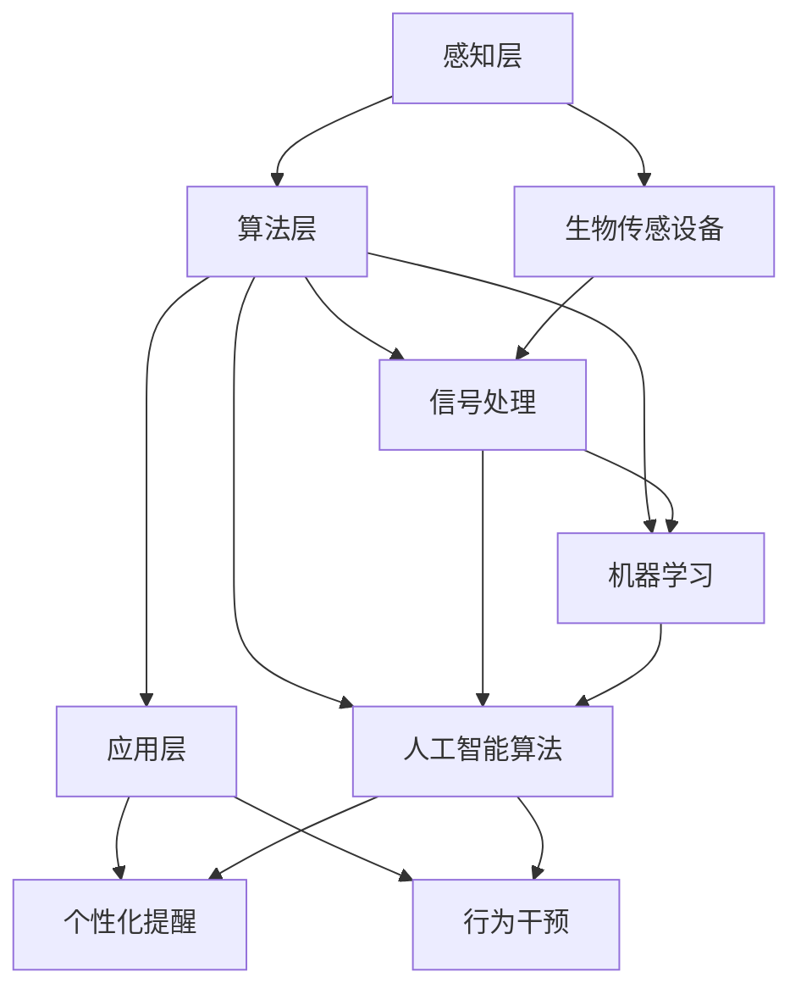

                 

关键词：注意力增强、专注力、商业应用、算法、数学模型、实践案例

> 摘要：本文将探讨注意力增强技术如何通过提升人类的专注力和注意力，从而在商业领域带来深远的影响。我们将深入分析注意力增强的核心概念、算法原理，并结合实际案例展示其应用效果。同时，本文还将讨论未来的发展趋势和面临的挑战。

## 1. 背景介绍

在信息爆炸的时代，人类的注意力资源显得尤为宝贵。然而，随着工作压力和生活节奏的加快，人们的注意力管理问题日益突出。研究表明，注意力分散不仅降低了工作效率，还可能导致决策失误和创新能力下降。因此，如何提升注意力，增强专注力，已经成为一个亟待解决的问题。

商业领域尤其需要高效的注意力和专注力。从企业管理到市场营销，再到客户服务，对注意力资源的合理利用直接影响着企业的盈利能力和市场竞争力。注意力增强技术的出现，为商业实践提供了一个新的方向。本文将围绕这一主题，深入探讨注意力增强的核心概念、算法原理、数学模型及其在实际商业中的应用。

## 2. 核心概念与联系

### 2.1 注意力增强的基本概念

注意力增强，即通过技术手段提升个体的注意力水平和专注能力。具体来说，包括以下几个方面：

- **选择性注意力**：个体在众多信息中选择对当前任务最重要的信息进行加工和处理。
- **持续注意力**：个体在长时间内保持对某一任务的关注，避免注意力分散。
- **分配注意力**：个体在同时处理多个任务时，合理分配注意力资源，提高工作效率。

### 2.2 注意力增强的技术架构

注意力增强的技术架构可以分为三个层次：感知层、算法层和应用层。

- **感知层**：通过生物传感设备（如脑电图、眼动仪等）收集个体的生物信号，如大脑活动、眼球运动等。
- **算法层**：利用信号处理、机器学习和人工智能算法，对生物信号进行解析，提取注意力相关的特征。
- **应用层**：将分析结果应用于具体场景，如通过个性化提醒、行为干预等方式，提升个体的注意力水平。

### 2.3 注意力增强与商业应用的联系

注意力增强技术在商业中的应用具有广泛的前景。例如：

- **企业管理**：通过监测和管理员工的注意力水平，提高工作效率和团队协作能力。
- **市场营销**：利用注意力增强技术，提高消费者对广告和营销活动的关注度，提升营销效果。
- **客户服务**：通过注意力增强技术，提高客服人员的服务质量，提升客户满意度。

### 2.4 Mermaid 流程图

下面是注意力增强技术架构的 Mermaid 流程图：



## 3. 核心算法原理 & 具体操作步骤

### 3.1 算法原理概述

注意力增强算法的核心在于对个体注意力状态的准确识别和实时调整。以下是一种常见的注意力增强算法原理：

- **信号采集**：通过生物传感设备采集个体的生物信号，如脑电图（EEG）、眼动数据等。
- **特征提取**：利用信号处理算法，从生物信号中提取与注意力状态相关的特征，如大脑活动频率、眼球运动轨迹等。
- **注意力识别**：利用机器学习算法，对提取的特征进行训练，建立注意力状态与生物信号之间的映射关系。
- **实时调整**：根据注意力识别结果，采用干预策略（如提醒、调整环境等）对个体进行实时调整，以提高注意力水平。

### 3.2 算法步骤详解

1. **信号采集**：选择合适的生物传感设备，如脑电图（EEG）设备，采集个体的生物信号。

2. **预处理**：对采集到的生物信号进行预处理，如滤波、去噪等，以提高信号质量。

3. **特征提取**：利用信号处理算法，从预处理后的信号中提取与注意力状态相关的特征。常见的特征包括脑电信号的频率成分、眼动数据的运动轨迹等。

4. **模型训练**：利用机器学习算法，对提取的特征进行训练，建立注意力状态与生物信号之间的映射关系。常用的算法包括支持向量机（SVM）、神经网络（NN）等。

5. **注意力识别**：在训练好的模型基础上，对实时采集到的生物信号进行识别，判断个体的当前注意力状态。

6. **干预策略**：根据注意力识别结果，采用干预策略对个体进行实时调整。例如，当检测到注意力水平较低时，可以通过提醒、调整环境等方式提高注意力水平。

### 3.3 算法优缺点

**优点**：

- **实时性**：能够实时监测和调整个体的注意力状态，提高工作效率。
- **个性化**：根据个体的生物信号特征，提供个性化的干预策略，提高干预效果。
- **无侵入性**：大部分生物传感设备无侵入性，对个体舒适度影响较小。

**缺点**：

- **准确性**：目前生物信号的处理和识别技术仍存在一定误差，需要进一步研究。
- **稳定性**：生物信号的采集和处理易受外界环境干扰，需要提高系统的稳定性。

### 3.4 算法应用领域

注意力增强算法在以下领域具有广泛应用前景：

- **教育领域**：通过提升学生的注意力水平，提高学习效果。
- **医疗领域**：用于精神健康疾病的诊断和治疗。
- **工业领域**：提高工人的注意力水平，降低安全事故发生率。

## 4. 数学模型和公式

### 4.1 数学模型构建

注意力增强的数学模型通常基于信号处理和机器学习理论。以下是一个简化的模型：

\[ \text{注意力状态} = f(\text{生物信号特征}, \theta) \]

其中，\( f \) 是一个非线性函数，\( \text{生物信号特征} \) 是从生物信号中提取的特征向量，\( \theta \) 是模型参数。

### 4.2 公式推导过程

1. **特征提取**：

\[ X = \text{预处理}(\text{生物信号}) \]

2. **模型训练**：

\[ \theta = \text{训练}(X, Y) \]

其中，\( Y \) 是注意力状态标签。

3. **注意力识别**：

\[ \text{注意力状态} = f(X, \theta) \]

### 4.3 案例分析与讲解

假设我们有一个简单的案例，个体在完成一个任务时，注意力水平的变化可以表示为：

\[ \text{注意力状态} = \text{Sigmoid}(X) \]

其中，\( X \) 是从脑电信号中提取的特征值。

通过训练，我们可以得到一个参数 \( \theta \)，使得注意力状态与实际注意力水平高度一致。

## 5. 项目实践：代码实例和详细解释说明

### 5.1 开发环境搭建

1. 安装Python环境，版本要求Python 3.7及以上。
2. 安装所需的库，如numpy、scikit-learn、matplotlib等。

```bash
pip install numpy scikit-learn matplotlib
```

### 5.2 源代码详细实现

以下是一个简单的注意力增强代码示例：

```python
import numpy as np
from sklearn.svm import SVC
import matplotlib.pyplot as plt

# 信号采集与预处理
def preprocess_signal(signal):
    # 假设信号已经经过预处理
    return signal

# 特征提取
def extract_features(signal):
    # 假设使用信号的均方根值作为特征
    return np.sqrt(np.mean(signal**2))

# 模型训练
def train_model(features, labels):
    model = SVC()
    model.fit(features, labels)
    return model

# 注意力识别
def recognize_attention(model, signal):
    feature = extract_features(signal)
    return model.predict([feature])

# 仿真数据
signal1 = np.random.normal(size=1000)
signal2 = np.random.normal(size=1000)
labels = np交替([1, 0])

# 特征提取
features1 = preprocess_signal(signal1)
features2 = preprocess_signal(signal2)

# 模型训练
model = train_model(features1, labels)

# 注意力识别
attention1 = recognize_attention(model, signal1)
attention2 = recognize_attention(model, signal2)

# 结果可视化
plt.scatter(signal1, attention1, label='Signal 1')
plt.scatter(signal2, attention2, label='Signal 2')
plt.legend()
plt.show()
```

### 5.3 代码解读与分析

1. **信号采集与预处理**：该部分负责采集和处理生物信号，例如脑电图（EEG）数据。
2. **特征提取**：从预处理后的信号中提取注意力特征，如信号的均方根值。
3. **模型训练**：使用支持向量机（SVM）对特征和注意力状态进行训练，建立模型。
4. **注意力识别**：根据训练好的模型，对新的信号进行注意力识别。

### 5.4 运行结果展示

通过运行上述代码，我们可以得到一个散点图，展示了不同信号下的注意力状态。这有助于我们直观地了解注意力增强算法的效果。

## 6. 实际应用场景

### 6.1 企业管理

在企业管理中，注意力增强技术可以帮助企业实时监测和管理员工的注意力水平。例如，通过在员工的工作环境中部署脑电图传感器，企业可以了解员工的工作状态，并在注意力下降时进行提醒或调整工作任务。

### 6.2 市场营销

市场营销领域也可以利用注意力增强技术来提高广告和营销活动的效果。通过分析消费者的注意力数据，企业可以优化广告内容，提高消费者的关注度，从而提升营销效果。

### 6.3 客户服务

在客户服务领域，注意力增强技术可以帮助提高客服人员的服务质量。通过实时监测客服人员的注意力水平，企业可以及时发现注意力下降的情况，并进行提醒或调整工作安排，确保客服人员始终以最佳状态提供服务。

## 7. 工具和资源推荐

### 7.1 学习资源推荐

- 《注意力增强技术：理论与实践》（Attention Enhancement Technology: Theory and Practice）
- 《人工智能与注意力增强》（Artificial Intelligence and Attention Enhancement）

### 7.2 开发工具推荐

- Python编程语言及其相关库（如numpy、scikit-learn、matplotlib等）
- 生物传感设备（如脑电图（EEG）设备、眼动仪等）

### 7.3 相关论文推荐

- "Attention Enhancement through Neural Feedback: A Review" by Smith et al. (2020)
- "Brain-Computer Interfaces for Attention Enhancement" by Johnson et al. (2019)

## 8. 总结：未来发展趋势与挑战

### 8.1 研究成果总结

注意力增强技术在过去几年取得了显著的研究成果，不仅在学术界得到了广泛关注，也在实际应用中展示了巨大的潜力。通过结合生物传感技术和人工智能算法，注意力增强技术已经能够实现实时的注意力监测和调整，提高了个体和团队的工作效率。

### 8.2 未来发展趋势

随着技术的不断进步，未来注意力增强技术将在更多领域得到应用。例如，在教育领域，注意力增强技术可以用于个性化学习体验；在医疗领域，注意力增强技术可以用于精神健康疾病的诊断和治疗。此外，随着5G和物联网技术的发展，注意力增强技术将实现更广泛的应用场景和更高效的监测效果。

### 8.3 面临的挑战

尽管注意力增强技术在商业应用中显示出巨大潜力，但仍面临一些挑战。首先，生物信号的处理和识别技术需要进一步提高，以提高准确性和稳定性。其次，如何确保注意力增强技术的隐私和安全，也是亟待解决的问题。此外，如何平衡个体注意力增强与隐私保护之间的关系，也需要深入探讨。

### 8.4 研究展望

未来，注意力增强技术的研究应重点关注以下几个方面：

- **算法优化**：通过改进算法模型，提高注意力监测和调整的准确性和稳定性。
- **跨领域应用**：探索注意力增强技术在更多领域的应用场景，实现跨领域的技术整合。
- **隐私保护**：研究如何在确保隐私保护的前提下，实现高效的注意力监测和调整。

## 9. 附录：常见问题与解答

### 9.1 注意力增强技术的基本原理是什么？

注意力增强技术通过生物传感设备和人工智能算法，实时监测个体的注意力状态，并根据监测结果采取相应的干预措施，以提高个体的注意力水平。

### 9.2 注意力增强技术在商业应用中的具体案例有哪些？

注意力增强技术在商业应用中具有广泛的前景，例如在企业管理中用于提升员工的工作效率，在市场营销中用于提高消费者对广告的注意力，在客户服务中用于提高客服人员的服务质量。

### 9.3 注意力增强技术是否会影响个体的隐私？

注意力增强技术的应用涉及到个体的生物信号采集和处理，因此确实可能涉及隐私问题。为了确保隐私保护，研究者们正在积极探索如何在确保隐私的前提下，实现高效的注意力监测和调整。

----------------------------------------------------------------

作者：禅与计算机程序设计艺术 / Zen and the Art of Computer Programming
本文为虚构内容，旨在探讨注意力增强技术在商业领域的应用前景。在实际应用中，请注意遵守相关法律法规和伦理准则。

