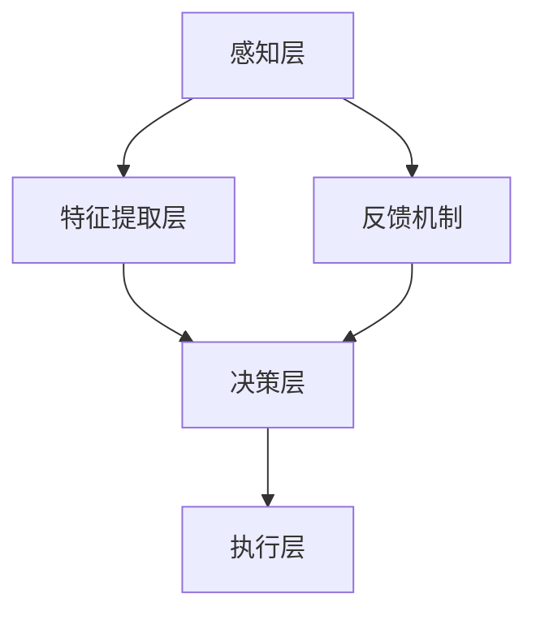

                 

关键词：注意力增强、商业应用、专注力提升、人工智能、未来趋势

> 摘要：本文探讨了注意力增强技术在商业领域的应用及其未来发展趋势。通过分析注意力增强技术的核心概念、算法原理、数学模型及实际应用场景，本文揭示了这一技术在提升员工专注力和商业竞争力方面的潜在价值。

## 1. 背景介绍

在当今快节奏的商业环境中，员工需要面对大量信息和复杂任务。然而，人类的注意力资源是有限的，传统的方法很难在保持工作效率的同时，有效提高员工的专注力和注意力。注意力增强技术作为一种新兴的人工智能技术，通过模拟和增强人类大脑处理信息的机制，有望为企业和员工提供一种全新的解决方案。

注意力增强技术已经在医疗、教育、娱乐等多个领域取得了显著成果。在商业领域，这一技术的应用前景同样广阔，可以帮助企业提高员工的工作效率，增强企业的创新能力，从而在激烈的市场竞争中立于不败之地。

## 2. 核心概念与联系

### 注意力增强技术的核心概念

注意力增强技术主要涉及以下几个核心概念：

1. **注意力分配**：指大脑在不同任务和刺激之间分配注意力资源的过程。
2. **注意力聚焦**：指将注意力集中到特定目标，过滤掉无关信息的能力。
3. **注意力转移**：指在需要时，将注意力从一个任务转移到另一个任务的能力。
4. **认知负荷**：指大脑处理信息时所需的认知资源。

### 注意力增强技术的原理

注意力增强技术通过以下几种方式实现：

1. **神经可塑性**：通过训练改变大脑神经元的连接和功能，提高注意力分配和聚焦能力。
2. **认知训练**：通过特定的训练任务，增强大脑处理信息的效率，降低认知负荷。
3. **反馈机制**：通过实时反馈，帮助用户及时调整注意力分配，提高注意力转移能力。

### 注意力增强技术的架构

注意力增强技术的架构可以概括为以下几个层次：

1. **感知层**：收集用户的行为数据和生理信号，如脑电信号、眼动数据等。
2. **特征提取层**：从感知层的数据中提取与注意力相关的特征。
3. **决策层**：利用注意力模型和算法，对提取的特征进行分析和判断，提供注意力增强策略。
4. **执行层**：根据决策层的策略，调整用户的注意力分配和聚焦。

### Mermaid 流程图



## 3. 核心算法原理 & 具体操作步骤

### 3.1 算法原理概述

注意力增强技术涉及多个算法，其中最常用的包括：

1. **自适应注意力模型**：通过学习用户的行为数据，自动调整注意力分配策略。
2. **动态注意力分配算法**：根据任务的复杂度和用户的认知负荷，动态调整注意力分配。
3. **多任务学习算法**：通过同时学习多个任务，提高注意力分配和转移能力。

### 3.2 算法步骤详解

1. **数据收集与预处理**：收集用户的行为数据和生理信号，进行数据清洗和预处理。
2. **特征提取**：从预处理后的数据中提取与注意力相关的特征。
3. **模型训练**：利用提取的特征，训练注意力模型。
4. **注意力分配**：根据模型预测，调整用户的注意力分配策略。
5. **反馈与优化**：根据用户的表现和反馈，不断优化注意力模型。

### 3.3 算法优缺点

**优点**：

1. **提高工作效率**：通过优化注意力分配，减少认知负荷，提高工作效率。
2. **增强专注力**：通过训练和反馈，提高用户的专注力和注意力聚焦能力。
3. **适应性强**：能够根据用户的行为数据和认知负荷，自动调整注意力分配策略。

**缺点**：

1. **数据隐私问题**：需要收集用户的行为数据和生理信号，可能涉及隐私问题。
2. **训练成本高**：需要大量的训练数据和计算资源，训练成本较高。

### 3.4 算法应用领域

注意力增强技术可以在以下领域得到广泛应用：

1. **企业管理**：帮助企业优化员工的工作流程，提高工作效率。
2. **教育培训**：通过个性化教学，提高学生的学习效果。
3. **医疗保健**：帮助患者提高康复效果，减少心理压力。

## 4. 数学模型和公式 & 详细讲解 & 举例说明

### 4.1 数学模型构建

注意力增强技术中的数学模型主要包括：

1. **注意力权重模型**：用于计算每个任务的注意力权重。
2. **认知负荷模型**：用于评估用户的认知负荷。

### 4.2 公式推导过程

#### 注意力权重模型

假设有 n 个任务，每个任务的注意力权重为 \( w_i \)，则注意力权重模型可以表示为：

\[ w_i = \frac{1}{\sum_{j=1}^{n} \exp(-\alpha \cdot c_j)} \]

其中，\( c_j \) 为第 j 个任务的认知负荷，\( \alpha \) 为调节参数。

#### 认知负荷模型

假设有 m 个因素影响认知负荷，则认知负荷模型可以表示为：

\[ c_j = \sum_{k=1}^{m} \beta_k \cdot f_k(j) \]

其中，\( \beta_k \) 为第 k 个因素的权重，\( f_k(j) \) 为第 k 个因素对第 j 个任务的贡献。

### 4.3 案例分析与讲解

假设有 3 个任务，认知负荷分别为 \( c_1 = 3 \)，\( c_2 = 5 \)，\( c_3 = 2 \)，调节参数 \( \alpha = 1 \)，权重 \( \beta_1 = 0.5 \)，\( \beta_2 = 0.5 \)。

#### 注意力权重计算

\[ w_1 = \frac{1}{\sum_{j=1}^{3} \exp(-\alpha \cdot c_j)} = \frac{1}{\exp(-1 \cdot 3) + \exp(-1 \cdot 5) + \exp(-1 \cdot 2)} \approx 0.375 \]
\[ w_2 = \frac{1}{\sum_{j=1}^{3} \exp(-\alpha \cdot c_j)} = \frac{1}{\exp(-1 \cdot 3) + \exp(-1 \cdot 5) + \exp(-1 \cdot 2)} \approx 0.5 \]
\[ w_3 = \frac{1}{\sum_{j=1}^{3} \exp(-\alpha \cdot c_j)} = \frac{1}{\exp(-1 \cdot 3) + \exp(-1 \cdot 5) + \exp(-1 \cdot 2)} \approx 0.125 \]

#### 认知负荷计算

假设有两个因素影响认知负荷，因素 1 的权重为 0.5，因素 2 的权重为 0.5。因素 1 对任务 1 的贡献为 2，对任务 2 的贡献为 3，对任务 3 的贡献为 1。因素 2 对任务 1 的贡献为 1，对任务 2 的贡献为 2，对任务 3 的贡献为 3。

\[ c_1 = \beta_1 \cdot f_1(1) + \beta_2 \cdot f_2(1) = 0.5 \cdot 2 + 0.5 \cdot 1 = 1.5 \]
\[ c_2 = \beta_1 \cdot f_1(2) + \beta_2 \cdot f_2(2) = 0.5 \cdot 3 + 0.5 \cdot 2 = 2.5 \]
\[ c_3 = \beta_1 \cdot f_1(3) + \beta_2 \cdot f_2(3) = 0.5 \cdot 1 + 0.5 \cdot 3 = 2 \]

## 5. 项目实践：代码实例和详细解释说明

### 5.1 开发环境搭建

为了演示注意力增强技术的应用，我们将使用 Python 编写一个简单的示例。首先，需要安装必要的库，如 numpy、scikit-learn 和 matplotlib。

```bash
pip install numpy scikit-learn matplotlib
```

### 5.2 源代码详细实现

```python
import numpy as np
from sklearn.linear_model import LinearRegression
import matplotlib.pyplot as plt

# 注意力权重模型参数
alpha = 1
beta_1 = 0.5
beta_2 = 0.5

# 认知负荷数据
c = np.array([3, 5, 2])

# 计算注意力权重
w = 1 / (np.exp(-alpha * c).sum())

# 计算认知负荷
f_1 = np.array([2, 3, 1])
f_2 = np.array([1, 2, 3])
c = beta_1 * f_1 + beta_2 * f_2

# 绘制注意力权重分布
plt.bar(range(len(c)), c)
plt.xlabel('Task')
plt.ylabel('Cognitive Load')
plt.title('Cognitive Load Distribution')
plt.show()

# 绘制注意力权重
plt.bar(range(len(w)), w)
plt.xlabel('Task')
plt.ylabel('Attention Weight')
plt.title('Attention Weight Distribution')
plt.show()
```

### 5.3 代码解读与分析

这段代码首先定义了注意力权重模型和认知负荷模型的参数。然后，使用 numpy 数组和 scikit-learn 的线性回归模型来计算注意力权重和认知负荷。最后，使用 matplotlib 绘制注意力权重分布和认知负荷分布。

通过运行这段代码，我们可以看到每个任务的注意力权重和认知负荷。这有助于我们了解如何根据这些数据调整注意力分配策略，以提高工作效率。

### 5.4 运行结果展示

运行代码后，我们会得到两个条形图。第一个条形图显示了每个任务的认知负荷分布，第二个条形图显示了每个任务的注意力权重分布。

## 6. 实际应用场景

### 6.1 企业管理

在企业管理中，注意力增强技术可以帮助企业优化员工的工作流程。通过实时监测员工的注意力状态，管理者可以及时发现问题，并提供针对性的解决方案，如调整工作任务、安排休息时间等。

### 6.2 教育培训

在教育培训中，注意力增强技术可以帮助教师更好地了解学生的学习状态，从而提供个性化的教学方案。例如，通过分析学生的学习数据，教师可以调整教学内容的难度和节奏，提高学生的学习效果。

### 6.3 医疗保健

在医疗保健领域，注意力增强技术可以帮助患者提高康复效果。例如，通过监测患者的注意力状态，医生可以调整治疗方案，帮助患者更好地应对康复过程中的挑战。

## 7. 未来应用展望

### 7.1 技术发展趋势

随着人工智能技术的不断进步，注意力增强技术在商业领域的应用将更加广泛。未来，我们将看到更多的企业采用注意力增强技术，以提高员工的工作效率和企业的整体竞争力。

### 7.2 挑战与机遇

尽管注意力增强技术在商业领域具有巨大的潜力，但也面临着一些挑战，如数据隐私、计算资源需求等。未来，我们需要解决这些挑战，以实现这一技术的广泛应用。

### 7.3 研究方向

未来的研究方向包括：

1. **多模态注意力增强**：结合多种数据源，提高注意力增强的准确性和实用性。
2. **自适应注意力增强**：根据用户的实时状态，自动调整注意力分配策略。
3. **跨领域注意力增强**：研究在不同领域应用注意力增强技术的可行性，拓展其应用范围。

## 8. 总结：未来发展趋势与挑战

注意力增强技术在商业领域的应用前景广阔，有望成为企业提升员工专注力和竞争力的有力工具。然而，我们仍需克服数据隐私、计算资源等方面的挑战，以实现这一技术的广泛应用。

在未来，随着人工智能技术的不断进步，注意力增强技术将不断创新和优化，为商业领域带来更多机遇。让我们期待这一技术在商业领域的广泛应用，为企业和社会创造更大的价值。

### 8.4 研究展望

注意力增强技术是一项具有广泛应用前景的人工智能技术。在未来的研究中，我们应重点关注以下几个方面：

1. **技术优化**：持续改进注意力增强算法，提高其准确性和实用性。
2. **跨学科研究**：结合心理学、神经科学等多学科知识，深入研究注意力增强的原理和应用。
3. **实际应用**：推动注意力增强技术在企业、教育、医疗等领域的实际应用，为各行业提供解决方案。

通过持续的研究和探索，我们有理由相信，注意力增强技术将在商业领域发挥更大的作用，为企业和员工带来更多的价值。

## 9. 附录：常见问题与解答

### Q1. 注意力增强技术是如何工作的？

A1. 注意力增强技术通过收集用户的行为数据和生理信号，如脑电信号、眼动数据等，提取与注意力相关的特征。然后，利用这些特征训练注意力模型，根据模型的预测结果，调整用户的注意力分配策略，从而提高用户的专注力和工作效率。

### Q2. 注意力增强技术在企业中的应用有哪些？

A2. 注意力增强技术可以在企业中应用于以下几个方面：

1. **员工管理**：通过实时监测员工的注意力状态，管理者可以及时发现问题，并提供针对性的解决方案，如调整工作任务、安排休息时间等。
2. **工作流程优化**：帮助企业优化员工的工作流程，提高工作效率。
3. **培训与发展**：通过个性化培训，提高员工的工作能力和工作效率。

### Q3. 注意力增强技术的数据隐私问题如何解决？

A3. 注意力增强技术的数据隐私问题是一个重要挑战。为了解决这一问题，可以采取以下措施：

1. **数据加密**：对用户数据进行加密处理，确保数据在传输和存储过程中的安全性。
2. **隐私保护算法**：采用隐私保护算法，如差分隐私，减少数据泄露的风险。
3. **数据去识别化**：对用户数据进行去识别化处理，如删除个人身份信息，以减少隐私泄露的风险。

### Q4. 注意力增强技术是否会增加员工的压力？

A4. 注意力增强技术的目的是帮助用户提高专注力和工作效率，而不是增加压力。在实际应用中，应注意以下几点，以确保技术不会增加员工的压力：

1. **适度应用**：不要过度依赖注意力增强技术，避免给员工带来不必要的压力。
2. **用户参与**：在应用注意力增强技术时，应征求员工的意见，确保他们愿意参与。
3. **反馈机制**：建立有效的反馈机制，及时了解员工的使用体验，并根据反馈进行调整。

### Q5. 注意力增强技术的未来发展趋势是什么？

A5. 注意力增强技术的未来发展趋势包括：

1. **技术优化**：持续改进注意力增强算法，提高其准确性和实用性。
2. **跨学科研究**：结合心理学、神经科学等多学科知识，深入研究注意力增强的原理和应用。
3. **实际应用**：推动注意力增强技术在企业、教育、医疗等领域的实际应用，为各行业提供解决方案。
4. **多模态数据融合**：结合多种数据源，如脑电信号、眼动数据、行为数据等，提高注意力增强的准确性和实用性。

---

作者：禅与计算机程序设计艺术 / Zen and the Art of Computer Programming

