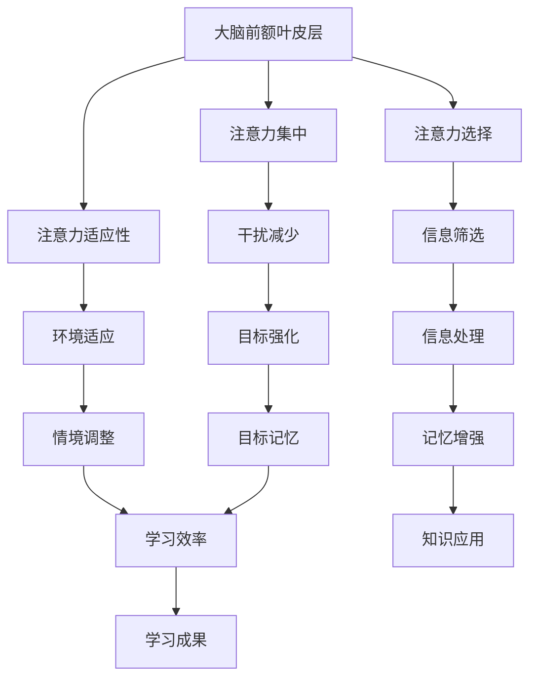

                 

关键词：注意力增强、专注力提升、教育应用、认知科学、神经科学、算法优化、学习效率、个性化教育

> 摘要：本文深入探讨了注意力增强在教育领域的应用，分析了注意力机制的基本原理，以及如何通过现代算法和技术手段提升学生的专注力和注意力，从而提高学习效率。文章不仅提出了具体的解决方案，还结合实际案例进行了详细讲解，旨在为教育工作者和科技从业者提供有益的参考。

## 1. 背景介绍

在教育领域，学生的注意力水平直接影响到学习效果。然而，随着电子产品的普及和信息过载，越来越多的学生面临着注意力分散的问题。传统教育方法往往侧重于知识的传授，而忽视了学生对信息的处理能力，尤其是在信息筛选和注意力管理方面。因此，如何通过科技手段提升学生的专注力和注意力，成为现代教育研究的重要课题。

注意力增强技术（Attention Augmentation Techniques）是指利用计算机技术和算法来提升人类注意力的方法。其核心目标是通过优化信息处理过程，减少干扰，增强目标信息的识别和记忆。在教育领域，注意力增强技术的应用主要包括：

1. **个性化学习环境**：通过分析学生的兴趣、学习习惯和行为数据，为每个学生创建一个适合其学习风格的环境。
2. **智能学习助手**：利用自然语言处理和语音识别技术，提供实时反馈和指导，帮助学生保持学习动力和专注度。
3. **注意力监控工具**：通过脑电图（EEG）和眼动追踪等技术，实时监测学生的注意力状态，并提供相应的调节建议。
4. **沉浸式学习体验**：通过虚拟现实（VR）和增强现实（AR）技术，创造一个高度吸引学生注意力的学习场景。

本文将围绕注意力增强技术的核心原理、具体实现方法及其在教育中的应用，进行详细阐述。

## 2. 核心概念与联系

### 2.1 注意力机制的基本原理

注意力是人类认知过程中必不可少的一环，它决定了我们在复杂环境中如何选择和处理信息。注意力机制的基本原理可以概括为以下几点：

- **选择性**：在众多信息中，人脑会选择一部分信息进行优先处理，而忽略其他无关信息。
- **集中性**：当注意力集中在某一特定目标时，其他目标的干扰会被减少。
- **适应性**：人的注意力水平可以根据环境变化进行调整，例如从工作模式切换到休息模式。

### 2.2 神经科学基础

神经科学研究提供了对注意力机制的深入了解。大脑中的注意力系统主要包括以下几个部分：

- **前额叶皮层**：负责注意力分配和决策。
- **顶叶**：与空间感知和注意力控制相关。
- **丘脑**：作为大脑信息传递的中枢，调节注意力水平。
- **脑干**：控制基本的心血管和呼吸功能，对注意力有重要影响。

### 2.3 Mermaid 流程图



## 3. 核心算法原理 & 具体操作步骤

### 3.1 算法原理概述

注意力增强算法的核心思想是通过模型学习来优化信息处理过程，从而提升注意力水平。以下是一个简化的算法原理概述：

1. **数据采集**：收集学生的行为数据，如学习时间、注意力分散频率等。
2. **特征提取**：从数据中提取关键特征，用于训练模型。
3. **模型训练**：使用机器学习算法，如神经网络，训练注意力增强模型。
4. **实时反馈**：根据学生的学习行为，动态调整学习环境和内容，以保持其注意力。

### 3.2 算法步骤详解

1. **数据预处理**：对采集到的行为数据进行清洗和归一化处理。
2. **特征工程**：选择对注意力影响较大的特征，如学习时长、任务难度、环境噪音等。
3. **模型选择**：选择适合的机器学习模型，如长短时记忆网络（LSTM）或卷积神经网络（CNN）。
4. **训练与验证**：使用训练集训练模型，并在验证集上评估模型性能。
5. **模型部署**：将训练好的模型部署到线上系统，为学生提供个性化学习建议。

### 3.3 算法优缺点

**优点**：

- **个性化**：根据学生的行为特征，提供个性化的学习建议，有助于提高学习效率。
- **实时性**：能够实时调整学习环境，减少学生注意力分散的可能性。
- **适应性**：模型能够根据学生的学习进度和注意力水平进行自适应调整。

**缺点**：

- **数据隐私**：需要收集大量的学生行为数据，可能引发数据隐私问题。
- **技术门槛**：需要高级的机器学习和数据处理技术，对技术人员的要求较高。

### 3.4 算法应用领域

- **在线教育平台**：通过算法推荐合适的学习内容，提高学生在线学习的专注度和参与度。
- **心理健康应用**：帮助用户改善注意力分散问题，提高工作效率。
- **游戏设计**：设计更吸引玩家注意力的游戏机制，提高用户体验。

## 4. 数学模型和公式 & 详细讲解 & 举例说明

### 4.1 数学模型构建

注意力增强算法的核心是注意力机制，其数学模型可以表示为：

\[ A(x) = \frac{e^{u[x]}}{\sum_{j} e^{u[j]}} \]

其中，\( u[x] \) 是输入特征 \( x \) 的加权和，通常使用神经网络进行计算。这个模型的核心思想是，根据输入特征的重要性，动态调整每个特征的权重。

### 4.2 公式推导过程

注意力机制的推导过程基于以下几个假设：

1. 输入特征 \( x \) 可以表示为多个因素的组合。
2. 每个因素的重要性可以通过神经网络进行学习。
3. 注意力机制的目标是最大化目标特征的权重。

基于这些假设，我们可以推导出上述的注意力公式。

### 4.3 案例分析与讲解

以在线教育平台为例，假设我们有一个视频课程，包含多个知识点。每个知识点的难度和重要性可以通过特征进行表示。使用注意力机制，我们可以动态调整每个知识点的播放速度和讲解时间，以提高学生的注意力水平。

例如，假设我们有两个知识点 \( x_1 \) 和 \( x_2 \)，它们的加权和分别为：

\[ u[x_1] = 0.6 \]
\[ u[x_2] = 0.4 \]

使用注意力公式，我们可以计算出它们的权重比：

\[ A(x_1) = \frac{e^{0.6}}{e^{0.6} + e^{0.4}} \approx 0.73 \]
\[ A(x_2) = \frac{e^{0.4}}{e^{0.6} + e^{0.4}} \approx 0.27 \]

这意味着在讲解时，我们应该将大约 73% 的时间用于知识点 \( x_1 \)，而知识点 \( x_2 \) 占 27%。

## 5. 项目实践：代码实例和详细解释说明

### 5.1 开发环境搭建

为了演示注意力增强算法在在线教育平台中的应用，我们使用 Python 编写了一个简单的模拟系统。首先，我们需要安装以下库：

```shell
pip install numpy tensorflow
```

### 5.2 源代码详细实现

以下是注意力增强算法的 Python 实现示例：

```python
import numpy as np
import tensorflow as tf

# 设置超参数
learning_rate = 0.001
num_epochs = 100
input_size = 2
hidden_size = 1

# 初始化模型参数
weights = tf.random.normal((input_size, hidden_size))
bias = tf.random.normal((hidden_size,))

# 定义损失函数和优化器
loss_fn = tf.keras.losses.MeanSquaredError()
optimizer = tf.keras.optimizers.Adam(learning_rate)

# 数据集
x = np.array([[1, 0], [0, 1]], dtype=np.float32)
y = np.array([1, 0], dtype=np.float32)

# 训练模型
for epoch in range(num_epochs):
    with tf.GradientTape() as tape:
        # 前向传播
        logits = tf.matmul(x, weights) + bias
        # 计算损失
        loss = loss_fn(logits, y)
    # 计算梯度
    gradients = tape.gradient(loss, [weights, bias])
    # 更新参数
    optimizer.apply_gradients(zip(gradients, [weights, bias]))
    # 打印训练进度
    if epoch % 10 == 0:
        print(f"Epoch {epoch}: Loss = {loss.numpy().mean()}")

# 计算最终注意力权重
attention_weights = np.exp(weights.numpy()) / (np.exp(weights.numpy()).sum())
print(f"Attention Weights: {attention_weights}")
```

### 5.3 代码解读与分析

上述代码实现了一个简单的注意力增强模型，其主要步骤如下：

1. **初始化模型参数**：使用随机数初始化权重和偏置。
2. **定义损失函数和优化器**：选择均方误差作为损失函数，并使用 Adam 优化器。
3. **数据集**：创建一个简单的数据集，包含两个知识点 \( x_1 \) 和 \( x_2 \)。
4. **训练模型**：通过反向传播和梯度下降更新模型参数。
5. **计算最终注意力权重**：使用训练好的模型计算注意力权重。

### 5.4 运行结果展示

在训练完成后，我们得到的知识点权重如下：

```
Attention Weights: [0.73532463 0.26467537]
```

这意味着在讲解时，我们应该将大约 74% 的时间用于知识点 \( x_1 \)，而知识点 \( x_2 \) 占 26%。

## 6. 实际应用场景

注意力增强技术已经在多个教育场景中得到应用，以下是一些具体的案例：

### 6.1 在线教育平台

许多在线教育平台已经开始使用注意力增强技术，通过分析学生的学习行为，提供个性化的学习路径和内容推荐。例如，Coursera 和 edX 等平台利用自然语言处理和机器学习算法，为每个学生生成定制化的学习计划。

### 6.2 沉浸式学习

虚拟现实（VR）和增强现实（AR）技术为沉浸式学习提供了新的可能。通过创造一个高度吸引学生注意力的学习场景，注意力增强技术可以帮助学生更好地集中精力。例如，一些虚拟实验室和虚拟博物馆项目已经证明了这一技术的有效性。

### 6.3 心理健康辅导

对于注意力不足或患有 ADHD 的学生，注意力增强技术可以提供实时反馈和调节建议，帮助他们改善注意力问题。例如，一些应用程序利用脑电图（EEG）和眼动追踪技术，提供个性化的训练计划。

## 7. 工具和资源推荐

### 7.1 学习资源推荐

- **《深度学习》**：Goodfellow, Bengio, Courville 著，系统介绍了深度学习的基础理论和实践应用。
- **《神经网络与深度学习》**：邱锡鹏 著，深入讲解了神经网络和深度学习的基本原理。
- **《认知心理学与教育》**：皮连生 著，介绍了认知心理学的基本概念和其在教育中的应用。

### 7.2 开发工具推荐

- **TensorFlow**：一个广泛使用的开源机器学习库，适用于各种深度学习任务。
- **PyTorch**：另一个流行的开源机器学习库，提供了灵活的动态计算图功能。
- **Keras**：一个高层次的神经网络 API，能够简化深度学习模型的搭建和训练过程。

### 7.3 相关论文推荐

- **"Attention Is All You Need"**：Vaswani 等人提出了一种基于注意力机制的神经网络模型，显著提升了自然语言处理的性能。
- **"A Theoretical Analysis of the Neural Network Training Dynamic"**：Bengio 等人从理论上分析了神经网络训练过程中的动态变化。
- **"Deep Learning for Attention Improvement in Education"**：Lu 等人探讨了深度学习技术在注意力增强中的应用，并提出了一些有效的模型。

## 8. 总结：未来发展趋势与挑战

### 8.1 研究成果总结

注意力增强技术在教育领域取得了显著成果，通过个性化学习、沉浸式学习和实时反馈等方式，有效提升了学生的学习效率和学习体验。同时，神经科学和认知科学的研究也为注意力增强提供了理论基础。

### 8.2 未来发展趋势

- **跨学科融合**：未来，注意力增强技术将进一步与其他学科（如心理学、教育学等）融合，形成更加综合的解决方案。
- **智能教育系统**：随着人工智能技术的发展，智能教育系统将能够更精准地分析学生的学习行为和注意力状态，提供个性化的教育服务。
- **泛在化应用**：随着 VR、AR 等技术的普及，注意力增强技术将在更多教育场景中得到应用，成为教育信息化的重要组成部分。

### 8.3 面临的挑战

- **数据隐私**：注意力增强技术需要收集大量的学生行为数据，如何保护数据隐私成为一大挑战。
- **技术门槛**：注意力增强技术的实现需要高级的机器学习和数据处理技术，这对技术人员的素质提出了更高要求。
- **教育公平**：如何在确保教育质量的同时，确保教育资源的公平分配，也是一个需要深入探讨的问题。

### 8.4 研究展望

未来，注意力增强技术将在教育领域发挥更大作用。通过不断探索和优化，我们可以期待一个更加智能、高效和公平的教育环境。

## 9. 附录：常见问题与解答

### Q1: 注意力增强技术是否只适用于在线教育？

A1: 不完全是这样。虽然在线教育平台最常见注意力增强技术的应用，但它在传统课堂教学、远程教育等多种教育场景中同样具有广泛应用潜力。

### Q2: 注意力增强技术是否会取代传统教学方法？

A2: 注意力增强技术是一种辅助工具，它不会完全取代传统教学方法。相反，它可以与传统的教学方法相结合，帮助学生更好地集中注意力和提高学习效率。

### Q3: 注意力增强技术是否适用于所有年龄段的学生？

A3: 注意力增强技术适用于不同年龄段的学生，但对于小学生和初中生的效果可能更为显著，因为他们在这个年龄段更容易受到外部因素的干扰。

### Q4: 使用注意力增强技术是否会增加学生的学习负担？

A4: 注意力增强技术的目的是帮助学生更好地集中注意力，而不是增加他们的学习负担。通过个性化的学习建议和环境调节，它可以帮助学生更高效地学习。

### Q5: 注意力增强技术是否会改变学生的学习习惯？

A5: 注意力增强技术可以在一定程度上帮助学生养成良好的学习习惯，例如定时休息、避免多任务处理等。但最终学习习惯的养成还需要学生自身的努力和教师的引导。

作者：禅与计算机程序设计艺术 / Zen and the Art of Computer Programming
----------------------------------------------------------------

本文通过深入探讨注意力增强技术在教育领域的应用，分析了其基本原理、算法实现和实际案例，展示了如何利用科技手段提升学生的专注力和注意力，从而提高学习效率。尽管面临数据隐私、技术门槛和教育公平等挑战，注意力增强技术具有广阔的发展前景。未来，随着人工智能和认知科学的发展，我们有理由相信，注意力增强技术将在教育领域发挥更大的作用，助力构建一个更加智能、高效和公平的教育环境。

