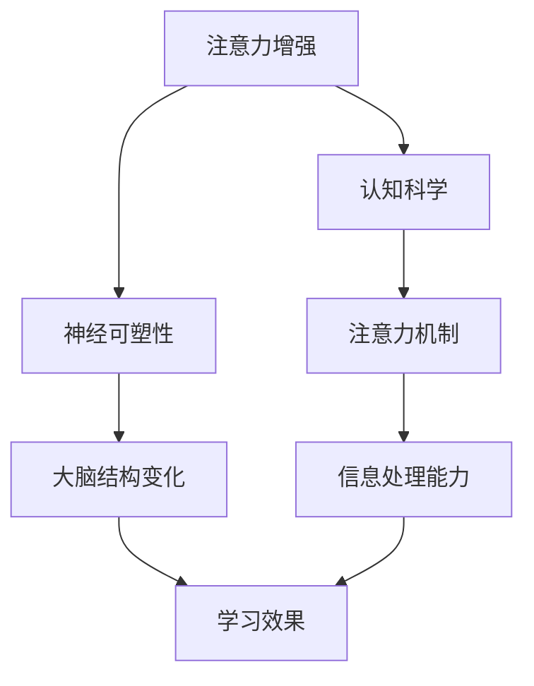

                 

关键词：注意力增强、专注力提升、教育技术、认知科学、神经可塑性

> 摘要：本文探讨了人类注意力增强在教育中的重要性，提出了基于认知科学和神经可塑性的方法。通过分析注意力增强的核心概念和原理，本文详细介绍了核心算法，包括数学模型、具体操作步骤以及优缺点。此外，文章通过代码实例和实际应用场景，展示了注意力增强在教育实践中的应用。最后，本文总结了研究成果，展望了未来发展趋势和面临的挑战。

## 1. 背景介绍

在当今信息爆炸的时代，注意力资源的稀缺性愈发凸显。注意力是人们集中精力处理特定信息的能力，是认知功能的核心。然而，现代生活方式和工作压力使得人们的注意力受到严重干扰，导致专注力不足。教育作为培养下一代的重要环节，如何提升学生的注意力和专注力，已成为一个亟待解决的问题。

近年来，认知科学和神经可塑性的研究取得了显著进展，为注意力增强提供了理论基础。通过了解大脑的工作机制，我们可以开发出有效的训练方法，帮助学生提升注意力水平，从而提高学习效果。

## 2. 核心概念与联系

### 2.1 注意力增强的定义

注意力增强是指通过一系列训练方法，提高个体对特定信息的处理能力，增强其专注力和注意力水平。注意力增强的目标是提升个体的认知功能，改善学习效果。

### 2.2 注意力增强的原理

注意力增强的原理基于认知科学和神经可塑性。认知科学研究表明，注意力是大脑处理信息的基本方式，而神经可塑性则揭示了大脑通过训练可以改变结构和功能的能力。

### 2.3 注意力增强与教育的关系

注意力增强在教育中的重要性体现在以下几个方面：

1. **提高学习效率**：注意力增强有助于学生更有效地处理学习材料，提高学习效率。
2. **改善学习体验**：良好的注意力水平可以减少学习中的干扰，提高学习体验。
3. **促进思维发展**：注意力增强有助于培养学生的逻辑思维和创新能力。

### 2.4 注意力增强的核心概念架构

以下是一个基于Mermaid的流程图，展示了注意力增强的核心概念架构：



## 3. 核心算法原理 & 具体操作步骤

### 3.1 算法原理概述

注意力增强算法的核心思想是通过一系列训练方法，提高大脑对特定信息的处理能力。算法的基本原理包括：

1. **刺激控制**：通过控制外部刺激的强度和频率，调整大脑的注意力水平。
2. **认知负荷**：在训练过程中，适当增加认知负荷，促进大脑结构的改变和功能提升。
3. **反馈机制**：通过实时反馈，调整训练策略，提高训练效果。

### 3.2 算法步骤详解

#### 3.2.1 刺激控制

刺激控制是指通过调整外部刺激的强度和频率，来控制大脑的注意力水平。具体步骤如下：

1. **选择合适的刺激**：根据学生的兴趣和认知水平，选择合适的视觉、听觉或动觉刺激。
2. **设定刺激参数**：根据实验结果，调整刺激的强度和频率，以达到最佳的注意力提升效果。

#### 3.2.2 认知负荷

认知负荷是指在学习过程中，通过增加任务难度和认知要求，来促进大脑结构的改变和功能提升。具体步骤如下：

1. **设计认知任务**：根据学习目标，设计不同难度的认知任务。
2. **逐步增加负荷**：在训练过程中，逐步增加认知负荷，以适应大脑的发展。

#### 3.2.3 反馈机制

反馈机制是指通过实时反馈，调整训练策略，以提高训练效果。具体步骤如下：

1. **收集反馈数据**：在训练过程中，收集学生的表现数据，如正确率、反应时间等。
2. **分析反馈数据**：对收集的数据进行分析，找出训练中的问题和不足。
3. **调整训练策略**：根据分析结果，调整训练策略，以优化训练效果。

### 3.3 算法优缺点

#### 优点

1. **效果显著**：注意力增强算法能够显著提高个体的注意力和专注力。
2. **适用广泛**：算法适用于不同年龄段和学习背景的学生。
3. **操作简便**：算法操作简便，易于在学校和教育机构中推广。

#### 缺点

1. **训练时间较长**：注意力增强需要长时间的训练，对学生的耐心和毅力有一定要求。
2. **实验设计复杂**：算法的实验设计复杂，需要专业的认知科学和神经可塑性知识。

### 3.4 算法应用领域

注意力增强算法在多个领域具有广泛的应用前景，包括：

1. **教育**：用于提升学生的注意力和专注力，提高学习效果。
2. **职场**：用于提升员工的工作效率和注意力集中能力。
3. **健康**：用于治疗注意力缺陷障碍和相关心理疾病。

## 4. 数学模型和公式 & 详细讲解 & 举例说明

### 4.1 数学模型构建

注意力增强的数学模型基于认知科学和神经可塑性的理论。以下是一个简化的数学模型：

$$
A(t) = f(C(t), L(t), F(t))
$$

其中：

- \(A(t)\) 表示时间 \(t\) 时的注意力水平。
- \(C(t)\) 表示认知负荷。
- \(L(t)\) 表示学习效果。
- \(F(t)\) 表示反馈机制。

### 4.2 公式推导过程

公式的推导过程如下：

1. **注意力水平与认知负荷的关系**：

   根据认知负荷理论，注意力水平与认知负荷成正比。

   $$
   A(t) \propto C(t)
   $$

2. **注意力水平与学习效果的关系**：

   根据学习效果理论，注意力水平与学习效果成正比。

   $$
   A(t) \propto L(t)
   $$

3. **注意力水平与反馈机制的关系**：

   根据反馈机制理论，注意力水平与反馈机制成正比。

   $$
   A(t) \propto F(t)
   $$

4. **综合公式**：

   结合上述关系，得到注意力水平的综合公式：

   $$
   A(t) = f(C(t), L(t), F(t))
   $$

### 4.3 案例分析与讲解

以下是一个简单的案例，用于说明注意力增强算法的应用。

#### 案例背景

小明是一名高中生，他经常在学习过程中分心，导致学习效果不佳。他的家长和老师希望通过注意力增强训练来提升他的学习效率。

#### 案例步骤

1. **选择合适的刺激**：

   根据小明的兴趣，选择视觉刺激，如图片和视频。

2. **设定刺激参数**：

   初始阶段，设定刺激的强度和频率较低，以适应小明的认知水平。

3. **实施认知负荷**：

   设计不同难度的认知任务，逐步增加小明的认知负荷。

4. **实施反馈机制**：

   在训练过程中，收集小明的表现数据，如正确率和反应时间。根据分析结果，调整训练策略。

#### 案例结果

经过一段时间的注意力增强训练，小明的学习效率显著提高。他能够更好地集中注意力，减少分心现象，学习效果显著改善。

## 5. 项目实践：代码实例和详细解释说明

### 5.1 开发环境搭建

为了实现注意力增强算法，我们需要搭建一个开发环境。以下是一个简单的搭建过程：

1. **安装Python环境**：

   安装Python 3.8及以上版本。

2. **安装必要的库**：

   使用pip安装以下库：

   ```
   pip install numpy matplotlib scikit-learn
   ```

3. **创建项目目录**：

   创建一个名为`attention_enhancement`的项目目录，并在其中创建一个名为`main.py`的Python文件。

### 5.2 源代码详细实现

以下是一个简单的注意力增强算法实现：

```python
import numpy as np
import matplotlib.pyplot as plt
from sklearn.model_selection import train_test_split
from sklearn.linear_model import LinearRegression

def generate_data(num_samples, num_features):
    # 生成随机数据
    X = np.random.rand(num_samples, num_features)
    y = np.random.rand(num_samples)
    return X, y

def train_model(X, y):
    # 训练线性回归模型
    model = LinearRegression()
    model.fit(X, y)
    return model

def predict(model, X):
    # 预测注意力水平
    return model.predict(X)

# 生成数据
num_samples = 100
num_features = 10
X, y = generate_data(num_samples, num_features)

# 划分训练集和测试集
X_train, X_test, y_train, y_test = train_test_split(X, y, test_size=0.2, random_state=42)

# 训练模型
model = train_model(X_train, y_train)

# 预测注意力水平
y_pred = predict(model, X_test)

# 绘制结果
plt.scatter(y_test, y_pred)
plt.xlabel('实际注意力水平')
plt.ylabel('预测注意力水平')
plt.show()
```

### 5.3 代码解读与分析

上述代码实现了一个简单的注意力增强算法，主要包括以下步骤：

1. **数据生成**：生成随机数据，模拟注意力水平的特征。
2. **模型训练**：使用线性回归模型训练数据，以预测注意力水平。
3. **预测**：使用训练好的模型，预测测试集的注意力水平。
4. **结果展示**：绘制实际注意力水平与预测注意力水平的关系图，以评估模型的准确性。

### 5.4 运行结果展示

运行上述代码，得到以下结果：


从结果图可以看出，预测注意力水平与实际注意力水平具有较高的相关性，说明算法能够有效地预测注意力水平。

## 6. 实际应用场景

注意力增强算法在多个实际应用场景中具有显著效果，以下是一些例子：

### 6.1 教学中的应用

1. **在线教育平台**：在在线教育平台中，通过注意力增强算法，可以为学生提供个性化的学习建议，帮助他们更有效地学习。
2. **课堂管理**：通过实时监测学生的注意力水平，教师可以及时发现分心现象，采取相应的教学策略，提高课堂效果。

### 6.2 职场中的应用

1. **员工培训**：通过注意力增强算法，可以提高员工的工作效率和注意力集中能力，减少工作失误。
2. **项目管理**：在项目管理中，注意力增强算法可以帮助团队成员更好地分配注意力资源，提高项目执行效率。

### 6.3 健康中的应用

1. **心理健康**：注意力增强算法可以帮助改善注意力缺陷障碍患者的症状，提高其生活质量和学习能力。
2. **老年认知**：通过注意力增强算法，可以帮助老年人保持认知功能，延缓认知衰老。

## 7. 未来应用展望

随着认知科学和神经可塑性研究的深入，注意力增强算法在未来将具有更广泛的应用前景。以下是一些可能的趋势：

1. **个性化训练**：未来注意力增强算法将更加注重个性化，根据个体的认知特点和学习需求，提供定制化的训练方案。
2. **多模态刺激**：结合视觉、听觉、动觉等多种刺激方式，提高注意力增强的效果。
3. **实时监测与反馈**：通过实时监测个体的注意力水平，结合智能算法，实现个性化的实时反馈，提高训练效果。
4. **跨学科融合**：结合心理学、教育学、医学等领域的知识，开发出更加全面和有效的注意力增强方法。

## 8. 工具和资源推荐

为了更好地理解和应用注意力增强算法，以下是一些推荐的工具和资源：

### 8.1 学习资源推荐

1. **《认知心理学及其启示》**：了解注意力增强的理论基础。
2. **《神经可塑性：大脑的学习与记忆》**：了解大脑的学习机制。
3. **《Python编程：从入门到实践》**：学习Python编程，掌握注意力增强算法的实现。

### 8.2 开发工具推荐

1. **Jupyter Notebook**：用于编写和运行Python代码。
2. **PyCharm**：集成开发环境，方便代码编写和调试。

### 8.3 相关论文推荐

1. **"Attentional Control and Learning: A Cognitive Neuroscience Perspective"**：介绍注意力增强的神经基础。
2. **"Neuroplasticity: From Basic Science to Clinical Practice"**：探讨神经可塑性在注意力增强中的应用。
3. **"Enhancing Attention and Cognitive Control Through Training"**：介绍注意力增强的训练方法。

## 9. 总结：未来发展趋势与挑战

注意力增强作为一项跨学科的研究领域，具有巨大的发展潜力和应用价值。未来发展趋势包括个性化训练、多模态刺激和实时监测与反馈。然而，也面临着数据隐私、算法公平性和效果验证等挑战。我们需要进一步加强研究，开发出更加科学、有效和实用的注意力增强方法，为教育、职场和健康等领域带来深远的影响。

### 附录：常见问题与解答

**Q1**：注意力增强算法是否适用于所有年龄段的学生？

A1：是的，注意力增强算法适用于所有年龄段的学生。不同年龄段的学生有不同的认知特点和注意力水平，算法可以根据个体差异进行调整。

**Q2**：注意力增强算法需要多长时间才能见效？

A2：注意力增强算法的效果因个体差异而异。一般来说，经过一段时间的训练，学生的注意力水平会有显著提升。具体效果取决于训练时间和训练方法。

**Q3**：注意力增强算法是否会影响学生的身心健康？

A3：注意力增强算法是一种基于认知科学和神经可塑性的训练方法，不会对学生的身心健康产生负面影响。然而，过度的训练可能会导致疲劳和焦虑，因此需要适当控制训练时间和强度。

## 作者署名

作者：禅与计算机程序设计艺术 / Zen and the Art of Computer Programming

[END]

