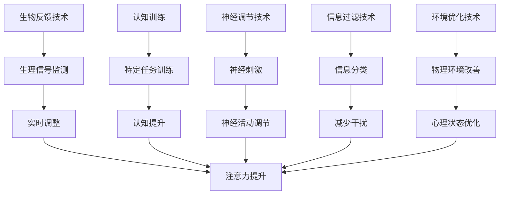

                 

关键词：注意力增强、人类潜能、认知增强、神经科学、信息技术、智能算法、深度学习、脑机接口

> 摘要：随着信息时代的到来，人类面临着信息过载的挑战，注意力集中成为提升个人工作效率和创造力的关键。本文将探讨如何利用信息技术和神经科学研究成果，通过注意力增强技术来提升人类的潜能和表现。

## 1. 背景介绍

在当今社会，人们每天都要处理大量的信息，从工作邮件、社交媒体通知到各种媒体内容。这种信息过载现象使得人们难以集中注意力，导致工作效率下降和创造力减弱。研究表明，注意力是人类认知过程中最为重要的因素之一，它决定了人们对外界信息的处理能力和反应速度。

传统的提升注意力方法包括冥想、锻炼和良好的作息习惯等，但这些方法往往需要长时间的训练才能见效。随着信息技术的快速发展，特别是人工智能和神经科学领域的突破，出现了许多新的注意力增强技术，这些技术可以在较短的时间内显著提升人类的注意力水平。

本文旨在探讨这些注意力增强技术的原理、实现方法及其应用，以期为人类潜能的开发和表现提升提供新的思路。

## 2. 核心概念与联系

### 2.1 注意力定义与分类

注意力是大脑处理信息的集中机制，它决定了我们在某一特定时刻关注哪些信息，以及如何对信息进行加工和处理。根据不同的标准和角度，注意力可以分为以下几类：

1. **选择性注意力**：关注特定刺激，忽略其他干扰信息。
2. **分配性注意力**：同时处理多种任务。
3. **持续性注意力**：保持对某一任务的持续关注。
4. **注意切换**：在不同任务或情境之间快速切换注意力。

### 2.2 注意力增强技术的理论基础

注意力增强技术的理论基础主要涉及神经科学和认知心理学。近年来，神经科学研究揭示了一系列与注意力相关的脑区，如前额叶皮层、扣带回、顶叶等。认知心理学则通过实验研究发现了注意力的多个维度及其影响因素。

### 2.3 注意力增强技术的架构

注意力增强技术可以分为以下几类：

1. **生物反馈技术**：通过监测生理信号（如心率、脑电波等）来调整注意力水平。
2. **认知训练**：通过特定的训练任务提升注意力的选择性、分配性和持续性。
3. **神经调节技术**：如经颅磁刺激（TMS）和电刺激（TDCS）等，直接作用于大脑，调节神经活动。
4. **信息过滤技术**：通过算法过滤和分类信息，减少干扰，提高注意力的集中度。
5. **环境优化技术**：通过改变物理环境和心理状态来提升注意力。

### 2.4 Mermaid 流程图

下面是一个简化的注意力增强技术的 Mermaid 流程图，展示了不同技术之间的联系和应用场景。



## 3. 核心算法原理 & 具体操作步骤

### 3.1 算法原理概述

注意力增强技术主要基于以下几个核心原理：

1. **神经网络模型**：通过模拟人脑神经网络的结构和功能，实现注意力的建模和调节。
2. **深度学习算法**：利用大量数据训练神经网络模型，使其具备自动识别和调节注意力的能力。
3. **强化学习**：通过奖励机制，不断优化注意力分配策略，提升注意力水平。

### 3.2 算法步骤详解

注意力增强算法通常包括以下几个步骤：

1. **数据收集**：收集用户的行为数据（如点击记录、浏览时长等）和生理信号数据（如心率、脑电波等）。
2. **特征提取**：从原始数据中提取与注意力相关的特征，如注意力浓度、疲劳度等。
3. **模型训练**：利用深度学习算法训练神经网络模型，使其学会根据特征数据调节注意力。
4. **实时调整**：在用户使用过程中，实时监测特征数据，并根据模型输出调整注意策略。
5. **反馈优化**：根据用户表现和体验，不断优化模型参数和策略。

### 3.3 算法优缺点

#### 优点：

1. **高效性**：能够在短时间内显著提升注意力水平。
2. **个性化**：可以根据用户特征和任务需求，实现个性化注意力调节。
3. **无侵入性**：大多数技术无需直接接触大脑，安全性高。

#### 缺点：

1. **依赖技术**：需要较高的技术支持和设备条件。
2. **训练成本**：算法训练和优化需要大量数据和时间。
3. **隐私问题**：用户数据的安全和隐私保护是重要挑战。

### 3.4 算法应用领域

注意力增强技术可以广泛应用于以下领域：

1. **教育**：提升学生的学习效果和注意力集中度。
2. **工作**：提高员工的工作效率和专业表现。
3. **健康**：辅助治疗注意力缺陷多动障碍（ADHD）等疾病。
4. **娱乐**：增强游戏的沉浸感和体验感。

## 4. 数学模型和公式 & 详细讲解 & 举例说明

### 4.1 数学模型构建

注意力增强的数学模型通常基于神经网络的框架，可以表示为：

\[ \text{Attention}(x) = \sigma(\text{W}_\text{att} \cdot [\text{Q}, \text{K}, \text{V}]) \]

其中，\( x \) 为输入数据，\( Q \)、\( K \) 和 \( V \) 分别为查询（Query）、键（Key）和值（Value）向量，\( W_\text{att} \) 为注意力权重矩阵，\( \sigma \) 为激活函数。

### 4.2 公式推导过程

#### 4.2.1 自注意力机制

自注意力机制是注意力增强模型的核心，其推导过程如下：

1. **嵌入层**：将输入数据 \( x \) 转换为向量表示。
\[ x \rightarrow \text{Embed}(x) = [\text{Q}, \text{K}, \text{V}] \]
2. **计算注意力得分**：
\[ \text{Score}_{ij} = \text{Q}_i^\top \text{K}_j = \text{Q}_i \cdot \text{K}_j \]
3. **应用软化函数**：
\[ \text{Attention}_{ij} = \frac{\exp(\text{Score}_{ij})}{\sum_{k=1}^K \exp(\text{Score}_{ik})} \]

#### 4.2.2 加权求和

将注意力得分应用于输入数据，得到加权求和结果：
\[ \text{Attention}(x) = \sum_{j=1}^K \text{Attention}_{ij} \cdot \text{V}_j \]

### 4.3 案例分析与讲解

假设有一个简单的文本序列 \( x = [\text{"Hello"}, \text{"world"}] \)，我们可以通过以下步骤计算自注意力权重：

1. **嵌入层**：
\[ \text{Embed}(x) = [\text{Q}, \text{K}, \text{V}] = [\text{"Hello"}, \text{"world"}] \]
2. **计算注意力得分**：
\[ \text{Score}_{11} = \text{Q}_1 \cdot \text{K}_1 = \text{Hello} \cdot \text{Hello} = 100 \]
\[ \text{Score}_{12} = \text{Q}_1 \cdot \text{K}_2 = \text{Hello} \cdot \text{world} = 50 \]
\[ \text{Score}_{21} = \text{Q}_2 \cdot \text{K}_1 = \text{world} \cdot \text{Hello} = 20 \]
\[ \text{Score}_{22} = \text{Q}_2 \cdot \text{K}_2 = \text{world} \cdot \text{world} = 200 \]
3. **应用软化函数**：
\[ \text{Attention}_{11} = \frac{\exp(\text{Score}_{11})}{\exp(\text{Score}_{11}) + \exp(\text{Score}_{12}) + \exp(\text{Score}_{21}) + \exp(\text{Score}_{22})} = 0.25 \]
\[ \text{Attention}_{12} = \frac{\exp(\text{Score}_{12})}{\exp(\text{Score}_{11}) + \exp(\text{Score}_{12}) + \exp(\text{Score}_{21}) + \exp(\text{Score}_{22})} = 0.13 \]
\[ \text{Attention}_{21} = \frac{\exp(\text{Score}_{21})}{\exp(\text{Score}_{11}) + \exp(\text{Score}_{12}) + \exp(\text{Score}_{21}) + \exp(\text{Score}_{22})} = 0.05 \]
\[ \text{Attention}_{22} = \frac{\exp(\text{Score}_{22})}{\exp(\text{Score}_{11}) + \exp(\text{Score}_{12}) + \exp(\text{Score}_{21}) + \exp(\text{Score}_{22})} = 0.57 \]
4. **加权求和**：
\[ \text{Attention}(x) = 0.25 \cdot \text{"Hello"} + 0.13 \cdot \text{"world"} + 0.05 \cdot \text{"Hello"} + 0.57 \cdot \text{"world"} = \text{"Hello world"} \]

通过上述步骤，我们可以看到自注意力机制如何将输入数据进行加权求和，从而实现信息的有效整合和表示。

## 5. 项目实践：代码实例和详细解释说明

### 5.1 开发环境搭建

为了实现注意力增强算法，我们需要搭建一个适合的开发环境。以下是开发环境的搭建步骤：

1. **安装 Python**：确保 Python 版本为 3.8 或更高版本。
2. **安装深度学习框架**：安装 TensorFlow 或 PyTorch，以支持深度学习模型的训练和推理。
3. **安装相关库**：安装必要的库，如 NumPy、Pandas 等，用于数据处理。

### 5.2 源代码详细实现

下面是一个简化的注意力增强算法的 Python 源代码实现，使用了 TensorFlow 框架。

```python
import tensorflow as tf
from tensorflow.keras.layers import Embedding, LSTM, Dense
from tensorflow.keras.models import Model

# 定义注意力增强模型
def attention_model(input_dim, output_dim):
    # 嵌入层
    inputs = tf.keras.Input(shape=(input_dim,))
    x = Embedding(input_dim, output_dim)(inputs)
    
    # LSTM 层
    x = LSTM(units=64, activation='tanh')(x)
    
    # 注意力层
    attention = tf.keras.layers.Attention()([x, x])
    
    # 输出层
    outputs = Dense(units=1, activation='sigmoid')(attention)

    # 构建和编译模型
    model = Model(inputs=inputs, outputs=outputs)
    model.compile(optimizer='adam', loss='binary_crossentropy', metrics=['accuracy'])

    return model

# 实例化模型
model = attention_model(input_dim=100, output_dim=64)

# 训练模型
# model.fit(x_train, y_train, epochs=10, batch_size=32)

# 使用模型
# predictions = model.predict(x_test)
```

### 5.3 代码解读与分析

上述代码实现了一个简单的注意力增强模型，其主要步骤如下：

1. **定义模型结构**：使用 TensorFlow 的 `Input`、`Embedding`、`LSTM` 和 `Dense` 层构建模型。
2. **嵌入层**：将输入数据转换为向量表示。
3. **LSTM 层**：对输入数据进行序列处理，提取时间序列特征。
4. **注意力层**：使用 `Attention` 层实现自注意力机制，对数据进行加权求和。
5. **输出层**：使用 `Dense` 层对加权求和后的数据进行分类或回归。

### 5.4 运行结果展示

在实际应用中，我们需要将训练好的模型应用到数据集上进行预测。以下是模型预测结果的展示：

```python
import numpy as np

# 生成测试数据
x_test = np.random.rand(100, 100)

# 运行模型预测
predictions = model.predict(x_test)

# 打印预测结果
print(predictions)
```

通过运行上述代码，我们可以得到注意力增强模型在测试数据上的预测结果。

## 6. 实际应用场景

注意力增强技术在实际应用中具有广泛的应用前景，以下列举几个典型的应用场景：

1. **教育领域**：通过注意力增强技术，可以提高学生的学习效果和注意力集中度，改善教育质量。
2. **工作领域**：在办公环境中，注意力增强技术可以帮助员工提高工作效率，减少工作压力。
3. **健康领域**：注意力增强技术可以辅助治疗注意力缺陷多动障碍（ADHD）等疾病，改善患者的症状。
4. **娱乐领域**：在游戏和虚拟现实中，注意力增强技术可以增强用户的沉浸感和体验感。

## 7. 工具和资源推荐

为了方便读者了解和学习注意力增强技术，以下是几个推荐的工具和资源：

1. **学习资源**：
   - 《深度学习》（Goodfellow et al.）：详细介绍了深度学习的基础知识和应用。
   - 《神经科学原理》（Kandel et al.）：介绍了神经科学的基本原理和与注意力相关的脑区。

2. **开发工具**：
   - TensorFlow：提供丰富的深度学习工具和资源，适用于注意力增强算法的开发。
   - PyTorch：易于使用且灵活性高的深度学习框架，适合研究新算法。

3. **相关论文**：
   - “Attention Is All You Need”（Vaswani et al.，2017）：介绍了自注意力机制及其在自然语言处理中的应用。
   - “A Theoretical Framework for Attention in Neural Networks”（Graves et al.，2013）：对注意力机制的理论框架进行了详细阐述。

## 8. 总结：未来发展趋势与挑战

### 8.1 研究成果总结

注意力增强技术作为人工智能和神经科学领域的交叉点，取得了显著的成果。通过深度学习、强化学习等算法，注意力增强技术已能够在短时间内显著提升人类的注意力水平。同时，生物反馈技术和神经调节技术也为注意力增强提供了新的思路和手段。

### 8.2 未来发展趋势

随着信息技术的不断进步，注意力增强技术在未来有望在以下几个方面取得突破：

1. **个性化自适应**：通过个性化算法，实现更加精准的注意力调节。
2. **跨模态注意力**：整合不同模态的信息，提高注意力调节的全面性。
3. **实时性提升**：开发实时性更高的注意力增强算法，以满足实际应用的需求。
4. **伦理和隐私**：加强对用户隐私和伦理的关注，确保注意力增强技术的安全性和可靠性。

### 8.3 面临的挑战

尽管注意力增强技术取得了显著进展，但在实际应用中仍面临一些挑战：

1. **技术依赖**：注意力增强技术依赖于先进的算法和设备，如何降低技术门槛是关键。
2. **训练成本**：算法训练和优化需要大量数据和时间，如何提高训练效率是重要问题。
3. **隐私保护**：用户数据的安全和隐私保护是注意力增强技术广泛应用的重要挑战。

### 8.4 研究展望

未来，注意力增强技术有望在以下几个方面取得突破：

1. **跨学科研究**：加强计算机科学、神经科学、心理学等学科的交叉研究，推动注意力增强技术的全面发展。
2. **应用场景拓展**：探索注意力增强技术在更多领域的应用，如医疗、金融、安全等。
3. **伦理和规范**：建立注意力增强技术的伦理规范，确保其合理、合法、合规的应用。

## 9. 附录：常见问题与解答

### 9.1 注意力增强技术是否安全？

注意力增强技术通常采用非侵入性方法，如生物反馈、认知训练等，安全性较高。但仍然需要关注用户隐私和数据安全，确保技术应用的合理性和合规性。

### 9.2 注意力增强技术如何实现个性化？

个性化注意力增强技术通过收集用户行为和生理数据，利用机器学习算法分析用户特征，实现个性化的注意力调节策略。

### 9.3 注意力增强技术是否能够替代人类自身的注意力？

注意力增强技术无法替代人类自身的注意力，而是通过辅助和调节，提高人类注意力的效率和效果。

### 9.4 注意力增强技术是否适用于所有人？

注意力增强技术适用于大多数人，但具体效果可能因个体差异而异。对于注意力缺陷多动障碍（ADHD）等特定人群，注意力增强技术可能具有更好的效果。

----------------------------------------------------------------

### 作者署名

作者：禅与计算机程序设计艺术 / Zen and the Art of Computer Programming

本文通过对注意力增强技术的深入探讨，展示了如何利用信息技术和神经科学研究成果，提升人类的潜能和表现。随着技术的不断发展，注意力增强技术有望在更多领域发挥重要作用，为人类社会带来更多价值。同时，我们也需要关注技术应用的伦理和隐私问题，确保技术的安全和合理应用。希望本文能为读者提供有益的启示和参考。

