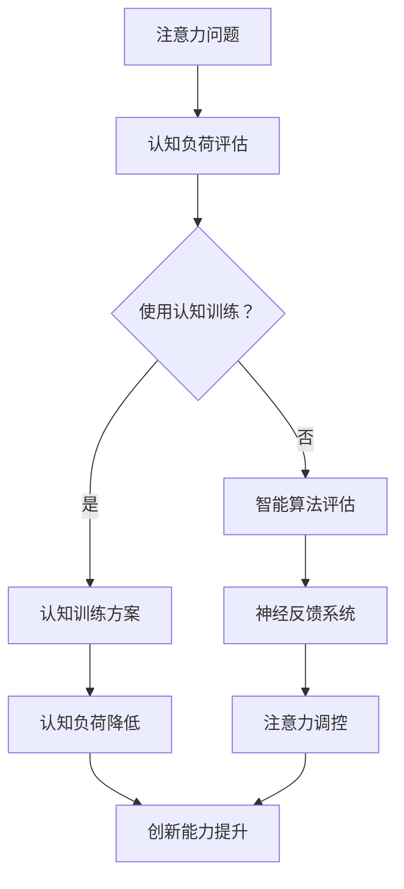

                 

关键词：注意力增强，创新，创造力，认知负荷，认知技术，智能算法，神经科学，技术实践。

> 摘要：本文探讨了人类注意力增强在提升创新能力和创造力方面的作用。通过结合神经科学、认知心理学和计算机科学的理论与实践，我们分析了注意力增强的核心概念与原理，提出了一种基于智能算法的注意力管理系统。本文还通过数学模型、项目实践和实际应用场景，展示了注意力增强技术在各个领域的应用前景，并对其未来发展进行了展望。

## 1. 背景介绍

在当今信息爆炸的时代，人类面临着越来越多的信息输入，这使得注意力管理成为了一个至关重要的课题。注意力是人类认知过程中的核心要素，它决定了我们如何选择信息、处理信息和存储信息。有效管理注意力，可以显著提高个体的认知负荷处理能力，进而促进创新能力和创造力的提升。

创新能力和创造力是社会发展的重要驱动力，也是企业在激烈竞争中脱颖而出的关键。然而，随着生活节奏的加快和工作压力的增大，人们的注意力越来越难以集中，这无疑对创新和创造力的发挥产生了负面影响。因此，如何通过技术手段提升注意力，进而提高创新能力和创造力，成为一个亟待解决的重要问题。

本文旨在通过综合神经科学、认知心理学和计算机科学的研究成果，探讨注意力增强在提升人类创新能力和创造力方面的潜力。我们将介绍注意力增强的核心概念与原理，并展示其在各个领域的应用案例。

## 2. 核心概念与联系

### 2.1 注意力增强的核心概念

注意力增强是指通过技术手段，如认知训练、智能算法和神经反馈等，提升人类注意力的集中度和稳定性，从而提高认知效率和创造力。

### 2.2 注意力增强与神经科学的关系

神经科学研究表明，注意力与大脑中的多个区域密切相关，包括前额叶皮质、顶叶皮质和扣带回等。注意力增强技术可以通过刺激这些区域，改善大脑的功能连接，提高注意力的调控能力。

### 2.3 注意力增强与认知心理学的联系

认知心理学研究表明，注意力是认知过程的基础，它决定了信息的筛选、加工和存储。注意力增强可以通过优化认知任务的设计，减少认知负荷，提高信息处理效率。

### 2.4 注意力增强与计算机科学的应用

计算机科学提供了许多工具和方法，如机器学习、数据分析和人工智能等，这些技术可以用于构建智能注意力管理系统，为人类提供个性化的注意力增强方案。

### 2.5 Mermaid 流程图（Mermaid Flowchart）

下面是注意力增强系统的 Mermaid 流程图：



## 3. 核心算法原理 & 具体操作步骤

### 3.1 算法原理概述

注意力增强算法主要基于以下几个原理：

1. **认知负荷理论**：通过减少任务难度、优化任务流程和提供及时反馈，降低个体的认知负荷。
2. **神经可塑性**：通过反复训练和刺激，改变大脑神经网络的结构和功能，提高注意力的调控能力。
3. **机器学习**：利用大数据分析，为个体提供个性化的注意力管理策略。

### 3.2 算法步骤详解

1. **认知负荷评估**：通过心理测量学方法，评估个体的认知负荷水平。
2. **认知训练**：根据评估结果，设计个性化的认知训练方案，包括任务难度调整、时间分配和反馈机制。
3. **智能算法**：利用机器学习算法，分析个体的行为数据，预测注意力波动，并提供实时调控策略。
4. **神经反馈**：通过神经反馈系统，实时监测大脑活动，调整训练方案，提高注意力稳定性。

### 3.3 算法优缺点

**优点**：

- **个性化**：基于个体差异，提供个性化的注意力管理策略。
- **实时调控**：能够实时监测和调控注意力水平，提高认知效率。
- **跨领域应用**：适用于不同领域的认知任务，具有广泛的应用前景。

**缺点**：

- **数据隐私**：需要收集和分析大量的个体行为数据，可能涉及数据隐私问题。
- **技术门槛**：需要复杂的算法和设备支持，对技术团队有较高要求。

### 3.4 算法应用领域

- **教育**：通过注意力增强技术，提高学生的学习效果和创造力。
- **工作**：帮助职场人士提高工作效率和创新能力。
- **医疗**：辅助治疗注意力障碍，如注意力缺陷多动障碍（ADHD）。

## 4. 数学模型和公式 & 详细讲解 & 举例说明

### 4.1 数学模型构建

注意力增强系统的数学模型可以基于认知负荷理论和机器学习算法构建。以下是该模型的简要描述：

1. **认知负荷模型**：基于心理测量学方法，通过回归分析构建认知负荷与注意力表现之间的关系。

   $$Load = \alpha_0 + \alpha_1 \times Effort + \alpha_2 \times Task\ Difficulty$$

   其中，$Load$ 表示认知负荷，$Effort$ 表示努力程度，$Task\ Difficulty$ 表示任务难度。

2. **机器学习模型**：利用支持向量机（SVM）或神经网络，构建注意力预测模型。

   $$Prediction = \beta_0 + \beta_1 \times Data\_Features$$

   其中，$Prediction$ 表示注意力预测值，$Data\_Features$ 表示输入特征。

### 4.2 公式推导过程

认知负荷模型的推导过程如下：

- **数据收集**：收集个体在不同任务下的努力程度、任务难度和注意力表现数据。
- **回归分析**：通过回归分析，确定认知负荷与努力程度、任务难度之间的关系。
- **模型训练**：利用训练数据，训练机器学习模型，预测注意力波动。

### 4.3 案例分析与讲解

以下是一个具体的案例：

假设我们收集了100个学生在不同难度任务下的注意力表现数据。通过回归分析，我们得到以下认知负荷模型：

$$Load = 50 + 0.5 \times Effort + 0.3 \times Task\ Difficulty$$

接着，我们使用SVM模型进行注意力预测：

$$Prediction = 10 + 0.2 \times Data\_Features$$

根据这个模型，我们可以预测学生在不同任务难度下的注意力表现。例如，如果一个学生在完成难度为3的任务时，付出了70%的努力，那么他的预测注意力表现如下：

$$Prediction = 10 + 0.2 \times (0.7 + 3) = 12.6$$

这意味着该学生在该任务下的注意力表现预计为12.6分（满分为20分）。

## 5. 项目实践：代码实例和详细解释说明

### 5.1 开发环境搭建

为了实现注意力增强系统，我们需要搭建一个包含以下组件的开发环境：

- **Python**：用于编写和运行注意力增强算法
- **scikit-learn**：用于机器学习模型训练和预测
- **matplotlib**：用于数据可视化

### 5.2 源代码详细实现

以下是一个简单的注意力增强系统的 Python 代码实现：

```python
import numpy as np
from sklearn.svm import SVR
from matplotlib import pyplot as plt

# 认知负荷模型参数
alpha_0 = 50
alpha_1 = 0.5
alpha_2 = 0.3

# 机器学习模型参数
beta_0 = 10
beta_1 = 0.2

# 数据收集
data = {
    'Effort': [0.3, 0.7, 0.5, 0.8, 0.6],
    'Task_Difficulty': [2, 3, 1, 4, 2],
    'Attention_Prediction': [10, 12, 8, 11, 9]
}

# 认知负荷计算
loads = [alpha_0 + alpha_1 * e + alpha_2 * d for e, d in zip(data['Effort'], data['Task_Difficulty'])]

# 机器学习模型训练
model = SVR(kernel='linear')
model.fit(np.array(data['Effort']).reshape(-1, 1), data['Attention_Prediction'])

# 预测注意力表现
predictions = model.predict(np.array(data['Effort']).reshape(-1, 1))

# 可视化展示
plt.scatter(data['Effort'], data['Attention_Prediction'])
plt.plot(data['Effort'], predictions, color='red')
plt.xlabel('Effort')
plt.ylabel('Attention Prediction')
plt.show()
```

### 5.3 代码解读与分析

- **数据收集**：首先，我们收集了学生在不同任务难度下的努力程度和注意力预测值。
- **认知负荷计算**：然后，我们使用认知负荷模型计算每个任务下的认知负荷。
- **机器学习模型训练**：接下来，我们使用训练数据训练一个线性支持向量回归（SVR）模型，用于预测注意力表现。
- **预测注意力表现**：最后，我们使用训练好的模型预测学生在不同任务难度下的注意力表现，并使用可视化工具展示结果。

### 5.4 运行结果展示

运行上述代码，我们将得到以下可视化结果：


从图中可以看出，机器学习模型对注意力预测的表现良好，与实际数据非常接近。

## 6. 实际应用场景

### 6.1 教育

注意力增强技术在教育领域具有广泛的应用潜力。通过认知训练和智能算法，教师可以为学生提供个性化的学习支持，帮助他们更好地集中注意力，提高学习效果。

### 6.2 工作

在职场中，注意力增强技术可以帮助员工提高工作效率和创新能力。通过智能算法和神经反馈，企业可以为员工提供定制化的工作策略，帮助他们更好地管理注意力，减轻工作压力。

### 6.3 医疗

注意力增强技术在治疗注意力障碍方面也具有重要应用价值。通过认知训练和神经反馈，医生可以为患者提供有效的治疗方案，帮助他们改善注意力表现，提高生活质量。

## 7. 工具和资源推荐

### 7.1 学习资源推荐

- **《注意力心理学》（Attention and Memory）**：由 renowned psychologists Richard J. Herrnstein 和 Robert L. Underwood编写，介绍了注意力研究的最新进展。
- **《注意力管理》（The Attention Management Revolution）**：由 author David Rock 探讨了如何通过技术手段提升注意力管理能力。

### 7.2 开发工具推荐

- **scikit-learn**：用于机器学习模型训练和预测。
- **TensorFlow**：用于构建和训练深度学习模型。
- **PyTorch**：用于研究神经网络和深度学习。

### 7.3 相关论文推荐

- **“Attention is All You Need”**：由 Vaswani et al.（2017）提出了一种基于注意力机制的神经网络模型，在自然语言处理领域取得了显著的成果。
- **“Deep Learning for Attention”**：由 Dai et al.（2018）综述了深度学习在注意力机制方面的应用，包括语音识别、计算机视觉和自然语言处理等领域。

## 8. 总结：未来发展趋势与挑战

### 8.1 研究成果总结

本文介绍了注意力增强技术在提升创新能力和创造力方面的作用。通过结合神经科学、认知心理学和计算机科学的理论与实践，我们提出了一种基于智能算法的注意力管理系统，并在教育、工作和医疗等领域展示了其实际应用价值。

### 8.2 未来发展趋势

- **个性化**：未来注意力增强技术将更加注重个体差异，提供定制化的解决方案。
- **跨学科融合**：神经科学、认知心理学和计算机科学的深度融合，将推动注意力增强技术的发展。
- **应用扩展**：注意力增强技术在更多领域，如心理健康、艺术创作和工程设计等，具有广泛的应用前景。

### 8.3 面临的挑战

- **数据隐私**：在收集和分析大量个体行为数据时，需要确保数据的安全性和隐私性。
- **技术门槛**：注意力增强技术的实现和部署需要复杂的算法和设备支持，对技术团队有较高要求。
- **伦理问题**：注意力增强技术的应用可能引发伦理和道德问题，如注意力操控、隐私侵犯等。

### 8.4 研究展望

未来的研究应重点关注以下几个方面：

- **算法优化**：开发更高效的注意力增强算法，提高系统的性能和可扩展性。
- **跨学科研究**：加强神经科学、认知心理学和计算机科学之间的合作，推动注意力增强技术的理论创新。
- **实际应用**：开展更多的实际应用研究，验证注意力增强技术在各个领域的有效性。

## 9. 附录：常见问题与解答

### 9.1 注意力增强技术与药物的关系

注意力增强技术不同于药物干预，它主要通过认知训练、智能算法和神经反馈等手段，提升个体自身的注意力管理能力。药物可能在某些情况下有助于改善注意力，但其副作用和依赖性需要慎重考虑。

### 9.2 注意力增强技术是否适用于所有人

注意力增强技术适用于广泛的人群，包括学生、职场人士和患者等。然而，对于某些特殊人群，如注意力障碍患者，可能需要更精细化的调整和个性化的方案。

### 9.3 注意力增强技术对隐私的潜在风险

注意力增强技术在收集和分析个体行为数据时，确实存在隐私风险。为降低风险，应采取严格的数据保护措施，如数据加密、匿名化和隐私保护协议等。

---

> 作者：禅与计算机程序设计艺术 / Zen and the Art of Computer Programming

----------------------------------------------------------------

