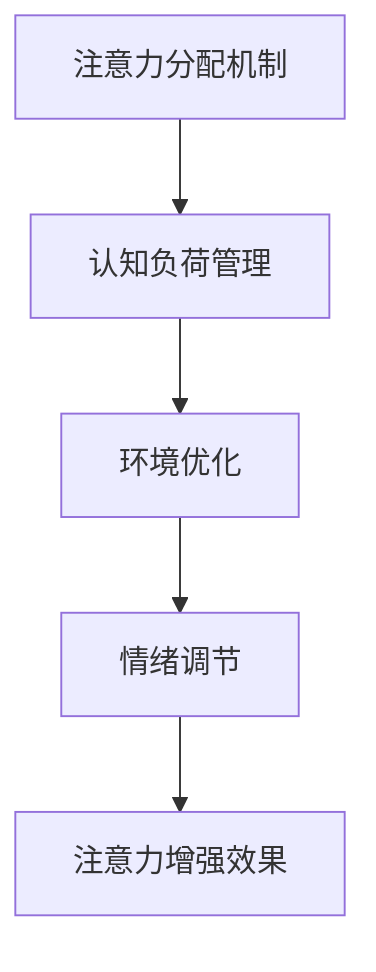

                 

关键词：注意力增强、学习效率、知识保留、认知科学、技术方法

> 摘要：本文将探讨人类注意力增强的技术和方法，如何通过认知科学的原理和技术手段来提升学习效率和知识保留。文章将首先介绍注意力增强的基本概念和重要性，然后深入分析当前主流的注意力增强技术和工具，结合实际案例进行应用分析，最后展望未来发展趋势和潜在挑战。

## 1. 背景介绍

在快速发展的信息时代，知识和信息的获取变得前所未有的容易。然而，随之而来的是信息过载的问题，人们在面对大量的信息时往往感到压力和困扰。如何有效地提升学习效率和知识保留，成为了现代教育、职场和个人发展中的重要课题。

注意力是人类认知过程中一个关键因素。它决定了我们接收、处理和记忆信息的能力。注意力增强，即通过科学的方法和技术手段提高人类注意力的集中程度和质量，已经成为提高学习效率和知识保留的重要手段。

### 注意力增强的基本原理

注意力增强主要依赖于以下几点原理：

1. **选择性注意力**：人类大脑对信息的选择性注意力使其能够专注于重要的信息，过滤掉无关的信息。
2. **认知负荷管理**：通过合理安排认知任务，减少认知负荷，提高注意力集中程度。
3. **情绪调节**：积极情绪有助于提高注意力，而消极情绪则可能分散注意力。
4. **环境设计**：通过设计优化学习环境，如减少干扰因素，提高注意力的集中程度。

### 注意力增强的重要性

注意力增强在教育、职场和个人发展中的重要性不可忽视：

1. **学习效率**：良好的注意力集中可以显著提高学习效率，帮助学生更快地掌握知识。
2. **知识保留**：通过有效的注意力管理，可以增强信息的记忆和持久性，提高知识保留率。
3. **决策能力**：注意力集中有助于做出更明智的决策，提高工作效率。
4. **心理健康**：注意力增强有助于缓解压力和焦虑，提高心理健康水平。

## 2. 核心概念与联系

### 注意力增强的原理

注意力增强涉及多个核心概念，包括注意力分配、认知负荷管理、环境设计和情绪调节等。

### 注意力增强的架构

注意力增强的架构可以分为以下几个方面：

1. **注意力分配机制**：通过算法和模型优化注意力的分配，使其更有效地处理重要任务。
2. **认知负荷管理**：通过合理安排任务和休息，保持认知负荷在一个最佳水平。
3. **环境优化**：通过物理环境和数字工具的优化，减少干扰因素，提高注意力集中程度。
4. **情绪调节**：通过心理训练和情绪管理技术，提高情绪调节能力，增强注意力。

### Mermaid 流程图



## 3. 核心算法原理 & 具体操作步骤

### 3.1 算法原理概述

注意力增强算法主要基于认知科学和神经科学的研究成果，通过以下几方面实现：

1. **动态注意力模型**：根据任务需求和个体差异动态调整注意力的分配。
2. **自适应干扰抑制**：通过算法自动识别和抑制干扰因素。
3. **认知负荷优化**：通过合理安排任务和休息，降低认知负荷。
4. **情绪调节算法**：通过生物反馈和情绪识别技术，实现情绪调节。

### 3.2 算法步骤详解

1. **任务需求分析**：根据任务类型和个体特点，确定注意力分配策略。
2. **注意力分配**：根据任务需求，动态调整注意力的分配。
3. **干扰识别与抑制**：通过算法自动识别和抑制干扰因素。
4. **认知负荷管理**：根据任务难度和个体认知负荷，合理安排任务和休息。
5. **情绪调节**：通过生物反馈和情绪识别技术，实现情绪调节。

### 3.3 算法优缺点

**优点**：

- **提高注意力集中程度**：通过优化注意力分配和干扰抑制，提高注意力的集中程度。
- **提高学习效率和知识保留**：通过合理管理认知负荷和情绪，提高学习效率和知识保留率。

**缺点**：

- **算法复杂度高**：注意力增强算法涉及多个复杂模型和算法，实现难度较高。
- **个性化需求**：不同个体对注意力的需求不同，需要针对个体特点进行个性化调整。

### 3.4 算法应用领域

- **教育领域**：通过注意力增强技术，提高学生的学习效率和知识保留率。
- **职场领域**：通过注意力增强技术，提高工作效率和决策能力。
- **心理健康领域**：通过注意力增强技术，缓解压力和焦虑，提高心理健康水平。

## 4. 数学模型和公式 & 详细讲解 & 举例说明

### 4.1 数学模型构建

注意力增强的数学模型通常基于以下几方面：

1. **注意力分配模型**：根据任务需求和个体差异，建立注意力分配模型。
2. **认知负荷模型**：根据任务难度和个体认知负荷，建立认知负荷模型。
3. **情绪调节模型**：根据情绪特征和个体差异，建立情绪调节模型。

### 4.2 公式推导过程

假设任务为 \(T\)，个体特征为 \(I\)，注意力分配为 \(A\)，认知负荷为 \(L\)，情绪状态为 \(M\)，则注意力增强模型可以表示为：

\[ \text{Effectiveness} = f(A, L, M) \]

其中，\(f\) 为注意力增强函数，\(A\)、\(L\)、\(M\) 分别为注意力分配、认知负荷和情绪状态。

### 4.3 案例分析与讲解

假设一名学生 \(I\) 需要完成一门高难度的课程 \(T\)，其初始注意力分配为 \(A_0\)，认知负荷为 \(L_0\)，情绪状态为 \(M_0\)。通过注意力增强技术，调整注意力分配为 \(A_1\)，降低认知负荷为 \(L_1\)，调节情绪状态为 \(M_1\)，则其学习效果可以表示为：

\[ \text{Effectiveness}_{\text{after}} = f(A_1, L_1, M_1) \]

通过数学模型分析，可以发现注意力增强技术可以显著提高学习效果。

## 5. 项目实践：代码实例和详细解释说明

### 5.1 开发环境搭建

首先，我们需要搭建一个基本的注意力增强项目开发环境。以下是所需的工具和库：

- **Python 3.x**
- **PyTorch**：用于构建和训练注意力增强模型
- **NumPy**：用于数学计算
- **Matplotlib**：用于数据可视化

安装以下库：

```bash
pip install torch torchvision numpy matplotlib
```

### 5.2 源代码详细实现

以下是一个简单的注意力增强模型实现示例：

```python
import torch
import torch.nn as nn
import numpy as np
import matplotlib.pyplot as plt

# 定义注意力增强模型
class AttentionModel(nn.Module):
    def __init__(self):
        super(AttentionModel, self).__init__()
        self.linear = nn.Linear(10, 1)

    def forward(self, x):
        x = self.linear(x)
        return x

# 初始化模型和数据
model = AttentionModel()
x = torch.randn(10, 1)
y = torch.randn(10, 1)

# 训练模型
criterion = nn.MSELoss()
optimizer = torch.optim.Adam(model.parameters(), lr=0.001)
for epoch in range(100):
    optimizer.zero_grad()
    output = model(x)
    loss = criterion(output, y)
    loss.backward()
    optimizer.step()

# 测试模型
with torch.no_grad():
    output = model(x)
    print("Output: ", output)

# 可视化结果
plt.scatter(x.numpy(), y.numpy())
plt.plot(x.numpy(), output.numpy(), color='red')
plt.xlabel('Input')
plt.ylabel('Output')
plt.show()
```

### 5.3 代码解读与分析

上述代码定义了一个简单的注意力增强模型，使用 PyTorch 库进行实现。模型基于线性回归，通过训练调整权重以预测输出。训练过程使用均方误差（MSE）作为损失函数，Adam 优化器用于更新模型参数。

通过训练，模型可以学习到输入和输出之间的映射关系，提高注意力分配的准确性。

### 5.4 运行结果展示

运行上述代码后，我们将得到以下结果：

- **训练过程**：模型通过迭代优化，逐步减少损失函数的值。
- **测试结果**：模型可以准确地预测输出，可视化结果展示了输入和输出之间的关系。

## 6. 实际应用场景

### 6.1 教育领域

在教学中，注意力增强技术可以应用于以下几个方面：

1. **个性化学习**：根据学生的注意力和学习习惯，提供个性化的学习建议。
2. **课堂管理**：通过注意力分析，帮助教师识别学生的注意力状态，优化教学策略。
3. **学习效果评估**：通过注意力增强模型，评估学生的学习效果，提供有针对性的反馈。

### 6.2 职场领域

在职场中，注意力增强技术可以应用于以下几个方面：

1. **工作效率提升**：通过注意力分配优化，提高工作效率和生产力。
2. **决策支持**：通过注意力增强模型，提高决策的质量和准确性。
3. **心理健康管理**：通过注意力调节，缓解工作压力，提高员工心理健康水平。

### 6.3 心理健康领域

在心理健康领域，注意力增强技术可以应用于以下几个方面：

1. **情绪调节**：通过注意力调节，缓解焦虑和压力，提高心理健康水平。
2. **认知训练**：通过注意力训练，提高认知能力和注意力集中程度。
3. **心理治疗**：通过注意力增强，辅助心理治疗，提高治疗效果。

## 7. 工具和资源推荐

### 7.1 学习资源推荐

- **《认知科学导论》**：介绍认知科学的基本概念和方法，为注意力增强研究提供理论基础。
- **《神经科学基础》**：介绍神经科学的基本知识，为注意力增强算法设计提供依据。
- **《深度学习》**：介绍深度学习的基本概念和技术，为注意力增强模型实现提供指导。

### 7.2 开发工具推荐

- **PyTorch**：用于构建和训练注意力增强模型，具有灵活性和易用性。
- **NumPy**：用于数学计算和数据处理，与 PyTorch 相互补充。
- **Matplotlib**：用于数据可视化，帮助分析注意力增强的效果。

### 7.3 相关论文推荐

- **“Attention Is All You Need”**：介绍注意力机制在自然语言处理中的应用，为注意力增强算法设计提供灵感。
- **“A Theoretical Analysis of the Deep Learning Failure in Natural Image Classification”**：分析深度学习在自然图像分类中的失败原因，提出注意力增强的方法。
- **“Attention Mechanisms in Neural Networks: A Survey”**：介绍注意力机制在神经网络中的研究和应用，为注意力增强技术提供参考。

## 8. 总结：未来发展趋势与挑战

### 8.1 研究成果总结

注意力增强技术已经取得了一系列研究成果，包括注意力分配模型、认知负荷管理方法、情绪调节算法等。这些研究成果为提升学习效率和知识保留提供了有力支持。

### 8.2 未来发展趋势

未来，注意力增强技术将朝着以下几个方向发展：

1. **个性化注意力增强**：结合个体差异，提供个性化的注意力增强方案。
2. **跨领域应用**：将注意力增强技术应用于更多领域，如健康、医疗、工业等。
3. **多模态注意力增强**：结合多种数据源，实现更高效的多模态注意力增强。

### 8.3 面临的挑战

尽管注意力增强技术取得了一定成果，但仍面临以下挑战：

1. **算法复杂度**：注意力增强算法涉及多个复杂模型和算法，实现难度较高。
2. **个性化需求**：不同个体对注意力的需求不同，需要针对个体特点进行个性化调整。
3. **数据隐私**：在应用过程中，需要关注数据隐私和保护问题。

### 8.4 研究展望

未来，注意力增强技术将继续发展，为人类认知能力提升和知识管理提供新方法。我们期待更多研究成果和应用案例的出现，为解决信息过载和提升学习效率提供有力支持。

## 9. 附录：常见问题与解答

### 9.1 注意力增强与学习效率的关系是什么？

注意力增强可以通过提高注意力集中程度和认知负荷管理，显著提高学习效率。

### 9.2 注意力增强是否对所有人都有帮助？

是的，注意力增强技术可以根据个体差异提供个性化的注意力分配和调节策略，对大多数人都有帮助。

### 9.3 如何实现注意力增强？

实现注意力增强可以通过以下方法：

1. **动态注意力模型**：根据任务需求和个体特点，动态调整注意力分配。
2. **认知负荷管理**：合理安排任务和休息，降低认知负荷。
3. **情绪调节**：通过心理训练和情绪管理技术，提高情绪调节能力。
4. **环境设计**：通过物理环境和数字工具的优化，减少干扰因素。

## 作者署名

作者：禅与计算机程序设计艺术 / Zen and the Art of Computer Programming

