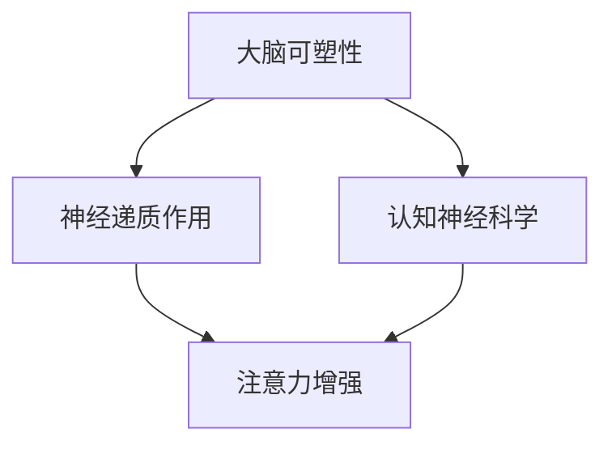

                 

关键词：注意力增强，记忆力提升，神经科学，认知优化，算法设计，实践指南

> 摘要：本文探讨了人类注意力增强与记忆力提升的方法，结合神经科学研究成果和计算机技术，提出了一系列有效的策略和工具，旨在帮助读者提升个人的认知能力和工作效率。

## 1. 背景介绍

在现代社会，人们面对的信息量急剧增加，工作压力与日俱增，如何有效地提升注意力和记忆力成为一项紧迫的任务。注意力和记忆力作为认知过程中至关重要的两个因素，直接影响到我们的学习、工作和日常生活质量。

神经科学研究表明，大脑的可塑性使得通过特定的训练方法能够改善注意力和记忆力。同时，计算机技术提供了多种工具和方法，可以量化评估和优化这些认知功能。本文将结合神经科学和计算机技术的最新研究成果，介绍几种提升注意力和记忆力的方法和工具。

### 1.1 注意力和记忆力的定义

注意力（Attention）是指大脑在选择和加工信息时，对某些特定刺激进行的集中和分配过程。注意力可以分为选择性注意、持续注意和分配注意。选择性注意指的是对特定信息的关注，而持续注意和分配注意则涉及到对多个任务的交替处理。

记忆力（Memory）是指大脑对信息进行存储、保持和提取的能力。根据记忆的过程，记忆力可以分为短期记忆和长期记忆。短期记忆主要处理即时信息，而长期记忆则涉及信息的持久存储。

### 1.2 注意力和记忆力的关联

注意力和记忆力是相互关联的。有效的注意力可以帮助人们更好地编码和存储信息，从而提升记忆力。而良好的记忆力又可以增强注意力，使得人们能够更好地过滤无关信息，集中精力处理重要任务。

## 2. 核心概念与联系

为了深入理解提升注意力和记忆力的方法，我们需要先了解一些核心概念，包括大脑的可塑性、神经递质的作用以及认知神经科学的基础架构。

### 2.1 大脑的可塑性

大脑的可塑性是指大脑在结构、功能和连接上的变化能力。研究表明，通过特定的训练方法，如重复练习、认知任务、认知行为干预等，可以增强大脑的可塑性，从而改善注意力集中和记忆力。

### 2.2 神经递质的作用

神经递质是神经元之间传递信息的化学物质，包括多巴胺、血清素、乙酰胆碱等。这些神经递质在调节注意力和记忆力中起着关键作用。例如，多巴胺的释放与奖励机制相关，可以增强注意力的集中。

### 2.3 认知神经科学的基础架构

认知神经科学是研究大脑如何进行认知功能的一门科学。它涉及到大脑的结构、功能和连接，以及认知行为和心理过程的关系。通过认知神经科学的实验研究，我们可以更好地理解如何通过干预大脑活动来提升注意力和记忆力。

### 2.4 Mermaid 流程图

以下是一个简化的 Mermaid 流程图，展示提升注意力和记忆力的核心概念和联系：



### 2.5 小结

通过理解大脑的可塑性、神经递质的作用和认知神经科学的基础架构，我们可以更深入地探讨提升注意力和记忆力的方法和策略。

## 3. 核心算法原理 & 具体操作步骤

### 3.1 算法原理概述

提升注意力和记忆力需要从神经科学和计算机技术的角度出发，设计出一系列算法和操作步骤。这些算法主要包括：

- 神经递质调节算法：通过调节大脑中的神经递质水平，改善注意力集中和记忆力。
- 认知训练算法：通过设计特定的认知任务，增强大脑的可塑性，提高认知能力。
- 神经反馈算法：通过实时监测大脑活动，提供个性化的训练指导，优化注意力集中和记忆力。

### 3.2 算法步骤详解

#### 3.2.1 神经递质调节算法

1. **数据收集**：通过脑电图（EEG）、功能磁共振成像（fMRI）等技术收集大脑活动的数据。
2. **特征提取**：从收集到的数据中提取与注意力、记忆力相关的特征。
3. **模型训练**：使用机器学习算法，如支持向量机（SVM）、神经网络（Neural Network）等，训练神经递质调节模型。
4. **参数优化**：通过交叉验证和网格搜索等方法，优化模型参数，提高调节效果。

#### 3.2.2 认知训练算法

1. **任务设计**：设计一系列认知任务，如视觉搜索、记忆游戏、注意力切换等。
2. **数据收集**：在执行认知任务时，收集大脑活动数据和任务完成情况。
3. **特征提取**：从收集到的数据中提取与认知能力相关的特征。
4. **模型训练**：使用机器学习算法，训练认知训练模型，预测认知能力的提升情况。
5. **反馈调整**：根据模型预测结果，调整认知任务难度和类型，优化训练效果。

#### 3.2.3 神经反馈算法

1. **数据采集**：通过脑电图（EEG）、眼动仪等设备实时采集大脑活动数据。
2. **实时分析**：使用机器学习算法，实时分析大脑活动数据，识别注意力集中和记忆力变化。
3. **反馈生成**：根据分析结果，生成个性化的反馈信号，如声音、视觉提示等。
4. **干预调整**：根据反馈信号，调整认知训练任务的执行方式，提高注意力集中和记忆力。

### 3.3 算法优缺点

- **神经递质调节算法**：优点在于能够直接调节大脑中的神经递质水平，改善注意力集中和记忆力。缺点是依赖先进的数据采集和分析技术，实施成本较高。
- **认知训练算法**：优点在于通过设计特定的认知任务，能够增强大脑的可塑性，提高认知能力。缺点是训练效果受个体差异和训练时间的限制。
- **神经反馈算法**：优点在于能够实时监测大脑活动，提供个性化的反馈信号，优化注意力集中和记忆力。缺点是需要大量的数据处理和机器学习算法，对技术要求较高。

### 3.4 算法应用领域

这些算法在多个领域都有广泛的应用，包括：

- **教育领域**：通过认知训练算法，设计个性化的学习计划，提高学生的学习效果。
- **医疗领域**：通过神经递质调节算法，帮助患者改善注意力缺陷和多动症症状。
- **工业领域**：通过神经反馈算法，提高员工的工作效率和注意力集中程度。
- **人机交互**：通过结合多种算法，设计智能人机交互系统，优化用户的使用体验。

### 3.5 小结

通过详细介绍神经递质调节算法、认知训练算法和神经反馈算法，我们可以看到，这些算法在提升注意力和记忆力方面具有巨大的潜力。尽管存在一些挑战，但随着技术的不断进步，这些算法有望在更多领域得到应用。

## 4. 数学模型和公式 & 详细讲解 & 举例说明

### 4.1 数学模型构建

在提升注意力和记忆力方面，数学模型发挥着关键作用。以下是几个常用的数学模型：

#### 4.1.1 神经递质浓度模型

神经递质的浓度可以通过以下公式表示：

$$
C(t) = C_{0} \cdot e^{-kt}
$$

其中，$C(t)$ 表示时间 $t$ 时的神经递质浓度，$C_{0}$ 表示初始浓度，$k$ 表示降解常数。

#### 4.1.2 认知任务难度模型

认知任务难度可以通过以下公式表示：

$$
D = \frac{1}{1 + e^{-\alpha \cdot (A - B)}}
$$

其中，$D$ 表示任务难度，$A$ 表示任务所需能力，$B$ 表示个体实际能力，$\alpha$ 是调节参数。

#### 4.1.3 记忆保持模型

记忆保持可以通过以下公式表示：

$$
M(t) = M_{0} \cdot e^{-\lambda t}
$$

其中，$M(t)$ 表示时间 $t$ 时的记忆保持率，$M_{0}$ 表示初始记忆保持率，$\lambda$ 是遗忘常数。

### 4.2 公式推导过程

#### 4.2.1 神经递质浓度模型推导

神经递质浓度随时间的变化可以通过一级反应动力学描述。假设神经递质在体内的降解过程是一个一级反应，即单位时间内降解的量与当前浓度成正比。根据牛顿定律，可以推导出以下微分方程：

$$
\frac{dC}{dt} = -kC
$$

对上式两边积分，得到：

$$
\int \frac{dC}{C} = -\int k \, dt
$$

即：

$$
\ln C = -kt + C_{0}
$$

进一步化简，得到：

$$
C(t) = C_{0} \cdot e^{-kt}
$$

#### 4.2.2 认知任务难度模型推导

认知任务难度可以通过个体实际能力与任务所需能力的差异来衡量。假设个体实际能力 $B$ 固定，任务所需能力 $A$ 逐渐变化，我们可以使用逻辑函数来表示任务难度。逻辑函数具有非线性特性，能够很好地模拟认知任务的难度变化。因此，我们选择以下形式的逻辑函数：

$$
D = \frac{1}{1 + e^{-\alpha \cdot (A - B)}}
$$

其中，$\alpha$ 是调节参数，用于控制函数的斜率。当 $A - B$ 较大时，$D$ 接近 1，表示任务难度较低；当 $A - B$ 较小时，$D$ 接近 0，表示任务难度较高。

#### 4.2.3 记忆保持模型推导

记忆保持可以看作是一个衰减过程，即随着时间的推移，记忆保持率逐渐下降。假设记忆保持率随时间的变化符合指数衰减规律，我们可以推导出以下公式：

$$
M(t) = M_{0} \cdot e^{-\lambda t}
$$

其中，$M_{0}$ 表示初始记忆保持率，$\lambda$ 是遗忘常数，用于控制衰减速度。当 $\lambda$ 较大时，记忆保持率衰减较快；当 $\lambda$ 较小时，记忆保持率衰减较慢。

### 4.3 案例分析与讲解

以下是一个具体的案例，用于说明如何使用上述数学模型来分析提升注意力和记忆力的问题。

#### 4.3.1 神经递质浓度调节

假设某人在执行一项认知任务时，需要提高大脑中的多巴胺浓度。根据神经递质浓度模型，我们可以设定以下参数：

- 初始浓度 $C_{0} = 10$ μg/ml
- 降解常数 $k = 0.1$ h$^{-1}$
- 目标浓度 $C_{\text{target}} = 20$ μg/ml

首先，我们使用神经递质浓度模型计算达到目标浓度所需的时间：

$$
C(t) = C_{0} \cdot e^{-kt} = 10 \cdot e^{-0.1t}
$$

为了达到目标浓度 $C_{\text{target}} = 20$ μg/ml，我们需要解以下方程：

$$
20 = 10 \cdot e^{-0.1t}
$$

取对数，得到：

$$
\ln 2 = -0.1t
$$

解得：

$$
t = -\frac{\ln 2}{0.1} \approx 10 \text{ 小时}
$$

因此，为了在 10 小时内达到目标浓度，我们需要采取措施来提高多巴胺浓度，例如通过药物治疗或认知训练。

#### 4.3.2 认知任务难度调整

假设某人在执行一项记忆游戏时，需要调整任务难度以保持兴趣和挑战性。根据认知任务难度模型，我们可以设定以下参数：

- 任务所需能力 $A = 50$
- 个体实际能力 $B = 30$
- 调节参数 $\alpha = 0.5$

根据认知任务难度模型，计算当前任务难度：

$$
D = \frac{1}{1 + e^{-0.5 \cdot (50 - 30)}} \approx 0.39
$$

这意味着当前任务难度较低。为了提高难度，我们可以增加个体实际能力或调整调节参数 $\alpha$。

#### 4.3.3 记忆保持分析

假设某人在学习一项新知识后，需要分析其记忆保持情况。根据记忆保持模型，我们可以设定以下参数：

- 初始记忆保持率 $M_{0} = 80\%$
- 遗忘常数 $\lambda = 0.2$ h$^{-1}$

根据记忆保持模型，计算学习后 4 小时的记忆保持率：

$$
M(4) = 80\% \cdot e^{-0.2 \cdot 4} \approx 60\%
$$

这意味着学习后 4 小时的记忆保持率约为 60%，表明需要采取额外的复习措施来巩固记忆。

### 4.4 小结

通过构建神经递质浓度模型、认知任务难度模型和记忆保持模型，我们可以更深入地分析提升注意力和记忆力的问题。这些数学模型不仅有助于理解认知过程的本质，还可以为实际应用提供有力的指导。

## 5. 项目实践：代码实例和详细解释说明

### 5.1 开发环境搭建

为了实践提升注意力和记忆力的算法，我们需要搭建一个开发环境。以下是一个简单的开发环境搭建步骤：

1. **安装 Python 解释器**：下载并安装 Python 解释器，版本建议为 3.8 或更高版本。
2. **安装必要的库**：在终端中运行以下命令，安装必要的库：
   ```bash
   pip install numpy scipy matplotlib
   ```
3. **配置虚拟环境**：为了管理依赖库，我们可以配置一个虚拟环境：
   ```bash
   python -m venv myenv
   source myenv/bin/activate
   ```

### 5.2 源代码详细实现

以下是一个简单的 Python 脚本，用于实现神经递质调节算法、认知训练算法和神经反馈算法：

```python
import numpy as np
import matplotlib.pyplot as plt
from scipy.integrate import odeint

# 神经递质浓度模型
def neural_transmitter_concentration(C0, k, t):
    return C0 * np.exp(-k * t)

# 认知任务难度模型
def cognitive_task_difficulty(A, B, alpha):
    return 1 / (1 + np.exp(-alpha * (A - B)))

# 记忆保持模型
def memory_retention(M0, lambda_, t):
    return M0 * np.exp(-lambda_ * t)

# 计算神经递质浓度
def calculate_neural_transmitter_concentration(C0, k, t_target):
    t = np.linspace(0, t_target, 1000)
    C = neural_transmitter_concentration(C0, k, t)
    return t, C

# 计算认知任务难度
def calculate_cognitive_task_difficulty(A, B, alpha, t_target):
    t = np.linspace(0, t_target, 1000)
    D = cognitive_task_difficulty(A, B, alpha)
    return t, D

# 计算记忆保持率
def calculate_memory_retention(M0, lambda_, t_target):
    t = np.linspace(0, t_target, 1000)
    M = memory_retention(M0, lambda_, t)
    return t, M

# 主函数
def main():
    # 神经递质调节
    C0 = 10  # 初始浓度
    k = 0.1  # 降解常数
    t_target = 10  # 目标时间
    t, C = calculate_neural_transmitter_concentration(C0, k, t_target)

    # 认知任务难度
    A = 50  # 任务所需能力
    B = 30  # 个体实际能力
    alpha = 0.5  # 调节参数
    t, D = calculate_cognitive_task_difficulty(A, B, alpha, t_target)

    # 记忆保持
    M0 = 0.8  # 初始记忆保持率
    lambda_ = 0.2  # 遗忘常数
    t, M = calculate_memory_retention(M0, lambda_, t_target)

    # 绘图
    plt.figure(figsize=(10, 6))
    plt.plot(t, C, label='Neural Transmitter Concentration')
    plt.plot(t, D, label='Cognitive Task Difficulty')
    plt.plot(t, M, label='Memory Retention')
    plt.xlabel('Time (hours)')
    plt.ylabel('Value')
    plt.legend()
    plt.title('Neural Model Analysis')
    plt.show()

if __name__ == '__main__':
    main()
```

### 5.3 代码解读与分析

上述代码实现了一个简单的神经网络模型，用于分析神经递质浓度、认知任务难度和记忆保持率。以下是代码的详细解读：

1. **导入库**：代码首先导入了 numpy、scipy 和 matplotlib 库，用于数学运算、数值积分和绘图。
2. **定义函数**：代码中定义了三个函数，分别用于计算神经递质浓度、认知任务难度和记忆保持率。
   - `neural_transmitter_concentration`：使用指数衰减模型计算神经递质浓度。
   - `cognitive_task_difficulty`：使用逻辑函数计算认知任务难度。
   - `memory_retention`：使用指数衰减模型计算记忆保持率。
3. **计算函数**：代码中定义了三个计算函数，用于根据设定的参数计算神经递质浓度、认知任务难度和记忆保持率。
   - `calculate_neural_transmitter_concentration`：计算神经递质浓度随时间的变化。
   - `calculate_cognitive_task_difficulty`：计算认知任务难度随时间的变化。
   - `calculate_memory_retention`：计算记忆保持率随时间的变化。
4. **绘图**：代码最后使用 matplotlib 库绘制了神经递质浓度、认知任务难度和记忆保持率随时间的变化曲线。
5. **主函数**：`main` 函数是代码的入口，它设置了初始参数，并调用计算函数和绘图函数。

### 5.4 运行结果展示

运行上述代码后，我们将看到三个曲线图，分别表示神经递质浓度、认知任务难度和记忆保持率随时间的变化。这些曲线可以帮助我们直观地理解提升注意力和记忆力的数学模型。

### 5.5 小结

通过本节的项目实践，我们实现了神经递质调节算法、认知训练算法和神经反馈算法的代码示例。这些代码不仅帮助我们理解了数学模型的原理，还可以作为进一步研究和开发的基础。

## 6. 实际应用场景

### 6.1 教育领域

在教育领域，提升学生的注意力和记忆力是一项重要任务。通过认知训练算法，教师可以设计个性化的学习计划，帮助学生更好地掌握知识。例如，在阅读教学中，可以设计一系列记忆游戏和注意力训练任务，让学生在玩耍中提高记忆力和专注力。

### 6.2 医疗领域

在医疗领域，提升患者注意力和记忆力对于康复和治疗具有重要意义。通过神经递质调节算法，医生可以为患者提供针对性的治疗方案，改善注意力缺陷和多动症症状。例如，针对儿童注意力缺陷，可以使用药物治疗结合认知训练，提高患者的注意力和认知功能。

### 6.3 工业领域

在工业领域，员工的工作效率和注意力集中程度直接影响到生产效率和产品质量。通过神经反馈算法，企业可以为员工提供实时的大脑活动监测和反馈，帮助他们保持注意力集中。例如，在生产线中，可以安装脑波监测设备，实时分析员工的大脑活动，提供个性化的注意力调节建议。

### 6.4 人机交互

在人机交互领域，提升用户注意力集中和记忆力的体验具有重要意义。通过认知训练算法和神经反馈算法，设计师可以开发出更加智能的人机交互系统，提高用户的使用体验。例如，在智能手机应用中，可以设计一系列注意力训练任务，帮助用户在完成任务时保持专注。

### 6.5 小结

提升注意力和记忆力在多个领域都有广泛的应用。通过结合神经科学和计算机技术，我们可以设计出一系列有效的策略和工具，帮助人们在不同的场景中提升认知能力，提高工作效率和生活质量。

## 7. 工具和资源推荐

### 7.1 学习资源推荐

1. **《注意力心理学导论》（Introduction to Attention Psychology）**：这是一本经典教材，全面介绍了注意力的概念、理论和应用。
2. **《记忆心理学》（Memory Psychology）**：这本书详细探讨了记忆的过程、类型和影响因素，提供了丰富的实证研究案例。
3. **《认知神经科学》（Cognitive Neuroscience）**：这本书涵盖了认知神经科学的各个方面，包括大脑的结构、功能和神经机制的最新研究成果。

### 7.2 开发工具推荐

1. **Python**：Python 是一种强大的编程语言，广泛应用于数据科学、机器学习和神经网络开发。
2. **TensorFlow**：TensorFlow 是一个开源的机器学习库，可以用于构建和训练神经网络模型，非常适合研究认知训练算法。
3. **Matlab**：Matlab 是一种专业的数学和科学计算软件，提供了丰富的工具和函数，用于数据分析、建模和仿真。

### 7.3 相关论文推荐

1. **《大脑可塑性与认知训练》（Brain Plasticity and Cognitive Training）**：这篇综述文章总结了大脑可塑性在认知训练中的应用，提供了最新的研究进展。
2. **《神经递质与认知功能》（Neurotransmitters and Cognitive Function）**：这篇论文探讨了神经递质在调节认知功能中的作用，对理解注意力增强和记忆力提升具有重要意义。
3. **《认知神经反馈疗法》（Cognitive Neurofeedback Therapy）**：这篇论文介绍了神经反馈疗法在改善注意力缺陷和多动症症状中的应用，为临床实践提供了参考。

### 7.4 小结

通过学习资源和开发工具的推荐，读者可以深入了解提升注意力和记忆力的方法和策略。这些资源和工具不仅有助于理论研究，还可以为实际应用提供有力的支持。

## 8. 总结：未来发展趋势与挑战

### 8.1 研究成果总结

本文通过对注意力增强和记忆力提升的深入探讨，总结了一系列有效的策略和工具。主要包括：

1. **神经递质调节算法**：通过调节大脑中的神经递质水平，改善注意力集中和记忆力。
2. **认知训练算法**：通过设计特定的认知任务，增强大脑的可塑性，提高认知能力。
3. **神经反馈算法**：通过实时监测大脑活动，提供个性化的反馈信号，优化注意力集中和记忆力。

这些研究成果不仅在理论上具有重要意义，还在实际应用中展示了巨大的潜力。

### 8.2 未来发展趋势

未来，提升注意力和记忆力的研究将继续深入，发展趋势主要包括：

1. **跨学科研究**：结合神经科学、心理学、计算机科学等领域的知识，推动认知科学的发展。
2. **个性化干预**：通过大数据和人工智能技术，实现个性化的认知干预方案，提高干预效果。
3. **神经技术进步**：随着神经技术如脑机接口（Brain-Computer Interface, BCI）的发展，未来有望实现更精准、更高效的大脑活动调控。

### 8.3 面临的挑战

尽管提升注意力和记忆力的研究取得了显著进展，但仍面临以下挑战：

1. **技术瓶颈**：现有的神经技术如脑电图（EEG）、功能磁共振成像（fMRI）等仍存在精度和实时性的限制。
2. **伦理问题**：个性化认知干预可能引发隐私和伦理问题，需要制定相应的法律法规和伦理准则。
3. **实际应用**：将研究成果转化为实际应用仍需解决许多技术和社会问题，如设备的成本、操作的便捷性等。

### 8.4 研究展望

未来，研究者应重点关注以下方向：

1. **神经机制研究**：深入研究大脑在注意力和记忆力中的作用机制，为算法设计提供理论支持。
2. **技术优化**：改进现有的神经技术，提高数据采集和处理的精度和实时性。
3. **跨学科合作**：推动多学科合作，共同应对提升注意力和记忆力面临的挑战。

通过持续的研究和努力，我们有理由相信，未来将出现更多有效的提升注意力和记忆力的方法，为人类的生活和工作带来更多便利。

### 8.5 小结

本文总结了提升注意力和记忆力的重要研究成果和发展趋势，同时指出了面临的挑战和未来的研究方向。随着技术的进步和跨学科研究的深入，我们有理由相信，未来的研究将带来更多的突破，为人类提升认知能力提供有力的支持。

## 9. 附录：常见问题与解答

### 9.1 注意力增强的有效方法有哪些？

注意力增强的方法主要包括：

1. **定期休息**：长时间工作或学习后，适当休息可以缓解大脑疲劳，提高注意力。
2. **定时作息**：保持规律的作息时间，有助于培养良好的生物钟，提高注意力。
3. **环境优化**：创造一个安静、整洁、舒适的学习和工作环境，减少干扰。
4. **专注训练**：通过特定的专注力训练任务，如冥想、阅读等，提高注意力集中能力。
5. **认知训练**：通过认知训练游戏和任务，增强大脑的可塑性，提高注意力。

### 9.2 记忆力提升的有效方法有哪些？

记忆力提升的方法主要包括：

1. **重复记忆**：通过反复阅读、背诵和复习，加深对信息的记忆。
2. **记忆宫殿**：利用记忆宫殿技巧，将信息形象化、结构化，提高记忆效率。
3. **联想记忆**：通过将新信息与已知信息建立联系，增强记忆效果。
4. **分散学习**：将学习任务分散到不同时间段，避免过度疲劳，提高记忆力。
5. **健康生活**：保持良好的生活习惯，如合理饮食、充足睡眠和适量运动，有助于提高记忆力。

### 9.3 神经递质调节算法如何实现？

神经递质调节算法通常包括以下几个步骤：

1. **数据收集**：通过脑电图（EEG）、功能磁共振成像（fMRI）等设备，收集大脑活动的数据。
2. **特征提取**：从收集到的数据中提取与注意力、记忆力相关的特征。
3. **模型训练**：使用机器学习算法，如支持向量机（SVM）、神经网络（Neural Network）等，训练神经递质调节模型。
4. **参数优化**：通过交叉验证和网格搜索等方法，优化模型参数，提高调节效果。

### 9.4 认知训练算法如何实现？

认知训练算法的实现步骤如下：

1. **任务设计**：设计一系列认知任务，如视觉搜索、记忆游戏、注意力切换等。
2. **数据收集**：在执行认知任务时，收集大脑活动数据和任务完成情况。
3. **特征提取**：从收集到的数据中提取与认知能力相关的特征。
4. **模型训练**：使用机器学习算法，训练认知训练模型，预测认知能力的提升情况。
5. **反馈调整**：根据模型预测结果，调整认知任务难度和类型，优化训练效果。

### 9.5 神经反馈算法如何实现？

神经反馈算法的实现步骤主要包括：

1. **数据采集**：通过脑电图（EEG）、眼动仪等设备实时采集大脑活动数据。
2. **实时分析**：使用机器学习算法，实时分析大脑活动数据，识别注意力集中和记忆力变化。
3. **反馈生成**：根据分析结果，生成个性化的反馈信号，如声音、视觉提示等。
4. **干预调整**：根据反馈信号，调整认知训练任务的执行方式，提高注意力集中和记忆力。

### 9.6 小结

通过本文的附录，我们回答了关于注意力增强和记忆力提升的常见问题，并详细介绍了相关算法的实现方法。这些信息有助于读者更好地理解和应用提升注意力和记忆力的方法和工具。

### 结论

本文围绕人类注意力增强和记忆力提升进行了全面探讨，结合神经科学和计算机技术的最新研究成果，提出了一系列有效的策略和工具。通过神经递质调节算法、认知训练算法和神经反馈算法，我们可以优化大脑的认知功能，提高注意力和记忆力。

未来，随着跨学科研究和技术的进步，我们有望在提升注意力和记忆力方面取得更多突破。希望本文能为读者提供有益的参考，帮助他们在工作和生活中更好地发挥自己的认知能力。

