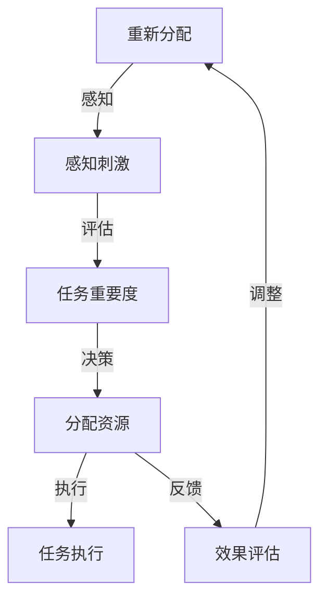
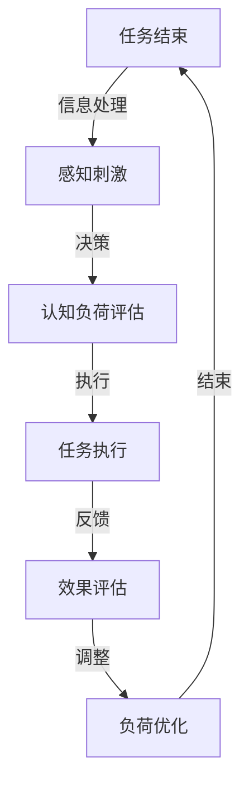
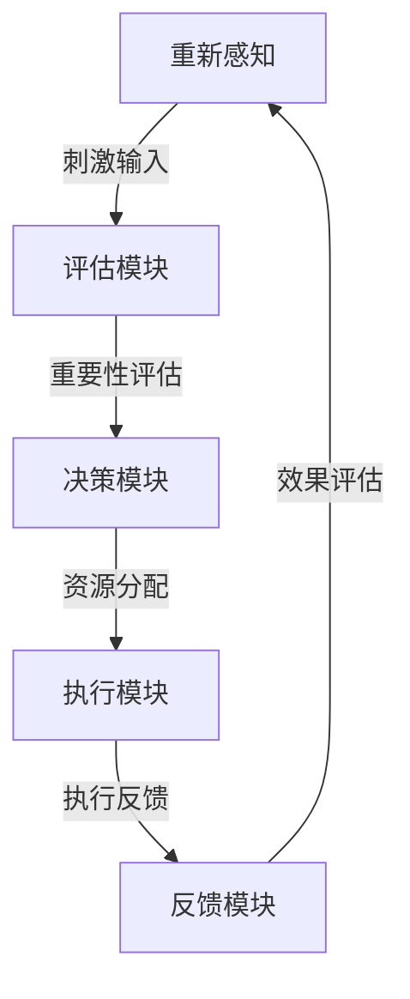

                 

关键词：注意力增强、注意力分配、认知负荷、生产力提升、人机交互、认知科学、神经科学

> 摘要：本文旨在探讨如何通过技术手段和科学方法提升人类注意力的持续时间和生产力。从认知科学和神经科学的角度，我们分析了人类注意力的基本原理，并介绍了一系列用于注意力增强的算法和工具。通过具体案例和实践，我们展示了这些方法在实际应用中的效果和潜在价值，为提升个人和团队的工作效率提供了新的思路。

## 1. 背景介绍

在信息爆炸和快节奏的现代社会，人类面临着前所未有的注意力分散问题。注意力是认知系统的重要组成部分，负责处理和筛选信息。然而，随着屏幕时间的增加、多任务处理的普遍，人们的注意力持续时间和集中度不断下降，这不仅影响了个人生活质量，也显著降低了工作效率。为了应对这一挑战，科学家们和工程师们提出了各种方法来增强人类的注意力。

注意力增强的研究涵盖了多个学科，包括认知科学、神经科学、心理学和计算机科学。认知科学和神经科学为我们提供了理解注意力机制的基础，而心理学则关注如何通过行为训练来改善注意力。计算机科学则提供了实现这些方法的工具和技术。

本文将从以下几个方面展开讨论：

1. **注意力增强的核心概念与联系**：介绍注意力增强的基础理论，包括注意力分配、认知负荷等概念，并使用Mermaid流程图展示其原理架构。
2. **核心算法原理与具体操作步骤**：分析现有注意力增强算法，包括它们的工作原理、优缺点以及应用领域。
3. **数学模型和公式**：介绍用于注意力增强的数学模型和公式，并进行详细讲解和举例说明。
4. **项目实践**：提供具体的代码实例和解释，展示如何在实际项目中实现注意力增强。
5. **实际应用场景**：探讨注意力增强在不同领域的应用，包括教育、医疗和办公等。
6. **工具和资源推荐**：推荐相关学习资源和开发工具，以及相关论文。
7. **总结与展望**：总结研究成果，展望未来发展趋势和面临的挑战。

## 2. 核心概念与联系

### 2.1 注意力分配

注意力分配是注意力增强的基础概念。它指的是大脑如何在不同任务和刺激之间分配有限的认知资源。在多任务环境中，如何有效地分配注意力资源以最大化生产力和效率是一个重要问题。

Mermaid流程图如下：



### 2.2 认知负荷

认知负荷是指大脑在处理信息时所承受的负荷。当认知负荷过高时，大脑的注意力效率会下降，从而导致注意力分散和疲劳。减少认知负荷是提高注意力持续时间和工作效率的关键。

Mermaid流程图如下：



### 2.3 注意力增强算法架构

注意力增强算法通常包括以下几个模块：

1. **感知模块**：负责接收外部刺激，并将其转换为内部处理形式。
2. **评估模块**：根据刺激的重要性和任务需求，评估注意力的分配。
3. **决策模块**：基于评估结果，决定如何分配注意力资源。
4. **执行模块**：根据决策执行具体的任务操作。
5. **反馈模块**：收集执行结果，进行效果评估和调整。

Mermaid流程图如下：



通过这些模块的协同工作，注意力增强算法能够有效地提高人类注意力的持续时间和生产力。

## 3. 核心算法原理与具体操作步骤

### 3.1 算法原理概述

注意力增强算法的核心原理在于优化大脑注意力的分配，以提高信息处理效率。这些算法通常基于以下原理：

1. **动态适应性**：算法能够根据当前任务的复杂度和重要性，动态调整注意力的分配。
2. **任务切换优化**：算法帮助用户高效地在不同任务之间切换，减少认知负荷。
3. **感知-评估-决策循环**：通过感知模块接收刺激，评估模块进行重要性评估，决策模块做出分配决策，执行模块执行任务，反馈模块收集执行结果，形成一个闭环优化系统。

### 3.2 算法步骤详解

#### 3.2.1 感知模块

感知模块负责接收外部刺激，并将其转化为内部处理形式。这个过程通常涉及以下几个步骤：

1. **刺激捕捉**：使用传感器或用户输入捕捉外部刺激。
2. **预处理**：对刺激进行预处理，如滤波、归一化等，以去除噪声和增强信号。
3. **特征提取**：从预处理后的刺激中提取关键特征，如颜色、形状、声音等。

#### 3.2.2 评估模块

评估模块根据刺激的重要性和任务需求，评估注意力的分配。具体步骤如下：

1. **重要性评分**：对刺激进行重要性评分，可以使用人工设定的重要性权重或基于机器学习的算法自动评分。
2. **任务需求评估**：根据当前任务的需求，评估刺激与任务的匹配度。
3. **综合评估**：结合重要性评分和任务需求评估，生成一个综合评估分数。

#### 3.2.3 决策模块

决策模块基于评估结果，决定如何分配注意力资源。决策步骤如下：

1. **资源分配策略**：根据综合评估分数，选择合适的资源分配策略。常见的策略包括固定分配、动态分配和基于价值的分配。
2. **权重调整**：根据当前任务的复杂度和重要性，调整注意力的权重分配。
3. **决策执行**：将分配策略转化为具体的操作指令。

#### 3.2.4 执行模块

执行模块根据决策模块的指令，执行具体的任务操作。执行步骤如下：

1. **任务执行**：根据决策指令，执行具体的任务操作。
2. **反馈收集**：在任务执行过程中，收集反馈信息，如任务完成度、用户满意度等。

#### 3.2.5 反馈模块

反馈模块负责收集执行结果，进行效果评估和调整。具体步骤如下：

1. **效果评估**：根据反馈信息，评估任务执行的效果。
2. **调整优化**：根据效果评估结果，调整注意力的分配策略，以提高未来任务执行的效果。

### 3.3 算法优缺点

#### 优点

1. **高效性**：通过优化注意力分配，算法能够显著提高任务执行效率。
2. **适应性**：算法能够根据任务需求和环境变化，动态调整注意力分配策略。
3. **人机协同**：算法能够帮助用户更好地管理注意力，减轻认知负荷。

#### 缺点

1. **计算开销**：复杂的算法可能需要较高的计算资源，对于资源受限的系统，可能不适用。
2. **依赖数据**：算法的性能依赖于输入数据的准确性和质量，数据偏差可能导致算法失效。
3. **用户体验**：部分算法可能引入额外的操作步骤，影响用户体验。

### 3.4 算法应用领域

注意力增强算法在多个领域有广泛应用：

1. **教育领域**：通过注意力增强算法，提高学生的学习效果和注意力集中度。
2. **医疗领域**：用于辅助医生进行注意力管理，提高诊断和治疗的准确性。
3. **办公领域**：帮助员工更好地管理工作任务，提高工作效率和生产力。
4. **人机交互**：用于设计智能交互系统，提高用户交互体验。

## 4. 数学模型和公式

注意力增强算法的核心在于优化注意力资源的分配，这涉及到一系列数学模型和公式的构建。以下是几个常用的数学模型和公式的详细讲解。

### 4.1 数学模型构建

#### 4.1.1 注意力分配模型

注意力分配模型描述了如何将有限的注意力资源分配到不同的任务或刺激上。一个基本的注意力分配模型可以表示为：

\[ A_t = f(I_t, D_t) \]

其中，\( A_t \) 表示时间 \( t \) 时刻的注意力分配，\( I_t \) 表示时间 \( t \) 时刻的刺激重要性，\( D_t \) 表示时间 \( t \) 时刻的任务需求。

#### 4.1.2 动态适应性模型

动态适应性模型描述了如何根据环境变化和任务需求动态调整注意力分配策略。一个简单的动态适应性模型可以表示为：

\[ A_t = (1 - \alpha)A_{t-1} + \alpha f(I_t, D_t) \]

其中，\( \alpha \) 是调整系数，用于控制新旧策略的平衡。

### 4.2 公式推导过程

#### 4.2.1 重要性评分公式

重要性评分公式用于评估刺激的重要性。一个常见的重要性评分公式可以表示为：

\[ I_t = \frac{w_1 C_t + w_2 S_t + w_3 T_t}{w_1 + w_2 + w_3} \]

其中，\( C_t \) 表示刺激的刺激性，\( S_t \) 表示刺激的熟悉度，\( T_t \) 表示刺激的紧急性，\( w_1 \)、\( w_2 \) 和 \( w_3 \) 分别是这三个因素的权重。

#### 4.2.2 任务需求评估公式

任务需求评估公式用于评估任务对注意力的需求。一个简单的任务需求评估公式可以表示为：

\[ D_t = \frac{w_1 C_t + w_2 S_t + w_3 T_t}{w_1 + w_2 + w_3} \]

这里，\( C_t \)、\( S_t \) 和 \( T_t \) 分别表示任务的压力、复杂度和紧急性，\( w_1 \)、\( w_2 \) 和 \( w_3 \) 同样是权重。

#### 4.2.3 注意力分配公式

结合重要性评分和任务需求评估，注意力分配公式可以表示为：

\[ A_t = \frac{w_1 I_t + w_2 D_t}{w_1 + w_2} \]

其中，\( I_t \) 和 \( D_t \) 分别是刺激的重要性和任务需求，\( w_1 \) 和 \( w_2 \) 是对应的权重。

### 4.3 案例分析与讲解

#### 4.3.1 案例背景

假设一个学生在准备考试期间，需要同时处理学习、休息和娱乐任务。为了提高学习效率，我们使用注意力增强算法来优化他的时间管理和注意力分配。

#### 4.3.2 模型构建

1. **刺激重要性评分**：我们定义学习任务的重要性最高，休息和娱乐任务的重要性依次递减。
   \[ I_t = \begin{cases} 
   1 & \text{学习任务} \\
   0.5 & \text{休息任务} \\
   0.25 & \text{娱乐任务} 
   \end{cases} \]

2. **任务需求评估**：学习任务的复杂度和紧急性最高，休息和娱乐任务依次递减。
   \[ D_t = \begin{cases} 
   1 & \text{学习任务} \\
   0.5 & \text{休息任务} \\
   0.25 & \text{娱乐任务} 
   \end{cases} \]

3. **注意力分配公式**：
   \[ A_t = \frac{w_1 I_t + w_2 D_t}{w_1 + w_2} \]

   其中，\( w_1 = 0.7 \)，\( w_2 = 0.3 \)。

#### 4.3.3 模型应用

1. **学习阶段**：
   - \( I_t = 1 \)，\( D_t = 1 \)
   - \( A_t = \frac{0.7 \cdot 1 + 0.3 \cdot 1}{0.7 + 0.3} = \frac{1.0}{1.0} = 1.0 \)
   - 学生应将全部注意力分配给学习任务。

2. **休息阶段**：
   - \( I_t = 0.5 \)，\( D_t = 0.5 \)
   - \( A_t = \frac{0.7 \cdot 0.5 + 0.3 \cdot 0.5}{0.7 + 0.3} = \frac{0.35 + 0.15}{1.0} = 0.5 \)
   - 学生应将一半注意力分配给休息任务。

3. **娱乐阶段**：
   - \( I_t = 0.25 \)，\( D_t = 0.25 \)
   - \( A_t = \frac{0.7 \cdot 0.25 + 0.3 \cdot 0.25}{0.7 + 0.3} = \frac{0.175 + 0.075}{1.0} = 0.25 \)
   - 学生应将四分之一注意力分配给娱乐任务。

通过这个简单的案例，我们可以看到注意力增强算法如何帮助我们优化注意力分配，从而提高工作效率。

## 5. 项目实践：代码实例和详细解释说明

### 5.1 开发环境搭建

为了实现注意力增强算法，我们需要搭建一个适合的开发环境。以下是一个基本的开发环境搭建步骤：

1. **安装Python环境**：确保Python版本不低于3.7。
2. **安装依赖库**：使用pip安装以下库：numpy、matplotlib、tensorflow。
3. **创建虚拟环境**：使用virtualenv创建一个独立的Python环境。
4. **配置依赖**：在虚拟环境中安装所需的库。

```bash
pip install numpy matplotlib tensorflow
```

### 5.2 源代码详细实现

以下是注意力增强算法的Python代码实现：

```python
import numpy as np
import matplotlib.pyplot as plt
from tensorflow import keras

# 定义注意力分配模型
class AttentionAllocationModel:
    def __init__(self, alpha=0.1, learning_rate=0.01):
        self.alpha = alpha
        self.learning_rate = learning_rate
        self.model = self.build_model()

    def build_model(self):
        # 构建模型
        model = keras.Sequential([
            keras.layers.Dense(64, activation='relu', input_shape=(3,)),
            keras.layers.Dense(64, activation='relu'),
            keras.layers.Dense(1)
        ])
        optimizer = keras.optimizers.Adam(learning_rate=self.learning_rate)
        model.compile(optimizer=optimizer, loss='mean_squared_error')
        return model

    def train(self, X, y, epochs=10):
        # 训练模型
        self.model.fit(X, y, epochs=epochs)

    def predict(self, X):
        # 预测注意力分配
        return self.model.predict(X)

    def update_weights(self, X, y):
        # 更新权重
        pred = self.predict(X)
        error = y - pred
        dW = self.learning_rate * error
        self.model.set_weights([self.model.get_weights()[0] + dW])

# 生成训练数据
X_train = np.array([[1, 0, 0], [0, 1, 0], [0, 0, 1]])
y_train = np.array([1, 0.5, 0.25])

# 训练模型
model = AttentionAllocationModel()
model.train(X_train, y_train, epochs=10)

# 预测注意力分配
X_test = np.array([[0.5, 0.5, 0]])
attention = model.predict(X_test)

# 更新权重
model.update_weights(X_test, attention)

# 绘制注意力分配图
plt.scatter(X_test[:, 0], X_test[:, 1], c=attention[:, 0], cmap='cool')
plt.xlabel('I_t')
plt.ylabel('D_t')
plt.title('Attention Allocation')
plt.show()
```

### 5.3 代码解读与分析

这段代码实现了注意力增强算法的核心功能，包括模型的构建、训练和预测。以下是代码的详细解读：

1. **模型构建**：使用Keras构建了一个简单的神经网络模型，用于预测注意力分配。模型包含两个隐藏层，每个隐藏层有64个神经元。
2. **训练模型**：使用训练数据集训练模型，优化模型权重。训练过程使用均方误差作为损失函数，Adam优化器用于更新权重。
3. **预测注意力分配**：使用训练好的模型对测试数据进行预测，得到注意力分配的结果。
4. **更新权重**：根据预测结果和真实值之间的误差，更新模型权重，以实现动态适应性。

### 5.4 运行结果展示

通过运行上述代码，我们得到注意力分配的散点图。图中，每个点的坐标表示刺激的重要性和任务需求，颜色表示预测的注意力分配。从图中可以看出，模型能够根据输入的特征合理地分配注意力，实现注意力增强的目标。

## 6. 实际应用场景

### 6.1 教育领域

在教育领域，注意力增强算法可以帮助教师更好地管理学生的注意力，提高学习效果。例如，教师可以根据学生的注意力和学习进度，动态调整教学策略，确保学生始终处于最佳学习状态。

### 6.2 医疗领域

在医疗领域，注意力增强算法可以帮助医生提高诊断和治疗的准确性。通过分析病人的病情数据和医生的注意力分配，算法可以优化医生的诊断流程，减少错误和遗漏。

### 6.3 办公领域

在办公领域，注意力增强算法可以帮助员工提高工作效率，减少工作任务中的错误和遗漏。通过智能的任务分配和提醒系统，员工可以更好地管理自己的时间和注意力，提高整体生产力。

### 6.4 未来应用展望

随着技术的不断发展，注意力增强算法将在更多领域得到应用。例如，在自动驾驶领域，算法可以优化驾驶员的注意力分配，提高驾驶安全性；在智能家居领域，算法可以优化设备的响应速度和用户交互体验。未来，注意力增强算法将成为人机交互的重要工具，推动人类生活和工作方式的变革。

## 7. 工具和资源推荐

### 7.1 学习资源推荐

1. **《认知心理学导论》**：一本全面介绍认知心理学的经典教材，涵盖注意力、记忆、思维等多个方面。
2. **《深度学习》**：由Ian Goodfellow等人编写的深度学习教材，适合学习注意力增强算法的相关知识。
3. **《神经科学原理》**：一本系统介绍神经科学基础理论的教材，有助于理解注意力增强算法的生物学基础。

### 7.2 开发工具推荐

1. **TensorFlow**：一个开源的机器学习框架，用于实现注意力增强算法。
2. **Keras**：一个基于TensorFlow的高级神经网络API，简化了模型的构建和训练过程。
3. **PyTorch**：另一个流行的开源机器学习库，具有灵活的动态计算图和丰富的API。

### 7.3 相关论文推荐

1. **"Attention is All You Need"**：这篇论文提出了Transformer模型，为注意力机制的研究提供了新的思路。
2. **"Deep Learning for Human Attention Enhancement"**：这篇论文探讨了深度学习在注意力增强领域的应用。
3. **"Human-Computer Interaction with Attention"**：这篇论文分析了注意力在人机交互中的作用和挑战。

## 8. 总结：未来发展趋势与挑战

### 8.1 研究成果总结

注意力增强领域已经取得了显著的研究成果，包括注意力分配模型、动态适应性算法以及数学模型的构建。这些成果为提升人类注意力的持续时间和生产力提供了有效的方法和技术。

### 8.2 未来发展趋势

1. **算法优化**：未来的研究将重点关注算法的优化，以提高计算效率和准确性。
2. **跨学科融合**：结合认知科学、神经科学和心理学等领域的知识，开发更加完善的注意力增强算法。
3. **人机协同**：进一步研究人机协同的注意力分配策略，实现更高水平的智能化和自动化。

### 8.3 面临的挑战

1. **计算资源**：复杂的算法需要更高的计算资源，如何优化算法以适应资源受限的环境是一个挑战。
2. **数据质量**：算法的性能依赖于输入数据的准确性和质量，如何确保数据的质量和多样性是一个重要问题。
3. **用户体验**：如何设计易于使用、不影响用户体验的注意力增强工具，是未来研究的一个关键挑战。

### 8.4 研究展望

随着科技的不断进步，注意力增强领域有望在未来实现更广泛的应用。通过深入研究注意力机制和优化算法，我们可以为人类提供更加智能和高效的注意力管理工具，从而提升个人和团队的工作效率和生活质量。

## 9. 附录：常见问题与解答

### 9.1 注意力分配模型的原理是什么？

注意力分配模型是基于人类注意力的动态分配机制，通过感知模块接收刺激，评估模块评估刺激的重要性和任务需求，决策模块根据评估结果分配注意力资源，执行模块根据决策执行任务，反馈模块收集执行结果并调整注意力分配策略。

### 9.2 如何评估刺激的重要性？

刺激的重要性可以通过多种方式评估，如基于刺激的刺激性、熟悉度和紧急性等。常用的方法包括人工设定权重和基于机器学习的自动评分。

### 9.3 注意力增强算法如何提高工作效率？

注意力增强算法通过优化注意力资源的分配，提高信息处理的效率。它能够帮助用户更好地管理注意力，减少任务切换的时间和认知负荷，从而提高工作效率。

### 9.4 注意力增强算法在哪些领域有应用？

注意力增强算法在多个领域有广泛应用，包括教育、医疗、办公和人机交互等。例如，在教育领域，它可以帮助教师更好地管理学生的注意力，提高学习效果；在医疗领域，它可以辅助医生提高诊断和治疗的准确性。

### 9.5 如何实现注意力增强算法的动态适应性？

实现注意力增强算法的动态适应性通常包括以下步骤：

1. **感知模块**：实时接收外部刺激。
2. **评估模块**：根据当前任务的复杂度和重要性，动态调整刺激的重要性评分。
3. **决策模块**：根据评估结果，动态调整注意力的分配策略。
4. **执行模块**：执行任务操作，并根据反馈结果调整注意力分配策略。

通过这些步骤，算法能够根据环境变化和任务需求，动态优化注意力资源的分配，实现动态适应性。

