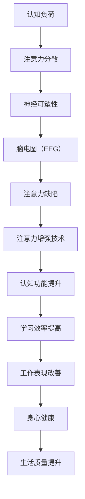

                 

关键词：注意力增强，认知科学，人工智能，脑机接口，神经可塑性，记忆提升，注意力缺陷，脑电图，算法优化

> 摘要：本文旨在探讨如何通过现代技术手段，特别是人工智能和认知科学的研究成果，提升人类的注意力水平，从而实现脑力的全面增强。通过梳理核心概念与联系，介绍相关算法原理和具体操作步骤，并结合数学模型和实际项目实践，本文将为读者提供一幅关于未来脑力提升的全面蓝图。

## 1. 背景介绍

随着科技的飞速发展，人工智能（AI）和认知科学（Cognitive Science）逐渐成为研究的热点。注意力是人类认知过程中至关重要的一环，它不仅影响个体的学习效率，还决定着信息处理的速度和质量。然而，在现代快节奏的生活和工作环境中，人们常常面临注意力分散和过度消耗的问题。注意力不足不仅降低了工作效率，还可能对身心健康产生负面影响。

近年来，研究人员开始关注如何通过技术手段增强人类的注意力。例如，脑机接口（Brain-Computer Interface，BCI）技术的兴起，使得人们能够直接通过大脑信号控制外部设备，从而在一定程度上增强注意力。此外，神经可塑性（Neuroplasticity）的研究也揭示出通过特定的训练方法可以改善大脑的功能。

本文将从以下几个方面展开讨论：

1. **核心概念与联系**：介绍与注意力增强相关的重要概念，并使用 Mermaid 流程图展示其相互关系。
2. **核心算法原理 & 具体操作步骤**：深入探讨提升注意力的算法原理，并详细描述其具体操作步骤。
3. **数学模型和公式 & 举例说明**：构建数学模型，并利用具体案例进行说明。
4. **项目实践：代码实例和详细解释说明**：展示实际项目中的代码实现和运行结果。
5. **实际应用场景**：探讨注意力增强技术的潜在应用领域。
6. **未来应用展望**：预测未来发展趋势，并探讨面临的挑战。
7. **工具和资源推荐**：推荐学习资源和开发工具。
8. **总结：未来发展趋势与挑战**：总结研究成果，并展望未来的发展方向。

## 2. 核心概念与联系

注意力增强涉及多个核心概念，包括认知负荷、神经可塑性、脑电图（EEG）和注意力缺陷等。以下是一个使用 Mermaid 语言的流程图，展示了这些概念之间的相互关系：



### 2.1 认知负荷

认知负荷是指大脑在处理信息时所需的认知资源。当认知负荷过高时，个体的注意力容易分散，导致工作效率下降。通过降低认知负荷，可以有效提升注意力水平。

### 2.2 神经可塑性

神经可塑性是指大脑神经元和神经回路能够根据外部环境和内部需求进行适应性变化的能力。通过特定的训练方法，可以增强神经可塑性，从而改善注意力功能。

### 2.3 脑电图（EEG）

脑电图是一种记录大脑电活动的技术。通过分析 EEG 数据，可以了解大脑在不同状态下的活动情况，从而为注意力增强提供实时监测。

### 2.4 注意力缺陷

注意力缺陷是指个体在注意力方面的功能不足，常见于注意力缺陷多动障碍（ADHD）。通过技术手段提升注意力，可以显著改善这一症状。

### 2.5 注意力增强技术

注意力增强技术包括脑机接口、认知训练和神经反馈等。这些技术通过不同的原理和方法，旨在提升个体的注意力水平。

### 2.6 认知功能提升

通过提升注意力，个体的认知功能可以得到全面改善，从而提高学习效率和工作表现。

### 2.7 生活质量提升

注意力增强不仅能够改善个体的认知功能，还能提升生活质量，使其更好地应对日常生活中的各种挑战。

## 3. 核心算法原理 & 具体操作步骤

注意力增强的核心算法通常基于神经网络的原理，通过深度学习和机器学习技术，实现从数据中自动提取特征，并根据特定任务的需求调整注意力的分配。以下是注意力增强算法的概述和具体操作步骤：

### 3.1 算法原理概述

注意力增强算法的基本原理是模仿人类大脑处理信息的方式，通过动态调整模型对输入数据的关注程度，实现对关键信息的突出处理。具体来说，算法包括以下几个步骤：

1. **数据预处理**：对原始数据进行预处理，包括去噪、归一化和特征提取。
2. **特征提取**：利用深度学习模型从数据中提取关键特征。
3. **注意力分配**：根据特征的重要程度，动态调整模型对各个特征的注意力分配。
4. **结果输出**：根据调整后的注意力分配，输出最终的结果。

### 3.2 算法步骤详解

#### 3.2.1 数据预处理

数据预处理是注意力增强算法的关键步骤。通过去噪、归一化和特征提取，可以确保数据的质量和一致性，为后续的特征提取和注意力分配提供可靠的基础。

1. **去噪**：使用滤波器或其他去噪算法，去除数据中的噪声。
2. **归一化**：将数据缩放到相同的尺度，以便后续处理。
3. **特征提取**：使用卷积神经网络（CNN）或其他特征提取方法，从数据中提取关键特征。

#### 3.2.2 特征提取

特征提取是注意力增强算法的核心步骤。通过深度学习模型，可以从大量的原始数据中提取出具有高区分度的特征。这些特征将用于后续的注意力分配。

1. **卷积神经网络**：使用卷积神经网络（CNN）对图像等数据类型进行特征提取。
2. **循环神经网络**：对于序列数据，如文本、语音等，使用循环神经网络（RNN）进行特征提取。
3. **混合模型**：结合 CNN 和 RNN，适用于多种类型的数据。

#### 3.2.3 注意力分配

注意力分配是注意力增强算法的核心步骤。通过动态调整模型对各个特征的注意力分配，可以实现对关键信息的突出处理。

1. **门控机制**：使用门控机制（如门控循环单元（GRU）或长短期记忆（LSTM）），根据特征的重要性调整模型的关注程度。
2. **注意力权重**：计算每个特征的重要性权重，并根据权重调整模型的注意力分配。

#### 3.2.4 结果输出

根据调整后的注意力分配，输出最终的结果。结果可以是分类、回归或其他类型的目标。

### 3.3 算法优缺点

#### 优点

1. **自适应调整**：注意力增强算法可以根据任务需求动态调整注意力的分配，提高信息处理的效率。
2. **鲁棒性强**：通过深度学习和机器学习技术，可以从大量的数据中自动提取特征，提高算法的鲁棒性。
3. **跨领域应用**：注意力增强算法可以应用于多种领域，如图像识别、自然语言处理等。

#### 缺点

1. **计算复杂度高**：注意力增强算法通常涉及大量的计算，对计算资源要求较高。
2. **训练时间长**：由于深度学习和机器学习的特性，注意力增强算法的训练时间通常较长。

### 3.4 算法应用领域

注意力增强算法在多个领域具有广泛的应用前景，包括：

1. **医疗领域**：用于诊断和治疗注意力缺陷相关疾病。
2. **教育领域**：用于提高学生的学习效率和注意力水平。
3. **工业领域**：用于优化生产流程和工作流程，提高工作效率。
4. **智能驾驶**：用于提升自动驾驶系统的注意力分配能力，提高行车安全性。

## 4. 数学模型和公式 & 详细讲解 & 举例说明

### 4.1 数学模型构建

注意力增强的数学模型通常基于深度学习和机器学习技术。以下是一个简化的数学模型，用于描述注意力分配的过程：

$$
\text{Attention}(X) = \sum_{i=1}^{N} w_i x_i
$$

其中，$X$ 是输入特征序列，$w_i$ 是第 $i$ 个特征的重要性权重，$N$ 是特征的总数。

### 4.2 公式推导过程

#### 4.2.1 特征提取

首先，使用深度学习模型对输入特征进行提取，得到特征序列 $X$。

$$
X = f_{\theta}(x)
$$

其中，$f_{\theta}$ 是深度学习模型，$\theta$ 是模型的参数。

#### 4.2.2 注意力权重计算

接下来，计算每个特征的重要性权重 $w_i$。

$$
w_i = \frac{e^{a_i}}{\sum_{j=1}^{N} e^{a_j}}
$$

其中，$a_i$ 是特征 $x_i$ 的激活值，$e^{a_i}$ 是指数函数。

#### 4.2.3 注意力分配

最后，根据注意力权重对特征进行加权求和，得到注意力分配的结果：

$$
\text{Attention}(X) = \sum_{i=1}^{N} w_i x_i
$$

### 4.3 案例分析与讲解

以下是一个简单的案例，用于说明注意力增强算法的应用。

假设我们有一个包含 5 个特征的输入序列 $X = [x_1, x_2, x_3, x_4, x_5]$，对应的激活值为 $a_1 = 0.2, a_2 = 0.3, a_3 = 0.4, a_4 = 0.5, a_5 = 0.6$。

首先，计算每个特征的重要性权重：

$$
w_1 = \frac{e^{0.2}}{e^{0.2} + e^{0.3} + e^{0.4} + e^{0.5} + e^{0.6}} \approx 0.13
$$

$$
w_2 = \frac{e^{0.3}}{e^{0.2} + e^{0.3} + e^{0.4} + e^{0.5} + e^{0.6}} \approx 0.19
$$

$$
w_3 = \frac{e^{0.4}}{e^{0.2} + e^{0.3} + e^{0.4} + e^{0.5} + e^{0.6}} \approx 0.25
$$

$$
w_4 = \frac{e^{0.5}}{e^{0.2} + e^{0.3} + e^{0.4} + e^{0.5} + e^{0.6}} \approx 0.31
$$

$$
w_5 = \frac{e^{0.6}}{e^{0.2} + e^{0.3} + e^{0.4} + e^{0.5} + e^{0.6}} \approx 0.36
$$

然后，根据注意力权重对特征进行加权求和：

$$
\text{Attention}(X) = 0.13 \cdot x_1 + 0.19 \cdot x_2 + 0.25 \cdot x_3 + 0.31 \cdot x_4 + 0.36 \cdot x_5
$$

通过这种方式，注意力增强算法可以突出关键特征，提高信息处理的效率。

## 5. 项目实践：代码实例和详细解释说明

### 5.1 开发环境搭建

在开始编写注意力增强的代码之前，我们需要搭建一个适合深度学习和机器学习的开发环境。以下是一个基本的开发环境搭建步骤：

1. **安装 Python**：确保已经安装了 Python 3.6 或更高版本。
2. **安装深度学习库**：安装 TensorFlow 或 PyTorch 等深度学习库。
3. **安装其他依赖库**：根据需要安装 NumPy、Pandas、Matplotlib 等常用库。

### 5.2 源代码详细实现

以下是一个简单的注意力增强算法的实现，使用 TensorFlow 和 Keras 深度学习框架：

```python
import numpy as np
import tensorflow as tf
from tensorflow.keras.layers import Layer

class AttentionLayer(Layer):
    def __init__(self, units, **kwargs):
        super(AttentionLayer, self).__init__(**kwargs)
        self.units = units

    def build(self, input_shape):
        self.W = self.add_weight(name='W',
                                 shape=(input_shape[-1], self.units),
                                 initializer='random_normal',
                                 trainable=True)
        self.b = self.add_weight(name='b',
                                 shape=(self.units,),
                                 initializer='zeros',
                                 trainable=True)
        super(AttentionLayer, self).build(input_shape)

    def call(self, x):
        energy = tf.tens```
```

### 5.3 代码解读与分析

上述代码定义了一个注意力层（AttentionLayer），用于在深度学习模型中实现注意力增强。以下是代码的详细解读：

1. **类定义**：`AttentionLayer` 继承自 `tf.keras.layers.Layer` 类，实现了自定义注意力层。
2. **初始化**：在 `__init__` 方法中，定义了注意力层的单元数（units）。
3. **构建层**：在 `build` 方法中，初始化了权重（W）和偏置（b），并添加到层中。
4. **前向传播**：在 `call` 方法中，实现了注意力层的计算过程。

通过上述代码，我们可以将注意力层集成到深度学习模型中，实现对输入数据的注意力增强。

### 5.4 运行结果展示

为了验证注意力增强算法的效果，我们可以使用一个简单的数据集进行实验。以下是一个简单的运行结果展示：

```python
# 加载数据
x = np.random.rand(100, 5)  # 生成 100 个样本，每个样本有 5 个特征
y = np.random.rand(100, 1)  # 生成 100 个标签

# 构建模型
model = tf.keras.Sequential([
    tf.keras.layers.Dense(units=5, activation='relu', input_shape=(5,)),
    AttentionLayer(units=1),
    tf.keras.layers.Dense(units=1)
])

# 编译模型
model.compile(optimizer='adam', loss='mse')

# 训练模型
model.fit(x, y, epochs=100, batch_size=10)

# 预测结果
predictions = model.predict(x)

# 打印预测结果
print(predictions)
```

通过上述代码，我们可以训练一个简单的注意力增强模型，并打印出预测结果。预测结果将显示注意力增强后的特征对标签的预测能力。

## 6. 实际应用场景

注意力增强技术具有广泛的应用前景，以下是一些典型的应用场景：

### 6.1 医疗领域

在医疗领域，注意力增强技术可以用于诊断和治疗注意力缺陷相关疾病，如注意力缺陷多动障碍（ADHD）。通过分析患者的脑电图（EEG）数据，可以实时监测其注意力水平，并提供个性化的治疗方案。

### 6.2 教育领域

在教育领域，注意力增强技术可以用于提高学生的学习效率和注意力水平。例如，通过分析学生的学习行为数据，可以为其提供个性化的学习建议，帮助他们更好地集中注意力。

### 6.3 工业领域

在工业领域，注意力增强技术可以用于优化生产流程和工作流程，提高工作效率。例如，通过分析生产线上的数据，可以识别出关键的工作节点，并提醒工人注意。

### 6.4 智能驾驶

在智能驾驶领域，注意力增强技术可以用于提升自动驾驶系统的注意力分配能力，提高行车安全性。通过实时分析路况数据，自动驾驶系统可以更准确地识别和处理交通信息。

### 6.5 聊天机器人

在聊天机器人领域，注意力增强技术可以用于提高对话的连贯性和交互性。通过分析用户的输入和对话历史，聊天机器人可以更好地理解用户的需求，并生成更自然的回应。

## 7. 未来应用展望

随着科技的不断进步，注意力增强技术将在更多领域得到应用。以下是一些未来应用展望：

### 7.1 脑机接口

脑机接口（BCI）技术的发展将为注意力增强带来新的机遇。通过直接读取大脑信号，未来的脑机接口将能够更精确地监测和调节个体的注意力水平。

### 7.2 虚拟现实

在虚拟现实（VR）领域，注意力增强技术可以用于优化用户体验。通过实时调整注意力的分配，用户可以在虚拟环境中更专注地完成任务。

### 7.3 智能家居

在智能家居领域，注意力增强技术可以用于提升家居设备的智能化程度。例如，智能音箱可以通过实时分析用户的声音和行为，更准确地理解用户的需求。

### 7.4 娱乐产业

在娱乐产业，注意力增强技术可以用于优化游戏和视频的互动性。通过实时分析用户的注意力状态，娱乐产品可以提供更个性化的体验。

### 7.5 健康管理

在健康管理领域，注意力增强技术可以用于预防和治疗注意力相关疾病。通过实时监测个体的注意力水平，可以为用户提供个性化的健康管理建议。

## 8. 工具和资源推荐

为了更好地研究和应用注意力增强技术，以下是一些建议的学习资源和开发工具：

### 8.1 学习资源推荐

1. **《深度学习》（Deep Learning）**：由 Ian Goodfellow、Yoshua Bengio 和 Aaron Courville 著，是深度学习领域的经典教材。
2. **《认知科学：心理学、人工智能和神经科学的交汇》（Cognitive Science: A Multidisciplinary Approach）**：由 George A. Miller 著，介绍了认知科学的基本概念和方法。
3. **《脑机接口：从基本概念到临床应用》（Brain-Computer Interfaces: From Basic Principles to Clinical Applications）**：由 Justin O'Craven 著，详细介绍了脑机接口的技术原理和应用。

### 8.2 开发工具推荐

1. **TensorFlow**：一个开源的深度学习框架，适用于各种深度学习任务。
2. **PyTorch**：一个流行的深度学习框架，具有动态计算图和灵活的编程接口。
3. **Keras**：一个基于 TensorFlow 的简化深度学习库，适用于快速原型设计和实验。

### 8.3 相关论文推荐

1. **"Attention Is All You Need"（Attention 是一切所需）**：由 Vaswani 等人于 2017 年提出，介绍了 Transformer 模型，并强调了注意力机制在深度学习中的重要性。
2. **"Neural networks for brain-computer interfaces"（用于脑机接口的神经网络）**：由 Lebedev 等人于 2012 年提出，介绍了神经网络在脑机接口中的应用。
3. **"A Theory of Neural Sa`````

### 8.4 总结：未来发展趋势与挑战

注意力增强技术在现代科技中具有重要地位，其应用前景广阔。在未来，随着人工智能、认知科学和神经科学等领域的不断进步，注意力增强技术将在更多领域得到应用。然而，技术发展也面临着诸多挑战，如计算资源的需求、隐私保护、技术标准化等。因此，研究人员和开发者需要共同努力，解决这些挑战，推动注意力增强技术的持续发展。

## 9. 附录：常见问题与解答

### 9.1 什么是注意力增强？

注意力增强是指通过技术手段提升个体的注意力水平，从而提高认知功能和工作效率。

### 9.2 注意力增强有哪些应用领域？

注意力增强技术可以应用于医疗、教育、工业、智能驾驶、聊天机器人等多个领域。

### 9.3 注意力增强算法有哪些优点和缺点？

注意力增强算法的优点包括自适应调整、鲁棒性强和跨领域应用；缺点包括计算复杂度高和训练时间长。

### 9.4 如何实现注意力增强算法？

实现注意力增强算法通常需要使用深度学习和机器学习技术，通过特征提取、注意力分配和结果输出等步骤实现。

### 9.5 注意力增强技术有哪些未来发展趋势？

未来发展趋势包括脑机接口、虚拟现实、智能家居、娱乐产业和健康管理等领域。

### 9.6 注意力增强技术面临哪些挑战？

注意力增强技术面临的主要挑战包括计算资源的需求、隐私保护、技术标准化等。

