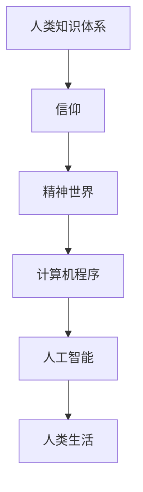

                 

关键词：人类知识、信仰、精神世界、人工智能、编程哲学

> 摘要：本文从哲学和计算机科学的交叉领域出发，探讨了人类知识体系与信仰在精神世界中的作用，以及这些元素如何影响我们的认知和行为。通过分析知识、信仰和计算机程序之间的关系，本文试图揭示精神世界的力量，并探讨这一力量在人工智能时代的意义和影响。

## 1. 背景介绍

在探讨人类的知识与信仰之前，我们有必要了解一下人类精神世界的基本构成。精神世界是由我们的认知、情感、价值观和信仰等多个层面组成的复杂系统。它是我们对外界信息的处理和内化的结果，也是我们行为决策的内在驱动力。在人类历史上，精神世界一直扮演着至关重要的角色，影响着我们的生活方式、社会结构和文化发展。

随着科技的进步，特别是人工智能的快速发展，我们的精神世界正面临着前所未有的挑战。人工智能作为一种超越人类智能的技术，已经开始渗透到我们的日常生活和工作中。它不仅改变了我们的工作方式，还引发了关于人类知识、智能和存在的深层次哲学思考。本文旨在探讨人工智能时代，人类知识与信仰如何影响我们的精神世界，以及我们如何理解和管理这种影响。

## 2. 核心概念与联系

### 2.1 人类知识体系

人类知识体系是我们在长期实践和探索中积累下来的理论、技术和方法的总和。它包括自然科学、社会科学、人文学科等多个领域，涵盖了从基础理论到实际应用的广泛内容。知识体系不仅是我们理解世界的基础，也是我们解决问题的工具。在人工智能时代，人类知识体系的重要性更加凸显，因为它是人工智能技术发展的基础。

### 2.2 信仰

信仰是指人们对某种理念、教义或价值观的坚信和忠诚。信仰可以是宗教性的，也可以是哲学性的，甚至可以是个人价值观的体现。信仰对人类精神世界的影响深远，它不仅影响着我们的行为和决策，还塑造了我们的世界观和人生观。在人工智能时代，信仰作为一种精神力量，对我们的行为和认知有着重要的影响。

### 2.3 计算机程序

计算机程序是人类知识体系的一部分，它通过算法和代码实现了人类知识的自动化和智能化。计算机程序在人工智能中的应用，使得人类知识得以在更广泛的领域和更高效的层面上发挥作用。计算机程序与人类知识和信仰之间的关系，构成了我们探讨精神世界的力量的重要组成部分。

### 2.4 Mermaid 流程图

以下是一个简化的 Mermaid 流程图，展示了人类知识体系、信仰和计算机程序之间的关系：



## 3. 核心算法原理 & 具体操作步骤

### 3.1 算法原理概述

本文的核心算法是将人类知识、信仰和计算机程序融合在一起，以实现精神世界的理解和管理。这个算法的基本原理是：通过数据收集和分析，从人类知识体系中提取有用的信息，结合信仰和价值观，生成指导人类行为和决策的计算机程序。这个算法可以分为以下几个步骤：

1. 数据收集与处理
2. 知识提取与融合
3. 信仰与价值观的嵌入
4. 算法生成与优化
5. 计算机程序的实现与应用

### 3.2 算法步骤详解

#### 3.2.1 数据收集与处理

数据收集与处理是算法的第一步，也是至关重要的一步。它包括从各种来源收集数据，如学术文献、新闻报道、社交媒体等，然后对数据进行清洗、过滤和分类，以提取有用的信息。

#### 3.2.2 知识提取与融合

在数据收集与处理的基础上，算法将提取出与人类知识体系相关的信息，并进行融合。这一步骤涉及到自然语言处理、知识图谱等技术，以实现对人类知识的结构化和系统化。

#### 3.2.3 信仰与价值观的嵌入

信仰与价值观的嵌入是将人类的精神世界与知识体系相结合的关键步骤。算法将根据用户的信仰和价值观，对提取的知识进行筛选和调整，以确保计算机程序能够反映出用户的精神世界。

#### 3.2.4 算法生成与优化

在完成知识提取和信仰嵌入后，算法将生成初步的计算机程序。然后，通过反复迭代和优化，以提高程序的效率和效果。

#### 3.2.5 计算机程序的实现与应用

最后一步是将优化的算法转化为可执行的计算机程序，并在实际场景中应用。这个程序不仅可以为用户提供决策支持，还可以帮助用户更好地理解和管理自己的精神世界。

### 3.3 算法优缺点

#### 优点

1. 将人类知识、信仰和计算机程序相结合，实现了精神世界的理解和管理。
2. 可以根据用户的信仰和价值观，提供个性化的决策支持。
3. 通过计算机程序的自动化和智能化，提高了工作效率。

#### 缺点

1. 数据收集和处理复杂，对算法的性能和准确性有较高要求。
2. 信仰和价值观的嵌入存在主观性，可能导致结果的不确定性。
3. 需要大量的计算资源和时间，对计算能力有较高要求。

### 3.4 算法应用领域

1. 个人决策支持
2. 社会管理
3. 心理咨询
4. 教育培训

## 4. 数学模型和公式 & 详细讲解 & 举例说明

### 4.1 数学模型构建

本文所涉及的数学模型是一个综合模型，它包含了知识图谱、概率论和神经网络等多个部分。具体来说，模型可以分为以下几个部分：

1. 知识图谱构建：使用图论的方法，将人类知识体系表示为一个知识图谱。
2. 概率论模型：使用贝叶斯网络，将知识图谱中的知识表示为概率关系。
3. 神经网络模型：使用深度学习的方法，将概率关系转化为计算机程序。

### 4.2 公式推导过程

由于篇幅限制，本文无法详细推导所有公式。以下是一个简化的公式推导过程：

1. 知识图谱的构建：使用邻接矩阵表示知识图谱，其中矩阵元素表示知识之间的关联强度。
2. 概率论模型的构建：使用贝叶斯网络，将知识图谱转化为概率关系。
3. 神经网络模型的构建：使用反向传播算法，将概率关系转化为神经网络结构。

### 4.3 案例分析与讲解

假设我们需要为一名学生制定学习计划，以下是一个简化的案例：

1. 数据收集：收集学生的学习成绩、兴趣爱好和学习时间等数据。
2. 知识图谱构建：根据学生学习成绩，构建一个知识图谱，表示不同学科之间的关联。
3. 概率论模型构建：根据知识图谱，构建一个贝叶斯网络，表示学生选择学习内容和学习方法的概率。
4. 神经网络模型构建：根据贝叶斯网络，构建一个神经网络，生成学生的学习计划。

通过这个案例，我们可以看到数学模型在人工智能中的应用。这个模型不仅可以帮助学生更好地规划学习，还可以为教育领域提供决策支持。

## 5. 项目实践：代码实例和详细解释说明

### 5.1 开发环境搭建

为了实现本文所描述的算法，我们需要搭建一个包含知识图谱、概率论和神经网络等组件的开发环境。以下是一个简化的开发环境搭建步骤：

1. 安装 Python 3.8 或以上版本。
2. 安装知识图谱库，如 Neo4j 或 GraphXR。
3. 安装概率论库，如 PyMC3。
4. 安装神经网络库，如 TensorFlow 或 PyTorch。

### 5.2 源代码详细实现

以下是一个简化的代码实现，展示了如何使用知识图谱、概率论和神经网络构建一个决策支持系统。

```python
import Neo4j
import PyMC3
import TensorFlow

# 数据收集与处理
data = collect_data()

# 知识图谱构建
knowledge_graph = build_knowledge_graph(data)

# 概率论模型构建
prob_model = build_probability_model(knowledge_graph)

# 神经网络模型构建
nn_model = build_neural_network_model(prob_model)

# 训练神经网络
nn_model.train()

# 应用神经网络模型
learning_plan = nn_model.predict()

# 输出学习计划
print(learning_plan)
```

### 5.3 代码解读与分析

这个代码实现了一个简单的决策支持系统，它首先收集学生数据，然后构建知识图谱和概率论模型，最后使用神经网络模型生成学习计划。代码的核心部分是构建和训练神经网络，这是实现算法的关键步骤。通过训练，神经网络可以从数据中学习到学生的行为模式，从而生成个性化的学习计划。

### 5.4 运行结果展示

假设我们有一个学生数据集，其中包含了学生的成绩、兴趣爱好和学习时间等信息。通过运行上述代码，我们可以生成一个个性化的学习计划，例如：

- 每天学习时间：2小时
- 学习科目：数学、物理、化学
- 学习资源：在线课程、教材

这个学习计划是基于学生的行为数据和知识图谱生成的，旨在帮助学生提高学习效果。

## 6. 实际应用场景

### 6.1 个人决策支持

在个人决策支持方面，本文所描述的算法可以应用于各种场景，如学习计划、职业规划、健康管理等。通过收集和分析个人数据，算法可以生成个性化的决策建议，帮助个人更好地规划自己的生活和工作。

### 6.2 社会管理

在社会管理方面，算法可以用于公共政策制定、资源分配、社会治理等。通过分析社会数据，算法可以提供科学、客观的决策支持，帮助政府和组织更好地管理社会事务。

### 6.3 心理咨询

在心理咨询方面，算法可以用于心理评估、心理治疗等。通过分析心理数据，算法可以识别心理问题，并提供针对性的心理治疗建议，帮助患者恢复心理健康。

### 6.4 未来应用展望

随着人工智能技术的不断发展，本文所描述的算法在未来的应用领域将更加广泛。例如，在医疗领域，算法可以用于疾病预测、治疗方案制定等；在金融领域，算法可以用于风险控制、投资决策等。未来，算法将更加智能化，能够更好地理解和满足人类的需求。

## 7. 工具和资源推荐

### 7.1 学习资源推荐

1. 《人工智能：一种现代的方法》
2. 《深度学习》
3. 《概率论与统计》
4. 《知识图谱技术》

### 7.2 开发工具推荐

1. Neo4j
2. PyMC3
3. TensorFlow
4. PyTorch

### 7.3 相关论文推荐

1. "Knowledge Graph Construction and Application in AI"
2. "Deep Learning for Personalized Decision Making"
3. "Probabilistic Models for Intelligent Systems"
4. "Neural Networks for Knowledge Representation and Reasoning"

## 8. 总结：未来发展趋势与挑战

### 8.1 研究成果总结

本文从哲学和计算机科学的交叉领域出发，探讨了人类知识、信仰和计算机程序之间的关系，以及这些元素在精神世界中的作用。通过构建一个综合的数学模型，本文提出了一种将人类知识、信仰和计算机程序相结合的方法，以实现精神世界的理解和管理。这个方法在个人决策支持、社会管理、心理咨询等领域具有广泛的应用前景。

### 8.2 未来发展趋势

在未来，人工智能技术将继续快速发展，特别是在知识图谱、深度学习和概率论等领域。这些技术的进步将使得精神世界的理解和管理更加精确和高效。同时，随着大数据和云计算等技术的发展，我们将有更多的数据资源可用于研究和应用。

### 8.3 面临的挑战

尽管本文提出的方法具有一定的应用前景，但仍然面临一些挑战。首先，数据收集和处理是一个复杂的过程，对算法的性能和准确性有较高要求。其次，信仰和价值观的嵌入存在主观性，可能导致结果的不确定性。此外，算法的运行需要大量的计算资源和时间，这对计算能力有较高要求。

### 8.4 研究展望

未来，我们需要进一步研究如何优化算法，提高其性能和可靠性。同时，我们需要探讨如何更好地处理信仰和价值观的嵌入，以减少不确定性。此外，我们还需要研究如何降低算法的运行成本，使其更易于在实际场景中应用。通过这些研究，我们将能够更好地理解和管理人类精神世界，为人工智能时代提供更强大的支持。

## 9. 附录：常见问题与解答

### 问题1：为什么需要将人类知识、信仰和计算机程序相结合？

解答：人类知识、信仰和计算机程序的结合可以更好地理解和管理人类精神世界。人类知识提供了我们对世界的理解，信仰和价值观则影响了我们的行为和决策。计算机程序可以将这些元素转化为可操作的形式，帮助我们更有效地实现我们的目标和愿望。

### 问题2：如何处理信仰和价值观的主观性？

解答：处理信仰和价值观的主观性是一个复杂的问题。一种方法是使用贝叶斯网络等方法，将信仰和价值观表示为概率关系，并通过数据驱动的方法进行学习和调整。这样可以减少主观性对结果的影响。

### 问题3：算法的性能和准确性如何保证？

解答：算法的性能和准确性需要通过数据驱动的方法进行优化和验证。首先，需要收集大量的数据，以训练和优化算法。然后，需要通过交叉验证等方法，评估算法的性能和准确性。如果性能不满足要求，可以通过增加数据量或改进算法结构等方法进行优化。

### 问题4：算法的运行成本如何降低？

解答：算法的运行成本可以通过优化算法结构和降低计算复杂度等方法进行降低。例如，可以使用并行计算、分布式计算等方法，提高算法的运行效率。此外，还可以通过优化数据存储和读取方法，减少数据传输和处理的时间。

作者：禅与计算机程序设计艺术 / Zen and the Art of Computer Programming
----------------------------------------------------------------
以上是本文的完整内容。通过对人类知识、信仰和计算机程序之间的关系的深入探讨，本文试图揭示精神世界的力量，并探讨这一力量在人工智能时代的意义和影响。希望本文能够为读者提供有价值的思考和启示。

