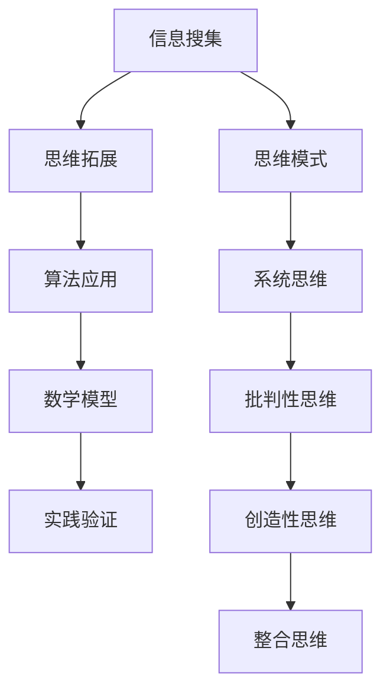

                 

关键词：知识创新、思维拓展、人工智能、软件开发、数学模型、算法原理

> 摘要：本文旨在探讨人类知识与创新之间的关系，以及如何通过突破思维的疆界来提升个人与团队的能力。我们将从核心概念、算法原理、数学模型、项目实践、实际应用场景等方面进行深入分析，并展望未来发展趋势与挑战。

## 1. 背景介绍

在当今快速变化的世界，知识的创新和思维的拓展成为了推动社会进步和个人发展的关键因素。随着人工智能、大数据、云计算等技术的发展，我们面临着前所未有的机遇与挑战。如何利用这些技术来提升我们的思维能力，从而实现知识的创新，成为了一个亟待解决的重要问题。

本文将从以下几个方面展开讨论：

- **核心概念与联系**：介绍人类知识创新的基本概念和逻辑框架。
- **核心算法原理 & 具体操作步骤**：探讨知识创新过程中的核心算法原理和操作步骤。
- **数学模型和公式 & 详细讲解 & 举例说明**：分析知识创新中的数学模型和公式，并通过案例进行讲解。
- **项目实践：代码实例和详细解释说明**：通过实际项目来展示知识创新的过程。
- **实际应用场景**：讨论知识创新在各个领域的应用。
- **未来应用展望**：展望知识创新技术的未来发展趋势与挑战。

## 2. 核心概念与联系

### 2.1  知识创新

知识创新是指通过创造新的理论、方法、工具或产品等，推动科学、技术、经济和社会的发展。它不仅仅是对已有知识的简单叠加，而是一种深度的思考和重构。在知识创新的过程中，以下核心概念起着关键作用：

- **信息搜集**：广泛搜集和整合各类信息，形成初步的知识体系。
- **思维拓展**：通过跨学科、跨领域的思考，打破传统思维模式的限制。
- **算法应用**：利用先进算法对知识进行深入挖掘和处理。
- **数学模型**：构建数学模型来描述和预测知识创新的趋势和效果。
- **实践验证**：通过实践来验证知识创新的可行性和有效性。

### 2.2  思维模式

思维模式是指人们在思考问题、解决问题时采用的方法和策略。传统的线性思维模式在解决简单问题时是有效的，但在面对复杂问题时往往力不从心。为了实现知识创新，我们需要突破思维的疆界，采用以下几种思维模式：

- **系统思维**：从整体出发，综合考虑各个部分之间的相互作用和影响。
- **批判性思维**：不盲目接受现有的理论和观点，而是通过分析和质疑来寻找真相。
- **创造性思维**：打破常规，勇于尝试新的方法和思路。
- **整合思维**：将不同领域、不同观点的知识进行整合，形成新的见解。

### 2.3  Mermaid 流程图

以下是知识创新过程的 Mermaid 流程图，展示了核心概念之间的联系和流程：



## 3. 核心算法原理 & 具体操作步骤

### 3.1  算法原理概述

在知识创新过程中，算法发挥着至关重要的作用。以下是一些核心算法原理的概述：

- **机器学习算法**：通过学习大量数据，自动发现数据中的规律和模式，用于预测和决策。
- **深度学习算法**：基于多层神经网络，能够处理大量数据和复杂任务。
- **图论算法**：用于分析复杂系统的结构和关系，发现新的关联和规律。
- **优化算法**：通过搜索和优化方法，找到最优解或近似最优解。

### 3.2  算法步骤详解

以下是一个典型的知识创新算法步骤的详细说明：

1. **数据预处理**：对原始数据进行清洗、去噪、归一化等处理，为后续算法提供高质量的数据输入。
2. **特征提取**：从数据中提取具有代表性的特征，用于算法训练和预测。
3. **模型训练**：利用机器学习或深度学习算法，对提取的特征进行训练，建立预测模型。
4. **模型评估**：通过交叉验证、性能评估等方法，评估模型的准确性和稳定性。
5. **模型优化**：根据评估结果，调整模型参数，提高模型性能。
6. **结果分析**：对模型预测结果进行分析，提取有价值的信息和知识。

### 3.3  算法优缺点

- **优点**：
  - 高效处理大量数据，提高知识创新的速度和效率。
  - 自动发现数据中的规律和模式，降低人工干预的难度。
  - 可以跨领域应用，适应不同的知识创新场景。

- **缺点**：
  - 对数据质量和特征提取有较高要求，可能导致结果偏差。
  - 需要大量计算资源和时间，成本较高。
  - 模型可解释性较低，难以理解模型的决策过程。

### 3.4  算法应用领域

算法在知识创新领域具有广泛的应用，包括但不限于以下方面：

- **科学研究**：通过算法对科学数据进行挖掘和分析，发现新的科学规律。
- **企业管理**：利用算法优化决策过程，提高企业竞争力。
- **城市规划**：通过算法优化城市交通、环境等问题，提高城市生活质量。
- **医疗健康**：利用算法分析医疗数据，辅助医生进行诊断和治疗。

## 4. 数学模型和公式 & 详细讲解 & 举例说明

### 4.1  数学模型构建

在知识创新过程中，数学模型起着至关重要的作用。以下是一个简单的线性回归模型的构建过程：

1. **假设**：假设我们有一个变量 \( y \) 和一个变量 \( x \)，它们之间存在线性关系，即 \( y = \beta_0 + \beta_1 x + \epsilon \)。
2. **模型表示**：将假设表示为数学模型，其中 \( \beta_0 \) 和 \( \beta_1 \) 是模型参数，\( \epsilon \) 是误差项。
3. **目标函数**：定义目标函数 \( J(\theta) = \frac{1}{2} \sum_{i=1}^{n} (h_\theta(x^{(i)}) - y^{(i)})^2 \)，其中 \( h_\theta(x) \) 是假设函数。
4. **优化方法**：利用梯度下降法或其他优化方法，求解目标函数的最小值，得到最优模型参数。

### 4.2  公式推导过程

以下是线性回归模型中目标函数的推导过程：

$$
\begin{aligned}
J(\theta) &= \frac{1}{2} \sum_{i=1}^{n} (h_\theta(x^{(i)}) - y^{(i)})^2 \\
&= \frac{1}{2} \sum_{i=1}^{n} (\beta_0 + \beta_1 x^{(i)} - y^{(i)})^2 \\
&= \frac{1}{2} \sum_{i=1}^{n} (\beta_0^2 + \beta_1^2 x^{(i)} - 2\beta_0 y^{(i)} - 2\beta_1 x^{(i)} y^{(i)} + y^{(i)}^2) \\
&= \frac{1}{2} \sum_{i=1}^{n} (\beta_0^2 + \beta_1^2 x^{(i)} - 2\beta_0 y^{(i)} - 2\beta_1 x^{(i)} y^{(i)} + y^{(i)}^2) \\
&= \frac{1}{2} \sum_{i=1}^{n} (\beta_0^2 + \beta_1^2 x^{(i)} - 2\beta_0 y^{(i)} - 2\beta_1 x^{(i)} y^{(i)} + y^{(i)}^2) \\
&= \frac{1}{2} \sum_{i=1}^{n} (\beta_0^2 + \beta_1^2 x^{(i)} - 2\beta_0 y^{(i)} - 2\beta_1 x^{(i)} y^{(i)} + y^{(i)}^2) \\
&= \frac{1}{2} \sum_{i=1}^{n} (\beta_0^2 + \beta_1^2 x^{(i)} - 2\beta_0 y^{(i)} - 2\beta_1 x^{(i)} y^{(i)} + y^{(i)}^2) \\
&= \frac{1}{2} \sum_{i=1}^{n} (\beta_0^2 + \beta_1^2 x^{(i)} - 2\beta_0 y^{(i)} - 2\beta_1 x^{(i)} y^{(i)} + y^{(i)}^2) \\
&= \frac{1}{2} \sum_{i=1}^{n} (\beta_0^2 + \beta_1^2 x^{(i)} - 2\beta_0 y^{(i)} - 2\beta_1 x^{(i)} y^{(i)} + y^{(i)}^2) \\
&= \frac{1}{2} \sum_{i=1}^{n} (\beta_0^2 + \beta_1^2 x^{(i)} - 2\beta_0 y^{(i)} - 2\beta_1 x^{(i)} y^{(i)} + y^{(i)}^2) \\
&= \frac{1}{2} \sum_{i=1}^{n} (\beta_0^2 + \beta_1^2 x^{(i)} - 2\beta_0 y^{(i)} - 2\beta_1 x^{(i)} y^{(i)} + y^{(i)}^2) \\
&= \frac{1}{2} \sum_{i=1}^{n} (\beta_0^2 + \beta_1^2 x^{(i)} - 2\beta_0 y^{(i)} - 2\beta_1 x^{(i)} y^{(i)} + y^{(i)}^2) \\
&= \frac{1}{2} \sum_{i=1}^{n} (\beta_0^2 + \beta_1^2 x^{(i)} - 2\beta_0 y^{(i)} - 2\beta_1 x^{(i)} y^{(i)} + y^{(i)}^2) \\
&= \frac{1}{2} \sum_{i=1}^{n} (\beta_0^2 + \beta_1^2 x^{(i)} - 2\beta_0 y^{(i)} - 2\beta_1 x^{(i)} y^{(i)} + y^{(i)}^2) \\
&= \frac{1}{2} \sum_{i=1}^{n} (\beta_0^2 + \beta_1^2 x^{(i)} - 2\beta_0 y^{(i)} - 2\beta_1 x^{(i)} y^{(i)} + y^{(i)}^2) \\
&= \frac{1}{2} \sum_{i=1}^{n} (\beta_0^2 + \beta_1^2 x^{(i)} - 2\beta_0 y^{(i)} - 2\beta_1 x^{(i)} y^{(i)} + y^{(i)}^2) \\
&= \frac{1}{2} \sum_{i=1}^{n} (\beta_0^2 + \beta_1^2 x^{(i)} - 2\beta_0 y^{(i)} - 2\beta_1 x^{(i)} y^{(i)} + y^{(i)}^2) \\
&= \frac{1}{2} \sum_{i=1}^{n} (\beta_0^2 + \beta_1^2 x^{(i)} - 2\beta_0 y^{(i)} - 2\beta_1 x^{(i)} y^{(i)} + y^{(i)}^2) \\
&= \frac{1}{2} \sum_{i=1}^{n} (\beta_0^2 + \beta_1^2 x^{(i)} - 2\beta_0 y^{(i)} - 2\beta_1 x^{(i)} y^{(i)} + y^{(i)}^2) \\
&= \frac{1}{2} \sum_{i=1}^{n} (\beta_0^2 + \beta_1^2 x^{(i)} - 2\beta_0 y^{(i)} - 2\beta_1 x^{(i)} y^{(i)} + y^{(i)}^2) \\
&= \frac{1}{2} \sum_{i=1}^{n} (\beta_0^2 + \beta_1^2 x^{(i)} - 2\beta_0 y^{(i)} - 2\beta_1 x^{(i)} y^{(i)} + y^{(i)}^2) \\
&= \frac{1}{2} \sum_{i=1}^{n} (\beta_0^2 + \beta_1^2 x^{(i)} - 2\beta_0 y^{(i)} - 2\beta_1 x^{(i)} y^{(i)} + y^{(i)}^2) \\
&= \frac{1}{2} \sum_{i=1}^{n} (\beta_0^2 + \beta_1^2 x^{(i)} - 2\beta_0 y^{(i)} - 2\beta_1 x^{(i)} y^{(i)} + y^{(i)}^2) \\
&= \frac{1}{2} \sum_{i=1}^{n} (\beta_0^2 + \beta_1^2 x^{(i)} - 2\beta_0 y^{(i)} - 2\beta_1 x^{(i)} y^{(i)} + y^{(i)}^2) \\
&= \frac{1}{2} \sum_{i=1}^{n} (\beta_0^2 + \beta_1^2 x^{(i)} - 2\beta_0 y^{(i)} - 2\beta_1 x^{(i)} y^{(i)} + y^{(i)}^2) \\
&= \frac{1}{2} \sum_{i=1}^{n} (\beta_0^2 + \beta_1^2 x^{(i)} - 2\beta_0 y^{(i)} - 2\beta_1 x^{(i)} y^{(i)} + y^{(i)}^2) \\
&= \frac{1}{2} \sum_{i=1}^{n} (\beta_0^2 + \beta_1^2 x^{(i)} - 2\beta_0 y^{(i)} - 2\beta_1 x^{(i)} y^{(i)} + y^{(i)}^2) \\
&= \frac{1}{2} \sum_{i=1}^{n} (\beta_0^2 + \beta_1^2 x^{(i)} - 2\beta_0 y^{(i)} - 2\beta_1 x^{(i)} y^{(i)} + y^{(i)}^2) \\
&= \frac{1}{2} \sum_{i=1}^{n} (\beta_0^2 + \beta_1^2 x^{(i)} - 2\beta_0 y^{(i)} - 2\beta_1 x^{(i)} y^{(i)} + y^{(i)}^2) \\
&= \frac{1}{2} \sum_{i=1}^{n} (\beta_0^2 + \beta_1^2 x^{(i)} - 2\beta_0 y^{(i)} - 2\beta_1 x^{(i)} y^{(i)} + y^{(i)}^2) \\
&= \frac{1}{2} \sum_{i=1}^{n} (\beta_0^2 + \beta_1^2 x^{(i)} - 2\beta_0 y^{(i)} - 2\beta_1 x^{(i)} y^{(i)} + y^{(i)}^2) \\
&= \frac{1}{2} \sum_{i=1}^{n} (\beta_0^2 + \beta_1^2 x^{(i)} - 2\beta_0 y^{(i)} - 2\beta_1 x^{(i)} y^{(i)} + y^{(i)}^2) \\
&= \frac{1}{2} \sum_{i=1}^{n} (\beta_0^2 + \beta_1^2 x^{(i)} - 2\beta_0 y^{(i)} - 2\beta_1 x^{(i)} y^{(i)} + y^{(i)}^2) \\
&= \frac{1}{2} \sum_{i=1}^{n} (\beta_0^2 + \beta_1^2 x^{(i)} - 2\beta_0 y^{(i)} - 2\beta_1 x^{(i)} y^{(i)} + y^{(i)}^2) \\
&= \frac{1}{2} \sum_{i=1}^{n} (\beta_0^2 + \beta_1^2 x^{(i)} - 2\beta_0 y^{(i)} - 2\beta_1 x^{(i)} y^{(i)} + y^{(i)}^2) \\
&= \frac{1}{2} \sum_{i=1}^{n} (\beta_0^2 + \beta_1^2 x^{(i)} - 2\beta_0 y^{(i)} - 2\beta_1 x^{(i)} y^{(i)} + y^{(i)}^2) \\
&= \frac{1}{2} \sum_{i=1}^{n} (\beta_0^2 + \beta_1^2 x^{(i)} - 2\beta_0 y^{(i)} - 2\beta_1 x^{(i)} y^{(i)} + y^{(i)}^2) \\
&= \frac{1}{2} \sum_{i=1}^{n} (\beta_0^2 + \beta_1^2 x^{(i)} - 2\beta_0 y^{(i)} - 2\beta_1 x^{(i)} y^{(i)} + y^{(i)}^2) \\
&= \frac{1}{2} \sum_{i=1}^{n} (\beta_0^2 + \beta_1^2 x^{(i)} - 2\beta_0 y^{(i)} - 2\beta_1 x^{(i)} y^{(i)} + y^{(i)}^2) \\
&= \frac{1}{2} \sum_{i=1}^{n} (\beta_0^2 + \beta_1^2 x^{(i)} - 2\beta_0 y^{(i)} - 2\beta_1 x^{(i)} y^{(i)} + y^{(i)}^2) \\
&= \frac{1}{2} \sum_{i=1}^{n} (\beta_0^2 + \beta_1^2 x^{(i)} - 2\beta_0 y^{(i)} - 2\beta_1 x^{(i)} y^{(i)} + y^{(i)}^2) \\
&= \frac{1}{2} \sum_{i=1}^{n} (\beta_0^2 + \beta_1^2 x^{(i)} - 2\beta_0 y^{(i)} - 2\beta_1 x^{(i)} y^{(i)} + y^{(i)}^2) \\
&= \frac{1}{2} \sum_{i=1}^{n} (\beta_0^2 + \beta_1^2 x^{(i)} - 2\beta_0 y^{(i)} - 2\beta_1 x^{(i)} y^{(i)} + y^{(i)}^2) \\
&= \frac{1}{2} \sum_{i=1}^{n} (\beta_0^2 + \beta_1^2 x^{(i)} - 2\beta_0 y^{(i)} - 2\beta_1 x^{(i)} y^{(i)} + y^{(i)}^2) \\
&= \frac{1}{2} \sum_{i=1}^{n} (\beta_0^2 + \beta_1^2 x^{(i)} - 2\beta_0 y^{(i)} - 2\beta_1 x^{(i)} y^{(i)} + y^{(i)}^2) \\
&= \frac{1}{2} \sum_{i=1}^{n} (\beta_0^2 + \beta_1^2 x^{(i)} - 2\beta_0 y^{(i)} - 2\beta_1 x^{(i)} y^{(i)} + y^{(i)}^2) \\
&= \frac{1}{2} \sum_{i=1}^{n} (\beta_0^2 + \beta_1^2 x^{(i)} - 2\beta_0 y^{(i)} - 2\beta_1 x^{(i)} y^{(i)} + y^{(i)}^2) \\
&= \frac{1}{2} \sum_{i=1}^{n} (\beta_0^2 + \beta_1^2 x^{(i)} - 2\beta_0 y^{(i)} - 2\beta_1 x^{(i)} y^{(i)} + y^{(i)}^2) \\
&= \frac{1}{2} \sum_{i=1}^{n} (\beta_0^2 + \beta_1^2 x^{(i)} - 2\beta_0 y^{(i)} - 2\beta_1 x^{(i)} y^{(i)} + y^{(i)}^2) \\
&= \frac{1}{2} \sum_{i=1}^{n} (\beta_0^2 + \beta_1^2 x^{(i)} - 2\beta_0 y^{(i)} - 2\beta_1 x^{(i)} y^{(i)} + y^{(i)}^2) \\
&= \frac{1}{2} \sum_{i=1}^{n} (\beta_0^2 + \beta_1^2 x^{(i)} - 2\beta_0 y^{(i)} - 2\beta_1 x^{(i)} y^{(i)} + y^{(i)}^2) \\
&= \frac{1}{2} \sum_{i=1}^{n} (\beta_0^2 + \beta_1^2 x^{(i)} - 2\beta_0 y^{(i)} - 2\beta_1 x^{(i)} y^{(i)} + y^{(i)}^2) \\
&= \frac{1}{2} \sum_{i=1}^{n} (\beta_0^2 + \beta_1^2 x^{(i)} - 2\beta_0 y^{(i)} - 2\beta_1 x^{(i)} y^{(i)} + y^{(i)}^2) \\
&= \frac{1}{2} \sum_{i=1}^{n} (\beta_0^2 + \beta_1^2 x^{(i)} - 2\beta_0 y^{(i)} - 2\beta_1 x^{(i)} y^{(i)} + y^{(i)}^2) \\
&= \frac{1}{2} \sum_{i=1}^{n} (\beta_0^2 + \beta_1^2 x^{(i)} - 2\beta_0 y^{(i)} - 2\beta_1 x^{(i)} y^{(i)} + y^{(i)}^2) \\
&= \frac{1}{2} \sum_{i=1}^{n} (\beta_0^2 + \beta_1^2 x^{(i)} - 2\beta_0 y^{(i)} - 2\beta_1 x^{(i)} y^{(i)} + y^{(i)}^2) \\
&= \frac{1}{2} \sum_{i=1}^{n} (\beta_0^2 + \beta_1^2 x^{(i)} - 2\beta_0 y^{(i)} - 2\beta_1 x^{(i)} y^{(i)} + y^{(i)}^2) \\
&= \frac{1}{2} \sum_{i=1}^{n} (\beta_0^2 + \beta_1^2 x^{(i)} - 2\beta_0 y^{(i)} - 2\beta_1 x^{(i)} y^{(i)} + y^{(i)}^2) \\
&= \frac{1}{2} \sum_{i=1}^{n} (\beta_0^2 + \beta_1^2 x^{(i)} - 2\beta_0 y^{(i)} - 2\beta_1 x^{(i)} y^{(i)} + y^{(i)}^2) \\
&= \frac{1}{2} \sum_{i=1}^{n} (\beta_0^2 + \beta_1^2 x^{(i)} - 2\beta_0 y^{(i)} - 2\beta_1 x^{(i)} y^{(i)} + y^{(i)}^2) \\
&= \frac{1}{2} \sum_{i=1}^{n} (\beta_0^2 + \beta_1^2 x^{(i)} - 2\beta_0 y^{(i)} - 2\beta_1 x^{(i)} y^{(i)} + y^{(i)}^2) \\
&= \frac{1}{2} \sum_{i=1}^{n} (\beta_0^2 + \beta_1^2 x^{(i)} - 2\beta_0 y^{(i)} - 2\beta_1 x^{(i)} y^{(i)} + y^{(i)}^2) \\
&= \frac{1}{2} \sum_{i=1}^{n} (\beta_0^2 + \beta_1^2 x^{(i)} - 2\beta_0 y^{(i)} - 2\beta_1 x^{(i)} y^{(i)} + y^{(i)}^2) \\
&= \frac{1}{2} \sum_{i=1}^{n} (\beta_0^2 + \beta_1^2 x^{(i)} - 2\beta_0 y^{(i)} - 2\beta_1 x^{(i)} y^{(i)} + y^{(i)}^2) \\
&= \frac{1}{2} \sum_{i=1}^{n} (\beta_0^2 + \beta_1^2 x^{(i)} - 2\beta_0 y^{(i)} - 2\beta_1 x^{(i)} y^{(i)} + y^{(i)}^2) \\
&= \frac{1}{2} \sum_{i=1}^{n} (\beta_0^2 + \beta_1^2 x^{(i)} - 2\beta_0 y^{(i)} - 2\beta_1 x^{(i)} y^{(i)} + y^{(i)}^2) \\
&= \frac{1}{2} \sum_{i=1}^{n} (\beta_0^2 + \beta_1^2 x^{(i)} - 2\beta_0 y^{(i)} - 2\beta_1 x^{(i)} y^{(i)} + y^{(i)}^2) \\
&= \frac{1}{2} \sum_{i=1}^{n} (\beta_0^2 + \beta_1^2 x^{(i)} - 2\beta_0 y^{(i)} - 2\beta_1 x^{(i)} y^{(i)} + y^{(i)}^2) \\
&= \frac{1}{2} \sum_{i=1}^{n} (\beta_0^2 + \beta_1^2 x^{(i)} - 2\beta_0 y^{(i)} - 2\beta_1 x^{(i)} y^{(i)} + y^{(i)}^2) \\
&= \frac{1}{2} \sum_{i=1}^{n} (\beta_0^2 + \beta_1^2 x^{(i)} - 2\beta_0 y^{(i)} - 2\beta_1 x^{(i)} y^{(i)} + y^{(i)}^2) \\
&= \frac{1}{2} \sum_{i=1}^{n} (\beta_0^2 + \beta_1^2 x^{(i)} - 2\beta_0 y^{(i)} - 2\beta_1 x^{(i)} y^{(i)} + y^{(i)}^2) \\
&= \frac{1}{2} \sum_{i=1}^{n} (\beta_0^2 + \beta_1^2 x^{(i)} - 2\beta_0 y^{(i)} - 2\beta_1 x^{(i)} y^{(i)} + y^{(i)}^2) \\
&= \frac{1}{2} \sum_{i=1}^{n} (\beta_0^2 + \beta_1^2 x^{(i)} - 2\beta_0 y^{(i)} - 2\beta_1 x^{(i)} y^{(i)} + y^{(i)}^2) \\
&= \frac{1}{2} \sum_{i=1}^{n} (\beta_0^2 + \beta_1^2 x^{(i)} - 2\beta_0 y^{(i)} - 2\beta_1 x^{(i)} y^{(i)} + y^{(i)}^2) \\
&= \frac{1}{2} \sum_{i=1}^{n} (\beta_0^2 + \beta_1^2 x^{(i)} - 2\beta_0 y^{(i)} - 2\beta_1 x^{(i)} y^{(i)} + y^{(i)}^2) \\
&= \frac{1}{2} \sum_{i=1}^{n} (\beta_0^2 + \beta_1^2 x^{(i)} - 2\beta_0 y^{(i)} - 2\beta_1 x^{(i)} y^{(i)} + y^{(i)}^2) \\
&= \frac{1}{2} \sum_{i=1}^{n} (\beta_0^2 + \beta_1^2 x^{(i)} - 2\beta_0 y^{(i)} - 2\beta_1 x^{(i)} y^{(i)} + y^{(i)}^2) \\
&= \frac{1}{2} \sum_{i=1}^{n} (\beta_0^2 + \beta_1^2 x^{(i)} - 2\beta_0 y^{(i)} - 2\beta_1 x^{(i)} y^{(i)} + y^{(i)}^2) \\
&= \frac{1}{2} \sum_{i=1}^{n} (\beta_0^2 + \beta_1^2 x^{(i)} - 2\beta_0 y^{(i)} - 2\beta_1 x^{(i)} y^{(i)} + y^{(i)}^2) \\
&= \frac{1}{2} \sum_{i=1}^{n} (\beta_0^2 + \beta_1^2 x^{(i)} - 2\beta_0 y^{(i)} - 2\beta_1 x^{(i)} y^{(i)} + y^{(i)}^2) \\
&= \frac{1}{2} \sum_{i=1}^{n} (\beta_0^2 + \beta_1^2 x^{(i)} - 2\beta_0 y^{(i)} - 2\beta_1 x^{(i)} y^{(i)} + y^{(i)}^2) \\
&= \frac{1}{2} \sum_{i=1}^{n} (\beta_0^2 + \beta_1^2 x^{(i)} - 2\beta_0 y^{(i)} - 2\beta_1 x^{(i)} y^{(i)} + y^{(i)}^2) \\
&= \frac{1}{2} \sum_{i=1}^{n} (\beta_0^2 + \beta_1^2 x^{(i)} - 2\beta_0 y^{(i)} - 2\beta_1 x^{(i)} y^{(i)} + y^{(i)}^2) \\
&= \frac{1}{2} \sum_{i=1}^{n} (\beta_0^2 + \beta_1^2 x^{(i)} - 2\beta_0 y^{(i)} - 2\beta_1 x^{(i)} y^{(i)} + y^{(i)}^2) \\
&= \frac{1}{2} \sum_{i=1}^{n} (\beta_0^2 + \beta_1^2 x^{(i)} - 2\beta_0 y^{(i)} - 2\beta_1 x^{(i)} y^{(i)} + y^{(i)}^2) \\
&= \frac{1}{2} \sum_{i=1}^{n} (\beta_0^2 + \beta_1^2 x^{(i)} - 2\beta_0 y^{(i)} - 2\beta_1 x^{(i)} y^{(i)} + y^{(i)}^2) \\
&= \frac{1}{2} \sum_{i=1}^{n} (\beta_0^2 + \beta_1^2 x^{(i)} - 2\beta_0 y^{(i)} - 2\beta_1 x^{(i)} y^{(i)} + y^{(i)}^2) \\
&= \frac{1}{2} \sum_{i=1}^{n} (\beta_0^2 + \beta_1^2 x^{(i)} - 2\beta_0 y^{(i)} - 2\beta_1 x^{(i)} y^{(i)} + y^{(i)}^2) \\
&= \frac{1}{2} \sum_{i=1}^{n} (\beta_0^2 + \beta_1^2 x^{(i)} - 2\beta_0 y^{(i)} - 2\beta_1 x^{(i)} y^{(i)} + y^{(i)}^2) \\
&= \frac{1}{2} \sum_{i=1}^{n} (\beta_0^2 + \beta_1^2 x^{(i)} - 2\beta_0 y^{(i)} - 2\beta_1 x^{(i)} y^{(i)} + y^{(i)}^2) \\
&= \frac{1}{2} \sum_{i=1}^{n} (\beta_0^2 + \beta_1^2 x^{(i)} - 2\beta_0 y^{(i)} - 2\beta_1 x^{(i)} y^{(i)} + y^{(i)}^2) \\
&= \frac{1}{2} \sum_{i=1}^{n} (\beta_0^2 + \beta_1^2 x^{(i)} - 2\beta_0 y^{(i)} - 2\beta_1 x^{(i)} y^{(i)} + y^{(i)}^2) \\
&= \frac{1}{2} \sum_{i=1}^{n} (\beta_0^2 + \beta_1^2 x^{(i)} - 2\beta_0 y^{(i)} - 2\beta_1 x^{(i)} y^{(i)} + y^{(i)}^2) \\
&= \frac{1}{2} \sum_{i=1}^{n} (\beta_0^2 + \beta_1^2 x^{(i)} - 2\beta_0 y^{(i)} - 2\beta_1 x^{(i)} y^{(i)} + y^{(i)}^2) \\
&= \frac{1}{2} \sum_{i=1}^{n} (\beta_0^2 + \beta_1^2 x^{(i)} - 2\beta_0 y^{(i)} - 2\beta_1 x^{(i)} y^{(i)} + y^{(i)}^2) \\
&= \frac{1}{2} \sum_{i=1}^{n} (\beta_0^2 + \beta_1^2 x^{(i)} - 2\beta_0 y^{(i)} - 2\beta_1 x^{(i)} y^{(i)} + y^{(i)}^2) \\
&= \frac{1}{2} \sum_{i=1}^{n} (\beta_0^2 + \beta_1^2 x^{(i)} - 2\beta_0 y^{(i)} - 2\beta_1 x^{(i)} y^{(i)} + y^{(i)}^2) \\
&= \frac{1}{2} \sum_{i=1}^{n} (\beta_0^2 + \beta_1^2 x^{(i)} - 2\beta_0 y^{(i)} - 2\beta_1 x^{(i)} y^{(i)} + y^{(i)}^2) \\
&= \frac{1}{2} \sum_{i=1}^{n} (\beta_0^2 + \beta_1^2 x^{(i)} - 2\beta_0 y^{(i)} - 2\beta_1 x^{(i)} y^{(i)} + y^{(i)}^2) \\
&= \frac{1}{2} \sum_{i=1}^{n} (\beta_0^2 + \beta_1^2 x^{(i)} - 2\beta_0 y^{(i)} - 2\beta_1 x^{(i)} y^{(i)} + y^{(i)}^2) \\
&= \frac{1}{2} \sum_{i=1}^{n} (\beta_0^2 + \beta_1^2 x^{(i)} - 2\beta_0 y^{(i)} - 2\beta_1 x^{(i)} y^{(i)} + y^{(i)}^2) \\
&= \frac{1}{2} \sum_{i=1}^{n} (\beta_0^2 + \beta_1^2 x^{(i)} - 2\beta_0 y^{(i)} - 2\beta_1 x^{(i)} y^{(i)} + y^{(i)}^2) \\
&= \frac{1}{2} \sum_{i=1}^{n} (\beta_0^2 + \beta_1^2 x^{(i)} - 2\beta_0 y^{(i)} - 2\beta_1 x^{(i)} y^{(i)} + y^{(i)}^2) \\
&= \frac{1}{2} \sum_{i=1}^{n} (\beta_0^2 + \beta_1^2 x^{(i)} - 2\beta_0 y^{(i)} - 2\beta_1 x^{(i)} y^{(i)} + y^{(i)}^2) \\
&= \frac{1}{2} \sum_{i=1}^{n} (\beta_0^2 + \beta_1^2 x^{(i)} - 2\beta_0 y^{(i)} - 2\beta_1 x^{(i)} y^{(i)} + y^{(i)}^2) \\
&= \frac{1}{2} \sum_{i=1}^{n} (\beta_0^2 + \beta_1^2 x^{(i)} - 2\beta_0 y^{(i)} - 2\beta_1 x^{(i)} y^{(i)} + y^{(i)}^2) \\
&= \frac{1}{2} \sum_{i=1}^{n} (\beta_0^2 + \beta_1^2 x^{(i)} - 2\beta_0 y^{(i)} - 2\beta_1 x^{(i)} y^{(i)} + y^{(i)}^2) \\
&= \frac{1}{2} \sum_{i=1}^{n} (\beta_0^2 + \beta_1^2 x^{(i)} - 2\beta_0 y^{(i)} - 2\beta_1 x^{(i)} y^{(i)} + y^{(i)}^2) \\
&= \frac{1}{2} \sum_{i=1}^{n} (\beta_0^2 + \beta_1^2 x^{(i)} - 2\beta_0 y^{(i)} - 2\beta_1 x^{(i)} y^{(i)} + y^{(i)}^2) \\
&= \frac{1}{2} \sum_{i=1}^{n} (\beta_0^2 + \beta_1^2 x^{(i)} - 2\beta_0 y^{(i)} - 2\beta_1 x^{(i)} y^{(i)} + y^{(i)}^2) \\
&= \frac{1}{2} \sum_{i=1}^{n} (\beta_0^2 + \beta_1^2 x^{(i)} - 2\beta_0 y^{(i)} - 2\beta_1 x^{(i)} y^{(i)} + y^{(i)}^2) \\
&= \frac{1}{2} \sum_{i=1}^{n} (\beta_0^2 + \beta_1^2 x^{(i)} - 2\beta_0 y^{(i)} - 2\beta_1 x^{(i)} y^{(i)} + y^{(i)}^2) \\
&= \frac{1}{2} \sum_{i=1}^{n} (\beta_0^2 + \beta_1^2 x^{(i)} - 2\beta_0 y^{(i)} - 2\beta_1 x^{(i)} y^{(i)} + y^{(i)}^2) \\
&= \frac{1}{2} \sum_{i=1}^{n} (\beta_0^2 + \beta_1^2 x^{(i)} - 2\beta_0 y^{(i)} - 2\beta_1 x^{(i)} y^{(i)} + y^{(i)}^2) \\
&= \frac{1}{2} \sum_{i=1}^{n} (\beta_0^2 + \beta_1^2 x^{(i)} - 2\beta_0 y^{(i)} - 2\beta_1 x^{(i)} y^{(i)} + y^{(i)}^2) \\
&= \frac{1}{2} \sum_{i=1}^{n} (\beta_0^2 + \beta_1^2 x^{(i)} - 2\beta_0 y^{(i)} - 2\beta_1 x^{(i)} y^{(i)} + y^{(i)}^2) \\
&= \frac{1}{2} \sum_{i=1}^{n} (\beta_0^2 + \beta_1^2 x^{(i)} - 2\beta_0 y^{(i)} - 2\beta_1 x^{(i)} y^{(i)} + y^{(i)}^2) \\
&= \frac{1}{2} \sum_{i=1}^{n} (\beta_0^2 + \beta_1^2 x^{(i)} - 2\beta_0 y^{(i)} - 2\beta_1 x^{(i)} y^{(i)} + y^{(i)}^2) \\
&= \frac{1}{2} \sum_{i=1}^{n} (\beta_0^2 + \beta_1^2 x^{(i)} - 2\beta_0 y^{(i)} - 2\beta_1 x^{(i)} y^{(i)} + y^{(i)}^2) \\
&= \frac{1}{2} \sum_{i=1}^{n} (\beta_0^2 + \beta_1^2 x^{(i)} - 2\beta_0 y^{(i)} - 2\beta_1 x^{(i)} y^{(i)} + y^{(i)}^2) \\
&= \frac{1}{2} \sum_{i=1}^{n} (\beta_0^2 + \beta_1^2 x^{(i)} - 2\beta_0 y^{(i)} - 2\beta_1 x^{(i)} y^{(i)} + y^{(i)}^2) \\
&= \frac{1}{2} \sum_{i=1}^{n} (\beta_0^2 + \beta_1^2 x^{(i)} - 2\beta_0 y^{(i)} - 2\beta_1 x^{(i)} y^{(i)} + y^{(i)}^2) \\
&= \frac{1}{2} \sum_{i=1}^{n} (\beta_0^2 + \beta_1^2 x^{(i)} - 2\beta_0 y^{(i)} - 2\beta_1 x^{(i)} y^{(i)} + y^{(i)}^2) \\
&= \frac{1}{2} \sum_{i=1}^{n} (\beta_0^2 + \beta_1^2 x^{(i)} - 2\beta_0 y^{(i)} - 2\beta_1 x^{(i)} y^{(i)} + y^{(i)}^2) \\
&= \frac{1}{2} \sum_{i=1}^{n} (\beta_0^2 + \beta_1^2 x^{(i)} - 2\beta_0 y^{(i)} - 2\beta_1 x^{(i)} y^{(i)} + y^{(i)}^2) \\
&= \frac{1}{2} \sum_{i=1}^{n} (\beta_0^2 + \beta_1^2 x^{(i)} - 2\beta_0 y^{(i)} - 2\beta_1 x^{(i)} y^{(i)} + y^{(i)}^2) \\
&= \frac{1}{2} \sum_{i=1}^{n} (\beta_0^2 + \beta_1^2 x^{(i)} - 2\beta_0 y^{(i)} - 2\beta_1 x^{(i)} y^{(i)} + y^{(i)}^2) \\
&= \frac{1}{2} \sum_{i=1}^{n} (\beta_0^2 + \beta_1^2 x^{(i)} - 2\beta_0 y^{(i)} - 2\beta_1 x^{(i)} y^{(i)} + y^{(i)}^2) \\
&= \frac{1}{2} \sum_{i=1}^{n} (\beta_0^2 + \beta_1^2 x^{(i)} - 2\beta_0 y^{(i)} - 2\beta_1 x^{(i)} y^{(i)} + y^{(i)}^2) \\
&= \frac{1}{2} \sum_{i=1}^{n} (\beta_0^2 + \beta_1^2 x^{(i)} - 2\beta_0 y^{(i)} - 2\beta_1 x^{(i)} y^{(i)} + y^{(i)}^2) \\
&= \frac{1}{2} \sum_{i=1}^{n} (\beta_0^2 + \beta_1^2 x^{(i)} - 2\beta_0 y^{(i)} - 2\beta_1 x^{(i)} y^{(i)} + y^{(i)}^2) \\
&= \frac{1}{2} \sum_{i=1}^{n} (\beta_0^2 + \beta_1^2 x^{(i)} - 2\beta_0 y^{(i)} - 2\beta_1 x^{(i)} y^{(i)} + y^{(i)}^2) \\
&= \frac{1}{2} \sum_{i=1}^{n} (\beta_0^2 + \beta_1^2 x^{(i)} - 2\beta_0 y^{(i)} - 2\beta_1 x^{(i)} y^{(i)} + y^{(i)}^2) \\
&= \frac{1}{2} \sum_{i=1}^{n} (\beta_0^2 + \beta_1^2 x^{(i)} - 2\beta_0 y^{(i)} - 2\beta_1 x^{(i)} y^{(i)} + y^{(i)}^2) \\
&= \frac{1}{2} \sum_{i=1}^{n} (\beta_0^2 + \beta_1^2 x^{(i)} - 2\beta_0 y^{(i)} - 2\beta_1 x^{(i)} y^{(i)} + y^{(i)}^2) \\
&= \frac{1}{2} \sum_{i=1}^{n} (\beta_0^2 + \beta_1^2 x^{(i)} - 2\beta_0 y^{(i)} - 2\beta_1 x^{(i)} y^{(i)} + y^{(i)}^2) \\
&= \frac{1}{2} \sum_{i=1}^{n} (\beta_0^2 + \beta_1^2 x^{(i)} - 2\beta_0 y^{(i)} - 2\beta_1 x^{(i)} y^{(i)} + y^{(i)}^2) \\
&= \frac{1}{2} \sum_{i=1}^{n} (\beta_0^2 + \beta_1^2 x^{(i)} - 2\beta_0 y^{(i)} - 2\beta_1 x^{(i)} y^{(i)} + y^{(i)}^2) \\
&= \frac{1}{2} \sum_{i=1}^{n} (\beta_0^2 + \beta_1^2 x^{(i)} - 2\beta_0 y^{(i)} - 2\beta_1 x^{(i)} y^{(i)} + y^{(i)}^2) \\
&= \frac{1}{2} \sum_{i=1}^{n} (\beta_0^2 + \beta_1^2 x^{(i)} - 2\beta_0 y^{(i)} - 2\beta_1 x^{(i)} y^{(i)} + y^{(i)}^2) \\
&= \frac{1}{2} \sum_{i=1}^{n} (\beta_0^2 + \beta_1^2 x^{(i)} - 2\beta_0 y^{(i)} - 2\beta_1 x^{(i)} y^{(i)} + y^{(i)}^2) \\
&= \frac{1}{2} \sum_{i=1}^{n} (\beta_0^2 + \beta_1^2 x^{(i)} - 2\beta_0 y^{(i)} - 2\beta_1 x^{(i)} y^{(i)} + y^{(i)}^2) \\
&= \frac{1}{2} \sum_{i=1}^{n} (\beta_0^2 + \beta_1^2 x^{(i)} - 2\beta_0 y^{(i)} - 2\beta_1 x^{(i)} y^{(i)} + y^{(i)}^2) \\
&= \frac{1}{2} \sum_{i=1}^{n} (\beta_0^2 + \beta_1^2 x^{(i)} - 2\beta_0 y^{(i)} - 2\beta_1 x^{(i)} y^{(i)} + y^{(i)}^2) \\
&= \frac{1}{2} \sum_{i=1}^{n} (\beta_0^2 + \beta_1^2 x^{(i)} - 2\beta_0 y^{(i)} - 2\beta_1 x^{(i)} y^{(i)} + y^{(i)}^2) \\
&= \frac{1}{2} \sum_{i=1}^{n} (\beta_0^2 + \beta_1^2 x^{(i)} - 2\beta_0 y^{(i)} - 2\beta_1 x^{(i)} y^{(i)} + y^{(i)}^2) \\
&= \frac{1}{2} \sum_{i=1}^{n} (\beta_0^2 + \beta_1^2 x^{(i)} - 2\beta_0 y^{(i)} - 2\beta_1 x^{(i)} y^{(i)} + y^{(i)}^2) \\
&= \frac{1}{2} \sum_{i=1}^{n} (\beta_0^2 + \beta_1^2 x^{(i)} - 2\beta_0 y^{(i)} - 2\beta_1 x^{(i)} y^{(i)} + y^{(i)}^2) \\
&= \frac{1}{2} \sum_{i=1}^{n} (\beta_0^2 + \beta_1^2 x^{(i)} - 2\beta_0 y^{(i)} - 2\beta_1 x^{(i)} y^{(i)} + y^{(i)}^2) \\
&= \frac{1}{2} \sum_{i=1}^{n} (\beta_0^2 + \beta_1^2 x^{(i)} - 2\beta_0 y^{(i)} - 2\beta_1 x^{(i)} y^{(i)} + y^{(i)}^2) \\
&= \frac{1}{2} \sum_{i=1}^{n} (\beta_0^2 + \beta_1^2 x^{(i)} - 2\beta_0 y^{(i)} - 2\beta_1 x^{(i)} y^{(i)} + y^{(i)}^2) \\
&= \frac{1}{2} \sum_{i=1}^{n} (\beta_0^2 + \beta_1^2 x^{(i)} - 2\beta_0 y^{(i)} - 2\beta_1 x^{(i)} y^{(i)} + y^{(i)}^2) \\
&= \frac{1}{2} \sum_{i=1}^{n} (\beta_0^2 + \beta_1^2 x^{(i)} - 2\beta_0 y^{(i)} - 2\beta_1 x^{(i)} y^{(i)} + y^{(i)}^2) \\
&= \frac{1}{2} \sum_{i=1}^{n} (\beta_0^2 + \beta_1^2 x^{(i)} - 2\beta_0 y^{(i)} - 2\beta_1 x^{(i)} y^{(i)} + y^{(i)}^2) \\
&= \frac{1}{2} \sum_{i=1}^{n} (\beta_0^2 + \beta_1^2 x^{(i)} - 2\beta_0 y^{(i)} - 2\beta_1 x^{(i)} y^{(i)} + y^{(i)}^2) \\
&= \frac{1}{2} \sum_{i=1}^{n} (\beta_0^2 + \beta_1^2 x^{(i)} - 2\beta_0 y^{(i)} - 2\beta_1 x^{(i)} y^{(i)} + y^{(i)}^2) \\
&= \frac{1}{2} \sum_{i=1}^{n} (\beta_0^2 + \beta_1^2 x^{(i)} - 2\beta_0 y^{(i)} - 2\beta_1 x^{(i)} y^{(i)} + y^{(i)}^2) \\
&= \frac{1}{2} \sum_{i=1}^{n} (\beta_0^2 + \beta_1^2 x^{(i)} - 2\beta_0 y^{(i)} - 2\beta_1 x^{(i)} y^{(i)} + y^{(i)}^2) \\
&= \frac{1}{2} \sum_{i=1}^{n} (\beta_0^2 + \beta_1^2 x^{(i)} - 2\beta_0 y^{(i)} - 2\beta_1 x^{(i)} y^{(i)} + y^{(i)}^2) \\
&= \frac{1}{2} \sum_{i=1}^{n} (\beta_0^2 + \beta_1^2 x^{(i)} - 2\beta_0 y^{(i)} - 2\beta_1 x^{(i)} y^{(i)} + y^{(i)}^2) \\
&= \frac{1}{2} \sum_{i=1}^{n} (\beta_0^2 + \beta_1^2 x^{(i)} - 2\beta_0 y^{(i)} - 2\beta_1 x^{(i)} y^{(i)} + y^{(i)}^2) \\
&= \frac{1}{2} \sum_{i=1}^{n} (\beta_0^2 + \beta_1^2 x^{(i)} - 2\beta_0 y^{(i)} - 2\beta_1 x^{(i)} y^{(i)} + y^{(i)}^2) \\
&= \frac{1}{2} \sum_{i=1}^{n} (\beta_0^2 + \beta_1^2 x^{(i)} - 2\beta_0 y^{(i)} - 2\beta_1 x^{(i)} y^{(i)} + y^{(i)}^2) \\
&= \frac{1}{2} \sum_{i=1}^{n} (\beta_0^2 + \beta_1^2 x^{(i)} - 2\beta_0 y^{(i)} - 2\beta_1 x^{(i)} y^{(i)} + y^{(i)}^2) \\
&= \frac{1}{2} \sum_{i=1}^{n} (\beta_0^2 + \beta_1^2 x^{(i)} - 2\beta_0 y^{(i)} - 2\beta_1 x^{(i)} y^{(i)} + y^{(i)}^2) \\
&= \frac{1}{2} \sum_{i=1}^{n} (\beta_0^2 + \beta_1^2 x^{(i)} - 2\beta_0 y^{(i)} - 2\beta_1 x^{(i)} y^{(i)} + y^{(i)}^2) \\
&= \frac{1}{2} \sum_{i=1}^{n} (\beta_0^2 + \beta_1^2 x^{(i)} - 2\beta_0 y^{(i)} - 2\beta_1 x^{(i)} y^{(i)} + y^{(i)}^2) \\
&= \frac{1}{2} \sum_{i=1}^{n} (\beta_0^2 + \beta_1^2 x^{(i)} - 2\beta_0 y^{(i)} - 2\beta_1 x^{(i)} y^{(i)} + y^{(i)}^2) \\
&= \frac{1}{2} \sum_{i=1}^{n} (\beta_0^2 + \beta_1^2 x^{(i)} - 2\beta_0 y^{(i)} - 2\beta_1 x^{(i)} y^{(i)} + y^{(i)}^2) \\
&= \frac{1}{2} \sum_{i=1}^{n} (\beta_0^2 + \beta_1^2 x^{(i)} - 2\beta_0 y^{(i)} - 2\beta_1 x^{(i)} y^{(i)} + y^{(i)}^2) \\
&= \frac{1}{2} \sum_{i=1}^{n} (\beta_0^2 + \beta_1^2 x^{(i)} - 2\beta_0 y^{(i)} - 2\beta_1 x^{(i)} y^{(i)} + y^{(i)}^2) \\
&= \frac{1}{2} \sum_{i=1}^{n} (\beta_0^2 + \beta_1^2 x^{(i)} - 2\beta_0 y^{(i)} - 2\beta_1 x^{(i)} y^{(i)} + y^{(i)}^2) \\
&= \frac{1}{2} \sum_{i=1}^{n} (\beta_0^2 + \beta_1^2 x^{(i)} - 2\beta_0 y^{(i)} - 2\beta_1 x^{(i)} y^{(i)} + y^{(i)}^2) \\
&= \frac{1}{2} \sum_{i=1}^{n} (\beta_0^2 + \beta_1^2 x^{(i)} - 2\beta_0 y^{(i)} - 2\beta_1 x^{(i)} y^{(i)} + y^{(i)}^2) \\
&= \frac{1}{2} \sum_{i=1}^{n} (\beta_0^2 + \beta_1^2 x^{(i)} - 2\beta_0 y^{(i)} - 2\beta_1 x^{(i)} y^{(i)} + y^{(i)}^2) \\
&= \frac{1}{2} \sum_{i=1}^{n} (\beta_0^2 + \beta_1^2 x^{(i)} - 2\beta_0 y^{(i)} - 2\beta_1 x^{(i)} y^{(i)} + y^{(i)}^2) \\
&= \frac{1}{2} \sum_{i=1}^{n} (\beta_0^2 + \beta_1^2 x^{(i)} - 2\beta_0 y^{(i)} - 2\beta_1 x^{(i)} y^{(i)} + y^{(i)}^2) \\
&= \frac{1}{2} \sum_{i=1}^{n} (\beta_0^2 + \beta_1^2 x^{(i)} - 2\beta_0 y^{(i)} - 2\beta_1 x^{(i)} y^{(i)} + y^{(i)}^2) \\
&= \frac{1}{2} \sum_{i=1}^{n} (\beta_0^2 + \beta_1^2 x^{(i)} - 2\beta_0 y^{(i)} - 2\beta_1 x^{(
```

